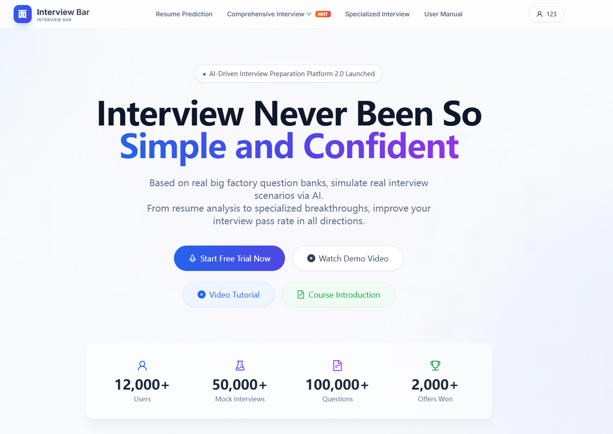
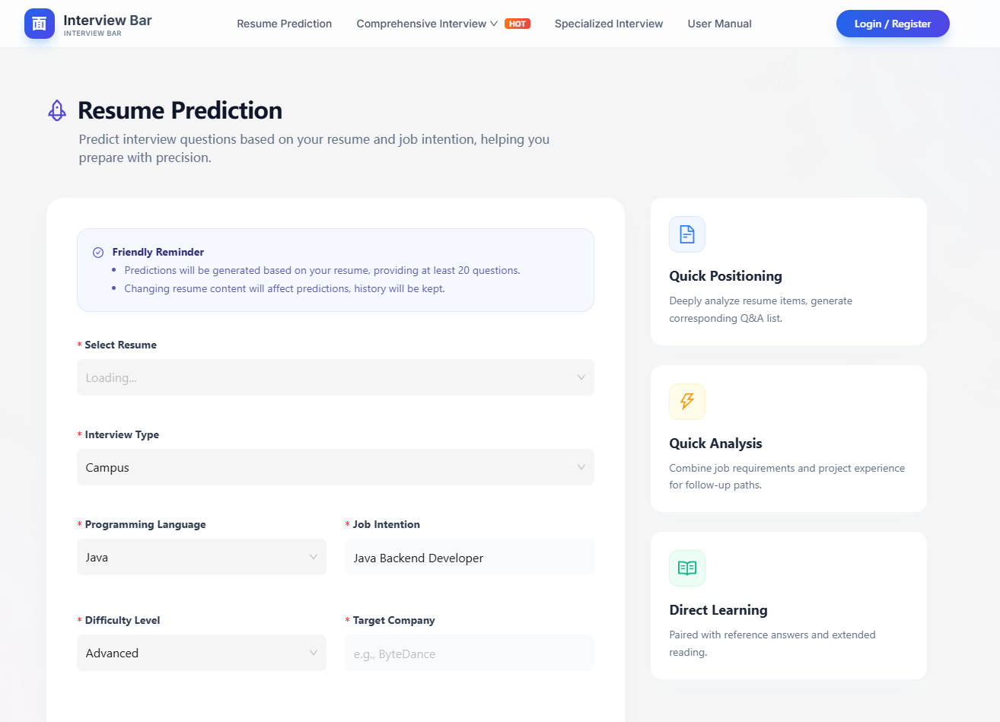
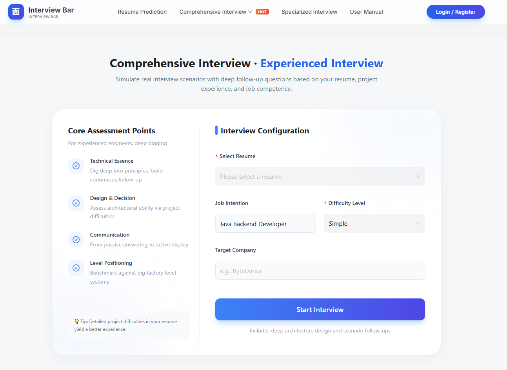
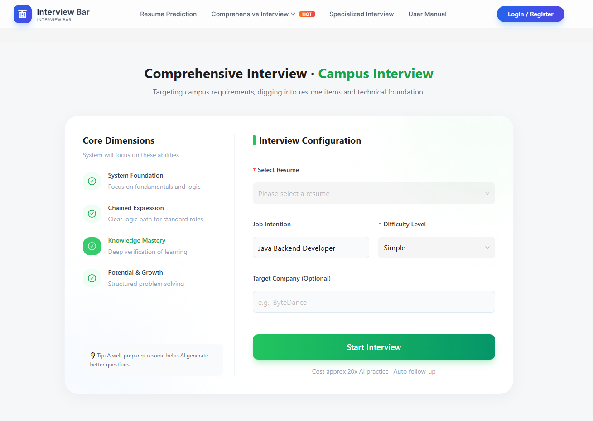
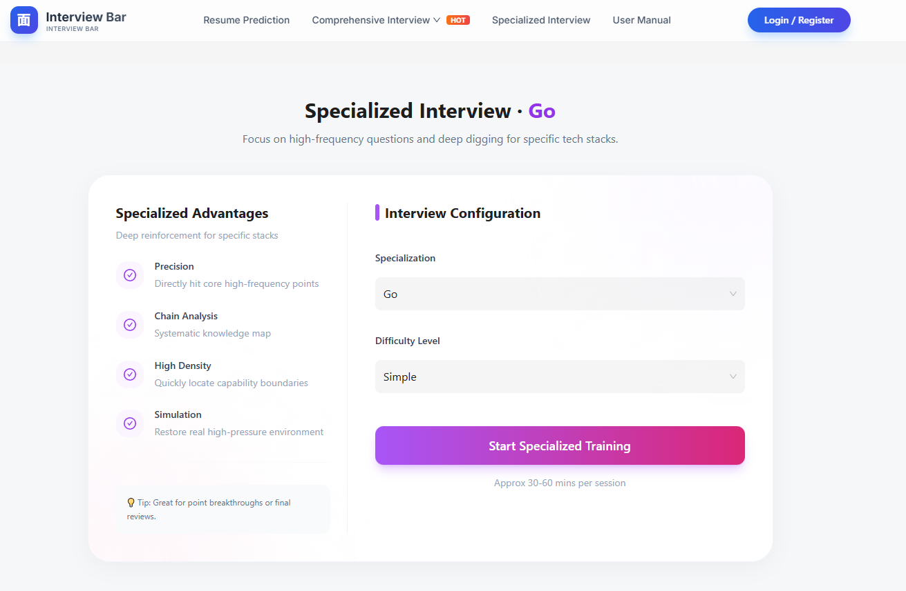
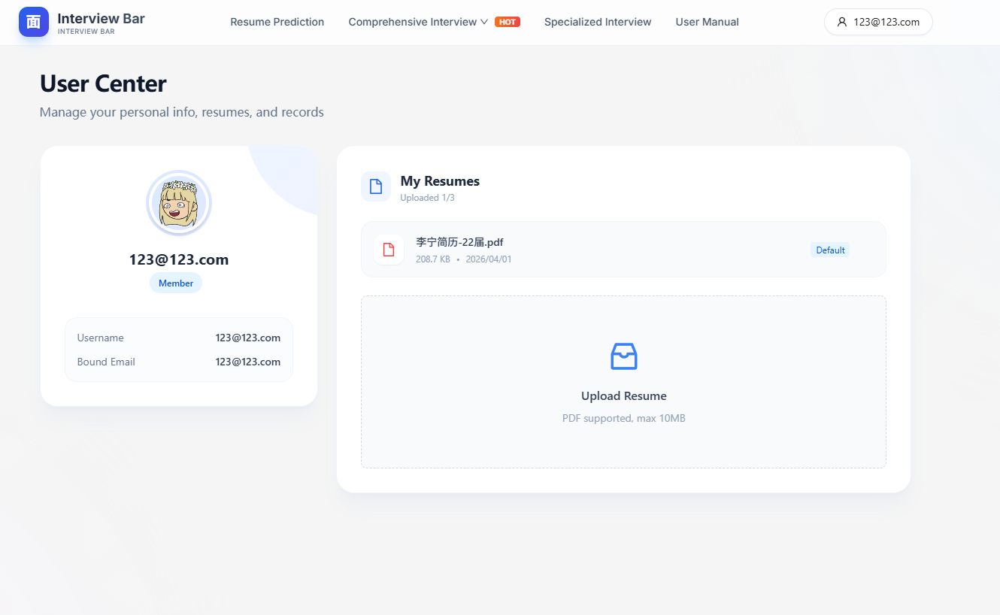
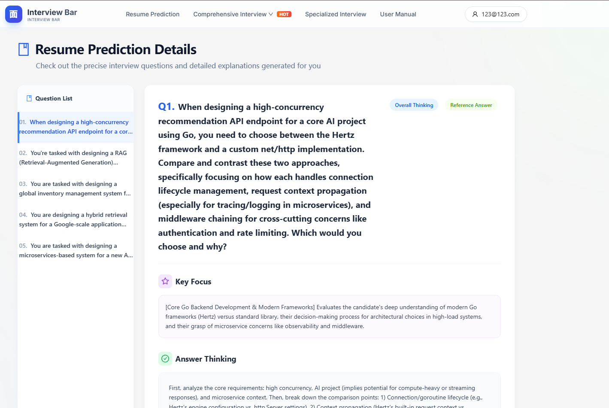
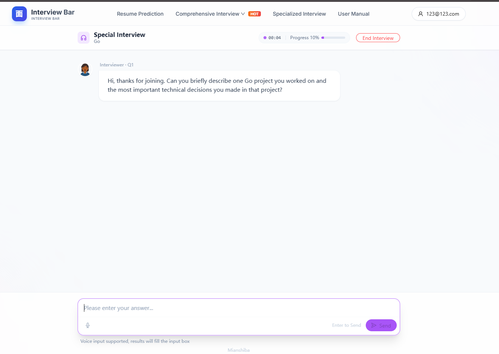
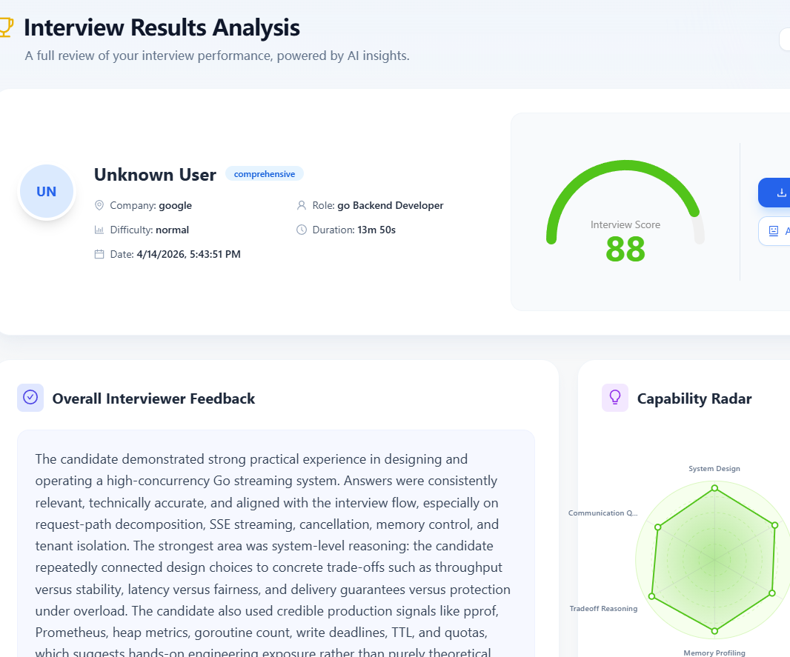

# 面试吧 Interview Bar

一个可直接运行、可二开、可作为求职作品集展示的 AI 面试训练平台。  
项目围绕真实求职流程设计：**简历上传 -> AI 预测题 -> 模拟面试 -> 结果评估 -> 针对性复盘**。

> 这是开源学习版。你可以直接克隆运行，也可以基于它扩展成自己的 AI 教育产品。

---

## 项目定位

`面试吧 Interview Bar` 的目标不是单点 Demo，而是一个完整业务闭环系统：

- 有真实用户流：注册登录、个人中心、简历管理、历史记录
- 有真实 AI 交互流：问题生成、追问、评分、能力画像
- 有真实工程能力：鉴权、限流、异步任务、支付回调、容器化部署

这类项目非常适合：

- 想做 AI 全栈作品集的同学
- 想学习 Go + Next.js 工程落地的同学
- 想做求职训练/教育类产品 MVP 的同学

---

## 功能地图（你能学到什么）

| 模块 | 你在项目里能看到什么 | 为什么对求职有价值 |
|---|---|---|
| 账号与鉴权 | JWT 鉴权、OAuth 登录（GitHub/Google）、公开路由白名单 | 几乎所有中后台岗位都要求掌握认证与权限边界 |
| 简历系统 | PDF 上传、默认简历设置、异步解析流程 | 典型“文件上传 + 异步处理”业务场景，面试高频 |
| AI 预测题 | 基于简历 + 岗位信息生成问题清单和答题思路 | LLM 应用层能力，当前最主流的业务方向之一 |
| 综合面试 | 校招/社招场景化配置，按难度和公司定制 | 展示“业务建模能力”，不是只会调用 API |
| 专项面试 | Go/Java/MySQL/Redis 等技术栈专项训练 | 对应真实技术面试科目，和就业直接相关 |
| 面试进行中 | 实时问答流、进度管理、语音输入（ASR） | 实时交互、流式体验、语音能力是热门方向 |
| 结果分析 | 分数、能力雷达、文字点评、改进建议 | 数据化反馈与可解释输出，符合企业产品形态 |
| 支付模块 | Stripe/PayPal 接入、Webhook 回调 | 商业化必备能力，跨境产品常见要求 |
| 工程稳定性 | 限流、中间件、恢复、健康检查、容器部署 | 面试官最看重的“能上线、可维护”能力 |

---

## 页面截图与详细功能说明

> 下面每一张图都对应真实页面与业务模块，适合你边看边对照代码阅读。

### 1) 首页落地页


**功能说明**

- 作为产品入口，展示平台价值主张和核心路径（试用、演示、课程介绍）
- 顶部导航直接映射核心业务：简历预测、综合面试、专项面试、用户中心
- 统计卡片用于承接“社会证明”（用户量、题量、offer 数）

**学习价值**

- 学习如何把复杂 AI 能力包装成可理解的产品入口
- 学习“转化导向”的首屏信息架构

---

### 2) 简历预测页（Resume Prediction）


**功能说明**

- 选择简历 + 面试类型 + 编程语言 + 岗位意向 + 难度 + 目标公司
- 系统据此生成个性化预测题，而不是固定题库
- 右侧卡片强调输出价值：定位、分析、学习路径

**学习价值**

- 学习“结构化输入 -> LLM 任务编排 -> 结构化输出”的典型设计
- 这是当前企业最主流的 AI 应用模式之一（Copilot/Agent 类产品通用）

---

### 3) 综合面试（社招场景）


**功能说明**

- 面向有经验候选人，强调系统设计、项目难点、深度追问
- 左侧展示考察维度，右侧进行面试配置并启动
- 支持按岗位和公司定制问题策略

**学习价值**

- 学习“场景化业务策略”而非单一 Prompt
- 能体现你对不同候选人层级（校招/社招）产品逻辑的理解

---

### 4) 综合面试（校招场景）


**功能说明**

- 面向校招候选人，重点关注基础、表达、潜力和成长
- 同样是统一引擎，但呈现不同考察维度与文案策略
- 支持一键开始模拟

**学习价值**

- 学习“同一能力引擎，多场景前台编排”的产品设计思路
- 这在企业里就是“一个后端能力服务多个业务线”

---

### 5) 专项面试（以 Go 为例）


**功能说明**

- 按技术栈聚焦高频问题与边界能力（Go/Java/MySQL/Redis 等）
- 支持难度控制，适合突击复习和查漏补缺
- 强调短时高密度训练

**学习价值**

- 学习“垂直能力产品化”（通用能力 + 专项能力）
- 技术专项训练与企业真实面试题库高度贴合，直接提升求职命中率

---

### 6) 用户中心与简历管理


**功能说明**

- 展示用户资料、已上传简历、默认简历设置
- 支持 PDF 上传（含大小限制）
- 后续预测题与综合面试都依赖默认简历作为输入上下文

**学习价值**

- 学习前后端文件上传、状态管理、用户数据绑定
- 这是后台开发与全栈岗位最常见的业务能力之一

---

### 7) 预测题详情页


**功能说明**

- 左侧题目列表，右侧展示题目正文、考察重点、答题思路
- 包含参考答案/思路分层，便于用户复盘
- 结果不是“只给答案”，而是带有可解释结构

**学习价值**

- 学习“AI 可解释性输出”的页面设计
- 面试中这类能力会被认为是“懂产品、懂用户、懂模型边界”

---

### 8) 面试进行中（实时交互）


**功能说明**

- 进行中状态包含：题号、进度、计时、结束控制
- 输入区支持文字输入，也支持语音输入转写（ASR）
- 后端提供面向 ASR 的能力探测与转写接口

**学习价值**

- 学习实时问答产品的状态管理和交互细节
- 语音 + 文本混合输入是当前 AI 应用的主流增强方向

---

### 9) 面试结果分析页


**功能说明**

- 展示面试得分、能力雷达、综合评语和问题定位
- 可用于复盘学习路径和下一轮训练计划
- 形成“训练闭环”而非一次性问答

**学习价值**

- 学习如何把 AI 输出转化为可行动建议
- 数据化评估（评分 + 维度拆解）是企业级 AI 产品常见形态

---

## 架构详解

### 1. 总体架构

```text
Browser
  -> Nginx Gateway (:81)
      -> Frontend (Next.js 14, React 18)
      -> Backend (Go + Hertz + Eino)
            -> MySQL (业务数据)
            -> Redis (缓存/限流/队列)
            -> Optional: Milvus (向量检索)
            -> Optional: LiteLLM (模型网关)
            -> Optional: CozeLoop (链路观测)
```

### 2. 请求链路（核心路径）

1. 用户在前端页面发起请求（登录、上传简历、开始面试）
2. Nginx 统一转发 API 到后端
3. 后端中间件处理 CORS、JWT、限流、错误恢复
4. 业务服务层调用数据库/缓存/AI 能力
5. 返回结构化响应给前端渲染

### 3. AI 业务链路（以面试为例）

1. 读取用户简历与面试配置
2. 组装提示词与上下文
3. 调用 LLM 生成问题/追问/评估
4. 记录答题过程与指标
5. 生成评分与能力画像

### 4. 实时与稳定性设计

- JWT 鉴权 + 公开路由白名单机制
- 全局错误恢复中间件，避免 panic 直接导致服务中断
- 限流策略支持内存/Redis 两种模式
- Redis Stream 消息队列用于异步任务解耦
- `/health` 健康检查便于容器编排和监控

### 5. ASR 语音能力设计

- 提供 `GET /api/interview/asr/capability`（能力探测）
- 提供 `POST /api/interview/asr/transcribe`（音频转写）
- 支持专用 ASR 配置，缺失即禁用，降低误配置风险
- 带有限流、降级与错误语义化处理

---

## 技术栈详解（为什么主流、为什么值得学）

### 前端

- **Next.js 14 + React 18 + TypeScript**
  - 主流企业前端栈，SSR/路由/工程化能力成熟
  - 对求职最有帮助：组件化思维、类型安全、复杂页面状态管理

- **Ant Design + Zustand + TanStack Query + Axios**
  - UI 组件化、轻量状态管理、服务端状态同步、接口抽象
  - 对求职最有帮助：中后台系统开发效率与规范性

### 后端

- **Go + Hertz**
  - 高性能 Web 框架，适合高并发 API 场景
  - 对求职最有帮助：接口设计、并发理解、中间件机制

- **Eino（LLM 应用框架）**
  - 统一模型调用与应用编排能力
  - 对求职最有帮助：从“会调模型”升级到“会做 AI 应用工程”

### 数据与中间件

- **MySQL + GORM**：主流关系型数据库方案，企业普及度极高
- **Redis**：缓存、限流、队列等高频能力，后端岗位必备
- **Milvus（可选）**：RAG 与向量检索方向核心技术

### 商业化与生态

- **Stripe / PayPal**：跨境产品的主流支付能力
- **GitHub / Google OAuth**：用户增长和注册转化常用手段
- **Docker / Compose / Nginx**：标准化部署能力，面试加分项

---

## 这个项目里“最值得学、最主流”的能力清单

如果你目标是找工作，建议优先掌握以下模块（按企业面试常见程度排序）：

1. **前后端分离 + JWT 鉴权 + RBAC/白名单思路**
2. **MySQL + Redis 的组合使用（缓存、限流、异步）**
3. **文件上传与异步处理链路（简历场景）**
4. **LLM 业务编排（不是简单聊天，而是任务化流程）**
5. **可解释结果输出（评分、维度、建议）**
6. **Docker 一键部署与健康检查**
7. **支付回调与幂等处理（商业化产品必备）**

这 7 项能力在社招和校招的全栈/后端/AI 应用岗位中都非常高频。

---

## 快速启动（推荐 Docker）

环境配置说明文档见：[docs/env-config-guide.md](/d:/Bear/mianshiba-eino-overseas/docs/env-config-guide.md)。

### 1) 准备环境

- Docker Desktop（Windows/macOS）或 Docker Engine（Linux）
- Git

### 2) 克隆项目

```bash
git clone <你的仓库地址>
cd mianshiba-eino-overseas
```

### 3) 配置环境变量

```bash
cp .env.example .env
```

按照 `.env` 注释填写配置。项目中所有真实密钥已移除，均为安全占位符说明。

### 4) 一键启动

```bash
docker-compose up -d
```

### 5) 访问

- 网关入口：`http://localhost:81`
- 前端：`http://localhost:3000`
- 后端：`http://localhost:8899`
- 健康检查：`http://localhost:8899/health`

---

## 本地开发模式（分开调试）

### 启动依赖服务

```bash
docker-compose up -d mysql redis
```

### 启动后端

```bash
cd backend
go run ./cmd/server/main.go
```

### 启动前端

```bash
cd frontend
npm install
npm run dev
```

---

## 核心目录结构

```text
backend/
  cmd/server/                  # 后端入口
  api/                         # 路由与 Handler
  internal/service/            # 核心业务服务
  internal/agents/             # AI 代理与评估逻辑
  internal/middleware/         # JWT、限流等中间件

frontend/
  src/app/                     # 页面路由
  src/components/              # 组件
  src/services/                # API 客户端与请求封装

xiangmu-image/                 # README 展示截图
```

---

## 训练营引导

如果你希望系统学习这个项目背后的完整实现（从 0 到 1 搭建、AI 能力接入、工程化落地、简历优化与面试实战），欢迎加入：

- 训练营名称：**就业陪跑训练营**
- 报名链接：**https://wangzhongyang.com**
- 咨询方式：微信扫码咨询，备注 **【训练营】**


也欢迎先 `Star` 本仓库，后续会持续更新更多实战模块。

---

## License

MIT
