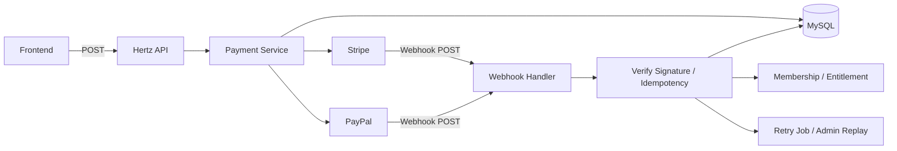
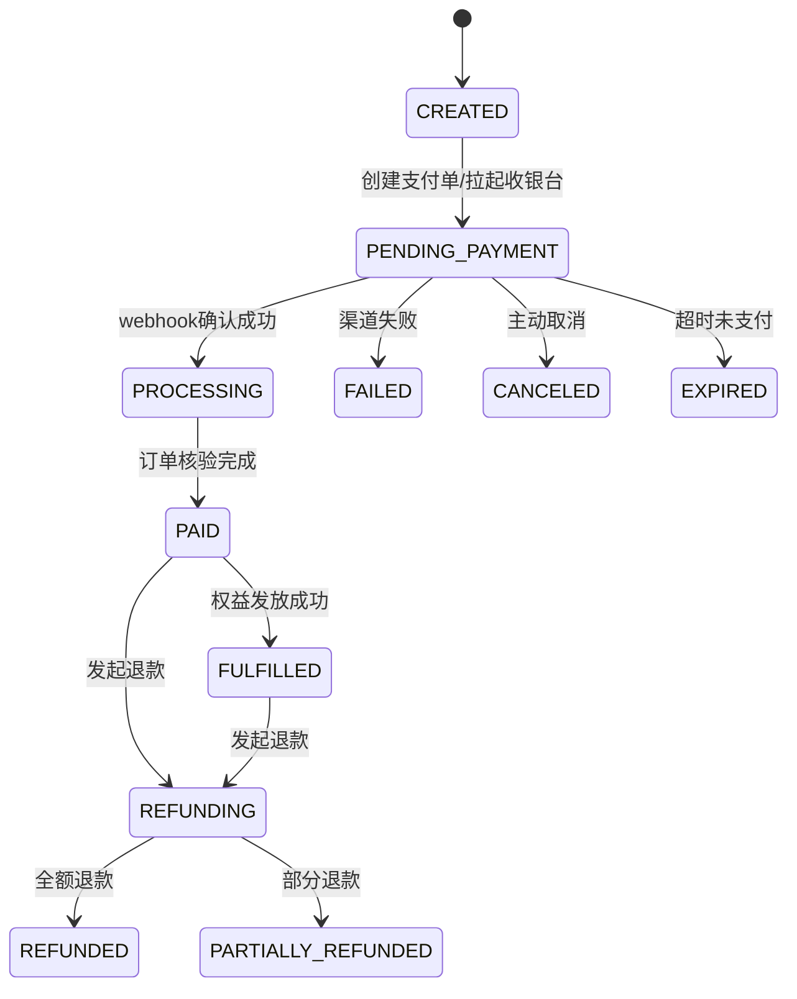
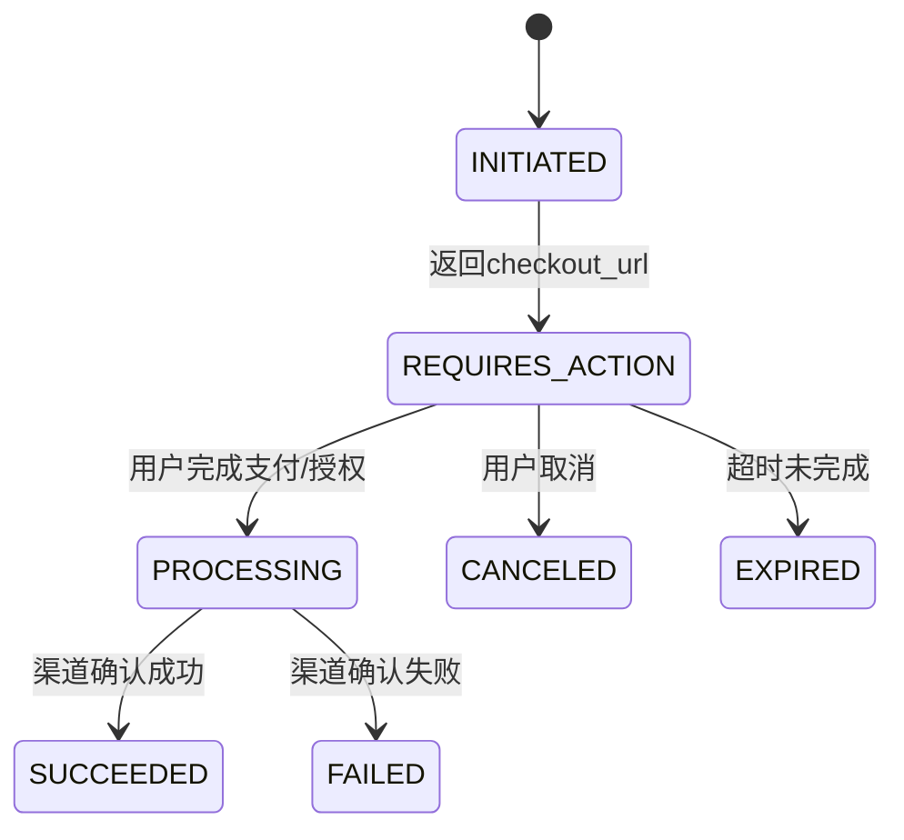
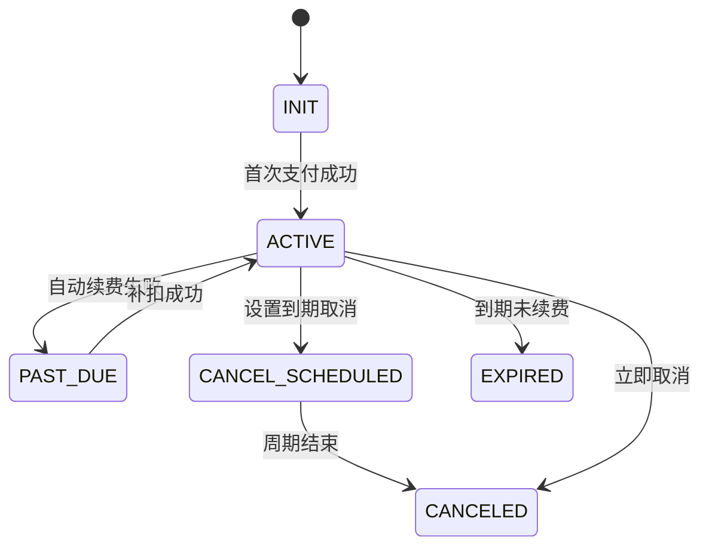
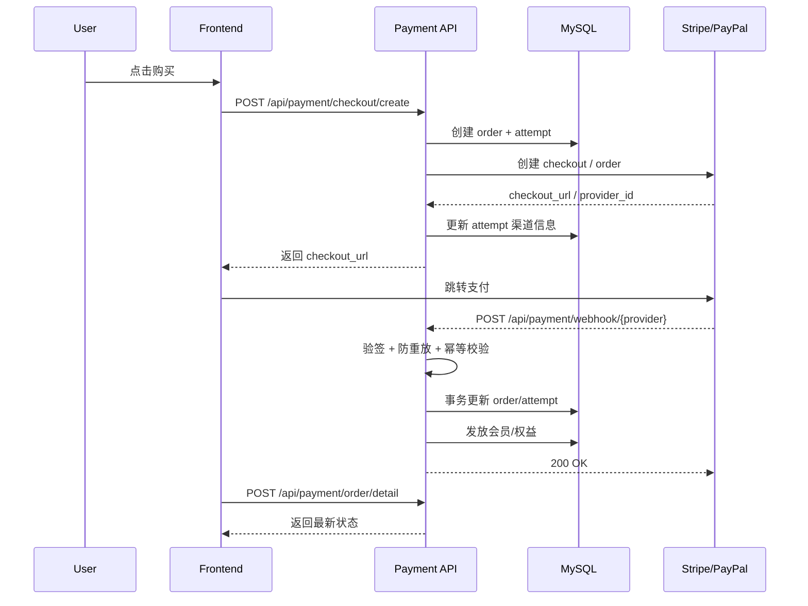
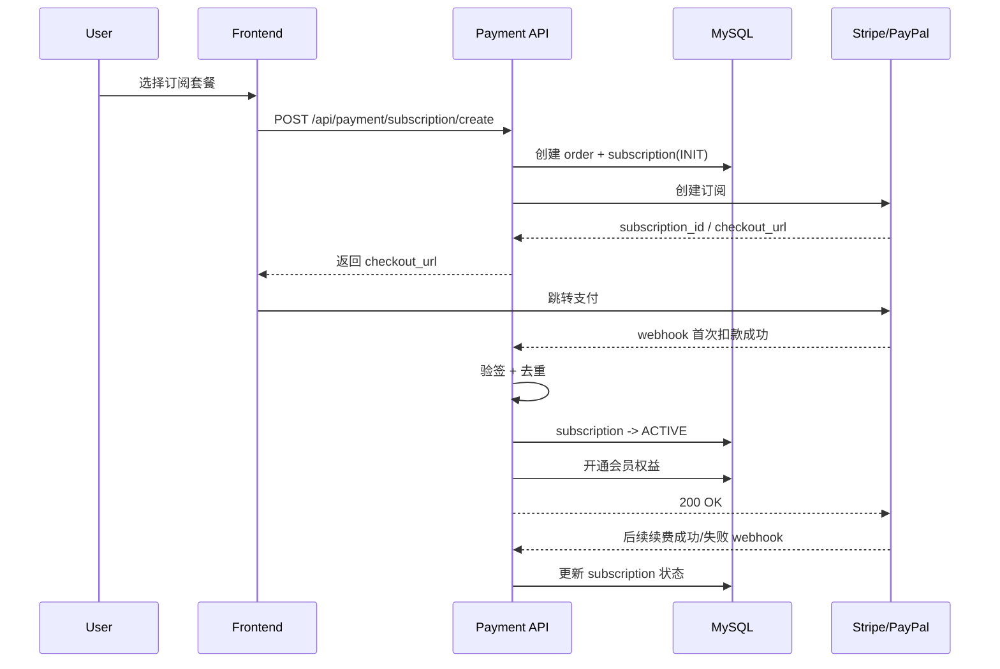

# 支付集成架构方案（轻量、安全、可演进）

## 1. 目标

- 前期直接集成到当前 `backend`，不拆独立服务
- 不引入 `Kafka`，优先保证**轻量、快速、安全**
- 支持 `Stripe`、`PayPal`
- 支持**一次性支付**、**订阅支付**
- 所有对外接口统一使用 `POST`
- 明确订单、支付尝试、订阅的状态变化
- 后续需要时再演进为独立支付服务或事件总线

---

## 2. 核心结论

前期推荐方案：

> **模块化单体 + Provider 适配器 + Webhook 验签 + 本地事务更新 + 幂等重试**

不建议首期引入 Kafka，原因很简单：

- 当前阶段更关注**尽快上线和支付正确性**
- Kafka 会明显增加部署、监控、排障复杂度
- 支付首期链路不长，用 `MySQL + Webhook + 重试任务` 足够

---

## 3. 简化架构图



---

## 4. 推荐目录

```text
backend/
  api/handler/payment/
  api/router/payment/
  internal/service/payment/
  internal/payment/
    providers/
      stripe/
      paypal/
    webhook/
    security/
  internal/model/
    payment_order.go
    payment_attempt.go
    subscription.go
    payment_event.go
    refund.go
```

---

## 5. 核心对象

| 对象 | 作用 |
|---|---|
| `payment_order` | 业务订单，表示“用户买什么” |
| `payment_attempt` | 一次实际支付尝试，表示“这次怎么付” |
| `subscription` | 订阅关系和周期状态 |
| `payment_event` | webhook 原始事件和处理结果 |
| `refund` | 退款记录 |

建议保留 `order` 和 `attempt` 分离，便于：

- 同一订单多次重试支付
- 切换 Stripe / PayPal 重试
- 支付链接过期后重新发起

---

## 6. 状态机

### 6.1 订单状态说明

| 状态 | 含义 |
|---|---|
| `CREATED` | 订单已创建，尚未拉起支付 |
| `PENDING_PAYMENT` | 已发起支付，等待用户完成 |
| `PROCESSING` | 已收到渠道成功信号，系统处理中 |
| `PAID` | 支付确认成功 |
| `FULFILLED` | 权益已发放完成 |
| `FAILED` | 支付失败 |
| `CANCELED` | 用户或系统取消 |
| `EXPIRED` | 支付超时/链接失效 |
| `REFUNDING` | 退款处理中 |
| `REFUNDED` | 全额退款完成 |
| `PARTIALLY_REFUNDED` | 部分退款完成 |

### 6.2 订单状态变更流程图



### 6.3 支付尝试状态说明

| 状态 | 含义 |
|---|---|
| `INITIATED` | 已创建支付尝试 |
| `REQUIRES_ACTION` | 等待用户支付/授权 |
| `PROCESSING` | 渠道处理中 |
| `SUCCEEDED` | 本次支付尝试成功 |
| `FAILED` | 本次支付尝试失败 |
| `CANCELED` | 本次支付尝试取消 |
| `EXPIRED` | 本次支付尝试超时 |

### 6.4 支付尝试状态变更流程图



### 6.5 订阅状态说明

| 状态 | 含义 |
|---|---|
| `INIT` | 订阅记录已创建，尚未生效 |
| `ACTIVE` | 订阅生效中 |
| `PAST_DUE` | 续费失败，进入催缴期 |
| `CANCEL_SCHEDULED` | 已设置到期取消 |
| `CANCELED` | 订阅已取消 |
| `EXPIRED` | 已自然到期 |

### 6.6 订阅状态变更流程图



---

## 7. 支付流程

### 7.1 一次性支付时序图



### 7.2 订阅支付时序图



---

## 8. Webhook 处理原则

Webhook 首期只做下面几件事：

1. 验签
2. 校验事件时间窗口，防重放
3. 按 `source + source_event_id` 去重
4. 落库保存原始事件
5. 在事务内更新订单/支付/订阅状态
6. 需要时写入重试任务

建议状态：`RECEIVED -> VERIFIED -> PROCESSED -> FAILED`

---

## 9. 安全要求

- 严格校验 `Stripe-Signature` / `PayPal` webhook 签名
- 对 `source + source_event_id` 建唯一索引
- 下单接口必须支持 `idempotency_key`
- 金额统一使用**最小货币单位/定点数**，不要用浮点
- 商品价格以服务端配置为准，不信任前端金额
- `success_url` / `cancel_url` 做白名单校验
- 敏感响应落库时脱敏
- 支付接口单独限流、审计日志、异常告警
- 不以前端跳转成功页作为支付成功依据，必须以 **webhook + 平台查询** 为准

---

## 10. API 建议（全部 POST）

### 10.1 对外接口

- `POST /api/payment/order/create`
- `POST /api/payment/order/detail`
- `POST /api/payment/checkout/create`
- `POST /api/payment/checkout/query`
- `POST /api/payment/subscription/create`
- `POST /api/payment/subscription/detail`
- `POST /api/payment/subscription/cancel`
- `POST /api/payment/refund/apply`
- `POST /api/payment/webhook/stripe`
- `POST /api/payment/webhook/paypal`

### 10.2 关键入参

- `product_code`
- `price_code`
- `order_type`：`one_time` / `subscription`
- `provider`：`stripe` / `paypal`
- `success_url`
- `cancel_url`
- `idempotency_key`  **业务指纹**

---

## 11. 首期建议范围

### 必做

- Stripe 一次性支付
- Stripe 订阅支付
- PayPal 一次性支付
- PayPal 订阅支付
- webhook 验签、去重、事务更新
- 会员/权益开通
- 后台重放与补偿任务

### 暂缓

- Kafka
- 独立支付微服务
- 多币种换汇
- 税务/VAT
- 优惠券体系
- 复杂退款审批流

---

## 12. 实施顺序

1. 设计 `payment_order`、`payment_attempt`、`subscription`、`payment_event` 表
2. 封装 Stripe / PayPal Provider 接口
3. 实现 `checkout/create`、`subscription/create`
4. 实现两个 webhook 接口
5. 补齐验签、幂等、防重放
6. 完成订单/订阅/权益状态更新
7. 增加补偿任务、后台重放、对账任务

---

## 13. 最终建议

当前阶段最合适的方案是：

> **先做内聚在 `backend` 内的轻量支付模块，不上 Kafka，不拆微服务，优先把验签、幂等、状态机和权益发放做好。**

这样最符合当前目标：**快、轻、稳、后续还能演进**。
