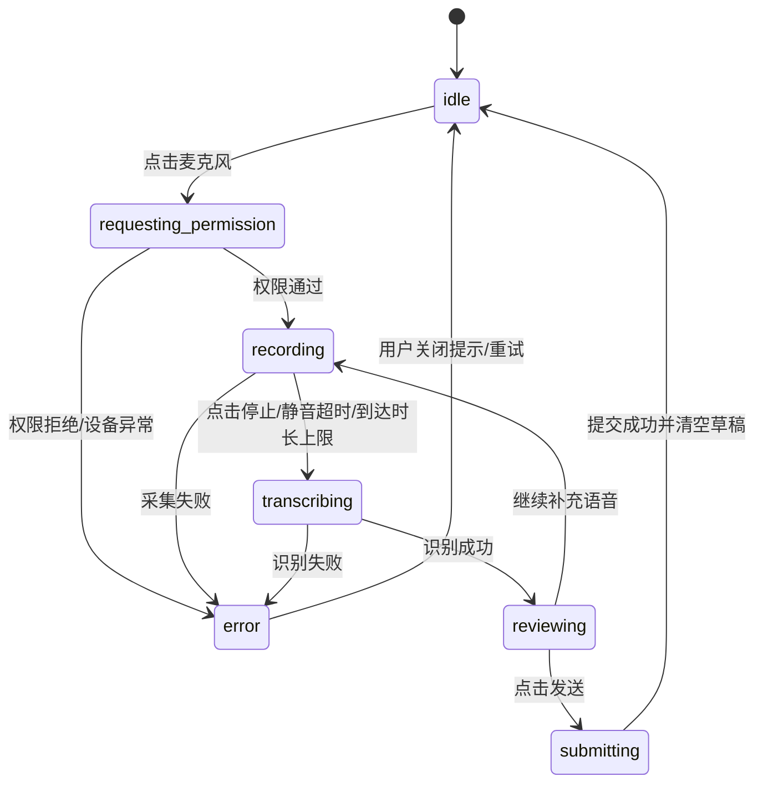
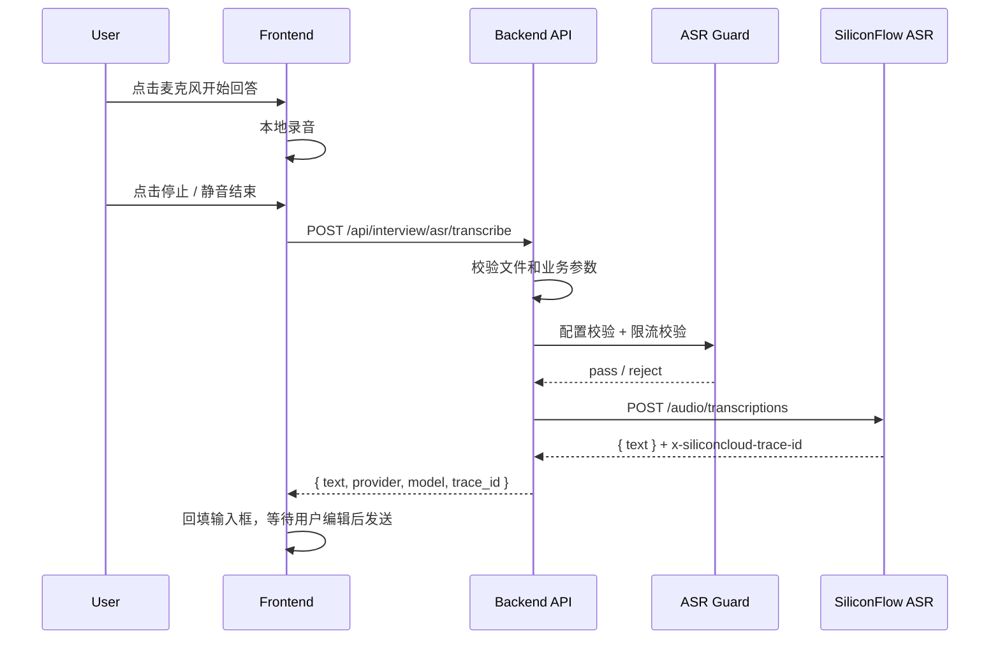
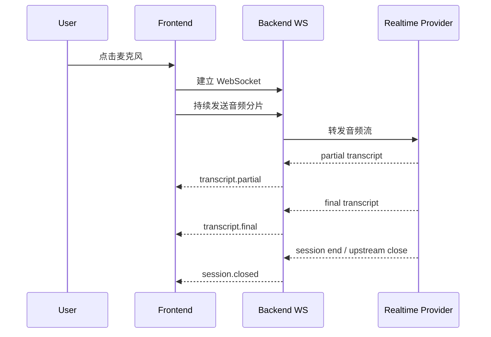

# 面试场景语音输入与 ASR 方案设计

## 1. 背景

当前项目的面试页面以文本输入为主，底部交互区为 `TextArea + 发送` 结构，且在以下页面中存在相似实现：

- `frontend/src/app/interview/special/start/page.tsx`
- `frontend/src/app/interview/social/start/page.tsx`
- `frontend/src/app/interview/campus/start/page.tsx`
- `frontend/src/app/interview/multi/start/page.tsx`

现状特点：

- 已有语音入口占位按钮，但尚未启用
- 面试题通过后端流式返回，页面已有 `starting`、`waitingNextQuestion`、`submitting` 等状态
- 当前答案输入只有一个 `answer` 状态，尚未区分“实时转写草稿”和“最终可编辑答案”
- 后端当前已有 `OpenAI-compatible` 接入形态，现有通用模型配置仍主要通过 `config.yaml` / `config.example.yaml` 中的 `openai.api_key / model_name / base_url` 承载

本文档目标是在尽量少破坏现有面试流程的前提下，为项目补齐一套可演进的语音回答输入方案，并明确当前批量转写与未来实时转写的边界。

---

## 2. 目标与非目标

### 2.1 目标

- 支持用户通过麦克风进行“回答输入”
- 识别结果回填到输入框，允许用户编辑后再发送
- 与当前面试状态流转兼容，不影响题目生成与提交流程
- 首期方案足够稳、足够快，便于快速上线验证
- 预留后续升级为更实时的流式转写能力

### 2.2 非目标

- 首期不做“全自动持续监听”
- 首期不做“用户说完自动提交答案”
- 首期不做“AI 语音播报 + 用户同时说话”的全双工语音面试
- 不依赖单麦克风场景下的说话人分离作为主链路能力
- 不宣称硅基流动当前已经开放实时转写接口

---

## 3. 核心结论

推荐方案：

> **V1 采用半双工语音输入 + 后端代理 SiliconFlow 批量 ASR + 识别后回填文本框 + 用户确认发送**

当前供应商与协议层关系：

- 协议层：采用 `OpenAI-compatible` 形态进行供应商接入
- 实际供应商：**硅基流动**
- 当前默认 ASR 模型：`FunAudioLLM/SenseVoiceSmall`

当前确认的官方接口事实：

- 上游接口路径：`POST /audio/transcriptions`
- 请求格式：`multipart/form-data`
- 官方已公开的模型枚举至少包含：
  - `FunAudioLLM/SenseVoiceSmall`
  - `TeleAI/TeleSpeechASR`
- 单文件限制：
  - 音频时长不超过 `1 小时`
  - 文件大小不超过 `50MB`
- 官方响应主体：`{ "text": "..." }`
- 官方响应头包含：`x-siliconcloud-trace-id`

本项目首期的设计取舍：

- 语音首先被设计为“输入方式增强”，而不是一整套持续监听的语音对话系统
- 默认由用户主动点击麦克风开始收音，结束后得到文本结果
- 文本先进入输入框，用户可补充、修正、删改，再点击发送
- 单麦克风场景下不默认做全双工，避免回声、串音、误识别带来的体验崩坏
- `TeleAI/TeleSpeechASR` 仅作为上游官方支持备选，不作为当前默认模型
- ASR 可用性只由专用配置 `OPENAI_ASR_BASE_URL / OPENAI_ASR_API_KEY / OPENAI_ASR_MODEL_NAME` 决定
- 任一 ASR 专用配置缺失时，语音识别功能应视为不可用，前后端都要禁用或拒绝
- **不得回退**到通用 `OPENAI_BASE_URL / OPENAI_API_KEY / OPENAI_MODEL_NAME`
- ASR 的限流与熔断应下沉到 ASR 模块内部，不复用全局 HTTP IP 限流作为主保护链路
- 首期采用高内聚、低耦合的 `ASRService + ASRGuard + Provider` 分层

不建议首期主用浏览器原生 `Web Speech API`，原因是兼容性和可控性一般，更适合 demo 或兜底。

---

## 4. 为什么单麦克风下优先半双工

单麦克风是本方案的关键约束。

如果后续还给“面试官问题”增加 TTS 播报，单麦克风下会出现以下问题：

- 扬声器播出的 AI 声音会重新被麦克风采集
- 浏览器和设备的回声消除能力并不稳定，尤其是外放、噪声环境、低端设备
- ASR 很可能把 AI 的问题内容也识别进用户答案
- 即使做单通道 diarization，也很难把“扬声器回放的 AI 声音”和“现场人声”稳定区分

因此，首期交互建议是：

- AI 提问阶段：不收音
- 用户点麦克风后：进入收音
- 若将来支持题目播报：用户点击麦克风即打断播报，切换到回答录音

这属于典型的**显式半双工**设计，简单、稳、可预测。

---

## 5. 交互设计

### 5.1 设计原则

- **用户可控优先**：何时开始录音、何时结束，由用户明确触发
- **识别结果可校正**：识别文本不是最终答案，只是草稿
- **状态可感知**：录音中、识别中、可编辑、提交中必须有明确视觉反馈
- **不打断现有流程**：和当前题目流式生成、答案提交逻辑保持一致

### 5.2 状态机

建议引入如下前端状态：

| 状态 | 含义 | 用户可见表现 |
|---|---|---|
| `idle` | 空闲，未录音 | 麦克风按钮可点击 |
| `requesting_permission` | 正在请求麦克风权限 | 按钮 loading / 文案“请求权限中” |
| `recording` | 正在录音 | 麦克风高亮、脉冲动画、可显示音量条 |
| `transcribing` | 音频已停止，正在识别 | 输入区显示“识别中...” |
| `reviewing` | 识别结果已回填，可编辑 | 输入框可编辑，发送按钮可用 |
| `submitting` | 正在提交答案 | 复用现有发送 loading |
| `error` | 录音或识别失败 | 错误提示，可重试 |



### 5.3 交互细节

#### 5.3.1 空闲态

- 输入框保持现有样式
- 麦克风按钮可点击
- 若当前处于 `starting` 或 `waitingNextQuestion`，麦克风禁用

#### 5.3.2 首次点击麦克风

- 触发浏览器麦克风权限请求
- 若用户拒绝：
  - toast 提示“未授予麦克风权限，请在浏览器设置中开启”
  - 不进入录音态
- 若浏览器不支持：
  - 提示当前设备不支持语音输入
  - 保留纯文本输入能力

#### 5.3.3 录音中

- 麦克风按钮变为高亮态
- 建议在输入框底部显示“正在听你回答...”
- 可显示简单音量波形，但不是首期必需
- 录音中默认不建议让用户同时手动编辑文本，避免光标位置和转写插入逻辑复杂化

录音结束条件建议同时支持：

- 用户主动点击停止
- 检测到连续静音 `800ms ~ 1200ms`
- 到达单次录音上限，例如 `90s`

#### 5.3.4 识别中

- 停止收音后进入 `transcribing`
- 输入区展示“识别中，请稍候...”
- 此阶段禁用发送按钮，避免用户发送半成品

#### 5.3.5 识别完成

- 识别文本回填到输入框
- 用户可以：
  - 直接发送
  - 继续键盘补充
  - 再次点击麦克风追加一段语音
  - 清空后重说

#### 5.3.6 不自动发送

默认不建议“识别完成自动发送”，原因：

- 面试回答常包含技术术语，用户往往需要修正错词
- 用户常会补一句总结性表达
- 自动发送会让误识别直接进入对话记录，成本高

#### 5.3.7 若未来增加题目播报

建议遵循以下规则：

- 题目播报中默认禁用 ASR
- 用户点击麦克风时立即停止播报
- 不做唤醒词
- 不做“AI 说话时仍持续监听”的默认模式

---

## 6. 前端实现建议

### 6.1 组件抽象

当前四个面试页中输入区实现高度重复，建议抽出统一组件，例如：

```text
frontend/src/components/interview/InterviewAnswerComposer.tsx
frontend/src/hooks/useSpeechAnswerInput.ts
```

其中：

- `InterviewAnswerComposer`
  - 负责展示输入框、麦克风按钮、发送按钮、录音状态
- `useSpeechAnswerInput`
  - 负责权限申请、录音状态机、音频采集、调用后端 ASR、返回识别结果

### 6.2 状态拆分

当前单一 `answer` 状态不足以支持语音场景，建议拆分为：

- `draftAnswer`
  - 最终可编辑答案
- `speechInterimText`
  - 录音中或实时转写中的临时文本
- `speechFinalText`
  - 本次语音识别完成后的最终文本
- `speechStatus`
  - `idle / recording / transcribing / error`

合并策略建议：

- 录音期间只更新 `speechInterimText`
- 批量转写完成后把 `speechFinalText` 合并进 `draftAnswer`
- 合并方式优先采用“追加到末尾”，不要做复杂的光标插入

### 6.3 浏览器采集参数

建议采集时优先开启：

- `echoCancellation: true`
- `noiseSuppression: true`
- `autoGainControl: true`

这样即使未来引入题目播报，也能一定程度降低回声和环境噪声影响。

---

## 7. 配置方式

### 7.1 当前仓库现状

当前仓库中：

- 后端会从项目根目录加载 `.env`
- 然后由 `config.yaml` / `config.example.yaml` 通过环境变量展开机制读取配置
- 通用模型配置当前仍主要落在：
  - `openai.api_key`
  - `openai.model_name`
  - `openai.base_url`

这意味着**当前仓库事实**是“通用 OpenAI-compatible 配置已经存在”，但**ASR 专用配置还没有被单独抽象成正式配置结构**。

### 7.2 推荐的 `.env` 配置契约

为了让语音转写和主聊天模型解耦，推荐后续按下面的环境变量契约推进：

```env
# ASR 专用配置（推荐）
OPENAI_ASR_BASE_URL=https://api.siliconflow.cn/v1
OPENAI_ASR_API_KEY=your_siliconflow_api_key
OPENAI_ASR_MODEL_NAME=FunAudioLLM/SenseVoiceSmall

# 通用 OpenAI-compatible 配置（项目内已有）
OPENAI_BASE_URL=https://api.siliconflow.cn/v1
OPENAI_API_KEY=your_general_api_key
OPENAI_MODEL_NAME=your_general_model_name
```

说明：

- 这里沿用 `OPENAI_*` 命名，是因为上游采用 `OpenAI-compatible` 协议形态
- 这只是**推荐配置契约**
- 本轮文档不会声称仓库当前已经完成该配置绑定
- 本轮文档也不会要求修改 `.env.example` 或 `config.yaml`
- ASR 功能只认 `OPENAI_ASR_*` 三项，不把通用 `OPENAI_*` 当作隐式兜底配置

### 7.3 配置启用规则

后续实现 ASR 配置读取时，建议固定遵循以下规则：

1. 只读取 `OPENAI_ASR_BASE_URL` / `OPENAI_ASR_API_KEY` / `OPENAI_ASR_MODEL_NAME`
2. 三项全部非空，且通过基础校验时，ASR 视为已启用
3. 任一项缺失时，ASR 视为未配置
4. 未配置时，前端隐藏或禁用语音入口；后端直接返回 `503 ASR_NOT_CONFIGURED`
5. **不回退**到 `OPENAI_BASE_URL` / `OPENAI_API_KEY` / `OPENAI_MODEL_NAME`

这样做的好处是：

- 语音能力开关语义清晰，不会因为通用模型配置存在而误判“可用”
- 聊天模型和 ASR 模型生命周期隔离，避免修改聊天配置误伤语音
- 后续升级实时转写时，可以独立演进 ASR 配置和供应商策略
- 发生配置缺失时，系统行为更可预测，也更容易运维排查

### 7.4 默认值建议

当前文档推荐默认值如下：

- `OPENAI_ASR_BASE_URL=https://api.siliconflow.cn/v1`
- `OPENAI_ASR_MODEL_NAME=FunAudioLLM/SenseVoiceSmall`

`OPENAI_ASR_API_KEY` 不提供默认值，必须由部署环境显式注入。

---

## 8. 后端设计建议

### 8.1 模块分层

建议把 ASR 实现组织为三层：

- `ASRService`
  - 对外只暴露 `GetCapability(ctx, userID)` 和 `Transcribe(ctx, userID, req)`
  - Handler 不直接操作限流器、熔断器或供应商 SDK
- `ASRGuard`
  - 负责配置是否齐全
  - 负责用户维度限流
  - 负责供应商全局保护限流
  - 负责把限流、熔断、依赖故障统一映射成业务错误
- `AudioTranscriptionProvider`
  - 只负责调用上游 `POST /audio/transcriptions`
  - 只负责解析 `{ text }`
  - 只负责提取 `x-siliconcloud-trace-id`

这种分层的目标是：

- 把“业务能力开关、保护策略、供应商调用”清晰拆开
- 让后续替换供应商或升级实时转写时，不需要重写 Handler
- 保持高内聚、低耦合，避免把限流、熔断分散到路由、中间件、Handler 多处

### 8.2 能力接口与前后端双保险

为了让前端在页面初始化阶段就知道语音能力是否可用，建议先提供能力接口：

`GET /api/interview/asr/capability`

响应示例：

```json
{
  "enabled": false,
  "reason": "NOT_CONFIGURED"
}
```

已启用时：

```json
{
  "enabled": true,
  "provider": "siliconflow",
  "model": "FunAudioLLM/SenseVoiceSmall"
}
```

规则约束：

- 能力接口只表达**配置驱动的开关状态**
- 若 `OPENAI_ASR_*` 缺失，则 `enabled=false`
- 前端在页面进入时先调用该接口
- 若 `enabled=false`，前端直接隐藏或禁用麦克风按钮，并展示“语音识别暂不可用”
- 即使前端被绕过，后端在转写接口上也必须再次校验配置，返回 `503 ASR_NOT_CONFIGURED`

### 8.3 V1：上传后转写

这是首期最稳的方案。

上游供应商为硅基流动，内部后端继续提供统一的项目级接口，对前端屏蔽供应商差异。

#### 8.3.1 对外接口建议

`POST /api/interview/asr/transcribe`

请求：

- `multipart/form-data`
- 字段建议：
  - `file`
  - `session_id`
  - `interview_type`
  - `domain`

其中：

- `file` 与上游 SiliconFlow `POST /audio/transcriptions` 保持一致，避免额外字段映射成本
- `session_id / interview_type / domain` 属于业务扩展字段，不直接透传给上游

响应：

```json
{
  "text": "候选人识别后的回答文本",
  "provider": "siliconflow",
  "model": "FunAudioLLM/SenseVoiceSmall",
  "trace_id": "trace_from_x_siliconcloud_trace_id"
}
```

设计说明：

- `text` 是前端唯一必须消费的核心字段
- `provider`、`model` 用于埋点和排障
- `trace_id` 对应上游响应头 `x-siliconcloud-trace-id`，便于后续问题追踪
- 路由必须走 JWT 保护，主限流维度使用 `user_id + model`

错误响应建议：

配置缺失：

```json
{
  "code": 503,
  "message": "ASR_NOT_CONFIGURED",
  "data": {
    "reason": "NOT_CONFIGURED"
  }
}
```

限流命中：

```json
{
  "code": 429,
  "message": "RATE_LIMIT_EXCEEDED",
  "data": {
    "retry_after_seconds": 30
  }
}
```

熔断或上游不可用：

```json
{
  "code": 503,
  "message": "ASR_UNAVAILABLE",
  "data": {
    "trace_id": "optional_provider_trace_id"
  }
}
```

#### 8.3.2 上游供应商接口事实

当前确认的硅基流动官方接口：

- 地址：`POST https://api.siliconflow.cn/v1/audio/transcriptions`
- 鉴权：`Authorization: Bearer <API_KEY>`
- 请求格式：`multipart/form-data`
- 官方模型枚举：
  - `FunAudioLLM/SenseVoiceSmall`
  - `TeleAI/TeleSpeechASR`
- 当前默认模型：
  - `FunAudioLLM/SenseVoiceSmall`
- 文件限制：
  - 时长不超过 `1 小时`
  - 文件大小不超过 `50MB`
- 官方响应主体：

```json
{
  "text": "transcribed text"
}
```

#### 8.3.3 后端代理职责

内部 `POST /api/interview/asr/transcribe` 建议承担以下职责：

- 接收并校验上传音频
- 选择 ASR 配置并调用上游供应商
- 把上游最小响应 `{ text }` 归一化为项目内部响应结构
- 读取并透传或记录 `x-siliconcloud-trace-id`
- 统一归一化错误码、超时、限流、上游过载等失败场景
- 为后续切换其他 `OpenAI-compatible` 或非兼容供应商保留实现空间

#### 8.3.4 内部抽象建议

建议抽象如下内部接口：

```go
type ASRService interface {
    GetCapability(ctx context.Context, userID uint) (*ASRCapability, error)
    Transcribe(ctx context.Context, userID uint, req AudioTranscriptionRequest) (*AudioTranscriptionResult, error)
}

type ASRGuard interface {
    CheckCapability(ctx context.Context) (*ASRCapability, error)
    AllowUser(ctx context.Context, userID uint, model string) error
    AllowProvider(ctx context.Context, provider string, model string) error
}

type AudioTranscriptionProvider interface {
    Transcribe(ctx context.Context, req AudioTranscriptionRequest) (*AudioTranscriptionResult, error)
}

type ASRCapability struct {
    Enabled  bool
    Reason   string
    Provider string
    Model    string
}

type AudioTranscriptionRequest struct {
    FileName      string
    ContentType   string
    AudioBytes    []byte
    ModelName     string
    SessionID     string
    InterviewType string
    Domain        string
}

type AudioTranscriptionResult struct {
    Text     string
    Provider string
    Model    string
    TraceID  string
}
```

这里的核心目的不是提前“写死”具体代码，而是把：

- 业务入参
- 可用性判断
- 限流与保护策略
- 供应商调用
- 结果归一化

三层边界先分开，避免未来实时转写或更换供应商时重做整个 Handler / Service 结构。

#### 8.3.5 时序图



#### 8.3.6 优点

- 接口简单
- 前端实现快
- 容易排障
- 成本容易控制
- 与当前 SiliconFlow 官方能力完全对齐

#### 8.3.7 缺点

- 不能实时显示字幕
- 用户需要等待一次识别完成

### 8.4 限流设计

ASR 的主保护链路不建议继续沿用全局 HTTP IP 中间件，而应在 ASR 模块内部复用项目现有能力：

- 复用 `backend/pkg/ratelimiter`
- 限流策略内聚在 `ASRGuard`
- Handler 和路由层不感知具体的限流细节

#### 8.4.1 保护维度

首期建议使用两层 limiter：

- 用户 limiter
  - subject key：`user:<user_id>`
  - model key：`asr:<model>`
- 全局供应商 limiter
  - subject key：`provider:siliconflow`
  - model key：`asr:<model>`

这样可以同时满足：

- 控制单用户滥用
- 在多用户并发时保护共享上游 API key
- 不把 IP 当作主限流身份，避免 NAT、公司网络或移动网络环境下互相误伤

#### 8.4.2 复用方式

建议对现有 `ratelimiter.Config` 做最小扩展：

```go
type Config struct {
    Enabled      bool
    DefaultRPM   int
    DefaultTPM   int
    Models       map[string]ModelRateConfig
    FailureMode  string // "open" | "closed"
}
```

设计原则：

- 默认仍为 `"open"`，保持现有非 ASR 流量的 fail-open 行为不变
- ASR 专用 limiter 显式设置为 `"closed"`
- 首期 ASR 只使用 RPM，不复用现有 TPM 预占逻辑

#### 8.4.3 Redis 依赖故障时的策略

对于 ASR，推荐选择 **fail-closed**：

- 当 Redis 限流依赖异常时，不继续无保护地放量打上游
- 可统一返回 `503` 或 `429` 风格的“服务忙，请稍后重试”
- 目标是优先保护共享供应商配额、避免雪崩

这与当前全局 HTTP 限流或其他 LLM 场景的默认 fail-open 可以并存，但必须通过 ASR 专用 limiter 实例显式声明，而不是修改全局默认行为。

### 8.5 熔断设计

ASR 的上游调用建议复用现有 `backend/pkg/circuitbreaker`，但熔断器实例应挂在 Provider 层，而不是 Handler 或路由层。

#### 8.5.1 熔断器命名

建议命名规则：

`asr-siliconflow-<model>`

示例：

`asr-siliconflow-FunAudioLLM/SenseVoiceSmall`

#### 8.5.2 熔断触发与返回

以下情况建议计入失败并触发熔断统计：

- 上游返回 `429`
- 上游返回 `5xx`
- 请求超时
- 网络错误

熔断器打开后：

- 后续请求直接在 Provider 层短路
- 统一映射为 `503 ASR_UNAVAILABLE`
- 若已有上游 `trace_id`，则继续附带；若没有，则允许为空

#### 8.5.3 设计边界

- 首期直接复用当前 `pkg/circuitbreaker` 的默认阈值
- 不额外扩出 ASR 专用 breaker 配置面板
- 先把“隔离供应商故障、快速失败、保护系统”做好，再根据实际流量调参

### 8.6 实时转写预留

当前官方公开 OpenAPI 中，已确认的硅基流动音频转写接口为 `POST /audio/transcriptions`。**本文档不宣称其当前已经开放实时转写接口。**

但为了后续无痛升级，建议先把架构扩展点预留出来。

#### 8.6.1 设计目标

- 前端交互状态机尽量不变
- 后端通过可替换 Provider 支持未来实时转写
- 批量转写和实时转写共享统一的转写事件模型

#### 8.6.2 内部抽象建议

建议预留一个实时转写 Provider 抽象：

```go
type RealtimeTranscriptionProvider interface {
    StartSession(ctx context.Context, meta RealtimeSessionMeta) (RealtimeSession, error)
}

type RealtimeSessionMeta struct {
    SessionID     string
    InterviewType string
    Domain        string
    ModelName     string
}
```

这里不要求当前就完成实现，只要求：

- 后续若 SiliconFlow 开放实时接口，可以新增一个 provider implementation
- 后续若切换到其他实时供应商，也只替换 provider 层
- 前端不需要推翻“录音中 / partial / final / reviewing”的状态设计

#### 8.6.3 项目级 WebSocket 草案

建议未来项目内部接口采用：

`GET/WS /api/interview/asr/stream`

事件草案：

- `transcript.partial`
- `transcript.final`
- `error`
- `session.closed`

事件示例：

```json
{
  "type": "transcript.partial",
  "text": "我刚才想说的是",
  "trace_id": "optional_provider_trace_id"
}
```

```json
{
  "type": "transcript.final",
  "text": "我刚才想说的是，Go 的 goroutine 调度是用户态调度。",
  "trace_id": "optional_provider_trace_id"
}
```

```json
{
  "type": "error",
  "code": "UPSTREAM_TIMEOUT",
  "message": "实时转写超时"
}
```

```json
{
  "type": "session.closed"
}
```

#### 8.6.4 未来时序图



#### 8.6.5 适用场景

- 需要边说边显示字幕
- 需要更强的实时感
- 后续准备做更自然的语音交互

---

## 9. ASR 方案选型对比

| 方案 | 适合阶段 | 优点 | 缺点 | 结论 |
|---|---|---|---|---|
| SiliconFlow 批量转写（当前主方案） | V1 | 与当前供应商事实一致，接入快，接口稳定，便于后端代理和排障 | 不是实时字幕 | **当前首选** |
| 未来实时 Provider 扩展 | V2 | 可升级为 partial/final 实时体验，保留无痛演进空间 | 当前官方公开 OpenAPI 未确认实时端点 | **先做架构预留** |
| 浏览器 Web Speech API | Demo / 兜底 | 接入快 | 兼容性一般、可控性弱、供应商不可控 | 不作为主链路 |
| 自建 Whisper / faster-whisper | 特殊场景 | 私有化和可控性强 | 算力、延迟、运维成本高 | 首期不建议 |

关于 `OpenAI-compatible`：

- 它在本项目里是**协议兼容层**，不是当前实际 ASR 供应商名称
- 当前文档不再把 OpenAI 写成实际主供应商
- 当前文档也不把通用 `OPENAI_*` 视为 ASR 的可用性兜底条件

---

## 10. 推荐落地路线

### 10.1 第一阶段：快速验证

建议目标：

- 仅支持“点击开始录音 -> 停止 -> 识别 -> 回填 -> 手动发送”
- 页面进入时先查询 `GET /api/interview/asr/capability`
- 先落在一个面试页面
- 后端统一走内部接口 `GET /api/interview/asr/capability` 与 `POST /api/interview/asr/transcribe`
- 上游默认供应商为 SiliconFlow
- 上游默认模型为 `FunAudioLLM/SenseVoiceSmall`
- ASR 专用配置缺失时直接禁用功能，不做回退
- ASR 限流和熔断内聚在服务内部，不新增独立的全局 ASR 中间件

推荐实现：

- 前端：`getUserMedia + MediaRecorder`
- 后端：新增能力接口 + 批量转写接口
- Provider：SiliconFlow Batch Transcription
- Guard：复用现有 `ratelimiter` 与 `circuitbreaker`

该阶段重点验证：

- 用户是否真的愿意用语音作答
- 识别准确率是否足够支撑技术面试术语
- 用户是否会在发送前频繁修改识别结果

### 10.2 第二阶段：增强体验

在第一阶段数据有效后，再增加：

- 更细的文件大小/时长校验提示
- 更明确的错误归一化与 trace_id 记录
- 限流命中与熔断命中的监控埋点
- 继续补录追加
- 更细的重试策略

### 10.3 第三阶段：升级实时转写

届时再考虑：

- WebSocket 实时转写桥接
- `partial / final / session.closed` 事件流
- AI 题目播报
- 显式打断播报开始回答
- 更完善的音频设备检测
- 耳机提示

但即使进入第三阶段，仍建议默认维持半双工，而不是盲目切全双工。

---

## 11. 行业常见做法

在类似“表单输入增强”“客服问答”“AI 面试练习”这类产品里，常见做法通常是：

- 语音作为输入方式之一，而不是默认始终开启
- 先给用户看到识别文本，再决定是否发送
- 会先做 capability 探测，避免用户点了按钮才发现不可用
- 批量转写首期优先稳，再根据数据升级实时体验
- 使用 `partial transcript` 和 `final transcript` 两类结果
- 用 VAD 或 endpointing 判断一句话是否结束，而不是只靠定时器
- API key 和供应商接入统一放在服务端代理，不在浏览器直连生产密钥
- 单麦克风场景不把说话人分离当成主依赖
- 共享上游资源通常会叠加用户级和全局级保护，而不是只用公网 IP 做主限流
- 如果真的要稳定处理双向语音，通常建议耳机、双通道或者明确半双工

---

## 12. 风险点

### 12.1 识别准确率风险

技术面试会出现：

- 英文缩写
- 中英混说
- 专有术语
- 口语化停顿和重复

这意味着首期需要重点观察识别结果的可编辑性，而不是只看“是否能出字”。

### 12.2 噪声与回声风险

即使开启回声消除，仍可能出现：

- 外放导致串音
- 办公环境噪声
- 蓝牙耳机切换失败
- 用户设备权限异常

### 12.3 成本风险

如果后续改为实时识别，需额外关注：

- 连接时长
- 分钟级计费
- 峰值并发
- 重试导致的重复计费

### 12.4 体验风险

若识别完成后自动发送，容易产生：

- 错别字直接入库
- 答案结构不完整
- 用户失去掌控感

因此自动发送不应作为首期默认策略。

### 12.5 配置风险

如果 ASR 与聊天模型共用完全同一套配置，或者在 ASR 专用配置缺失时偷偷回退到通用配置，容易出现：

- 切换聊天模型时误伤语音能力
- 语音与聊天供应商演进节奏耦合
- 明明没有完成 ASR 配置，却被系统误判为“功能可用”
- 实时转写升级时需要同步改动大量配置逻辑

因此文档推荐保留独立的 `OPENAI_ASR_*` 契约，并把“缺失即禁用、不回退”作为铁规则。

### 12.6 限流与熔断风险

语音接口天然比纯文本接口更重，原因包括：

- 请求体更大
- 单次处理耗时更长
- 上游成本更高
- 高峰期更容易打满共享供应商配额

如果只依赖全局 HTTP IP 限流，会有以下问题：

- 无法区分真实登录用户
- 公司网络或校园网络下容易互相误伤
- 不能对共享上游 key 做单独保护
- Redis 或上游异常时，失败语义不够清晰

因此 ASR 需要自己的保护层：

- 用户级 limiter
- 供应商级 limiter
- Provider 级 circuit breaker
- Redis 故障时的 fail-closed 策略

---

## 13. 监控指标建议

建议从第一阶段开始就埋点以下指标：

- `GET /api/interview/asr/capability` 可用率
- 因 `NOT_CONFIGURED` 导致的禁用次数
- 麦克风权限允许率
- 麦克风点击成功进入录音率
- 录音平均时长
- ASR 请求成功率
- ASR 平均耗时
- ASR 用户限流命中率
- ASR 全局限流命中率
- ASR 熔断打开次数
- Redis 限流依赖故障次数
- 上游 `x-siliconcloud-trace-id` 记录率
- 用户识别后修改率
- 语音答案发送率
- 语音功能放弃率

其中“识别后修改率”尤其重要，它比单纯成功率更能反映识别质量是否够用。

---

## 14. 建议的开发拆分

### 任务 A：前端输入组件抽象

- 抽出统一 `InterviewAnswerComposer`
- 把重复输入区从四个页面下沉

### 任务 B：本地录音能力

- 权限申请
- 录音开始/停止
- 失败提示

### 任务 C：后端批量转写接口

- 新增 `GET /api/interview/asr/capability`
- 接收上传音频
- 调用 SiliconFlow `POST /audio/transcriptions`
- 返回统一结构 `{ text, provider, model, trace_id }`

### 任务 D：模块分层与保护策略

- 定义 `ASRService`
- 定义 `ASRGuard`
- 定义 `AudioTranscriptionProvider`
- 复用 `backend/pkg/ratelimiter`
- 复用 `backend/pkg/circuitbreaker`
- ASR limiter 采用 fail-closed
- 为未来实时转写预留 `RealtimeTranscriptionProvider`

### 任务 E：答案合并逻辑

- 识别文本回填
- 支持继续手动编辑
- 支持再次补录

### 任务 F：埋点与容错

- 成功率 / 耗时
- trace_id 记录
- capability 探测结果
- 配置缺失禁用提示
- 用户级 / 全局级限流埋点
- 熔断埋点
- 权限拒绝提示
- 网络失败重试

---

## 15. 最终推荐

如果目标是“尽快把语音回答功能上线，并控制风险”，建议直接采用下面这条路线：

> **先做 V1：半双工、录音后转写、回填文本框、用户确认发送；供应商使用 SiliconFlow；默认模型为 `FunAudioLLM/SenseVoiceSmall`；ASR 只认 `OPENAI_ASR_*` 专用配置，缺失即禁用；内部接口固定为 `GET /api/interview/asr/capability` 与 `POST /api/interview/asr/transcribe`。**

这样做的优点是：

- 贴合当前项目现有页面结构
- 与当前供应商事实和公开接口完全一致
- 工程复杂度低
- 用户心智清晰
- 单麦克风场景更稳
- 能力开关语义明确，不会误用通用 OpenAI 配置
- 限流与熔断边界清晰，便于保护共享上游资源
- 后续升级到实时转写时不需要推翻前端状态机和后端接口边界

如果后续验证数据很好，再考虑升级为实时转写与题目播报能力。

---

## 16. 参考资料

- [SiliconFlow 创建语音转文本请求](https://docs.siliconflow.cn/cn/api-reference/audio/create-audio-transcriptions)
- [SiliconFlow OpenAPI](https://docs.siliconflow.cn/cn/api-reference/openapi.yaml)
- [MDN SpeechRecognition](https://developer.mozilla.org/en-US/docs/Web/API/SpeechRecognition)
- [MDN MediaTrackConstraints](https://developer.mozilla.org/en-US/docs/Web/API/MediaTrackConstraints)

---

## 17. 本轮已实现

截至当前版本，项目内已经落地以下能力：

### 17.1 后端

- 已新增独立 ASR 模块，按 `ASRService + ASRGuard + AudioTranscriptionProvider` 分层组织
- 已新增专用 ASR 配置读取逻辑，只读取：
  - `OPENAI_ASR_BASE_URL`
  - `OPENAI_ASR_API_KEY`
  - `OPENAI_ASR_MODEL_NAME`
- 已明确不回退到通用 `OPENAI_BASE_URL / OPENAI_API_KEY / OPENAI_MODEL_NAME`
- 已新增接口：
  - `GET /api/interview/asr/capability`
  - `POST /api/interview/asr/transcribe`
- `GET /api/interview/asr/capability` 当前仅表达**配置驱动的可用性**
- `POST /api/interview/asr/transcribe` 当前走 SiliconFlow 批量转写 `POST /audio/transcriptions`
- 已透传上游 `x-siliconcloud-trace-id`
- 已接入 JWT 保护，匿名用户不能调用 capability 或 transcribe

### 17.2 限流与熔断

- 已复用现有 `backend/pkg/ratelimiter`
- 已为 `ratelimiter.Config` 增加 `FailureMode`
- 默认仍保持 fail-open 兼容旧逻辑
- ASR 专用 limiter 已显式使用 fail-closed
- 当前默认限流档位：
  - 用户级：`6 RPM`
  - 供应商全局级：`120 RPM`
- 当前限流维度：
  - `user:<user_id> + asr:<model>`
  - `provider:siliconflow + asr:<model>`
- Redis 限流依赖异常时，ASR 当前直接返回 `503 ASR_UNAVAILABLE`
- 已复用现有 `backend/pkg/circuitbreaker`
- 当前 breaker 名称规则为：`asr-siliconflow-<model>`
- 上游 `429 / 5xx / timeout / network error / breaker open` 当前统一映射为 `503 ASR_UNAVAILABLE`

### 17.3 前端

- 已新增 `useASRCapability`
- 已新增 `useSpeechAnswerInput`
- 已覆盖 4 个面试开始页：
  - `social`
  - `special`
  - `campus`
  - `multi`
- 其中 `multi` 页面已补充新的麦克风按钮，其余 3 页已替换原来的禁用占位按钮
- 当前交互为：
  - 进入页面先查询 capability
  - capability 不可用时，保留按钮但禁用，并展示“语音识别暂不可用”
  - 点击麦克风开始录音，再次点击停止录音
  - 停止后上传音频并等待批量转写
  - 转写成功后把文本回填到当前输入框，若已有内容则按换行追加
  - 录音期间禁用输入框
  - 转写期间禁用麦克风和发送按钮
- 当前录音参数已优先开启：
  - `echoCancellation`
  - `noiseSuppression`
  - `autoGainControl`
- 当前 `MediaRecorder` MIME 采用浏览器能力降级选择：
  - `audio/webm;codecs=opus`
  - `audio/webm`
  - `audio/mp4`

### 17.4 当前返回语义

- 配置缺失：`503 ASR_NOT_CONFIGURED`
- 限流命中：`429 RATE_LIMIT_EXCEEDED`
- 上游不可用或熔断：`503 ASR_UNAVAILABLE`

---

## 18. 下一步升级方向

当前版本已经可用于 V1 语音输入，但以下能力仍保留到下一阶段：

### 18.1 录音体验

- 当前只支持“手动开始 + 手动停止 + 90 秒上限自动停止”
- 尚未实现静音 VAD 自动收尾
- 尚未实现音量波形、录音时长可视化和更细的设备状态提示

### 18.2 实时转写

- 当前只支持批量转写
- 尚未实现 WebSocket 实时桥接
- 尚未实现 `transcript.partial / transcript.final / session.closed` 事件流
- 尚未实现实时字幕和边说边写的体验

### 18.3 前端结构收敛

- 当前为了降低改动风险，采用“共享 hook + 页面内就地接入”
- 尚未完成完整的 `InterviewAnswerComposer` 抽象
- 后续可以进一步下沉输入区 UI，减少 4 个页面的重复逻辑

### 18.4 配置与运维

- 当前 ASR 配置直接从环境变量读取
- 尚未把 ASR 配置纳入正式的 `config.yaml / config.example.yaml` 结构
- 尚未补全完整的监控指标面板、报警规则和 trace_id 检索链路

### 18.5 更高级语音形态

- 尚未实现 TTS 题目播报
- 尚未实现“点击麦克风打断播报开始回答”
- 尚未实现双向语音或耳机模式优化
