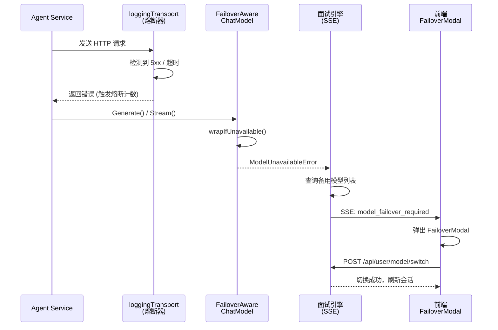

# 9.2.2 模型故障切换（Failover）

在上一节中，我们构建了统一的模型接入层，让系统能够"一套代码对接所有供应商"。但在生产环境中，光能接入还远远不够——**模型服务会宕机**。OpenAI 的 API 可能在某个下午突然返回 503，DeepSeek 的服务器可能因为流量激增而开始大面积超时。如果系统在遇到这类故障时直接把错误抛给正在面试的用户，整场面试就废了。

这就引出了一个关键的工程问题：当主模型"罢工"时，系统能否在**不中断用户体验**的前提下，将请求切换到备用模型？这正是本节要讨论的**模型故障切换（Failover）** 机制。

## 故障感知的整体架构

在深入代码之前，我们先建立全局视角。整个 Failover 机制由四层协同工作，形成了一条完整的"**故障感知 → 错误分类 → 信息推送 → 人工确认**"信号链：



这四层分别对应：**HTTP 传输层的熔断器**（感知故障）、**FailoverAwareChatModel 装饰器**（统一错误类型）、**面试引擎的 SSE 事件推送**（通知前端）、以及**前端 FailoverModal 组件**（引导用户完成切换）。接下来，我们逐层剖析。

## 第一层：熔断器——故障的"烟雾报警器"

故障切换的前提是**能感知到故障**。在 9.2.1 节中，我们介绍了装饰器模式的 HTTP Transport 管线，其中 `loggingTransport` 层集成了一个基于 Sony 开源库 `gobreaker` 的熔断器。这个熔断器就是整条链路中最早的"烟雾报警器"。

代码清单 9-7 展示了熔断器的核心配置：

代码清单 9-7 熔断器配置与创建
```go
func NewCircuitBreaker(name string) *CircuitBreaker {
    settings := gobreaker.Settings{
        Name:        name,
        MaxRequests: 3,                // 半开状态下允许通过的最大请求数
        Interval:    60 * time.Second, // 统计窗口：60 秒内的失败情况
        Timeout:     30 * time.Second, // 熔断后 30 秒进入半开状态
        ReadyToTrip: func(counts gobreaker.Counts) bool {
            // 当请求数 ≥ 5 且失败率 ≥ 60% 时触发熔断
            failureRatio := float64(counts.TotalFailures) / float64(counts.Requests)
            return counts.Requests >= 5 && failureRatio >= 0.6
        },
        OnStateChange: func(name string, from gobreaker.State, to gobreaker.State) {
            fmt.Printf("[CircuitBreaker] %s state changed from %s to %s\n",
                name, from, to)
        },
    }
    return &CircuitBreaker{cb: gobreaker.NewCircuitBreaker(settings)}
}
```

理解这段代码需要先了解熔断器的三态模型，这是微服务架构中的经典模式：

- **Closed（关闭/正常）**：所有请求正常通过。熔断器在后台默默统计成功和失败次数。
- **Open（打开/熔断）**：当失败率超过阈值时，熔断器"跳闸"。此时所有请求被直接拒绝，不再发往下游服务，避免对已经不可用的服务持续施压。
- **Half-Open（半开/试探）**：熔断一段时间后（本例中是 30 秒），熔断器允许少量请求（最多 3 个）通过，用来"试探"下游服务是否恢复。如果试探成功，回到 Closed 状态；如果仍然失败，再次回到 Open 状态。

这里有两个关键参数值得注意。`ReadyToTrip` 函数定义了触发熔断的条件：在 60 秒的统计窗口内，当总请求数达到 5 次且失败率超过 60% 时，熔断器会从 Closed 切换到 Open。这个阈值的设计是经过权衡的——如果只是偶发的一两次超时（可能是网络抖动），不应该立即触发模型切换；但如果连续多次失败，说明问题是系统性的，必须快速响应。

`OnStateChange` 回调则是可观测性的关键。每当熔断器状态变化时，它都会打印日志。在生产环境中，这些日志可以对接告警系统（如 Prometheus + Grafana），让运维团队第一时间感知到某个模型的服务质量下降。

在 `loggingTransport` 中，熔断器被集成到 HTTP 请求的执行路径上：

代码清单 9-8 Transport 层中的熔断器集成
```go
func (t *loggingTransport) RoundTrip(req *http.Request) (*http.Response, error) {
    // 使用熔断器包裹实际的 HTTP 请求
    result, err := t.CircuitBreaker.Execute(func() (interface{}, error) {
        resp, err := t.Transport.RoundTrip(req)
        if err != nil {
            return nil, err   // 网络错误，计入失败
        }
        // 5xx 和 429 状态码视为"失败"，触发熔断计数
        if resp.StatusCode >= 500 || resp.StatusCode == 429 {
            return resp, fmt.Errorf("server error or rate limit: %s", resp.Status)
        }
        return resp, nil
    })

    if err != nil {
        // 熔断器处于 Open 状态时的快速失败
        if err == circuitbreaker.ErrOpen || err == circuitbreaker.ErrTooMany {
            return nil, err
        }
        return nil, err
    }

    resp := result.(*http.Response)
    return resp, nil
}
```

注意这里的判断逻辑：**不仅网络错误（`err != nil`）会被计入失败次数，服务器返回的 5xx 状态码和 429（请求过多）也会被视为失败**。这是因为从 Failover 的角度看，服务器返回 500 Internal Server Error 和完全断开网络连接的效果是一样的——都意味着这个模型当前无法正常服务。

当熔断器进入 Open 状态后，后续的请求会立即收到 `ErrOpen` 错误，不再发起实际的网络调用。这带来两个好处：第一，避免了无意义的等待和重试，用户可以更快地看到切换提示；第二，减少了对已经过载的服务器的请求压力，给它恢复的机会——这在微服务领域被称为"**背压（Backpressure）**"。

## 第二层：FailoverAwareChatModel——统一的错误"翻译官"

熔断器解决了"感知故障"的问题，但它产生的错误类型多种多样：可能是 `ErrOpen`（熔断已触发）、可能是 `net/http` 的超时错误、也可能是底层 TCP 连接被拒绝的错误。上层业务代码不应该关心这些底层细节——它只需要知道一件事：**这个模型现在能不能用？**

为此，我们设计了 `FailoverAwareChatModel` 装饰器。它像一个"翻译官"，把各种底层错误统一翻译成一种业务语言：`ModelUnavailableError`。

首先是错误类型的定义：

代码清单 9-9 ModelUnavailableError 定义
```go
// ModelUnavailableError 表示大模型调用遇到不可用故障
// 用于区分普通的业务参数错误与需要触发 Failover 的错误
type ModelUnavailableError struct {
    OriginalErr error   // 保留原始错误，供日志和调试使用
    ModelName   string  // 哪个模型出了问题
}

func (e *ModelUnavailableError) Error() string {
    return fmt.Sprintf("model %s unavailable: %v", e.ModelName, e.OriginalErr)
}

func (e *ModelUnavailableError) Unwrap() error {
    return e.OriginalErr
}
```

这个错误类型的设计遵循了 Go 语言 `errors` 包的最佳实践。`Unwrap()` 方法使得上层代码可以通过 `errors.As()` 进行类型断言，同时也能通过 `errors.Unwrap()` 获取原始错误进行调试。`ModelName` 字段则记录了出故障的模型名称，这个信息后续会被传递到前端，展示在切换弹窗中。

然后是装饰器本身：

代码清单 9-10 FailoverAwareChatModel 装饰器
```go
// FailoverAwareChatModel 装饰器：包装底层的 ChatModel，
// 当 Generate 或 Stream 发生不可用错误时，
// 统一转换为 ModelUnavailableError 并透传上层。
type FailoverAwareChatModel struct {
    model.ToolCallingChatModel   // 嵌入原始模型接口
    ModelName string
}

func (m *FailoverAwareChatModel) Generate(ctx context.Context,
    input []*schema.Message, opts ...model.Option) (*schema.Message, error) {
    msg, err := m.ToolCallingChatModel.Generate(ctx, input, opts...)
    if err != nil {
        return msg, m.wrapIfUnavailable(err)
    }
    return msg, nil
}

func (m *FailoverAwareChatModel) Stream(ctx context.Context,
    input []*schema.Message, opts ...model.Option) (
    *schema.StreamReader[*schema.Message], error) {
    stream, err := m.ToolCallingChatModel.Stream(ctx, input, opts...)
    if err != nil {
        return stream, m.wrapIfUnavailable(err)
    }
    return stream, nil
}

func (m *FailoverAwareChatModel) wrapIfUnavailable(err error) error {
    if err == nil {
        return nil
    }
    return errors.NewModelUnavailableError(m.ModelName, err)
}
```

这个装饰器的巧妙之处在于它的**透明性**。它通过 Go 的结构体嵌入（`model.ToolCallingChatModel`）实现了接口的"隐式代理"——上层代码看到的仍然是一个标准的 `ToolCallingChatModel` 接口，完全不需要修改任何调用方的代码。只有在出错时，行为才有所不同：错误被包装为 `ModelUnavailableError`，像一个信号弹一样向上层传递"需要 Failover"的信息。

在 `CreatOpenAiChatModel` 工厂函数中，装饰器被安装在返回值上：

```go
func CreatOpenAiChatModel(ctx context.Context, userId uint) (model.ToolCallingChatModel, error) {
    // ... 省略配置获取和 HTTP 客户端组装 ...

    chatModel, err := openai.NewChatModel(ctx, &openai.ChatModelConfig{
        APIKey: key, Model: modelName, BaseURL: url, HTTPClient: httpClient,
    })
    if err != nil {
        return nil, handleModelError(err)
    }

    // 装饰器：为模型穿上"故障感知"的外衣
    return &FailoverAwareChatModel{
        ToolCallingChatModel: chatModel,
        ModelName:            modelName,
    }, nil
}
```

这意味着上层所有的 Agent——无论是 Go 专项面试官、综合面试官还是押题 Agent——都在无感知的情况下获得了 Failover 能力。它们调用 `Generate()` 或 `Stream()` 时，如果模型不可用，返回的错误一定是 `ModelUnavailableError` 类型。

## 第三层：面试引擎——从错误到用户通知

`ModelUnavailableError` 向上传播后，最终会被面试引擎捕获。面试引擎需要做出关键决策：**是直接结束面试，还是给用户一次"抢救"的机会？**

在我们的系统中，答案是后者。面试引擎会通过 SSE（Server-Sent Events）向前端推送一个 `model_failover_required` 事件，携带故障模型的信息和可用的备选模型列表。

代码清单 9-11 面试引擎中的 Failover 处理逻辑
```go
if err != nil {
    log.Printf("[Interview Engine] Failed to generate question: %v", err)

    // 检查是否是大模型不可用错误
    var unavailableErr *errors.ModelUnavailableError
    if errors.As(err, &unavailableErr) {
        // 从数据库查询用户配置的备用模型
        backupModels, listErr := model.UserModelDao.ListBackupModels(
            int64(session.UserID), 0)

        if listErr != nil || len(backupModels) == 0 {
            // 没有备用模型：只能通知用户去设置页面添加
            SendErrorEvent(writer, fmt.Sprintf(
                "大模型调用失败，且您没有备用模型可供切换，"+
                "请前往设置页面配置。原始错误：%v",
                unavailableErr.OriginalErr))
        } else {
            // 有备用模型：推送切换事件，让用户选择
            failoverData := map[string]interface{}{
                "failed_model_name": unavailableErr.ModelName,
                "error_reason":      unavailableErr.OriginalErr.Error(),
                "available_models":  buildModelList(backupModels),
            }
            SendSSEEvent(writer, map[string]interface{}{
                "type": "model_failover_required",
                "data": failoverData,
            })
        }
        return // 暂停面试循环，等待前端指令
    }

    // 其他非模型故障的错误，正常处理
    SendErrorEvent(writer, fmt.Sprintf("Interview failed: %s", err.Error()))
}
```

这段代码有几个值得注意的设计决策：

**备用模型的查询逻辑**。`ListBackupModels` 函数从 `user_model` 表中查询当前用户所有未删除的模型配置。它不仅包含已启用的模型，也包含状态为"禁用"的模型——因为一个被手动禁用的模型（可能是用户之前切换掉的）在紧急情况下完全可以作为备选方案。

**SSE 事件的数据结构**。`model_failover_required` 事件携带了三个关键信息：`failed_model_name`（哪个模型坏了）、`error_reason`（具体错误原因，便于用户判断是临时故障还是配置问题）、以及 `available_models`（可选的备用模型列表）。这套数据足以让前端渲染一个完整的切换界面。

**面试循环的暂停机制**。注意代码最后的 `return`——它会暂停整个面试循环。面试不会因为模型故障而直接结束，而是停在当前位置，等待前端完成模型切换后通过页面刷新重新连接。

### Eino Graph 编排下的错误透传挑战

值得一提的是，在使用 Eino 的 Graph 编排（`compose.NewGraph`）时，错误的传播路径会更复杂。Graph 中的节点抛出的错误会被 Eino 框架包装为 `NodeRunError`，这导致标准的 `errors.As()` 类型断言可能失效——因为原始的 `ModelUnavailableError` 被嵌套在了多层包装之下。

为了解决这个问题，面试引擎在 Graph 循环中增加了一个基于字符串匹配的兜底逻辑：

代码清单 9-12 Graph 编排场景下的错误检测兜底
```go
var unavailableErr *errors.ModelUnavailableError
isUnavailable := false

// 优先尝试标准的类型断言
if errors.As(err, &unavailableErr) {
    isUnavailable = true
}

// 兜底：如果被 Eino Graph 包裹导致 errors.As 失败，
// 则通过错误消息字符串匹配来判断
if !isUnavailable && strings.Contains(err.Error(), "NodeRunError") {
    isUnavailable = true
    unavailableErr = &errors.ModelUnavailableError{
        OriginalErr: err,
        ModelName:   "Current Model",
    }
}
```

这种"**先尝试类型断言，失败后退化到字符串匹配**"的策略，在有外部框架参与错误包装的场景下是一种务实的做法。虽然字符串匹配不如类型断言优雅，但它确保了 Failover 信号不会因为框架的错误包装行为而丢失。

## 第四层：前端 FailoverModal——用户的"一键切换"

当前端通过 SSE 收到 `model_failover_required` 事件后，它需要为用户提供一个**直观、低认知负担**的切换界面。用户正在面试中，他们没有心情阅读复杂的技术错误信息——他们只想知道"发生了什么"以及"我该怎么办"。

前端在 SSE 事件处理循环中捕获这个事件：

代码清单 9-13 SSE 事件中的 Failover 事件捕获
```tsx
} else if (payload?.type === 'model_failover_required') {
    console.error('[模型失效]', payload.data);
    setFailoverData(payload.data);     // 存储故障信息
    setShowFailoverModal(true);        // 弹出切换弹窗
    setStarting(false);                // 复位加载状态
    setSubmitting(false);
    setWaitingNextQuestion(false);
    break;  // 中断 SSE 流处理循环
}
```

`FailoverModal` 组件的设计遵循了"**最少操作原则**"：

代码清单 9-14 FailoverModal 核心逻辑
```tsx
const FailoverModal: React.FC<FailoverModalProps> = ({
    open, data, onSuccess, onCancel
}) => {
    const [selectedModelId, setSelectedModelId] = useState<number>();
    const [loading, setLoading] = useState(false);

    // 自动选中第一个可用模型，减少用户操作
    React.useEffect(() => {
        if (open && data?.available_models?.length > 0) {
            setSelectedModelId(data.available_models[0].id);
        }
    }, [open, data]);

    const handleSwitch = async () => {
        // 调用后端 API 切换默认模型
        const response = await fetch(USER_API.SWITCH_MODEL, {
            method: 'POST',
            headers: { 'Content-Type': 'application/json', ... },
            body: JSON.stringify({
                old_model_id: 0,              // 0 表示自动清除当前默认
                new_model_id: selectedModelId,
            }),
        });
        // ... 成功后调用 onSuccess 回调
    };

    return (
        <Modal title="大模型连接断开" open={open} centered
               maskClosable={false}>
            <Alert type="error"
                message={`当前模型 ${data?.failed_model_name} 失去响应`}
                description={`报错信息: ${data?.error_reason}`} />

            <div>发现您可以使用的备用大模型，请选择一个进行快速切换：</div>

            <Select value={selectedModelId}
                onChange={setSelectedModelId}
                options={data?.available_models?.map(m => ({
                    label: m.name, value: m.id
                }))} />
        </Modal>
    );
};
```

整个组件的交互流程只有三步：

- **弹窗出现**，展示错误信息（"当前模型 GPT-4o 失去响应"）和具体原因（"server error: 503 Service Unavailable"）。
- **自动预选**第一个备用模型，用户也可以从下拉列表中手动选择其他模型。
- 用户点击"**确认切换**"，前端调用 `POST /api/user/model/switch` 将该用户的默认模型切换为选中的备用模型。

切换成功后，`onSuccess` 回调会根据当前面试进度决定下一步动作：如果面试还没开始（首题就失败了），直接刷新页面重新发起面试；如果面试已经进行到一半，则尝试重新提交上一轮的答案，让面试引擎用新模型接力。

## 模型切换的数据库操作

最后来看后端 `SwitchUserModel` 的实现。这个操作通过数据库事务保证了原子性：

代码清单 9-15 模型切换的原子事务
```go
func (u *_UserModel) SwitchUserModel(userID int64,
    oldModelID, newModelID int64) error {

    tx := getDB().Begin()

    // 第一步：卸任当前主模型
    if oldModelID > 0 {
        // 指定了旧模型 ID，只卸任这一个
        tx.Model(&UserModel{}).
            Where("id = ? AND user_id = ?", oldModelID, userID).
            Updates(map[string]interface{}{
                "status": 0, "is_default": 0,
            })
    } else {
        // 未指定旧模型（前端传 0），兜底清除所有默认模型
        tx.Model(&UserModel{}).
            Where("user_id = ? AND is_default = 1", userID).
            Updates(map[string]interface{}{
                "status": 0, "is_default": 0,
            })
    }

    // 第二步：启用新模型并设为默认
    tx.Model(&UserModel{}).
        Where("id = ? AND user_id = ?", newModelID, userID).
        Updates(map[string]interface{}{
            "status": 1, "is_default": 1,
        })

    return tx.Commit().Error
}
```

`oldModelID` 传 0 的设计值得关注。在 Failover 场景中，前端并不一定知道当前失败模型的精确 ID（因为 SSE 事件只传递了模型名称，不是数据库 ID），所以它传 0 作为"通配符"，让后端自动清除当前用户的所有默认模型。这种**宽容的接口设计**避免了前端在紧急情况下还需要额外查询的麻烦。

## 实战：OpenAI 宕机切换 DeepSeek

现在把所有组件串起来，看一个完整的实战场景：用户正在使用 GPT-4o 进行面试，突然 OpenAI 的 API 开始返回 503。

**第 1～4 次请求**：`loggingTransport` 中的熔断器记录到 4 次失败，但还没有达到触发阈值（需要 5 次请求且失败率超过 60%），系统继续尝试。此时用户看到的是"正在思考下一题..."的加载动画。

**第 5 次请求**：失败率达到 100%（5/5），超过了 60% 的阈值，熔断器从 Closed 切换到 Open。控制台输出：`[CircuitBreaker] openai-gpt-4o state changed from closed to open`。

**后续请求**：熔断器直接返回 `ErrOpen`，不再发起网络调用。这个错误向上传播，被 `FailoverAwareChatModel` 捕获并包装为 `ModelUnavailableError{ModelName: "gpt-4o", OriginalErr: ErrOpen}`。

**面试引擎**：捕获到 `ModelUnavailableError`，查询该用户的备用模型列表，发现用户还配置了一个 DeepSeek 模型。通过 SSE 推送 `model_failover_required` 事件。

**前端弹窗**：FailoverModal 弹出，显示"当前模型 gpt-4o 失去响应"，下拉列表中出现"DeepSeek V3"选项。

**用户确认**：用户点击"确认切换"，前端调用 `/api/user/model/switch` 将 DeepSeek 设为默认模型，然后刷新页面。新的面试请求通过 `CreatOpenAiChatModel` 工厂函数读取到更新后的默认模型配置，请求被发往 DeepSeek 的 API 端点——面试继续。

整个过程中，用户的付出仅仅是**点击两下鼠标**（选择备用模型 + 确认切换）。面试数据（已回答的问题和答案）不会丢失，因为它们已经被持久化到数据库中；新的面试会从故障点的前一个问题开始接力。

## 当前方案的权衡与演进方向

需要坦诚地说，当前的 Failover 方案是一个"**半自动**"设计：系统自动感知故障、自动查询备选、自动推送通知，但最终的切换动作需要用户手动确认。

为什么不做成全自动？这是一个深思熟虑的 Trade-off：

- **成本可控**。不同供应商的定价差异巨大，GPT-4o 的价格是 DeepSeek V3 的数倍。自动切换可能导致用户在不知情的情况下产生高额费用。
- **质量可控**。不同模型的回答质量有差异。用户可能宁愿等 OpenAI 恢复，也不想用一个他认为质量不够的模型来完成面试。
- **信任感**。在面试这种高压场景下，让用户对系统的行为保持控制权，比"替用户做决定"更能建立信任。

如果未来业务场景需要全自动 Failover（比如一个不面向终端用户的批量评估服务），只需要在面试引擎层做调整：将"推送 SSE 事件等待用户确认"替换为"直接调用 `SwitchUserModel` 并重试当前步骤"，底层的熔断器和错误感知机制完全可以复用。

## 本节小结

本节构建了一套完整的模型故障切换机制。它由四个层次协同工作：最底层的熔断器基于 `gobreaker` 实现了三态（Closed/Open/Half-Open）的故障感知，当 60 秒内失败率超过 60% 时自动触发熔断；`FailoverAwareChatModel` 装饰器将各种底层异常统一翻译为 `ModelUnavailableError`，为上层提供了清晰的错误语义；面试引擎通过 SSE 将故障信息和备选模型列表实时推送给前端；前端的 `FailoverModal` 组件则以最少操作量引导用户完成模型切换。

这套机制的核心设计理念是"**感知要自动，决策给用户**"——系统在故障感知和信息呈现上做到极致自动化，但把最终的切换决策权留给用户，兼顾了系统的弹性和用户的控制权。在供应商多元化已成常态的今天，这种"**平时无感知、故障有退路**"的设计，是每一个依赖外部 AI 服务的系统都应该认真考虑的工程保障。
