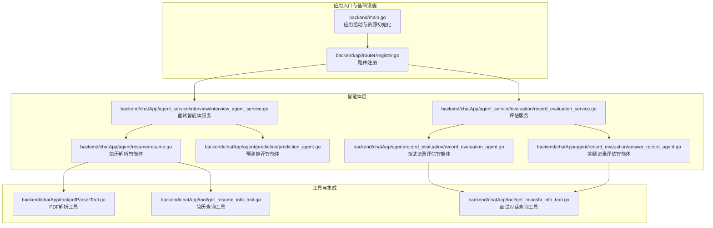
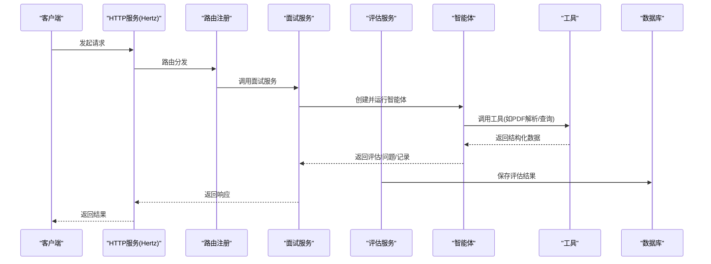
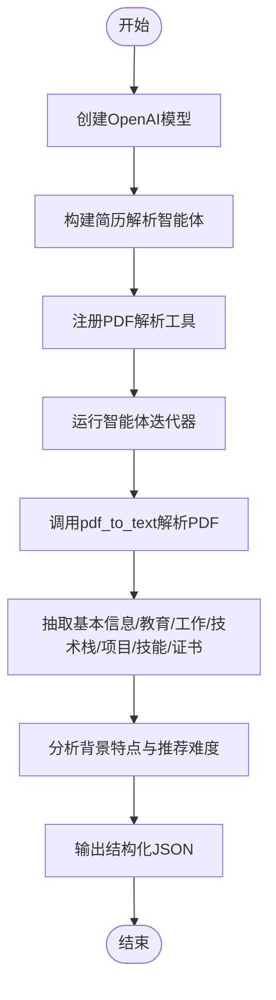
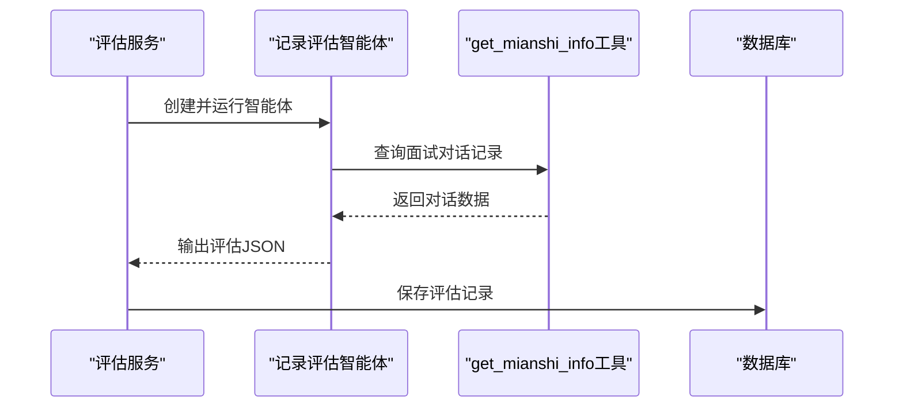
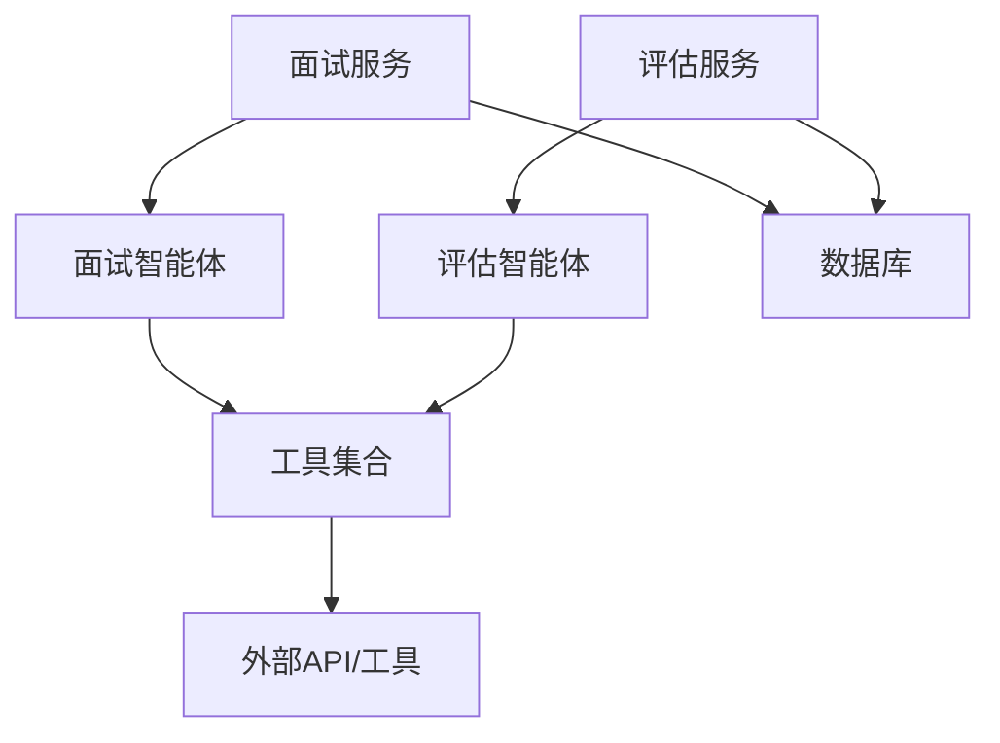

# AI智能体系统

<cite>
**本文档引用的文件**
- [backend/main.go](file://backend/main.go)
- [backend/chatApp/main.go](file://backend/chatApp/main.go)
- [backend/chatApp/config/config.go](file://backend/chatApp/config/config.go)
- [backend/chatApp/agent/resume/resume.go](file://backend/chatApp/agent/resume/resume.go)
- [backend/chatApp/agent/prediction/prediction_agent.go](file://backend/chatApp/agent/prediction/prediction_agent.go)
- [backend/chatApp/agent/record_evaluation/answer_record_agent.go](file://backend/chatApp/agent/record_evaluation/answer_record_agent.go)
- [backend/chatApp/agent/record_evaluation/record_evaluation_agent.go](file://backend/chatApp/agent/record_evaluation/record_evaluation_agent.go)
- [backend/chatApp/agent/interview/specialized/go_agent.go](file://backend/chatApp/agent/interview/specialized/go_agent.go)
- [backend/chatApp/agent/interview/specialized/java_agent.go](file://backend/chatApp/agent/interview/specialized/java_agent.go)
- [backend/chatApp/tool/pdfParserTool.go](file://backend/chatApp/tool/pdfParserTool.go)
- [backend/chatApp/tool/get_mianshi_info_tool.go](file://backend/chatApp/tool/get_mianshi_info_tool.go)
- [backend/chatApp/tool/get_resume_info_tool.go](file://backend/chatApp/tool/get_resume_info_tool.go)
- [backend/chatApp/agent_service/interview/interview_agent_service.go](file://backend/chatApp/agent_service/interview/interview_agent_service.go)
- [backend/chatApp/agent_service/evaluation/record_evaluation_service.go](file://backend/chatApp/agent_service/evaluation/record_evaluation_service.go)
- [backend/api/router/register.go](file://backend/api/router/register.go)
</cite>

## 目录
1. [简介](#简介)
2. [项目结构](#项目结构)
3. [核心组件](#核心组件)
4. [架构总览](#架构总览)
5. [详细组件分析](#详细组件分析)
6. [依赖关系分析](#依赖关系分析)
7. [性能考虑](#性能考虑)
8. [故障排除指南](#故障排除指南)
9. [结论](#结论)
10. [附录](#附录)

## 简介
本项目是一个基于多智能体架构的AI面试辅助系统，围绕“简历分析-面试问题生成-答案评估-预测推荐”闭环展开。系统通过多种专用智能体协同工作，结合工具调用与外部API集成，实现从简历解析、面试押题、面试问答到评估报告的全链路智能化。

## 项目结构
后端采用模块化组织，核心分为三层：
- 应用入口与基础设施：负责配置加载、数据库/缓存/消息队列初始化、HTTP服务启动与优雅停机。
- 智能体层：封装简历解析、面试问题生成、答案评估、专项面试官等智能体，统一通过服务层调度。
- 工具与集成：提供PDF解析、简历/面试记录查询等工具，连接内部模型与外部API。

图表来源
- [backend/main.go](file://backend/main.go#L29-L173)
- [backend/api/router/register.go](file://backend/api/router/register.go#L11-L15)
- [backend/chatApp/agent_service/interview/interview_agent_service.go](file://backend/chatApp/agent_service/interview/interview_agent_service.go#L30-L73)
- [backend/chatApp/agent_service/evaluation/record_evaluation_service.go](file://backend/chatApp/agent_service/evaluation/record_evaluation_service.go#L17-L108)
- [backend/chatApp/agent/resume/resume.go](file://backend/chatApp/agent/resume/resume.go#L14-L108)
- [backend/chatApp/agent/prediction/prediction_agent.go](file://backend/chatApp/agent/prediction/prediction_agent.go#L25-L65)
- [backend/chatApp/agent/record_evaluation/record_evaluation_agent.go](file://backend/chatApp/agent/record_evaluation/record_evaluation_agent.go#L14-L38)
- [backend/chatApp/agent/record_evaluation/answer_record_agent.go](file://backend/chatApp/agent/record_evaluation/answer_record_agent.go#L14-L40)
- [backend/chatApp/tool/pdfParserTool.go](file://backend/chatApp/tool/pdfParserTool.go#L39-L123)
- [backend/chatApp/tool/get_resume_info_tool.go](file://backend/chatApp/tool/get_resume_info_tool.go#L21-L47)
- [backend/chatApp/tool/get_mianshi_info_tool.go](file://backend/chatApp/tool/get_mianshi_info_tool.go#L23-L49)

章节来源
- [backend/main.go](file://backend/main.go#L29-L173)
- [backend/api/router/register.go](file://backend/api/router/register.go#L11-L15)

## 核心组件
- 简历解析智能体：负责将PDF简历解析为结构化数据，抽取基本信息、教育背景、工作经历、技术栈、项目经验、技能特长、证书资格等，并给出推荐难度与关注点。
- 面试问题生成智能体：基于简历与岗位要求，生成标准化的面试题目，包含重点考察方向、思考路径、参考答案与可能追问。
- 答案评估智能体：对面试记录进行评估，输出评分、维度分析、优缺点与改进建议。
- 预测推荐智能体：根据简历与目标岗位，预测可能的面试题目并输出结构化JSON。
- 专项面试官智能体：面向Go、Java等技术栈的深度面试，可选接入简历工具以增强上下文。
- 工具体系：PDF解析、简历查询、面试对话查询等，支撑智能体的工具调用与外部数据集成。
- 服务层：统一管理智能体生命周期、消息迭代、回调与超时控制，保证流程可控与可观测。

章节来源
- [backend/chatApp/agent/resume/resume.go](file://backend/chatApp/agent/resume/resume.go#L14-L108)
- [backend/chatApp/agent/prediction/prediction_agent.go](file://backend/chatApp/agent/prediction/prediction_agent.go#L25-L65)
- [backend/chatApp/agent/record_evaluation/record_evaluation_agent.go](file://backend/chatApp/agent/record_evaluation/record_evaluation_agent.go#L14-L38)
- [backend/chatApp/agent/record_evaluation/answer_record_agent.go](file://backend/chatApp/agent/record_evaluation/answer_record_agent.go#L14-L40)
- [backend/chatApp/agent/interview/specialized/go_agent.go](file://backend/chatApp/agent/interview/specialized/go_agent.go#L14-L47)
- [backend/chatApp/agent/interview/specialized/java_agent.go](file://backend/chatApp/agent/interview/specialized/java_agent.go#L14-L47)
- [backend/chatApp/tool/pdfParserTool.go](file://backend/chatApp/tool/pdfParserTool.go#L39-L123)
- [backend/chatApp/tool/get_resume_info_tool.go](file://backend/chatApp/tool/get_resume_info_tool.go#L21-L47)
- [backend/chatApp/tool/get_mianshi_info_tool.go](file://backend/chatApp/tool/get_mianshi_info_tool.go#L23-L49)

## 架构总览
系统采用“HTTP接口 -> 服务层调度 -> 智能体执行 -> 工具调用 -> 数据持久化”的主干流程。HTTP服务由Hertz提供，路由注册后交由具体处理器处理；服务层负责智能体实例化、消息迭代与回调；智能体通过工具节点调用外部能力；评估结果持久化至数据库。

图表来源
- [backend/api/router/register.go](file://backend/api/router/register.go#L11-L15)
- [backend/chatApp/agent_service/interview/interview_agent_service.go](file://backend/chatApp/agent_service/interview/interview_agent_service.go#L75-L154)
- [backend/chatApp/agent_service/evaluation/record_evaluation_service.go](file://backend/chatApp/agent_service/evaluation/record_evaluation_service.go#L17-L108)
- [backend/chatApp/tool/pdfParserTool.go](file://backend/chatApp/tool/pdfParserTool.go#L39-L123)
- [backend/chatApp/tool/get_mianshi_info_tool.go](file://backend/chatApp/tool/get_mianshi_info_tool.go#L23-L49)

## 详细组件分析

### 简历解析智能体
- 职责：解析PDF简历，抽取结构化信息并生成面试关注点与难度建议。
- 实现要点：
  - 使用OpenAI模型作为推理引擎。
  - 通过PDF解析工具将PDF转为纯文本，再进行结构化解析。
  - 限定输出为标准JSON，确保下游处理一致性。
- 工具调用：pdf_to_text工具，支持按页或合并输出。
- 处理流程：创建模型 -> 构建智能体 -> 注册工具 -> 运行迭代器 -> 输出JSON。

图表来源
- [backend/chatApp/agent/resume/resume.go](file://backend/chatApp/agent/resume/resume.go#L14-L108)
- [backend/chatApp/tool/pdfParserTool.go](file://backend/chatApp/tool/pdfParserTool.go#L39-L123)

章节来源
- [backend/chatApp/agent/resume/resume.go](file://backend/chatApp/agent/resume/resume.go#L14-L108)
- [backend/chatApp/tool/pdfParserTool.go](file://backend/chatApp/tool/pdfParserTool.go#L39-L123)

### 面试问题生成智能体
- 职责：根据简历与岗位要求生成标准化面试题目，包含重点考察、思考路径、参考答案与追问。
- 实现要点：
  - 严格限制输出数量与格式，确保可解析性。
  - 通过结构化JSON模板约束输出字段。
- 适用场景：面试前押题、个性化题目生成。

章节来源
- [backend/chatApp/agent/prediction/prediction_agent.go](file://backend/chatApp/agent/prediction/prediction_agent.go#L25-L65)

### 答案评估智能体（面试记录）
- 职责：对面试记录进行综合评估，输出评分、维度分析与改进建议。
- 实现要点：
  - 通过get_mianshi_info工具获取完整对话记录。
  - 采用超时控制与回调机制，逐步输出评估结果。
  - 将评估结果持久化至数据库，便于后续查询与统计。

图表来源
- [backend/chatApp/agent_service/evaluation/record_evaluation_service.go](file://backend/chatApp/agent_service/evaluation/record_evaluation_service.go#L17-L108)
- [backend/chatApp/agent/record_evaluation/record_evaluation_agent.go](file://backend/chatApp/agent/record_evaluation/record_evaluation_agent.go#L14-L38)
- [backend/chatApp/tool/get_mianshi_info_tool.go](file://backend/chatApp/tool/get_mianshi_info_tool.go#L23-L49)

章节来源
- [backend/chatApp/agent_service/evaluation/record_evaluation_service.go](file://backend/chatApp/agent_service/evaluation/record_evaluation_service.go#L17-L108)
- [backend/chatApp/agent/record_evaluation/record_evaluation_agent.go](file://backend/chatApp/agent/record_evaluation/record_evaluation_agent.go#L14-L38)
- [backend/chatApp/tool/get_mianshi_info_tool.go](file://backend/chatApp/tool/get_mianshi_info_tool.go#L23-L49)

### 答案评估智能体（答题记录）
- 职责：针对答题记录中的父问题与子问题进行逐条评估。
- 实现要点：
  - 与面试记录评估类似，通过工具获取对话数据并生成评估。
  - 支持回调输出，便于前端流式展示。

章节来源
- [backend/chatApp/agent/record_evaluation/answer_record_agent.go](file://backend/chatApp/agent/record_evaluation/answer_record_agent.go#L14-L40)
- [backend/chatApp/tool/get_mianshi_info_tool.go](file://backend/chatApp/tool/get_mianshi_info_tool.go#L23-L49)

### 专项面试官智能体（Go/Java）
- 职责：面向特定技术栈的深度面试，可选接入简历工具以增强上下文。
- 实现要点：
  - 通过服务层统一创建不同类型的专项智能体。
  - 可按需启用简历工具，提升面试针对性。

章节来源
- [backend/chatApp/agent/interview/specialized/go_agent.go](file://backend/chatApp/agent/interview/specialized/go_agent.go#L14-L47)
- [backend/chatApp/agent/interview/specialized/java_agent.go](file://backend/chatApp/agent/interview/specialized/java_agent.go#L14-L47)
- [backend/chatApp/agent_service/interview/interview_agent_service.go](file://backend/chatApp/agent_service/interview/interview_agent_service.go#L42-L73)

### 工具与外部API集成
- PDF解析工具：将本地PDF转换为纯文本，支持按页或合并输出，具备错误处理与元数据记录。
- 简历查询工具：根据简历ID查询解析后的简历信息。
- 面试对话查询工具：根据用户ID与报告ID查询面试对话记录，供评估智能体使用。

章节来源
- [backend/chatApp/tool/pdfParserTool.go](file://backend/chatApp/tool/pdfParserTool.go#L39-L123)
- [backend/chatApp/tool/get_resume_info_tool.go](file://backend/chatApp/tool/get_resume_info_tool.go#L21-L47)
- [backend/chatApp/tool/get_mianshi_info_tool.go](file://backend/chatApp/tool/get_mianshi_info_tool.go#L23-L49)

### 配置管理与启动流程
- 配置加载：支持从config.yaml加载OpenAI/谷歌等配置，具备环境变量展开能力。
- 应用启动：加载.env、初始化数据库与Redis、启动消息队列消费者、注册Hertz路由、启动HTTP服务并优雅停机。

章节来源
- [backend/chatApp/config/config.go](file://backend/chatApp/config/config.go#L34-L73)
- [backend/main.go](file://backend/main.go#L29-L173)

## 依赖关系分析
- 组件耦合：
  - 服务层与智能体层松耦合，通过类型枚举与工厂方法创建智能体。
  - 智能体与工具层通过工具节点解耦，便于替换与扩展。
  - 评估服务依赖工具与DAO，形成清晰的数据通路。
- 外部依赖：
  - Hertz提供HTTP服务与路由。
  - OpenAI模型提供推理能力。
  - Redis用于消息队列与缓存。
  - 数据库持久化评估与面试记录。

图表来源
- [backend/chatApp/agent_service/interview/interview_agent_service.go](file://backend/chatApp/agent_service/interview/interview_agent_service.go#L30-L73)
- [backend/chatApp/agent_service/evaluation/record_evaluation_service.go](file://backend/chatApp/agent_service/evaluation/record_evaluation_service.go#L17-L108)
- [backend/chatApp/tool/get_mianshi_info_tool.go](file://backend/chatApp/tool/get_mianshi_info_tool.go#L23-L49)

章节来源
- [backend/chatApp/agent_service/interview/interview_agent_service.go](file://backend/chatApp/agent_service/interview/interview_agent_service.go#L30-L73)
- [backend/chatApp/agent_service/evaluation/record_evaluation_service.go](file://backend/chatApp/agent_service/evaluation/record_evaluation_service.go#L17-L108)

## 性能考虑
- 超时控制：评估服务设置120秒超时，避免长时间阻塞；智能体迭代器支持回调，减少内存占用。
- 工具调用优化：PDF解析工具具备错误快速返回与日志记录，便于定位性能瓶颈。
- 并发与优雅停机：HTTP服务与消费者在统一的信号处理下优雅关闭，确保资源释放。
- 扩展建议：
  - 引入智能体缓存与会话复用，降低重复初始化成本。
  - 对工具调用增加重试与熔断策略，提升鲁棒性。
  - 使用连接池与限流策略，控制对外部API的并发与速率。

[本节为通用指导，无需列出章节来源]

## 故障排除指南
- 配置加载失败：检查config.yaml路径与字段完整性，确认环境变量展开是否正确。
- PDF解析失败：确认pdftotext命令可用、文件路径正确且可访问，查看工具返回的错误信息。
- 评估超时：检查智能体输出是否符合JSON格式，必要时调整MaxIterations或回调频率。
- 工具调用异常：核对工具元数据与参数定义，确保请求结构与返回结构一致。

章节来源
- [backend/chatApp/config/config.go](file://backend/chatApp/config/config.go#L34-L73)
- [backend/chatApp/tool/pdfParserTool.go](file://backend/chatApp/tool/pdfParserTool.go#L39-L123)
- [backend/chatApp/agent_service/evaluation/record_evaluation_service.go](file://backend/chatApp/agent_service/evaluation/record_evaluation_service.go#L17-L108)

## 结论
本系统通过多智能体架构实现了从简历解析到面试评估的全链路智能化，配合工具调用与外部API集成，满足复杂面试场景的需求。服务层统一调度、工具层解耦扩展，为后续功能扩展与性能优化提供了良好基础。

[本节为总结性内容，无需列出章节来源]

## 附录
- 扩展开发指南：
  - 新增智能体：在对应包下创建智能体构造函数，定义指令与工具配置，注册到服务层工厂。
  - 新增工具：遵循工具元数据规范，实现输入输出结构，通过工具节点注册。
  - 新增路由与处理器：在IDL与路由层新增接口，绑定到服务层方法。
- 性能优化策略：
  - 引入缓存与会话复用，减少模型初始化开销。
  - 对外部API调用增加重试与熔断，提升稳定性。
  - 使用连接池与限流，控制并发与速率。

[本节为通用指导，无需列出章节来源]