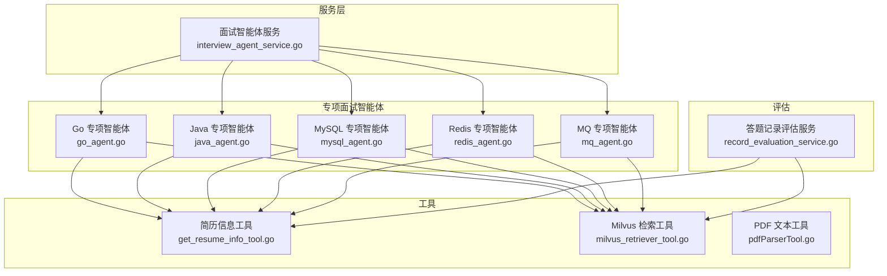
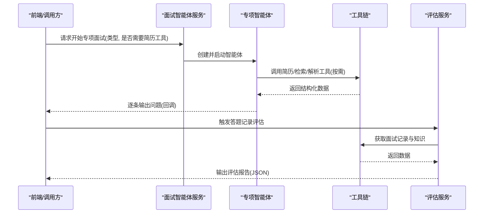
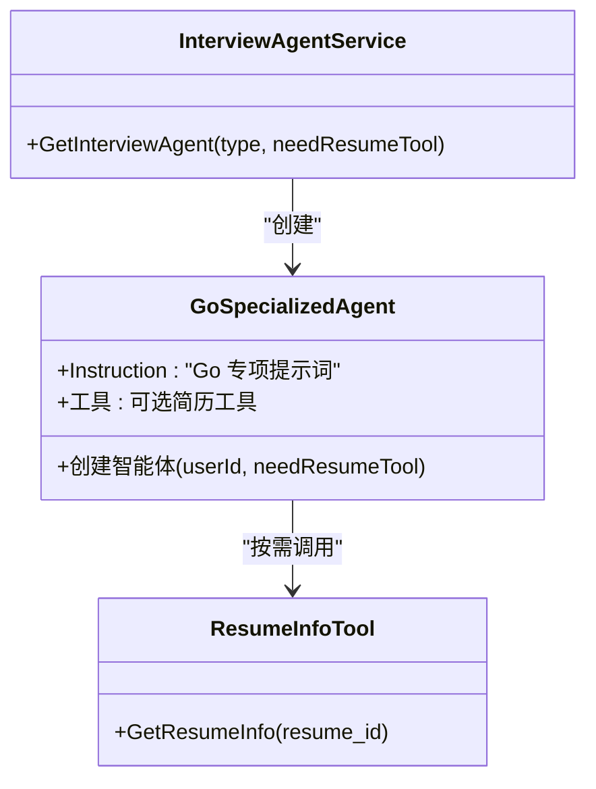
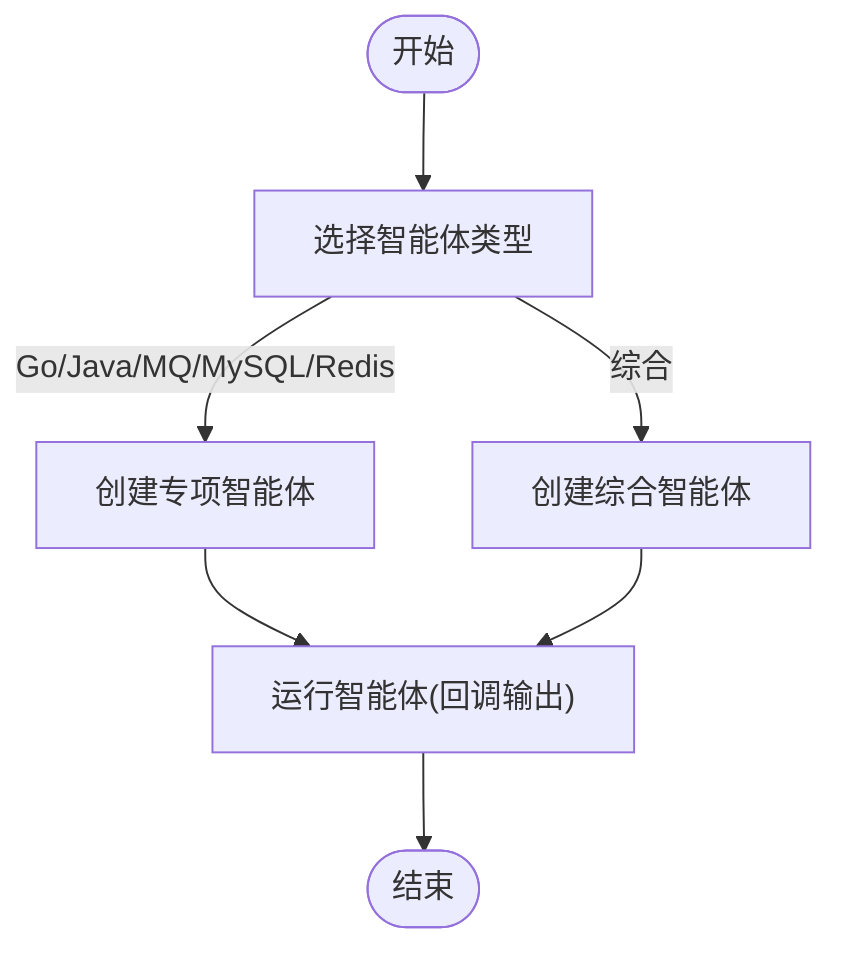
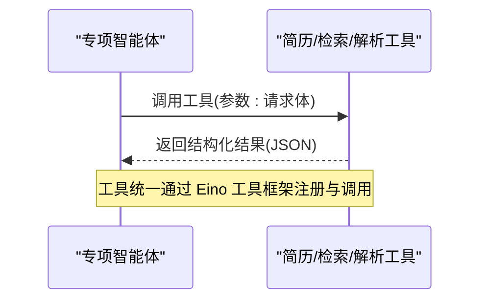
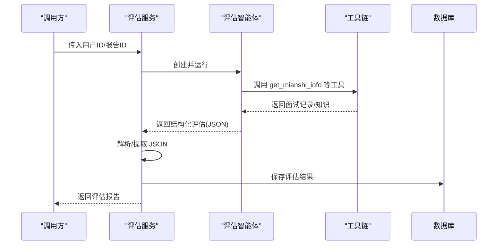
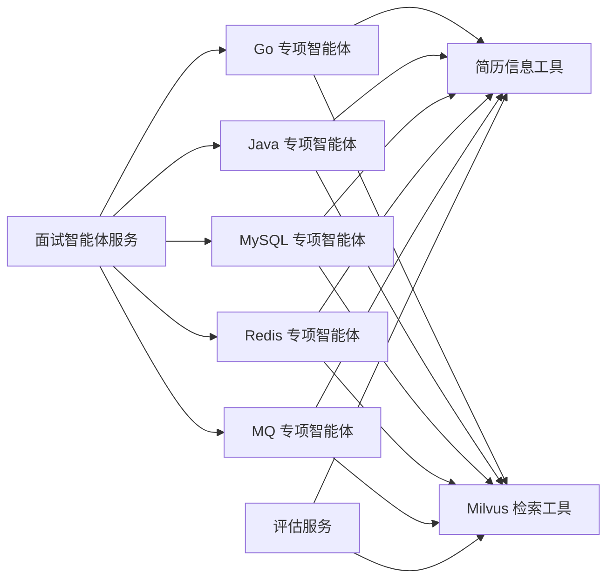

# 专项面试智能体

<cite>
**本文引用的文件**
- [backend/chatApp/agent/interview/specialized/go_agent.go](file://backend/chatApp/agent/interview/specialized/go_agent.go)
- [backend/chatApp/agent/interview/specialized/java_agent.go](file://backend/chatApp/agent/interview/specialized/java_agent.go)
- [backend/chatApp/agent/interview/specialized/mysql_agent.go](file://backend/chatApp/agent/interview/specialized/mysql_agent.go)
- [backend/chatApp/agent/interview/specialized/redis_agent.go](file://backend/chatApp/agent/interview/specialized/redis_agent.go)
- [backend/chatApp/agent/interview/specialized/mq_agent.go](file://backend/chatApp/agent/interview/specialized/mq_agent.go)
- [backend/chatApp/agent/interview/specialized/constants.go](file://backend/chatApp/agent/interview/specialized/constants.go)
- [backend/chatApp/agent_service/interview/interview_agent_service.go](file://backend/chatApp/agent_service/interview/interview_agent_service.go)
- [backend/chatApp/tool/get_resume_info_tool.go](file://backend/chatApp/tool/get_resume_info_tool.go)
- [backend/chatApp/tool/milvus_retriever_tool.go](file://backend/chatApp/tool/milvus_retriever_tool.go)
- [backend/chatApp/tool/pdfParserTool.go](file://backend/chatApp/tool/pdfParserTool.go)
- [backend/chatApp/agent_service/evaluation/record_evaluation_service.go](file://backend/chatApp/agent_service/evaluation/record_evaluation_service.go)
</cite>

## 目录
1. [简介](#简介)
2. [项目结构](#项目结构)
3. [核心组件](#核心组件)
4. [架构总览](#架构总览)
5. [详细组件分析](#详细组件分析)
6. [依赖关系分析](#依赖关系分析)
7. [性能考量](#性能考量)
8. [故障排查指南](#故障排查指南)
9. [结论](#结论)
10. [附录](#附录)

## 简介
本项目围绕“专项面试智能体”展开，面向 Go、Java、MySQL、Redis、MQ 等技术栈，提供可复用的智能面试流程与评估体系。专项智能体通过统一的服务层调度，结合提示词模板、工具链（简历解析、向量检索、PDF 文本抽取）以及答题记录评估流程，形成从“问题生成—对话—评估—归档”的闭环。

## 项目结构
- 后端采用 Go 语言与 CloudWeGo Eino 框架，按“领域/功能”组织代码：
  - 专项面试智能体位于 chatApp/agent/interview/specialized
  - 专项智能体服务位于 chatApp/agent_service/interview
  - 工具位于 chatApp/tool（简历信息、Milvus 向量检索、PDF 文本抽取）
  - 答题记录评估位于 chatApp/agent_service/evaluation
- 前端位于 frontend，提供面试入口与结果展示；后端提供 API 与内部服务。

图表来源
- [backend/chatApp/agent/interview/specialized/go_agent.go](file://backend/chatApp/agent/interview/specialized/go_agent.go#L1-L48)
- [backend/chatApp/agent/interview/specialized/java_agent.go](file://backend/chatApp/agent/interview/specialized/java_agent.go#L1-L48)
- [backend/chatApp/agent/interview/specialized/mysql_agent.go](file://backend/chatApp/agent/interview/specialized/mysql_agent.go#L1-L48)
- [backend/chatApp/agent/interview/specialized/redis_agent.go](file://backend/chatApp/agent/interview/specialized/redis_agent.go#L1-L48)
- [backend/chatApp/agent/interview/specialized/mq_agent.go](file://backend/chatApp/agent/interview/specialized/mq_agent.go#L1-L48)
- [backend/chatApp/agent_service/interview/interview_agent_service.go](file://backend/chatApp/agent_service/interview/interview_agent_service.go#L1-L155)
- [backend/chatApp/tool/get_resume_info_tool.go](file://backend/chatApp/tool/get_resume_info_tool.go#L1-L48)
- [backend/chatApp/tool/milvus_retriever_tool.go](file://backend/chatApp/tool/milvus_retriever_tool.go#L1-L144)
- [backend/chatApp/tool/pdfParserTool.go](file://backend/chatApp/tool/pdfParserTool.go#L1-L124)
- [backend/chatApp/agent_service/evaluation/record_evaluation_service.go](file://backend/chatApp/agent_service/evaluation/record_evaluation_service.go#L1-L183)

章节来源
- [backend/chatApp/agent/interview/specialized/go_agent.go](file://backend/chatApp/agent/interview/specialized/go_agent.go#L1-L48)
- [backend/chatApp/agent/interview/specialized/constants.go](file://backend/chatApp/agent/interview/specialized/constants.go#L1-L247)
- [backend/chatApp/agent_service/interview/interview_agent_service.go](file://backend/chatApp/agent_service/interview/interview_agent_service.go#L1-L155)

## 核心组件
- 专项智能体工厂：针对不同技术栈（Go/Java/MySQL/Redis/MQ）创建专用智能体，注入统一的提示词模板与可选简历工具。
- 面试智能体服务：集中管理智能体生命周期与运行，支持回调式输出与迭代执行。
- 工具链：
  - 简历信息工具：按简历 ID 获取解析后的简历内容，辅助面试官定向提问。
  - Milvus 检索工具：基于向量数据库检索相关文档，增强问题生成的知识支撑。
  - PDF 文本工具：将本地 PDF 转为纯文本，便于简历解析与知识导入。
- 答题记录评估服务：对一次面试的完整对话与问题进行结构化评估，产出评分、维度与改进建议，并落库。

章节来源
- [backend/chatApp/agent/interview/specialized/go_agent.go](file://backend/chatApp/agent/interview/specialized/go_agent.go#L14-L47)
- [backend/chatApp/agent/interview/specialized/constants.go](file://backend/chatApp/agent/interview/specialized/constants.go#L3-L50)
- [backend/chatApp/agent_service/interview/interview_agent_service.go](file://backend/chatApp/agent_service/interview/interview_agent_service.go#L42-L101)
- [backend/chatApp/tool/get_resume_info_tool.go](file://backend/chatApp/tool/get_resume_info_tool.go#L21-L47)
- [backend/chatApp/tool/milvus_retriever_tool.go](file://backend/chatApp/tool/milvus_retriever_tool.go#L48-L101)
- [backend/chatApp/tool/pdfParserTool.go](file://backend/chatApp/tool/pdfParserTool.go#L39-L112)
- [backend/chatApp/agent_service/evaluation/record_evaluation_service.go](file://backend/chatApp/agent_service/evaluation/record_evaluation_service.go#L17-L108)

## 架构总览
专项面试智能体采用“服务层调度 + 智能体 + 工具链 + 评估服务”的分层架构。服务层负责类型分发与运行控制，智能体负责对话与问题生成，工具链提供知识与数据支撑，评估服务负责最终评分与归档。

图表来源
- [backend/chatApp/agent_service/interview/interview_agent_service.go](file://backend/chatApp/agent_service/interview/interview_agent_service.go#L50-L101)
- [backend/chatApp/agent_service/evaluation/record_evaluation_service.go](file://backend/chatApp/agent_service/evaluation/record_evaluation_service.go#L17-L108)
- [backend/chatApp/tool/get_resume_info_tool.go](file://backend/chatApp/tool/get_resume_info_tool.go#L21-L47)
- [backend/chatApp/tool/milvus_retriever_tool.go](file://backend/chatApp/tool/milvus_retriever_tool.go#L48-L101)
- [backend/chatApp/tool/pdfParserTool.go](file://backend/chatApp/tool/pdfParserTool.go#L39-L112)

## 详细组件分析

### Go 专项面试智能体
- 职责：围绕 Go 语言的并发、性能、标准库、系统编程与工程实践进行递进式提问。
- 提示词要点：强调“不写代码”，聚焦“开放性问题+深度讨论+实战经验”。
- 工具集成：可选简历工具，结合候选人项目背景定制问题。
- 运行控制：最大迭代次数限制，避免无休止对话。

图表来源
- [backend/chatApp/agent/interview/specialized/go_agent.go](file://backend/chatApp/agent/interview/specialized/go_agent.go#L14-L47)
- [backend/chatApp/agent_service/interview/interview_agent_service.go](file://backend/chatApp/agent_service/interview/interview_agent_service.go#L58-L60)
- [backend/chatApp/tool/get_resume_info_tool.go](file://backend/chatApp/tool/get_resume_info_tool.go#L21-L47)

章节来源
- [backend/chatApp/agent/interview/specialized/go_agent.go](file://backend/chatApp/agent/interview/specialized/go_agent.go#L14-L47)
- [backend/chatApp/agent/interview/specialized/constants.go](file://backend/chatApp/agent/interview/specialized/constants.go#L3-L50)

### Java 专项面试智能体
- 职责：聚焦 JVM、多线程、集合框架、反射/动态代理、主流框架源码与性能优化。
- 提示词要点：强调“不写代码”，鼓励“案例分享+设计权衡+最佳实践”。

章节来源
- [backend/chatApp/agent/interview/specialized/java_agent.go](file://backend/chatApp/agent/interview/specialized/java_agent.go#L14-L47)
- [backend/chatApp/agent/interview/specialized/constants.go](file://backend/chatApp/agent/interview/specialized/constants.go#L52-L99)

### MySQL 专项面试智能体
- 职责：围绕索引优化、事务隔离、SQL 性能分析、架构设计（主从/分片）、高可用与备份恢复。
- 提示词要点：强调“不写代码”，关注“性能瓶颈定位+调优方法”。

章节来源
- [backend/chatApp/agent/interview/specialized/mysql_agent.go](file://backend/chatApp/agent/interview/specialized/mysql_agent.go#L14-L47)
- [backend/chatApp/agent/interview/specialized/constants.go](file://backend/chatApp/agent/interview/specialized/constants.go#L150-L197)

### Redis 专项面试智能体
- 职责：覆盖数据结构、持久化、缓存三大问题（穿透/击穿/雪崩）、集群与高可用、分布式锁/事务、监控与排障。
- 提示词要点：强调“不写代码”，关注“工程落地+稳定性保障”。

章节来源
- [backend/chatApp/agent/interview/specialized/redis_agent.go](file://backend/chatApp/agent/interview/specialized/redis_agent.go#L14-L47)
- [backend/chatApp/agent/interview/specialized/constants.go](file://backend/chatApp/agent/interview/specialized/constants.go#L199-L246)

### MQ 专项面试智能体
- 职责：消息顺序性与一致性、可靠性与幂等、消费者分组与负载均衡、事务消息与分布式事务、性能与高可用、产品对比与选型。
- 提示词要点：强调“不写代码”，关注“系统设计+故障处理”。

章节来源
- [backend/chatApp/agent/interview/specialized/mq_agent.go](file://backend/chatApp/agent/interview/specialized/mq_agent.go#L14-L47)
- [backend/chatApp/agent/interview/specialized/constants.go](file://backend/chatApp/agent/interview/specialized/constants.go#L101-L148)

### 面试智能体服务（调度层）
- 职责：根据类型创建对应专项智能体；支持回调式输出；封装统一运行流程。
- 关键点：类型枚举覆盖专项 Go/Java/MQ/MySQL/Redis；默认最大迭代次数统一设置。

图表来源
- [backend/chatApp/agent_service/interview/interview_agent_service.go](file://backend/chatApp/agent_service/interview/interview_agent_service.go#L42-L101)

章节来源
- [backend/chatApp/agent_service/interview/interview_agent_service.go](file://backend/chatApp/agent_service/interview/interview_agent_service.go#L14-L73)

### 工具链设计与使用
- 简历信息工具：按简历 ID 查询解析后的简历内容，作为“背景定制化提问”的知识来源。
- Milvus 检索工具：输入查询文本，返回相似文档列表与计数，支持错误格式化输出。
- PDF 文本工具：将本地 PDF 转为纯文本，支持分页/合并两种模式，便于简历解析与知识导入。

图表来源
- [backend/chatApp/tool/get_resume_info_tool.go](file://backend/chatApp/tool/get_resume_info_tool.go#L21-L47)
- [backend/chatApp/tool/milvus_retriever_tool.go](file://backend/chatApp/tool/milvus_retriever_tool.go#L48-L101)
- [backend/chatApp/tool/pdfParserTool.go](file://backend/chatApp/tool/pdfParserTool.go#L39-L112)

章节来源
- [backend/chatApp/tool/get_resume_info_tool.go](file://backend/chatApp/tool/get_resume_info_tool.go#L11-L47)
- [backend/chatApp/tool/milvus_retriever_tool.go](file://backend/chatApp/tool/milvus_retriever_tool.go#L15-L101)
- [backend/chatApp/tool/pdfParserTool.go](file://backend/chatApp/tool/pdfParserTool.go#L17-L112)

### 答题记录评估服务
- 流程：创建评估智能体 -> 构造查询消息（含工具调用指令）-> 迭代运行 -> 提取 JSON -> 保存数据库。
- 输出：包含总体评分、维度评分、评语、优势/不足、改进建议、知识点总结与参考答案。
- 容错：超时控制、错误日志、JSON 提取与回退策略。

图表来源
- [backend/chatApp/agent_service/evaluation/record_evaluation_service.go](file://backend/chatApp/agent_service/evaluation/record_evaluation_service.go#L17-L108)

章节来源
- [backend/chatApp/agent_service/evaluation/record_evaluation_service.go](file://backend/chatApp/agent_service/evaluation/record_evaluation_service.go#L17-L183)

## 依赖关系分析
- 智能体与服务层：服务层按类型分发，创建对应专项智能体。
- 智能体与工具链：专项智能体按需调用简历工具与 Milvus 检索工具；评估服务同样依赖工具链。
- 工具链与外部系统：简历工具依赖数据库；Milvus 检索工具依赖向量数据库；PDF 工具依赖系统命令行工具。

图表来源
- [backend/chatApp/agent_service/interview/interview_agent_service.go](file://backend/chatApp/agent_service/interview/interview_agent_service.go#L42-L73)
- [backend/chatApp/tool/get_resume_info_tool.go](file://backend/chatApp/tool/get_resume_info_tool.go#L21-L47)
- [backend/chatApp/tool/milvus_retriever_tool.go](file://backend/chatApp/tool/milvus_retriever_tool.go#L48-L101)
- [backend/chatApp/agent_service/evaluation/record_evaluation_service.go](file://backend/chatApp/agent_service/evaluation/record_evaluation_service.go#L17-L108)

章节来源
- [backend/chatApp/agent_service/interview/interview_agent_service.go](file://backend/chatApp/agent_service/interview/interview_agent_service.go#L1-L155)
- [backend/chatApp/tool/get_resume_info_tool.go](file://backend/chatApp/tool/get_resume_info_tool.go#L1-L48)
- [backend/chatApp/tool/milvus_retriever_tool.go](file://backend/chatApp/tool/milvus_retriever_tool.go#L1-L144)
- [backend/chatApp/agent_service/evaluation/record_evaluation_service.go](file://backend/chatApp/agent_service/evaluation/record_evaluation_service.go#L1-L183)

## 性能考量
- 智能体迭代上限：专项智能体统一设置最大迭代次数，避免长对话导致资源占用过高。
- 评估超时控制：评估服务设置 120 秒超时，防止长时间阻塞。
- 工具调用开销：简历与 Milvus 检索工具应尽量减少不必要的重复调用；PDF 解析工具建议缓存中间结果或限制并发。
- 向量检索优化：Milvus 检索前可做预处理（如清洗/分句），提高召回质量与速度。

## 故障排查指南
- 智能体创建失败：检查模型初始化与工具配置；确认用户 ID 权限。
- 工具调用异常：
  - 简历工具：确认简历 ID 存在且可访问；查看数据库连接状态。
  - Milvus 工具：确认向量数据库服务可用；检查检索器初始化；查看错误输出格式化。
  - PDF 工具：确认系统已安装 pdftotext；检查文件路径与权限；关注超时与错误日志。
- 评估服务异常：检查评估智能体构造与工具调用；确认 JSON 提取与解析流程；查看数据库保存日志。

章节来源
- [backend/chatApp/tool/get_resume_info_tool.go](file://backend/chatApp/tool/get_resume_info_tool.go#L21-L34)
- [backend/chatApp/tool/milvus_retriever_tool.go](file://backend/chatApp/tool/milvus_retriever_tool.go#L48-L101)
- [backend/chatApp/tool/pdfParserTool.go](file://backend/chatApp/tool/pdfParserTool.go#L39-L112)
- [backend/chatApp/agent_service/evaluation/record_evaluation_service.go](file://backend/chatApp/agent_service/evaluation/record_evaluation_service.go#L17-L108)

## 结论
专项面试智能体通过“统一服务层 + 专项智能体 + 工具链 + 评估服务”的架构，实现了对 Go、Java、MySQL、Redis、MQ 等技术栈的标准化面试流程。提示词模板确保“不写代码”的深度讨论导向，工具链提供知识与数据支撑，评估服务形成闭环反馈。该架构具备良好的扩展性与可维护性，适合在企业级面试场景中推广使用。

## 附录
- 使用场景与配置示例（说明性内容）
  - 场景一：校招专项面试
    - 类型：specialized_go / specialized_java / specialized_mysql / specialized_redis / specialized_mq
    - 配置：needResumeTool=true/false，按需启用简历工具
  - 场景二：社招专项面试
    - 类型：同上
    - 配置：结合 Milvus 检索工具，增强问题生成的知识密度
  - 场景三：简历驱动的定向面试
    - 配置：开启简历工具，按候选人项目背景生成问题
  - 场景四：面试后评估
    - 流程：调用评估服务，自动提取 JSON 并保存数据库
- 配置要点
  - 用户 ID 权限与模型初始化
  - 工具可用性（数据库、Milvus、系统命令）
  - 超时与重试策略（智能体与评估服务）