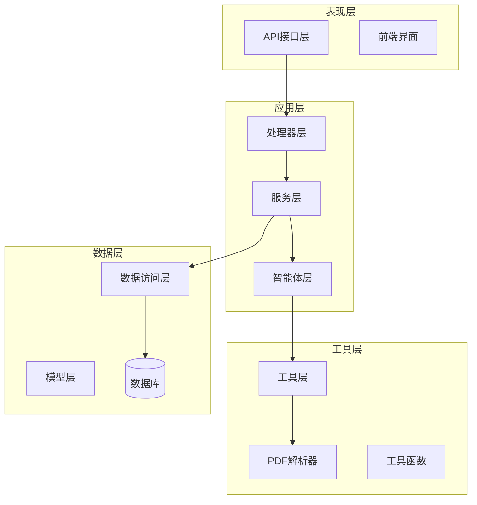
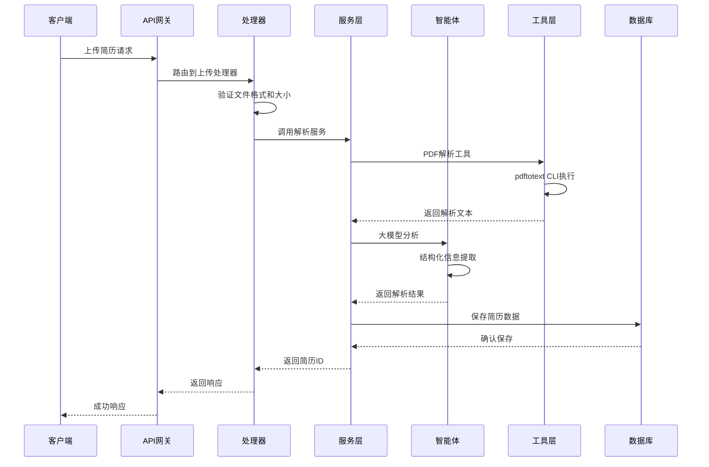
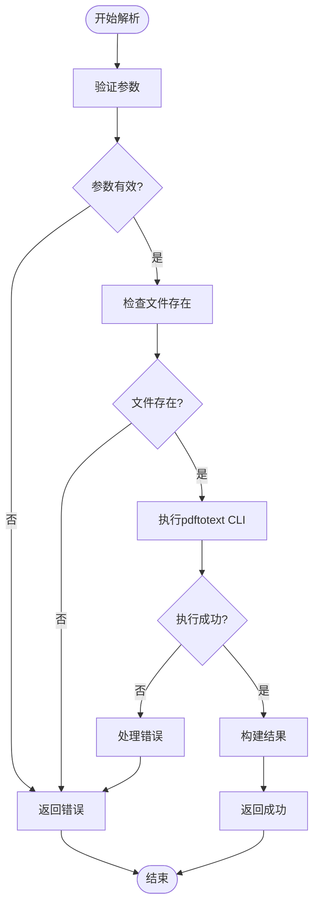
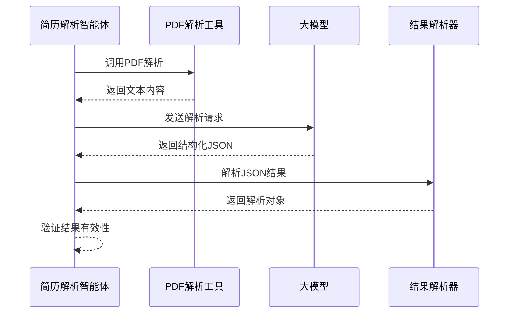
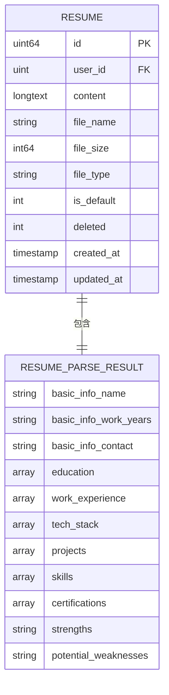
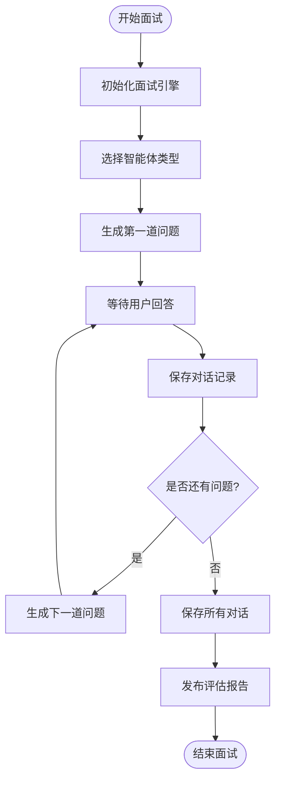
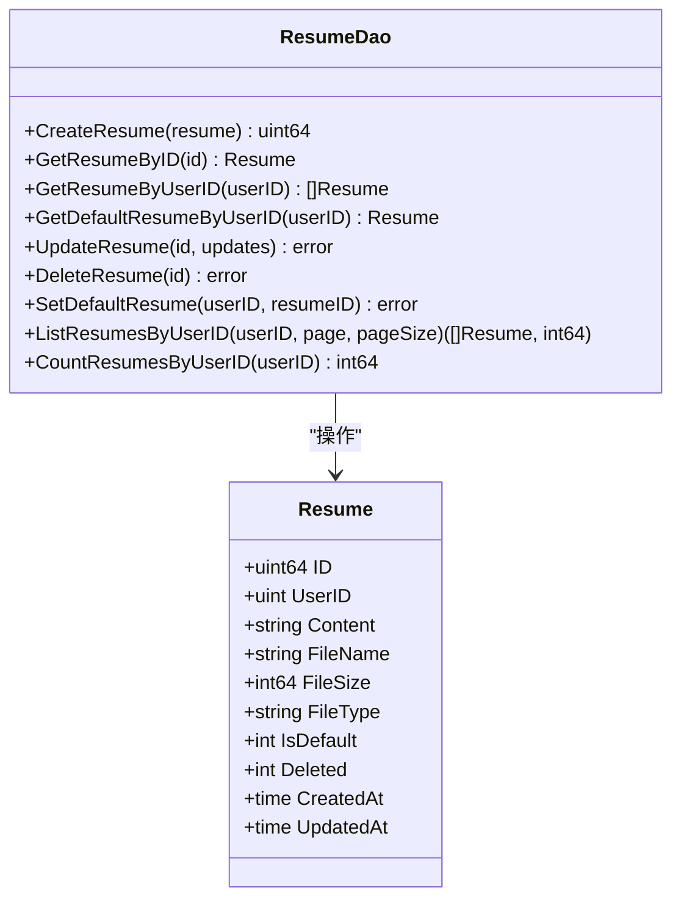
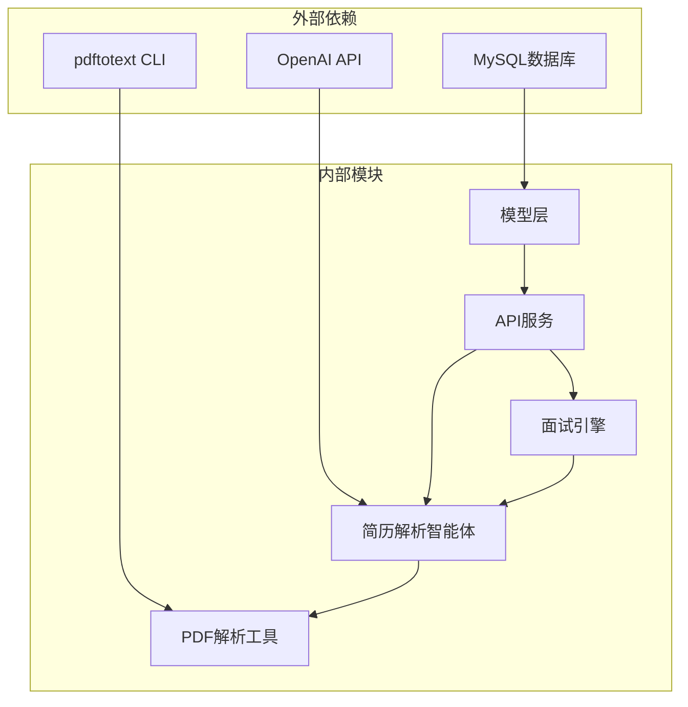
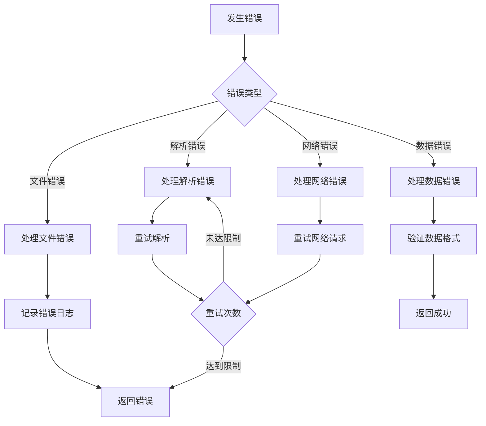

# 简历分析智能体

<cite>
**本文档引用的文件**
- [pdfParserTool.go](file://backend/chatApp/tool/pdfParserTool.go)
- [resume.go](file://backend/chatApp/agent/resume/resume.go)
- [resume_service.go](file://backend/chatApp/agent/service/resume_service.go)
- [resume.go](file://backend/internal/model/resume.go)
- [interviews_service.go](file://backend/api/handler/interview/interviews_service.go)
- [engine.go](file://backend/api/handler/interview/mianshi/engine.go)
- [json_utils.go](file://backend/chatApp/agent/service/json_utils.go)
- [get_resume_info_tool.go](file://backend/chatApp/tool/get_resume_info_tool.go)
- [school_comprehensive_agent.go](file://backend/chatApp/agent/interview/comprehensive/school_comprehensive_agent.go)
- [go_agent.go](file://backend/chatApp/agent/interview/specialized/go_agent.go)
- [prediction_agent.go](file://backend/chatApp/agent/prediction/prediction_agent.go)
- [resume_manager_impl.go](file://backend/internal/service/interviews/impl/resume_manager_impl.go)
- [errors.go](file://backend/api/handler/interview/mianshi/errors.go)
- [pdf_test.go](file://backend/chatApp/tool/pdf_test.go)
</cite>

## 目录
1. [简介](#简介)
2. [项目结构](#项目结构)
3. [核心组件](#核心组件)
4. [架构概览](#架构概览)
5. [详细组件分析](#详细组件分析)
6. [依赖关系分析](#依赖关系分析)
7. [性能考虑](#性能考虑)
8. [故障排除指南](#故障排除指南)
9. [结论](#结论)
10. [附录](#附录)

## 简介
本项目是一个基于大模型的简历分析智能体系统，旨在自动化处理PDF简历、提取关键信息并进行智能分析。系统通过PDF解析工具将PDF转换为纯文本，然后利用大模型进行信息抽取和结构化处理，最终形成可用于面试准备的结构化数据。

该系统支持多种面试场景，包括综合面试和专项面试，并提供简历质量评估、投递岗位匹配和面试准备建议等功能。系统采用模块化设计，具有良好的扩展性和维护性。

## 项目结构
项目采用分层架构设计，主要分为以下几个层次：



**图表来源**
- [interviews_service.go](file://backend/api/handler/interview/interviews_service.go#L55-L92)
- [resume_service.go](file://backend/chatApp/agent/service/resume_service.go#L47-L214)
- [resume.go](file://backend/chatApp/agent/resume/resume.go#L14-L108)

**章节来源**
- [interviews_service.go](file://backend/api/handler/interview/interviews_service.go#L1-L391)
- [resume_service.go](file://backend/chatApp/agent/service/resume_service.go#L1-L344)

## 核心组件
系统包含以下核心组件：

### 1. PDF解析工具
负责将PDF文件转换为纯文本格式，支持参数验证和错误处理。

### 2. 简历解析智能体
基于大模型的智能体，专门用于解析简历内容并提取关键信息。

### 3. 结构化数据处理
将解析结果转换为标准化的数据结构，便于后续分析和使用。

### 4. 面试引擎
处理面试流程，包括问题生成、答案收集和评估报告生成。

### 5. 数据持久化
负责简历数据的存储和检索，支持多种查询操作。

**章节来源**
- [pdfParserTool.go](file://backend/chatApp/tool/pdfParserTool.go#L17-L124)
- [resume.go](file://backend/chatApp/agent/resume/resume.go#L14-L108)
- [resume_service.go](file://backend/chatApp/agent/service/resume_service.go#L17-L45)

## 架构概览
系统采用微服务架构，各组件之间通过清晰的接口进行通信：



**图表来源**
- [interviews_service.go](file://backend/api/handler/interview/interviews_service.go#L55-L92)
- [resume_service.go](file://backend/chatApp/agent/service/resume_service.go#L63-L214)
- [pdfParserTool.go](file://backend/chatApp/tool/pdfParserTool.go#L39-L112)

## 详细组件分析

### PDF解析工具组件
PDF解析工具是整个系统的基础组件，负责将PDF文件转换为可处理的文本格式。

#### 核心功能
- **参数验证**：检查文件路径的有效性和可访问性
- **文件检查**：验证PDF文件的存在和完整性
- **文本提取**：使用pdftotext CLI工具进行文本提取
- **错误处理**：提供详细的错误信息和超时处理

#### 数据结构设计
```mermaid
classDiagram
class PDFToTextRequest {
+string FilePath
+bool ToPages
}
class PDFToTextResult {
+bool Success
+string Content
+[]PDFPageText Pages
+int TotalPages
+string ErrorMsg
+map[string]interface{} Meta
}
class PDFPageText {
+int PageNum
+string Content
}
class ConvertPDFToText {
+ConvertPDFToText(ctx, req) PDFToTextResult
+CreatePDFToTextTool() tool.InvokableTool
}
PDFToTextRequest --> PDFToTextResult : "输入"
PDFToTextResult --> PDFPageText : "包含"
ConvertPDFToText --> PDFToTextRequest : "使用"
ConvertPDFToText --> PDFToTextResult : "返回"
```

**图表来源**
- [pdfParserTool.go](file://backend/chatApp/tool/pdfParserTool.go#L17-L37)
- [pdfParserTool.go](file://backend/chatApp/tool/pdfParserTool.go#L39-L124)

#### 处理流程


**图表来源**
- [pdfParserTool.go](file://backend/chatApp/tool/pdfParserTool.go#L40-L112)

**章节来源**
- [pdfParserTool.go](file://backend/chatApp/tool/pdfParserTool.go#L1-L124)
- [pdf_test.go](file://backend/chatApp/tool/pdf_test.go#L1-L116)

### 简历解析智能体组件
简历解析智能体是系统的核心分析组件，专门负责从简历文本中提取关键信息。

#### 智能体配置
- **模型集成**：基于OpenAI聊天模型
- **工具集成**：集成了PDF解析工具
- **指令设计**：专门针对简历分析的详细指令
- **迭代限制**：最大迭代次数控制

#### 解析流程


**图表来源**
- [resume.go](file://backend/chatApp/agent/resume/resume.go#L23-L103)
- [resume_service.go](file://backend/chatApp/agent/service/resume_service.go#L137-L183)

#### 关键信息提取
智能体能够提取以下关键信息：
- **基本信息**：姓名、联系方式、工作年限
- **教育背景**：学校、专业、学位、毕业时间
- **工作经历**：公司、职位、工作时间、职责描述
- **技术栈**：编程语言、框架、工具
- **项目经验**：项目名称、描述、技术栈、个人贡献
- **技能特长**：核心技能、专业能力
- **证书资格**：相关证书和认证

**章节来源**
- [resume.go](file://backend/chatApp/agent/resume/resume.go#L14-L108)
- [resume_service.go](file://backend/chatApp/agent/service/resume_service.go#L17-L45)

### 结构化数据处理组件
负责将解析结果转换为标准化的数据结构，便于数据库存储和后续处理。

#### 数据模型设计


**图表来源**
- [resume.go](file://backend/internal/model/resume.go#L10-L25)
- [resume_service.go](file://backend/chatApp/agent/service/resume_service.go#L17-L45)

#### 数据验证机制
系统实现了多层次的数据验证：
- **空值检查**：确保关键字段不为空
- **格式验证**：验证数据格式的正确性
- **完整性检查**：确保所有必需字段都已填充

**章节来源**
- [resume_service.go](file://backend/chatApp/agent/service/resume_service.go#L216-L299)
- [json_utils.go](file://backend/chatApp/agent/service/json_utils.go#L7-L62)

### 面试引擎组件
面试引擎负责处理完整的面试流程，从问题生成到评估报告。

#### 面试流程控制


**图表来源**
- [engine.go](file://backend/api/handler/interview/mianshi/engine.go#L39-L230)

#### 智能体类型选择
系统支持多种智能体类型：
- **综合面试**：适用于不同类型的候选人
- **专项面试**：针对特定技术领域的深入评估
- **校招面试**：专门针对应届毕业生的评估

**章节来源**
- [engine.go](file://backend/api/handler/interview/mianshi/engine.go#L23-L291)
- [school_comprehensive_agent.go](file://backend/chatApp/agent/interview/comprehensive/school_comprehensive_agent.go#L14-L48)
- [go_agent.go](file://backend/chatApp/agent/interview/specialized/go_agent.go#L14-L48)

### 数据持久化组件
负责简历数据的存储和管理，提供完整的CRUD操作。

#### 数据库操作


**图表来源**
- [resume.go](file://backend/internal/model/resume.go#L10-L170)

**章节来源**
- [resume.go](file://backend/internal/model/resume.go#L1-L170)
- [resume_manager_impl.go](file://backend/internal/service/interviews/impl/resume_manager_impl.go#L81-L262)

## 依赖关系分析
系统采用模块化设计，各组件之间的依赖关系清晰明确：



**图表来源**
- [pdfParserTool.go](file://backend/chatApp/tool/pdfParserTool.go#L3-L15)
- [resume.go](file://backend/chatApp/agent/resume/resume.go#L3-L12)
- [engine.go](file://backend/api/handler/interview/mianshi/engine.go#L2-L15)

### 关键依赖关系
1. **PDF解析依赖**：依赖pdftotext CLI工具进行文本提取
2. **模型依赖**：依赖OpenAI API进行智能分析
3. **数据库依赖**：使用GORM进行数据持久化
4. **工具依赖**：通过Eino框架集成各种工具

**章节来源**
- [pdfParserTool.go](file://backend/chatApp/tool/pdfParserTool.go#L1-L15)
- [resume_service.go](file://backend/chatApp/agent/service/resume_service.go#L3-L15)

## 性能考虑
系统在设计时充分考虑了性能优化：

### 超时控制
- **总超时**：300秒（5分钟）的全局超时控制
- **请求超时**：每次大模型请求90秒的独立超时
- **指数退避**：重试机制采用指数退避策略

### 缓存策略
- **工具缓存**：智能体工具的生命周期管理
- **模型缓存**：OpenAI模型实例的复用
- **结果缓存**：解析结果的短期缓存

### 并发处理
- **异步解析**：支持异步简历解析
- **并发请求**：多个请求的并发处理
- **资源池**：数据库连接池管理

## 故障排除指南
系统提供了完善的错误处理机制：

### 常见错误类型
1. **文件处理错误**：文件不存在、权限不足
2. **解析错误**：PDF格式不支持、解析失败
3. **网络错误**：API调用超时、连接失败
4. **数据错误**：数据格式不正确、验证失败

### 错误处理策略


**图表来源**
- [resume_service.go](file://backend/chatApp/agent/service/resume_service.go#L137-L179)

### 调试工具
- **日志记录**：详细的执行日志和错误日志
- **测试用例**：完整的单元测试覆盖
- **监控指标**：性能指标和错误统计

**章节来源**
- [errors.go](file://backend/api/handler/interview/mianshi/errors.go#L1-L13)
- [pdf_test.go](file://backend/chatApp/tool/pdf_test.go#L1-L116)

## 结论
本简历分析智能体系统通过模块化设计和清晰的架构分离，实现了从PDF解析到智能分析的完整流程。系统具有以下优势：

1. **高可靠性**：完善的错误处理和重试机制
2. **高性能**：合理的超时控制和资源管理
3. **可扩展性**：模块化设计支持功能扩展
4. **易维护性**：清晰的代码结构和文档

系统为面试准备提供了强有力的技术支撑，能够显著提高简历分析的效率和准确性。

## 附录

### API接口说明
系统提供RESTful API接口，支持简历上传、查询和管理功能。

### 配置选项
- **文件大小限制**：10MB
- **文件类型**：仅支持PDF格式
- **超时设置**：300秒全局超时
- **重试机制**：最多3次重试

### 扩展开发指南
1. **新工具开发**：遵循工具接口规范
2. **智能体扩展**：基于现有智能体框架
3. **数据模型扩展**：遵循GORM模型规范
4. **API接口扩展**：遵循RESTful设计原则