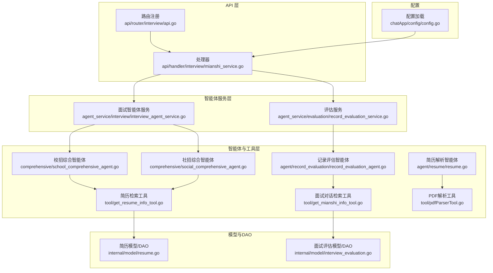
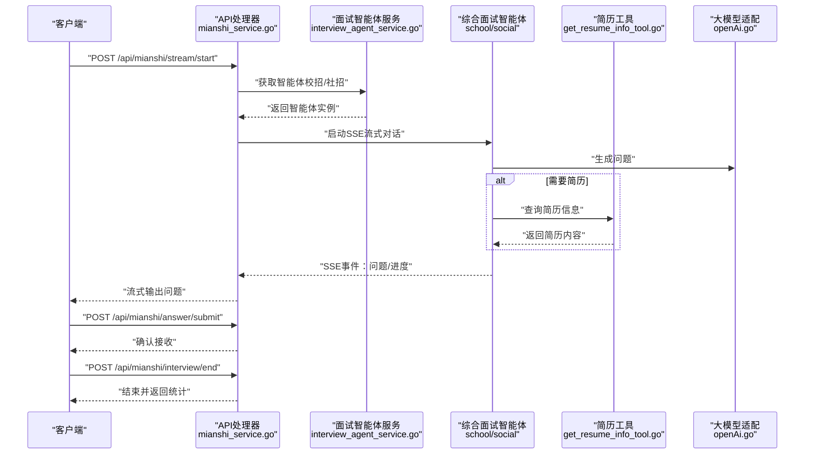
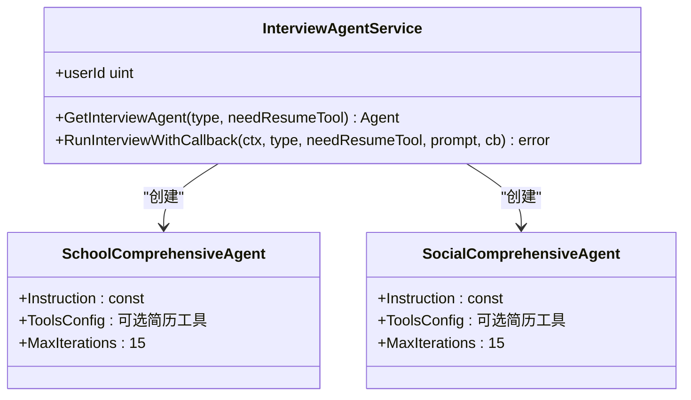
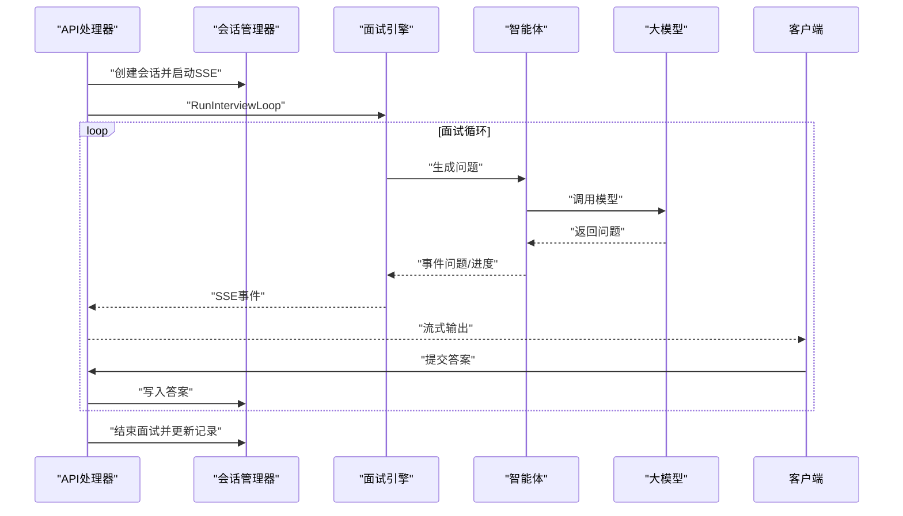
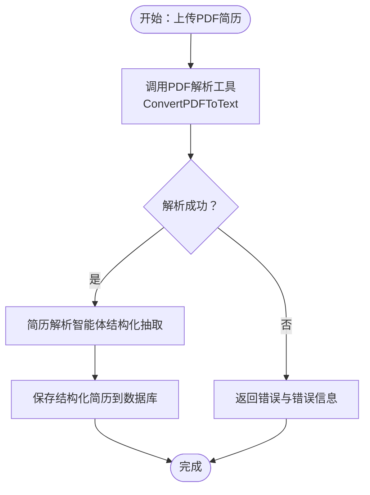
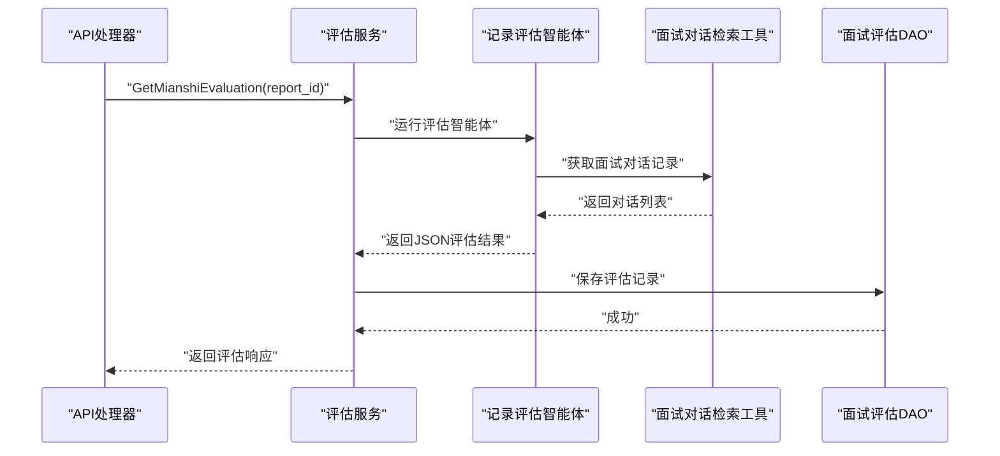
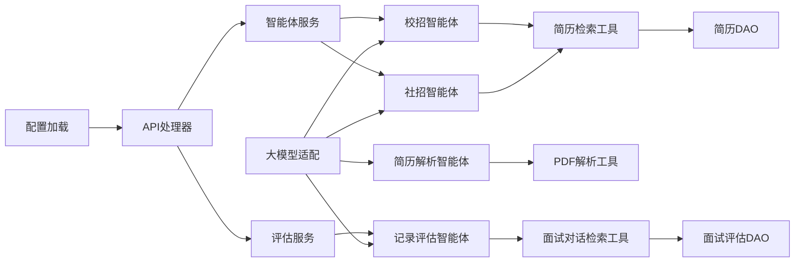

# 综合面试智能体

<cite>
**本文引用的文件**
- [backend/chatApp/agent/interview/comprehensive/school_comprehensive_agent.go](file://backend/chatApp/agent/interview/comprehensive/school_comprehensive_agent.go)
- [backend/chatApp/agent/interview/comprehensive/social_comprehensive_agent.go](file://backend/chatApp/agent/interview/comprehensive/social_comprehensive_agent.go)
- [backend/chatApp/agent/interview/comprehensive/constants.go](file://backend/chatApp/agent/interview/comprehensive/constants.go)
- [backend/chatApp/agent_service/interview/interview_agent_service.go](file://backend/chatApp/agent_service/interview/interview_agent_service.go)
- [backend/chatApp/chat/openAi.go](file://backend/chatApp/chat/openAi.go)
- [backend/chatApp/agent/resume/resume.go](file://backend/chatApp/agent/resume/resume.go)
- [backend/chatApp/tool/get_resume_info_tool.go](file://backend/chatApp/tool/get_resume_info_tool.go)
- [backend/chatApp/tool/pdfParserTool.go](file://backend/chatApp/tool/pdfParserTool.go)
- [backend/internal/model/resume.go](file://backend/internal/model/resume.go)
- [backend/chatApp/agent/record_evaluation/record_evaluation_agent.go](file://backend/chatApp/agent/record_evaluation/record_evaluation_agent.go)
- [backend/chatApp/agent/record_evaluation/constant.go](file://backend/chatApp/agent/record_evaluation/constant.go)
- [backend/chatApp/agent_service/evaluation/record_evaluation_service.go](file://backend/chatApp/agent_service/evaluation/record_evaluation_service.go)
- [backend/chatApp/tool/get_mianshi_info_tool.go](file://backend/chatApp/tool/get_mianshi_info_tool.go)
- [backend/internal/model/interview_evaluation.go](file://backend/internal/model/interview_evaluation.go)
- [backend/api/handler/interview/mianshi_service.go](file://backend/api/handler/interview/mianshi_service.go)
- [backend/api/router/interview/api.go](file://backend/api/router/interview/api.go)
- [backend/chatApp/config/config.go](file://backend/chatApp/config/config.go)
</cite>

## 目录
1. [简介](#简介)
2. [项目结构](#项目结构)
3. [核心组件](#核心组件)
4. [架构总览](#架构总览)
5. [详细组件分析](#详细组件分析)
6. [依赖关系分析](#依赖关系分析)
7. [性能考量](#性能考量)
8. [故障排查指南](#故障排查指南)
9. [结论](#结论)
10. [附录](#附录)

## 简介
本文件面向“综合面试智能体”的设计与实现，重点对比校招与社招两类综合面试智能体的差异与特点，系统阐述提示词模板设计、对话流程控制与上下文管理机制，简历工具链集成方式、问题生成策略与评估标准，并给出配置参数、行为模式与性能优化建议。同时提供典型使用示例与调试指南，帮助开发者与产品人员快速理解与落地。

## 项目结构
后端采用模块化分层设计：
- chatApp：智能体与工具层，包含综合/专项面试智能体、简历解析智能体、评估智能体以及各类工具（PDF解析、简历检索、面试对话检索等）
- api：Hertz路由与处理器，提供SSE流式面试接口、评估查询接口、简历管理接口等
- internal：内部模型与DAO层，封装数据库操作与业务实体
- chatApp/config：配置加载（如外部搜索配置）

图表来源
- [backend/api/router/interview/api.go](file://backend/api/router/interview/api.go#L17-L103)
- [backend/api/handler/interview/mianshi_service.go](file://backend/api/handler/interview/mianshi_service.go#L25-L117)
- [backend/chatApp/agent_service/interview/interview_agent_service.go](file://backend/chatApp/agent_service/interview/interview_agent_service.go#L42-L73)
- [backend/chatApp/agent/interview/comprehensive/school_comprehensive_agent.go](file://backend/chatApp/agent/interview/comprehensive/school_comprehensive_agent.go#L14-L46)
- [backend/chatApp/agent/interview/comprehensive/social_comprehensive_agent.go](file://backend/chatApp/agent/interview/comprehensive/social_comprehensive_agent.go#L14-L46)
- [backend/chatApp/agent/resume/resume.go](file://backend/chatApp/agent/resume/resume.go#L14-L108)
- [backend/chatApp/agent/record_evaluation/record_evaluation_agent.go](file://backend/chatApp/agent/record_evaluation/record_evaluation_agent.go#L14-L38)
- [backend/chatApp/tool/get_resume_info_tool.go](file://backend/chatApp/tool/get_resume_info_tool.go#L21-L34)
- [backend/chatApp/tool/get_mianshi_info_tool.go](file://backend/chatApp/tool/get_mianshi_info_tool.go#L23-L36)
- [backend/chatApp/tool/pdfParserTool.go](file://backend/chatApp/tool/pdfParserTool.go#L39-L112)
- [backend/internal/model/resume.go](file://backend/internal/model/resume.go#L43-L54)
- [backend/internal/model/interview_evaluation.go](file://backend/internal/model/interview_evaluation.go#L37-L43)
- [backend/chatApp/config/config.go](file://backend/chatApp/config/config.go#L34-L73)

章节来源
- [backend/api/router/interview/api.go](file://backend/api/router/interview/api.go#L17-L103)
- [backend/api/handler/interview/mianshi_service.go](file://backend/api/handler/interview/mianshi_service.go#L25-L117)

## 核心组件
- 校招综合面试智能体：面向应届毕业生，强调基础知识、学习潜力、思维过程与职业素养，问题设计强调递进与开放性，关注成长潜力与学习意愿。
- 社招综合面试智能体：面向有工作经验的候选人，强调实战经验、系统设计能力、技术深度、架构思想与领导力，问题设计更偏向复杂场景与团队影响。
- 简历解析智能体：负责将PDF简历解析为结构化信息，抽取基本信息、教育背景、工作经历、技术栈、项目经验、技能特长、证书资格等，并给出推荐难度与关注方向。
- 记录评估智能体：基于面试对话记录，对每个问题进行维度化评估，输出评分、关键知识点、难度、优势、不足、改进建议、相关知识点总结、思考过程分析与参考答案。
- 工具链：
  - 简历检索工具：按简历ID查询解析后的简历内容
  - 面试对话检索工具：按用户ID与报告ID查询面试对话记录
  - PDF解析工具：将本地PDF文件转换为纯文本（支持按页面或合并输出）
- 评估服务：封装记录评估与答题记录评估的执行流程，统一超时控制、消息收集与结果持久化。

章节来源
- [backend/chatApp/agent/interview/comprehensive/constants.go](file://backend/chatApp/agent/interview/comprehensive/constants.go#L3-L46)
- [backend/chatApp/agent/interview/comprehensive/constants.go](file://backend/chatApp/agent/interview/comprehensive/constants.go#L48-L95)
- [backend/chatApp/agent/resume/resume.go](file://backend/chatApp/agent/resume/resume.go#L14-L108)
- [backend/chatApp/agent/record_evaluation/constant.go](file://backend/chatApp/agent/record_evaluation/constant.go#L3-L71)
- [backend/chatApp/tool/get_resume_info_tool.go](file://backend/chatApp/tool/get_resume_info_tool.go#L21-L34)
- [backend/chatApp/tool/get_mianshi_info_tool.go](file://backend/chatApp/tool/get_mianshi_info_tool.go#L23-L36)
- [backend/chatApp/tool/pdfParserTool.go](file://backend/chatApp/tool/pdfParserTool.go#L39-L112)
- [backend/chatApp/agent_service/evaluation/record_evaluation_service.go](file://backend/chatApp/agent_service/evaluation/record_evaluation_service.go#L17-L108)

## 架构总览
综合面试智能体通过“智能体服务”按类型创建不同角色的智能体；智能体在运行时可选择性启用简历工具，结合大模型生成问题；面试过程通过SSE流式返回，支持提交答案、查询会话、结束面试；面试结束后，评估服务调用记录评估智能体生成评估报告并持久化。

图表来源
- [backend/api/handler/interview/mianshi_service.go](file://backend/api/handler/interview/mianshi_service.go#L25-L117)
- [backend/chatApp/agent_service/interview/interview_agent_service.go](file://backend/chatApp/agent_service/interview/interview_agent_service.go#L42-L73)
- [backend/chatApp/agent/interview/comprehensive/school_comprehensive_agent.go](file://backend/chatApp/agent/interview/comprehensive/school_comprehensive_agent.go#L14-L46)
- [backend/chatApp/agent/interview/comprehensive/social_comprehensive_agent.go](file://backend/chatApp/agent/interview/comprehensive/social_comprehensive_agent.go#L14-L46)
- [backend/chatApp/tool/get_resume_info_tool.go](file://backend/chatApp/tool/get_resume_info_tool.go#L21-L34)
- [backend/chatApp/chat/openAi.go](file://backend/chatApp/chat/openAi.go#L19-L109)

## 详细组件分析

### 校招 vs 社招综合面试智能体
- 设计差异
  - 校招智能体侧重“学习潜力、思维过程、基础知识与职业素养”，问题设计强调递进与开放性，关注成长空间与学习意愿
  - 社招智能体侧重“实战经验、系统设计、技术深度与领导力”，问题设计更贴近复杂场景与团队影响
- 实现特点
  - 两者均通过统一的智能体服务创建，支持按需启用简历工具
  - 均使用相同的对话运行器与迭代器，保证一致的对话控制与上下文管理
  - 均限制最大迭代次数，避免无限循环

图表来源
- [backend/chatApp/agent_service/interview/interview_agent_service.go](file://backend/chatApp/agent_service/interview/interview_agent_service.go#L30-L73)
- [backend/chatApp/agent/interview/comprehensive/school_comprehensive_agent.go](file://backend/chatApp/agent/interview/comprehensive/school_comprehensive_agent.go#L14-L46)
- [backend/chatApp/agent/interview/comprehensive/social_comprehensive_agent.go](file://backend/chatApp/agent/interview/comprehensive/social_comprehensive_agent.go#L14-L46)

章节来源
- [backend/chatApp/agent/interview/comprehensive/constants.go](file://backend/chatApp/agent/interview/comprehensive/constants.go#L3-L46)
- [backend/chatApp/agent/interview/comprehensive/constants.go](file://backend/chatApp/agent/interview/comprehensive/constants.go#L48-L95)
- [backend/chatApp/agent_service/interview/interview_agent_service.go](file://backend/chatApp/agent_service/interview/interview_agent_service.go#L42-L73)

### 提示词模板设计与问题生成策略
- 提示词模板
  - 校招与社招分别定义了职责边界、面试策略、提问建议与返回格式约束，确保输出为结构化JSON
  - 两者均强调“每次只生成一道问题”“递进式提问”“开放式问题”“根据回答灵活调整难度与方向”
- 问题生成策略
  - 基于简历工具（可选）与大模型能力，结合候选人的背景与回答动态生成问题
  - 通过限制最大迭代次数与SSE流式输出，控制交互节奏与资源消耗

章节来源
- [backend/chatApp/agent/interview/comprehensive/constants.go](file://backend/chatApp/agent/interview/comprehensive/constants.go#L3-L46)
- [backend/chatApp/agent/interview/comprehensive/constants.go](file://backend/chatApp/agent/interview/comprehensive/constants.go#L48-L95)
- [backend/chatApp/agent/interview/comprehensive/school_comprehensive_agent.go](file://backend/chatApp/agent/interview/comprehensive/school_comprehensive_agent.go#L19-L28)
- [backend/chatApp/agent/interview/comprehensive/social_comprehensive_agent.go](file://backend/chatApp/agent/interview/comprehensive/social_comprehensive_agent.go#L19-L28)

### 对话流程控制与上下文管理
- 流程控制
  - API层通过SSE建立长连接，处理器在会话管理器中维护会话状态，异步驱动面试循环
  - 提交答案后即时确认，结束面试时更新记录状态并清理会话
- 上下文管理
  - 智能体运行器负责迭代事件流，收集消息事件并回调给前端
  - 会话管理器记录问题索引、活动时间、状态等，保证流程可控

图表来源
- [backend/api/handler/interview/mianshi_service.go](file://backend/api/handler/interview/mianshi_service.go#L25-L117)
- [backend/api/handler/interview/mianshi_service.go](file://backend/api/handler/interview/mianshi_service.go#L119-L168)
- [backend/api/handler/interview/mianshi_service.go](file://backend/api/handler/interview/mianshi_service.go#L232-L300)

章节来源
- [backend/api/handler/interview/mianshi_service.go](file://backend/api/handler/interview/mianshi_service.go#L25-L117)
- [backend/api/handler/interview/mianshi_service.go](file://backend/api/handler/interview/mianshi_service.go#L119-L168)
- [backend/api/handler/interview/mianshi_service.go](file://backend/api/handler/interview/mianshi_service.go#L232-L300)

### 简历工具集成方式
- 简历解析
  - 简历解析智能体使用PDF解析工具提取文本，再结构化抽取关键信息，输出标准化JSON
  - PDF解析工具支持参数校验、文件存在性检查、CLI调用与超时处理
- 简历检索
  - 综合面试智能体可选启用简历检索工具，按简历ID查询解析后的简历内容，用于定制化提问
- 数据模型
  - 简历模型包含基础信息、教育背景、工作经历、技术栈、项目经验、技能特长、证书资格等字段

图表来源
- [backend/chatApp/tool/pdfParserTool.go](file://backend/chatApp/tool/pdfParserTool.go#L39-L112)
- [backend/chatApp/agent/resume/resume.go](file://backend/chatApp/agent/resume/resume.go#L14-L108)
- [backend/chatApp/tool/get_resume_info_tool.go](file://backend/chatApp/tool/get_resume_info_tool.go#L21-L34)
- [backend/internal/model/resume.go](file://backend/internal/model/resume.go#L43-L54)

章节来源
- [backend/chatApp/tool/pdfParserTool.go](file://backend/chatApp/tool/pdfParserTool.go#L39-L112)
- [backend/chatApp/agent/resume/resume.go](file://backend/chatApp/agent/resume/resume.go#L14-L108)
- [backend/chatApp/tool/get_resume_info_tool.go](file://backend/chatApp/tool/get_resume_info_tool.go#L21-L34)
- [backend/internal/model/resume.go](file://backend/internal/model/resume.go#L43-L54)

### 评估标准与评估智能体
- 评估维度
  - 记录评估智能体输出总体评价与若干维度（6个维度，中文名称6-10字，顺序与面试数据一致）
  - 答题记录评估智能体输出每个问题的评估，包含评分、关键知识点、难度、优势、不足、改进建议、相关知识点总结、思考过程分析与参考答案
- 评估流程
  - 评估服务统一超时控制（120秒），运行评估智能体，收集最终消息并解析为结构化响应
  - 将评估结果持久化至面试评估表，计算总体评分（各维度平均）

图表来源
- [backend/chatApp/agent_service/evaluation/record_evaluation_service.go](file://backend/chatApp/agent_service/evaluation/record_evaluation_service.go#L17-L108)
- [backend/chatApp/agent/record_evaluation/record_evaluation_agent.go](file://backend/chatApp/agent/record_evaluation/record_evaluation_agent.go#L14-L38)
- [backend/chatApp/tool/get_mianshi_info_tool.go](file://backend/chatApp/tool/get_mianshi_info_tool.go#L23-L36)
- [backend/internal/model/interview_evaluation.go](file://backend/internal/model/interview_evaluation.go#L37-L43)

章节来源
- [backend/chatApp/agent/record_evaluation/constant.go](file://backend/chatApp/agent/record_evaluation/constant.go#L3-L71)
- [backend/chatApp/agent/record_evaluation/constant.go](file://backend/chatApp/agent/record_evaluation/constant.go#L73-L169)
- [backend/chatApp/agent_service/evaluation/record_evaluation_service.go](file://backend/chatApp/agent_service/evaluation/record_evaluation_service.go#L17-L108)
- [backend/internal/model/interview_evaluation.go](file://backend/internal/model/interview_evaluation.go#L37-L43)

## 依赖关系分析
- 模块耦合
  - API层依赖智能体服务与评估服务；智能体服务依赖具体智能体实现；智能体依赖工具与大模型适配
  - 工具层通过DAO访问数据库，评估服务依赖DAO持久化评估结果
- 外部依赖
  - 大模型适配层负责API Key校验、URL清洗、HTTP客户端配置与错误分类
  - 配置层负责读取外部配置（如搜索引擎），为工具链提供参数

图表来源
- [backend/api/handler/interview/mianshi_service.go](file://backend/api/handler/interview/mianshi_service.go#L25-L117)
- [backend/chatApp/agent_service/interview/interview_agent_service.go](file://backend/chatApp/agent_service/interview/interview_agent_service.go#L42-L73)
- [backend/chatApp/agent/resume/resume.go](file://backend/chatApp/agent/resume/resume.go#L14-L108)
- [backend/chatApp/agent/record_evaluation/record_evaluation_agent.go](file://backend/chatApp/agent/record_evaluation/record_evaluation_agent.go#L14-L38)
- [backend/chatApp/tool/get_resume_info_tool.go](file://backend/chatApp/tool/get_resume_info_tool.go#L21-L34)
- [backend/chatApp/tool/get_mianshi_info_tool.go](file://backend/chatApp/tool/get_mianshi_info_tool.go#L23-L36)
- [backend/chatApp/tool/pdfParserTool.go](file://backend/chatApp/tool/pdfParserTool.go#L39-L112)
- [backend/chatApp/chat/openAi.go](file://backend/chatApp/chat/openAi.go#L19-L109)
- [backend/chatApp/config/config.go](file://backend/chatApp/config/config.go#L34-L73)

章节来源
- [backend/chatApp/chat/openAi.go](file://backend/chatApp/chat/openAi.go#L19-L109)
- [backend/chatApp/config/config.go](file://backend/chatApp/config/config.go#L34-L73)

## 性能考量
- 大模型调用
  - 通过自定义HTTP客户端禁用KeepAlive、设置响应头超时与TLS握手超时，减少连接异常导致的阻塞
  - 对BaseURL进行清洗与去重处理，避免重复路径导致的SDK层二次拼接
- 超时与迭代限制
  - 评估服务设置120秒超时，综合智能体设置最大迭代次数，防止长时间占用资源
- 工具调用
  - PDF解析工具对CLI执行设置超时与错误日志，避免阻塞主线程
- SSE流式
  - 使用管道与异步协程处理SSE事件，降低前端等待延迟

章节来源
- [backend/chatApp/chat/openAi.go](file://backend/chatApp/chat/openAi.go#L64-L75)
- [backend/chatApp/chat/openAi.go](file://backend/chatApp/chat/openAi.go#L56-L62)
- [backend/chatApp/agent_service/evaluation/record_evaluation_service.go](file://backend/chatApp/agent_service/evaluation/record_evaluation_service.go#L20-L22)
- [backend/chatApp/agent/interview/comprehensive/school_comprehensive_agent.go](file://backend/chatApp/agent/interview/comprehensive/school_comprehensive_agent.go#L41-L41)
- [backend/chatApp/agent/interview/comprehensive/social_comprehensive_agent.go](file://backend/chatApp/agent/interview/comprehensive/social_comprehensive_agent.go#L41-L41)
- [backend/chatApp/tool/pdfParserTool.go](file://backend/chatApp/tool/pdfParserTool.go#L77-L93)

## 故障排查指南
- API Key与模型配置
  - 若出现令牌不足、速率限制或上下文长度超限等错误，系统会进行分类并返回相应错误类型
  - 建议检查配置项与密钥有效性，确保BaseURL与模型名称正确
- SSE连接与会话
  - 若SSE无响应，检查会话创建与事件发送逻辑，确认会话状态与取消函数设置
- 评估服务
  - 若评估超时或返回nil，检查智能体输出是否符合JSON格式要求，必要时启用日志定位
- 工具调用
  - PDF解析失败时查看CLI执行日志与错误信息，确认文件路径与权限

章节来源
- [backend/chatApp/chat/openAi.go](file://backend/chatApp/chat/openAi.go#L84-L106)
- [backend/api/handler/interview/mianshi_service.go](file://backend/api/handler/interview/mianshi_service.go#L84-L116)
- [backend/chatApp/agent_service/evaluation/record_evaluation_service.go](file://backend/chatApp/agent_service/evaluation/record_evaluation_service.go#L72-L75)
- [backend/chatApp/tool/pdfParserTool.go](file://backend/chatApp/tool/pdfParserTool.go#L82-L93)

## 结论
本系统通过模块化的智能体与工具链，实现了校招与社招两类综合面试的差异化设计与统一运行框架。提示词模板明确了评估重点，SSE流式对话提升了交互体验，评估服务保障了结果的结构化与持久化。通过合理的超时与迭代限制、健壮的错误分类与日志记录，系统具备良好的稳定性与可维护性。

## 附录

### 使用示例（综合面试场景）
- 启动面试（SSE）
  - 请求：POST /api/mianshi/stream/start
  - 参数：类型（校招/社招）、难度、领域、岗位名称、公司名称、简历ID（可选）
  - 返回：SSE事件流，包含会话ID、开始事件与问题事件
- 提交答案
  - 请求：POST /api/mianshi/answer/submit
  - 参数：会话ID、答案内容或动作（quit/continue）
  - 返回：接收确认与当前问题索引
- 结束面试
  - 请求：POST /api/mianshi/interview/end
  - 参数：会话ID
  - 返回：面试时长、结束时间、问题总数与已回答数
- 查询评估
  - 请求：GET /api/mianshi/evaluation?report_id=...
  - 返回：总体评价与维度评分

章节来源
- [backend/api/router/interview/api.go](file://backend/api/router/interview/api.go#L44-L46)
- [backend/api/router/interview/api.go](file://backend/api/router/interview/api.go#L32-L34)
- [backend/api/router/interview/api.go](file://backend/api/router/interview/api.go#L37-L39)
- [backend/api/router/interview/api.go](file://backend/api/router/interview/api.go#L29-L31)
- [backend/api/handler/interview/mianshi_service.go](file://backend/api/handler/interview/mianshi_service.go#L25-L117)
- [backend/api/handler/interview/mianshi_service.go](file://backend/api/handler/interview/mianshi_service.go#L119-L168)
- [backend/api/handler/interview/mianshi_service.go](file://backend/api/handler/interview/mianshi_service.go#L232-L300)
- [backend/api/handler/interview/mianshi_service.go](file://backend/api/handler/interview/mianshi_service.go#L302-L340)