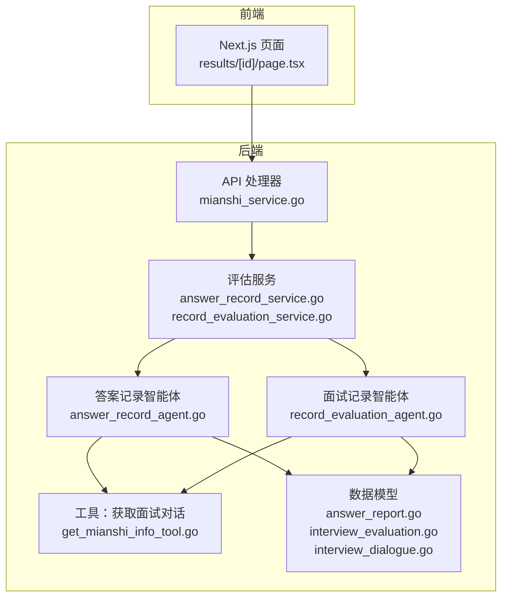
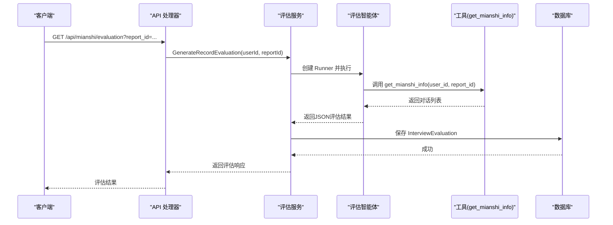
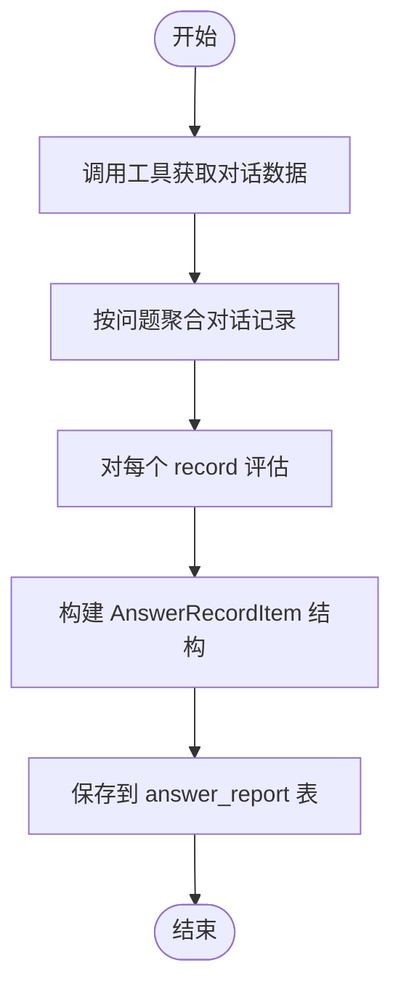
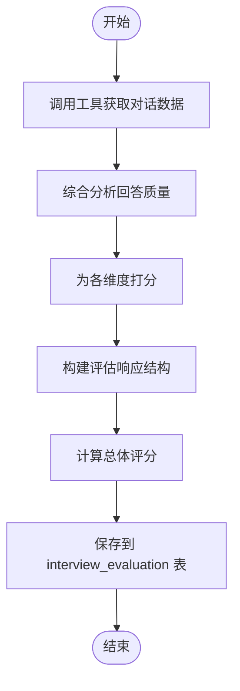
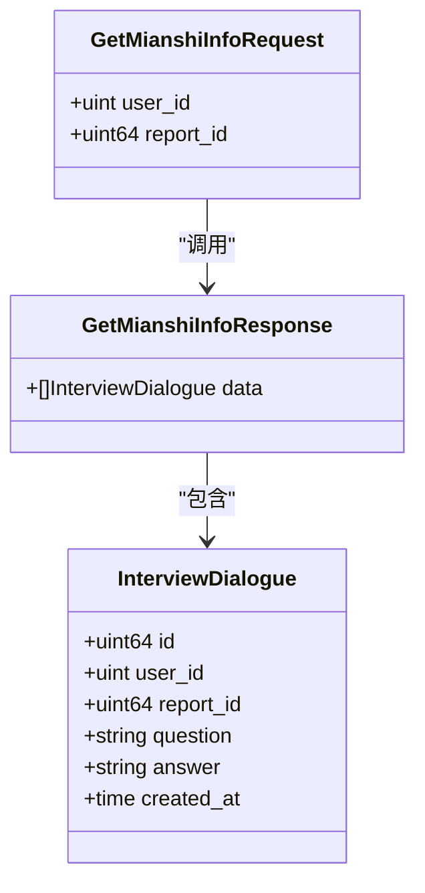
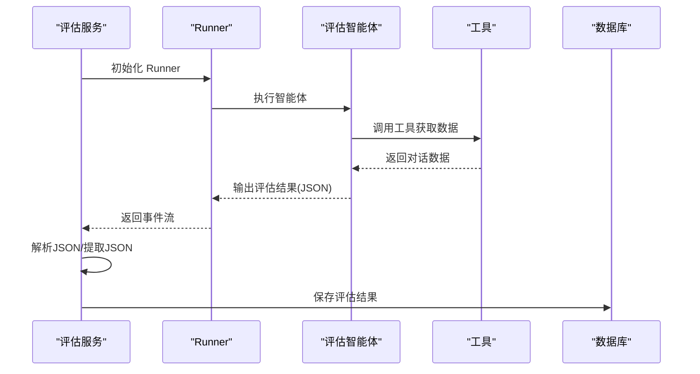
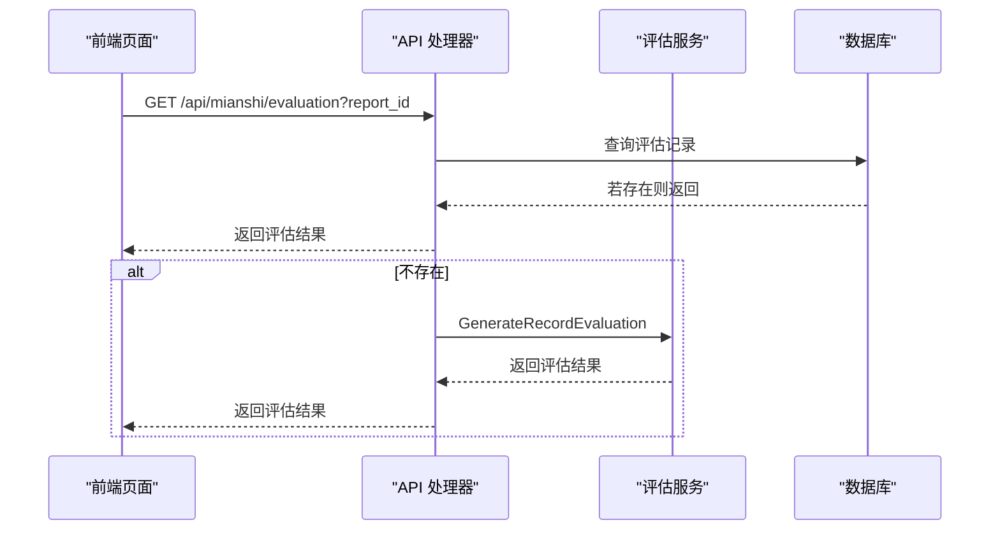
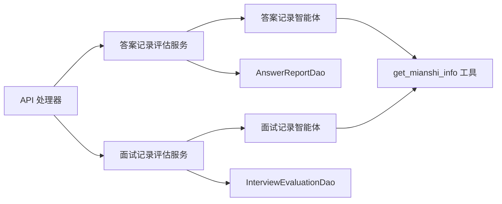

# 记录评估智能体

<cite>
**本文档引用的文件**
- [answer_record_agent.go](file://backend/chatApp/agent/record_evaluation/answer_record_agent.go)
- [record_evaluation_agent.go](file://backend/chatApp/agent/record_evaluation/record_evaluation_agent.go)
- [constant.go](file://backend/chatApp/agent/record_evaluation/constant.go)
- [answer_record_service.go](file://backend/chatApp/agent_service/evaluation/answer_record_service.go)
- [record_evaluation_service.go](file://backend/chatApp/agent_service/evaluation/record_evaluation_service.go)
- [json_utils.go](file://backend/chatApp/agent_service/evaluation/json_utils.go)
- [answer_report.go](file://backend/internal/model/answer_report.go)
- [interview_evaluation.go](file://backend/internal/model/interview_evaluation.go)
- [interview_dialogue.go](file://backend/internal/model/interview_dialogue.go)
- [get_mianshi_info_tool.go](file://backend/chatApp/tool/get_mianshi_info_tool.go)
- [mianshi_service.go](file://backend/api/handler/interview/mianshi_service.go)
- [mianshi.go](file://backend/api/model/mianshi/mianshi.go)
- [page.tsx](file://frontend/src/app/user/interviews/results/[id]/page.tsx)
</cite>

## 目录
1. [简介](#简介)
2. [项目结构](#项目结构)
3. [核心组件](#核心组件)
4. [架构概览](#架构概览)
5. [详细组件分析](#详细组件分析)
6. [依赖关系分析](#依赖关系分析)
7. [性能考量](#性能考量)
8. [故障排除指南](#故障排除指南)
9. [结论](#结论)
10. [附录](#附录)

## 简介
本文件面向记录评估智能体的技术文档，重点介绍两类评估智能体：答案记录智能体与面试记录评估智能体。文档涵盖以下内容：
- 功能职责与实现机制：两类智能体如何接收面试对话数据，执行评估与反馈生成。
- 答案质量评估算法与面试表现分析：评分标准、维度划分、反馈生成策略。
- 评估指标体系、评分标准与反馈机制：维度权重、评分区间、反馈模板。
- 记录数据的结构化处理：对话数据到评估报告的映射与持久化。
- 历史数据分析与趋势预测：基于历史评估记录的统计分析与趋势洞察。
- 可视化展示与导出：前端可视化组件与导出使用指南。

## 项目结构
记录评估智能体位于后端 chatApp 的 agent 与 agent_service 层，配合内部模型层与工具层，形成“智能体 -> 服务层 -> 数据模型 -> API 层”的完整链路。

图表来源
- [mianshi_service.go](file://backend/api/handler/interview/mianshi_service.go#L302-L340)
- [answer_record_service.go](file://backend/chatApp/agent_service/evaluation/answer_record_service.go#L16-L100)
- [record_evaluation_service.go](file://backend/chatApp/agent_service/evaluation/record_evaluation_service.go#L17-L108)
- [answer_record_agent.go](file://backend/chatApp/agent/record_evaluation/answer_record_agent.go#L14-L40)
- [record_evaluation_agent.go](file://backend/chatApp/agent/record_evaluation/record_evaluation_agent.go#L14-L38)
- [get_mianshi_info_tool.go](file://backend/chatApp/tool/get_mianshi_info_tool.go#L23-L36)
- [answer_report.go](file://backend/internal/model/answer_report.go#L9-L49)
- [interview_evaluation.go](file://backend/internal/model/interview_evaluation.go#L9-L30)
- [interview_dialogue.go](file://backend/internal/model/interview_dialogue.go#L9-L27)

章节来源
- [mianshi_service.go](file://backend/api/handler/interview/mianshi_service.go#L302-L340)
- [answer_record_service.go](file://backend/chatApp/agent_service/evaluation/answer_record_service.go#L16-L100)
- [record_evaluation_service.go](file://backend/chatApp/agent_service/evaluation/record_evaluation_service.go#L17-L108)

## 核心组件
- 答案记录智能体：针对每个问题-回答对进行细粒度评估，输出维度评分、关键知识点、优缺点、建议与参考答案等。
- 面试记录智能体：对整场面试的综合表现进行评估，输出总体评价与多维度评分。
- 工具层：get_mianshi_info 工具负责拉取面试对话数据（问题、回答、时间戳等）。
- 服务层：封装智能体调用、Runner 执行、事件流收集、JSON 解析与落库。
- 数据模型层：AnswerReport（单表存储答题记录）、InterviewEvaluation（面试评估记录）与 InterviewDialogue（对话明细）。

章节来源
- [answer_record_agent.go](file://backend/chatApp/agent/record_evaluation/answer_record_agent.go#L14-L40)
- [record_evaluation_agent.go](file://backend/chatApp/agent/record_evaluation/record_evaluation_agent.go#L14-L38)
- [get_mianshi_info_tool.go](file://backend/chatApp/tool/get_mianshi_info_tool.go#L23-L36)
- [answer_report.go](file://backend/internal/model/answer_report.go#L9-L49)
- [interview_evaluation.go](file://backend/internal/model/interview_evaluation.go#L9-L30)
- [interview_dialogue.go](file://backend/internal/model/interview_dialogue.go#L9-L27)

## 架构概览
记录评估智能体采用“智能体 + 工具 + 服务 + 模型 + API”的分层架构，通过 Runner 驱动智能体执行，工具提供外部数据源，服务层负责流程编排与异常处理，模型层负责数据持久化，API 层对外暴露查询接口。

图表来源
- [mianshi_service.go](file://backend/api/handler/interview/mianshi_service.go#L302-L340)
- [record_evaluation_service.go](file://backend/chatApp/agent_service/evaluation/record_evaluation_service.go#L17-L108)
- [get_mianshi_info_tool.go](file://backend/chatApp/tool/get_mianshi_info_tool.go#L23-L36)
- [interview_evaluation.go](file://backend/internal/model/interview_evaluation.go#L37-L43)

## 详细组件分析

### 答案记录智能体（逐题评估）
- 角色与职责：对每个问题-回答对进行评估，输出评分、关键知识点、难度、优劣势、建议、知识点总结、思考过程与参考答案。
- 指令与约束：系统指令明确评分标准（90-100 优秀，80-89 良好，70-79 中等，60-69 及格，0-59 不及格），输出格式严格为 JSON，包含 records 数组，每条记录包含 order、content、comment、message。
- 数据处理：将工具返回的对话列表按问题聚合，同一问题的多次追问合并到同一 record 的 message 数组中；comment 包含 score、difficulty、key_points、strengths、weaknesses、suggestion、know_points、thinking、reference 等字段。
- 结果持久化：服务层将解析后的 JSON 转换为 AnswerReport 并保存至 answer_report 表。

图表来源
- [answer_record_agent.go](file://backend/chatApp/agent/record_evaluation/answer_record_agent.go#L14-L40)
- [constant.go](file://backend/chatApp/agent/record_evaluation/constant.go#L73-L168)
- [answer_record_service.go](file://backend/chatApp/agent_service/evaluation/answer_record_service.go#L16-L100)
- [answer_report.go](file://backend/internal/model/answer_report.go#L9-L49)

章节来源
- [answer_record_agent.go](file://backend/chatApp/agent/record_evaluation/answer_record_agent.go#L14-L40)
- [constant.go](file://backend/chatApp/agent/record_evaluation/constant.go#L73-L168)
- [answer_record_service.go](file://backend/chatApp/agent_service/evaluation/answer_record_service.go#L16-L100)
- [answer_report.go](file://backend/internal/model/answer_report.go#L9-L49)

### 面试记录评估智能体（综合评估）
- 角色与职责：对整场面试进行综合评估，输出总体评价与多维度评分，维度数量为 4-7 个，每个维度包含维度名称、评估意见与分数。
- 指令与约束：系统指令规定评分标准与输出格式，要求返回 JSON，包含 comment 与 dimensions 数组，维度顺序与面试数据顺序一致。
- 结果持久化：服务层将解析后的 JSON 转换为 InterviewEvaluation 并保存至 interview_evaluation 表，同时计算总体评分（维度平均分）。

图表来源
- [record_evaluation_agent.go](file://backend/chatApp/agent/record_evaluation/record_evaluation_agent.go#L14-L38)
- [constant.go](file://backend/chatApp/agent/record_evaluation/constant.go#L3-L71)
- [record_evaluation_service.go](file://backend/chatApp/agent_service/evaluation/record_evaluation_service.go#L17-L108)
- [interview_evaluation.go](file://backend/internal/model/interview_evaluation.go#L9-L30)

章节来源
- [record_evaluation_agent.go](file://backend/chatApp/agent/record_evaluation/record_evaluation_agent.go#L14-L38)
- [constant.go](file://backend/chatApp/agent/record_evaluation/constant.go#L3-L71)
- [record_evaluation_service.go](file://backend/chatApp/agent_service/evaluation/record_evaluation_service.go#L17-L108)
- [interview_evaluation.go](file://backend/internal/model/interview_evaluation.go#L9-L30)

### 工具层：获取面试对话数据
- 功能：根据 user_id 与 report_id 查询 InterviewDialogue 列表，供智能体评估使用。
- 接口：GetMianshiInfoRequest/Response，工具函数 GetMianshiInfoTool()。
- 数据模型：InterviewDialogueDao.GetInterviewDialoguesByUserIdAndRecordId。

图表来源
- [get_mianshi_info_tool.go](file://backend/chatApp/tool/get_mianshi_info_tool.go#L12-L36)
- [interview_dialogue.go](file://backend/internal/model/interview_dialogue.go#L9-L27)

章节来源
- [get_mianshi_info_tool.go](file://backend/chatApp/tool/get_mianshi_info_tool.go#L12-L36)
- [interview_dialogue.go](file://backend/internal/model/interview_dialogue.go#L9-L27)

### 服务层：智能体调用与结果处理
- 答案记录评估服务：创建 Runner，注入智能体，执行并收集事件流，解析 JSON，构建 AnswerReport，保存数据库。
- 面试记录评估服务：创建 Runner，注入智能体，执行并收集事件流，解析 JSON，构建评估响应，计算总体评分，保存数据库。
- JSON 解析增强：提供 ExtractJSONFromResponse，从非结构化文本中提取 JSON 片段，提升鲁棒性。

图表来源
- [answer_record_service.go](file://backend/chatApp/agent_service/evaluation/answer_record_service.go#L16-L100)
- [record_evaluation_service.go](file://backend/chatApp/agent_service/evaluation/record_evaluation_service.go#L17-L108)
- [json_utils.go](file://backend/chatApp/agent_service/evaluation/json_utils.go#L7-L33)

章节来源
- [answer_record_service.go](file://backend/chatApp/agent_service/evaluation/answer_record_service.go#L16-L100)
- [record_evaluation_service.go](file://backend/chatApp/agent_service/evaluation/record_evaluation_service.go#L17-L108)
- [json_utils.go](file://backend/chatApp/agent_service/evaluation/json_utils.go#L7-L33)

### API 层：对外接口与前端集成
- 获取面试评估：GetMianshiEvaluation，若数据库已有评估则直接返回，否则触发评估服务生成并保存。
- 获取答题记录评估：GetMianshiAnswerRecord，若数据库已有且 records 非空则直接返回，否则触发答案记录评估服务。
- 前端可视化：results/[id]/page.tsx 展示雷达图、仪表盘与维度详情，支持导出与分享。

图表来源
- [mianshi_service.go](file://backend/api/handler/interview/mianshi_service.go#L302-L340)
- [page.tsx](file://frontend/src/app/user/interviews/results/[id]/page.tsx#L450-L466)

章节来源
- [mianshi_service.go](file://backend/api/handler/interview/mianshi_service.go#L302-L340)
- [page.tsx](file://frontend/src/app/user/interviews/results/[id]/page.tsx#L450-L466)

## 依赖关系分析
- 智能体依赖工具：两个智能体均依赖 get_mianshi_info 工具获取对话数据。
- 服务层依赖智能体：评估服务分别创建并驱动答案记录智能体与面试记录智能体。
- 模型层依赖 DAO：服务层通过 DAO 将评估结果持久化到 answer_report 与 interview_evaluation。
- API 层依赖服务层：API 处理器调用评估服务并返回结果给前端。

图表来源
- [answer_record_agent.go](file://backend/chatApp/agent/record_evaluation/answer_record_agent.go#L14-L40)
- [record_evaluation_agent.go](file://backend/chatApp/agent/record_evaluation/record_evaluation_agent.go#L14-L38)
- [get_mianshi_info_tool.go](file://backend/chatApp/tool/get_mianshi_info_tool.go#L23-L36)
- [answer_record_service.go](file://backend/chatApp/agent_service/evaluation/answer_record_service.go#L262-L273)
- [record_evaluation_service.go](file://backend/chatApp/agent_service/evaluation/record_evaluation_service.go#L137-L182)
- [answer_report.go](file://backend/internal/model/answer_report.go#L56-L62)
- [interview_evaluation.go](file://backend/internal/model/interview_evaluation.go#L37-L43)
- [mianshi_service.go](file://backend/api/handler/interview/mianshi_service.go#L302-L340)

章节来源
- [answer_record_agent.go](file://backend/chatApp/agent/record_evaluation/answer_record_agent.go#L14-L40)
- [record_evaluation_agent.go](file://backend/chatApp/agent/record_evaluation/record_evaluation_agent.go#L14-L38)
- [get_mianshi_info_tool.go](file://backend/chatApp/tool/get_mianshi_info_tool.go#L23-L36)
- [answer_record_service.go](file://backend/chatApp/agent_service/evaluation/answer_record_service.go#L262-L273)
- [record_evaluation_service.go](file://backend/chatApp/agent_service/evaluation/record_evaluation_service.go#L137-L182)
- [answer_report.go](file://backend/internal/model/answer_report.go#L56-L62)
- [interview_evaluation.go](file://backend/internal/model/interview_evaluation.go#L37-L43)
- [mianshi_service.go](file://backend/api/handler/interview/mianshi_service.go#L302-L340)

## 性能考量
- 超时控制：答案记录评估服务设置 300 秒超时，面试记录评估服务设置 120 秒超时，避免长时间阻塞。
- 事件流收集：通过 Runner 的迭代器持续收集事件，遇到超时或错误及时中断并返回错误。
- JSON 解析健壮性：提供 ExtractJSONFromResponse，从非结构化文本中提取 JSON，降低因模型输出格式偏差导致的失败率。
- 数据库写入：评估完成后异步保存，减少接口延迟；DAO 层统一错误处理与日志记录。

章节来源
- [answer_record_service.go](file://backend/chatApp/agent_service/evaluation/answer_record_service.go#L16-L100)
- [record_evaluation_service.go](file://backend/chatApp/agent_service/evaluation/record_evaluation_service.go#L17-L108)
- [json_utils.go](file://backend/chatApp/agent_service/evaluation/json_utils.go#L7-L33)

## 故障排除指南
- 超时错误：若评估耗时过长，检查智能体指令复杂度、工具调用频率与网络延迟；适当调整超时阈值。
- JSON 解析失败：确认智能体输出严格遵循 JSON 格式；启用 ExtractJSONFromResponse 并检查日志。
- 工具调用失败：检查 get_mianshi_info 的输入参数（user_id、report_id）与数据库连接；查看 DAO 层错误日志。
- 数据库保存失败：检查 DAO 层 Create 方法与事务配置；确认字段类型与索引满足约束。

章节来源
- [answer_record_service.go](file://backend/chatApp/agent_service/evaluation/answer_record_service.go#L69-L89)
- [record_evaluation_service.go](file://backend/chatApp/agent_service/evaluation/record_evaluation_service.go#L70-L92)
- [json_utils.go](file://backend/chatApp/agent_service/evaluation/json_utils.go#L7-L33)
- [get_mianshi_info_tool.go](file://backend/chatApp/tool/get_mianshi_info_tool.go#L23-L36)
- [answer_report.go](file://backend/internal/model/answer_report.go#L56-L62)
- [interview_evaluation.go](file://backend/internal/model/interview_evaluation.go#L37-L43)

## 结论
记录评估智能体通过“智能体 + 工具 + 服务 + 模型 + API”的分层设计，实现了对面试对话的细粒度与综合性评估。系统具备严格的评分标准、结构化的输出格式与完善的持久化机制，结合前端可视化组件，为用户提供直观的面试反馈与改进建议。未来可在历史数据分析与趋势预测方面进一步扩展，以支持更深入的人才发展洞察。

## 附录

### 评估指标体系与评分标准
- 答案记录评估：针对每个问题-回答对进行评分（0-100），维度包括准确性、完整性、深度、清晰度、实用性、沟通能力等。
- 面试记录评估：综合维度评分（4-7 个），输出总体评价与各维度详细意见。

章节来源
- [constant.go](file://backend/chatApp/agent/record_evaluation/constant.go#L94-L101)
- [constant.go](file://backend/chatApp/agent/record_evaluation/constant.go#L23-L30)

### 数据模型与字段说明
- AnswerReport：单表存储答题记录，包含 records 数组与关联的用户与报告 ID。
- InterviewEvaluation：单表存储面试评估记录，包含 comment、dimensions 与总体 score。
- InterviewDialogue：存储面试对话明细，包含问题、回答与时间戳。

章节来源
- [answer_report.go](file://backend/internal/model/answer_report.go#L9-L49)
- [interview_evaluation.go](file://backend/internal/model/interview_evaluation.go#L9-L30)
- [interview_dialogue.go](file://backend/internal/model/interview_dialogue.go#L9-L27)

### 历史数据分析与趋势预测
- 历史数据：通过 InterviewEvaluation 与 AnswerReport 的历史记录，统计维度分布、总体评分趋势与知识点掌握情况。
- 趋势预测：基于历史评分与维度表现，识别薄弱环节与改进方向，辅助制定个性化学习计划。

章节来源
- [interview_evaluation.go](file://backend/internal/model/interview_evaluation.go#L9-L30)
- [answer_report.go](file://backend/internal/model/answer_report.go#L9-L49)

### 可视化展示与导出使用指南
- 前端展示：results/[id]/page.tsx 提供雷达图、仪表盘与维度详情卡片，支持导出与分享。
- 导出建议：可扩展导出 PDF/Excel，包含维度评分、总体评价与改进建议，便于归档与汇报。

章节来源
- [page.tsx](file://frontend/src/app/user/interviews/results/[id]/page.tsx#L450-L466)