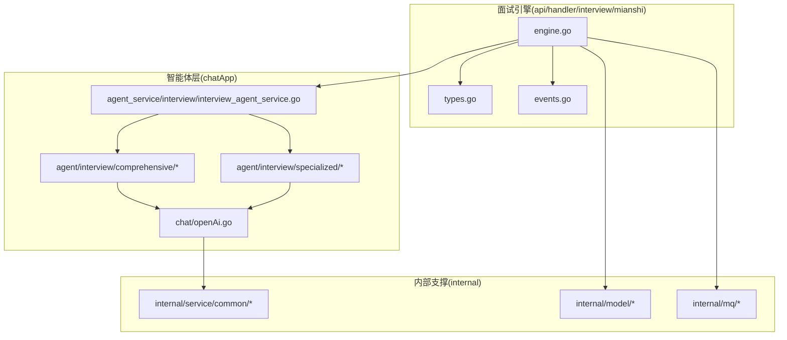
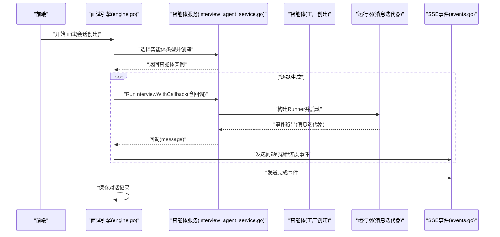
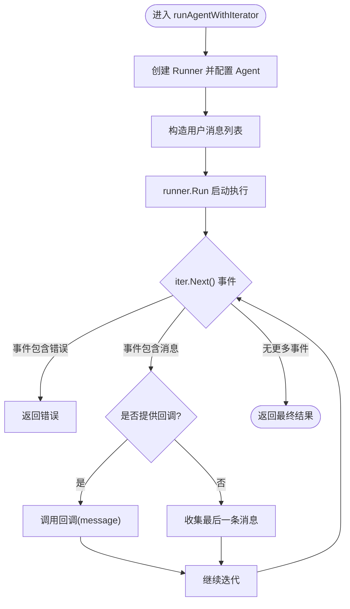
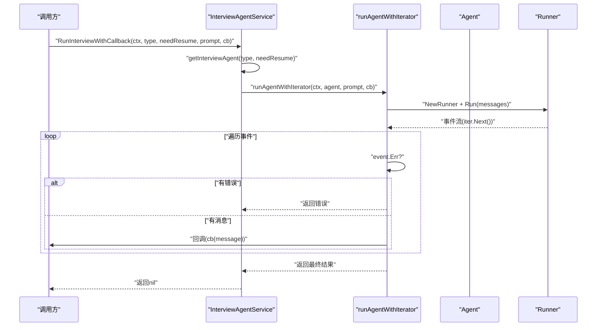
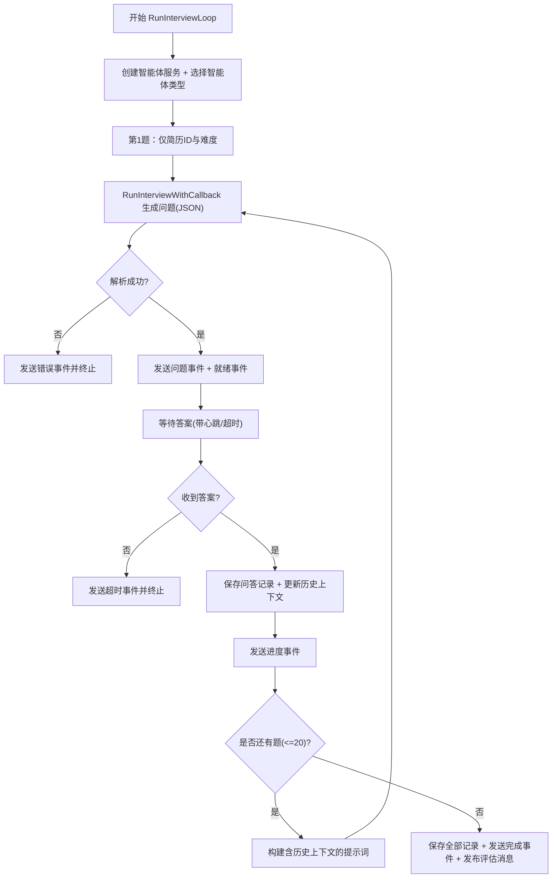
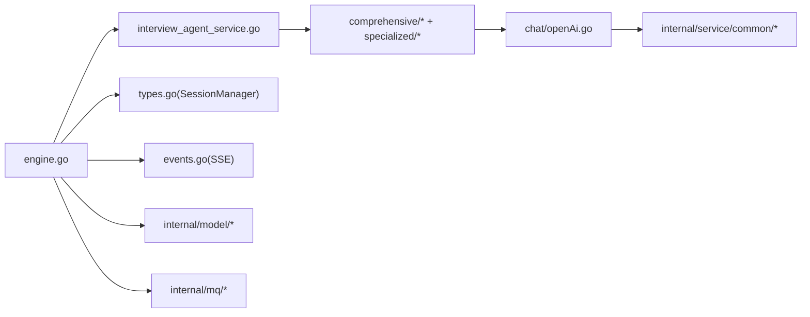

# 面试智能体服务

<cite>
**本文引用的文件**
- [backend/chatApp/agent_service/interview/interview_agent_service.go](file://backend/chatApp/agent_service/interview/interview_agent_service.go)
- [backend/chatApp/agent/interview/comprehensive/constants.go](file://backend/chatApp/agent/interview/comprehensive/constants.go)
- [backend/chatApp/agent/interview/comprehensive/school_comprehensive_agent.go](file://backend/chatApp/agent/interview/comprehensive/school_comprehensive_agent.go)
- [backend/chatApp/agent/interview/comprehensive/social_comprehensive_agent.go](file://backend/chatApp/agent/interview/comprehensive/social_comprehensive_agent.go)
- [backend/chatApp/agent/interview/specialized/constants.go](file://backend/chatApp/agent/interview/specialized/constants.go)
- [backend/chatApp/agent/interview/specialized/go_agent.go](file://backend/chatApp/agent/interview/specialized/go_agent.go)
- [backend/chatApp/chat/openAi.go](file://backend/chatApp/chat/openAi.go)
- [backend/api/handler/interview/mianshi/engine.go](file://backend/api/handler/interview/mianshi/engine.go)
- [backend/api/handler/interview/mianshi/types.go](file://backend/api/handler/interview/mianshi/types.go)
- [backend/api/handler/interview/mianshi/events.go](file://backend/api/handler/interview/mianshi/events.go)
- [backend/chatApp/main.go](file://backend/chatApp/main.go)
</cite>

## 目录
1. [简介](#简介)
2. [项目结构](#项目结构)
3. [核心组件](#核心组件)
4. [架构总览](#架构总览)
5. [详细组件分析](#详细组件分析)
6. [依赖关系分析](#依赖关系分析)
7. [性能考量](#性能考量)
8. [故障排查指南](#故障排查指南)
9. [结论](#结论)
10. [附录](#附录)

## 简介
本文件面向面试智能体服务的技术文档，围绕以下目标展开：整体架构与核心功能、智能体类型枚举与工厂模式、智能体生命周期管理、RunInterviewWithCallback 方法与回调机制、智能体运行器配置与消息迭代器处理、错误处理策略，并提供使用示例与最佳实践。

## 项目结构
面试智能体服务位于后端子模块中，采用“按功能域划分”的组织方式：
- chatApp：智能体与对话相关的核心实现，包含智能体工厂、具体智能体实现、模型封装与工具集成。
- api/handler/interview/mianshi：面试引擎与会话管理，负责面试流程编排、SSE 事件推送、会话状态维护。
- internal：内部服务与模型层，提供用户模型、数据库访问、消息队列发布等支撑能力。



图表来源
- [backend/chatApp/agent_service/interview/interview_agent_service.go](file://backend/chatApp/agent_service/interview/interview_agent_service.go#L1-L155)
- [backend/chatApp/agent/interview/comprehensive/school_comprehensive_agent.go](file://backend/chatApp/agent/interview/comprehensive/school_comprehensive_agent.go#L1-L48)
- [backend/chatApp/agent/interview/specialized/go_agent.go](file://backend/chatApp/agent/interview/specialized/go_agent.go#L1-L48)
- [backend/chatApp/chat/openAi.go](file://backend/chatApp/chat/openAi.go#L1-L142)
- [backend/api/handler/interview/mianshi/engine.go](file://backend/api/handler/interview/mianshi/engine.go#L1-L291)
- [backend/api/handler/interview/mianshi/types.go](file://backend/api/handler/interview/mianshi/types.go#L1-L165)
- [backend/api/handler/interview/mianshi/events.go](file://backend/api/handler/interview/mianshi/events.go#L1-L72)

章节来源
- [backend/chatApp/agent_service/interview/interview_agent_service.go](file://backend/chatApp/agent_service/interview/interview_agent_service.go#L1-L155)
- [backend/api/handler/interview/mianshi/engine.go](file://backend/api/handler/interview/mianshi/engine.go#L1-L291)

## 核心组件
- 智能体类型枚举与工厂
  - 定义了综合面试与专项面试两类共五种智能体类型，通过工厂方法按类型创建对应智能体实例。
- 智能体生命周期
  - 由工厂创建，注入提示词、模型与工具配置，随后在运行器中以消息迭代器驱动执行。
- 运行器与消息迭代器
  - 使用统一 Runner 配置与 Run 方法启动执行；通过迭代器逐条消费事件输出，支持回调与最终结果收集。
- 回调机制
  - RunInterviewWithCallback 接受回调函数，在每次收到消息输出时触发，便于实时推送与流式展示。
- 错误处理
  - 在工厂、模型创建、运行器迭代、SSE 事件发送等环节均进行错误捕获与分类处理，保障流程稳定性。

章节来源
- [backend/chatApp/agent_service/interview/interview_agent_service.go](file://backend/chatApp/agent_service/interview/interview_agent_service.go#L14-L101)
- [backend/chatApp/agent_service/interview/interview_agent_service.go](file://backend/chatApp/agent_service/interview/interview_agent_service.go#L103-L154)

## 架构总览
面试智能体服务采用“引擎-会话-智能体”三层架构：
- 引擎层：负责面试流程编排、问题生成、会话状态管理、SSE 事件推送与结果落库。
- 会话层：维护每个面试会话的状态、超时与心跳、答案通道与上下文历史。
- 智能体层：按类型创建不同角色的智能体，注入提示词、模型与工具，通过运行器与迭代器产生输出。



图表来源
- [backend/api/handler/interview/mianshi/engine.go](file://backend/api/handler/interview/mianshi/engine.go#L39-L230)
- [backend/chatApp/agent_service/interview/interview_agent_service.go](file://backend/chatApp/agent_service/interview/interview_agent_service.go#L75-L154)
- [backend/api/handler/interview/mianshi/events.go](file://backend/api/handler/interview/mianshi/events.go#L11-L71)

## 详细组件分析

### 智能体类型枚举与工厂模式
- 类型定义
  - 综合面试：校招、社招
  - 专项面试：Go、Java、MQ、MySQL、Redis
- 工厂实现
  - 根据类型分支创建对应智能体，注入提示词常量、模型与可选工具配置，统一 MaxIterations 参数。
- 生命周期
  - 创建 -> 注入配置 -> 运行器启动 -> 迭代器消费 -> 回调/收尾

```mermaid
classDiagram
class InterviewAgentService {
+uint userId
+NewInterviewAgentService(userId) InterviewAgentService
+GetInterviewAgent(type, needResumeTool) Agent,error
+RunInterviewWithCallback(ctx,type,needResumeTool,prompt,callback) error
}
class InterviewAgentType {
<<enumeration>>
"comprehensive_school"
"comprehensive_social"
"specialized_go"
"specialized_java"
"specialized_mq"
"specialized_mysql"
"specialized_redis"
}
class SchoolComprehensiveAgent
class SocialComprehensiveAgent
class GoSpecializedAgent
InterviewAgentService --> InterviewAgentType : "使用"
InterviewAgentService --> SchoolComprehensiveAgent : "创建"
InterviewAgentService --> SocialComprehensiveAgent : "创建"
InterviewAgentService --> GoSpecializedAgent : "创建"
```

图表来源
- [backend/chatApp/agent_service/interview/interview_agent_service.go](file://backend/chatApp/agent_service/interview/interview_agent_service.go#L14-L73)
- [backend/chatApp/agent/interview/comprehensive/school_comprehensive_agent.go](file://backend/chatApp/agent/interview/comprehensive/school_comprehensive_agent.go#L14-L47)
- [backend/chatApp/agent/interview/comprehensive/social_comprehensive_agent.go](file://backend/chatApp/agent/interview/comprehensive/social_comprehensive_agent.go#L14-L47)
- [backend/chatApp/agent/interview/specialized/go_agent.go](file://backend/chatApp/agent/interview/specialized/go_agent.go#L14-L47)

章节来源
- [backend/chatApp/agent_service/interview/interview_agent_service.go](file://backend/chatApp/agent_service/interview/interview_agent_service.go#L14-L73)
- [backend/chatApp/agent/interview/comprehensive/constants.go](file://backend/chatApp/agent/interview/comprehensive/constants.go#L1-L95)
- [backend/chatApp/agent/interview/specialized/constants.go](file://backend/chatApp/agent/interview/specialized/constants.go#L1-L247)

### 智能体运行器配置与消息迭代器处理
- 运行器配置
  - 通过 RunnerConfig 注入 Agent，统一 MaxIterations 控制迭代上限。
- 消息迭代器
  - Runner.Run 返回迭代器，逐条消费事件；遇到错误事件立即中断；对消息事件提取内容并触发回调。
- 回调机制
  - RunInterviewWithCallback 将回调传入 runAgentWithIterator，每次输出消息时调用回调，实现流式输出。



图表来源
- [backend/chatApp/agent_service/interview/interview_agent_service.go](file://backend/chatApp/agent_service/interview/interview_agent_service.go#L103-L154)

章节来源
- [backend/chatApp/agent_service/interview/interview_agent_service.go](file://backend/chatApp/agent_service/interview/interview_agent_service.go#L103-L154)

### RunInterviewWithCallback 方法工作原理与回调机制
- 输入参数
  - 上下文、智能体类型、是否需要简历工具、初始提示词、回调函数。
- 执行流程
  - 获取智能体 -> 调用 runAgentWithIterator -> 逐条事件处理 -> 回调输出 -> 成功返回。
- 回调语义
  - 每当收到消息事件且内容非空，即调用回调；若回调返回错误则中断并上报。
- 错误处理
  - 智能体获取失败、运行器执行错误、事件错误均被记录并返回。



图表来源
- [backend/chatApp/agent_service/interview/interview_agent_service.go](file://backend/chatApp/agent_service/interview/interview_agent_service.go#L75-L154)

章节来源
- [backend/chatApp/agent_service/interview/interview_agent_service.go](file://backend/chatApp/agent_service/interview/interview_agent_service.go#L75-L154)

### 面试引擎与会话管理
- 面试引擎
  - 逐题生成问题，最多 20 题；第 1 题仅包含简历与难度，后续题附加最近 5 道题的历史上下文。
  - 通过 RunInterviewWithCallback 获取问题文本，解析 JSON，发送问题事件与就绪事件。
  - 等待用户回答，超时或异常时发送错误事件并终止。
  - 保存全部对话记录至数据库，完成后发送完成事件并发布评估消息。
- 会话管理
  - 提供会话创建、提交答案、阻塞等待答案、清理答案通道、删除会话等操作。
  - 使用带缓冲的通道承载答案，避免丢失；支持心跳与超时控制。



图表来源
- [backend/api/handler/interview/mianshi/engine.go](file://backend/api/handler/interview/mianshi/engine.go#L39-L230)
- [backend/api/handler/interview/mianshi/types.go](file://backend/api/handler/interview/mianshi/types.go#L9-L165)
- [backend/api/handler/interview/mianshi/events.go](file://backend/api/handler/interview/mianshi/events.go#L11-L71)

章节来源
- [backend/api/handler/interview/mianshi/engine.go](file://backend/api/handler/interview/mianshi/engine.go#L39-L291)
- [backend/api/handler/interview/mianshi/types.go](file://backend/api/handler/interview/mianshi/types.go#L15-L165)
- [backend/api/handler/interview/mianshi/events.go](file://backend/api/handler/interview/mianshi/events.go#L11-L71)

### 模型与工具集成
- 模型封装
  - 从用户默认模型获取 API Key 与模型配置，进行解密与清洗，创建 OpenAI 兼容 ChatModel。
  - 针对不同供应商（如火山引擎）进行兼容性处理与错误分类。
- 工具集成
  - 综合类智能体可选加载简历工具，专项类智能体固定加载简历工具，用于增强上下文与个性化。

章节来源
- [backend/chatApp/chat/openAi.go](file://backend/chatApp/chat/openAi.go#L19-L109)
- [backend/chatApp/agent/interview/comprehensive/school_comprehensive_agent.go](file://backend/chatApp/agent/interview/comprehensive/school_comprehensive_agent.go#L16-L47)
- [backend/chatApp/agent/interview/comprehensive/social_comprehensive_agent.go](file://backend/chatApp/agent/interview/comprehensive/social_comprehensive_agent.go#L16-L47)
- [backend/chatApp/agent/interview/specialized/go_agent.go](file://backend/chatApp/agent/interview/specialized/go_agent.go#L16-L47)

## 依赖关系分析
- 组件耦合
  - 面试引擎强依赖智能体服务与会话管理；智能体服务依赖具体智能体工厂与模型封装。
  - SSE 事件与内部服务（数据库、消息队列）在引擎层被调用。
- 外部依赖
  - EINO 运行时与 OpenAI 兼容模型 SDK；HTTP 客户端与日志传输包装器。
- 潜在风险
  - 模型创建失败、SSE 写入失败、会话通道阻塞等需在上层进行降级与重试策略。



图表来源
- [backend/api/handler/interview/mianshi/engine.go](file://backend/api/handler/interview/mianshi/engine.go#L1-L291)
- [backend/chatApp/agent_service/interview/interview_agent_service.go](file://backend/chatApp/agent_service/interview/interview_agent_service.go#L1-L155)
- [backend/chatApp/chat/openAi.go](file://backend/chatApp/chat/openAi.go#L1-L142)
- [backend/api/handler/interview/mianshi/types.go](file://backend/api/handler/interview/mianshi/types.go#L1-L165)
- [backend/api/handler/interview/mianshi/events.go](file://backend/api/handler/interview/mianshi/events.go#L1-L72)

章节来源
- [backend/api/handler/interview/mianshi/engine.go](file://backend/api/handler/interview/mianshi/engine.go#L1-L291)
- [backend/chatApp/agent_service/interview/interview_agent_service.go](file://backend/chatApp/agent_service/interview/interview_agent_service.go#L1-L155)
- [backend/chatApp/chat/openAi.go](file://backend/chatApp/chat/openAi.go#L1-L142)

## 性能考量
- 迭代器与回调
  - 使用事件迭代器逐条输出，避免一次性缓冲大量内容；回调机制支持流式渲染，降低前端等待时间。
- 会话上下文
  - 仅保留最近 5 道题的历史，平衡上下文质量与长度限制。
- 超时与心跳
  - 答案等待设置合理超时与心跳事件，防止连接空闲断开与资源占用。
- 模型与网络
  - 自定义 HTTP 客户端禁用 KeepAlive、设置响应头超时，减少长连接问题；URL 清洗避免无效字符导致请求失败。

## 故障排查指南
- 模型创建失败
  - 检查用户默认模型配置、API Key 解密、BaseURL 清洗与供应商兼容性；关注配额不足、速率限制、上下文过长等错误分类。
- SSE 写入失败
  - 确认 Writer 实现 Flush 接口；检查网络连接与客户端接收能力；记录写入字节数辅助定位。
- 会话通道阻塞
  - 确认通道容量与消费节奏；清理旧答案通道避免积压；监控 LastActivity 判断会话活跃度。
- 面试流程中断
  - 检查智能体获取与运行器执行错误；查看事件错误字段；核对回调返回值与中断条件。

章节来源
- [backend/chatApp/chat/openAi.go](file://backend/chatApp/chat/openAi.go#L64-L109)
- [backend/api/handler/interview/mianshi/events.go](file://backend/api/handler/interview/mianshi/events.go#L21-L33)
- [backend/api/handler/interview/mianshi/types.go](file://backend/api/handler/interview/mianshi/types.go#L109-L142)
- [backend/api/handler/interview/mianshi/engine.go](file://backend/api/handler/interview/mianshi/engine.go#L118-L138)

## 结论
面试智能体服务通过清晰的工厂与类型体系、统一的运行器与迭代器、完善的会话与事件机制，实现了可扩展、可观测、可维护的智能面试流程。建议在生产环境中结合超时与重试、熔断与降级策略，持续优化模型配置与网络参数，以获得更稳定的用户体验。

## 附录

### 使用示例与最佳实践
- 快速开始
  - 使用智能体服务创建指定类型的智能体，传入 RunInterviewWithCallback，实现实时流式输出。
- 最佳实践
  - 明确区分综合与专项面试类型，按需启用简历工具。
  - 控制 MaxIterations 与上下文长度，避免模型上下文溢出。
  - 在回调中进行内容过滤与格式化，确保前端渲染稳定。
  - 对 SSE 写入失败与网络抖动进行重试与降级处理。
  - 记录关键事件与错误日志，便于问题追踪与性能分析。

章节来源
- [backend/chatApp/agent_service/interview/interview_agent_service.go](file://backend/chatApp/agent_service/interview/interview_agent_service.go#L75-L154)
- [backend/chatApp/main.go](file://backend/chatApp/main.go#L25-L123)