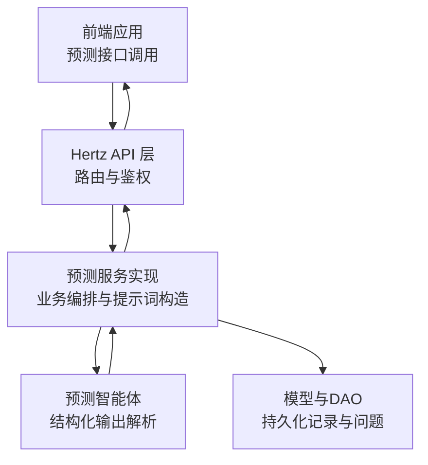
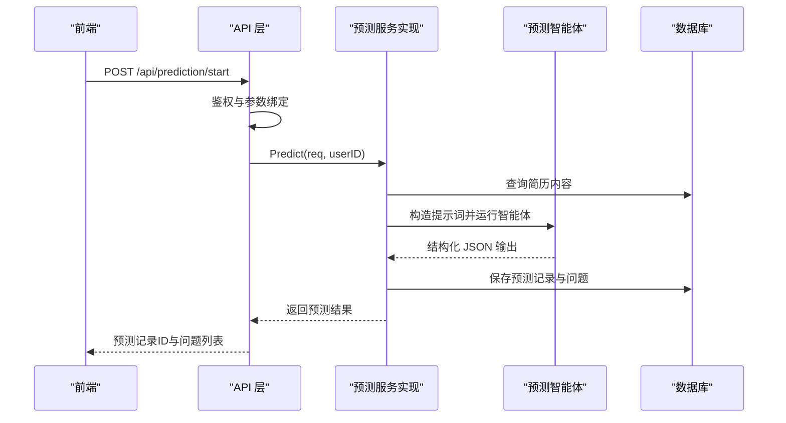
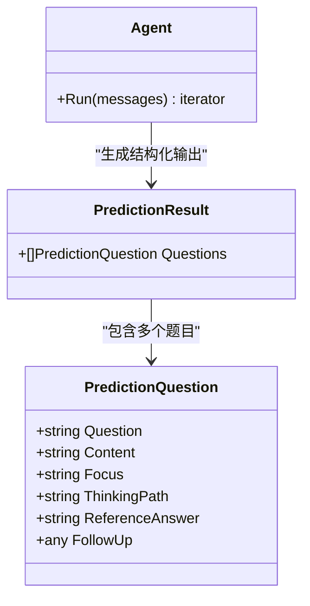
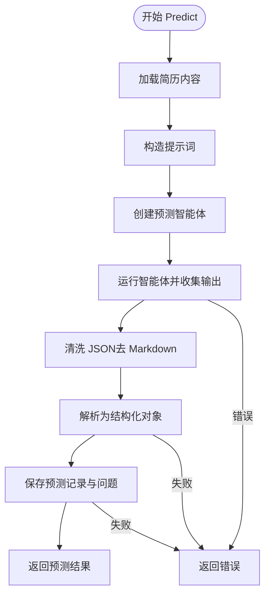
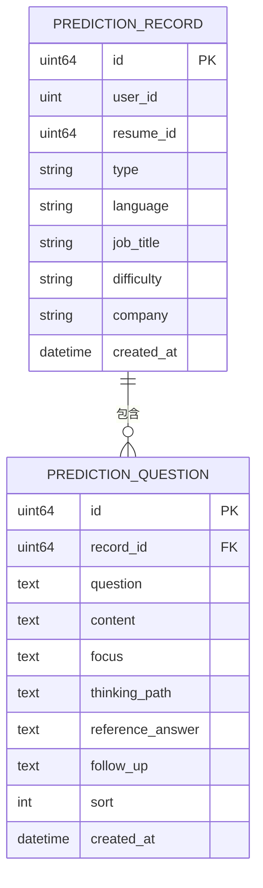
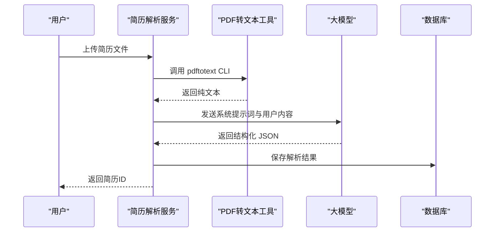
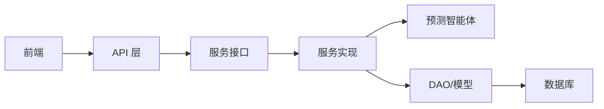

# 预测推荐智能体

<cite>
**本文引用的文件**
- [backend/chatApp/agent/prediction/prediction_agent.go](file://backend/chatApp/agent/prediction/prediction_agent.go)
- [backend/internal/service/prediction/impl/prediction_impl.go](file://backend/internal/service/prediction/impl/prediction_impl.go)
- [backend/internal/service/prediction/interface.go](file://backend/internal/service/prediction/interface.go)
- [backend/api/handler/interview/prediction_service.go](file://backend/api/handler/interview/prediction_service.go)
- [backend/api/model/prediction/prediction.go](file://backend/api/model/prediction/prediction.go)
- [backend/internal/model/prediction.go](file://backend/internal/model/prediction.go)
- [backend/chatApp/agent/service/resume_service.go](file://backend/chatApp/agent/service/resume_service.go)
- [backend/chatApp/tool/pdfParserTool.go](file://backend/chatApp/tool/pdfParserTool.go)
- [backend/chatApp/tool/get_resume_info_tool.go](file://backend/chatApp/tool/get_resume_info_tool.go)
- [backend/internal/model/resume.go](file://backend/internal/model/resume.go)
- [backend/chatApp/config/config.go](file://backend/chatApp/config/config.go)
- [doc/需求文档/简历押题.md](file://doc/需求文档/简历押题.md)
- [frontend/src/services/api/prediction.ts](file://frontend/src/services/api/prediction.ts)
- [frontend/src/app/resume/page.tsx](file://frontend/src/app/resume/page.tsx)
- [doc/项目优化建议_性能安全篇.md](file://doc/项目优化建议_性能安全篇.md)
</cite>

## 目录
1. [简介](#简介)
2. [项目结构](#项目结构)
3. [核心组件](#核心组件)
4. [架构总览](#架构总览)
5. [详细组件分析](#详细组件分析)
6. [依赖关系分析](#依赖关系分析)
7. [性能考量](#性能考量)
8. [故障排查指南](#故障排查指南)
9. [结论](#结论)
10. [附录](#附录)

## 简介
本文件面向“预测推荐智能体”的实现与使用，围绕简历分析与面试预测两大能力，系统阐述以下内容：
- 预测算法与推荐策略：如何基于简历内容与岗位画像生成个性化面试题集
- 推荐策略与概率计算：如何在多维特征空间中进行匹配与排序
- 简历匹配度分析、岗位适配性评估与技能差距识别
- 预测结果可信度评估、置信区间与不确定性处理
- 配置项、性能优化与准确性提升策略

## 项目结构
预测推荐智能体由“前端交互层”、“API 层”、“服务层（业务逻辑）”、“智能体与工具层”、“数据模型与持久化层”构成。其核心流程为：用户提交简历与预测参数 → API 层接收并鉴权 → 服务层构造提示词并调用智能体 → 智能体生成结构化 JSON → 服务层解析并入库 → 返回预测结果。

图示来源
- [backend/api/handler/interview/prediction_service.go](file://backend/api/handler/interview/prediction_service.go#L17-L42)
- [backend/internal/service/prediction/impl/prediction_impl.go](file://backend/internal/service/prediction/impl/prediction_impl.go#L25-L211)
- [backend/chatApp/agent/prediction/prediction_agent.go](file://backend/chatApp/agent/prediction/prediction_agent.go#L25-L65)
- [backend/internal/model/prediction.go](file://backend/internal/model/prediction.go#L11-L47)

章节来源
- [backend/api/handler/interview/prediction_service.go](file://backend/api/handler/interview/prediction_service.go#L17-L42)
- [backend/internal/service/prediction/impl/prediction_impl.go](file://backend/internal/service/prediction/impl/prediction_impl.go#L25-L211)
- [backend/chatApp/agent/prediction/prediction_agent.go](file://backend/chatApp/agent/prediction/prediction_agent.go#L25-L65)
- [backend/internal/model/prediction.go](file://backend/internal/model/prediction.go#L11-L47)

## 核心组件
- 预测智能体：负责根据简历与预测参数生成结构化面试题集，确保输出符合 JSON 规范
- 预测服务实现：负责组装提示词、调用智能体、解析与入库、返回结果
- API 层：提供 /api/prediction/start、/api/prediction/list、/api/prediction/:id 等接口
- 数据模型：预测记录与问题的 ORM 映射与 DAO 操作
- 简历解析流水线：PDF 转文本 + LLM 结构化解析 + 存储
- 工具与配置：PDF 解析工具、OpenAI 配置加载

章节来源
- [backend/chatApp/agent/prediction/prediction_agent.go](file://backend/chatApp/agent/prediction/prediction_agent.go#L11-L65)
- [backend/internal/service/prediction/impl/prediction_impl.go](file://backend/internal/service/prediction/impl/prediction_impl.go#L25-L211)
- [backend/api/handler/interview/prediction_service.go](file://backend/api/handler/interview/prediction_service.go#L17-L96)
- [backend/internal/model/prediction.go](file://backend/internal/model/prediction.go#L11-L110)
- [backend/chatApp/agent/service/resume_service.go](file://backend/chatApp/agent/service/resume_service.go#L47-L214)
- [backend/chatApp/tool/pdfParserTool.go](file://backend/chatApp/tool/pdfParserTool.go#L39-L124)
- [backend/chatApp/config/config.go](file://backend/chatApp/config/config.go#L34-L74)

## 架构总览
预测推荐智能体采用“提示词工程 + 结构化输出 + 持久化”的架构。服务层在收到请求后，先获取简历内容，再构造包含“简历内容 + 预测要求”的提示词，调用智能体生成结构化 JSON，随后解析并入库，最后返回给前端。

图示来源
- [backend/api/handler/interview/prediction_service.go](file://backend/api/handler/interview/prediction_service.go#L17-L42)
- [backend/internal/service/prediction/impl/prediction_impl.go](file://backend/internal/service/prediction/impl/prediction_impl.go#L25-L211)
- [backend/chatApp/agent/prediction/prediction_agent.go](file://backend/chatApp/agent/prediction/prediction_agent.go#L25-L65)
- [backend/internal/model/prediction.go](file://backend/internal/model/prediction.go#L51-L68)

## 详细组件分析

### 预测智能体（结构化输出）
- 职责：根据简历与预测参数生成固定格式的结构化 JSON，包含题目、重点考察、回答思路、参考答案与可能追问
- 输出结构：包含 questions 数组，每道题含 question、content、focus、thinking_path、reference_answer、follow_up 等字段
- 指令约束：严格 5 道题、标准 JSON、禁止 Markdown 标记、必须结合简历内容

图示来源
- [backend/chatApp/agent/prediction/prediction_agent.go](file://backend/chatApp/agent/prediction/prediction_agent.go#L11-L23)
- [backend/chatApp/agent/prediction/prediction_agent.go](file://backend/chatApp/agent/prediction/prediction_agent.go#L25-L65)

章节来源
- [backend/chatApp/agent/prediction/prediction_agent.go](file://backend/chatApp/agent/prediction/prediction_agent.go#L11-L65)

### 预测服务实现（提示词构造与调用）
- 输入：PredictRequest（简历ID、预测类型、语言、岗位、难度、可选公司）
- 处理流程：
  1) 获取简历内容
  2) 构造提示词（包含简历内容与预测要求）
  3) 创建智能体并运行，收集最终输出
  4) 清洗 JSON（去除 Markdown 包裹）、解析为结构化对象
  5) 保存预测记录与问题，返回结果
- 错误处理：空响应、解析失败、panic 恢复、数据库写入失败

图示来源
- [backend/internal/service/prediction/impl/prediction_impl.go](file://backend/internal/service/prediction/impl/prediction_impl.go#L25-L211)

章节来源
- [backend/internal/service/prediction/impl/prediction_impl.go](file://backend/internal/service/prediction/impl/prediction_impl.go#L25-L211)

### API 层（路由与鉴权）
- /api/prediction/start：POST，启动预测
- /api/prediction/list：GET，列出预测记录
- /api/prediction/:id：GET，获取预测详情
- 鉴权：从请求上下文中获取用户ID，未授权返回 401

章节来源
- [backend/api/handler/interview/prediction_service.go](file://backend/api/handler/interview/prediction_service.go#L17-L96)

### 数据模型与持久化
- 预测记录（prediction_record）：包含用户ID、简历ID、预测类型、语言、岗位、难度、公司等
- 预测问题（prediction_question）：包含 RecordID、Question、Content、Focus、ThinkingPath、ReferenceAnswer、FollowUp、Sort 等
- DAO 支持创建记录与批量创建问题、按用户分页查询、按ID查询并预加载问题

图示来源
- [backend/internal/model/prediction.go](file://backend/internal/model/prediction.go#L11-L47)

章节来源
- [backend/internal/model/prediction.go](file://backend/internal/model/prediction.go#L11-L110)

### 简历解析流水线（为预测提供输入）
- PDF 转文本：调用本地 pdftotext CLI，支持超时控制
- LLM 结构化解析：将 PDF 文本送入大模型，提取基本信息、教育背景、工作经历、技术栈、项目经验、技能、证书、优势与潜在弱点
- 存储：将解析后的 JSON 内容存入 resume 表的 Content 字段

图示来源
- [backend/chatApp/agent/service/resume_service.go](file://backend/chatApp/agent/service/resume_service.go#L47-L214)
- [backend/chatApp/tool/pdfParserTool.go](file://backend/chatApp/tool/pdfParserTool.go#L39-L124)
- [backend/internal/model/resume.go](file://backend/internal/model/resume.go#L32-L41)

章节来源
- [backend/chatApp/agent/service/resume_service.go](file://backend/chatApp/agent/service/resume_service.go#L47-L214)
- [backend/chatApp/tool/pdfParserTool.go](file://backend/chatApp/tool/pdfParserTool.go#L39-L124)
- [backend/internal/model/resume.go](file://backend/internal/model/resume.go#L32-L41)

### 工具与配置
- PDF 转文本工具：支持参数校验、文件存在性检查、CLI 调用、超时与错误处理
- 获取简历信息工具：通过 ResumeID 查询解析后的简历内容
- OpenAI 配置：从 config.yaml 加载 API Key、模型名与 Base URL

章节来源
- [backend/chatApp/tool/pdfParserTool.go](file://backend/chatApp/tool/pdfParserTool.go#L39-L124)
- [backend/chatApp/tool/get_resume_info_tool.go](file://backend/chatApp/tool/get_resume_info_tool.go#L21-L34)
- [backend/chatApp/config/config.go](file://backend/chatApp/config/config.go#L34-L74)

## 依赖关系分析
- API 层依赖服务接口定义与实现
- 服务实现依赖智能体、DAO 与模型
- 智能体依赖聊天模型与提示词工程
- DAO 依赖 GORM 与数据库连接
- 前端通过 API 客户端调用预测接口

图示来源
- [backend/api/handler/interview/prediction_service.go](file://backend/api/handler/interview/prediction_service.go#L17-L42)
- [backend/internal/service/prediction/interface.go](file://backend/internal/service/prediction/interface.go#L8-L12)
- [backend/internal/service/prediction/impl/prediction_impl.go](file://backend/internal/service/prediction/impl/prediction_impl.go#L25-L211)
- [backend/internal/model/prediction.go](file://backend/internal/model/prediction.go#L51-L68)

章节来源
- [backend/api/handler/interview/prediction_service.go](file://backend/api/handler/interview/prediction_service.go#L17-L42)
- [backend/internal/service/prediction/interface.go](file://backend/internal/service/prediction/interface.go#L8-L12)
- [backend/internal/service/prediction/impl/prediction_impl.go](file://backend/internal/service/prediction/impl/prediction_impl.go#L25-L211)
- [backend/internal/model/prediction.go](file://backend/internal/model/prediction.go#L51-L68)

## 性能考量
- 数据库连接池：建议调整最大打开连接数、空闲连接数与连接生命周期，减少频繁创建与连接失效
- 缓存策略：对热点数据（用户信息、会话、简历解析结果）设置 TTL，采用 Cache-Aside 模式
- AI 模型调用：建立连接池、设置超时与重试、引入限流与熔断，避免过载
- 监控指标：采集 HTTP 请求总量/时延、AI 模型调用次数与状态，便于定位瓶颈
- 建议参考：项目优化建议文档中的数据库、缓存、AI 调用与监控部分

章节来源
- [doc/项目优化建议_性能安全篇.md](file://doc/项目优化建议_性能安全篇.md#L19-L47)
- [doc/项目优化建议_性能安全篇.md](file://doc/项目优化建议_性能安全篇.md#L112-L213)
- [doc/项目优化建议_性能安全篇.md](file://doc/项目优化建议_性能安全篇.md#L216-L260)
- [doc/项目优化建议_性能安全篇.md](file://doc/项目优化建议_性能安全篇.md#L498-L537)

## 故障排查指南
- 智能体输出为空：检查提示词长度、模型可用性与 Runner 事件流
- JSON 解析失败：确认智能体输出严格遵循 JSON 格式，必要时启用清洗逻辑
- 数据库写入异常：检查记录创建与问题批量插入的日志，确保 ID 回填
- 鉴权失败：确认请求头携带的 Token 是否正确，中间件是否正确提取用户ID
- PDF 解析失败：检查文件路径、pdftotext 可用性与超时设置

章节来源
- [backend/internal/service/prediction/impl/prediction_impl.go](file://backend/internal/service/prediction/impl/prediction_impl.go#L25-L211)
- [backend/api/handler/interview/prediction_service.go](file://backend/api/handler/interview/prediction_service.go#L27-L32)
- [backend/chatApp/tool/pdfParserTool.go](file://backend/chatApp/tool/pdfParserTool.go#L39-L124)

## 结论
预测推荐智能体通过“提示词工程 + 结构化输出 + 持久化”的方式，实现了从简历到个性化面试题集的自动化生成。当前实现具备良好的扩展性与可维护性，建议在后续迭代中完善：
- 置信度与不确定性量化（如基于多轮生成与一致性检验）
- 技能差距与岗位适配度的可解释性评分
- 更细粒度的推荐策略与排序算法
- 与面试评估体系的闭环联动

## 附录

### 预测算法与推荐策略（概念性说明）
- 算法模型：当前以提示词工程与结构化输出为主，未见显式的机器学习模型文件
- 推荐策略：依据简历中的项目经历、技术栈与岗位要求，生成覆盖“项目细节、系统设计、解决方案”的问题集合
- 概率计算：可引入基于 TF-IDF/Embedding 的相似度打分与 Top-K 排序，作为未来增强方向

### 简历匹配度分析与技能差距识别（概念性说明）
- 匹配度：将简历关键词与岗位描述向量化，计算余弦相似度
- 技能差距：对比岗位所需技能清单与简历技能清单，输出缺失项与优先级

### 可信度评估与置信区间（概念性说明）
- 可信度：基于多轮生成的一致性、问题与简历的契合度、追问的合理性进行综合评估
- 置信区间：对关键问题的“重点考察”与“参考答案”给出置信度区间，辅助用户判断

### 配置选项与前端集成
- OpenAI 配置：API Key、模型名、Base URL
- 前端接口：预测列表与详情接口，初始表单默认值（语言、岗位、难度、预测类型）

章节来源
- [backend/chatApp/config/config.go](file://backend/chatApp/config/config.go#L34-L74)
- [frontend/src/services/api/prediction.ts](file://frontend/src/services/api/prediction.ts#L4-L15)
- [frontend/src/app/resume/page.tsx](file://frontend/src/app/resume/page.tsx#L122-L143)