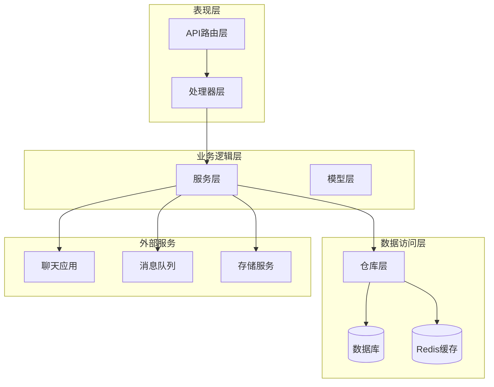
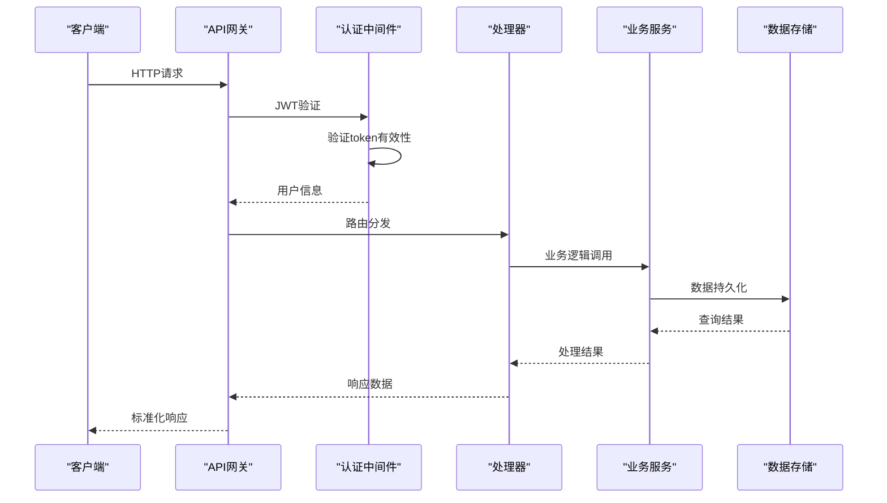
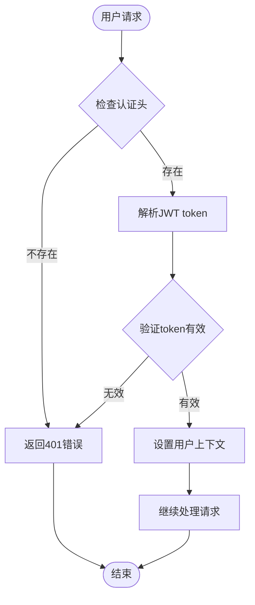
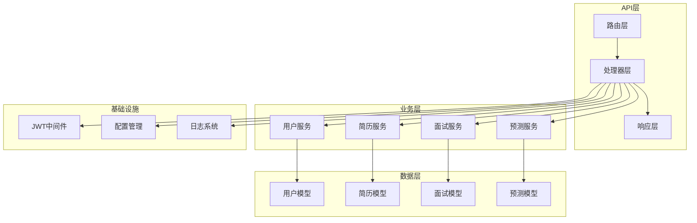
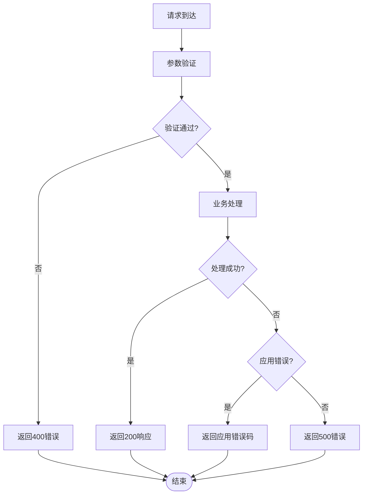

# API接口文档

<cite>
**本文档引用的文件**
- [backend/main.go](file://backend/main.go)
- [backend/api/router/register.go](file://backend/api/router/register.go)
- [backend/api/router/interview/api.go](file://backend/api/router/interview/api.go)
- [backend/api/handler/interview/interviews_service.go](file://backend/api/handler/interview/interviews_service.go)
- [backend/api/handler/interview/mianshi_service.go](file://backend/api/handler/interview/mianshi_service.go)
- [backend/api/handler/interview/user_service.go](file://backend/api/handler/interview/user_service.go)
- [backend/api/handler/interview/prediction_service.go](file://backend/api/handler/interview/prediction_service.go)
- [backend/api/response/response.go](file://backend/api/response/response.go)
- [backend/idl/api.thrift](file://backend/idl/api.thrift)
- [backend/internal/middleware/jwt.go](file://backend/internal/middleware/jwt.go)
- [backend/api/model/interviews/interviews.go](file://backend/api/model/interviews/interviews.go)
- [backend/api/model/mianshi/mianshi.go](file://backend/api/model/mianshi/mianshi.go)
- [backend/api/model/user/user.go](file://backend/api/model/user/user.go)
- [backend/api/model/prediction/prediction.go](file://backend/api/model/prediction/prediction.go)
- [backend/config.yaml](file://backend/config.yaml)
</cite>

## 目录
1. [简介](#简介)
2. [项目结构](#项目结构)
3. [核心组件](#核心组件)
4. [架构概览](#架构概览)
5. [详细组件分析](#详细组件分析)
6. [依赖关系分析](#依赖关系分析)
7. [性能考虑](#性能考虑)
8. [故障排除指南](#故障排除指南)
9. [结论](#结论)
10. [附录](#附录)

## 简介

面试吧平台是一个基于Go语言开发的智能面试辅助系统，采用CloudWeGo Hertz框架构建RESTful API。该平台提供完整的面试体验，包括简历管理、智能面试、押题预测等功能模块。

本API文档详细记录了所有RESTful API的HTTP方法、URL模式、请求参数和响应格式，涵盖用户管理、简历管理、面试系统等各个功能模块。文档还包含了认证机制、错误码定义、示例代码以及客户端集成指南。

## 项目结构

面试吧平台采用分层架构设计，主要分为以下层次：



**图表来源**
- [backend/main.go](file://backend/main.go#L1-L211)
- [backend/api/router/register.go](file://backend/api/router/register.go#L1-L16)

**章节来源**
- [backend/main.go](file://backend/main.go#L1-L211)
- [backend/api/router/register.go](file://backend/api/router/register.go#L1-L16)

## 核心组件

### 服务器配置

系统使用CloudWeGo Hertz框架作为HTTP服务器，支持以下核心特性：

- **CORS跨域支持**：允许所有域名访问，支持预检请求
- **JWT认证中间件**：统一的用户身份验证机制
- **全局异常处理**：捕获panic并返回标准错误响应
- **消息队列集成**：支持Redis作为消息队列后端

### 配置管理

系统通过YAML配置文件管理所有运行时配置：

- **服务配置**：主机地址、端口、日志级别
- **数据库配置**：MySQL连接参数、连接池设置
- **Redis配置**：连接参数、超时设置
- **安全配置**：JWT密钥、过期时间、CORS设置
- **外部服务配置**：OpenAI、Google搜索等第三方服务

**章节来源**
- [backend/main.go](file://backend/main.go#L101-L173)
- [backend/config.yaml](file://backend/config.yaml#L1-L129)

## 架构概览

面试吧平台采用微服务架构，通过Thrift IDL定义服务接口，支持多模块扩展：



**图表来源**
- [backend/api/router/interview/api.go](file://backend/api/router/interview/api.go#L17-L103)
- [backend/internal/middleware/jwt.go](file://backend/internal/middleware/jwt.go#L32-L78)

**章节来源**
- [backend/idl/api.thrift](file://backend/idl/api.thrift#L1-L12)
- [backend/api/router/interview/api.go](file://backend/api/router/interview/api.go#L1-L104)

## 详细组件分析

### 用户管理系统

用户管理系统提供完整的用户生命周期管理功能，包括注册、登录、个人资料管理等。

#### 认证机制

系统采用JWT（JSON Web Token）进行用户身份验证：



**图表来源**
- [backend/internal/middleware/jwt.go](file://backend/internal/middleware/jwt.go#L115-L134)

#### 用户认证API

| 接口 | 方法 | URL | 描述 |
|------|------|-----|------|
| 用户注册 | POST | `/api/user/register` | 用户注册新账户 |
| 用户登录 | POST | `/api/user/login` | 用户登录获取token |
| 获取个人资料 | GET | `/api/user/profile` | 获取当前用户资料 |
| 更新个人资料 | PUT | `/api/user/profile` | 更新用户个人资料 |
| 忘记密码 | POST | `/api/user/password/forgot` | 发送密码重置邮件 |
| 重置密码 | POST | `/api/user/password/reset` | 重置用户密码 |

**章节来源**
- [backend/api/handler/interview/user_service.go](file://backend/api/handler/interview/user_service.go#L212-L322)
- [backend/api/handler/interview/user_service.go](file://backend/api/handler/interview/user_service.go#L44-L78)

### 简历管理系统

简历管理系统支持PDF格式简历的上传、解析、管理和默认简历设置。

#### 简历管理API

| 接口 | 方法 | URL | 描述 |
|------|------|-----|------|
| 上传简历 | POST | `/api/resume/upload` | 上传PDF格式简历 |
| 获取简历列表 | GET | `/api/resume/list` | 获取用户简历列表 |
| 获取默认简历 | GET | `/api/resume/default` | 获取用户的默认简历 |
| 设置默认简历 | POST | `/api/resume/set-default` | 设置用户的默认简历 |
| 获取简历详情 | GET | `/api/resume/:resume_id` | 获取指定简历详情 |
| 更新简历 | PUT | `/api/resume/:resume_id` | 更新简历信息 |
| 删除简历 | DELETE | `/api/resume/:resume_id` | 删除指定简历 |

**章节来源**
- [backend/api/handler/interview/interviews_service.go](file://backend/api/handler/interview/interviews_service.go#L55-L92)
- [backend/api/handler/interview/interviews_service.go](file://backend/api/handler/interview/interviews_service.go#L203-L253)

### 面试系统

面试系统提供智能面试功能，支持多种面试类型和难度级别。

#### 面试API

| 接口 | 方法 | URL | 描述 |
|------|------|-----|------|
| 启动面试流 | POST | `/api/mianshi/stream/start` | 启动SSE面试流 |
| 提交面试答案 | POST | `/api/mianshi/answer/submit` | 提交面试答案 |
| 获取会话信息 | GET | `/api/mianshi/session/info` | 获取面试会话信息 |
| 结束面试 | POST | `/api/mianshi/interview/end` | 结束当前面试 |
| 获取面试评估 | GET | `/api/mianshi/evaluation` | 获取面试评估报告 |
| 获取答案记录 | GET | `/api/mianshi/answer-record` | 获取答案记录 |
| 获取面试记录 | GET | `/api/mianshi/records` | 获取面试记录列表 |

**章节来源**
- [backend/api/handler/interview/mianshi_service.go](file://backend/api/handler/interview/mianshi_service.go#L25-L117)
- [backend/api/handler/interview/mianshi_service.go](file://backend/api/handler/interview/mianshi_service.go#L302-L340)

### 押题预测系统

押题预测系统基于用户简历和面试要求，提供智能化的面试题目预测。

#### 押题API

| 接口 | 方法 | URL | 描述 |
|------|------|-----|------|
| 开始押题预测 | POST | `/api/prediction/start` | 开始押题预测流程 |
| 获取押题列表 | GET | `/api/prediction/list` | 获取押题预测列表 |
| 获取押题详情 | GET | `/api/prediction/:id` | 获取指定押题详情 |

**章节来源**
- [backend/api/handler/interview/prediction_service.go](file://backend/api/handler/interview/prediction_service.go#L17-L42)
- [backend/api/handler/interview/prediction_service.go](file://backend/api/handler/interview/prediction_service.go#L44-L68)

### 用户模型管理

系统支持多用户模型配置，便于集成不同的AI服务提供商。

#### 用户模型API

| 接口 | 方法 | URL | 描述 |
|------|------|-----|------|
| 创建用户模型 | POST | `/api/user/create/model` | 创建用户AI模型配置 |
| 获取模型列表 | GET | `/api/user/model/list` | 获取用户模型列表 |
| 获取模型详情 | GET | `/api/user/model/details/:id` | 获取指定模型详情 |
| 更新模型 | PUT | `/api/user/model/update/:id` | 更新用户模型配置 |
| 删除模型 | DELETE | `/api/user/model/delete/:id` | 删除用户模型配置 |
| 检查模型配置 | GET | `/api/user/model/check` | 检查用户模型配置状态 |

**章节来源**
- [backend/api/handler/interview/user_service.go](file://backend/api/handler/interview/user_service.go#L18-L42)
- [backend/api/handler/interview/user_service.go](file://backend/api/handler/interview/user_service.go#L384-L420)

## 依赖关系分析

系统采用模块化设计，各组件之间通过清晰的接口进行交互：



**图表来源**
- [backend/api/router/interview/api.go](file://backend/api/router/interview/api.go#L17-L103)
- [backend/api/response/response.go](file://backend/api/response/response.go#L1-L119)

**章节来源**
- [backend/api/router/register.go](file://backend/api/router/register.go#L11-L15)
- [backend/api/response/response.go](file://backend/api/response/response.go#L1-L119)

## 性能考虑

### 缓存策略

系统采用多层缓存机制：

- **Redis缓存**：用户会话、模型配置、频繁查询结果
- **数据库连接池**：优化数据库连接复用
- **静态资源缓存**：前端静态文件缓存策略

### 异步处理

- **消息队列**：使用Redis作为消息队列，支持异步任务处理
- **SSE流式传输**：面试过程中的实时数据推送
- **后台任务**：简历解析、数据分析等耗时操作

### 资源管理

- **连接池管理**：数据库和Redis连接池配置
- **内存管理**：及时释放大对象和临时数据
- **文件处理**：简历上传的文件清理机制

## 故障排除指南

### 常见错误码

系统采用统一的错误响应格式：

| 错误码 | HTTP状态码 | 描述 | 处理建议 |
|--------|------------|------|----------|
| 200 | 200 | 成功 | 正常响应，检查业务逻辑 |
| 400 | 400 | 请求错误 | 检查请求参数格式 |
| 401 | 401 | 未授权 | 检查JWT token有效性 |
| 403 | 403 | 禁止访问 | 检查用户权限 |
| 404 | 404 | 资源不存在 | 检查URL路径正确性 |
| 500 | 500 | 服务器内部错误 | 查看服务器日志 |

### 错误处理流程



**图表来源**
- [backend/api/response/response.go](file://backend/api/response/response.go#L80-L88)

**章节来源**
- [backend/api/response/response.go](file://backend/api/response/response.go#L1-L119)

## 结论

面试吧平台提供了完整的智能面试解决方案，具有以下特点：

- **模块化设计**：清晰的分层架构，易于维护和扩展
- **标准化API**：RESTful接口设计，支持多种客户端集成
- **安全性保障**：JWT认证、CORS跨域、输入验证等多重安全措施
- **高性能架构**：缓存策略、异步处理、连接池优化
- **可扩展性**：Thrift IDL定义、模块化服务设计

该平台为用户提供了一站式的面试准备和练习解决方案，支持多种面试场景和难度级别的智能化面试体验。

## 附录

### API版本管理

系统采用语义化版本控制，通过URL路径中的版本号进行API版本管理：

```
/api/v1/user/login
/api/v1/resume/upload
/api/v1/interview/stream/start
```

### 速率限制

系统支持基于IP的速率限制机制，可通过配置文件调整限制规则。

### 安全考虑

- **HTTPS支持**：生产环境建议启用HTTPS
- **CORS配置**：灵活的跨域访问控制
- **输入验证**：严格的请求参数验证
- **SQL注入防护**：使用ORM框架防止SQL注入
- **XSS防护**：输出转义和内容安全策略

### 客户端集成指南

#### 基本配置

1. **安装依赖**：根据使用的编程语言安装相应的HTTP客户端库
2. **设置认证**：在请求头中添加Authorization: Bearer {token}
3. **错误处理**：实现统一的错误处理逻辑
4. **重试机制**：对网络请求实现指数退避重试

#### 示例代码结构

```javascript
// 基本请求示例
const response = await fetch('http://localhost:8888/api/v1/user/login', {
  method: 'POST',
  headers: {
    'Content-Type': 'application/json',
    'Authorization': 'Bearer ' + token
  },
  body: JSON.stringify({
    email: 'user@example.com',
    password: 'password'
  })
});
```

**章节来源**
- [backend/config.yaml](file://backend/config.yaml#L39-L49)