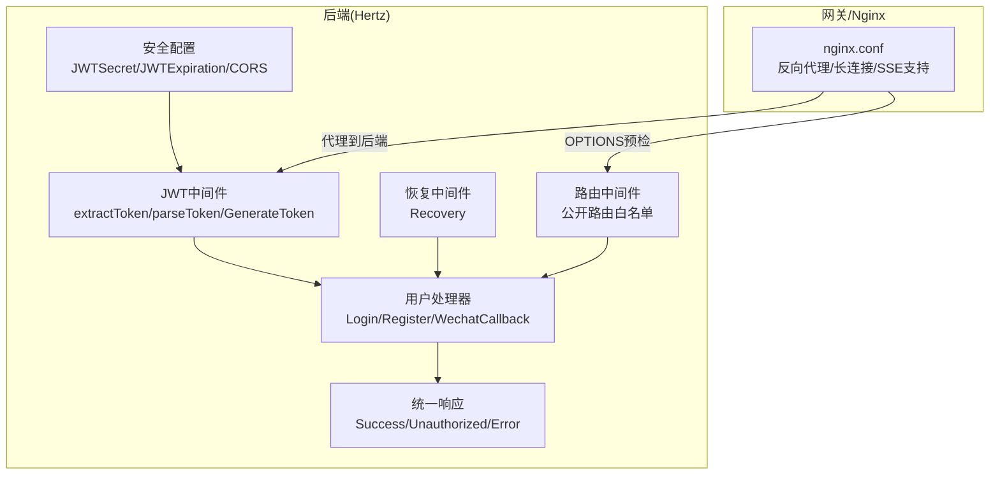
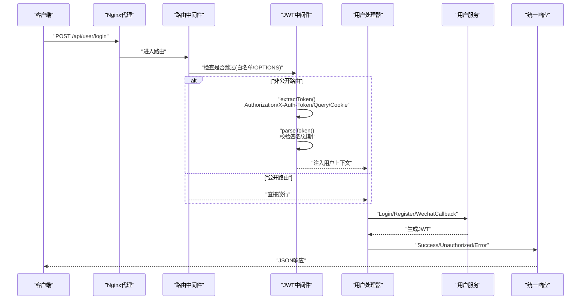
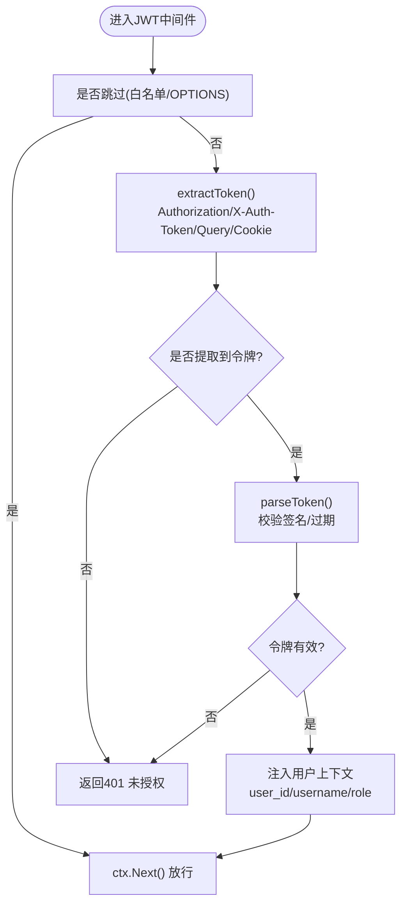
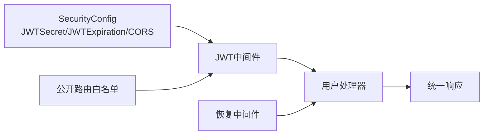

# API认证与安全

<cite>
**本文引用的文件**
- [backend/internal/middleware/jwt.go](file://backend/internal/middleware/jwt.go)
- [backend/api/router/interview/middleware.go](file://backend/api/router/interview/middleware.go)
- [backend/api/router/register.go](file://backend/api/router/register.go)
- [backend/api/response/response.go](file://backend/api/response/response.go)
- [backend/internal/config/config.go](file://backend/internal/config/config.go)
- [backend/api/handler/interview/user_service.go](file://backend/api/handler/interview/user_service.go)
- [backend/internal/service/user/impl/user_impl.go](file://backend/internal/service/user/impl/user_impl.go)
- [backend/api/router/middleware/recovery.go](file://backend/api/router/middleware/recovery.go)
- [nginx.conf](file://nginx.conf)
- [frontend/TROUBLESHOOTING.md](file://frontend/TROUBLESHOOTING.md)
- [frontend/src/components/BackendHealthCheck.tsx](file://frontend/src/components/BackendHealthCheck.tsx)
</cite>

## 目录
1. [简介](#简介)
2. [项目结构](#项目结构)
3. [核心组件](#核心组件)
4. [架构总览](#架构总览)
5. [详细组件分析](#详细组件分析)
6. [依赖关系分析](#依赖关系分析)
7. [性能考虑](#性能考虑)
8. [故障排除指南](#故障排除指南)
9. [结论](#结论)
10. [附录](#附录)

## 简介
本文件系统性梳理后端API的认证与安全机制，覆盖JWT令牌生成、验证与过期处理、权限校验、中间件配置、请求拦截与异常处理、认证头设置与令牌传递方式、错误响应格式、CORS配置与HTTPS建议、CSRF防护现状与建议、安全最佳实践、常见攻击防护与调试技巧，并提供客户端集成示例与故障排除清单。

## 项目结构
后端采用Hertz框架，认证与安全相关的关键位置如下：
- 中间件层：JWT中间件、恢复中间件
- 路由层：公开路由白名单、路由注册入口
- 业务层：用户登录/注册/微信登录等处理器
- 配置层：安全配置（JWT密钥、过期时间、CORS）
- 响应层：统一响应与错误码映射
- 网关/Nginx：代理与长连接支持

图表来源
- [backend/internal/middleware/jwt.go](file://backend/internal/middleware/jwt.go#L32-L78)
- [backend/api/router/interview/middleware.go](file://backend/api/router/interview/middleware.go#L13-L36)
- [backend/api/router/register.go](file://backend/api/router/register.go#L12-L15)
- [backend/api/response/response.go](file://backend/api/response/response.go#L29-L88)
- [backend/internal/config/config.go](file://backend/internal/config/config.go#L113-L118)
- [backend/api/router/middleware/recovery.go](file://backend/api/router/middleware/recovery.go#L15-L34)

章节来源
- [backend/internal/middleware/jwt.go](file://backend/internal/middleware/jwt.go#L1-L215)
- [backend/api/router/interview/middleware.go](file://backend/api/router/interview/middleware.go#L1-L362)
- [backend/api/router/register.go](file://backend/api/router/register.go#L1-L16)
- [backend/api/response/response.go](file://backend/api/response/response.go#L1-L119)
- [backend/internal/config/config.go](file://backend/internal/config/config.go#L1-L269)
- [backend/api/router/middleware/recovery.go](file://backend/api/router/middleware/recovery.go#L1-L35)

## 核心组件
- JWT中间件：负责从多种来源提取令牌、解析与校验、注入用户上下文、处理未授权场景
- 公开路由白名单：通过跳过器在OPTIONS与特定路径免JWT校验
- 登录/注册/微信登录：生成JWT并返回给客户端
- 统一响应：标准化错误码与HTTP状态码映射
- 安全配置：JWT密钥、过期时间、CORS策略
- 恢复中间件：捕获panic并返回统一错误

章节来源
- [backend/internal/middleware/jwt.go](file://backend/internal/middleware/jwt.go#L32-L78)
- [backend/api/router/interview/middleware.go](file://backend/api/router/interview/middleware.go#L13-L36)
- [backend/internal/service/user/impl/user_impl.go](file://backend/internal/service/user/impl/user_impl.go#L34-L93)
- [backend/api/response/response.go](file://backend/api/response/response.go#L41-L88)
- [backend/internal/config/config.go](file://backend/internal/config/config.go#L113-L118)
- [backend/api/router/middleware/recovery.go](file://backend/api/router/middleware/recovery.go#L15-L34)

## 架构总览
下图展示从客户端到后端的典型认证流程，包括JWT生成、验证与过期处理。

图表来源
- [backend/api/router/interview/middleware.go](file://backend/api/router/interview/middleware.go#L13-L36)
- [backend/internal/middleware/jwt.go](file://backend/internal/middleware/jwt.go#L49-L77)
- [backend/internal/service/user/impl/user_impl.go](file://backend/internal/service/user/impl/user_impl.go#L67-L93)
- [backend/api/response/response.go](file://backend/api/response/response.go#L29-L88)

## 详细组件分析

### JWT令牌生成、验证与过期处理
- 令牌生成
  - 使用对称签名算法，基于配置的密钥与过期时间生成
  - 注入发行者、签发时间、生效时间与过期时间
- 令牌解析
  - 校验签名算法与密钥
  - 验证过期时间与生效时间
  - 失败时返回未授权
- 上下文注入
  - 成功解析后将用户ID、用户名、角色注入请求上下文
- 令牌来源
  - 支持标准Authorization头（Bearer）、自定义X-Auth-Token头、查询参数token、Cookie token

图表来源
- [backend/internal/middleware/jwt.go](file://backend/internal/middleware/jwt.go#L32-L78)
- [backend/internal/middleware/jwt.go](file://backend/internal/middleware/jwt.go#L186-L214)

章节来源
- [backend/internal/middleware/jwt.go](file://backend/internal/middleware/jwt.go#L80-L134)

### 权限验证与公开路由
- 公开路由白名单
  - 登录、注册、退出、微信登录、回调、密码找回/重置等
  - OPTIONS预检请求自动跳过
- 路由跳过器
  - 通过路径匹配与方法判断决定是否绕过JWT中间件
- 处理器侧二次校验
  - 部分敏感接口在处理器内再次读取上下文用户ID进行权限判定

章节来源
- [backend/api/router/interview/middleware.go](file://backend/api/router/interview/middleware.go#L13-L36)
- [backend/api/handler/interview/user_service.go](file://backend/api/handler/interview/user_service.go#L275-L286)

### 登录与令牌返回
- 登录/注册/微信回调均会生成JWT并返回给客户端
- 响应结构包含token与用户信息

章节来源
- [backend/internal/service/user/impl/user_impl.go](file://backend/internal/service/user/impl/user_impl.go#L34-L93)
- [backend/api/handler/interview/user_service.go](file://backend/api/handler/interview/user_service.go#L212-L262)

### 统一响应与错误处理
- 统一响应结构包含业务码、消息与数据
- 错误码到HTTP状态码映射
- 未授权、禁止访问、内部错误等专用方法
- 恢复中间件捕获panic并返回统一错误

章节来源
- [backend/api/response/response.go](file://backend/api/response/response.go#L13-L119)
- [backend/api/router/middleware/recovery.go](file://backend/api/router/middleware/recovery.go#L15-L34)

### 安全配置
- JWT密钥与过期时间
- CORS策略（允许来源、方法、头部、凭据）

章节来源
- [backend/internal/config/config.go](file://backend/internal/config/config.go#L113-L118)

## 依赖关系分析
- JWT中间件依赖安全配置（密钥、过期时间），并为处理器提供用户上下文
- 路由中间件依赖公开路由白名单，决定是否跳过JWT校验
- 处理器依赖JWT中间件提供的用户上下文，以及统一响应模块
- 恢复中间件独立于业务逻辑，提供全局异常兜底

图表来源
- [backend/internal/config/config.go](file://backend/internal/config/config.go#L113-L118)
- [backend/api/router/interview/middleware.go](file://backend/api/router/interview/middleware.go#L13-L36)
- [backend/internal/middleware/jwt.go](file://backend/internal/middleware/jwt.go#L32-L78)
- [backend/api/response/response.go](file://backend/api/response/response.go#L29-L88)
- [backend/api/router/middleware/recovery.go](file://backend/api/router/middleware/recovery.go#L15-L34)

章节来源
- [backend/internal/middleware/jwt.go](file://backend/internal/middleware/jwt.go#L1-L215)
- [backend/api/router/interview/middleware.go](file://backend/api/router/interview/middleware.go#L1-L362)
- [backend/api/response/response.go](file://backend/api/response/response.go#L1-L119)
- [backend/internal/config/config.go](file://backend/internal/config/config.go#L113-L118)
- [backend/api/router/middleware/recovery.go](file://backend/api/router/middleware/recovery.go#L1-L35)

## 性能考虑
- JWT解析为轻量计算，主要成本在签名验证与过期检查
- 建议合理设置过期时间，避免频繁刷新导致的往返开销
- 对高频接口可结合缓存策略（如Redis）存储短期用户信息，减少数据库访问
- 长连接与SSE场景需关注Nginx超时配置，避免连接中断影响用户体验

## 故障排除指南
- 404与CORS问题
  - 确认后端服务已启动并监听8888端口
  - 检查路由是否在公开白名单中，必要时添加到白名单
  - 前端健康检查组件可辅助定位CORS与接口可用性
- 401未授权
  - 确认Authorization头格式为Bearer {token}
  - 确认令牌未过期，必要时重新登录获取新令牌
- CORS配置
  - 后端CORS配置需允许前端域名与所需方法/头部
  - 前端OPTIONS预检请求会被路由中间件跳过，确保白名单覆盖
- HTTPS与安全传输
  - 生产环境建议启用HTTPS，避免令牌在传输中被窃取
- 日志与调试
  - 使用恢复中间件捕获panic并输出堆栈
  - 前端可使用健康检查组件查看CORS头与接口状态

章节来源
- [frontend/TROUBLESHOOTING.md](file://frontend/TROUBLESHOOTING.md#L1-L73)
- [frontend/src/components/BackendHealthCheck.tsx](file://frontend/src/components/BackendHealthCheck.tsx#L41-L73)
- [backend/api/router/middleware/recovery.go](file://backend/api/router/middleware/recovery.go#L15-L34)

## 结论
本项目采用JWT作为主要认证手段，配合公开路由白名单与统一响应/异常处理机制，实现了较为完善的认证与安全体系。建议在生产环境中完善HTTPS、CSRF防护与更严格的CORS策略，并考虑引入令牌刷新机制以提升用户体验与安全性。

## 附录

### 认证头设置与令牌传递
- 推荐使用Authorization头：Authorization: Bearer {token}
- 其他可选来源：X-Auth-Token头、查询参数token、Cookie token
- 登录成功后，服务端返回token与用户信息

章节来源
- [backend/internal/middleware/jwt.go](file://backend/internal/middleware/jwt.go#L186-L214)
- [backend/internal/service/user/impl/user_impl.go](file://backend/internal/service/user/impl/user_impl.go#L34-L93)
- [backend/api/handler/interview/user_service.go](file://backend/api/handler/interview/user_service.go#L212-L262)

### 错误响应格式
- 统一结构：包含业务码、消息与数据
- 未授权：401
- 禁止访问：403
- 内部错误：500
- 错误码到HTTP状态码映射详见响应模块

章节来源
- [backend/api/response/response.go](file://backend/api/response/response.go#L13-L119)

### CORS配置与HTTPS建议
- CORS配置项：允许来源、方法、头部、暴露头部、凭据
- 建议生产环境启用HTTPS，确保令牌与数据传输安全
- Nginx已开启WebSocket/SSE支持与长连接超时配置

章节来源
- [backend/internal/config/config.go](file://backend/internal/config/config.go#L55-L62)
- [nginx.conf](file://nginx.conf#L15-L38)

### CSRF防护现状与建议
- 当前未见专门的CSRF中间件或双提交Cookie策略
- 建议在生产环境引入CSRF防护（如SameSite Cookie、CSRF Token）
- 对于无状态API，优先通过HTTPS与严格CORS降低风险

### 安全最佳实践
- 强制HTTPS传输
- 最小权限原则与公开路由白名单
- 合理设置JWT过期时间与刷新策略
- 严格CORS配置，避免过度放行
- 定期轮换JWT密钥
- 限制请求速率与频率，防止滥用