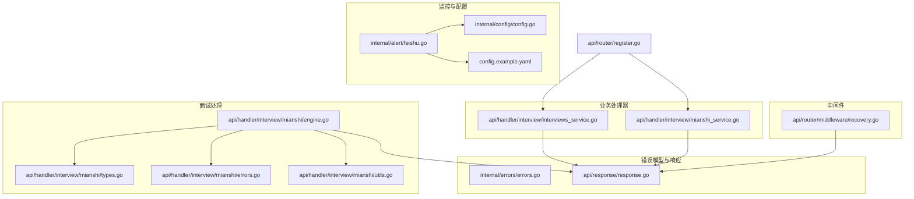
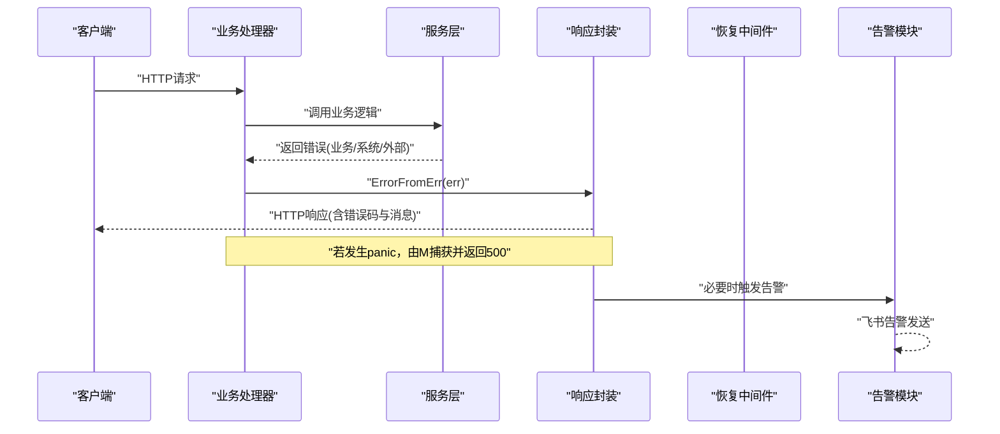
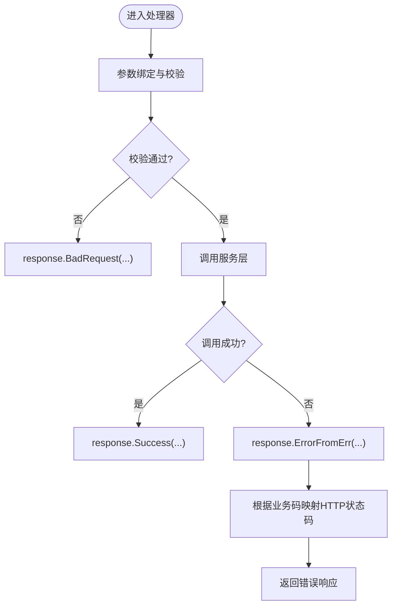
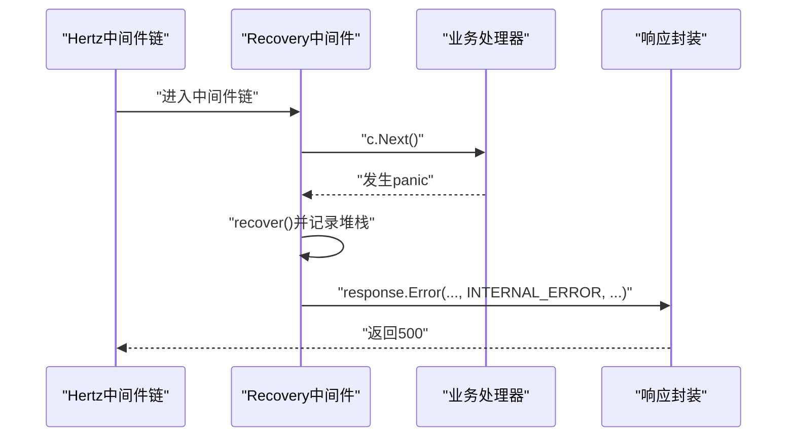
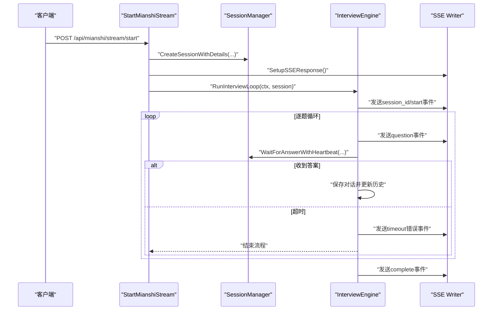
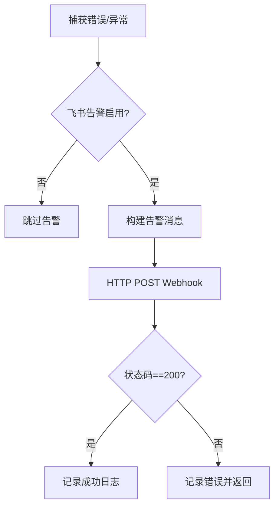
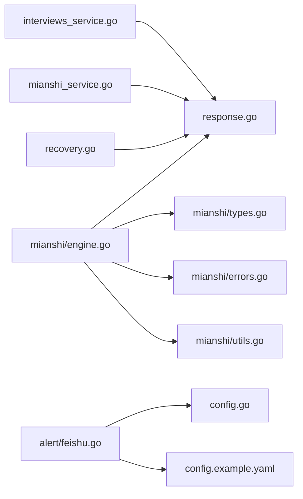

# API错误处理与状态码

<cite>
**本文档引用的文件**
- [backend/internal/errors/errors.go](file://backend/internal/errors/errors.go)
- [backend/api/response/response.go](file://backend/api/response/response.go)
- [backend/api/router/middleware/recovery.go](file://backend/api/router/middleware/recovery.go)
- [backend/api/handler/interview/mianshi/errors.go](file://backend/api/handler/interview/mianshi/errors.go)
- [backend/api/handler/interview/mianshi/types.go](file://backend/api/handler/interview/mianshi/types.go)
- [backend/api/handler/interview/mianshi/engine.go](file://backend/api/handler/interview/mianshi/engine.go)
- [backend/api/handler/interview/mianshi/utils.go](file://backend/api/handler/interview/mianshi/utils.go)
- [backend/api/handler/interview/interviews_service.go](file://backend/api/handler/interview/interviews_service.go)
- [backend/api/handler/interview/mianshi_service.go](file://backend/api/handler/interview/mianshi_service.go)
- [backend/internal/alert/feishu.go](file://backend/internal/alert/feishu.go)
- [backend/internal/config/config.go](file://backend/internal/config/config.go)
- [backend/config.example.yaml](file://backend/config.example.yaml)
- [backend/api/router/register.go](file://backend/api/router/register.go)
</cite>

## 目录
1. [简介](#简介)
2. [项目结构](#项目结构)
3. [核心组件](#核心组件)
4. [架构总览](#架构总览)
5. [详细组件分析](#详细组件分析)
6. [依赖关系分析](#依赖关系分析)
7. [性能考虑](#性能考虑)
8. [故障排除指南](#故障排除指南)
9. [结论](#结论)
10. [附录](#附录)

## 简介
本文件系统化梳理并规范本项目的API错误处理与状态码体系，覆盖业务错误、系统错误与网络错误的分类处理，统一错误响应模板、错误码定义与消息格式，明确日志记录规范、错误传播机制、重试策略与降级处理，以及错误监控与告警配置。同时提供客户端错误处理示例与调试工具使用指南，帮助开发者快速定位与修复问题，提升用户体验。

## 项目结构
围绕错误处理的关键模块分布如下：
- 内核错误模型与错误码定义：位于 internal/errors
- 统一响应封装：位于 api/response
- 全局恢复中间件：位于 api/router/middleware
- 面试会话与引擎：位于 api/handler/interview/mianshi
- 业务处理器：位于 api/handler/interview
- 告警与配置：位于 internal/alert 与 internal/config
- 路由注册：位于 api/router



**图表来源**
- [backend/internal/errors/errors.go](file://backend/internal/errors/errors.go#L1-L178)
- [backend/api/response/response.go](file://backend/api/response/response.go#L1-L119)
- [backend/api/router/middleware/recovery.go](file://backend/api/router/middleware/recovery.go#L1-L35)
- [backend/api/handler/interview/mianshi/types.go](file://backend/api/handler/interview/mianshi/types.go#L1-L165)
- [backend/api/handler/interview/mianshi/errors.go](file://backend/api/handler/interview/mianshi/errors.go#L1-L13)
- [backend/api/handler/interview/mianshi/engine.go](file://backend/api/handler/interview/mianshi/engine.go#L1-L291)
- [backend/api/handler/interview/mianshi/utils.go](file://backend/api/handler/interview/mianshi/utils.go#L1-L74)
- [backend/api/handler/interview/interviews_service.go](file://backend/api/handler/interview/interviews_service.go#L1-L391)
- [backend/api/handler/interview/mianshi_service.go](file://backend/api/handler/interview/mianshi_service.go#L1-L409)
- [backend/internal/alert/feishu.go](file://backend/internal/alert/feishu.go#L1-L79)
- [backend/internal/config/config.go](file://backend/internal/config/config.go#L1-L269)
- [backend/config.example.yaml](file://backend/config.example.yaml#L111-L127)
- [backend/api/router/register.go](file://backend/api/router/register.go#L1-L16)

**章节来源**
- [backend/internal/errors/errors.go](file://backend/internal/errors/errors.go#L1-L178)
- [backend/api/response/response.go](file://backend/api/response/response.go#L1-L119)
- [backend/api/router/middleware/recovery.go](file://backend/api/router/middleware/recovery.go#L1-L35)
- [backend/api/handler/interview/mianshi/types.go](file://backend/api/handler/interview/mianshi/types.go#L1-L165)
- [backend/api/handler/interview/mianshi/errors.go](file://backend/api/handler/interview/mianshi/errors.go#L1-L13)
- [backend/api/handler/interview/mianshi/engine.go](file://backend/api/handler/interview/mianshi/engine.go#L1-L291)
- [backend/api/handler/interview/mianshi/utils.go](file://backend/api/handler/interview/mianshi/utils.go#L1-L74)
- [backend/api/handler/interview/interviews_service.go](file://backend/api/handler/interview/interviews_service.go#L1-L391)
- [backend/api/handler/interview/mianshi_service.go](file://backend/api/handler/interview/mianshi_service.go#L1-L409)
- [backend/internal/alert/feishu.go](file://backend/internal/alert/feishu.go#L1-L79)
- [backend/internal/config/config.go](file://backend/internal/config/config.go#L1-L269)
- [backend/config.example.yaml](file://backend/config.example.yaml#L111-L127)
- [backend/api/router/register.go](file://backend/api/router/register.go#L1-L16)

## 核心组件
- 错误码与错误模型：定义统一的业务错误码、HTTP状态映射与错误链包装能力，支持业务错误、系统错误与外部服务错误的分类处理。
- 统一响应封装：提供成功与错误响应模板，支持按业务码映射HTTP状态码，确保前后端一致的错误契约。
- 全局恢复中间件：捕获panic并转换为内部错误响应，避免服务崩溃导致的未知错误。
- 面试引擎与会话管理：通过会话管理器与面试引擎协调SSE流式交互，结合错误常量与错误传播机制保障流程稳定性。
- 告警与配置：通过飞书告警通道与配置中心，实现错误监控与通知，支持环境变量注入与开关控制。

**章节来源**
- [backend/internal/errors/errors.go](file://backend/internal/errors/errors.go#L9-L29)
- [backend/api/response/response.go](file://backend/api/response/response.go#L13-L53)
- [backend/api/router/middleware/recovery.go](file://backend/api/router/middleware/recovery.go#L15-L34)
- [backend/api/handler/interview/mianshi/types.go](file://backend/api/handler/interview/mianshi/types.go#L9-L50)
- [backend/internal/alert/feishu.go](file://backend/internal/alert/feishu.go#L24-L78)

## 架构总览
错误处理在系统中的流转路径如下：
- 业务处理器接收请求，进行参数绑定与校验，调用服务层。
- 服务层抛出或包装错误，统一通过响应封装层转换为HTTP响应。
- 全局恢复中间件兜底，捕获未处理异常并返回内部错误。
- 错误监控通过告警模块上报，结合配置中心实现灵活开关与环境变量注入。



**图表来源**
- [backend/api/handler/interview/interviews_service.go](file://backend/api/handler/interview/interviews_service.go#L26-L53)
- [backend/api/handler/interview/mianshi_service.go](file://backend/api/handler/interview/mianshi_service.go#L25-L117)
- [backend/api/response/response.go](file://backend/api/response/response.go#L80-L88)
- [backend/api/router/middleware/recovery.go](file://backend/api/router/middleware/recovery.go#L16-L34)
- [backend/internal/alert/feishu.go](file://backend/internal/alert/feishu.go#L24-L78)

## 详细组件分析

### 错误码与错误模型
- 错误码类型：ErrorCode为字符串类型，涵盖内部错误、参数错误、未找到、未授权、禁止访问、数据库错误、Redis错误、Milvus错误、模型错误、验证错误、飞书错误、OpenAI错误及模型API相关错误码（配额不足、频率限制、上下文超限）。
- 错误结构：AppError包含业务错误码、用户友好消息、HTTP状态码（仅内部使用）、底层错误（用于错误链追踪）。
- 错误构造：提供NewAppError与WrapError两类构造方式；预定义构造函数覆盖常见场景；As/Unwrap支持错误链检查与解包。
- HTTP状态映射：根据业务码映射到标准HTTP状态码，保证语义一致性。

```mermaid
classDiagram
class AppError {
+ErrorCode Code
+string Message
+int HTTPStatus
+error Err
+Error() string
+Unwrap() error
}
class ErrorCode {
<<enumeration>>
"INTERNAL_ERROR"
"INVALID_PARAM"
"NOT_FOUND"
"UNAUTHORIZED"
"FORBIDDEN"
"DATABASE_ERROR"
"REDIS_ERROR"
"MILVUS_ERROR"
"MODEL_ERROR"
"VALIDATION_ERROR"
"FEISHU_ERROR"
"OPENAI_ERROR"
"INSUFFICIENT_TOKENS"
"RATE_LIMIT_EXCEEDED"
"CONTEXT_LENGTH_EXCEEDED"
}
AppError --> ErrorCode : "使用"
```

**图表来源**
- [backend/internal/errors/errors.go](file://backend/internal/errors/errors.go#L9-L51)

**章节来源**
- [backend/internal/errors/errors.go](file://backend/internal/errors/errors.go#L9-L29)
- [backend/internal/errors/errors.go](file://backend/internal/errors/errors.go#L31-L72)
- [backend/internal/errors/errors.go](file://backend/internal/errors/errors.go#L74-L177)
- [backend/api/response/response.go](file://backend/api/response/response.go#L90-L118)

### 统一响应封装
- 成功响应：统一返回code=200与data，便于前端一致处理。
- 错误响应：支持业务码到HTTP状态码映射，Error/ErrorWithData覆盖不同场景。
- 常见HTTP快捷方法：BadRequest、Unauthorized、Forbidden、NotFound、InternalServerError等。
- 错误传播：ErrorFromErr根据错误类型自动映射HTTP状态码，简化处理器实现。



**图表来源**
- [backend/api/response/response.go](file://backend/api/response/response.go#L29-L88)

**章节来源**
- [backend/api/response/response.go](file://backend/api/response/response.go#L13-L53)
- [backend/api/response/response.go](file://backend/api/response/response.go#L55-L88)
- [backend/api/response/response.go](file://backend/api/response/response.go#L90-L118)

### 全局恢复中间件
- 捕获panic并记录堆栈，构造内部错误，统一返回500响应，避免服务崩溃。
- 通过日志输出恢复信息，便于运维定位问题。



**图表来源**
- [backend/api/router/middleware/recovery.go](file://backend/api/router/middleware/recovery.go#L16-L34)

**章节来源**
- [backend/api/router/middleware/recovery.go](file://backend/api/router/middleware/recovery.go#L15-L34)

### 面试引擎与会话管理
- 会话管理器：全局单例，负责会话创建、获取、提交答案、清理答案通道与删除会话。
- 引擎：驱动面试流程，逐题生成问题并通过SSE推送事件；等待用户答案并处理超时；保存对话记录并发布评估消息。
- 错误常量：会话未找到、无效会话ID、未授权等，用于会话操作失败的场景。
- 心跳与SSE：提供SetupSSEResponse与WaitForAnswerWithHeartbeat，维持长连接稳定。



**图表来源**
- [backend/api/handler/interview/mianshi_service.go](file://backend/api/handler/interview/mianshi_service.go#L25-L117)
- [backend/api/handler/interview/mianshi/engine.go](file://backend/api/handler/interview/mianshi/engine.go#L39-L230)
- [backend/api/handler/interview/mianshi/types.go](file://backend/api/handler/interview/mianshi/types.go#L52-L149)
- [backend/api/handler/interview/mianshi/utils.go](file://backend/api/handler/interview/mianshi/utils.go#L11-L73)

**章节来源**
- [backend/api/handler/interview/mianshi/types.go](file://backend/api/handler/interview/mianshi/types.go#L9-L149)
- [backend/api/handler/interview/mianshi/errors.go](file://backend/api/handler/interview/mianshi/errors.go#L5-L12)
- [backend/api/handler/interview/mianshi/engine.go](file://backend/api/handler/interview/mianshi/engine.go#L39-L230)
- [backend/api/handler/interview/mianshi/utils.go](file://backend/api/handler/interview/mianshi/utils.go#L11-L73)

### 业务处理器中的错误处理
- 简历上传、获取、列表、设置默认简历等接口：统一进行参数校验、鉴权检查与错误映射，确保一致的错误响应。
- 面试相关接口：启动SSE流、提交答案、获取会话信息、结束面试与获取评估报告，均遵循统一错误处理流程。

**章节来源**
- [backend/api/handler/interview/interviews_service.go](file://backend/api/handler/interview/interviews_service.go#L26-L391)
- [backend/api/handler/interview/mianshi_service.go](file://backend/api/handler/interview/mianshi_service.go#L25-L409)

### 错误监控与告警
- 飞书告警：支持发送文本告警，包含标题与内容；数据库错误告警封装专用方法。
- 配置中心：通过config.yaml与环境变量注入，支持启用/禁用与Webhook URL配置。
- 集成测试：提供飞书告警的集成测试样例，便于验证配置与发送流程。



**图表来源**
- [backend/internal/alert/feishu.go](file://backend/internal/alert/feishu.go#L24-L78)
- [backend/internal/config/config.go](file://backend/internal/config/config.go#L49-L53)
- [backend/config.example.yaml](file://backend/config.example.yaml#L124-L127)

**章节来源**
- [backend/internal/alert/feishu.go](file://backend/internal/alert/feishu.go#L24-L78)
- [backend/internal/config/config.go](file://backend/internal/config/config.go#L49-L53)
- [backend/config.example.yaml](file://backend/config.example.yaml#L124-L127)

## 依赖关系分析
- 业务处理器依赖响应封装进行统一错误与成功响应。
- 面试引擎依赖会话管理器与SSE工具，处理长连接与事件推送。
- 恢复中间件独立于业务逻辑，提供兜底保护。
- 告警模块依赖配置中心，实现灵活开关与环境变量注入。



**图表来源**
- [backend/api/handler/interview/interviews_service.go](file://backend/api/handler/interview/interviews_service.go#L1-L391)
- [backend/api/handler/interview/mianshi_service.go](file://backend/api/handler/interview/mianshi_service.go#L1-L409)
- [backend/api/response/response.go](file://backend/api/response/response.go#L1-L119)
- [backend/api/router/middleware/recovery.go](file://backend/api/router/middleware/recovery.go#L1-L35)
- [backend/api/handler/interview/mianshi/engine.go](file://backend/api/handler/interview/mianshi/engine.go#L1-L291)
- [backend/api/handler/interview/mianshi/types.go](file://backend/api/handler/interview/mianshi/types.go#L1-L165)
- [backend/api/handler/interview/mianshi/errors.go](file://backend/api/handler/interview/mianshi/errors.go#L1-L13)
- [backend/api/handler/interview/mianshi/utils.go](file://backend/api/handler/interview/mianshi/utils.go#L1-L74)
- [backend/internal/alert/feishu.go](file://backend/internal/alert/feishu.go#L1-L79)
- [backend/internal/config/config.go](file://backend/internal/config/config.go#L1-L269)
- [backend/config.example.yaml](file://backend/config.example.yaml#L111-L127)

**章节来源**
- [backend/api/handler/interview/interviews_service.go](file://backend/api/handler/interview/interviews_service.go#L1-L391)
- [backend/api/handler/interview/mianshi_service.go](file://backend/api/handler/interview/mianshi_service.go#L1-L409)
- [backend/api/response/response.go](file://backend/api/response/response.go#L1-L119)
- [backend/api/router/middleware/recovery.go](file://backend/api/router/middleware/recovery.go#L1-L35)
- [backend/api/handler/interview/mianshi/engine.go](file://backend/api/handler/interview/mianshi/engine.go#L1-L291)
- [backend/api/handler/interview/mianshi/types.go](file://backend/api/handler/interview/mianshi/types.go#L1-L165)
- [backend/api/handler/interview/mianshi/errors.go](file://backend/api/handler/interview/mianshi/errors.go#L1-L13)
- [backend/api/handler/interview/mianshi/utils.go](file://backend/api/handler/interview/mianshi/utils.go#L1-L74)
- [backend/internal/alert/feishu.go](file://backend/internal/alert/feishu.go#L1-L79)
- [backend/internal/config/config.go](file://backend/internal/config/config.go#L1-L269)
- [backend/config.example.yaml](file://backend/config.example.yaml#L111-L127)

## 性能考虑
- 错误链与日志：通过错误链追踪与结构化日志，减少重复错误处理逻辑，提升可观测性。
- SSE长连接：合理设置心跳间隔与超时时间，避免资源浪费与连接中断。
- 外部服务错误映射：针对模型API错误（配额不足、频率限制、上下文超限）进行精确状态码映射，便于前端与用户侧的差异化处理。
- 缓存与降级：建议在高并发场景下对热点数据增加缓存，并在外部服务不可用时提供降级策略（如静态响应或延迟重试）。

[本节为通用指导，无需特定文件来源]

## 故障排除指南
- 参数校验失败：检查处理器中的BindAndValidate调用与错误映射，确保返回400并携带明确消息。
- 未授权访问：确认JWT中间件与公共路由配置，确保SSE相关接口在白名单中。
- 会话相关错误：检查会话管理器的会话ID生成与查找逻辑，关注会话未找到与无效会话ID的处理。
- 模型API错误：根据错误码映射到402、429、413等状态码，前端据此提示用户充值、稍后重试或精简输入。
- 告警未发送：检查飞书告警配置是否启用、Webhook URL是否正确，查看日志输出以定位问题。

**章节来源**
- [backend/api/handler/interview/interviews_service.go](file://backend/api/handler/interview/interviews_service.go#L26-L92)
- [backend/api/handler/interview/mianshi_service.go](file://backend/api/handler/interview/mianshi_service.go#L25-L168)
- [backend/api/handler/interview/mianshi/errors.go](file://backend/api/handler/interview/mianshi/errors.go#L5-L12)
- [backend/internal/alert/feishu.go](file://backend/internal/alert/feishu.go#L24-L78)
- [backend/internal/config/config.go](file://backend/internal/config/config.go#L49-L53)
- [backend/config.example.yaml](file://backend/config.example.yaml#L124-L127)

## 结论
本项目已建立较为完善的错误处理与状态码规范：统一的错误模型与错误码、一致的响应模板、全局恢复中间件与告警机制。建议在后续迭代中进一步完善日志结构化、输入验证与测试覆盖，持续优化错误监控与告警策略，提升系统的稳定性与可维护性。

[本节为总结，无需特定文件来源]

## 附录

### HTTP状态码与错误码映射
- 200：成功（业务码200）
- 400：参数错误/验证失败（INVALID_PARAM）
- 401：未授权（UNAUTHORIZED）
- 403：禁止访问（FORBIDDEN）
- 402：支付所需（INSUFFICIENT_TOKENS）
- 404：未找到（NOT_FOUND）
- 413：请求实体过大（CONTEXT_LENGTH_EXCEEDED）
- 429：请求过于频繁（RATE_LIMIT_EXCEEDED）
- 500：内部错误（INTERNAL_ERROR）
- 502：上游网关错误（FEISHU_ERROR/OPENAI_ERROR）
- 503：服务不可用（视具体场景）

**章节来源**
- [backend/api/response/response.go](file://backend/api/response/response.go#L90-L118)
- [backend/internal/errors/errors.go](file://backend/internal/errors/errors.go#L12-L29)

### 错误响应模板
- 成功响应：包含code、message、data。
- 错误响应：包含code、message；必要时携带数据字段用于补充说明。

**章节来源**
- [backend/api/response/response.go](file://backend/api/response/response.go#L13-L53)

### 国际化支持
- 当前错误消息为英文，建议在统一响应层增加本地化适配，按Accept-Language或用户偏好返回对应语言的消息。

[本节为通用指导，无需特定文件来源]

### 日志记录规范
- panic恢复：记录堆栈信息与错误上下文。
- 飞书告警：记录发送结果与状态码，便于审计与排障。
- 建议引入结构化日志（如zap），统一字段与级别，提升日志检索效率。

**章节来源**
- [backend/api/router/middleware/recovery.go](file://backend/api/router/middleware/recovery.go#L16-L34)
- [backend/internal/alert/feishu.go](file://backend/internal/alert/feishu.go#L24-L78)

### 错误传播机制
- 服务层抛出error，处理器调用ErrorFromErr自动映射HTTP状态码。
- 错误链：WrapError保留底层错误，支持As/Unwrap进行类型检查与解包。

**章节来源**
- [backend/api/response/response.go](file://backend/api/response/response.go#L80-L88)
- [backend/internal/errors/errors.go](file://backend/internal/errors/errors.go#L48-L72)
- [backend/internal/errors/errors.go](file://backend/internal/errors/errors.go#L153-L177)

### 重试策略与降级处理
- 模型API错误：根据错误码映射到429（限流）与402（配额不足），前端引导用户重试或充值。
- 降级建议：对外部服务不可用时返回缓存数据或占位响应，并记录告警。

**章节来源**
- [backend/internal/errors/errors.go](file://backend/internal/errors/errors.go#L114-L151)
- [backend/internal/alert/feishu.go](file://backend/internal/alert/feishu.go#L69-L78)

### 错误监控与告警配置
- 飞书告警：通过config.yaml启用，Webhook URL支持环境变量注入。
- 集成测试：提供飞书告警的集成测试样例，便于验证配置与发送流程。

**章节来源**
- [backend/internal/alert/feishu.go](file://backend/internal/alert/feishu.go#L24-L78)
- [backend/internal/config/config.go](file://backend/internal/config/config.go#L49-L53)
- [backend/config.example.yaml](file://backend/config.example.yaml#L124-L127)

### 客户端错误处理示例
- 参数错误：前端根据400与INVALID_PARAM提示用户修正输入。
- 未授权：根据401与UNAUTHORIZED引导用户登录或刷新令牌。
- 会话超时：根据408/404与NOT_FOUND提示用户重新发起面试或检查会话ID。
- 模型API错误：根据402/429/413提示用户充值、稍后重试或精简输入。

**章节来源**
- [backend/api/handler/interview/mianshi_service.go](file://backend/api/handler/interview/mianshi_service.go#L119-L168)
- [backend/api/handler/interview/interviews_service.go](file://backend/api/handler/interview/interviews_service.go#L55-L92)
- [backend/internal/errors/errors.go](file://backend/internal/errors/errors.go#L12-L29)

### 调试工具使用指南
- 后端路由注册：确认路由已注册，避免公共接口被JWT中间件拦截。
- JWT白名单：将SSE相关接口加入公共路由列表，确保SSE连接正常。
- 飞书告警：在config.example.yaml中配置Webhook URL并启用，运行集成测试验证。

**章节来源**
- [backend/api/router/register.go](file://backend/api/router/register.go#L11-L16)
- [backend/config.example.yaml](file://backend/config.example.yaml#L124-L127)