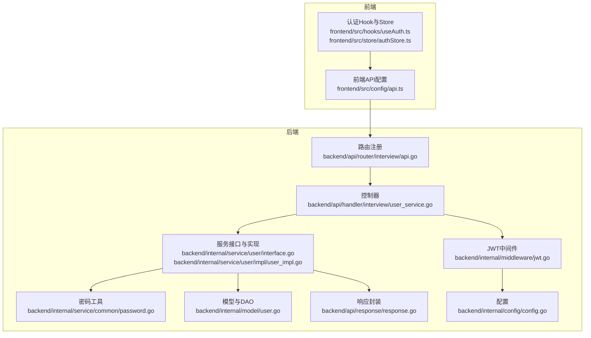
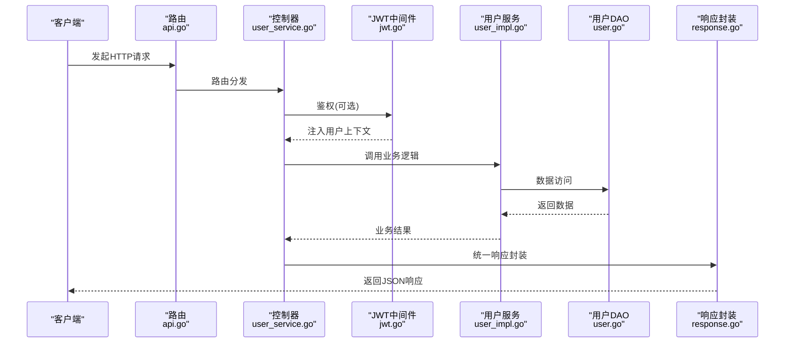
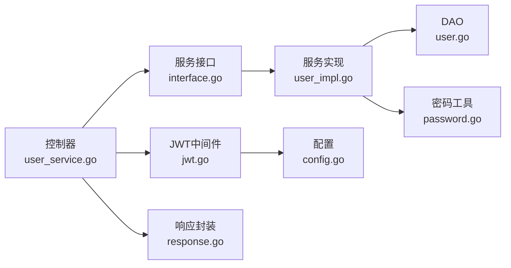

# 用户管理API

<cite>
**本文引用的文件**
- [backend/api/router/interview/api.go](file://backend/api/router/interview/api.go)
- [backend/api/handler/interview/user_service.go](file://backend/api/handler/interview/user_service.go)
- [backend/idl/user/user.thrift](file://backend/idl/user/user.thrift)
- [backend/internal/service/user/interface.go](file://backend/internal/service/user/interface.go)
- [backend/internal/service/user/impl/user_impl.go](file://backend/internal/service/user/impl/user_impl.go)
- [backend/internal/middleware/jwt.go](file://backend/internal/middleware/jwt.go)
- [backend/internal/service/common/password.go](file://backend/internal/service/common/password.go)
- [backend/internal/model/user.go](file://backend/internal/model/user.go)
- [backend/api/response/response.go](file://backend/api/response/response.go)
- [backend/internal/config/config.go](file://backend/internal/config/config.go)
- [backend/frontend/src/config/api.ts](file://backend/frontend/src/config/api.ts)
- [backend/frontend/src/hooks/useAuth.ts](file://backend/frontend/src/hooks/useAuth.ts)
- [backend/frontend/src/store/authStore.ts](file://backend/frontend/src/store/authStore.ts)
</cite>

## 目录
1. [简介](#简介)
2. [项目结构](#项目结构)
3. [核心组件](#核心组件)
4. [架构总览](#架构总览)
5. [详细接口文档](#详细接口文档)
6. [依赖关系分析](#依赖关系分析)
7. [性能与安全考量](#性能与安全考量)
8. [故障排查指南](#故障排查指南)
9. [结论](#结论)
10. [附录](#附录)

## 简介
本文件为“用户管理API”的完整接口文档，覆盖用户注册、登录、微信登录、用户信息查询与更新等核心能力。文档详细说明HTTP方法、URL模式、请求参数、响应格式、JWT认证机制、密码加密策略、权限控制、错误码与常见问题排查，并提供前后端集成示例与最佳实践。

## 项目结构
用户管理相关代码主要分布在以下层次：
- 路由层：基于IDL注解自动生成路由，统一挂载在 /api/user 下
- 控制器层：处理具体业务逻辑，绑定请求与响应
- 服务层：封装用户与模型管理接口
- 中间件层：JWT认证与用户上下文注入
- 模型与数据访问：用户表结构与DAO方法
- 响应层：统一封装业务响应与错误码

图表来源
- [backend/api/router/interview/api.go](file://backend/api/router/interview/api.go#L65-L101)
- [backend/api/handler/interview/user_service.go](file://backend/api/handler/interview/user_service.go#L212-L335)
- [backend/internal/service/user/interface.go](file://backend/internal/service/user/interface.go#L16-L63)
- [backend/internal/service/user/impl/user_impl.go](file://backend/internal/service/user/impl/user_impl.go#L34-L93)
- [backend/internal/middleware/jwt.go](file://backend/internal/middleware/jwt.go#L32-L78)
- [backend/internal/service/common/password.go](file://backend/internal/service/common/password.go#L7-L17)
- [backend/internal/model/user.go](file://backend/internal/model/user.go#L35-L115)
- [backend/api/response/response.go](file://backend/api/response/response.go#L20-L88)
- [backend/internal/config/config.go](file://backend/internal/config/config.go#L113-L118)

章节来源
- [backend/api/router/interview/api.go](file://backend/api/router/interview/api.go#L16-L103)
- [backend/api/handler/interview/user_service.go](file://backend/api/handler/interview/user_service.go#L1-L420)

## 核心组件
- 路由与控制器
  - 路由通过IDL注解自动注册，统一前缀 /api/user
  - 控制器负责参数绑定、鉴权校验、调用服务层并返回统一响应
- 服务层
  - UserManager：注册、登录、资料查询与更新、微信登录、忘记/重置密码
  - ModelManager：用户模型的增删改查与默认模型检查
- 中间件
  - JWT中间件：提取Authorization头中的Bearer Token，解析并注入用户上下文
  - 支持多种Token来源：Authorization、X-Auth-Token、Query参数、Cookie
- 数据与模型
  - 用户表含用户名、邮箱、密码哈希、角色、微信OpenID/UnionID等字段
  - DAO提供按用户名/邮箱/ID查询与更新
- 响应与错误
  - 统一响应结构，内置常用HTTP状态码映射
  - 内部错误可包装为业务错误码

章节来源
- [backend/api/router/interview/api.go](file://backend/api/router/interview/api.go#L65-L101)
- [backend/internal/service/user/interface.go](file://backend/internal/service/user/interface.go#L16-L63)
- [backend/internal/middleware/jwt.go](file://backend/internal/middleware/jwt.go#L32-L184)
- [backend/internal/model/user.go](file://backend/internal/model/user.go#L12-L115)
- [backend/api/response/response.go](file://backend/api/response/response.go#L13-L118)

## 架构总览
下图展示用户相关接口的端到端流程：前端发起请求 → 路由注册 → 控制器处理 → JWT中间件鉴权 → 服务层执行 → DAO持久化 → 统一响应返回。

图表来源
- [backend/api/router/interview/api.go](file://backend/api/router/interview/api.go#L65-L101)
- [backend/api/handler/interview/user_service.go](file://backend/api/handler/interview/user_service.go#L212-L335)
- [backend/internal/middleware/jwt.go](file://backend/internal/middleware/jwt.go#L32-L184)
- [backend/internal/service/user/impl/user_impl.go](file://backend/internal/service/user/impl/user_impl.go#L34-L93)
- [backend/internal/model/user.go](file://backend/internal/model/user.go#L35-L115)
- [backend/api/response/response.go](file://backend/api/response/response.go#L20-L88)

## 详细接口文档

### 通用约定
- 认证方式
  - 保护接口需携带Authorization头：Authorization: Bearer <token>
  - 支持回退：X-Auth-Token、?token、Cookie token
- 响应格式
  - 统一结构：code、message、data
  - HTTP状态码映射：200、400、401、403、404、500等
- 错误码
  - 业务错误码：见内部错误定义；通用错误码：400、401、403、404、500

章节来源
- [backend/internal/middleware/jwt.go](file://backend/internal/middleware/jwt.go#L32-L214)
- [backend/api/response/response.go](file://backend/api/response/response.go#L13-L118)

### 用户注册
- 方法与路径
  - POST /api/user/register
- 请求参数
  - username: 字符串，必填
  - email: 字符串，必填
  - password: 字符串，必填
- 响应数据
  - token: 字符串，JWT访问令牌
  - user: 用户资料对象
- 示例
  - 请求示例：POST /api/user/register，Body: { "username": "...", "email": "...", "password": "..." }
  - 成功响应示例：{ "code": 200, "message": "Success", "data": { "token": "...", "user": { "id": 123, "username": "...", "email": "...", "role": "user" } } }
- 错误
  - 400：请求参数无效
  - 500：服务器内部错误

章节来源
- [backend/api/router/interview/api.go](file://backend/api/router/interview/api.go#L69-L69)
- [backend/idl/user/user.thrift](file://backend/idl/user/user.thrift#L131-L136)
- [backend/api/handler/interview/user_service.go](file://backend/api/handler/interview/user_service.go#L212-L236)
- [backend/internal/service/user/impl/user_impl.go](file://backend/internal/service/user/impl/user_impl.go#L34-L65)

### 用户登录
- 方法与路径
  - POST /api/user/login
- 请求参数
  - email: 字符串，必填
  - password: 字符串，必填
- 响应数据
  - token: 字符串，JWT访问令牌
  - user: 用户资料对象
- 示例
  - 请求示例：POST /api/user/login，Body: { "email": "...", "password": "..." }
  - 成功响应示例：同注册成功响应
- 错误
  - 400：请求参数无效
  - 500：服务器内部错误

章节来源
- [backend/api/router/interview/api.go](file://backend/api/router/interview/api.go#L66-L66)
- [backend/idl/user/user.thrift](file://backend/idl/user/user.thrift#L138-L142)
- [backend/api/handler/interview/user_service.go](file://backend/api/handler/interview/user_service.go#L238-L262)
- [backend/internal/service/user/impl/user_impl.go](file://backend/internal/service/user/impl/user_impl.go#L67-L93)

### 获取用户资料
- 方法与路径
  - GET /api/user/profile
- 请求参数
  - 无
- 认证
  - 需要携带有效JWT令牌
- 响应数据
  - data: UserProfile
- 示例
  - 请求示例：GET /api/user/profile，Headers: Authorization: Bearer <token>
  - 成功响应示例：{ "code": 200, "message": "Success", "data": { "id": 123, "username": "...", "email": "...", "role": "user", "wechat_open_id": "...", "wechat_union_id": "...", "nickname": "...", "avatar": "...", "created_at": 1700000000000, "updated_at": 1700000000000 } }
- 错误
  - 401：未授权
  - 500：服务器内部错误

章节来源
- [backend/api/router/interview/api.go](file://backend/api/router/interview/api.go#L67-L67)
- [backend/idl/user/user.thrift](file://backend/idl/user/user.thrift#L164-L170)
- [backend/api/handler/interview/user_service.go](file://backend/api/handler/interview/user_service.go#L264-L292)
- [backend/internal/middleware/jwt.go](file://backend/internal/middleware/jwt.go#L136-L143)

### 更新用户资料
- 方法与路径
  - PUT /api/user/profile
- 请求参数
  - username: 字符串，可选
  - email: 字符串，可选
- 认证
  - 需要携带有效JWT令牌
- 响应数据
  - data: 更新后的UserProfile
- 示例
  - 请求示例：PUT /api/user/profile，Headers: Authorization: Bearer <token>，Body: { "username": "..." }
  - 成功响应示例：同获取资料成功响应
- 错误
  - 401：未授权
  - 500：服务器内部错误

章节来源
- [backend/api/router/interview/api.go](file://backend/api/router/interview/api.go#L68-L68)
- [backend/idl/user/user.thrift](file://backend/idl/user/user.thrift#L172-L181)
- [backend/api/handler/interview/user_service.go](file://backend/api/handler/interview/user_service.go#L294-L322)

### 微信登录二维码
- 方法与路径
  - GET /api/user/wechat/login
- 请求参数
  - 无
- 响应数据
  - login_url: 微信扫码登录链接
- 示例
  - 请求示例：GET /api/user/wechat/login
  - 成功响应示例：{ "code": 200, "message": "Success", "data": { "login_url": "https://open.weixin.qq.com/..." } }
- 错误
  - 500：服务器内部错误

章节来源
- [backend/api/router/interview/api.go](file://backend/api/router/interview/api.go#L97-L99)
- [backend/idl/user/user.thrift](file://backend/idl/user/user.thrift#L183-L186)
- [backend/api/handler/interview/user_service.go](file://backend/api/handler/interview/user_service.go#L337-L356)
- [backend/internal/service/user/impl/user_impl.go](file://backend/internal/service/user/impl/user_impl.go#L119-L129)

### 微信登录回调
- 方法与路径
  - GET /api/user/wechat/callback
- 请求参数
  - code: 字符串，必填
  - state: 字符串，可选
- 响应数据
  - token: JWT访问令牌
  - user: 用户资料对象
- 示例
  - 请求示例：GET /api/user/wechat/callback?code=...
  - 成功响应示例：同注册成功响应
- 错误
  - 500：服务器内部错误

章节来源
- [backend/api/router/interview/api.go](file://backend/api/router/interview/api.go#L98-L99)
- [backend/idl/user/user.thrift](file://backend/idl/user/user.thrift#L188-L192)
- [backend/api/handler/interview/user_service.go](file://backend/api/handler/interview/user_service.go#L358-L382)
- [backend/internal/service/user/impl/user_impl.go](file://backend/internal/service/user/impl/user_impl.go#L131-L157)

### 忘记密码
- 方法与路径
  - POST /api/user/password/forgot
- 请求参数
  - email: 字符串，必填
- 响应数据
  - 无
- 示例
  - 请求示例：POST /api/user/password/forgot，Body: { "email": "..." }
  - 成功响应示例：{ "code": 200, "message": "重置邮件已发送，请检查您的邮箱", "data": null }
- 错误
  - 500：服务器内部错误

章节来源
- [backend/api/router/interview/api.go](file://backend/api/router/interview/api.go#L92-L94)
- [backend/idl/user/user.thrift](file://backend/idl/user/user.thrift#L194-L197)
- [backend/api/handler/interview/user_service.go](file://backend/api/handler/interview/user_service.go#L44-L60)

### 重置密码
- 方法与路径
  - POST /api/user/password/reset
- 请求参数
  - token: 字符串，必填
  - password: 字符串，必填
  - confirm_password: 字符串，必填
- 响应数据
  - 无
- 示例
  - 请求示例：POST /api/user/password/reset，Body: { "token": "...", "password": "...", "confirm_password": "..." }
  - 成功响应示例：{ "code": 200, "message": "密码重置成功，请重新登录", "data": null }
- 错误
  - 500：服务器内部错误

章节来源
- [backend/api/router/interview/api.go](file://backend/api/router/interview/api.go#L93-L95)
- [backend/idl/user/user.thrift](file://backend/idl/user/user.thrift#L202-L210)
- [backend/api/handler/interview/user_service.go](file://backend/api/handler/interview/user_service.go#L62-L78)

### 用户模型管理（扩展）
- 创建用户模型
  - POST /api/user/create/model
  - 参数：name、model_key、protocol、base_url、api_key、provider_name、meta_id、default_params、config_json、scope、status、is_default
  - 响应：state
- 获取用户模型列表
  - GET /api/user/model/list
  - 查询参数：status、scope、protocol、provider_name、keyword、page、size
  - 响应：list、total、page、size
- 获取用户模型详情
  - GET /api/user/model/details/:id
  - 响应：UserModelDetail
- 更新用户模型
  - PUT /api/user/model/update/:id
  - 参数：同创建（api_key可选）
  - 响应：空
- 删除用户模型
  - DELETE /api/user/model/delete/:id
  - 响应：空
- 检查默认模型配置
  - GET /api/user/model/check
  - 响应：configured

章节来源
- [backend/api/router/interview/api.go](file://backend/api/router/interview/api.go#L71-L90)
- [backend/idl/user/user.thrift](file://backend/idl/user/user.thrift#L5-L121)
- [backend/api/handler/interview/user_service.go](file://backend/api/handler/interview/user_service.go#L18-L210)

## 依赖关系分析
- 控制器到服务层
  - 控制器通过NewUserManager()/NewModelManager()获取服务实例，调用对应接口
- 服务层到数据层
  - 用户服务使用UserDao完成CRUD；模型管理通过UserModel实体交互
- 中间件到配置
  - JWT中间件从全局配置读取JWT密钥与过期时间
- 响应层
  - 统一错误码映射与HTTP状态码转换

图表来源
- [backend/api/handler/interview/user_service.go](file://backend/api/handler/interview/user_service.go#L18-L420)
- [backend/internal/service/user/interface.go](file://backend/internal/service/user/interface.go#L16-L63)
- [backend/internal/service/user/impl/user_impl.go](file://backend/internal/service/user/impl/user_impl.go#L34-L365)
- [backend/internal/model/user.go](file://backend/internal/model/user.go#L35-L115)
- [backend/internal/service/common/password.go](file://backend/internal/service/common/password.go#L7-L17)
- [backend/internal/middleware/jwt.go](file://backend/internal/middleware/jwt.go#L80-L113)
- [backend/internal/config/config.go](file://backend/internal/config/config.go#L113-L118)
- [backend/api/response/response.go](file://backend/api/response/response.go#L20-L88)

章节来源
- [backend/internal/service/user/interface.go](file://backend/internal/service/user/interface.go#L11-L19)
- [backend/internal/service/user/impl/user_impl.go](file://backend/internal/service/user/impl/user_impl.go#L22-L32)
- [backend/internal/middleware/jwt.go](file://backend/internal/middleware/jwt.go#L80-L113)

## 性能与安全考量
- JWT配置
  - 密钥与过期时间来自配置文件，建议生产环境使用强密钥与合理过期时间
- 密码安全
  - 使用bcrypt进行密码哈希；登录时兼容明文降级并自动升级为哈希
- 请求限流与防护
  - 建议在网关或中间件层增加速率限制与防爆破策略
- 传输安全
  - 建议仅在HTTPS环境下暴露接口，避免令牌泄露
- 会话处理
  - JWT为无状态令牌，无需服务端存储；如需强制失效可引入黑名单或缩短过期时间

章节来源
- [backend/internal/config/config.go](file://backend/internal/config/config.go#L113-L118)
- [backend/internal/service/common/password.go](file://backend/internal/service/common/password.go#L7-L17)
- [backend/internal/middleware/jwt.go](file://backend/internal/middleware/jwt.go#L80-L113)

## 故障排查指南
- 401 未授权
  - 检查Authorization头格式是否为Bearer <token>
  - 确认Token未过期、密钥正确
- 400 参数错误
  - 核对请求体字段类型与必填项
- 500 服务器错误
  - 查看服务日志定位具体异常；必要时开启更详细的错误追踪
- 微信登录失败
  - 确认回调参数code有效；检查微信AppID/AppSecret与回调地址配置

章节来源
- [backend/api/response/response.go](file://backend/api/response/response.go#L55-L78)
- [backend/internal/middleware/jwt.go](file://backend/internal/middleware/jwt.go#L186-L214)
- [backend/internal/service/user/impl/user_impl.go](file://backend/internal/service/user/impl/user_impl.go#L200-L277)

## 结论
本文档梳理了用户管理模块的完整API接口与实现要点，明确了认证、授权、数据流转与错误处理机制。建议在生产环境中强化安全配置与监控告警，并结合前端状态管理实现良好的用户体验。

## 附录

### 前端集成示例与最佳实践
- 基础配置
  - 使用API_BASE_URL拼接后端接口地址
  - 在请求头中携带Authorization: Bearer <token>
- 用户认证
  - 登录成功后保存token与用户信息
  - 页面切换时根据token有效性控制访问
- 最佳实践
  - 使用Zustand/Pinia等状态库集中管理认证状态
  - 在拦截器中统一注入Authorization头
  - 对敏感操作二次确认与二次校验

章节来源
- [backend/frontend/src/config/api.ts](file://backend/frontend/src/config/api.ts#L1-L23)
- [backend/frontend/src/hooks/useAuth.ts](file://backend/frontend/src/hooks/useAuth.ts#L1-L16)
- [backend/frontend/src/store/authStore.ts](file://backend/frontend/src/store/authStore.ts#L1-L31)