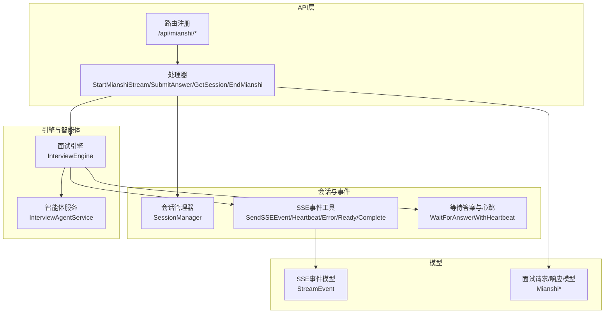
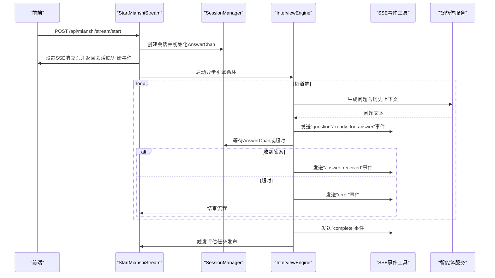
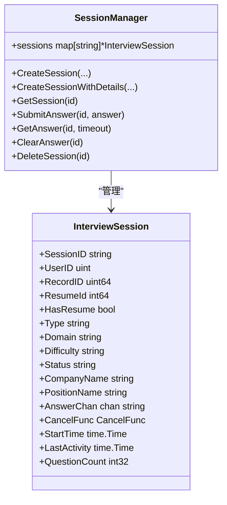
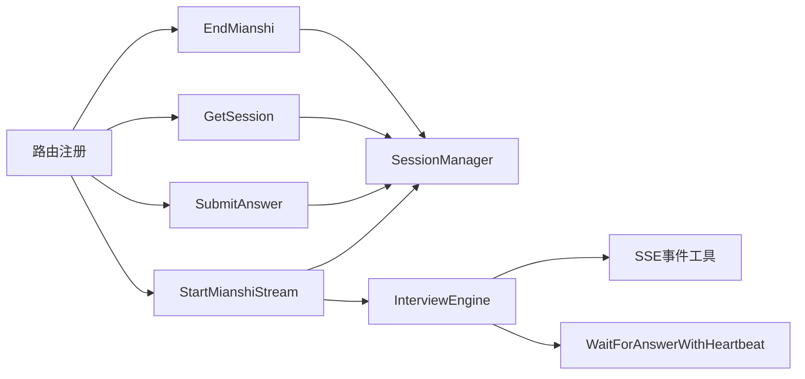

# 面试引擎API

<cite>
**本文引用的文件**
- [backend/api/handler/interview/mianshi/engine.go](file://backend/api/handler/interview/mianshi/engine.go)
- [backend/api/handler/interview/mianshi/types.go](file://backend/api/handler/interview/mianshi/types.go)
- [backend/api/handler/interview/mianshi/events.go](file://backend/api/handler/interview/mianshi/events.go)
- [backend/api/handler/interview/mianshi/utils.go](file://backend/api/handler/interview/mianshi/utils.go)
- [backend/api/handler/interview/mianshi/errors.go](file://backend/api/handler/interview/mianshi/errors.go)
- [backend/api/handler/interview/mianshi_service.go](file://backend/api/handler/interview/mianshi_service.go)
- [backend/api/router/interview/api.go](file://backend/api/router/interview/api.go)
- [backend/api/model/mianshi/mianshi.go](file://backend/api/model/mianshi/mianshi.go)
- [backend/api/model/interviews/interviews.go](file://backend/api/model/interviews/interviews.go)
- [backend/api/handler/interview/interviews_service.go](file://backend/api/handler/interview/interviews_service.go)
</cite>

## 目录
1. [简介](#简介)
2. [项目结构](#项目结构)
3. [核心组件](#核心组件)
4. [架构总览](#架构总览)
5. [详细组件分析](#详细组件分析)
6. [依赖关系分析](#依赖关系分析)
7. [性能考量](#性能考量)
8. [故障排查指南](#故障排查指南)
9. [结论](#结论)
10. [附录](#附录)

## 简介
本文件面向面试引擎模块的完整API接口文档，覆盖面试启动、面试对话、实时SSE流和面试结束等接口的HTTP方法、URL模式、请求参数与响应格式；同时阐述面试会话管理、实时消息推送与面试状态控制，提供SSE连接示例、消息格式说明与错误处理机制，并解释面试引擎架构、会话生命周期与并发控制策略，最后给出面试体验优化与性能监控的最佳实践。

## 项目结构
面试引擎相关代码主要位于后端API层与聊天应用层：
- API处理器与路由：负责HTTP接口与SSE流式推送
- 会话管理与事件：负责会话状态、SSE事件格式与心跳保活
- 引擎与智能体：驱动面试流程、生成问题与上下文管理
- 模型定义：Thrift生成的数据结构，用于SSE事件与请求/响应

图表来源
- [backend/api/router/interview/api.go](file://backend/api/router/interview/api.go#L17-L47)
- [backend/api/handler/interview/mianshi_service.go](file://backend/api/handler/interview/mianshi_service.go#L25-L117)
- [backend/api/handler/interview/mianshi/types.go](file://backend/api/handler/interview/mianshi/types.go#L9-L50)
- [backend/api/handler/interview/mianshi/events.go](file://backend/api/handler/interview/mianshi/events.go#L11-L71)
- [backend/api/handler/interview/mianshi/engine.go](file://backend/api/handler/interview/mianshi/engine.go#L23-L37)
- [backend/api/model/mianshi/mianshi.go](file://backend/api/model/mianshi/mianshi.go#L12-L24)

章节来源
- [backend/api/router/interview/api.go](file://backend/api/router/interview/api.go#L17-L47)
- [backend/api/handler/interview/mianshi_service.go](file://backend/api/handler/interview/mianshi_service.go#L25-L117)

## 核心组件
- 会话管理器（SessionManager）：以内存方式维护会话状态，使用带缓冲通道实现“引擎等待—用户提交”的同步。
- 面试引擎（InterviewEngine）：驱动面试循环，按序生成问题、维护上下文、等待回答、发送SSE事件、保存对话记录。
- SSE事件工具：封装标准SSE事件格式，支持错误、完成、就绪、心跳与消息事件。
- 等待与心跳工具：在等待用户回答期间周期性发送心跳，防止连接空闲断开。
- 处理器（StartMianshiStream/SubmitAnswer/GetSession/EndMianshi）：建立SSE连接、提交答案、查询会话、结束面试并更新记录。

章节来源
- [backend/api/handler/interview/mianshi/types.go](file://backend/api/handler/interview/mianshi/types.go#L9-L165)
- [backend/api/handler/interview/mianshi/engine.go](file://backend/api/handler/interview/mianshi/engine.go#L23-L291)
- [backend/api/handler/interview/mianshi/events.go](file://backend/api/handler/interview/mianshi/events.go#L11-L72)
- [backend/api/handler/interview/mianshi/utils.go](file://backend/api/handler/interview/mianshi/utils.go#L11-L74)
- [backend/api/handler/interview/mianshi_service.go](file://backend/api/handler/interview/mianshi_service.go#L25-L300)

## 架构总览
面试引擎采用“SSE流式推送 + 会话管理 + 引擎循环”的架构：
- 启动面试：建立SSE连接，发送会话ID与开始事件，随后异步运行引擎循环。
- 引擎循环：逐题生成问题、发送SSE“问题”事件、等待用户回答、发送进度事件、保存对话。
- 提交答案：通过独立的POST接口提交，不参与SSE流。
- 结束面试：更新记录状态与耗时，触发评估任务发布，清理会话。

图表来源
- [backend/api/handler/interview/mianshi_service.go](file://backend/api/handler/interview/mianshi_service.go#L25-L117)
- [backend/api/handler/interview/mianshi/engine.go](file://backend/api/handler/interview/mianshi/engine.go#L39-L230)
- [backend/api/handler/interview/mianshi/events.go](file://backend/api/handler/interview/mianshi/events.go#L11-L71)
- [backend/api/handler/interview/mianshi/utils.go](file://backend/api/handler/interview/mianshi/utils.go#L11-L56)

## 详细组件分析

### 1) 路由与接口清单
- 启动面试（SSE）
  - 方法：POST
  - URL：/api/mianshi/stream/start
  - 请求体：MianshiStartInterviewRequest
  - 响应：SSE流，事件类型包括session_id、start、question、ready_for_answer、heartbeat、answer_received、complete、error
- 提交答案
  - 方法：POST
  - URL：/api/mianshi/answer/submit
  - 请求体：MianshiSubmitInterviewAnswerRequest
  - 响应：MianshiSubmitInterviewAnswerResponse
- 查询会话
  - 方法：GET
  - URL：/api/mianshi/session/info
  - 请求体：MianshiGetSessionRequest
  - 响应：MianshiGetSessionResponse
- 结束面试
  - 方法：POST
  - URL：/api/mianshi/interview/end
  - 请求体：MianshiEndInterviewRequest
  - 响应：MianshiEndInterviewResponse

章节来源
- [backend/api/router/interview/api.go](file://backend/api/router/interview/api.go#L27-L46)
- [backend/api/handler/interview/mianshi_service.go](file://backend/api/handler/interview/mianshi_service.go#L25-L300)
- [backend/api/model/mianshi/mianshi.go](file://backend/api/model/mianshi/mianshi.go#L12-L24)

### 2) 启动面试（SSE）
- 功能：创建面试记录与会话，设置SSE响应头，返回会话ID与开始事件，异步运行引擎循环。
- 关键行为：
  - 创建会话并初始化AnswerChan
  - 设置SSE响应头（Content-Type: text/event-stream; Cache-Control: no-cache; Connection: keep-alive; Access-Control-Allow-*）
  - 发送session_id与start事件
  - 启动异步引擎循环，逐题生成问题并推送SSE事件
- 请求参数（MianshiStartInterviewRequest）
  - Type：面试类型（综合面试/专项面试）
  - Domain：领域（Go/Java/MQ/MySQL/Redis）
  - Difficulty：难度（校招/社招）
  - PositionName/CompanyName：可选，岗位与公司名称
  - ResumeID：可选，简历ID（>0时视为有简历）
- 响应事件（SSE）
  - session_id：包含session_id、record_id、message、start_time
  - start：message为“面试已开始，正在生成第一个问题...”
  - question：包含index、total、data.question_text
  - ready_for_answer：包含message、question_index、session_id
  - answer_received：包含index、total、progress（百分比）
  - heartbeat：保活事件
  - error：错误事件
  - complete：面试结束事件

章节来源
- [backend/api/handler/interview/mianshi_service.go](file://backend/api/handler/interview/mianshi_service.go#L25-L117)
- [backend/api/handler/interview/mianshi/utils.go](file://backend/api/handler/interview/mianshi/utils.go#L58-L74)
- [backend/api/handler/interview/mianshi/events.go](file://backend/api/handler/interview/mianshi/events.go#L11-L72)
- [backend/api/model/mianshi/mianshi.go](file://backend/api/model/mianshi/mianshi.go#L12-L24)

### 3) 提交答案
- 功能：提交用户答案或特殊动作（quit/continue），并返回状态与当前问题索引。
- 请求参数（MianshiSubmitInterviewAnswerRequest）
  - SessionID：必填
  - Answer：答案内容
  - Action：可选，quit/continue
- 响应（MianshiSubmitInterviewAnswerResponse）
  - Status：received
  - Message：答案内容
  - SessionID：会话ID
  - QuestionIndex：当前问题索引
  - IsLastQuestion：是否为最后一个问题（由引擎在完成时设置）

章节来源
- [backend/api/handler/interview/mianshi_service.go](file://backend/api/handler/interview/mianshi_service.go#L119-L168)
- [backend/api/model/mianshi/mianshi.go](file://backend/api/model/mianshi/mianshi.go#L12-L24)

### 4) 查询会话
- 功能：获取会话信息与统计指标（当前问题索引、已回答数量、总数量、持续时间等）。
- 请求参数（MianshiGetSessionRequest）
  - SessionID：必填
- 响应（MianshiGetSessionResponse）
  - Session：InterviewSession（包含SessionID、UserID、RecordID、Type、Domain、Difficulty、ResumeID、HasResume、StartTime、Status）
  - CurrentQuestionIndex/AnsweredCount/TotalCount/ElapsedTime：统计信息

章节来源
- [backend/api/handler/interview/mianshi_service.go](file://backend/api/handler/interview/mianshi_service.go#L170-L230)
- [backend/api/model/mianshi/mianshi.go](file://backend/api/model/mianshi/mianshi.go#L12-L24)

### 5) 结束面试
- 功能：结束面试，更新记录状态与耗时，触发评估任务发布，延迟删除会话。
- 请求参数（MianshiEndInterviewRequest）
  - SessionID：必填
- 响应（MianshiEndInterviewResponse）
  - Status：success
  - Message：成功消息
  - Duration/EndTime/TotalQuestions/AnsweredQuestions：统计信息

章节来源
- [backend/api/handler/interview/mianshi_service.go](file://backend/api/handler/interview/mianshi_service.go#L232-L300)

### 6) 会话管理与生命周期
- 会话创建：CreateSession/CreateSessionWithDetails，初始化AnswerChan、StartTime、LastActivity等。
- 会话状态：active/paused/completed/failed（EndMianshi设置为completed）。
- 答案提交：SubmitAnswer将答案写入AnswerChan；GetAnswer阻塞等待或超时。
- 答案通道清理：ClearAnswer清空通道，避免旧答案影响后续问题。
- 会话删除：EndMianshi完成后延迟删除，避免SSE连接被立即中断。

图表来源
- [backend/api/handler/interview/mianshi/types.go](file://backend/api/handler/interview/mianshi/types.go#L9-L165)

章节来源
- [backend/api/handler/interview/mianshi/types.go](file://backend/api/handler/interview/mianshi/types.go#L52-L149)

### 7) 实时SSE事件与消息格式
- 事件类型：session_id、start、question、ready_for_answer、heartbeat、answer_received、complete、error
- 事件数据结构（StreamEvent）
  - type：事件类型
  - session_id：会话ID
  - message：消息内容
  - data：事件数据（如question_text）
  - timestamp：毫秒级时间戳
- 心跳保活：WaitForAnswerWithHeartbeat周期发送heartbeat事件，防止连接空闲断开。
- 错误处理：SendErrorEvent发送错误事件；超时或异常时终止流程。

章节来源
- [backend/api/handler/interview/mianshi/events.go](file://backend/api/handler/interview/mianshi/events.go#L11-L72)
- [backend/api/handler/interview/mianshi/utils.go](file://backend/api/handler/interview/mianshi/utils.go#L11-L56)
- [backend/api/model/mianshi/mianshi.go](file://backend/api/model/mianshi/mianshi.go#L12-L24)

### 8) 面试引擎与智能体
- 引擎循环：RunInterviewLoop按序生成问题，维护最近5道题的历史上下文，最多20题；等待用户回答并发送进度事件；保存所有对话至数据库；结束后发布评估与主题评估消息。
- 智能体类型选择：selectAgentType根据Type/Domain选择不同智能体（综合/专项）。
- 上下文控制：历史上下文大小为5，避免Token溢出；根据用户回答动态调整问题难度与方向。

章节来源
- [backend/api/handler/interview/mianshi/engine.go](file://backend/api/handler/interview/mianshi/engine.go#L39-L230)

## 依赖关系分析
- 路由注册：/api/mianshi/* 由router/interview/api.go集中注册。
- 处理器依赖：StartMianshiStream依赖SessionManager、InterviewEngine、SSE事件工具；SubmitAnswer/GetSession/EndMianshi分别依赖会话管理与面试记录服务。
- 引擎依赖：InterviewEngine依赖智能体服务与会话管理；使用WaitForAnswerWithHeartbeat进行等待与保活。
- 模型依赖：SSE事件与请求/响应模型由Thrift生成，保证前后端一致。

图表来源
- [backend/api/router/interview/api.go](file://backend/api/router/interview/api.go#L17-L47)
- [backend/api/handler/interview/mianshi_service.go](file://backend/api/handler/interview/mianshi_service.go#L25-L300)
- [backend/api/handler/interview/mianshi/engine.go](file://backend/api/handler/interview/mianshi/engine.go#L23-L37)
- [backend/api/handler/interview/mianshi/utils.go](file://backend/api/handler/interview/mianshi/utils.go#L11-L56)
- [backend/api/handler/interview/mianshi/events.go](file://backend/api/handler/interview/mianshi/events.go#L11-L71)

章节来源
- [backend/api/router/interview/api.go](file://backend/api/router/interview/api.go#L17-L47)
- [backend/api/handler/interview/mianshi_service.go](file://backend/api/handler/interview/mianshi_service.go#L25-L300)

## 性能考量
- SSE连接优化
  - 使用io.Pipe建立流式响应，避免一次性缓冲大量数据
  - 设置X-Accel-Buffering: no与Transfer-Encoding: chunked，确保实时推送
  - 合理的心跳间隔（15秒）与超时（30分钟），平衡保活与资源占用
- 会话并发控制
  - 使用带缓冲通道（容量1）避免堆积；ClearAnswer在新问题前清空，防止旧答案干扰
  - 全局SessionManager使用互斥锁保护并发访问
- 上下文与Token控制
  - 历史上下文固定为5条，避免Prompt过长导致性能下降
- 数据持久化
  - 逐条保存对话，批量写入时可考虑分批或事务优化
- 评估任务
  - 结束面试后异步发布评估与主题评估消息，避免阻塞SSE主流程

[本节为通用性能建议，无需特定文件引用]

## 故障排查指南
- 常见错误与处理
  - 会话未找到：SubmitAnswer/GetSession/EndMianshi在找不到会话时返回404
  - 未授权：缺少或无效的Authorization，返回401
  - 请求参数无效：BindAndValidate失败返回400
  - 超时：WaitForAnswerWithHeartbeat超时发送error事件并结束流程
- 日志与可观测性
  - 引擎与处理器均输出详细日志，便于定位问题
  - SSE事件包含session_id与question_index，便于前端与后端联动排查
- 前端SSE连接
  - 确认SSE响应头正确设置
  - 前端需正确解析“data: ...”块，支持event与data两种格式
  - 若出现404，请检查路由注册与路径是否匹配

章节来源
- [backend/api/handler/interview/mianshi/errors.go](file://backend/api/handler/interview/mianshi/errors.go#L5-L12)
- [backend/api/handler/interview/mianshi_service.go](file://backend/api/handler/interview/mianshi_service.go#L25-L300)
- [backend/api/handler/interview/mianshi/utils.go](file://backend/api/handler/interview/mianshi/utils.go#L11-L56)

## 结论
面试引擎API通过SSE实现实时流式交互，结合会话管理与智能体服务，实现了“提问—等待回答—追问/下一题”的闭环流程。其设计强调：
- 会话状态的内存管理与通道同步
- SSE事件的标准化与保活机制
- 上下文控制与超时处理
- 结束后的评估任务发布与会话清理
在实际部署中，建议关注SSE连接稳定性、会话并发与上下文长度控制，并配合前端做好错误与超时处理，以获得流畅的面试体验。

[本节为总结性内容，无需特定文件引用]

## 附录

### A. SSE事件类型与数据结构
- session_id：包含session_id、record_id、message、start_time
- start：message为“面试已开始，正在生成第一个问题...”
- question：包含index、total、data.question_text
- ready_for_answer：包含message、question_index、session_id
- answer_received：包含index、total、progress（百分比）
- heartbeat：保活事件
- error：错误事件
- complete：面试结束事件

章节来源
- [backend/api/handler/interview/mianshi/events.go](file://backend/api/handler/interview/mianshi/events.go#L11-L72)
- [backend/api/model/mianshi/mianshi.go](file://backend/api/model/mianshi/mianshi.go#L12-L24)

### B. 会话生命周期与并发控制
- 生命周期：创建（active）→ 逐题生成与等待（active）→ 完成（completed）
- 并发控制：互斥锁保护会话表；AnswerChan容量1避免堆积；ClearAnswer清空通道
- 超时与保活：30分钟回答超时；15秒心跳保活

章节来源
- [backend/api/handler/interview/mianshi/types.go](file://backend/api/handler/interview/mianshi/types.go#L52-L149)
- [backend/api/handler/interview/mianshi/utils.go](file://backend/api/handler/interview/mianshi/utils.go#L11-L56)

### C. 面试记录与简历相关接口（扩展）
- 列举面试记录：/api/interview/records（GET）
- 上传简历：/api/resume/upload（POST）
- 获取简历详情：/api/resume/:resume_id（GET）
- 获取简历列表：/api/resume/list（GET）
- 设置默认简历：/api/resume/set-default（POST）
- 删除简历：/api/resume/:resume_id（DELETE）

章节来源
- [backend/api/handler/interview/interviews_service.go](file://backend/api/handler/interview/interviews_service.go#L26-L200)
- [backend/api/model/interviews/interviews.go](file://backend/api/model/interviews/interviews.go#L11-L200)