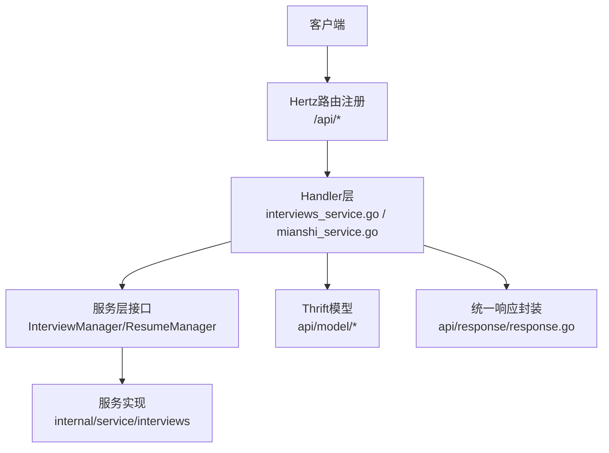
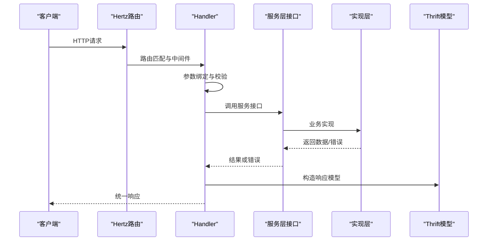
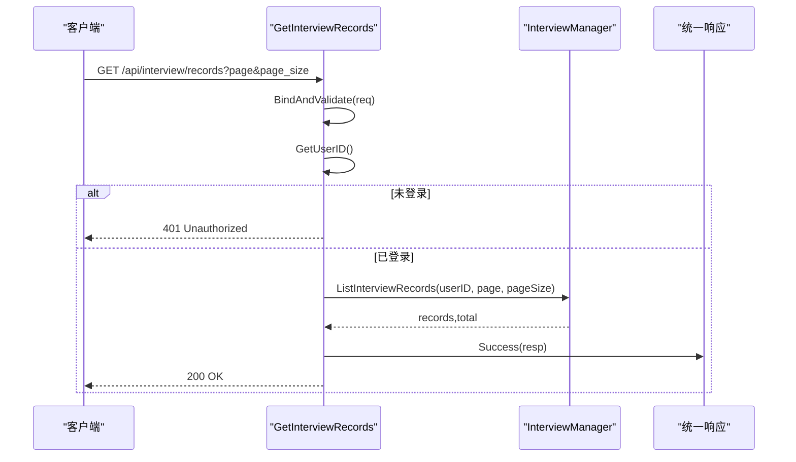
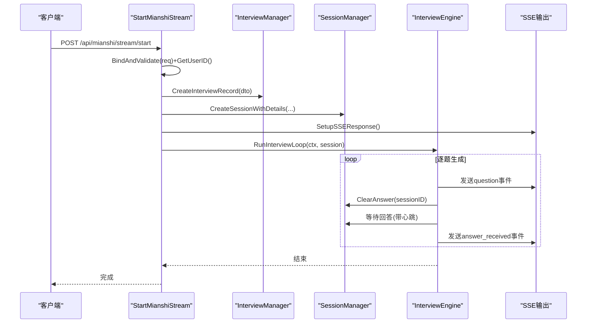
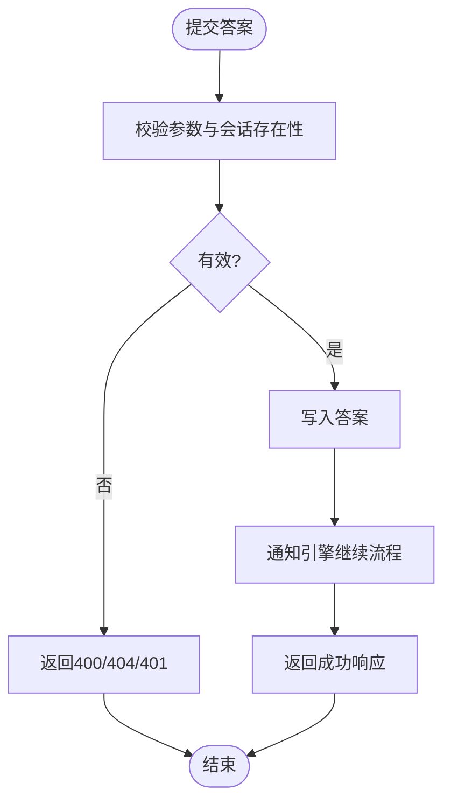
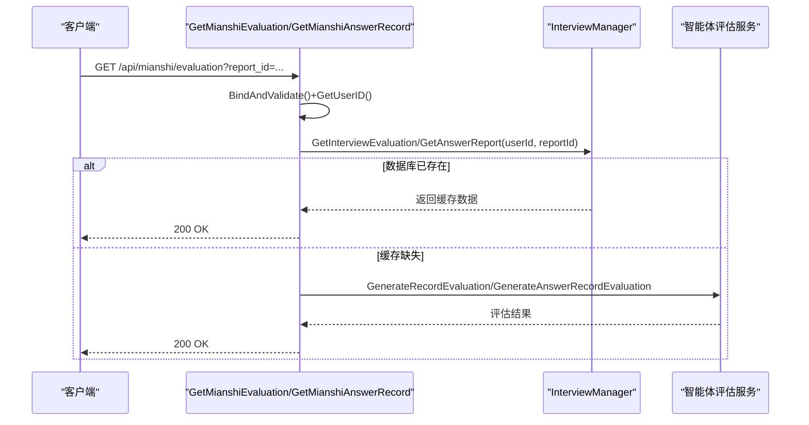
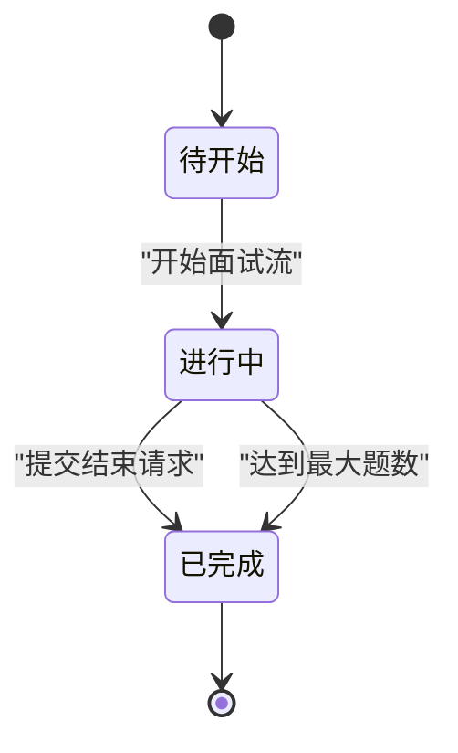
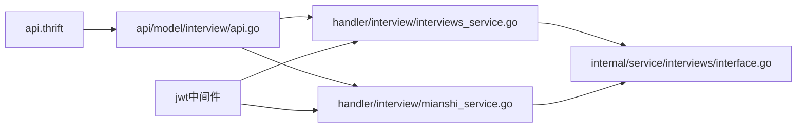

# 面试管理API

<cite>
**本文档引用的文件**
- [backend/api/router/interview/api.go](file://backend/api/router/interview/api.go)
- [backend/api/router/register.go](file://backend/api/router/register.go)
- [backend/api/handler/interview/interviews_service.go](file://backend/api/handler/interview/interviews_service.go)
- [backend/api/handler/interview/mianshi_service.go](file://backend/api/handler/interview/mianshi_service.go)
- [backend/api/handler/interview/mianshi/engine.go](file://backend/api/handler/interview/mianshi/engine.go)
- [backend/api/model/interviews/interviews.go](file://backend/api/model/interviews/interviews.go)
- [backend/api/model/mianshi/mianshi.go](file://backend/api/model/mianshi/mianshi.go)
- [backend/api/model/interview/api.go](file://backend/api/model/interview/api.go)
- [backend/idl/api.thrift](file://backend/idl/api.thrift)
- [backend/idl/interviews/interviews.thrift](file://backend/idl/interviews/interviews.thrift)
- [backend/idl/mianshi/mianshi.thrift](file://backend/idl/mianshi/mianshi.thrift)
- [backend/internal/service/interviews/interface.go](file://backend/internal/service/interviews/interface.go)
- [backend/api/router/interview/middleware.go](file://backend/api/router/interview/middleware.go)
- [backend/internal/middleware/jwt.go](file://backend/internal/middleware/jwt.go)
- [backend/api/response/response.go](file://backend/api/response/response.go)
</cite>

## 目录
1. [简介](#简介)
2. [项目结构](#项目结构)
3. [核心组件](#核心组件)
4. [架构总览](#架构总览)
5. [详细组件分析](#详细组件分析)
6. [依赖关系分析](#依赖关系分析)
7. [性能考虑](#性能考虑)
8. [故障排除指南](#故障排除指南)
9. [结论](#结论)

## 简介
本文件为面试管理模块的完整API接口文档，覆盖面试记录查询、面试历史管理、面试统计、面试状态跟踪、面试结果获取、面试评价查询、面试流程集成与数据同步等能力。文档基于后端Hertz路由注册、ThriftIDL定义与Handler实现，提供HTTP方法、URL模式、请求参数、响应格式、分页处理、权限控制与最佳实践说明。

## 项目结构
面试管理API采用Hertz框架与ThriftIDL驱动的路由注册机制：
- 路由层：通过IDL生成路由注册函数，集中注册/api/interview、/api/mianshi、/api/resume、/api/user等子域
- 处理层：各模块Handler负责参数绑定、鉴权、调用服务层、统一响应封装
- 服务层：InterviewManager/ResumeManager接口定义业务能力，具体实现位于internal/service/interviews
- 数据模型：ThriftIDL定义请求/响应结构体，确保前后端契约一致

**图表来源**
- [backend/api/router/interview/api.go](file://backend/api/router/interview/api.go#L17-L103)
- [backend/api/router/register.go](file://backend/api/router/register.go#L12-L15)
- [backend/api/handler/interview/interviews_service.go](file://backend/api/handler/interview/interviews_service.go#L26-L53)
- [backend/api/handler/interview/mianshi_service.go](file://backend/api/handler/interview/mianshi_service.go#L25-L117)
- [backend/api/response/response.go](file://backend/api/response/response.go#L29-L39)

**章节来源**
- [backend/api/router/interview/api.go](file://backend/api/router/interview/api.go#L17-L103)
- [backend/api/router/register.go](file://backend/api/router/register.go#L12-L15)

## 核心组件
- 路由注册：集中注册面试、简历、用户、预测等模块的REST接口
- Handler：实现具体业务逻辑，包括鉴权、参数校验、调用服务层、统一响应
- 服务接口：InterviewManager/ResumeManager抽象出面试记录、简历管理等能力
- Thrift模型：定义消息、事件、记录、评估等数据结构
- 中间件：JWT鉴权与路由白名单配置
- 统一响应：标准化成功/错误响应格式

**章节来源**
- [backend/api/handler/interview/interviews_service.go](file://backend/api/handler/interview/interviews_service.go#L26-L53)
- [backend/api/handler/interview/mianshi_service.go](file://backend/api/handler/interview/mianshi_service.go#L25-L117)
- [backend/internal/service/interviews/interface.go](file://backend/internal/service/interviews/interface.go#L20-L63)
- [backend/api/model/interviews/interviews.go](file://backend/api/model/interviews/interviews.go#L11-L120)
- [backend/api/model/mianshi/mianshi.go](file://backend/api/model/mianshi/mianshi.go#L11-L50)
- [backend/api/router/interview/middleware.go](file://backend/api/router/interview/middleware.go#L13-L36)
- [backend/internal/middleware/jwt.go](file://backend/internal/middleware/jwt.go#L32-L78)
- [backend/api/response/response.go](file://backend/api/response/response.go#L13-L27)

## 架构总览
面试管理API围绕“路由 -> Handler -> 服务层 -> 模型”的分层架构组织，结合ThriftIDL确保跨语言一致性，并通过JWT中间件保障接口安全。

**图表来源**
- [backend/api/router/interview/api.go](file://backend/api/router/interview/api.go#L17-L103)
- [backend/api/handler/interview/interviews_service.go](file://backend/api/handler/interview/interviews_service.go#L26-L53)
- [backend/api/handler/interview/mianshi_service.go](file://backend/api/handler/interview/mianshi_service.go#L25-L117)
- [backend/internal/service/interviews/interface.go](file://backend/internal/service/interviews/interface.go#L20-L63)
- [backend/api/response/response.go](file://backend/api/response/response.go#L29-L39)

## 详细组件分析

### 面试记录查询
- 接口：GET /api/interview/records
- 功能：分页查询当前用户的所有面试记录
- 鉴权：需要JWT令牌
- 请求参数：
  - query.page: 页码，默认1
  - query.page_size: 每页数量，默认10
- 响应数据：
  - records: 面试记录数组（InterviewRecordDTO）
  - total: 总条数
  - page: 当前页
  - page_size: 每页数量
- 分页处理：Handler中对page/page_size进行默认值处理与校验
- 权限控制：通过中间件提取用户ID，未登录返回401

**图表来源**
- [backend/api/handler/interview/interviews_service.go](file://backend/api/handler/interview/interviews_service.go#L26-L53)
- [backend/internal/middleware/jwt.go](file://backend/internal/middleware/jwt.go#L136-L143)
- [backend/api/response/response.go](file://backend/api/response/response.go#L29-L39)

**章节来源**
- [backend/api/handler/interview/interviews_service.go](file://backend/api/handler/interview/interviews_service.go#L26-L53)
- [backend/idl/interviews/interviews.thrift](file://backend/idl/interviews/interviews.thrift#L72-L84)

### 面试历史管理
- 接口：GET /api/mianshi/records
- 功能：获取面试会话记录（当前实现返回空响应占位）
- 鉴权：需要JWT令牌
- 请求参数：无
- 响应数据：空对象（占位，后续扩展）

**章节来源**
- [backend/api/handler/interview/mianshi_service.go](file://backend/api/handler/interview/mianshi_service.go#L394-L408)
- [backend/idl/mianshi/mianshi.thrift](file://backend/idl/mianshi/mianshi.thrift#L125-L147)

### 面试状态跟踪与实时流程
- 接口：POST /api/mianshi/stream/start
- 功能：启动SSE面试流，创建面试记录并建立会话
- 鉴权：需要JWT令牌
- 请求参数（body）：
  - type: 面试类型（综合/专项）
  - domain: 面试领域
  - difficulty: 难度（简单/中等/困难）
  - company_name: 公司名称（可选）
  - position_name: 岗位名称（可选）
  - resume_id: 简历ID（可选）
  - metadata: 扩展参数（可选）
- 响应：SSE流推送事件（session_id、start、question、ready_for_answer、heartbeat、topic_complete、error、complete）
- 会话管理：创建Session并维护超时、心跳、问题计数
- 结束条件：最多20题，或显式结束

**图表来源**
- [backend/api/handler/interview/mianshi_service.go](file://backend/api/handler/interview/mianshi_service.go#L25-L117)
- [backend/api/handler/interview/mianshi/engine.go](file://backend/api/handler/interview/mianshi/engine.go#L39-L200)
- [backend/api/model/mianshi/mianshi.go](file://backend/api/model/mianshi/mianshi.go#L11-L50)

**章节来源**
- [backend/api/handler/interview/mianshi_service.go](file://backend/api/handler/interview/mianshi_service.go#L25-L117)
- [backend/api/handler/interview/mianshi/engine.go](file://backend/api/handler/interview/mianshi/engine.go#L39-L200)
- [backend/idl/mianshi/mianshi.thrift](file://backend/idl/mianshi/mianshi.thrift#L53-L71)

### 提交面试答案与会话信息
- 提交答案接口：POST /api/mianshi/answer/submit
  - 请求参数：session_id、answer、action（answer/continue/quit）、metadata
  - 响应：status、message、session_id、question_index、is_last_question
- 获取会话信息接口：GET /api/mianshi/session/info
  - 请求参数：query.session_id
  - 响应：会话信息（InterviewSession）与统计（当前题号、已答数、总数、耗时）

**图表来源**
- [backend/api/handler/interview/mianshi_service.go](file://backend/api/handler/interview/mianshi_service.go#L119-L168)
- [backend/api/handler/interview/mianshi_service.go](file://backend/api/handler/interview/mianshi_service.go#L170-L230)

**章节来源**
- [backend/api/handler/interview/mianshi_service.go](file://backend/api/handler/interview/mianshi_service.go#L119-L168)
- [backend/api/handler/interview/mianshi_service.go](file://backend/api/handler/interview/mianshi_service.go#L170-L230)
- [backend/idl/mianshi/mianshi.thrift](file://backend/idl/mianshi/mianshi.thrift#L73-L105)

### 结束面试与统计
- 接口：POST /api/mianshi/interview/end
- 请求参数：session_id、reason、metadata
- 响应：status、message、duration、end_time、total_questions、answered_questions
- 业务逻辑：更新会话状态为completed，计算时长，异步清理会话

**章节来源**
- [backend/api/handler/interview/mianshi_service.go](file://backend/api/handler/interview/mianshi_service.go#L232-L300)
- [backend/idl/mianshi/mianshi.thrift](file://backend/idl/mianshi/mianshi.thrift#L107-L123)

### 面试结果获取与评价查询
- 获取面试评估接口：GET /api/mianshi/evaluation
  - 请求参数：query.report_id
  - 响应：comment（整体评价）、dimensions（维度评估列表）
- 获取答题记录接口：GET /api/mianshi/answer-record
  - 请求参数：query.report_id
  - 响应：records（答题记录列表）

**图表来源**
- [backend/api/handler/interview/mianshi_service.go](file://backend/api/handler/interview/mianshi_service.go#L302-L340)
- [backend/api/handler/interview/mianshi_service.go](file://backend/api/handler/interview/mianshi_service.go#L342-L392)

**章节来源**
- [backend/api/handler/interview/mianshi_service.go](file://backend/api/handler/interview/mianshi_service.go#L302-L340)
- [backend/api/handler/interview/mianshi_service.go](file://backend/api/handler/interview/mianshi_service.go#L342-L392)
- [backend/idl/mianshi/mianshi.thrift](file://backend/idl/mianshi/mianshi.thrift#L158-L167)
- [backend/idl/mianshi/mianshi.thrift](file://backend/idl/mianshi/mianshi.thrift#L199-L200)

### 面试数据结构与状态转换
- 面试记录DTO（InterviewRecordDTO/MianshiInterviewRecordDTO）：包含类型、难度、领域、公司/岗位、状态、时长、评分、报告、元数据等
- 面试事件（InterviewEvent/StreamEvent）：SSE事件类型（session_id、start、question、ready_for_answer、heartbeat、topic_complete、error、complete）
- 状态流转：pending -> completed（Handler中创建记录时初始化为pending，结束时更新为completed）

**图表来源**
- [backend/api/model/interviews/interviews.go](file://backend/api/model/interviews/interviews.go#L274-L333)
- [backend/api/model/mianshi/mianshi.go](file://backend/api/model/mianshi/mianshi.go#L11-L50)
- [backend/api/handler/interview/mianshi_service.go](file://backend/api/handler/interview/mianshi_service.go#L40-L54)
- [backend/api/handler/interview/mianshi_service.go](file://backend/api/handler/interview/mianshi_service.go#L259-L260)

**章节来源**
- [backend/api/model/interviews/interviews.go](file://backend/api/model/interviews/interviews.go#L35-L48)
- [backend/api/model/mianshi/mianshi.go](file://backend/api/model/mianshi/mianshi.go#L127-L147)
- [backend/api/handler/interview/mianshi_service.go](file://backend/api/handler/interview/mianshi_service.go#L40-L54)

### 权限控制与中间件
- JWT中间件：从Authorization/Bearer、X-Auth-Token、Query Token、Cookie中提取令牌，校验有效性并注入用户信息
- 白名单：OPTIONS预检请求与部分公开路由无需鉴权
- Handler侧：通过GetUserID获取用户ID，未登录返回401

**章节来源**
- [backend/internal/middleware/jwt.go](file://backend/internal/middleware/jwt.go#L32-L78)
- [backend/api/router/interview/middleware.go](file://backend/api/router/interview/middleware.go#L13-L36)
- [backend/api/handler/interview/interviews_service.go](file://backend/api/handler/interview/interviews_service.go#L36-L40)
- [backend/api/handler/interview/mianshi_service.go](file://backend/api/handler/interview/mianshi_service.go#L131-L135)

### 统一响应与错误处理
- 成功响应：统一包装为{code,message,data}，默认code=200
- 错误响应：根据业务码映射HTTP状态码，内置400/401/403/404/500等
- 服务层错误：通过内部AppError类型自动映射HTTP状态码

**章节来源**
- [backend/api/response/response.go](file://backend/api/response/response.go#L13-L27)
- [backend/api/response/response.go](file://backend/api/response/response.go#L55-L88)

## 依赖关系分析
- 路由与处理器：/api/*路由由IDL生成的Register函数集中注册，Handler函数挂载到对应路径
- 服务接口：InterviewManager/ResumeManager抽象业务能力，实现位于internal/service/interviews
- 模型契约：ThriftIDL定义请求/响应结构，api/model与idl保持一致
- 中间件链：JWT中间件与路由白名单共同构成鉴权策略

**图表来源**
- [backend/idl/api.thrift](file://backend/idl/api.thrift#L1-L12)
- [backend/api/model/interview/api.go](file://backend/api/model/interview/api.go#L39-L63)
- [backend/api/router/interview/api.go](file://backend/api/router/interview/api.go#L17-L103)
- [backend/internal/middleware/jwt.go](file://backend/internal/middleware/jwt.go#L32-L78)

**章节来源**
- [backend/idl/api.thrift](file://backend/idl/api.thrift#L1-L12)
- [backend/api/model/interview/api.go](file://backend/api/model/interview/api.go#L39-L63)
- [backend/api/router/interview/api.go](file://backend/api/router/interview/api.go#L17-L103)

## 性能考虑
- SSE流式输出：使用io.Pipe与异步goroutine避免阻塞主线程，及时发送心跳与进度事件
- 会话超时与心跳：设置合理的等待超时与心跳间隔，防止资源泄露
- 历史上下文：限制最近N道题的历史上下文，平衡上下文长度与内存占用
- 分页查询：Handler对page/page_size进行默认值处理，避免过大页码与页大小导致数据库压力

## 故障排除指南
- 401 未授权：检查Authorization头格式（Bearer token），确认令牌有效且未过期
- 400 参数错误：检查请求体/查询参数是否符合Thrift定义
- 404 会话不存在：确认session_id正确且属于当前用户
- 500 服务器错误：查看服务层抛出的内部错误，优先检查AppError映射

**章节来源**
- [backend/api/response/response.go](file://backend/api/response/response.go#L55-L88)
- [backend/internal/middleware/jwt.go](file://backend/internal/middleware/jwt.go#L186-L214)
- [backend/api/handler/interview/mianshi_service.go](file://backend/api/handler/interview/mianshi_service.go#L131-L146)

## 结论
面试管理API通过IDL驱动的路由注册、清晰的分层架构与Thrift模型契约，提供了完整的面试记录查询、实时面试流程、会话管理、评估与评价查询能力。配合JWT中间件与统一响应机制，确保了安全性与易用性。建议在生产环境中关注SSE流的稳定性、会话超时策略与分页查询的性能优化。