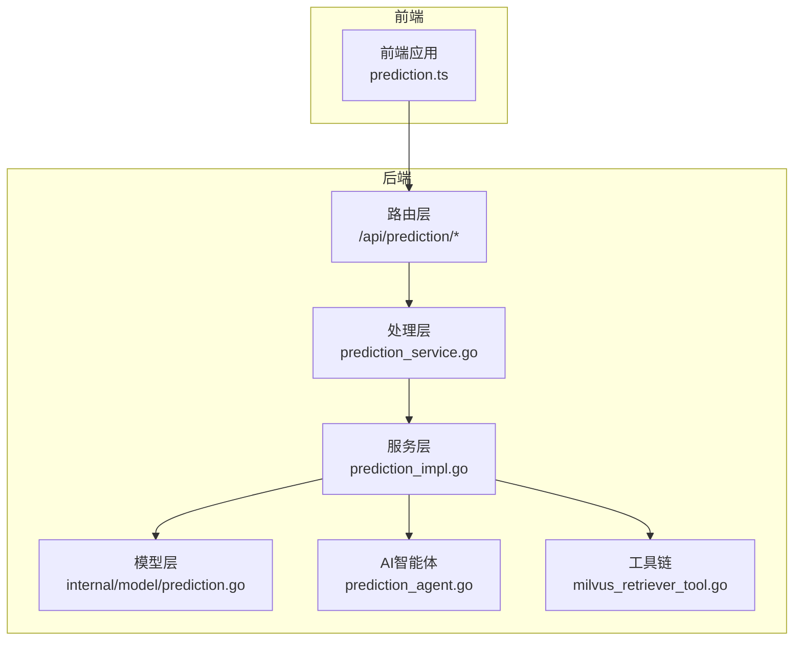
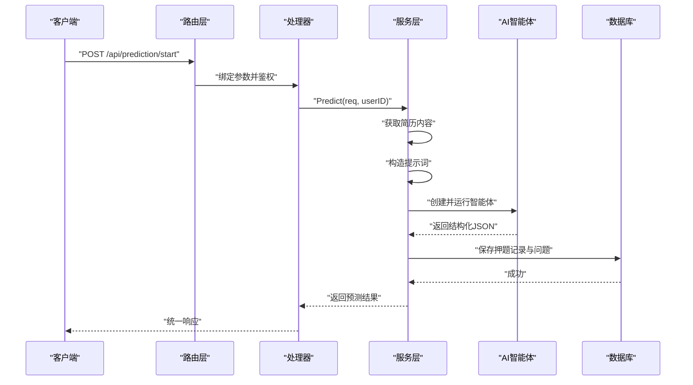
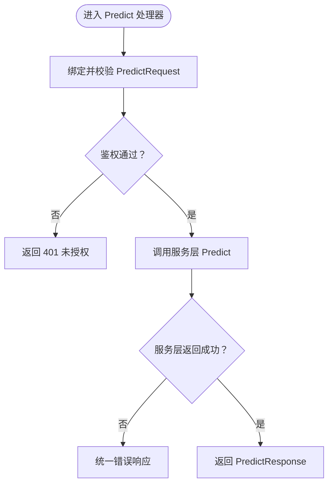
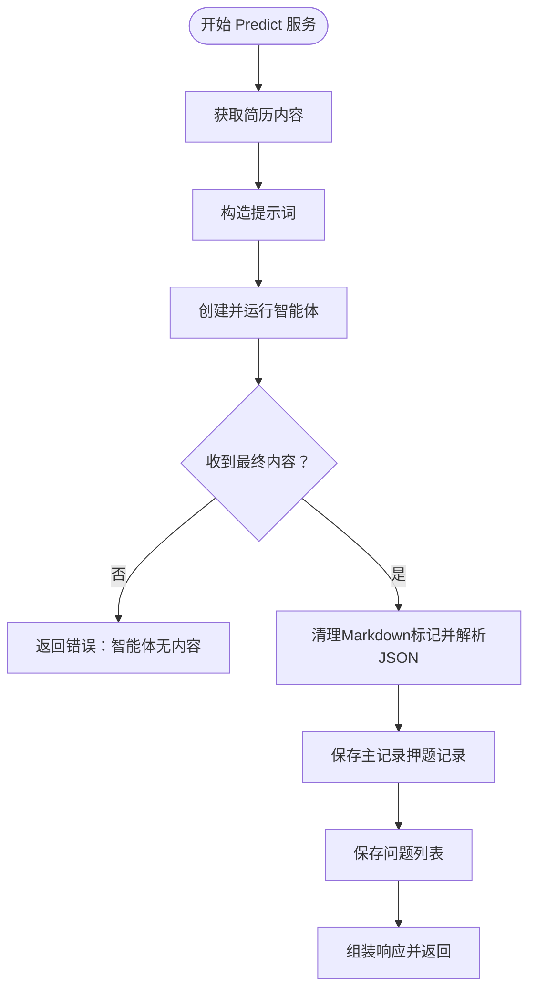
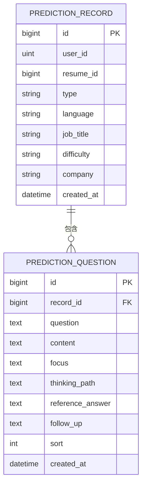
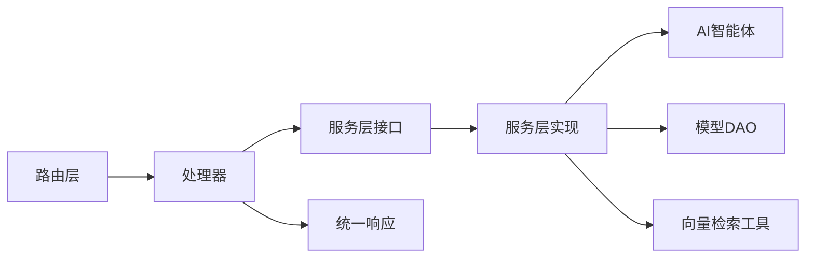

# 预测推荐API

<cite>
**本文档引用的文件**
- [backend/api/router/interview/api.go](file://backend/api/router/interview/api.go)
- [backend/api/handler/interview/prediction_service.go](file://backend/api/handler/interview/prediction_service.go)
- [backend/api/model/prediction/prediction.go](file://backend/api/model/prediction/prediction.go)
- [backend/internal/service/prediction/interface.go](file://backend/internal/service/prediction/interface.go)
- [backend/internal/service/prediction/impl/prediction_impl.go](file://backend/internal/service/prediction/impl/prediction_impl.go)
- [backend/chatApp/agent/prediction/prediction_agent.go](file://backend/chatApp/agent/prediction/prediction_agent.go)
- [backend/chatApp/tool/milvus_retriever_tool.go](file://backend/chatApp/tool/milvus_retriever_tool.go)
- [backend/chatApp/agent/resume/resume.go](file://backend/chatApp/agent/resume/resume.go)
- [backend/chatApp/chat/openAi.go](file://backend/chatApp/chat/openAi.go)
- [backend/internal/model/prediction.go](file://backend/internal/model/prediction.go)
- [backend/api/response/response.go](file://backend/api/response/response.go)
- [frontend/src/services/api/prediction.ts](file://frontend/src/services/api/prediction.ts)
</cite>

## 目录
1. [简介](#简介)
2. [项目结构](#项目结构)
3. [核心组件](#核心组件)
4. [架构总览](#架构总览)
5. [详细组件分析](#详细组件分析)
6. [依赖关系分析](#依赖关系分析)
7. [性能考虑](#性能考虑)
8. [故障排除指南](#故障排除指南)
9. [结论](#结论)

## 简介
本文件为预测推荐模块的完整API接口文档，覆盖简历分析、面试预测、押题推荐和评估报告等能力。系统基于Hertz路由层、Eino智能体框架与Milvus向量检索，提供从简历解析到AI押题生成、持久化存储与查询的端到端能力。文档详细说明HTTP接口、请求参数、响应格式、AI智能体调用、向量检索与个性化推荐流程，并给出预测算法、数据处理流程与性能优化策略。

## 项目结构
预测推荐模块位于后端API层，采用分层架构：
- 路由层：定义HTTP路由与中间件
- 处理层：绑定请求、鉴权、调用服务层
- 服务层：业务逻辑封装，协调AI与数据库
- 模型层：数据库实体与DAO操作
- AI集成层：Eino智能体与工具链（含向量检索）

图表来源
- [backend/api/router/interview/api.go](file://backend/api/router/interview/api.go#L49-L52)
- [backend/api/handler/interview/prediction_service.go](file://backend/api/handler/interview/prediction_service.go#L18-L95)
- [backend/internal/service/prediction/impl/prediction_impl.go](file://backend/internal/service/prediction/impl/prediction_impl.go#L25-L211)
- [backend/internal/model/prediction.go](file://backend/internal/model/prediction.go#L11-L109)
- [backend/chatApp/agent/prediction/prediction_agent.go](file://backend/chatApp/agent/prediction/prediction_agent.go#L25-L65)
- [backend/chatApp/tool/milvus_retriever_tool.go](file://backend/chatApp/tool/milvus_retriever_tool.go#L48-L101)

章节来源
- [backend/api/router/interview/api.go](file://backend/api/router/interview/api.go#L16-L53)
- [backend/api/handler/interview/prediction_service.go](file://backend/api/handler/interview/prediction_service.go#L17-L95)

## 核心组件
- 路由注册：在路由层注册预测相关接口，包括启动预测、列表查询、详情查询。
- 处理器：绑定请求参数、鉴权、调用服务层并返回统一响应。
- 服务层：实现预测主流程，包括简历获取、提示词构造、AI智能体调用、结果解析与持久化。
- 模型层：定义押题记录与问题的数据库结构及DAO操作。
- AI智能体：根据简历与要求生成5道面试题，包含重点考察、回答思路、参考答案与可能追问。
- 工具链：向量检索工具，支持从Milvus检索相关文档。
- 统一响应：封装统一的响应结构与错误处理。

章节来源
- [backend/internal/service/prediction/interface.go](file://backend/internal/service/prediction/interface.go#L8-L12)
- [backend/internal/model/prediction.go](file://backend/internal/model/prediction.go#L11-L109)
- [backend/api/response/response.go](file://backend/api/response/response.go#L13-L119)

## 架构总览
预测推荐的整体流程如下：

图表来源
- [backend/api/router/interview/api.go](file://backend/api/router/interview/api.go#L52-L52)
- [backend/api/handler/interview/prediction_service.go](file://backend/api/handler/interview/prediction_service.go#L18-L42)
- [backend/internal/service/prediction/impl/prediction_impl.go](file://backend/internal/service/prediction/impl/prediction_impl.go#L25-L211)
- [backend/chatApp/agent/prediction/prediction_agent.go](file://backend/chatApp/agent/prediction/prediction_agent.go#L25-L65)
- [backend/internal/model/prediction.go](file://backend/internal/model/prediction.go#L51-L109)

## 详细组件分析

### 接口定义与路由
- 启动预测
  - 方法：POST
  - URL：/api/prediction/start
  - 请求参数：PredictRequest（见下节）
  - 响应：PredictResponse（见下节）
- 列表查询
  - 方法：GET
  - URL：/api/prediction/list
  - 查询参数：page、size（可选）
  - 响应：ListPredictionResponse（见下节）
- 详情查询
  - 方法：GET
  - URL：/api/prediction/:id
  - 路径参数：id（押题记录ID）
  - 响应：GetPredictionDetailResponse（见下节）

章节来源
- [backend/api/router/interview/api.go](file://backend/api/router/interview/api.go#L49-L52)
- [backend/api/handler/interview/prediction_service.go](file://backend/api/handler/interview/prediction_service.go#L18-L95)

### 请求参数与响应格式

#### PredictRequest（启动预测请求）
- 字段
  - resume_id: 简历ID（必填）
  - prediction_type: 押题类型（如校招/社招，必填）
  - language: 语言（如java/go，必填）
  - job_title: 岗位（如前端/后端，必填）
  - difficulty: 难度（如入门/进阶，必填）
  - company_name: 目标公司（可选）
- 示例
  - 请求体示例（JSON）
    {
      "resume_id": 123456,
      "prediction_type": "校招",
      "language": "go",
      "job_title": "后端",
      "difficulty": "进阶",
      "company_name": "字节"
    }

章节来源
- [backend/api/model/prediction/prediction.go](file://backend/api/model/prediction/prediction.go#L11-L24)

#### PredictResponse（预测结果响应）
- 字段
  - record_id: 押题记录ID
  - questions: 预测问题数组
    - question: 问题内容
    - content: 重点考察内容
    - focus: 重点考察方向
    - thinking_path: 回答思路
    - reference_answer: 参考答案
    - follow_up: 可能追问（字符串或数组序列化为JSON）
    - sort: 排序序号
- 示例
  - 响应体示例（JSON）
    {
      "record_id": 987654,
      "questions": [
        {
          "question": "如何实现高并发下的缓存一致性？",
          "content": "【重点考察】缓存更新策略与一致性机制",
          "focus": "缓存更新策略、分布式锁、最终一致性",
          "thinking_path": "先读缓存，未命中再读DB，写入时采用延迟双删或异步更新",
          "reference_answer": "使用Redis + 延迟双删 + 观察者模式异步更新",
          "follow_up": "如果使用消息队列，如何保证幂等？",
          "sort": 1
        }
      ]
    }

章节来源
- [backend/api/model/prediction/prediction.go](file://backend/api/model/prediction/prediction.go#L954-L978)
- [backend/api/model/prediction/prediction.go](file://backend/api/model/prediction/prediction.go#L434-L444)

#### ListPredictionRequest（列表查询请求）
- 字段
  - page: 页码（可选，默认1）
  - size: 每页条数（可选，默认10）
- 示例
  - 查询参数示例
    ?page=1&size=10

章节来源
- [backend/api/model/prediction/prediction.go](file://backend/api/model/prediction/prediction.go#L1176-L1218)

#### ListPredictionResponse（列表查询响应）
- 字段
  - list: 押题记录摘要数组
    - id: 记录ID
    - created_at: 创建时间（字符串）
    - job_title: 岗位
    - difficulty: 难度
    - company: 公司
    - prediction_type: 押题类型
    - language: 语言
  - total: 总数
  - page: 当前页
  - size: 每页大小
- 示例
  - 响应体示例（JSON）
    {
      "list": [
        {
          "id": 987654,
          "created_at": "2025-01-01 12:00:00",
          "job_title": "后端",
          "difficulty": "进阶",
          "company": "字节",
          "prediction_type": "校招",
          "language": "go"
        }
      ],
      "total": 1,
      "page": 1,
      "size": 10
    }

章节来源
- [backend/api/model/prediction/prediction.go](file://backend/api/model/prediction/prediction.go#L1385-L1439)

#### GetPredictionDetailResponse（详情查询响应）
- 字段
  - id: 押题记录ID
  - questions: 预测问题数组（同PredictResponse.questions）
- 示例
  - 响应体示例（JSON）
    {
      "id": 987654,
      "questions": [
        {
          "question": "如何实现高并发下的缓存一致性？",
          "content": "【重点考察】缓存更新策略与一致性机制",
          "focus": "缓存更新策略、分布式锁、最终一致性",
          "thinking_path": "先读缓存，未命中再读DB，写入时采用延迟双删或异步更新",
          "reference_answer": "使用Redis + 延迟双删 + 观察者模式异步更新",
          "follow_up": "如果使用消息队列，如何保证幂等？",
          "sort": 1
        }
      ]
    }

章节来源
- [backend/api/model/prediction/prediction.go](file://backend/api/model/prediction/prediction.go#L2331-L2333)

### 处理器与服务层流程

#### Predict（启动预测）
- 流程要点
  - 参数绑定与校验
  - 鉴权：从请求上下文获取用户ID
  - 调用服务层Predict
  - 统一错误处理
- 返回
  - 成功：PredictResponse
  - 失败：统一错误响应

图表来源
- [backend/api/handler/interview/prediction_service.go](file://backend/api/handler/interview/prediction_service.go#L18-L42)
- [backend/api/response/response.go](file://backend/api/response/response.go#L80-L88)

章节来源
- [backend/api/handler/interview/prediction_service.go](file://backend/api/handler/interview/prediction_service.go#L17-L42)

#### 服务层Predict（核心业务逻辑）
- 步骤
  1) 获取简历内容
  2) 构造提示词（包含简历内容与预测要求）
  3) 创建并运行AI智能体，收集最终消息内容
  4) 清理Markdown标记，解析为结构化JSON
  5) 保存押题记录与问题（分步保存）
  6) 组装响应返回
- 异常处理
  - 简历不存在、智能体返回空、JSON解析失败、数据库保存失败均转为错误响应

图表来源
- [backend/internal/service/prediction/impl/prediction_impl.go](file://backend/internal/service/prediction/impl/prediction_impl.go#L25-L211)

章节来源
- [backend/internal/service/prediction/impl/prediction_impl.go](file://backend/internal/service/prediction/impl/prediction_impl.go#L25-L211)

#### 列表与详情查询
- 列表查询：按用户ID分页查询押题记录摘要
- 详情查询：按记录ID查询并校验归属（userID匹配）

章节来源
- [backend/internal/service/prediction/impl/prediction_impl.go](file://backend/internal/service/prediction/impl/prediction_impl.go#L229-L292)
- [backend/internal/model/prediction.go](file://backend/internal/model/prediction.go#L86-L109)

### AI智能体与向量检索

#### 押题智能体（PredictionAgent）
- 能力：根据简历与要求生成5道结构化面试题
- 输出结构：包含问题、重点考察、回答思路、参考答案、可能追问等字段
- 限制：严格返回5道题，且必须为标准JSON格式

章节来源
- [backend/chatApp/agent/prediction/prediction_agent.go](file://backend/chatApp/agent/prediction/prediction_agent.go#L11-L65)

#### 简历解析智能体（ResumeParserAgent）
- 能力：解析PDF简历，提取基本信息、教育背景、工作经历、技术栈、项目经验、技能特长、证书资格等
- 工具：pdf_to_text工具
- 输出：结构化JSON，包含推荐难度、面试关注领域等

章节来源
- [backend/chatApp/agent/resume/resume.go](file://backend/chatApp/agent/resume/resume.go#L14-L109)

#### 向量检索工具（MilvusRetrieverTool）
- 输入：查询文本
- 输出：相关文档列表（含内容、元数据、相似度分数）
- 场景：结合简历解析与AI生成，提供知识增强与上下文检索

章节来源
- [backend/chatApp/tool/milvus_retriever_tool.go](file://backend/chatApp/tool/milvus_retriever_tool.go#L15-L101)

#### 模型配置与调用（OpenAI模型）
- 从用户默认模型配置中读取API Key、模型名、BaseURL
- 基础校验与错误分类（配额不足、速率限制、上下文超限等）
- 自定义HTTP客户端以提升稳定性

章节来源
- [backend/chatApp/chat/openAi.go](file://backend/chatApp/chat/openAi.go#L19-L109)

### 数据模型与持久化

图表来源
- [backend/internal/model/prediction.go](file://backend/internal/model/prediction.go#L11-L47)

章节来源
- [backend/internal/model/prediction.go](file://backend/internal/model/prediction.go#L51-L109)

## 依赖关系分析

图表来源
- [backend/api/router/interview/api.go](file://backend/api/router/interview/api.go#L49-L52)
- [backend/api/handler/interview/prediction_service.go](file://backend/api/handler/interview/prediction_service.go#L18-L95)
- [backend/internal/service/prediction/interface.go](file://backend/internal/service/prediction/interface.go#L8-L12)
- [backend/internal/service/prediction/impl/prediction_impl.go](file://backend/internal/service/prediction/impl/prediction_impl.go#L25-L211)
- [backend/api/response/response.go](file://backend/api/response/response.go#L13-L119)

章节来源
- [backend/internal/service/prediction/interface.go](file://backend/internal/service/prediction/interface.go#L8-L12)
- [backend/internal/service/prediction/impl/prediction_impl.go](file://backend/internal/service/prediction/impl/prediction_impl.go#L25-L211)

## 性能考虑
- 智能体调用
  - 使用Runner流式事件迭代，避免阻塞；对空响应进行快速失败。
  - 对提示词长度进行监控与截断策略，防止上下文超限。
- 数据库写入
  - 分步保存：先保存主记录再保存问题，便于定位问题与重试。
  - 预加载关联问题并按sort排序，减少二次查询。
- 向量检索
  - TopK与相似度阈值控制召回数量与质量；合理设置分片大小与重叠，平衡精度与性能。
- 统一响应
  - 错误映射HTTP状态码，便于前端与网关层处理。
- 监控指标（建议）
  - HTTP请求总量/耗时、AI模型调用次数/耗时、代理处理耗时、Token用量、提示词长度分布等。

[本节为通用性能指导，不直接分析具体文件]

## 故障排除指南
- 401 未授权
  - 现象：缺少或无效的鉴权信息
  - 处理：检查请求头中的Authorization
- 400 参数错误
  - 现象：请求参数缺失或格式不正确
  - 处理：核对PredictRequest各字段是否满足必填条件
- 500 服务器错误
  - 现象：智能体返回空、JSON解析失败、数据库保存失败
  - 处理：查看日志定位具体环节，检查AI模型配置与网络连通性
- 向量检索失败
  - 现象：Milvus连接失败或检索异常
  - 处理：检查Milvus配置、连接参数与健康检查

章节来源
- [backend/api/response/response.go](file://backend/api/response/response.go#L55-L88)
- [backend/internal/service/prediction/impl/prediction_impl.go](file://backend/internal/service/prediction/impl/prediction_impl.go#L25-L211)
- [backend/chatApp/tool/milvus_retriever_tool.go](file://backend/chatApp/tool/milvus_retriever_tool.go#L48-L101)

## 结论
预测推荐模块通过清晰的分层架构与标准化的接口设计，实现了从简历到AI押题的完整闭环。结合向量检索与智能体生成，系统具备良好的扩展性与可维护性。建议在生产环境中完善监控指标、限流熔断与缓存策略，持续优化提示词工程与模型配置，以提升预测质量与用户体验。