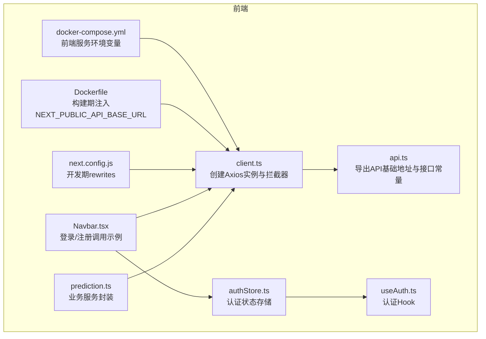
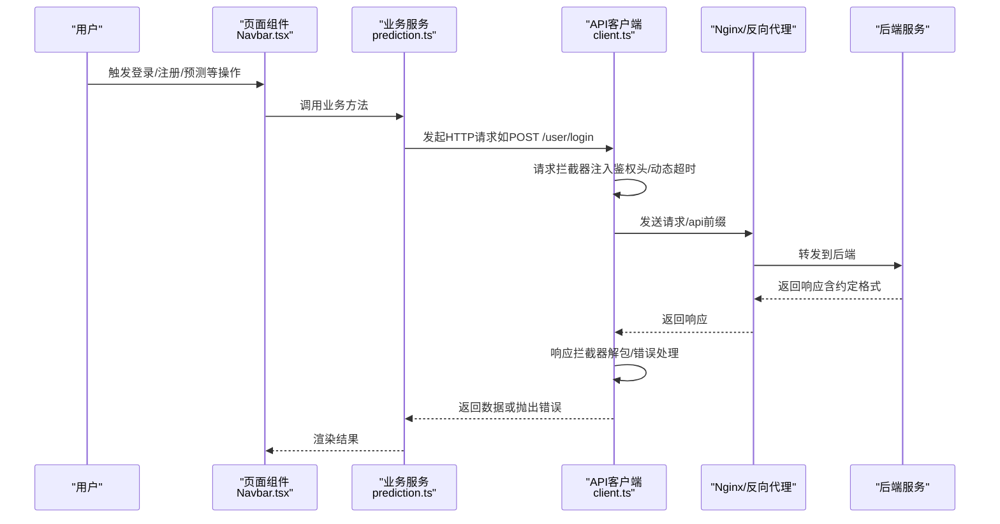
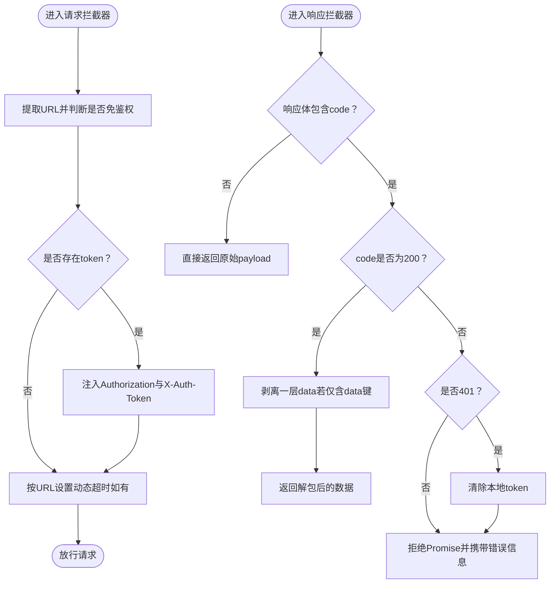
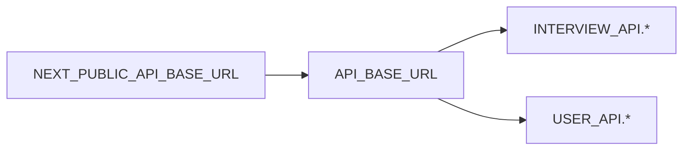
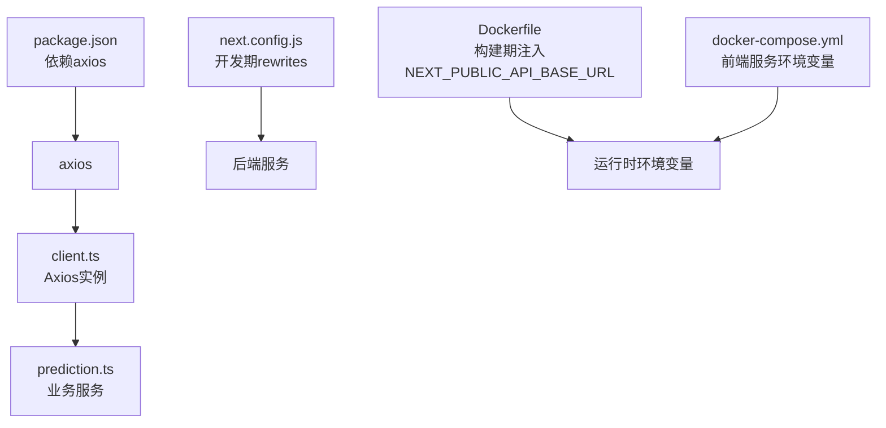

# API客户端配置

<cite>
**本文引用的文件**
- [frontend/src/services/api/client.ts](file://frontend/src/services/api/client.ts)
- [frontend/src/config/api.ts](file://frontend/src/config/api.ts)
- [frontend/next.config.js](file://frontend/next.config.js)
- [frontend/Dockerfile](file://frontend/Dockerfile)
- [frontend/package.json](file://frontend/package.json)
- [docker-compose.yml](file://docker-compose.yml)
- [frontend/src/services/api/prediction.ts](file://frontend/src/services/api/prediction.ts)
- [frontend/src/components/layout/Navbar.tsx](file://frontend/src/components/layout/Navbar.tsx)
- [frontend/src/store/authStore.ts](file://frontend/src/store/authStore.ts)
- [frontend/src/hooks/useAuth.ts](file://frontend/src/hooks/useAuth.ts)
- [frontend/src/types/prediction.ts](file://frontend/src/types/prediction.ts)
</cite>

## 目录
1. [简介](#简介)
2. [项目结构](#项目结构)
3. [核心组件](#核心组件)
4. [架构总览](#架构总览)
5. [组件详解](#组件详解)
6. [依赖关系分析](#依赖关系分析)
7. [性能考量](#性能考量)
8. [故障排查指南](#故障排查指南)
9. [结论](#结论)
10. [附录](#附录)

## 简介
本文件系统性梳理前端API客户端的配置与使用，重点覆盖以下方面：
- Axios实例的创建与关键配置参数（baseURL、超时、默认headers）
- 环境变量NEXT_PUBLIC_API_BASE_URL的作用与配置方式
- 请求/响应拦截器的实现与行为（鉴权头注入、按接口动态超时、统一响应解包与错误处理）
- 客户端实例的生命周期与全局配置选项
- 不同环境下的配置差异与部署注意事项
- 最佳实践与常见配置场景示例

## 项目结构
前端API客户端位于frontend/src/services/api目录，核心文件包括：
- client.ts：Axios实例创建与拦截器配置
- api.ts：基于环境变量的API基础地址与接口常量
- prediction.ts：具体业务服务对apiClient的封装使用示例
- next.config.js：开发期rewrites，将/api前缀代理至后端
- Dockerfile：构建期注入NEXT_PUBLIC_API_BASE_URL，生产期通过容器环境变量控制
- docker-compose.yml：Compose中为前端服务设置NEXT_PUBLIC_API_URL（注意：此处变量名与客户端使用的NEXT_PUBLIC_API_BASE_URL不一致）

图表来源
- [frontend/src/services/api/client.ts](file://frontend/src/services/api/client.ts#L1-L63)
- [frontend/src/config/api.ts](file://frontend/src/config/api.ts#L1-L23)
- [frontend/src/services/api/prediction.ts](file://frontend/src/services/api/prediction.ts#L1-L16)
- [frontend/src/components/layout/Navbar.tsx](file://frontend/src/components/layout/Navbar.tsx#L41-L80)
- [frontend/src/store/authStore.ts](file://frontend/src/store/authStore.ts#L1-L31)
- [frontend/src/hooks/useAuth.ts](file://frontend/src/hooks/useAuth.ts#L1-L16)
- [frontend/next.config.js](file://frontend/next.config.js#L1-L11)
- [frontend/Dockerfile](file://frontend/Dockerfile#L1-L65)
- [docker-compose.yml](file://docker-compose.yml#L192-L207)

章节来源
- [frontend/src/services/api/client.ts](file://frontend/src/services/api/client.ts#L1-L63)
- [frontend/src/config/api.ts](file://frontend/src/config/api.ts#L1-L23)
- [frontend/next.config.js](file://frontend/next.config.js#L1-L11)
- [frontend/Dockerfile](file://frontend/Dockerfile#L1-L65)
- [docker-compose.yml](file://docker-compose.yml#L192-L207)

## 核心组件
- Axios实例与拦截器
  - 实例创建：设置baseURL、默认超时、默认headers
  - 请求拦截器：根据URL判断是否免鉴权；若存在token且非免鉴权接口，则注入Authorization与X-Auth-Token；对特定接口动态延长超时
  - 响应拦截器：统一解析后端约定格式中的code字段；当code为200时剥离data.data；当code为401或响应状态401时清理本地token
- API基础地址与接口常量
  - API_BASE_URL来源于NEXT_PUBLIC_API_BASE_URL，未设置时回退为相对路径/api
  - 所有业务接口常量基于API_BASE_URL拼接
- 开发期rewrites
  - 将/api前缀重写到后端服务地址，便于开发联调
- 构建与部署
  - 构建期通过ARG与ENV注入NEXT_PUBLIC_API_BASE_URL
  - 生产期可通过容器环境变量覆盖默认值

章节来源
- [frontend/src/services/api/client.ts](file://frontend/src/services/api/client.ts#L1-L63)
- [frontend/src/config/api.ts](file://frontend/src/config/api.ts#L1-L23)
- [frontend/next.config.js](file://frontend/next.config.js#L1-L11)
- [frontend/Dockerfile](file://frontend/Dockerfile#L16-L21)

## 架构总览
下图展示从页面调用到后端服务的整体流程，以及环境变量在不同阶段的作用。

图表来源
- [frontend/src/components/layout/Navbar.tsx](file://frontend/src/components/layout/Navbar.tsx#L41-L80)
- [frontend/src/services/api/prediction.ts](file://frontend/src/services/api/prediction.ts#L1-L16)
- [frontend/src/services/api/client.ts](file://frontend/src/services/api/client.ts#L1-L63)
- [frontend/next.config.js](file://frontend/next.config.js#L1-L11)
- [docker-compose.yml](file://docker-compose.yml#L177-L190)

## 组件详解

### Axios实例与拦截器
- 实例创建
  - baseURL：优先使用NEXT_PUBLIC_API_BASE_URL，否则回退为相对路径/api
  - timeout：默认10秒
  - headers：默认JSON内容类型
- 请求拦截器
  - 免鉴权接口判定：包含特定路径的URL视为免鉴权
  - 鉴权头注入：若存在token且非免鉴权接口，向headers添加Authorization与X-Auth-Token
  - 动态超时：针对面试评估与答题记录接口，将超时提升至3分钟
- 响应拦截器
  - 统一格式解包：当响应体包含约定的code字段时，仅返回data.data（若其仅包含data一个键）
  - 错误处理：当code为401或响应状态为401时，清除本地token并拒绝Promise

图表来源
- [frontend/src/services/api/client.ts](file://frontend/src/services/api/client.ts#L13-L60)

章节来源
- [frontend/src/services/api/client.ts](file://frontend/src/services/api/client.ts#L1-L63)

### API基础地址与接口常量
- API_BASE_URL：来源于NEXT_PUBLIC_API_BASE_URL，未设置时默认/api
- 接口常量：基于API_BASE_URL拼接各业务接口路径，便于集中维护与替换

图表来源
- [frontend/src/config/api.ts](file://frontend/src/config/api.ts#L1-L23)

章节来源
- [frontend/src/config/api.ts](file://frontend/src/config/api.ts#L1-L23)

### 业务服务封装示例
- predictionService：以apiClient为基础，封装预测列表与详情接口的GET请求
- 使用泛型约束明确响应类型，确保类型安全

章节来源
- [frontend/src/services/api/prediction.ts](file://frontend/src/services/api/prediction.ts#L1-L16)
- [frontend/src/types/prediction.ts](file://frontend/src/types/prediction.ts#L1-L33)

### 认证与状态管理
- Navbar.tsx：登录/注册调用apiClient，成功后将token写入localStorage并更新用户信息
- authStore.ts：使用zustand持久化存储认证状态
- useAuth.ts：对外暴露认证相关状态与方法

章节来源
- [frontend/src/components/layout/Navbar.tsx](file://frontend/src/components/layout/Navbar.tsx#L41-L80)
- [frontend/src/store/authStore.ts](file://frontend/src/store/authStore.ts#L1-L31)
- [frontend/src/hooks/useAuth.ts](file://frontend/src/hooks/useAuth.ts#L1-L16)

## 依赖关系分析
- Axios版本：package.json声明使用axios ^1.6.5
- Next.js开发期rewrites：将/api前缀转发至后端地址，便于本地联调
- 构建期环境变量注入：Dockerfile在构建阶段注入NEXT_PUBLIC_API_BASE_URL
- Compose环境变量：docker-compose.yml为前端服务设置了NEXT_PUBLIC_API_URL（注意：变量名与客户端使用的NEXT_PUBLIC_API_BASE_URL不一致）

图表来源
- [frontend/package.json](file://frontend/package.json#L11-L20)
- [frontend/next.config.js](file://frontend/next.config.js#L1-L11)
- [frontend/Dockerfile](file://frontend/Dockerfile#L16-L21)
- [docker-compose.yml](file://docker-compose.yml#L192-L207)
- [frontend/src/services/api/client.ts](file://frontend/src/services/api/client.ts#L1-L10)
- [frontend/src/services/api/prediction.ts](file://frontend/src/services/api/prediction.ts#L1-L16)

章节来源
- [frontend/package.json](file://frontend/package.json#L11-L20)
- [frontend/next.config.js](file://frontend/next.config.js#L1-L11)
- [frontend/Dockerfile](file://frontend/Dockerfile#L16-L21)
- [docker-compose.yml](file://docker-compose.yml#L192-L207)

## 性能考量
- 默认超时10秒适用于大多数接口；对长耗时接口（如面试评估、答题记录）通过拦截器动态提升至3分钟，避免误判超时
- 统一响应解包减少重复逻辑，提高可维护性
- 鉴权头仅在必要时注入，避免不必要的头部开销

## 故障排查指南
- 登录/注册无响应
  - 检查NEXT_PUBLIC_API_BASE_URL是否正确指向后端
  - 确认开发期rewrites已生效（/api前缀被转发）
  - 查看浏览器网络面板，确认请求是否到达后端
- 401错误频繁出现
  - 检查响应拦截器是否触发清理token逻辑
  - 确认鉴权头是否正确注入（Authorization与X-Auth-Token）
- 长耗时接口超时
  - 确认URL是否命中动态超时规则（包含特定路径）
  - 如需调整超时阈值，请在请求拦截器中修改对应逻辑
- 环境变量不生效
  - 构建期：确认Dockerfile中ARG与ENV设置
  - 运行期：确认容器环境变量是否覆盖默认值
  - 注意：docker-compose.yml中设置的是NEXT_PUBLIC_API_URL，而客户端读取的是NEXT_PUBLIC_API_BASE_URL，二者变量名不一致，可能导致预期不符

章节来源
- [frontend/src/services/api/client.ts](file://frontend/src/services/api/client.ts#L13-L60)
- [frontend/next.config.js](file://frontend/next.config.js#L1-L11)
- [frontend/Dockerfile](file://frontend/Dockerfile#L16-L21)
- [docker-compose.yml](file://docker-compose.yml#L192-L207)

## 结论
该API客户端通过Axios实例与拦截器实现了统一的请求/响应处理、鉴权头注入与动态超时策略，并以环境变量驱动baseURL配置，满足开发、构建与生产的多环境需求。建议在实际部署中统一前后端环境变量命名，确保配置一致性与可维护性。

## 附录

### 环境变量与配置要点
- NEXT_PUBLIC_API_BASE_URL
  - 作用：作为Axios实例的baseURL，决定所有接口的基础路径
  - 配置方式：
    - 开发：可由Next.js运行时环境提供
    - 构建：Dockerfile在构建阶段注入默认值
    - 生产：可通过容器环境变量覆盖
- NEXT_PUBLIC_API_URL（注意：与客户端使用的NEXT_PUBLIC_API_BASE_URL变量名不一致）
  - 在docker-compose.yml中为前端服务设置了该变量，但客户端代码读取的是NEXT_PUBLIC_API_BASE_URL，可能导致预期不符

章节来源
- [frontend/src/config/api.ts](file://frontend/src/config/api.ts#L1-L4)
- [frontend/Dockerfile](file://frontend/Dockerfile#L16-L18)
- [docker-compose.yml](file://docker-compose.yml#L192-L202)

### 常见配置场景与最佳实践
- 开发环境
  - 使用next.config.js的rewrites将/api转发至后端
  - 本地启动后端服务，确保端口与rewrites目标一致
- 本地构建/测试
  - 通过Dockerfile的ARG与ENV设置NEXT_PUBLIC_API_BASE_URL
  - 若需覆盖默认值，可在构建时传入ARG或运行时设置ENV
- 生产环境
  - 通过容器环境变量设置NEXT_PUBLIC_API_BASE_URL
  - 确保与Nginx/反向代理的路径映射一致
- 安全与鉴权
  - 鉴权头仅在非免鉴权接口注入
  - 对401响应自动清理本地token，避免无效请求
- 可扩展性
  - 新增接口时，在api.ts中统一维护基础地址与路径
  - 业务服务通过apiClient发起请求，保持风格一致

章节来源
- [frontend/next.config.js](file://frontend/next.config.js#L1-L11)
- [frontend/Dockerfile](file://frontend/Dockerfile#L16-L21)
- [frontend/src/config/api.ts](file://frontend/src/config/api.ts#L1-L23)
- [frontend/src/services/api/client.ts](file://frontend/src/services/api/client.ts#L13-L60)