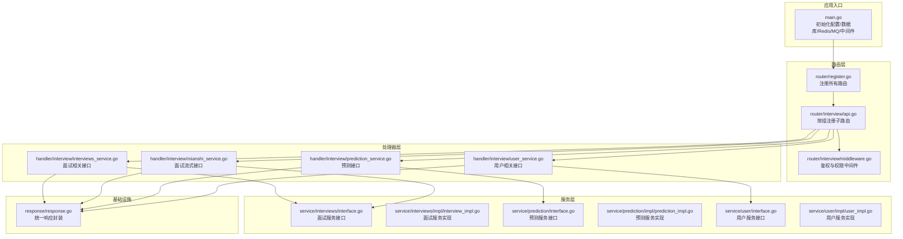
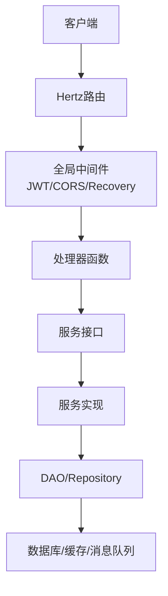
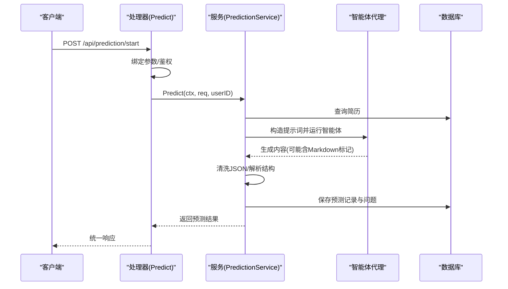
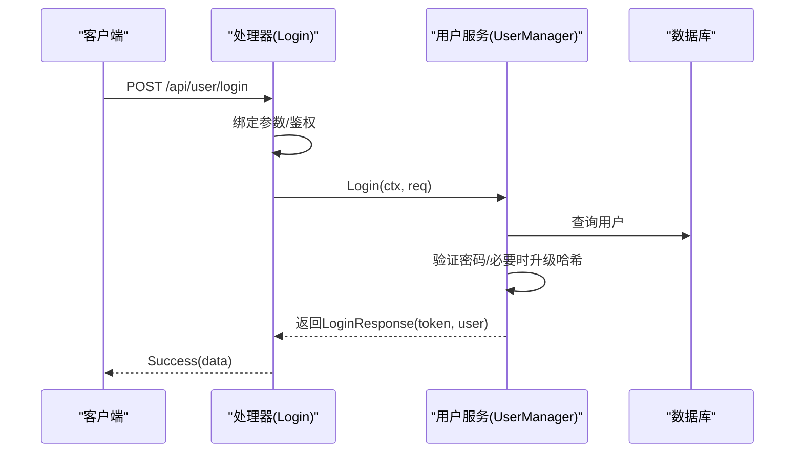
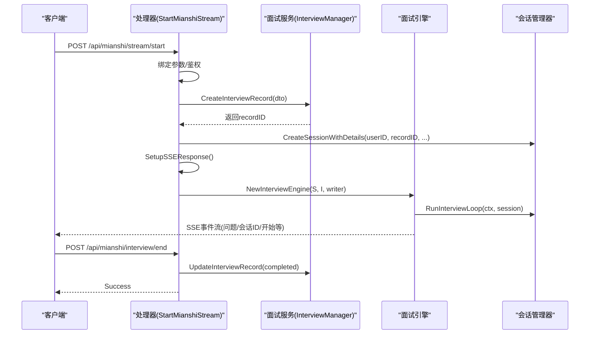
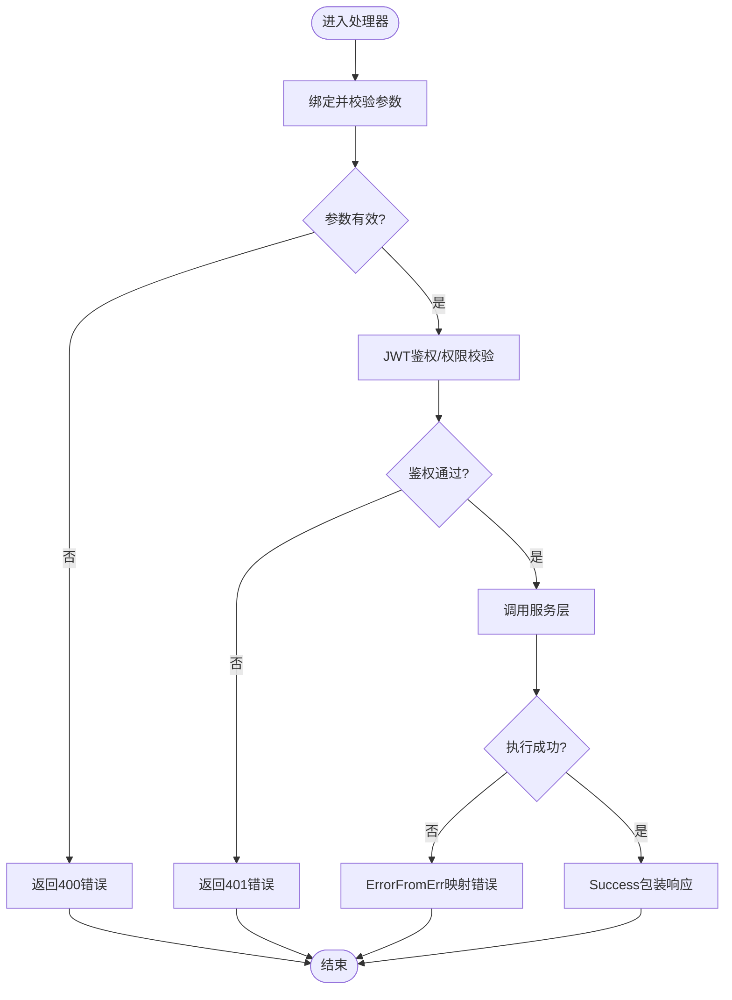
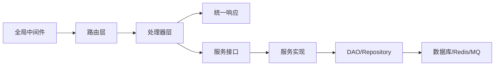

# API服务模块

<cite>
**本文档引用的文件**
- [backend/main.go](file://backend/main.go)
- [backend/api/router/register.go](file://backend/api/router/register.go)
- [backend/api/router/interview/api.go](file://backend/api/router/interview/api.go)
- [backend/api/router/interview/middleware.go](file://backend/api/router/interview/middleware.go)
- [backend/api/handler/interview/interviews_service.go](file://backend/api/handler/interview/interviews_service.go)
- [backend/api/handler/interview/mianshi_service.go](file://backend/api/handler/interview/mianshi_service.go)
- [backend/api/handler/interview/prediction_service.go](file://backend/api/handler/interview/prediction_service.go)
- [backend/api/handler/interview/user_service.go](file://backend/api/handler/interview/user_service.go)
- [backend/api/response/response.go](file://backend/api/response/response.go)
- [backend/internal/service/interviews/interface.go](file://backend/internal/service/interviews/interface.go)
- [backend/internal/service/interviews/impl/interview_impl.go](file://backend/internal/service/interviews/impl/interview_impl.go)
- [backend/internal/service/prediction/interface.go](file://backend/internal/service/prediction/interface.go)
- [backend/internal/service/prediction/impl/prediction_impl.go](file://backend/internal/service/prediction/impl/prediction_impl.go)
- [backend/internal/service/user/interface.go](file://backend/internal/service/user/interface.go)
- [backend/internal/service/user/impl/user_impl.go](file://backend/internal/service/user/impl/user_impl.go)
</cite>

## 目录
1. [简介](#简介)
2. [项目结构](#项目结构)
3. [核心组件](#核心组件)
4. [架构总览](#架构总览)
5. [详细组件分析](#详细组件分析)
6. [依赖关系分析](#依赖关系分析)
7. [性能考虑](#性能考虑)
8. [故障排除指南](#故障排除指南)
9. [结论](#结论)
10. [附录](#附录)

## 简介
本文件系统性梳理后端API服务模块的设计与实现，重点覆盖以下方面：
- 模块化设计模式与接口抽象方法
- 预测服务、用户服务、面试服务等各模块的功能职责与实现细节
- 服务间的依赖关系与调用模式
- 服务扩展与自定义方法
- 服务配置管理与错误处理策略
- 单元测试与集成测试最佳实践

该模块基于Hertz框架构建，采用清晰的分层架构：路由层（router）、处理器层（handler）、服务层（service）、数据访问层（repository/model），并通过统一响应封装与中间件实现鉴权、CORS、异常恢复等功能。

## 项目结构
API服务模块主要分布在以下目录：
- 路由注册与中间件：backend/api/router
- 处理器（Handler）：backend/api/handler/interview
- 响应封装：backend/api/response
- 服务接口与实现：backend/internal/service/{interviews,prediction,user}/...
- 应用入口：backend/main.go

**图表来源**
- [backend/main.go](file://backend/main.go#L29-L173)
- [backend/api/router/register.go](file://backend/api/router/register.go#L11-L15)
- [backend/api/router/interview/api.go](file://backend/api/router/interview/api.go#L17-L103)
- [backend/api/router/interview/middleware.go](file://backend/api/router/interview/middleware.go#L13-L36)
- [backend/api/handler/interview/interviews_service.go](file://backend/api/handler/interview/interviews_service.go#L26-L391)
- [backend/api/handler/interview/mianshi_service.go](file://backend/api/handler/interview/mianshi_service.go#L25-L409)
- [backend/api/handler/interview/prediction_service.go](file://backend/api/handler/interview/prediction_service.go#L17-L96)
- [backend/api/handler/interview/user_service.go](file://backend/api/handler/interview/user_service.go#L18-L420)
- [backend/api/response/response.go](file://backend/api/response/response.go#L13-L119)
- [backend/internal/service/interviews/interface.go](file://backend/internal/service/interviews/interface.go#L10-L118)
- [backend/internal/service/interviews/impl/interview_impl.go](file://backend/internal/service/interviews/impl/interview_impl.go#L11-L240)
- [backend/internal/service/prediction/interface.go](file://backend/internal/service/prediction/interface.go#L8-L12)
- [backend/internal/service/prediction/impl/prediction_impl.go](file://backend/internal/service/prediction/impl/prediction_impl.go#L19-L293)
- [backend/internal/service/user/interface.go](file://backend/internal/service/user/interface.go#L11-L144)
- [backend/internal/service/user/impl/user_impl.go](file://backend/internal/service/user/impl/user_impl.go#L22-L365)

**章节来源**
- [backend/main.go](file://backend/main.go#L29-L173)
- [backend/api/router/register.go](file://backend/api/router/register.go#L11-L15)
- [backend/api/router/interview/api.go](file://backend/api/router/interview/api.go#L17-L103)

## 核心组件
- 路由注册器：负责将各模块路由注册到Hertz实例，并挂载全局中间件。
- 处理器（Handler）：每个业务域对应一组处理器函数，负责参数绑定、鉴权校验、调用服务层并返回统一响应。
- 服务接口与实现：通过接口抽象隔离具体实现，便于替换与测试；实现层调用DAO层持久化数据。
- 统一响应封装：提供Success/Error/BadRequest等标准化响应方法，统一错误码映射。
- 中间件：JWT鉴权（支持公开路由跳过）、CORS、Panic恢复等。

**章节来源**
- [backend/api/response/response.go](file://backend/api/response/response.go#L13-L119)
- [backend/api/router/interview/middleware.go](file://backend/api/router/interview/middleware.go#L13-L36)

## 架构总览
API服务模块采用“路由-处理器-服务-数据访问”的分层架构，配合统一响应与中间件，形成清晰的职责边界与可扩展性。

**图表来源**
- [backend/main.go](file://backend/main.go#L101-L128)
- [backend/api/router/interview/middleware.go](file://backend/api/router/interview/middleware.go#L13-L36)
- [backend/api/handler/interview/interviews_service.go](file://backend/api/handler/interview/interviews_service.go#L26-L53)
- [backend/internal/service/interviews/interface.go](file://backend/internal/service/interviews/interface.go#L10-L18)

## 详细组件分析

### 预测服务模块
- 功能职责
  - 接收预测请求，构造提示词，调用智能体生成押题内容
  - 解析智能体输出，清洗JSON，持久化预测记录与问题
  - 支持分页列出历史记录与查询单条详情
- 关键流程
  - 参数绑定与鉴权 → 获取简历 → 构造提示词 → 调用智能体 → 解析结果 → 保存数据库 → 返回响应
- 数据结构
  - 请求/响应模型位于api/model/prediction，服务接口定义于internal/service/prediction/interface.go，实现位于internal/service/prediction/impl/prediction_impl.go

**图表来源**
- [backend/api/handler/interview/prediction_service.go](file://backend/api/handler/interview/prediction_service.go#L17-L42)
- [backend/internal/service/prediction/interface.go](file://backend/internal/service/prediction/interface.go#L8-L12)
- [backend/internal/service/prediction/impl/prediction_impl.go](file://backend/internal/service/prediction/impl/prediction_impl.go#L25-L211)

**章节来源**
- [backend/api/handler/interview/prediction_service.go](file://backend/api/handler/interview/prediction_service.go#L17-L96)
- [backend/internal/service/prediction/interface.go](file://backend/internal/service/prediction/interface.go#L8-L12)
- [backend/internal/service/prediction/impl/prediction_impl.go](file://backend/internal/service/prediction/impl/prediction_impl.go#L25-L293)

### 用户服务模块
- 功能职责
  - 用户注册/登录/登出、个人资料维护
  - 用户模型（大模型配置）的创建、查询、更新、删除与默认模型检查
  - 忘记/重置密码、微信登录与回调
- 关键流程
  - 注册/登录：参数校验 → 校验重复/凭据验证 → 生成JWT → 返回登录响应
  - 模型管理：参数校验 → 调用模型管理器 → 返回分页/详情/状态
  - 微信登录：生成二维码URL → 回调换取token与用户信息 → 注册或登录 → 返回登录响应

**图表来源**
- [backend/api/handler/interview/user_service.go](file://backend/api/handler/interview/user_service.go#L238-L262)
- [backend/internal/service/user/interface.go](file://backend/internal/service/user/interface.go#L54-L63)
- [backend/internal/service/user/impl/user_impl.go](file://backend/internal/service/user/impl/user_impl.go#L67-L93)

**章节来源**
- [backend/api/handler/interview/user_service.go](file://backend/api/handler/interview/user_service.go#L18-L420)
- [backend/internal/service/user/interface.go](file://backend/internal/service/user/interface.go#L11-L144)
- [backend/internal/service/user/impl/user_impl.go](file://backend/internal/service/user/impl/user_impl.go#L34-L117)

### 面试服务模块
- 功能职责
  - 面试记录的创建、更新、分页查询
  - 简历上传、解析、默认简历设置、列表查询、详情获取、更新与删除
  - 面试会话管理（SSE流式交互）、答案提交、评估报告与答题记录查询
- 关键流程
  - 简历上传：表单解析 → 校验文件类型/大小 → 写入本地 → 调用简历解析服务 → 保存简历信息 → 返回结果
  - 面试流式：创建面试记录 → 初始化会话 → 设置SSE响应 → 异步运行面试引擎 → 发送事件流 → 结束时更新记录并清理会话

**图表来源**
- [backend/api/handler/interview/mianshi_service.go](file://backend/api/handler/interview/mianshi_service.go#L25-L117)
- [backend/internal/service/interviews/interface.go](file://backend/internal/service/interviews/interface.go#L20-L63)
- [backend/api/handler/interview/interviews_service.go](file://backend/api/handler/interview/interviews_service.go#L55-L92)

**章节来源**
- [backend/api/handler/interview/interviews_service.go](file://backend/api/handler/interview/interviews_service.go#L26-L391)
- [backend/api/handler/interview/mianshi_service.go](file://backend/api/handler/interview/mianshi_service.go#L25-L409)
- [backend/internal/service/interviews/interface.go](file://backend/internal/service/interviews/interface.go#L10-L118)
- [backend/internal/service/interviews/impl/interview_impl.go](file://backend/internal/service/interviews/impl/interview_impl.go#L19-L240)

### 统一响应与错误处理
- 统一响应结构包含code/message/data三部分，提供Success/SuccessWithMessage/Error系列方法
- ErrorFromErr根据业务错误类型映射HTTP状态码，确保前后端一致的错误语义
- CORS中间件统一处理跨域与预检请求，提升前端联调体验

**图表来源**
- [backend/api/response/response.go](file://backend/api/response/response.go#L29-L88)
- [backend/api/router/interview/middleware.go](file://backend/api/router/interview/middleware.go#L13-L36)

**章节来源**
- [backend/api/response/response.go](file://backend/api/response/response.go#L13-L119)
- [backend/api/router/interview/middleware.go](file://backend/api/router/interview/middleware.go#L13-L36)

## 依赖关系分析
- 路由层依赖处理器层；处理器层依赖服务接口；服务接口依赖实现；实现依赖DAO/Repository；DAO依赖数据库/缓存/消息队列
- 中间件贯穿全局，对所有请求生效，支持公开路由白名单
- 统一响应封装被所有处理器复用，保证一致性

**图表来源**
- [backend/api/router/interview/api.go](file://backend/api/router/interview/api.go#L17-L103)
- [backend/api/response/response.go](file://backend/api/response/response.go#L13-L119)
- [backend/internal/service/interviews/interface.go](file://backend/internal/service/interviews/interface.go#L10-L18)
- [backend/internal/service/interviews/impl/interview_impl.go](file://backend/internal/service/interviews/impl/interview_impl.go#L11-L240)

**章节来源**
- [backend/api/router/interview/api.go](file://backend/api/router/interview/api.go#L17-L103)
- [backend/api/response/response.go](file://backend/api/response/response.go#L13-L119)

## 性能考虑
- SSE流式面试：使用io.Pipe与异步goroutine避免阻塞主线程，及时清理会话降低内存占用
- 预测服务：对智能体输出进行JSON清洗与解析，避免重复解析与无效存储
- 分页查询：面试记录与预测记录均支持分页，合理设置页大小以平衡吞吐与延迟
- 中间件：CORS与JWT中间件仅做必要处理，减少无谓计算

[本节为通用指导，无需特定文件来源]

## 故障排除指南
- 鉴权失败
  - 检查JWT中间件是否正确配置，确认公开路由白名单是否包含目标路径
  - 参考：[backend/api/router/interview/middleware.go](file://backend/api/router/interview/middleware.go#L13-L36)
- 参数校验失败
  - 处理器层统一使用BindAndValidate，返回400错误
  - 参考：[backend/api/handler/interview/interviews_service.go](file://backend/api/handler/interview/interviews_service.go#L30-L35)
- 服务内部错误
  - 使用统一ErrorFromErr映射业务错误至HTTP状态码
  - 参考：[backend/api/response/response.go](file://backend/api/response/response.go#L80-L88)
- 预测服务异常
  - 智能体运行panic被捕获并转为500错误；检查提示词构造与JSON解析
  - 参考：[backend/internal/service/prediction/impl/prediction_impl.go](file://backend/internal/service/prediction/impl/prediction_impl.go#L25-L31)
- 面试流式连接中断
  - 确认SSE响应头设置与管道写入，结束时及时cancel并清理会话
  - 参考：[backend/api/handler/interview/mianshi_service.go](file://backend/api/handler/interview/mianshi_service.go#L77-L116)

**章节来源**
- [backend/api/router/interview/middleware.go](file://backend/api/router/interview/middleware.go#L13-L36)
- [backend/api/handler/interview/interviews_service.go](file://backend/api/handler/interview/interviews_service.go#L30-L35)
- [backend/api/response/response.go](file://backend/api/response/response.go#L80-L88)
- [backend/internal/service/prediction/impl/prediction_impl.go](file://backend/internal/service/prediction/impl/prediction_impl.go#L25-L31)
- [backend/api/handler/interview/mianshi_service.go](file://backend/api/handler/interview/mianshi_service.go#L77-L116)

## 结论
本API服务模块通过清晰的分层架构与接口抽象，实现了预测、用户、面试三大核心业务域的模块化管理。统一响应与中间件提升了开发效率与一致性；SSE流式面试与智能体预测体现了高并发与智能化的结合。建议在后续迭代中完善单元测试与集成测试覆盖，持续优化错误处理与性能指标。

[本节为总结，无需特定文件来源]

## 附录

### 服务扩展与自定义方法
- 新增业务模块步骤
  - 定义IDL模型与路由注解，生成路由注册代码
  - 编写处理器函数，绑定参数并调用服务接口
  - 实现服务接口，编写DAO/Repository访问逻辑
  - 在main.go中注册新路由与中间件
- 自定义服务实现
  - 保持接口不变，替换实现即可无缝切换
  - 对外暴露NewXxxService工厂函数，便于依赖注入

**章节来源**
- [backend/api/router/interview/api.go](file://backend/api/router/interview/api.go#L17-L103)
- [backend/api/handler/interview/interviews_service.go](file://backend/api/handler/interview/interviews_service.go#L26-L53)
- [backend/internal/service/interviews/interface.go](file://backend/internal/service/interviews/interface.go#L10-L18)

### 服务配置管理
- 配置加载顺序：.env文件（可选）→ config.yaml（绝对路径或相对路径）
- 环境变量展开：配置中${VAR}形式会被替换为实际值
- 数据库/Redis/MQ初始化：在main.go中集中初始化并注入全局使用

**章节来源**
- [backend/main.go](file://backend/main.go#L30-L48)
- [backend/main.go](file://backend/main.go#L50-L87)

### 错误处理策略
- 业务错误：通过业务错误类型映射HTTP状态码
- 未知错误：统一返回500与错误描述
- 参数错误：返回400并附带错误信息
- 权限错误：返回401/403并提示未授权

**章节来源**
- [backend/api/response/response.go](file://backend/api/response/response.go#L80-L118)

### 单元测试与集成测试最佳实践
- 单元测试
  - 针对服务接口编写mock实现，隔离外部依赖
  - 覆盖边界条件与异常分支（空输入、越界、格式错误）
- 集成测试
  - 使用真实数据库/Redis/MQ，模拟完整请求链路
  - 面试SSE场景：验证事件流完整性与时序
  - 预测场景：验证提示词构造、智能体输出解析与持久化
- 建议工具
  - 使用Go原生testing包与testify辅助断言
  - 使用httptest模拟HTTP请求，覆盖鉴权与CORS

[本节为通用指导，无需特定文件来源]