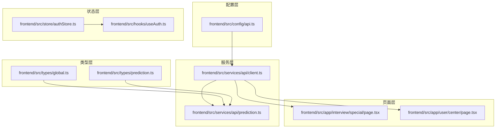
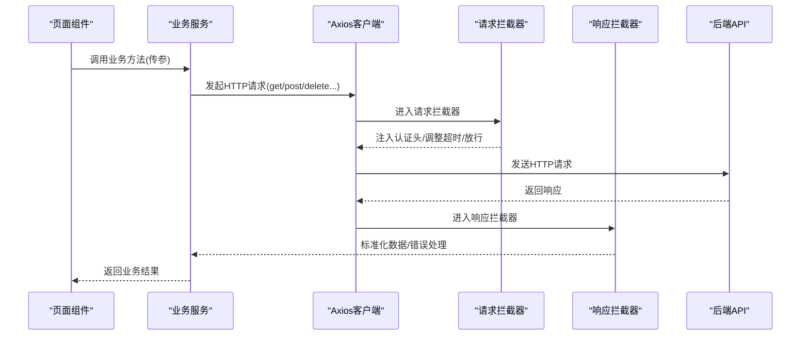
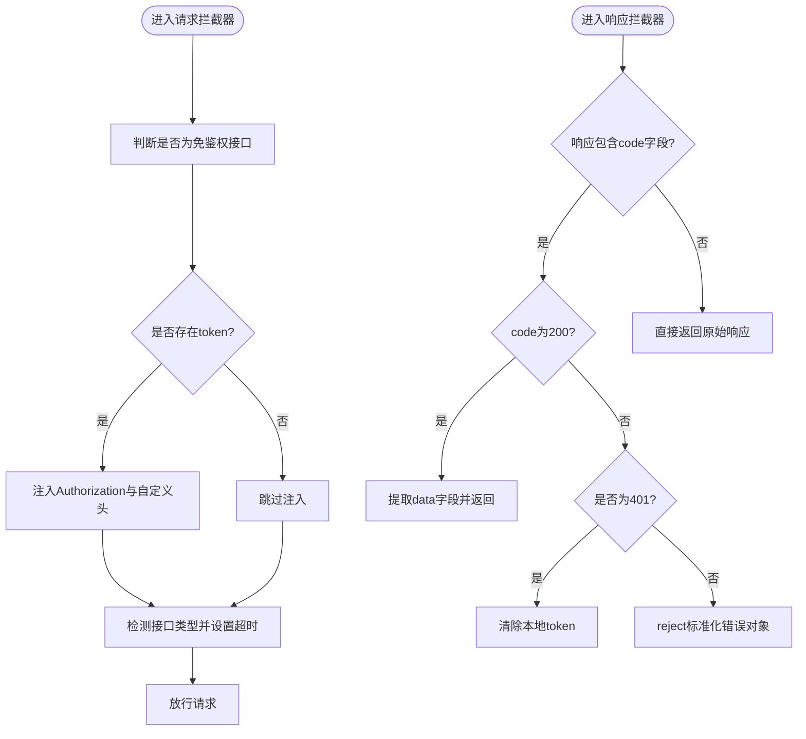
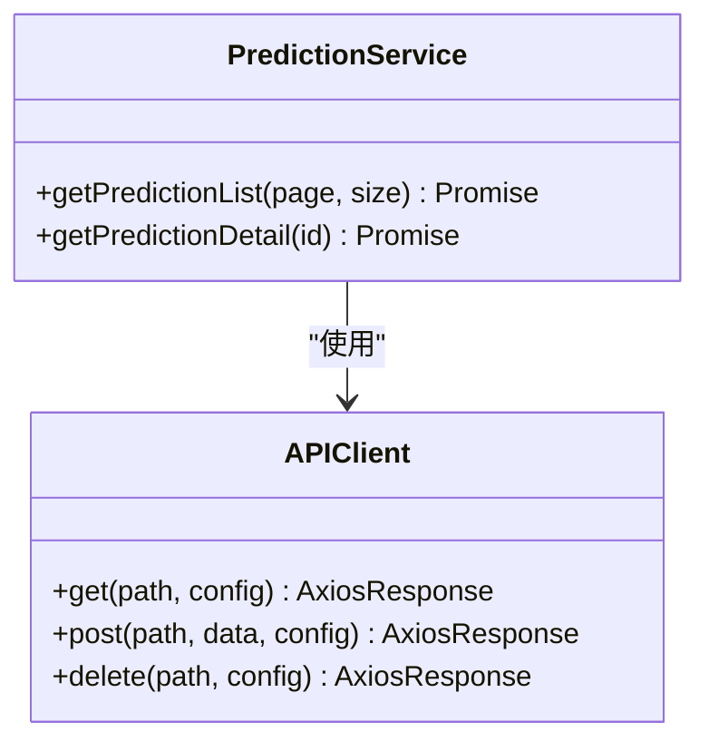
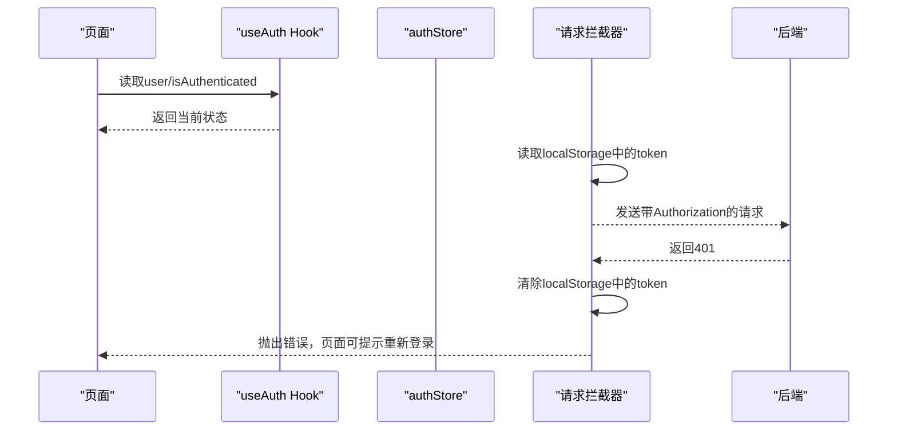
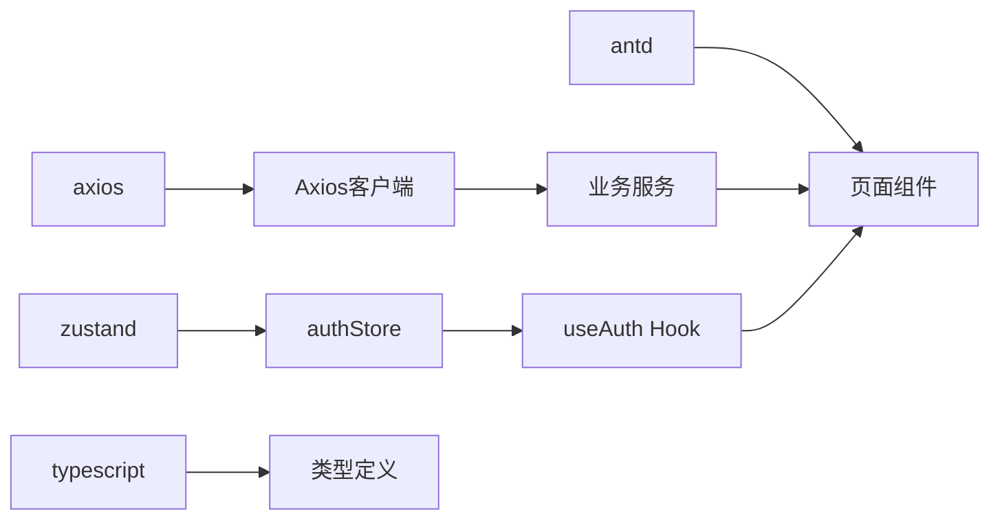

# API集成与数据流

<cite>
**本文引用的文件**
- [frontend/src/config/api.ts](file://frontend/src/config/api.ts)
- [frontend/src/services/api/client.ts](file://frontend/src/services/api/client.ts)
- [frontend/src/services/api/prediction.ts](file://frontend/src/services/api/prediction.ts)
- [frontend/src/hooks/useAuth.ts](file://frontend/src/hooks/useAuth.ts)
- [frontend/src/store/authStore.ts](file://frontend/src/store/authStore.ts)
- [frontend/src/types/global.ts](file://frontend/src/types/global.ts)
- [frontend/src/types/prediction.ts](file://frontend/src/types/prediction.ts)
- [frontend/src/utils/format.ts](file://frontend/src/utils/format.ts)
- [frontend/src/app/interview/special/page.tsx](file://frontend/src/app/interview/special/page.tsx)
- [frontend/src/app/user/center/page.tsx](file://frontend/src/app/user/center/page.tsx)
- [frontend/package.json](file://frontend/package.json)
</cite>

## 目录
1. [简介](#简介)
2. [项目结构](#项目结构)
3. [核心组件](#核心组件)
4. [架构总览](#架构总览)
5. [详细组件分析](#详细组件分析)
6. [依赖分析](#依赖分析)
7. [性能考虑](#性能考虑)
8. [故障排查指南](#故障排查指南)
9. [结论](#结论)
10. [附录](#附录)

## 简介
本文件面向前端API集成与数据流，系统性说明RESTful API客户端封装与配置、Axios拦截器的请求/响应处理与认证令牌管理、API服务模块的设计模式与接口抽象、数据获取策略（缓存、重试、超时）、错误边界与用户提示、API版本与兼容策略、以及网络状态监控与离线处理机制。内容以仓库中现有前端实现为基础，辅以概念性流程图帮助理解。

## 项目结构
前端采用Next.js应用，API相关代码集中在以下目录：
- 配置层：统一的API基础地址与接口枚举
- 服务层：基于Axios的客户端封装与业务服务模块
- 状态层：认证状态存储
- 类型层：全局与业务类型定义
- 页面层：具体页面对API的调用与错误提示

图表来源
- [frontend/src/config/api.ts](file://frontend/src/config/api.ts#L1-L23)
- [frontend/src/services/api/client.ts](file://frontend/src/services/api/client.ts#L1-L63)
- [frontend/src/services/api/prediction.ts](file://frontend/src/services/api/prediction.ts#L1-L16)
- [frontend/src/store/authStore.ts](file://frontend/src/store/authStore.ts#L1-L31)
- [frontend/src/hooks/useAuth.ts](file://frontend/src/hooks/useAuth.ts#L1-L16)
- [frontend/src/types/global.ts](file://frontend/src/types/global.ts#L1-L55)
- [frontend/src/types/prediction.ts](file://frontend/src/types/prediction.ts#L1-L33)
- [frontend/src/app/interview/special/page.tsx](file://frontend/src/app/interview/special/page.tsx#L1-L200)
- [frontend/src/app/user/center/page.tsx](file://frontend/src/app/user/center/page.tsx#L1-L200)

章节来源
- [frontend/src/config/api.ts](file://frontend/src/config/api.ts#L1-L23)
- [frontend/src/services/api/client.ts](file://frontend/src/services/api/client.ts#L1-L63)
- [frontend/src/services/api/prediction.ts](file://frontend/src/services/api/prediction.ts#L1-L16)
- [frontend/src/store/authStore.ts](file://frontend/src/store/authStore.ts#L1-L31)
- [frontend/src/hooks/useAuth.ts](file://frontend/src/hooks/useAuth.ts#L1-L16)
- [frontend/src/types/global.ts](file://frontend/src/types/global.ts#L1-L55)
- [frontend/src/types/prediction.ts](file://frontend/src/types/prediction.ts#L1-L33)
- [frontend/src/app/interview/special/page.tsx](file://frontend/src/app/interview/special/page.tsx#L1-L200)
- [frontend/src/app/user/center/page.tsx](file://frontend/src/app/user/center/page.tsx#L1-L200)

## 核心组件
- API配置：集中定义基础URL与各模块接口路径，便于统一管理与迁移
- Axios客户端：创建实例、注入请求/响应拦截器、统一错误处理与认证头注入
- 业务服务：按领域划分的服务模块（如预测服务），封装具体接口调用
- 认证状态：使用状态库持久化保存用户登录态，供拦截器与页面消费
- 类型系统：统一的响应包装与分页、用户、面试等实体类型

章节来源
- [frontend/src/config/api.ts](file://frontend/src/config/api.ts#L1-L23)
- [frontend/src/services/api/client.ts](file://frontend/src/services/api/client.ts#L1-L63)
- [frontend/src/services/api/prediction.ts](file://frontend/src/services/api/prediction.ts#L1-L16)
- [frontend/src/store/authStore.ts](file://frontend/src/store/authStore.ts#L1-L31)
- [frontend/src/hooks/useAuth.ts](file://frontend/src/hooks/useAuth.ts#L1-L16)
- [frontend/src/types/global.ts](file://frontend/src/types/global.ts#L1-L55)
- [frontend/src/types/prediction.ts](file://frontend/src/types/prediction.ts#L1-L33)

## 架构总览
下图展示从前端页面到Axios客户端、再到后端接口的整体调用链与拦截器处理流程：

图表来源
- [frontend/src/services/api/client.ts](file://frontend/src/services/api/client.ts#L13-L60)
- [frontend/src/services/api/prediction.ts](file://frontend/src/services/api/prediction.ts#L4-L15)
- [frontend/src/app/interview/special/page.tsx](file://frontend/src/app/interview/special/page.tsx#L74-L92)
- [frontend/src/app/user/center/page.tsx](file://frontend/src/app/user/center/page.tsx#L93-L153)

## 详细组件分析

### Axios客户端与拦截器
- 实例创建：设置baseURL、默认超时、Content-Type
- 请求拦截器：
  - 自动从本地存储读取令牌，在非鉴权接口中注入Authorization与自定义头
  - 对特定接口（如评估、答题记录）动态延长超时时间
- 响应拦截器：
  - 标准化响应：当后端返回含code字段时，仅返回data部分；若code为200则透传数据，否则reject标准化错误对象
  - 401处理：移除本地令牌，触发登出流程
- 错误处理：对401进行统一登出清理，并向上抛出Promise错误，便于页面捕获

图表来源
- [frontend/src/services/api/client.ts](file://frontend/src/services/api/client.ts#L13-L60)

章节来源
- [frontend/src/services/api/client.ts](file://frontend/src/services/api/client.ts#L1-L63)

### API服务模块与接口抽象
- 接口抽象：每个业务域提供一个服务对象，封装具体HTTP调用，隐藏底层细节
- 预测服务示例：提供列表与详情两个方法，分别对应不同后端路由
- 类型约束：通过泛型约束请求/响应类型，确保调用方获得强类型返回

图表来源
- [frontend/src/services/api/prediction.ts](file://frontend/src/services/api/prediction.ts#L4-L15)
- [frontend/src/services/api/client.ts](file://frontend/src/services/api/client.ts#L1-L10)

章节来源
- [frontend/src/services/api/prediction.ts](file://frontend/src/services/api/prediction.ts#L1-L16)

### 认证令牌管理与状态
- 令牌注入：请求拦截器自动从localStorage读取token并注入到请求头
- 登出清理：响应拦截器遇到401时清除token，避免后续请求继续携带无效令牌
- 状态管理：使用状态库持久化保存用户信息与登录态，供页面与Hook消费

图表来源
- [frontend/src/hooks/useAuth.ts](file://frontend/src/hooks/useAuth.ts#L1-L16)
- [frontend/src/store/authStore.ts](file://frontend/src/store/authStore.ts#L1-L31)
- [frontend/src/services/api/client.ts](file://frontend/src/services/api/client.ts#L13-L60)

章节来源
- [frontend/src/hooks/useAuth.ts](file://frontend/src/hooks/useAuth.ts#L1-L16)
- [frontend/src/store/authStore.ts](file://frontend/src/store/authStore.ts#L1-L31)
- [frontend/src/services/api/client.ts](file://frontend/src/services/api/client.ts#L1-L63)

### 数据获取策略
- 超时策略：默认10秒；对长耗时接口（评估、答题记录）在拦截器内提升至3分钟
- 上传场景：页面级调用时可临时提高超时（例如简历上传5分钟），避免因网络波动导致失败
- 错误提示：页面在捕获错误后统一弹出消息提示，保证用户体验一致性

章节来源
- [frontend/src/services/api/client.ts](file://frontend/src/services/api/client.ts#L24-L27)
- [frontend/src/app/user/center/page.tsx](file://frontend/src/app/user/center/page.tsx#L119-L122)

### 错误边界与用户友好提示
- 统一错误处理：拦截器将后端错误标准化为包含code/message的对象，便于上层统一处理
- 页面级提示：在业务调用失败时，使用消息组件给出明确提示
- 401处理：自动清除token并中断后续请求，防止重复失败

章节来源
- [frontend/src/services/api/client.ts](file://frontend/src/services/api/client.ts#L36-L60)
- [frontend/src/app/user/center/page.tsx](file://frontend/src/app/user/center/page.tsx#L125-L152)

### API版本管理与向后兼容
- 基础URL集中管理：通过配置文件统一维护baseURL，便于切换版本或迁移路径
- 接口命名：采用REST风格，清晰表达资源与动作，降低耦合度
- 兼容策略：后端返回统一响应包装时，前端仅读取data字段，减少字段变更带来的影响

章节来源
- [frontend/src/config/api.ts](file://frontend/src/config/api.ts#L1-L23)
- [frontend/src/types/global.ts](file://frontend/src/types/global.ts#L3-L8)
- [frontend/src/services/api/client.ts](file://frontend/src/services/api/client.ts#L39-L46)

### 网络状态监控与离线处理
- 当前实现：前端未内置网络状态监听与离线队列机制
- 建议方案（概念性）：
  - 使用浏览器在线状态事件进行监控
  - 在离线时阻塞或缓存请求，上线后重放
  - 对关键操作增加重试与指数退避策略
  - 为长耗时接口提供进度反馈与取消能力

（本节为概念性建议，不直接对应具体源码）

## 依赖分析
- Axios：作为HTTP客户端，提供拦截器与请求/响应处理能力
- Zustand：轻量状态管理，支持持久化，用于保存用户登录态
- Ant Design：UI组件库，配合消息组件进行错误提示
- TypeScript：类型系统保障API调用与响应的类型安全

图表来源
- [frontend/package.json](file://frontend/package.json#L11-L19)
- [frontend/src/services/api/client.ts](file://frontend/src/services/api/client.ts#L1-L10)
- [frontend/src/store/authStore.ts](file://frontend/src/store/authStore.ts#L1-L31)
- [frontend/src/hooks/useAuth.ts](file://frontend/src/hooks/useAuth.ts#L1-L16)
- [frontend/src/types/global.ts](file://frontend/src/types/global.ts#L1-L55)

章节来源
- [frontend/package.json](file://frontend/package.json#L11-L19)

## 性能考虑
- 超时与重试：默认10秒，长耗时接口提升至3分钟；页面上传场景可临时提高超时
- 拦截器预处理：在发送前注入认证头与超时设置，减少重复逻辑
- 错误早返回：401时立即清理令牌并拒绝请求，避免无效重试
- 类型约束：通过泛型约束减少运行时错误，提升开发效率

（本节为通用指导，不直接分析具体文件）

## 故障排查指南
- 无法登录/频繁掉线
  - 检查本地存储中token是否存在与是否过期
  - 查看拦截器是否正确注入Authorization与自定义头
  - 观察响应拦截器是否在401时清除token
- 接口超时
  - 默认10秒；评估/答题记录类接口在拦截器内提升至3分钟
  - 上传等长耗时场景可在页面调用时临时提高超时
- 错误提示缺失
  - 确认业务调用处是否捕获并显示错误消息
  - 检查拦截器是否将后端错误标准化为包含message的对象

章节来源
- [frontend/src/services/api/client.ts](file://frontend/src/services/api/client.ts#L13-L60)
- [frontend/src/app/user/center/page.tsx](file://frontend/src/app/user/center/page.tsx#L125-L152)

## 结论
本项目通过集中配置、Axios拦截器与业务服务模块，实现了统一、可维护的API集成方案。认证令牌管理、错误处理与超时策略覆盖了常见场景；类型系统提升了开发体验与稳定性。建议后续引入网络状态监控与离线处理机制，进一步增强用户体验与鲁棒性。

## 附录
- 类型定义概览
  - 全局响应包装与分页参数/响应
  - 用户、面试、简历等实体类型
  - 预测记录与题目详情类型

章节来源
- [frontend/src/types/global.ts](file://frontend/src/types/global.ts#L3-L23)
- [frontend/src/types/global.ts](file://frontend/src/types/global.ts#L25-L54)
- [frontend/src/types/prediction.ts](file://frontend/src/types/prediction.ts#L1-L33)