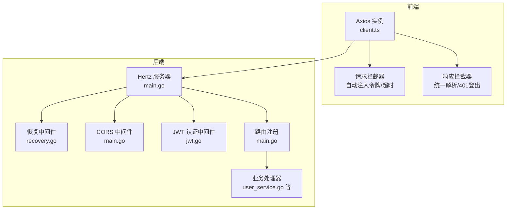
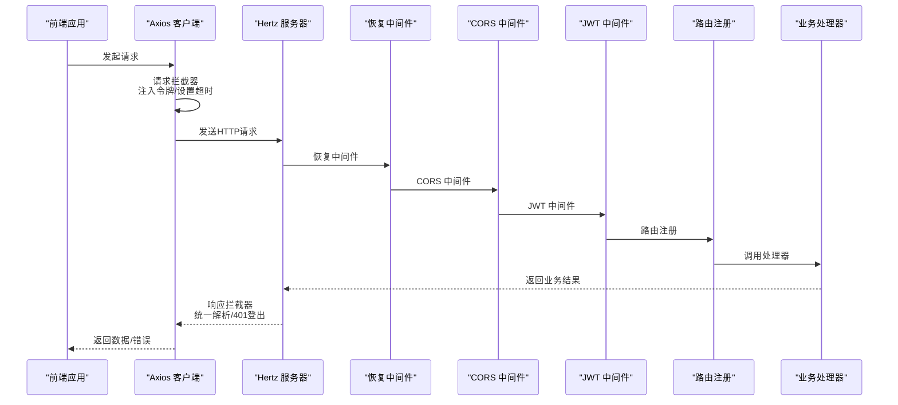
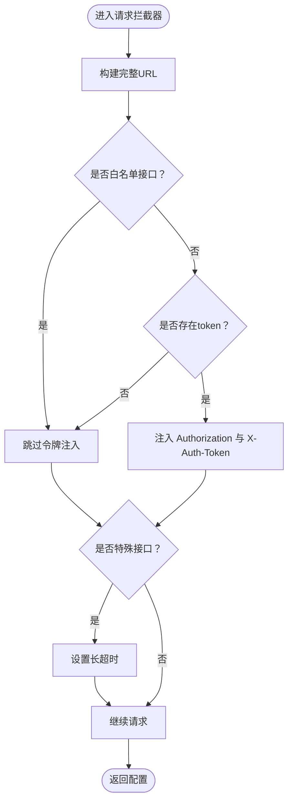
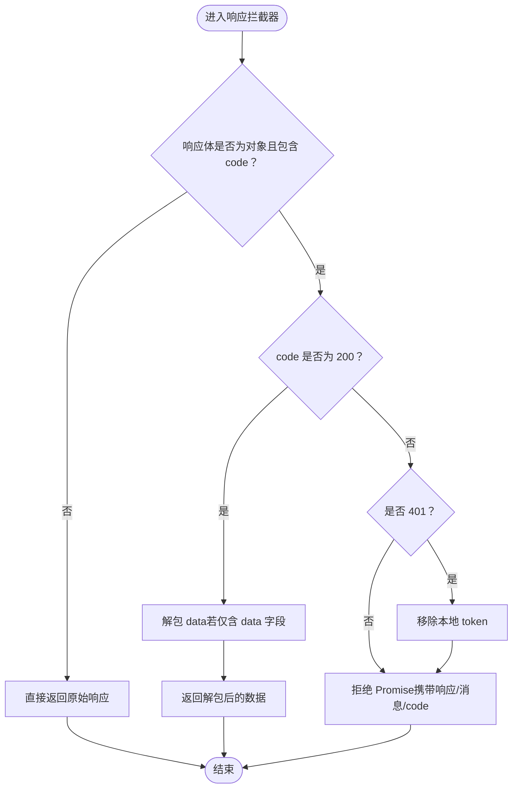
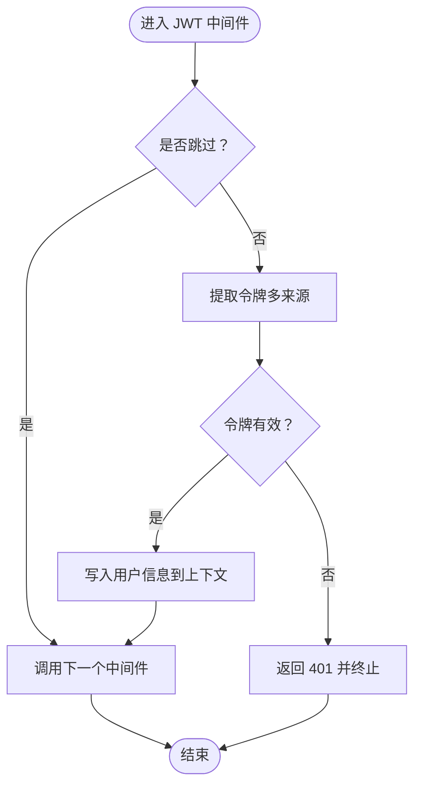
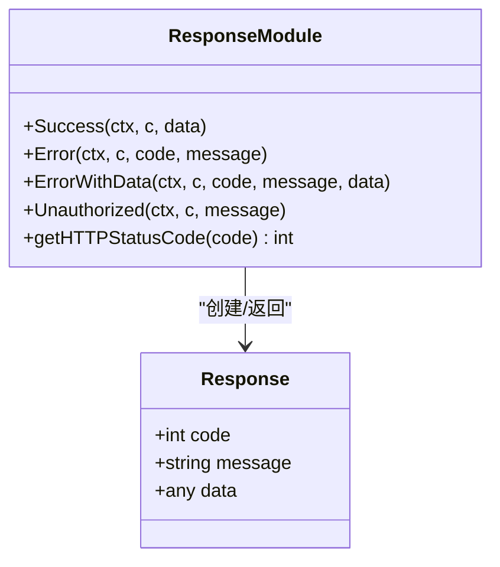
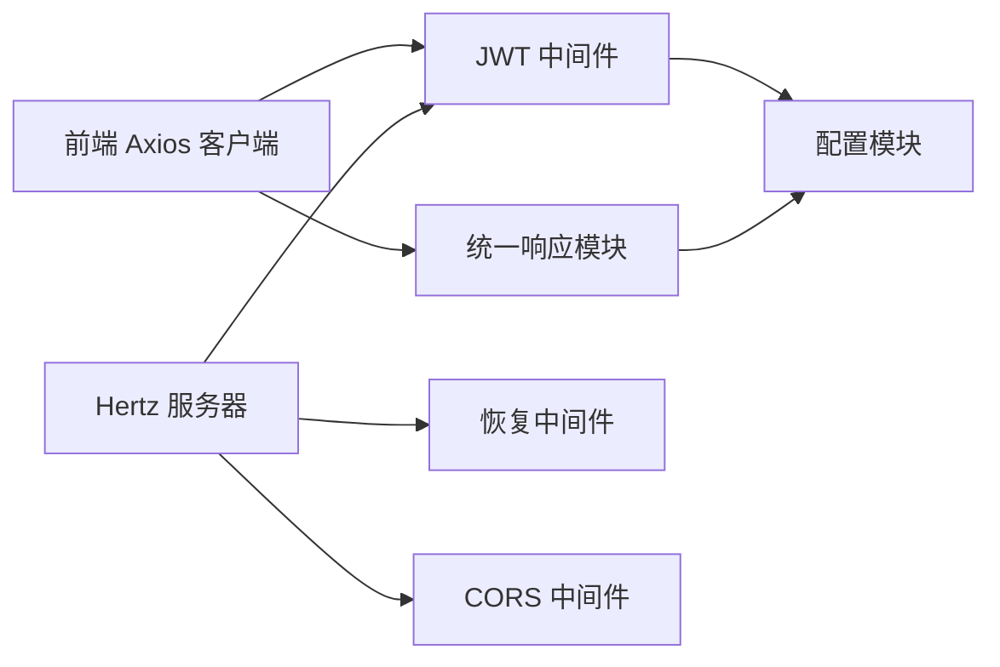

# 请求响应拦截器

<cite>
**本文引用的文件**
- [后端主程序 main.go](file://backend/main.go)
- [JWT中间件 jwt.go](file://backend/internal/middleware/jwt.go)
- [统一响应 response.go](file://backend/api/response/response.go)
- [恢复中间件 recovery.go](file://backend/api/router/middleware/recovery.go)
- [面试路由中间件 middleware.go](file://backend/api/router/interview/middleware.go)
- [前端API客户端 client.ts](file://frontend/src/services/api/client.ts)
- [配置 config.go](file://backend/internal/config/config.go)
- [调试网络工具 main.go](file://backend/cmd/debug_network/main.go)
</cite>

## 目录
1. [简介](#简介)
2. [项目结构](#项目结构)
3. [核心组件](#核心组件)
4. [架构总览](#架构总览)
5. [详细组件分析](#详细组件分析)
6. [依赖关系分析](#依赖关系分析)
7. [性能考量](#性能考量)
8. [故障排查指南](#故障排查指南)
9. [结论](#结论)

## 简介
本文件系统化梳理了本项目的请求与响应拦截器体系，覆盖以下关键能力：
- 请求拦截器：认证令牌自动注入、URL白名单机制、特殊接口超时配置
- 响应拦截器：统一响应格式解析、错误码处理、401状态自动登出
- 拦截器链执行顺序与异常处理策略
- 自定义拦截器扩展方法与最佳实践
- 调试技巧与常见问题排查

## 项目结构
本项目采用前后端分离架构，拦截器主要分布在：
- 前端：基于 Axios 的请求/响应拦截器
- 后端：基于 Hertz 的中间件（JWT认证、CORS、恢复中间件）

图表来源
- [后端主程序 main.go](file://backend/main.go#L101-L128)
- [恢复中间件 recovery.go](file://backend/api/router/middleware/recovery.go#L15-L34)
- [JWT中间件 jwt.go](file://backend/internal/middleware/jwt.go#L32-L78)
- [前端API客户端 client.ts](file://frontend/src/services/api/client.ts#L1-L63)

章节来源
- [后端主程序 main.go](file://backend/main.go#L101-L128)
- [前端API客户端 client.ts](file://frontend/src/services/api/client.ts#L1-L63)

## 核心组件
- 前端 Axios 请求拦截器
  - 自动注入 Authorization 与 X-Auth-Token
  - 白名单接口（注册/登录/注销）不注入令牌
  - 特殊接口（面试评估/答题记录）设置较长超时
- 前端 Axios 响应拦截器
  - 统一解析后端标准响应结构
  - 对 401 错误移除本地令牌并拒绝 Promise
- 后端 Hertz 中间件
  - 恢复中间件：捕获 panic，统一返回内部错误
  - CORS 中间件：处理跨域与 OPTIONS 预检
  - JWT 中间件：从多来源提取令牌，校验并写入上下文
- 统一响应模块
  - 标准响应结构与错误码映射 HTTP 状态码

章节来源
- [前端API客户端 client.ts](file://frontend/src/services/api/client.ts#L12-L60)
- [JWT中间件 jwt.go](file://backend/internal/middleware/jwt.go#L32-L78)
- [统一响应 response.go](file://backend/api/response/response.go#L13-L119)
- [恢复中间件 recovery.go](file://backend/api/router/middleware/recovery.go#L15-L34)
- [后端主程序 main.go](file://backend/main.go#L104-L125)

## 架构总览
拦截器链在后端按注册顺序执行，前端 Axios 在请求/响应阶段分别拦截。

图表来源
- [后端主程序 main.go](file://backend/main.go#L104-L128)
- [JWT中间件 jwt.go](file://backend/internal/middleware/jwt.go#L32-L78)
- [恢复中间件 recovery.go](file://backend/api/router/middleware/recovery.go#L15-L34)
- [前端API客户端 client.ts](file://frontend/src/services/api/client.ts#L12-L60)

## 详细组件分析

### 前端请求拦截器
- 令牌注入策略
  - 仅对非白名单接口注入 Authorization 与 X-Auth-Token
  - 令牌来源于 localStorage
- URL白名单机制
  - 注册、登录、注销接口不注入令牌
- 特殊接口超时配置
  - 面试评估与答题记录接口设置较长超时（毫秒级）

图表来源
- [前端API客户端 client.ts](file://frontend/src/services/api/client.ts#L12-L33)

章节来源
- [前端API客户端 client.ts](file://frontend/src/services/api/client.ts#L12-L33)

### 前端响应拦截器
- 统一响应格式解析
  - 若响应体包含 code 字段，按 code 判断
  - code 为 200 时返回 data 字段；若 data 仅含 data 字段，则进一步解包
- 错误码处理
  - code 非 200 时，构造错误对象并拒绝 Promise
- 401 状态自动登出
  - 当后端返回 401 或响应体 code 为 401 时，清除本地 token

图表来源
- [前端API客户端 client.ts](file://frontend/src/services/api/client.ts#L35-L60)

章节来源
- [前端API客户端 client.ts](file://frontend/src/services/api/client.ts#L35-L60)

### 后端 JWT 中间件
- 令牌提取顺序
  - Authorization: Bearer
  - X-Auth-Token
  - 查询参数 token
  - Cookie: token
- 校验与上下文注入
  - 校验失败返回 401
  - 成功后将用户信息写入上下文
- 白名单跳过
  - 通过 AuthSkipper 判断是否跳过 JWT 校验
  - OPTIONS 预检请求自动跳过

图表来源
- [JWT中间件 jwt.go](file://backend/internal/middleware/jwt.go#L32-L78)
- [面试路由中间件 middleware.go](file://backend/api/router/interview/middleware.go#L13-L36)

章节来源
- [JWT中间件 jwt.go](file://backend/internal/middleware/jwt.go#L32-L78)
- [面试路由中间件 middleware.go](file://backend/api/router/interview/middleware.go#L13-L36)

### 统一响应模块
- 标准响应结构
  - code、message、data
- 错误码到 HTTP 状态码映射
  - 通过 getHTTPStatusCode 将业务 code 映射到 HTTP 状态码
- 错误处理便捷函数
  - Error、ErrorWithData、Success、Unauthorized 等

图表来源
- [统一响应 response.go](file://backend/api/response/response.go#L13-L119)

章节来源
- [统一响应 response.go](file://backend/api/response/response.go#L13-L119)

### 恢复中间件与 CORS
- 恢复中间件
  - 捕获 panic，记录堆栈，返回统一内部错误
- CORS 中间件
  - 设置允许的 Origin/Methods/Headers
  - 对 OPTIONS 预检请求直接返回 204

章节来源
- [恢复中间件 recovery.go](file://backend/api/router/middleware/recovery.go#L15-L34)
- [后端主程序 main.go](file://backend/main.go#L109-L125)

### 拦截器链执行顺序与异常处理策略
- 后端执行顺序
  - Recovery（捕获 panic）
  - CORS（处理跨域与预检）
  - JWT（认证校验与上下文注入）
  - 路由注册与业务处理器
- 异常处理
  - 恢复中间件保证服务稳定性
  - JWT 中间件在失败时返回 401
  - 统一响应模块确保错误格式一致

章节来源
- [后端主程序 main.go](file://backend/main.go#L104-L128)
- [恢复中间件 recovery.go](file://backend/api/router/middleware/recovery.go#L15-L34)
- [JWT中间件 jwt.go](file://backend/internal/middleware/jwt.go#L32-L78)
- [统一响应 response.go](file://backend/api/response/response.go#L80-L88)

### 自定义拦截器扩展方法与最佳实践
- 扩展点
  - 前端：在 Axios 实例上添加新的请求/响应拦截器
  - 后端：在 Hertz 服务器上注册新的中间件
- 最佳实践
  - 明确白名单范围，避免泄露敏感接口
  - 统一错误处理与日志记录
  - 对长耗时接口设置合理超时
  - 严格校验令牌来源与格式

章节来源
- [前端API客户端 client.ts](file://frontend/src/services/api/client.ts#L12-L60)
- [后端主程序 main.go](file://backend/main.go#L104-L128)

## 依赖关系分析
- 前端 Axios 依赖于统一响应格式与后端接口约定
- 后端中间件依赖于统一响应模块与配置模块
- JWT 中间件依赖于配置模块提供的密钥与过期时间

图表来源
- [前端API客户端 client.ts](file://frontend/src/services/api/client.ts#L1-L63)
- [JWT中间件 jwt.go](file://backend/internal/middleware/jwt.go#L80-L113)
- [统一响应 response.go](file://backend/api/response/response.go#L13-L119)
- [后端主程序 main.go](file://backend/main.go#L104-L128)
- [配置 config.go](file://backend/internal/config/config.go#L113-L118)

章节来源
- [前端API客户端 client.ts](file://frontend/src/services/api/client.ts#L1-L63)
- [JWT中间件 jwt.go](file://backend/internal/middleware/jwt.go#L80-L113)
- [统一响应 response.go](file://backend/api/response/response.go#L13-L119)
- [后端主程序 main.go](file://backend/main.go#L104-L128)
- [配置 config.go](file://backend/internal/config/config.go#L113-L118)

## 性能考量
- 前端
  - 对长耗时接口设置合理超时，避免阻塞
  - 仅在必要接口注入令牌，减少不必要的头部
- 后端
  - JWT 校验为轻量操作，但需注意密钥与过期时间配置
  - CORS 预检缓存可减少重复请求

[本节为通用指导，无需列出具体文件来源]

## 故障排查指南
- 常见问题
  - 401 未授权：检查前端是否正确注入令牌，后端 JWT 中间件是否生效
  - 跨域失败：确认 CORS 中间件配置与预检缓存设置
  - 接口超时：检查前端特殊接口超时配置与后端读写超时设置
- 调试技巧
  - 使用调试网络工具观察底层 HTTP 请求/响应
  - 查看恢复中间件日志定位 panic 位置
  - 在前端控制台打印拦截器处理结果

章节来源
- [调试网络工具 main.go](file://backend/cmd/debug_network/main.go#L14-L28)
- [恢复中间件 recovery.go](file://backend/api/router/middleware/recovery.go#L15-L34)
- [后端主程序 main.go](file://backend/main.go#L109-L125)

## 结论
本项目的拦截器体系在前后端形成闭环：前端负责请求/响应层面的标准化与用户体验优化，后端通过中间件保障安全性与稳定性。通过白名单机制、多来源令牌提取、统一响应与异常处理，系统具备良好的可维护性与扩展性。建议在新增接口时明确其安全边界，并遵循统一的拦截器扩展规范。