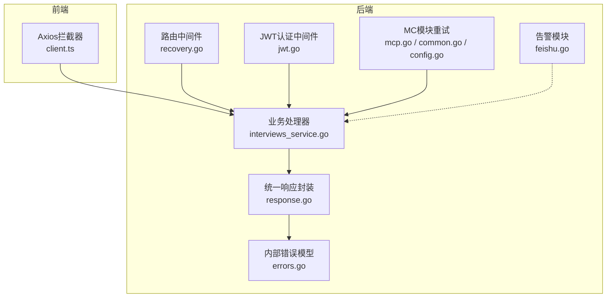
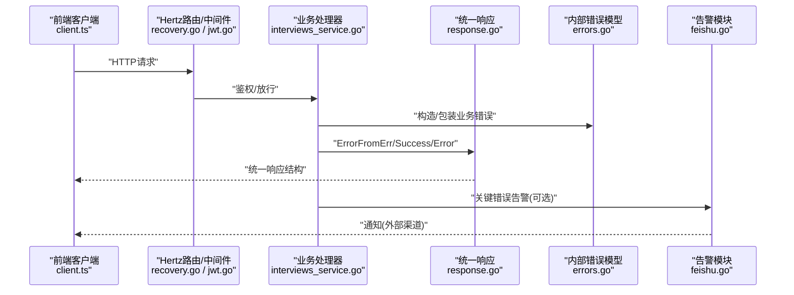
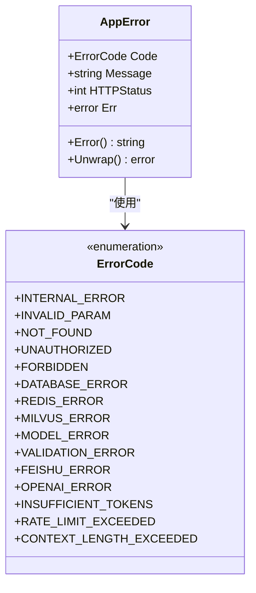
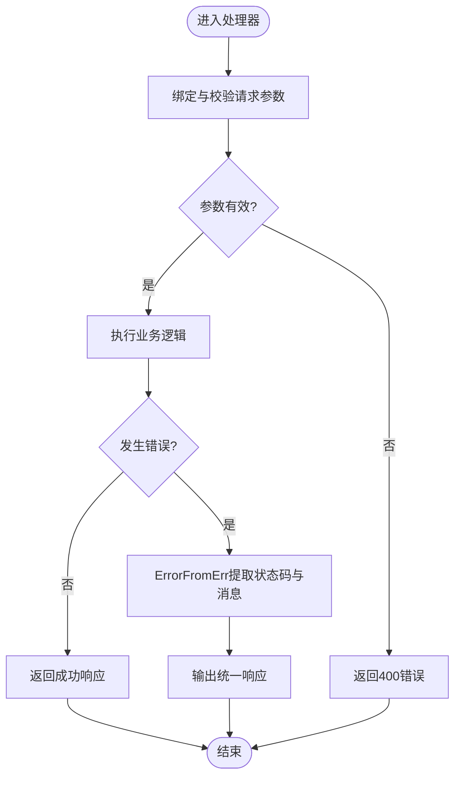
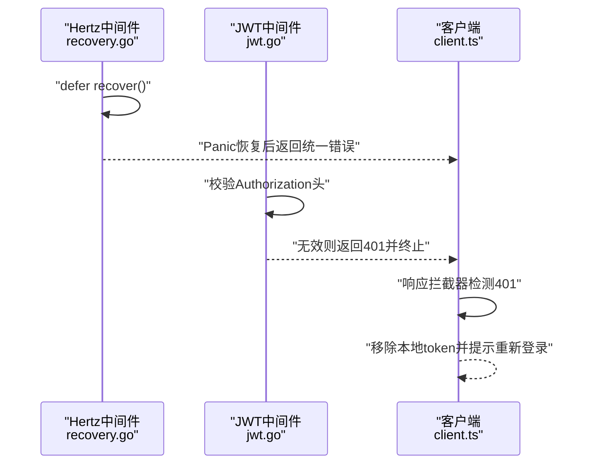
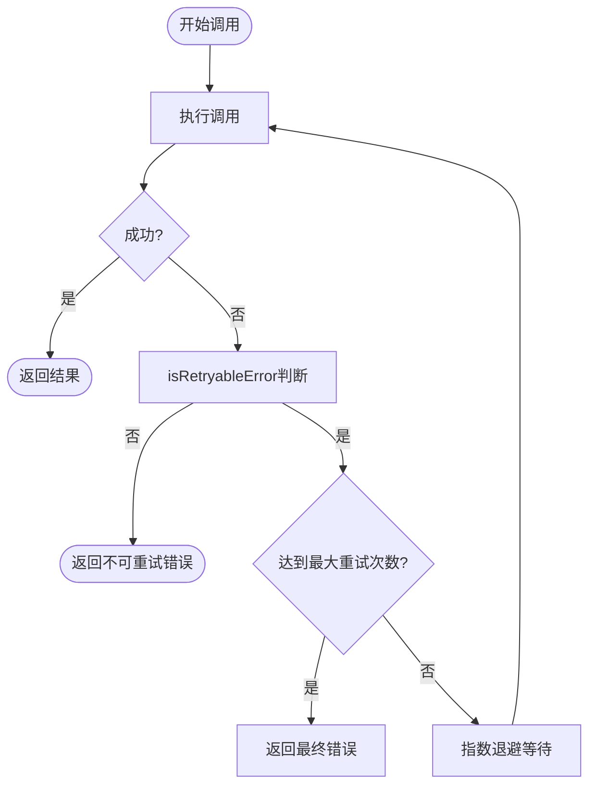
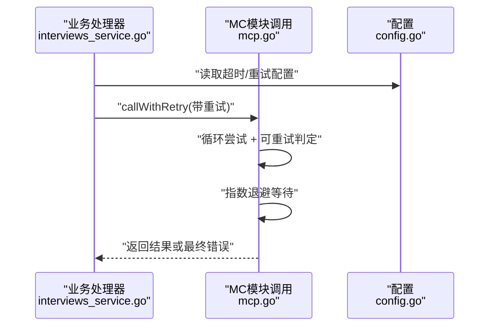
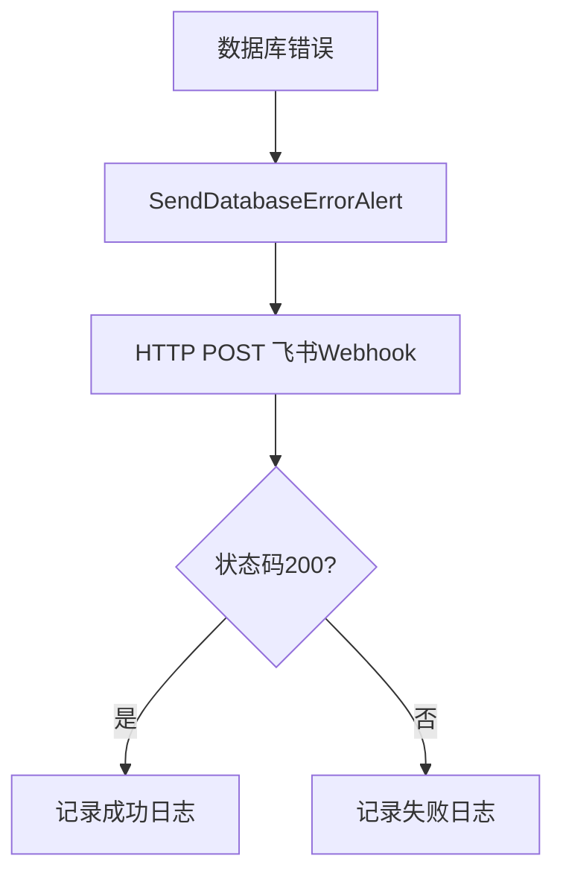
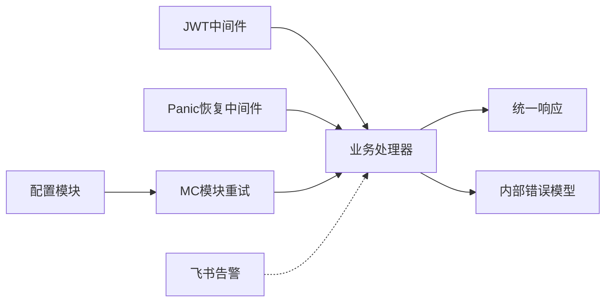

# 错误处理策略

<cite>
**本文引用的文件**
- [recovery.go](file://backend/api/router/middleware/recovery.go)
- [errors.go](file://backend/internal/errors/errors.go)
- [response.go](file://backend/api/response/response.go)
- [jwt.go](file://backend/internal/middleware/jwt.go)
- [middleware.go](file://backend/api/router/interview/middleware.go)
- [feishu.go](file://backend/internal/alert/feishu.go)
- [mcp.go](file://backend/mcp-moduel/internal/client/mcp.go)
- [common.go](file://backend/mcp-moduel/internal/client/common.go)
- [config.go](file://backend/mcp-moduel/internal/config/config.go)
- [interviews_service.go](file://backend/api/handler/interview/interviews_service.go)
- [client.ts](file://frontend/src/services/api/client.ts)
</cite>

## 目录
1. [简介](#简介)
2. [项目结构](#项目结构)
3. [核心组件](#核心组件)
4. [架构总览](#架构总览)
5. [详细组件分析](#详细组件分析)
6. [依赖关系分析](#依赖关系分析)
7. [性能考量](#性能考量)
8. [故障排查指南](#故障排查指南)
9. [结论](#结论)
10. [附录](#附录)

## 简介
本文件系统性梳理并总结本项目的统一错误处理策略，覆盖以下方面：
- 统一错误模型与HTTP状态码映射
- 业务错误码解析与分类
- 网络错误分类与可重试判定
- 错误拦截器与自动登出机制
- 错误恢复策略与指数退避重试
- 错误日志记录与监控告警集成
- 用户体验优化与降级处理

## 项目结构
后端采用“路由中间件 + 业务处理器 + 统一响应 + 内部错误模型”的分层设计；前端通过Axios拦截器进行统一错误处理与自动登出。

图表来源
- [recovery.go](file://backend/api/router/middleware/recovery.go#L15-L34)
- [jwt.go](file://backend/internal/middleware/jwt.go#L32-L78)
- [interviews_service.go](file://backend/api/handler/interview/interviews_service.go#L26-L53)
- [errors.go](file://backend/internal/errors/errors.go#L31-L72)
- [response.go](file://backend/api/response/response.go#L13-L88)
- [feishu.go](file://backend/internal/alert/feishu.go#L24-L78)
- [mcp.go](file://backend/mcp-moduel/internal/client/mcp.go#L100-L145)
- [common.go](file://backend/mcp-moduel/internal/client/common.go#L161-L209)
- [config.go](file://backend/mcp-moduel/internal/config/config.go#L117-L127)
- [client.ts](file://frontend/src/services/api/client.ts#L12-L60)

章节来源
- [recovery.go](file://backend/api/router/middleware/recovery.go#L15-L34)
- [jwt.go](file://backend/internal/middleware/jwt.go#L32-L78)
- [interviews_service.go](file://backend/api/handler/interview/interviews_service.go#L26-L53)
- [errors.go](file://backend/internal/errors/errors.go#L31-L72)
- [response.go](file://backend/api/response/response.go#L13-L88)
- [feishu.go](file://backend/internal/alert/feishu.go#L24-L78)
- [mcp.go](file://backend/mcp-moduel/internal/client/mcp.go#L100-L145)
- [common.go](file://backend/mcp-moduel/internal/client/common.go#L161-L209)
- [config.go](file://backend/mcp-moduel/internal/config/config.go#L117-L127)
- [client.ts](file://frontend/src/services/api/client.ts#L12-L60)

## 核心组件
- 统一错误模型与HTTP状态码映射：内部错误模型定义业务错误码与HTTP状态码的对应关系，并在响应层进行转换。
- 统一响应封装：所有HTTP响应遵循统一结构，便于前端解析与展示。
- 错误拦截器：后端Panic恢复中间件与前端Axios拦截器分别负责服务端与客户端的错误拦截与自动登出。
- 网络错误分类与可重试判定：基于错误关键字判断是否可重试，并结合指数退避策略。
- 告警与监控：飞书告警模块对数据库等关键错误进行告警，辅助运维监控。

章节来源
- [errors.go](file://backend/internal/errors/errors.go#L9-L29)
- [response.go](file://backend/api/response/response.go#L13-L88)
- [recovery.go](file://backend/api/router/middleware/recovery.go#L15-L34)
- [client.ts](file://frontend/src/services/api/client.ts#L35-L60)
- [common.go](file://backend/mcp-moduel/internal/client/common.go#L161-L209)
- [mcp.go](file://backend/mcp-moduel/internal/client/mcp.go#L100-L145)
- [feishu.go](file://backend/internal/alert/feishu.go#L24-L78)

## 架构总览
下图展示了从请求进入后端到错误处理与告警的全链路流程。

图表来源
- [client.ts](file://frontend/src/services/api/client.ts#L12-L60)
- [recovery.go](file://backend/api/router/middleware/recovery.go#L15-L34)
- [jwt.go](file://backend/internal/middleware/jwt.go#L32-L78)
- [interviews_service.go](file://backend/api/handler/interview/interviews_service.go#L26-L53)
- [response.go](file://backend/api/response/response.go#L80-L88)
- [errors.go](file://backend/internal/errors/errors.go#L62-L72)
- [feishu.go](file://backend/internal/alert/feishu.go#L24-L78)

## 详细组件分析

### 统一错误模型与HTTP状态码映射
- 业务错误码类型：定义了多种业务错误码，覆盖通用错误、参数校验、数据库、缓存、模型API、第三方服务等场景。
- AppError结构：包含业务错误码、用户友好消息、HTTP状态码以及底层错误，支持错误链追踪。
- 预定义错误构造函数：针对不同场景提供便捷构造方法，自动映射合适的HTTP状态码。
- 模型API错误细分：根据底层错误字符串特征，将模型API错误细分为配额不足、频率限制、上下文超限等，并映射到相应HTTP状态码。

图表来源
- [errors.go](file://backend/internal/errors/errors.go#L9-L29)
- [errors.go](file://backend/internal/errors/errors.go#L31-L51)

章节来源
- [errors.go](file://backend/internal/errors/errors.go#L9-L29)
- [errors.go](file://backend/internal/errors/errors.go#L31-L51)
- [errors.go](file://backend/internal/errors/errors.go#L74-L151)

### 统一响应封装与错误消息提取
- 统一响应结构：包含业务码、消息与数据，便于前后端一致解析。
- 错误响应函数：提供多种错误响应快捷方法，并通过状态码映射函数将业务码转换为HTTP状态码。
- ErrorFromErr：自动识别内部错误模型，提取HTTP状态码与消息，确保错误一致性。
- 前端消息提取：Axios响应拦截器解析后端统一响应，当业务码为401时触发自动登出。

图表来源
- [response.go](file://backend/api/response/response.go#L13-L88)
- [interviews_service.go](file://backend/api/handler/interview/interviews_service.go#L26-L53)

章节来源
- [response.go](file://backend/api/response/response.go#L13-L88)
- [interviews_service.go](file://backend/api/handler/interview/interviews_service.go#L26-L53)
- [client.ts](file://frontend/src/services/api/client.ts#L35-L60)

### 错误拦截器与自动登出机制
- 后端Panic恢复中间件：捕获服务端panic，记录堆栈并返回统一内部错误响应，避免进程崩溃。
- JWT认证中间件：对未携带或无效的认证头返回401，终止后续处理。
- 前端拦截器：当响应码为401或请求拦截器检测到401时，清除本地token并中断流程，引导用户重新登录。

图表来源
- [recovery.go](file://backend/api/router/middleware/recovery.go#L15-L34)
- [jwt.go](file://backend/internal/middleware/jwt.go#L32-L78)
- [client.ts](file://frontend/src/services/api/client.ts#L35-L60)

章节来源
- [recovery.go](file://backend/api/router/middleware/recovery.go#L15-L34)
- [jwt.go](file://backend/internal/middleware/jwt.go#L32-L78)
- [client.ts](file://frontend/src/services/api/client.ts#L35-L60)

### 网络错误分类与可重试判定
- 可重试错误关键字：包含超时、连接、网络、临时、不可用、502/503/504等，通常可重试。
- 不可重试错误关键字：包含认证、授权、未授权、禁止、400/401/403/404、非法、解析等，不应重试。
- 指数退避策略：每次重试等待时间按2的幂次递增，避免雪崩效应。
- 上下文取消：在重试等待期间若上下文被取消，立即停止重试并返回错误。

图表来源
- [common.go](file://backend/mcp-moduel/internal/client/common.go#L161-L209)
- [mcp.go](file://backend/mcp-moduel/internal/client/mcp.go#L100-L145)

章节来源
- [common.go](file://backend/mcp-moduel/internal/client/common.go#L161-L209)
- [mcp.go](file://backend/mcp-moduel/internal/client/mcp.go#L100-L145)

### 错误恢复策略与重试机制设计
- 配置层面：提供超时与重试次数的默认值与校验，确保配置合理。
- 调用层面：在工具调用中实现带重试的执行流程，结合可重试判定与指数退避。
- 前端层面：对401错误进行自动登出，提升用户体验与安全性。

图表来源
- [interviews_service.go](file://backend/api/handler/interview/interviews_service.go#L26-L53)
- [mcp.go](file://backend/mcp-moduel/internal/client/mcp.go#L100-L145)
- [config.go](file://backend/mcp-moduel/internal/config/config.go#L117-L127)

章节来源
- [config.go](file://backend/mcp-moduel/internal/config/config.go#L117-L127)
- [mcp.go](file://backend/mcp-moduel/internal/client/mcp.go#L100-L145)

### 错误日志记录与监控集成
- 飞书告警：对数据库等关键错误进行告警，包含标题、内容与时间戳，便于运维快速定位。
- 日志记录：服务端Panic恢复中间件记录堆栈信息，便于问题溯源。
- 监控建议：可在关键错误路径增加指标埋点，结合告警通道实现闭环监控。

图表来源
- [feishu.go](file://backend/internal/alert/feishu.go#L24-L78)

章节来源
- [feishu.go](file://backend/internal/alert/feishu.go#L24-L78)

### 用户体验优化与降级处理
- 前端自动登出：401时清除本地token，避免重复失败请求。
- 统一错误消息：后端返回统一结构，前端可稳定解析并展示用户可理解的消息。
- 降级策略：对于可重试的网络错误，采用指数退避；对于不可重试错误，直接反馈用户并引导重试或检查输入。

章节来源
- [client.ts](file://frontend/src/services/api/client.ts#L35-L60)
- [response.go](file://backend/api/response/response.go#L80-L88)

## 依赖关系分析
- 业务处理器依赖统一响应与内部错误模型，保证错误处理的一致性。
- JWT中间件与路由中间件共同保障鉴权与异常恢复。
- MC模块的重试机制与配置模块协同，确保对外部服务调用的稳定性。
- 告警模块独立于业务，仅在关键错误时触发，降低耦合度。

图表来源
- [interviews_service.go](file://backend/api/handler/interview/interviews_service.go#L26-L53)
- [response.go](file://backend/api/response/response.go#L80-L88)
- [errors.go](file://backend/internal/errors/errors.go#L62-L72)
- [jwt.go](file://backend/internal/middleware/jwt.go#L32-L78)
- [recovery.go](file://backend/api/router/middleware/recovery.go#L15-L34)
- [mcp.go](file://backend/mcp-moduel/internal/client/mcp.go#L100-L145)
- [config.go](file://backend/mcp-moduel/internal/config/config.go#L117-L127)
- [feishu.go](file://backend/internal/alert/feishu.go#L24-L78)

章节来源
- [interviews_service.go](file://backend/api/handler/interview/interviews_service.go#L26-L53)
- [response.go](file://backend/api/response/response.go#L80-L88)
- [errors.go](file://backend/internal/errors/errors.go#L62-L72)
- [jwt.go](file://backend/internal/middleware/jwt.go#L32-L78)
- [recovery.go](file://backend/api/router/middleware/recovery.go#L15-L34)
- [mcp.go](file://backend/mcp-moduel/internal/client/mcp.go#L100-L145)
- [config.go](file://backend/mcp-moduel/internal/config/config.go#L117-L127)
- [feishu.go](file://backend/internal/alert/feishu.go#L24-L78)

## 性能考量
- 指数退避避免瞬时并发放大，但需结合最大重试次数与超时配置，防止长时间阻塞。
- 前端对401的自动登出减少无效请求，提升整体吞吐。
- 统一错误模型与响应结构降低序列化与解析成本，提高接口稳定性。

## 故障排查指南
- 401未授权：检查前端是否正确注入Authorization头，后端JWT中间件是否生效。
- 500内部错误：查看Panic恢复中间件日志中的堆栈信息，定位具体处理器。
- 数据库错误：通过飞书告警查看错误详情与重试次数，结合日志定位根因。
- 网络错误：确认是否属于可重试错误，调整重试次数与超时配置。

章节来源
- [jwt.go](file://backend/internal/middleware/jwt.go#L32-L78)
- [recovery.go](file://backend/api/router/middleware/recovery.go#L15-L34)
- [feishu.go](file://backend/internal/alert/feishu.go#L69-L78)
- [common.go](file://backend/mcp-moduel/internal/client/common.go#L161-L209)

## 结论
本项目建立了完善的统一错误处理体系：以内部错误模型为核心，配合统一响应封装、Panic恢复中间件、JWT认证中间件与前端拦截器，实现了HTTP状态码映射、业务错误码解析、网络错误分类与可重试判定、错误恢复与指数退避、以及告警与监控集成。该策略在保证系统稳定性的同时，提升了用户体验与可观测性。

## 附录
- 关键文件路径与职责概览
  - [recovery.go](file://backend/api/router/middleware/recovery.go)：服务端Panic恢复
  - [jwt.go](file://backend/internal/middleware/jwt.go)：JWT认证与用户信息注入
  - [errors.go](file://backend/internal/errors/errors.go)：内部错误模型与构造函数
  - [response.go](file://backend/api/response/response.go)：统一响应与状态码映射
  - [feishu.go](file://backend/internal/alert/feishu.go)：飞书告警
  - [mcp.go](file://backend/mcp-moduel/internal/client/mcp.go)：带重试的工具调用
  - [common.go](file://backend/mcp-moduel/internal/client/common.go)：可重试判定
  - [config.go](file://backend/mcp-moduel/internal/config/config.go)：配置校验与默认值
  - [interviews_service.go](file://backend/api/handler/interview/interviews_service.go)：业务处理器示例
  - [client.ts](file://frontend/src/services/api/client.ts)：前端拦截器与自动登出