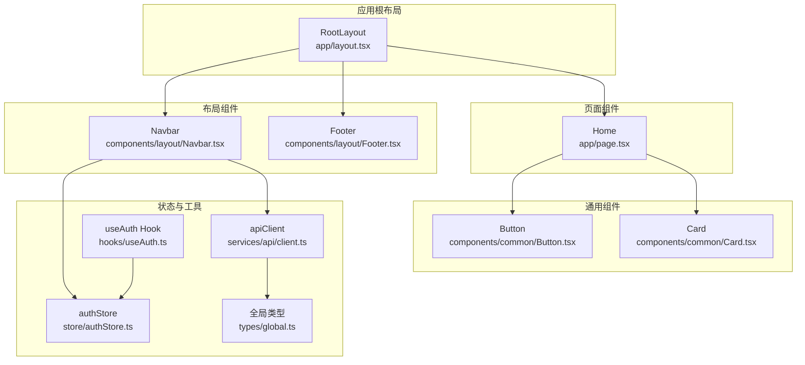
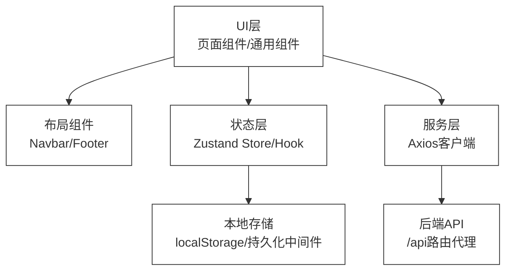
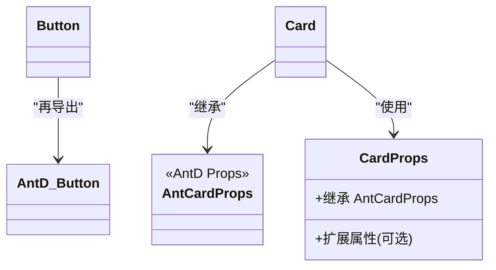
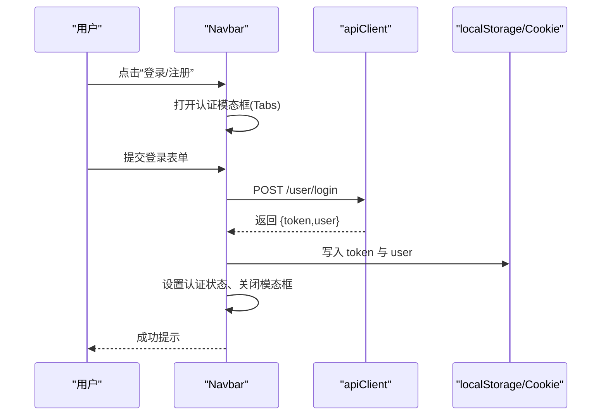
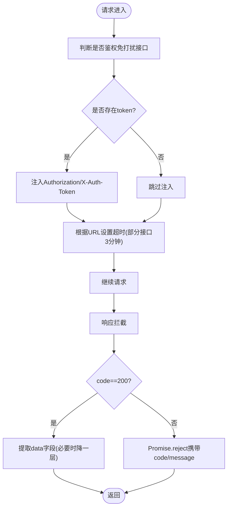
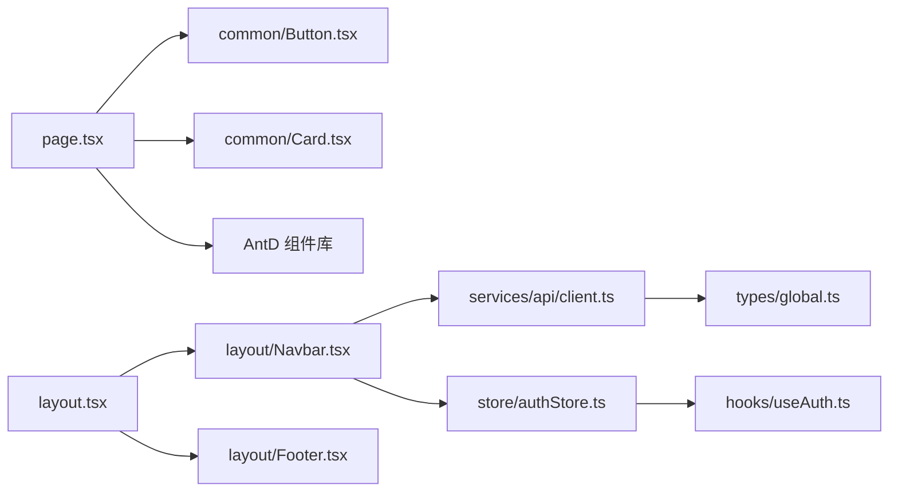

# UI组件架构

<cite>
**本文引用的文件**
- [frontend/src/components/common/Button.tsx](file://frontend/src/components/common/Button.tsx)
- [frontend/src/components/common/Card.tsx](file://frontend/src/components/common/Card.tsx)
- [frontend/src/components/layout/Footer.tsx](file://frontend/src/components/layout/Footer.tsx)
- [frontend/src/components/layout/Navbar.tsx](file://frontend/src/components/layout/Navbar.tsx)
- [frontend/src/app/layout.tsx](file://frontend/src/app/layout.tsx)
- [frontend/src/app/page.tsx](file://frontend/src/app/page.tsx)
- [frontend/src/hooks/useAuth.ts](file://frontend/src/hooks/useAuth.ts)
- [frontend/src/store/authStore.ts](file://frontend/src/store/authStore.ts)
- [frontend/src/services/api/client.ts](file://frontend/src/services/api/client.ts)
- [frontend/src/types/global.ts](file://frontend/src/types/global.ts)
- [frontend/package.json](file://frontend/package.json)
- [frontend/next.config.js](file://frontend/next.config.js)
- [frontend/tailwind.config.js](file://frontend/tailwind.config.js)
</cite>

## 目录
1. [简介](#简介)
2. [项目结构](#项目结构)
3. [核心组件](#核心组件)
4. [架构总览](#架构总览)
5. [组件详解](#组件详解)
6. [依赖关系分析](#依赖关系分析)
7. [性能考量](#性能考量)
8. [故障排查指南](#故障排查指南)
9. [结论](#结论)
10. [附录](#附录)

## 简介
本文件系统性梳理前端UI组件架构，围绕通用组件、页面组件与布局组件三类进行设计原则说明；深入阐释Ant Design组件库的集成与定制化策略；总结Props接口设计、事件处理与状态管理的最佳实践；给出组件复用与组合模式的应用范式；提供组件测试与Storybook使用建议；并覆盖性能优化、懒加载与无障碍、响应式设计等工程化要点。

## 项目结构
前端采用Next.js应用结构，按功能域组织组件与页面：
- 布局组件：位于components/layout，负责全局导航与页脚
- 通用组件：位于components/common，封装AntD基础组件的薄封装
- 页面组件：位于app目录，按路由组织页面
- 工具与状态：hooks、store、services、types等

图表来源
- [frontend/src/app/layout.tsx](file://frontend/src/app/layout.tsx#L14-L24)
- [frontend/src/components/layout/Navbar.tsx](file://frontend/src/components/layout/Navbar.tsx#L1-L457)
- [frontend/src/components/layout/Footer.tsx](file://frontend/src/components/layout/Footer.tsx#L1-L31)
- [frontend/src/components/common/Button.tsx](file://frontend/src/components/common/Button.tsx#L1-L6)
- [frontend/src/components/common/Card.tsx](file://frontend/src/components/common/Card.tsx#L1-L14)
- [frontend/src/app/page.tsx](file://frontend/src/app/page.tsx#L1-L507)
- [frontend/src/store/authStore.ts](file://frontend/src/store/authStore.ts#L1-L31)
- [frontend/src/hooks/useAuth.ts](file://frontend/src/hooks/useAuth.ts#L1-L16)
- [frontend/src/services/api/client.ts](file://frontend/src/services/api/client.ts#L1-L63)
- [frontend/src/types/global.ts](file://frontend/src/types/global.ts#L1-L55)

章节来源
- [frontend/src/app/layout.tsx](file://frontend/src/app/layout.tsx#L1-L25)
- [frontend/src/components/layout/Navbar.tsx](file://frontend/src/components/layout/Navbar.tsx#L1-L457)
- [frontend/src/components/layout/Footer.tsx](file://frontend/src/components/layout/Footer.tsx#L1-L31)
- [frontend/src/components/common/Button.tsx](file://frontend/src/components/common/Button.tsx#L1-L6)
- [frontend/src/components/common/Card.tsx](file://frontend/src/components/common/Card.tsx#L1-L14)
- [frontend/src/app/page.tsx](file://frontend/src/app/page.tsx#L1-L507)
- [frontend/src/store/authStore.ts](file://frontend/src/store/authStore.ts#L1-L31)
- [frontend/src/hooks/useAuth.ts](file://frontend/src/hooks/useAuth.ts#L1-L16)
- [frontend/src/services/api/client.ts](file://frontend/src/services/api/client.ts#L1-L63)
- [frontend/src/types/global.ts](file://frontend/src/types/global.ts#L1-L55)

## 核心组件
- 通用组件
  - Button：对Ant Design Button的轻量再导出，便于统一主题与样式扩展
  - Card：对Ant Design Card的薄封装，保留原生Props并可扩展自定义属性
- 布局组件
  - Navbar：全局导航栏，集成认证弹窗、下拉菜单、步骤引导等
  - Footer：全局页脚，展示版权与链接
- 页面组件
  - Home：首页聚合卡片、统计、FAQ折叠面板等，大量使用AntD组件
- 状态与工具
  - authStore：基于Zustand的状态存储，持久化保存认证信息
  - useAuth：认证相关Hook，暴露登录/登出与用户状态
  - apiClient：基于Axios的HTTP客户端，内置请求/响应拦截器与鉴权头注入
  - 全局类型：统一API响应、分页、用户与面试等类型定义

章节来源
- [frontend/src/components/common/Button.tsx](file://frontend/src/components/common/Button.tsx#L1-L6)
- [frontend/src/components/common/Card.tsx](file://frontend/src/components/common/Card.tsx#L1-L14)
- [frontend/src/components/layout/Navbar.tsx](file://frontend/src/components/layout/Navbar.tsx#L1-L457)
- [frontend/src/components/layout/Footer.tsx](file://frontend/src/components/layout/Footer.tsx#L1-L31)
- [frontend/src/app/page.tsx](file://frontend/src/app/page.tsx#L1-L507)
- [frontend/src/store/authStore.ts](file://frontend/src/store/authStore.ts#L1-L31)
- [frontend/src/hooks/useAuth.ts](file://frontend/src/hooks/useAuth.ts#L1-L16)
- [frontend/src/services/api/client.ts](file://frontend/src/services/api/client.ts#L1-L63)
- [frontend/src/types/global.ts](file://frontend/src/types/global.ts#L1-L55)

## 架构总览
整体采用“布局组件承载全局导航与页脚，页面组件承载业务内容，通用组件提供AntD薄封装”的分层架构。状态管理通过Zustand与本地存储结合，HTTP通信通过Axios拦截器统一处理鉴权与响应解包。

图表来源
- [frontend/src/app/layout.tsx](file://frontend/src/app/layout.tsx#L14-L24)
- [frontend/src/components/layout/Navbar.tsx](file://frontend/src/components/layout/Navbar.tsx#L1-L457)
- [frontend/src/store/authStore.ts](file://frontend/src/store/authStore.ts#L1-L31)
- [frontend/src/hooks/useAuth.ts](file://frontend/src/hooks/useAuth.ts#L1-L16)
- [frontend/src/services/api/client.ts](file://frontend/src/services/api/client.ts#L1-L63)
- [frontend/next.config.js](file://frontend/next.config.js#L1-L11)

## 组件详解

### 通用组件：Button 与 Card
- 设计原则
  - 轻薄封装：直接导出AntD组件，避免过度抽象
  - Props透传：确保AntD原生能力完整保留
  - 可扩展性：Card示例展示了如何在现有Props基础上追加自定义属性
- 接口设计
  - Button：无自定义Props，保持与AntD一致
  - Card：继承AntD CardProps，并声明可选扩展属性（示例）
- 复用策略
  - 在页面组件中统一引入，减少重复导入与主题分散
  - 通过Tailwind类名实现视觉一致性

图表来源
- [frontend/src/components/common/Card.tsx](file://frontend/src/components/common/Card.tsx#L5-L11)
- [frontend/src/components/common/Button.tsx](file://frontend/src/components/common/Button.tsx#L1-L6)

章节来源
- [frontend/src/components/common/Button.tsx](file://frontend/src/components/common/Button.tsx#L1-L6)
- [frontend/src/components/common/Card.tsx](file://frontend/src/components/common/Card.tsx#L1-L14)

### 布局组件：Navbar
- 设计原则
  - 客户端组件：使用“use client”确保交互能力
  - 组合模式：将导航、认证、通知、用户中心等功能模块组合
  - 状态管理：本地存储与Zustand结合，保证刷新后状态一致
- 关键流程
  - 登录/注册/忘记密码：表单校验、提交、消息提示、本地存储与Cookie写入
  - 退出登录：调用后端接口清理、移除本地存储、跳转首页
  - 引导模态框：首次登录后的步骤说明
- 事件与状态
  - 表单状态：Form.useForm绑定各Tab表单
  - 加载状态：忘记密码场景的loading
  - 路由跳转：Next.js useRouter进行页面跳转

图表来源
- [frontend/src/components/layout/Navbar.tsx](file://frontend/src/components/layout/Navbar.tsx#L45-L71)
- [frontend/src/services/api/client.ts](file://frontend/src/services/api/client.ts#L1-L63)

章节来源
- [frontend/src/components/layout/Navbar.tsx](file://frontend/src/components/layout/Navbar.tsx#L1-L457)
- [frontend/src/services/api/client.ts](file://frontend/src/services/api/client.ts#L1-L63)
- [frontend/src/store/authStore.ts](file://frontend/src/store/authStore.ts#L1-L31)
- [frontend/src/hooks/useAuth.ts](file://frontend/src/hooks/useAuth.ts#L1-L16)

### 布局组件：Footer
- 设计原则
  - 简洁稳定：仅展示版权与辅助链接
  - 主题一致：使用Tailwind类名与AntD Typography Text保持风格统一

章节来源
- [frontend/src/components/layout/Footer.tsx](file://frontend/src/components/layout/Footer.tsx#L1-L31)

### 页面组件：Home
- 设计原则
  - 组件组合：大量使用AntD组件（Typography、Button、Rate、Collapse、Avatar、Tag、Badge等）构建页面
  - 视觉层次：通过渐变、阴影、圆角等Tailwind类名营造现代感
  - 交互丰富：Collapse折叠面板、Tag徽标、Steps引导等
- 数据与展示
  - 展示区：统计卡片、特性卡片、用户评价、FAQ折叠面板
  - 导航：多种CTA按钮与外部链接

章节来源
- [frontend/src/app/page.tsx](file://frontend/src/app/page.tsx#L1-L507)

### 状态与工具
- Zustand Store
  - authStore：维护用户信息与认证状态，使用persist中间件持久化
  - useAuth：对外暴露登录/登出与状态读取
- Axios 客户端
  - 请求拦截：自动注入Authorization与X-Auth-Token，区分接口超时
  - 响应拦截：统一封装code/message/data结构，401清理token
- 类型系统
  - 全局类型：统一API响应、分页、用户、面试、简历等类型

图表来源
- [frontend/src/services/api/client.ts](file://frontend/src/services/api/client.ts#L13-L60)
- [frontend/src/types/global.ts](file://frontend/src/types/global.ts#L4-L8)

章节来源
- [frontend/src/store/authStore.ts](file://frontend/src/store/authStore.ts#L1-L31)
- [frontend/src/hooks/useAuth.ts](file://frontend/src/hooks/useAuth.ts#L1-L16)
- [frontend/src/services/api/client.ts](file://frontend/src/services/api/client.ts#L1-L63)
- [frontend/src/types/global.ts](file://frontend/src/types/global.ts#L1-L55)

## 依赖关系分析
- 组件依赖
  - 页面组件依赖通用组件与AntD组件
  - Navbar依赖apiClient与认证状态
  - RootLayout组合Navbar与Footer
- 外部依赖
  - Ant Design与Ant Design Icons
  - Tailwind CSS用于样式与响应式
  - Next.js路由与rewrites代理后端API

图表来源
- [frontend/src/app/page.tsx](file://frontend/src/app/page.tsx#L1-L507)
- [frontend/src/components/common/Button.tsx](file://frontend/src/components/common/Button.tsx#L1-L6)
- [frontend/src/components/common/Card.tsx](file://frontend/src/components/common/Card.tsx#L1-L14)
- [frontend/src/app/layout.tsx](file://frontend/src/app/layout.tsx#L1-L25)
- [frontend/src/components/layout/Navbar.tsx](file://frontend/src/components/layout/Navbar.tsx#L1-L457)
- [frontend/src/components/layout/Footer.tsx](file://frontend/src/components/layout/Footer.tsx#L1-L31)
- [frontend/src/services/api/client.ts](file://frontend/src/services/api/client.ts#L1-L63)
- [frontend/src/store/authStore.ts](file://frontend/src/store/authStore.ts#L1-L31)
- [frontend/src/hooks/useAuth.ts](file://frontend/src/hooks/useAuth.ts#L1-L16)
- [frontend/src/types/global.ts](file://frontend/src/types/global.ts#L1-L55)

章节来源
- [frontend/package.json](file://frontend/package.json#L11-L20)
- [frontend/next.config.js](file://frontend/next.config.js#L1-L11)
- [frontend/tailwind.config.js](file://frontend/tailwind.config.js#L1-L22)

## 性能考量
- 组件层面
  - 通用组件保持轻薄，避免不必要的重渲染
  - 页面组件中合理拆分区块，减少无关区域重绘
- 状态与网络
  - 使用Zustand局部状态，避免全局状态风暴
  - Axios拦截器统一处理鉴权与响应，减少页面内样板代码
- 样式与构建
  - Tailwind按需扫描路径配置，确保产物体积可控
  - Next.js自动代码分割与静态资源优化
- 进一步建议
  - 对高频交互组件使用React.memo与useMemo
  - 图片与富文本内容采用懒加载策略
  - 为关键路径启用预取与预连接

## 故障排查指南
- 认证相关
  - 登录后无状态更新：检查localStorage写入与Cookie设置、Zustand状态变更
  - 401未授权：确认拦截器是否正确注入Authorization头
- 网络请求
  - 接口超时：确认特殊接口的超时配置是否生效
  - 响应结构异常：核对后端返回结构与拦截器解包逻辑
- 样式与主题
  - 颜色不一致：检查Tailwind颜色扩展与AntD主题变量
  - 响应式异常：确认content扫描路径与断点命名

章节来源
- [frontend/src/components/layout/Navbar.tsx](file://frontend/src/components/layout/Navbar.tsx#L38-L43)
- [frontend/src/services/api/client.ts](file://frontend/src/services/api/client.ts#L13-L60)
- [frontend/tailwind.config.js](file://frontend/tailwind.config.js#L8-L19)

## 结论
该UI组件架构以AntD为基础，通过通用组件薄封装与布局组件组合，实现了高复用、低耦合的前端界面体系。配合Zustand与Axios拦截器，形成清晰的状态与网络层。建议在后续迭代中完善组件测试与Storybook文档，持续优化性能与可访问性。

## 附录
- 组件测试与Storybook使用建议
  - Storybook：为通用组件与布局组件编写stories，覆盖Props、事件与状态
  - 测试策略：单元测试覆盖核心逻辑（如表单校验、状态切换），集成测试覆盖关键流程（登录/登出）
- 无障碍与响应式最佳实践
  - 无障碍：为交互元素提供语义标签、键盘可达与屏幕阅读器友好文案
  - 响应式：基于Tailwind断点与AntD组件的响应式行为，确保移动端体验一致