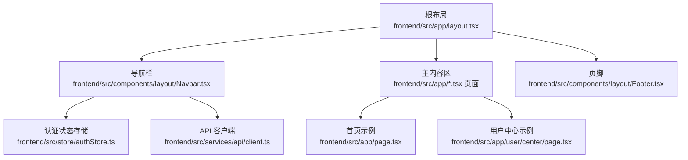
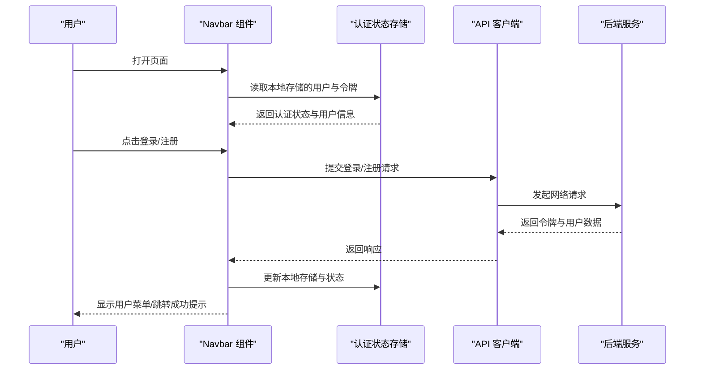
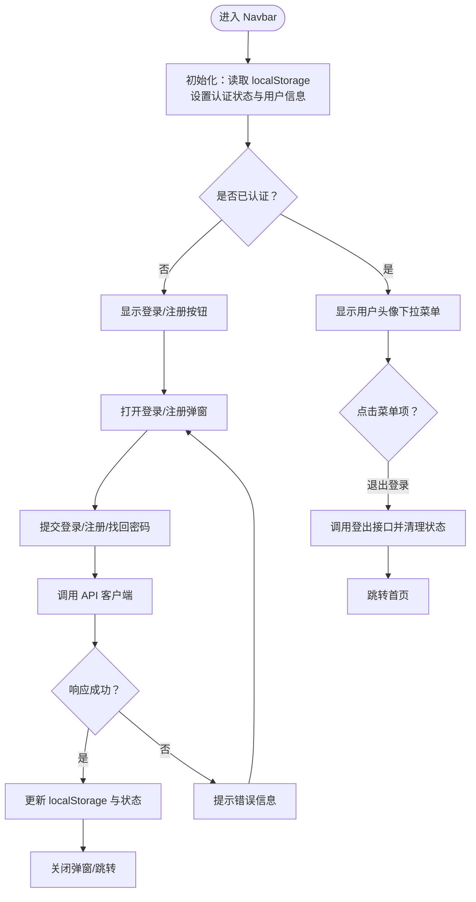
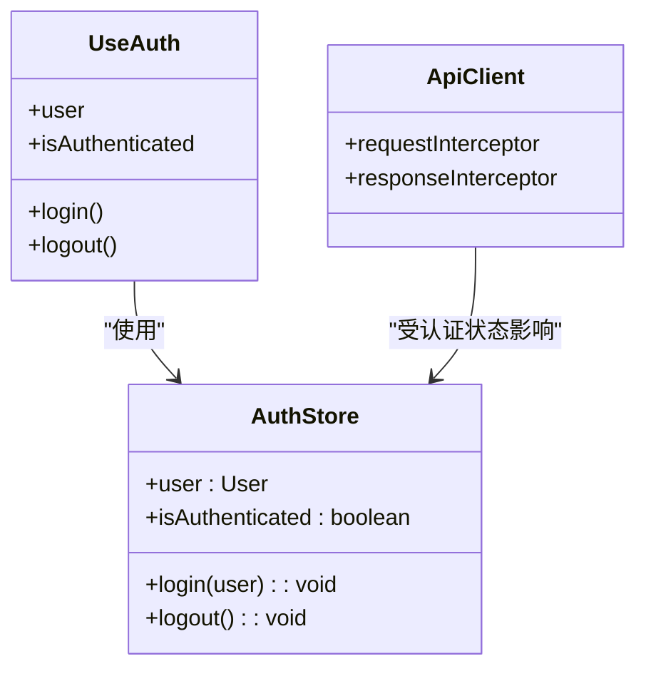
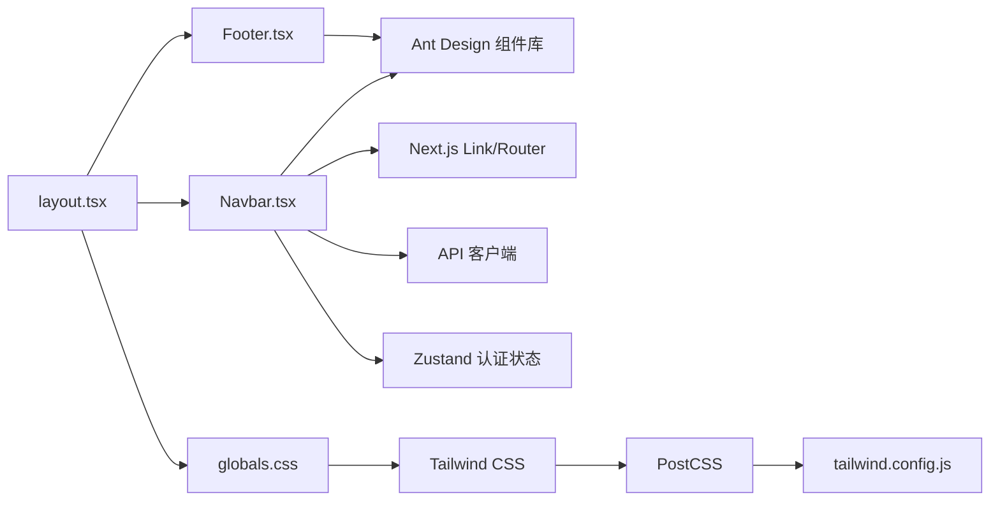

# 布局组件

<cite>
**本文引用的文件**
- [frontend/src/components/layout/Navbar.tsx](file://frontend/src/components/layout/Navbar.tsx)
- [frontend/src/components/layout/Footer.tsx](file://frontend/src/components/layout/Footer.tsx)
- [frontend/src/app/layout.tsx](file://frontend/src/app/layout.tsx)
- [frontend/src/store/authStore.ts](file://frontend/src/store/authStore.ts)
- [frontend/src/hooks/useAuth.ts](file://frontend/src/hooks/useAuth.ts)
- [frontend/src/services/api/client.ts](file://frontend/src/services/api/client.ts)
- [frontend/src/app/page.tsx](file://frontend/src/app/page.tsx)
- [frontend/src/app/user/center/page.tsx](file://frontend/src/app/user/center/page.tsx)
- [frontend/src/app/questions/page.tsx](file://frontend/src/app/questions/page.tsx)
- [frontend/src/app/globals.css](file://frontend/src/app/globals.css)
- [frontend/tailwind.config.js](file://frontend/tailwind.config.js)
- [frontend/postcss.config.js](file://frontend/postcss.config.js)
- [frontend/package.json](file://frontend/package.json)
</cite>

## 目录
1. [简介](#简介)
2. [项目结构](#项目结构)
3. [核心组件](#核心组件)
4. [架构总览](#架构总览)
5. [组件详解](#组件详解)
6. [依赖关系分析](#依赖关系分析)
7. [性能考量](#性能考量)
8. [故障排查指南](#故障排查指南)
9. [结论](#结论)
10. [附录](#附录)

## 简介
本文件面向前端布局组件，系统性梳理 Navbar（导航栏）与 Footer（页脚）的架构设计与实现要点，重点覆盖：
- 导航栏状态管理：用户认证状态、菜单项动态生成、响应式布局
- 页脚信息展示与链接管理
- 组件与全局状态的集成：用户信息获取与权限控制
- 样式定制与主题配置
- 移动端适配与触摸交互优化
- SEO 与语义化 HTML 结构

## 项目结构
布局组件位于前端 Next.js 应用中，采用“根布局包裹页面”的结构，Navbar 与 Footer 在根布局中被统一渲染，形成全局一致的导航与页脚体验。

图表来源
- [frontend/src/app/layout.tsx](file://frontend/src/app/layout.tsx#L14-L24)
- [frontend/src/components/layout/Navbar.tsx](file://frontend/src/components/layout/Navbar.tsx#L26-L457)
- [frontend/src/components/layout/Footer.tsx](file://frontend/src/components/layout/Footer.tsx#L9-L31)
- [frontend/src/store/authStore.ts](file://frontend/src/store/authStore.ts#L18-L31)
- [frontend/src/services/api/client.ts](file://frontend/src/services/api/client.ts#L1-L63)
- [frontend/src/app/page.tsx](file://frontend/src/app/page.tsx#L30-L507)
- [frontend/src/app/user/center/page.tsx](file://frontend/src/app/user/center/page.tsx#L79-L385)

章节来源
- [frontend/src/app/layout.tsx](file://frontend/src/app/layout.tsx#L14-L24)

## 核心组件
- Navbar（导航栏）
  - 负责站点主导航、用户认证入口、通知角标、下拉菜单与登录/注册弹窗
  - 内置“找回密码”流程与新用户引导步骤
  - 响应式布局：移动端隐藏主导航，使用汉堡菜单（当前文件未包含汉堡菜单实现，但存在 md 断点）
- Footer（页脚）
  - 展示版权信息与法律/联系类链接
  - 使用 Ant Design Layout/Footer 作为容器，配合 Tailwind 类名实现样式

章节来源
- [frontend/src/components/layout/Navbar.tsx](file://frontend/src/components/layout/Navbar.tsx#L26-L457)
- [frontend/src/components/layout/Footer.tsx](file://frontend/src/components/layout/Footer.tsx#L9-L31)

## 架构总览
导航栏与页脚通过根布局统一挂载，Navbar 与业务页面解耦，通过状态存储与 API 客户端完成认证与数据交互。

图表来源
- [frontend/src/components/layout/Navbar.tsx](file://frontend/src/components/layout/Navbar.tsx#L38-L120)
- [frontend/src/store/authStore.ts](file://frontend/src/store/authStore.ts#L18-L31)
- [frontend/src/services/api/client.ts](file://frontend/src/services/api/client.ts#L13-L60)

## 组件详解

### 导航栏 Navbar
- 状态管理
  - 本地存储：初始化时从 localStorage 读取 token 与 user，并据此设置 authed 与 user 状态
  - 登录/注册/忘记密码：通过表单提交与 API 客户端交互，成功后写入 localStorage 并更新状态
  - 退出登录：调用后端登出接口，清理本地存储并重定向首页
- 菜单项与动态生成
  - 主导航包含首页、简历押题、综合面试、专项面试、使用手册等静态链接
  - “综合面试”使用下拉菜单，动态生成子项（如社招/校招）
  - 用户登录后显示下拉菜单（个人中心、面试记录、押题记录、笔记、用户模型、退出登录）
- 响应式布局
  - 使用 Tailwind 的 md 断点隐藏主导航，移动端通过汉堡菜单（当前 Navbar 文件未实现汉堡菜单 UI，但存在 md 隐藏逻辑）
- 弹窗与流程
  - 登录/注册/找回密码三合一 Tabs 弹窗
  - 新用户注册后弹出引导步骤（配置用户模型 → 上传简历）

图表来源
- [frontend/src/components/layout/Navbar.tsx](file://frontend/src/components/layout/Navbar.tsx#L38-L120)
- [frontend/src/services/api/client.ts](file://frontend/src/services/api/client.ts#L13-L60)

章节来源
- [frontend/src/components/layout/Navbar.tsx](file://frontend/src/components/layout/Navbar.tsx#L26-L457)

### 页脚 Footer
- 信息展示
  - 版权信息与法律/联系类链接（隐私政策、服务条款、联系我们）
- 链接管理
  - 使用 Ant Design Typography.Text 与原生 a 标签，保持简洁与可访问性
- 样式与容器
  - 使用 Ant Design Layout.Footer 作为容器，结合 Tailwind 类名实现边框、内边距与居中布局

章节来源
- [frontend/src/components/layout/Footer.tsx](file://frontend/src/components/layout/Footer.tsx#L9-L31)

### 全局状态与权限控制
- 认证状态存储
  - 使用 Zustand 创建持久化状态，保存用户信息与认证状态
  - 提供 useAuth Hook 便捷访问状态与方法
- 权限控制
  - API 客户端在请求头注入 Authorization 与 X-Auth-Token（除注册/登录/登出接口外）
  - 当响应为 401 时自动清理本地存储，确保前端状态与后端一致

图表来源
- [frontend/src/store/authStore.ts](file://frontend/src/store/authStore.ts#L18-L31)
- [frontend/src/hooks/useAuth.ts](file://frontend/src/hooks/useAuth.ts#L4-L12)
- [frontend/src/services/api/client.ts](file://frontend/src/services/api/client.ts#L13-L60)

章节来源
- [frontend/src/store/authStore.ts](file://frontend/src/store/authStore.ts#L1-L31)
- [frontend/src/hooks/useAuth.ts](file://frontend/src/hooks/useAuth.ts#L1-L16)
- [frontend/src/services/api/client.ts](file://frontend/src/services/api/client.ts#L1-L63)

### 样式定制与主题配置
- Tailwind 配置
  - 在 tailwind.config.js 中扩展颜色，定义 primary、secondary、success、warning、error、info 等主题色
  - content 范围包含 components、app、pages，确保按需生成样式
- 全局样式
  - globals.css 中引入 Tailwind 指令，定义全局重置、通用容器类与自定义组件/工具类
  - 通过 @layer utilities 定义动画工具类，提升组件动效一致性
- 组件样式
  - Navbar 使用 Ant Design 组件与 Tailwind 类组合，实现毛玻璃背景、圆角、阴影与过渡动画
  - Footer 使用 Ant Design Layout.Footer 与 Tailwind 文字/边框类

章节来源
- [frontend/tailwind.config.js](file://frontend/tailwind.config.js#L8-L19)
- [frontend/src/app/globals.css](file://frontend/src/app/globals.css#L1-L72)
- [frontend/src/components/layout/Navbar.tsx](file://frontend/src/components/layout/Navbar.tsx#L123-L137)
- [frontend/src/components/layout/Footer.tsx](file://frontend/src/components/layout/Footer.tsx#L11-L13)

### 移动端适配与触摸交互优化
- 响应式断点
  - Navbar 主导航在 md 断点隐藏，为移动端预留空间；当前 Navbar 文件未实现汉堡菜单 UI，建议补充移动端菜单按钮与抽屉式导航
- 触摸交互
  - Ant Design 组件在移动端具备良好的触摸反馈
  - 建议在补充的汉堡菜单中启用合适的触摸手势与动画
- 无障碍与可访问性
  - 建议为导航链接添加 aria-label 或 role 属性，提升屏幕阅读器可用性

章节来源
- [frontend/src/components/layout/Navbar.tsx](file://frontend/src/components/layout/Navbar.tsx#L139-L140)

### SEO 与语义化 HTML 结构
- 根布局元数据
  - 根布局定义了标题与描述，有助于搜索引擎抓取
- 页面语义化
  - 页面中广泛使用语义化标签（如 h1、h2、p、ul/li），提升可读性与 SEO 表现
- 导航语义
  - 导航使用语义化的 nav 区域与链接，便于搜索引擎理解站点结构
- 建议
  - 为关键页面补充 meta keywords、canonical、结构化数据（如 Schema.org）以进一步优化 SEO

章节来源
- [frontend/src/app/layout.tsx](file://frontend/src/app/layout.tsx#L9-L12)
- [frontend/src/app/page.tsx](file://frontend/src/app/page.tsx#L78-L104)
- [frontend/src/app/questions/page.tsx](file://frontend/src/app/questions/page.tsx#L255-L258)

## 依赖关系分析
- 组件依赖
  - Navbar 依赖 Ant Design 组件库、Next.js Link、路由与 API 客户端
  - Footer 依赖 Ant Design Layout/Footer 与 Typography
- 状态与数据流
  - Navbar 通过 useAuth Hook 与 Zustand 认证状态交互
  - API 客户端负责请求/响应拦截与认证头注入
- 样式与主题
  - Tailwind 与自定义 CSS 共同驱动组件外观
  - package.json 指定 Ant Design、Axios、Zustand、Next.js 等核心依赖

图表来源
- [frontend/src/components/layout/Navbar.tsx](file://frontend/src/components/layout/Navbar.tsx#L3-L21)
- [frontend/src/components/layout/Footer.tsx](file://frontend/src/components/layout/Footer.tsx#L3-L7)
- [frontend/src/app/layout.tsx](file://frontend/src/app/layout.tsx#L4-L5)
- [frontend/src/app/globals.css](file://frontend/src/app/globals.css#L1-L3)
- [frontend/tailwind.config.js](file://frontend/tailwind.config.js#L3-L7)
- [frontend/postcss.config.js](file://frontend/postcss.config.js#L1-L6)
- [frontend/package.json](file://frontend/package.json#L11-L19)

章节来源
- [frontend/src/components/layout/Navbar.tsx](file://frontend/src/components/layout/Navbar.tsx#L3-L21)
- [frontend/src/components/layout/Footer.tsx](file://frontend/src/components/layout/Footer.tsx#L3-L7)
- [frontend/src/app/layout.tsx](file://frontend/src/app/layout.tsx#L4-L5)
- [frontend/src/app/globals.css](file://frontend/src/app/globals.css#L1-L3)
- [frontend/tailwind.config.js](file://frontend/tailwind.config.js#L3-L7)
- [frontend/postcss.config.js](file://frontend/postcss.config.js#L1-L6)
- [frontend/package.json](file://frontend/package.json#L11-L19)

## 性能考量
- 状态持久化
  - 使用 Zustand persist 中间件减少重复登录成本，提升用户体验
- 请求拦截
  - API 客户端在请求头注入认证信息，避免重复传递，降低错误率
- 样式体积
  - Tailwind 按需扫描组件与页面，减少未使用样式的打包体积
- 建议
  - 对 Navbar 中的弹窗与步骤组件进行懒加载，减少首屏资源压力
  - 对频繁切换的菜单项使用虚拟滚动或分页，提升长列表性能

## 故障排查指南
- 登录/注册失败
  - 检查 API 客户端拦截器是否正确注入 Authorization 头
  - 确认后端返回的数据结构与前端解析逻辑一致
- 401 未授权
  - 确认响应拦截器是否正确清理本地存储
  - 检查路由守卫与页面权限控制逻辑
- 本地存储异常
  - 确认浏览器允许 localStorage 使用
  - 检查跨域与 Cookie 设置（如需要）
- 样式异常
  - 确认 Tailwind 配置与 PostCSS 插件版本兼容
  - 检查 @layer 与自定义工具类是否正确引入

章节来源
- [frontend/src/services/api/client.ts](file://frontend/src/services/api/client.ts#L13-L60)
- [frontend/src/store/authStore.ts](file://frontend/src/store/authStore.ts#L18-L31)
- [frontend/src/app/globals.css](file://frontend/src/app/globals.css#L30-L49)

## 结论
Navbar 与 Footer 作为全局布局组件，承担着站点导航、认证入口与品牌信息展示的关键职责。通过 Zustand 状态管理与 Axios 拦截器，实现了前后端一致的认证体验；借助 Tailwind 与 Ant Design，兼顾了样式一致性与组件生态。建议后续完善移动端汉堡菜单、补充 SEO 结构化数据与无障碍属性，以进一步提升可用性与可访问性。

## 附录
- 组件路径参考
  - 导航栏：[frontend/src/components/layout/Navbar.tsx](file://frontend/src/components/layout/Navbar.tsx#L26-L457)
  - 页脚：[frontend/src/components/layout/Footer.tsx](file://frontend/src/components/layout/Footer.tsx#L9-L31)
  - 根布局：[frontend/src/app/layout.tsx](file://frontend/src/app/layout.tsx#L14-L24)
  - 认证状态存储：[frontend/src/store/authStore.ts](file://frontend/src/store/authStore.ts#L18-L31)
  - 认证 Hook：[frontend/src/hooks/useAuth.ts](file://frontend/src/hooks/useAuth.ts#L4-L12)
  - API 客户端：[frontend/src/services/api/client.ts](file://frontend/src/services/api/client.ts#L1-L63)
  - 全局样式：[frontend/src/app/globals.css](file://frontend/src/app/globals.css#L1-L72)
  - Tailwind 配置：[frontend/tailwind.config.js](file://frontend/tailwind.config.js#L8-L19)
  - PostCSS 配置：[frontend/postcss.config.js](file://frontend/postcss.config.js#L1-L6)
  - 依赖清单：[frontend/package.json](file://frontend/package.json#L11-L19)