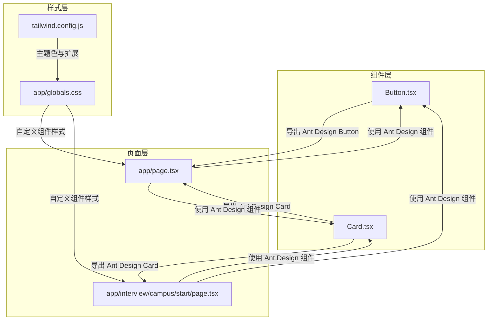
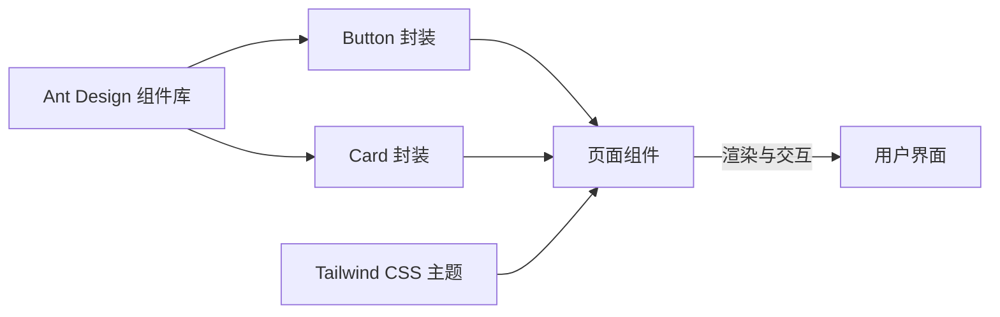
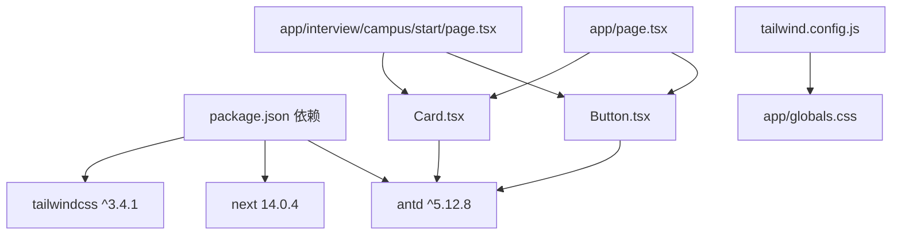

# 通用组件

<cite>
**本文引用的文件**
- [frontend/src/components/common/Button.tsx](file://frontend/src/components/common/Button.tsx)
- [frontend/src/components/common/Card.tsx](file://frontend/src/components/common/Card.tsx)
- [frontend/package.json](file://frontend/package.json)
- [frontend/tailwind.config.js](file://frontend/tailwind.config.js)
- [frontend/src/app/globals.css](file://frontend/src/app/globals.css)
- [frontend/src/app/page.tsx](file://frontend/src/app/page.tsx)
- [frontend/src/app/interview/campus/start/page.tsx](file://frontend/src/app/interview/campus/start/page.tsx)
- [frontend/next.config.js](file://frontend/next.config.js)
</cite>

## 目录
1. [简介](#简介)
2. [项目结构](#项目结构)
3. [核心组件](#核心组件)
4. [架构总览](#架构总览)
5. [组件详解](#组件详解)
6. [依赖关系分析](#依赖关系分析)
7. [性能考量](#性能考量)
8. [故障排查指南](#故障排查指南)
9. [结论](#结论)
10. [附录](#附录)

## 简介
本文件聚焦于前端通用组件的使用与设计要点，围绕 Button 与 Card 两类常用 UI 组件进行系统化说明。当前项目采用 Ant Design 作为基础 UI 库，Button 与 Card 组件均直接复用 Ant Design 的实现，并在必要处进行轻量封装与扩展，以满足业务页面的统一风格与交互需求。

## 项目结构
- 组件层位于 frontend/src/components/common，Button 与 Card 为轻量封装，直接导出 Ant Design 的对应组件。
- 页面层在 frontend/src/app 下，大量页面直接从 Ant Design 导入 Button 与 Card，用于承载业务内容。
- 样式体系基于 Tailwind CSS，通过 tailwind.config.js 定义主题色与扩展规则，并在 globals.css 中补充自定义组件样式与动画。

图表来源
- [frontend/src/components/common/Button.tsx](file://frontend/src/components/common/Button.tsx#L1-L6)
- [frontend/src/components/common/Card.tsx](file://frontend/src/components/common/Card.tsx#L1-L14)
- [frontend/src/app/page.tsx](file://frontend/src/app/page.tsx#L1-L200)
- [frontend/src/app/interview/campus/start/page.tsx](file://frontend/src/app/interview/campus/start/page.tsx#L1-L200)
- [frontend/tailwind.config.js](file://frontend/tailwind.config.js#L1-L22)
- [frontend/src/app/globals.css](file://frontend/src/app/globals.css#L1-L72)

章节来源
- [frontend/src/components/common/Button.tsx](file://frontend/src/components/common/Button.tsx#L1-L6)
- [frontend/src/components/common/Card.tsx](file://frontend/src/components/common/Card.tsx#L1-L14)
- [frontend/src/app/page.tsx](file://frontend/src/app/page.tsx#L1-L200)
- [frontend/src/app/interview/campus/start/page.tsx](file://frontend/src/app/interview/campus/start/page.tsx#L1-L200)
- [frontend/tailwind.config.js](file://frontend/tailwind.config.js#L1-L22)
- [frontend/src/app/globals.css](file://frontend/src/app/globals.css#L1-L72)

## 核心组件
- Button：直接复用 Ant Design 的 Button，保持一致的交互语义与视觉风格，便于在各页面统一使用。
- Card：对 Ant Design 的 Card 进行轻量封装，保留全部 Ant Design Props，并允许未来扩展自定义属性。

章节来源
- [frontend/src/components/common/Button.tsx](file://frontend/src/components/common/Button.tsx#L1-L6)
- [frontend/src/components/common/Card.tsx](file://frontend/src/components/common/Card.tsx#L1-L14)

## 架构总览
- 组件封装策略：Button 与 Card 采用“薄封装”策略，直接导出 Ant Design 组件，减少抽象成本，确保与 Ant Design 生态一致。
- 页面使用策略：页面直接从 Ant Design 导入组件，Button 与 Card 在页面中承担统一的交互与布局职责。
- 样式策略：通过 Tailwind CSS 提供主题色与通用样式，结合 Ant Design 组件的内置样式，形成一致的视觉语言。

图表来源
- [frontend/src/components/common/Button.tsx](file://frontend/src/components/common/Button.tsx#L1-L6)
- [frontend/src/components/common/Card.tsx](file://frontend/src/components/common/Card.tsx#L1-L14)
- [frontend/src/app/page.tsx](file://frontend/src/app/page.tsx#L1-L200)
- [frontend/tailwind.config.js](file://frontend/tailwind.config.js#L1-L22)

## 组件详解

### Button 组件
- 设计理念
  - 复用 Ant Design 的 Button，保证一致的交互行为与可访问性（如键盘导航、焦点管理）。
  - 在页面中通过 className 与 size/type 等属性实现风格统一与视觉层次。
- Props 接口与类型约束
  - 由于直接导出 Ant Design 的 Button，其 Props 与行为完全遵循 Ant Design 的定义。可参考 Ant Design 文档获取完整的类型定义与默认值。
- 默认值与状态管理
  - 默认值与状态管理由 Ant Design 内部处理；Button 本身不引入额外状态。
- 样式定制与主题适配
  - 通过 Tailwind CSS 类名覆盖 Ant Design 的默认样式，实现品牌色与尺寸的统一。
  - 示例：在页面中使用 className 控制背景色、边框、阴影与过渡效果。
- 使用示例与最佳实践
  - 在首页中，Button 被广泛用于引导用户操作，如“立即开始免费体验”、“查看演示视频”等，配合图标与渐变背景增强视觉吸引力。
  - 最佳实践：优先使用 Ant Design 的 type 与 size；通过 className 实现品牌化定制；避免在组件内部重复定义样式。

章节来源
- [frontend/src/components/common/Button.tsx](file://frontend/src/components/common/Button.tsx#L1-L6)
- [frontend/src/app/page.tsx](file://frontend/src/app/page.tsx#L110-L155)
- [frontend/src/app/interview/campus/start/page.tsx](file://frontend/src/app/interview/campus/start/page.tsx#L5-L14)

### Card 组件
- 设计理念
  - 对 Ant Design 的 Card 进行轻量封装，保留全部原生能力，同时允许未来扩展自定义属性。
- Props 接口与类型约束
  - 继承 Ant Design 的 CardProps，确保与 Ant Design 的 API 保持一致。
- 默认值与状态管理
  - 默认值与状态管理由 Ant Design 内部处理；Card 本身不引入额外状态。
- 样式定制与主题适配
  - 通过 Tailwind CSS 的自定义组件样式（如 card），在页面中统一卡片的背景、圆角、阴影与悬停效果。
- 使用示例与最佳实践
  - 在首页中，Card 用于展示统计信息与功能模块，配合网格布局与品牌色，形成清晰的信息层级。
  - 最佳实践：优先使用 Ant Design 的内置布局与间距；通过 className 实现品牌化卡片外观；避免在组件内部重复定义样式。

章节来源
- [frontend/src/components/common/Card.tsx](file://frontend/src/components/common/Card.tsx#L1-L14)
- [frontend/src/app/page.tsx](file://frontend/src/app/page.tsx#L157-L196)
- [frontend/src/app/globals.css](file://frontend/src/app/globals.css#L30-L39)

### 无障碍访问与键盘导航
- 当前实现
  - Button 与 Card 均直接使用 Ant Design 的实现，具备 Ant Design 的可访问性与键盘导航能力。
- 建议
  - 在使用过程中，确保按钮具有明确的文本标签与可聚焦状态；对于复杂卡片内容，提供适当的标题与语义结构，以提升可访问性。

章节来源
- [frontend/src/components/common/Button.tsx](file://frontend/src/components/common/Button.tsx#L1-L6)
- [frontend/src/components/common/Card.tsx](file://frontend/src/components/common/Card.tsx#L1-L14)

### 性能优化与渲染策略
- 组件复用与按需加载
  - Button 与 Card 直接从 Ant Design 导出，减少不必要的封装与渲染开销。
- 样式优化
  - 通过 Tailwind CSS 的原子类与自定义组件样式，避免重复定义样式，降低 CSS 体积。
- 渲染策略
  - 在页面中合理使用 className 控制样式，避免在组件内部进行复杂的条件渲染与状态管理，保持渲染简洁高效。

章节来源
- [frontend/src/components/common/Button.tsx](file://frontend/src/components/common/Button.tsx#L1-L6)
- [frontend/src/components/common/Card.tsx](file://frontend/src/components/common/Card.tsx#L1-L14)
- [frontend/src/app/globals.css](file://frontend/src/app/globals.css#L30-L39)

## 依赖关系分析
- 依赖来源
  - Ant Design 版本：^5.12.8
  - Tailwind CSS：用于主题色与通用样式的扩展
  - Next.js：提供路由与开发环境，配置了 API 代理
- 组件依赖
  - Button 与 Card 依赖 Ant Design 的 Button 与 Card
  - 页面依赖 Ant Design 与 Tailwind CSS 提供的样式与组件

图表来源
- [frontend/package.json](file://frontend/package.json#L11-L19)
- [frontend/src/components/common/Button.tsx](file://frontend/src/components/common/Button.tsx#L1-L6)
- [frontend/src/components/common/Card.tsx](file://frontend/src/components/common/Card.tsx#L1-L14)
- [frontend/src/app/page.tsx](file://frontend/src/app/page.tsx#L1-L200)
- [frontend/src/app/interview/campus/start/page.tsx](file://frontend/src/app/interview/campus/start/page.tsx#L1-L200)
- [frontend/tailwind.config.js](file://frontend/tailwind.config.js#L1-L22)
- [frontend/src/app/globals.css](file://frontend/src/app/globals.css#L1-L72)

章节来源
- [frontend/package.json](file://frontend/package.json#L11-L19)
- [frontend/next.config.js](file://frontend/next.config.js#L1-L11)

## 性能考量
- 减少封装层级：Button 与 Card 采用薄封装，避免引入额外的渲染与计算开销。
- 样式复用：通过 Tailwind CSS 的原子类与自定义组件样式，减少重复定义，提升构建效率。
- 按需使用：在页面中按需导入 Ant Design 组件，避免全量引入导致的包体增大。

## 故障排查指南
- 样式异常
  - 若发现 Button 或 Card 的样式不符合预期，检查 Tailwind CSS 的自定义组件样式与 className 的优先级。
- 主题色不生效
  - 确认 tailwind.config.js 中的主题色配置未被覆盖，且在页面中正确使用了相关颜色类名。
- API 代理问题
  - 若页面中存在 API 访问问题，检查 next.config.js 的 rewrites 配置是否正确指向后端服务地址。

章节来源
- [frontend/src/app/globals.css](file://frontend/src/app/globals.css#L30-L39)
- [frontend/tailwind.config.js](file://frontend/tailwind.config.js#L8-L18)
- [frontend/next.config.js](file://frontend/next.config.js#L1-L11)

## 结论
Button 与 Card 在当前项目中采用“薄封装 + Ant Design 复用”的策略，既保证了与 UI 生态的一致性，又降低了维护成本。通过 Tailwind CSS 的主题与自定义样式，实现了品牌化的视觉统一。建议在后续迭代中继续沿用该策略，并在需要时对 Card 进行属性扩展，以满足更丰富的业务场景。

## 附录
- 使用示例路径
  - Button 在首页中的多处使用：[示例路径](file://frontend/src/app/page.tsx#L110-L155)
  - Card 在首页中的统计卡片使用：[示例路径](file://frontend/src/app/page.tsx#L157-L196)
- 样式参考路径
  - Tailwind 主题配置：[配置路径](file://frontend/tailwind.config.js#L8-L18)
  - 自定义组件样式：[样式路径](file://frontend/src/app/globals.css#L30-L39)