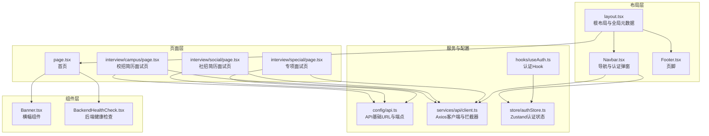
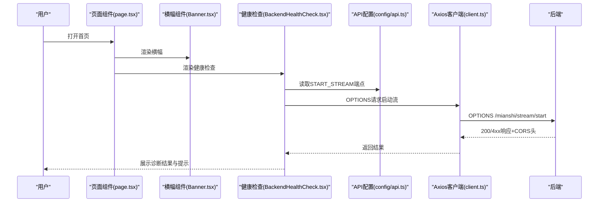
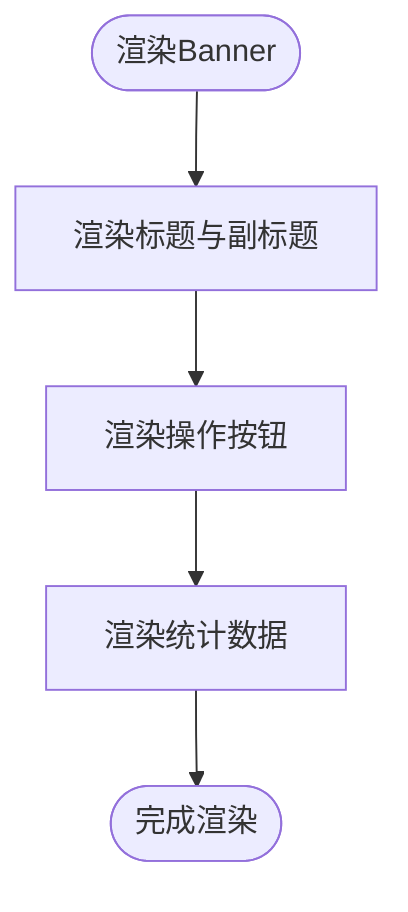
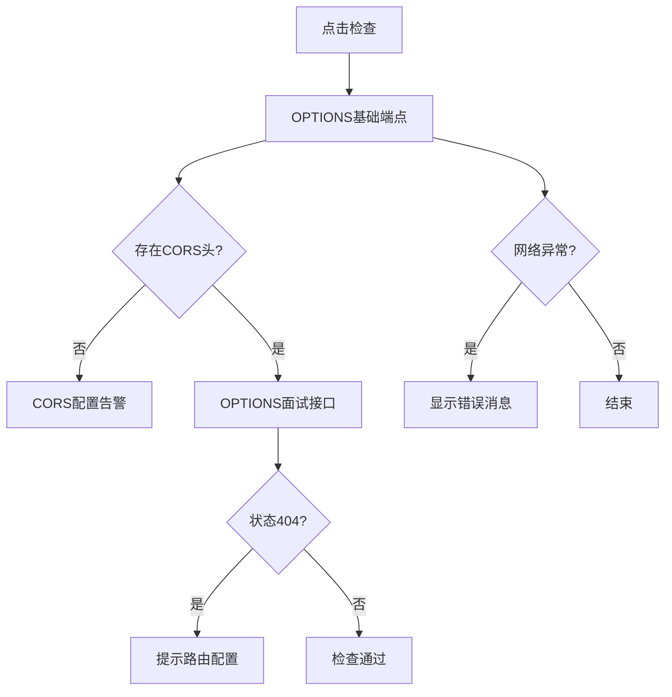
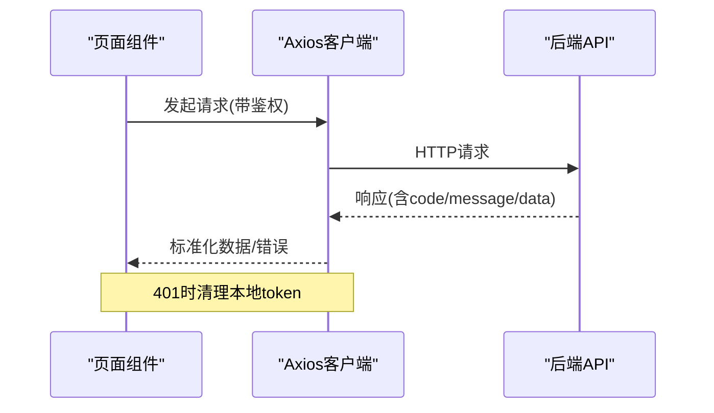
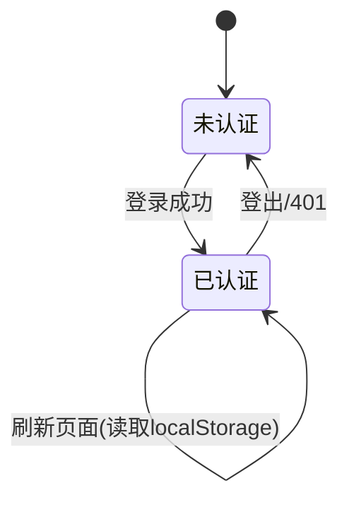
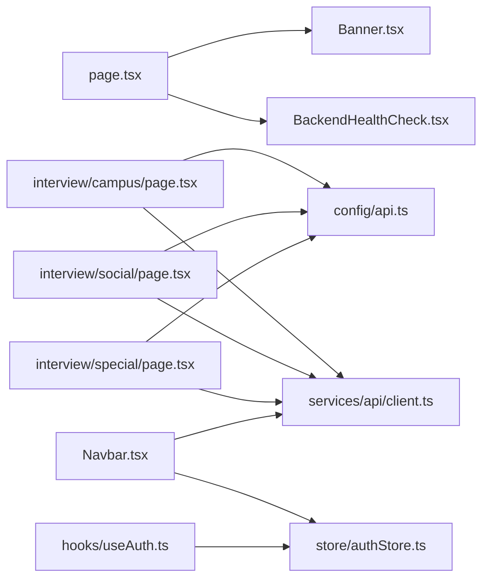

# 页面组件

<cite>
**本文引用的文件**
- [frontend/src/app/layout.tsx](file://frontend/src/app/layout.tsx)
- [frontend/src/app/page.tsx](file://frontend/src/app/page.tsx)
- [frontend/src/components/home/Banner.tsx](file://frontend/src/components/home/Banner.tsx)
- [frontend/src/components/BackendHealthCheck.tsx](file://frontend/src/components/BackendHealthCheck.tsx)
- [frontend/src/config/api.ts](file://frontend/src/config/api.ts)
- [frontend/src/services/api/client.ts](file://frontend/src/services/api/client.ts)
- [frontend/src/hooks/useAuth.ts](file://frontend/src/hooks/useAuth.ts)
- [frontend/src/store/authStore.ts](file://frontend/src/store/authStore.ts)
- [frontend/src/components/layout/Navbar.tsx](file://frontend/src/components/layout/Navbar.tsx)
- [frontend/src/components/layout/Footer.tsx](file://frontend/src/components/layout/Footer.tsx)
- [frontend/src/app/interview/campus/page.tsx](file://frontend/src/app/interview/campus/page.tsx)
- [frontend/src/app/interview/social/page.tsx](file://frontend/src/app/interview/social/page.tsx)
- [frontend/src/app/interview/special/page.tsx](file://frontend/src/app/interview/special/page.tsx)
- [frontend/src/types/global.ts](file://frontend/src/types/global.ts)
- [frontend/src/utils/format.ts](file://frontend/src/utils/format.ts)
</cite>

## 目录
1. [简介](#简介)
2. [项目结构](#项目结构)
3. [核心组件](#核心组件)
4. [架构总览](#架构总览)
5. [组件详解](#组件详解)
6. [依赖关系分析](#依赖关系分析)
7. [性能考量](#性能考量)
8. [故障排查指南](#故障排查指南)
9. [结论](#结论)
10. [附录](#附录)

## 简介
本文件聚焦于前端页面组件的设计与实现，围绕以下主题展开：
- Banner横幅组件的设计理念与内容管理
- BackendHealthCheck健康检查组件的工作原理与监控机制
- 页面组件的数据获取策略（API调用、缓存与错误处理）
- 组件生命周期管理与状态同步
- SEO优化与元数据管理
- 国际化支持与多语言切换
- 页面性能监控与用户体验优化策略

## 项目结构
前端采用 Next.js App Router 架构，页面组件位于 app 目录下，通用布局与业务组件分别位于 app 与 components 目录。API 配置与客户端封装位于 config 与 services 目录，状态管理使用 Zustand 并持久化存储。

图表来源
- [frontend/src/app/layout.tsx](file://frontend/src/app/layout.tsx#L1-L25)
- [frontend/src/components/layout/Navbar.tsx](file://frontend/src/components/layout/Navbar.tsx#L1-L457)
- [frontend/src/components/layout/Footer.tsx](file://frontend/src/components/layout/Footer.tsx#L1-L31)
- [frontend/src/app/page.tsx](file://frontend/src/app/page.tsx#L1-L507)
- [frontend/src/components/home/Banner.tsx](file://frontend/src/components/home/Banner.tsx#L1-L36)
- [frontend/src/components/BackendHealthCheck.tsx](file://frontend/src/components/BackendHealthCheck.tsx#L1-L151)
- [frontend/src/config/api.ts](file://frontend/src/config/api.ts#L1-L23)
- [frontend/src/services/api/client.ts](file://frontend/src/services/api/client.ts#L1-L63)
- [frontend/src/hooks/useAuth.ts](file://frontend/src/hooks/useAuth.ts#L1-L16)
- [frontend/src/store/authStore.ts](file://frontend/src/store/authStore.ts#L1-L31)

章节来源
- [frontend/src/app/layout.tsx](file://frontend/src/app/layout.tsx#L1-L25)
- [frontend/src/app/page.tsx](file://frontend/src/app/page.tsx#L1-L507)

## 核心组件
- 根布局与元数据：定义站点标题、描述与字体加载，作为所有页面的容器。
- 首页页面：包含横幅、特性卡片、统计数据、用户评价、FAQ与CTA等模块。
- 横幅组件：独立的Banner组件，用于首页或其他页面的头部引导。
- 后端健康检查组件：提供一键诊断后端服务可用性、CORS支持与关键接口状态。
- API配置与客户端：统一的API基础URL与端点定义，Axios拦截器处理鉴权与响应结构。
- 导航栏与认证：登录/注册弹窗、用户信息展示、登出与引导流程。
- 面试页面：校招/社招/专项面试配置页，负责简历选择、难度与参数收集，并跳转至面试流程。

章节来源
- [frontend/src/app/layout.tsx](file://frontend/src/app/layout.tsx#L9-L12)
- [frontend/src/app/page.tsx](file://frontend/src/app/page.tsx#L30-L507)
- [frontend/src/components/home/Banner.tsx](file://frontend/src/components/home/Banner.tsx#L8-L36)
- [frontend/src/components/BackendHealthCheck.tsx](file://frontend/src/components/BackendHealthCheck.tsx#L16-L151)
- [frontend/src/config/api.ts](file://frontend/src/config/api.ts#L1-L23)
- [frontend/src/services/api/client.ts](file://frontend/src/services/api/client.ts#L1-L63)
- [frontend/src/components/layout/Navbar.tsx](file://frontend/src/components/layout/Navbar.tsx#L26-L457)

## 架构总览
页面组件通过 Next.js App Router 进行组织，页面层负责数据获取与渲染，组件层负责可复用UI与诊断能力，服务层封装HTTP通信与状态管理。

图表来源
- [frontend/src/app/page.tsx](file://frontend/src/app/page.tsx#L30-L507)
- [frontend/src/components/BackendHealthCheck.tsx](file://frontend/src/components/BackendHealthCheck.tsx#L20-L78)
- [frontend/src/config/api.ts](file://frontend/src/config/api.ts#L6-L15)
- [frontend/src/services/api/client.ts](file://frontend/src/services/api/client.ts#L1-L63)

## 组件详解

### Banner横幅组件
- 设计目标：突出品牌与核心卖点，提供“免费试用”“了解更多”等行动按钮，展示用户规模与成果数据。
- 内容管理：文案与统计数据在页面中硬编码，便于快速迭代；若需动态化，可在页面层通过API注入。
- 样式与交互：使用渐变背景与居中布局，按钮尺寸与间距统一，适配移动端与桌面端。

图表来源
- [frontend/src/components/home/Banner.tsx](file://frontend/src/components/home/Banner.tsx#L8-L36)

章节来源
- [frontend/src/components/home/Banner.tsx](file://frontend/src/components/home/Banner.tsx#L8-L36)

### BackendHealthCheck健康检查组件
- 工作原理：
  - 通过OPTIONS请求探测后端服务可达性与登录接口状态。
  - 检测CORS头以判断跨域配置。
  - 对面试流接口进行OPTIONS探测，识别404或鉴权问题。
- 监控机制：
  - 使用本地状态保存检查结果与错误信息。
  - 成功/警告/异常状态以标签形式可视化展示。
  - 提供修复建议与路由配置提示。
- 错误处理：
  - 捕获网络异常与401，提示用户确认后端运行状态与鉴权配置。

图表来源
- [frontend/src/components/BackendHealthCheck.tsx](file://frontend/src/components/BackendHealthCheck.tsx#L20-L78)

章节来源
- [frontend/src/components/BackendHealthCheck.tsx](file://frontend/src/components/BackendHealthCheck.tsx#L16-L151)

### 页面组件的数据获取策略
- API调用：
  - 统一通过Axios客户端发起请求，自动注入Authorization与X-Auth-Token。
  - 针对长耗时接口（如评估与答题记录）设置较长超时。
- 缓存管理：
  - 页面内使用sessionStorage临时存储面试参数，避免刷新丢失。
  - 本地持久化使用localStorage存储token与用户信息。
- 错误处理：
  - 响应拦截器统一处理业务错误码与401清理token。
  - 表单校验与异常分支给出明确提示。

图表来源
- [frontend/src/services/api/client.ts](file://frontend/src/services/api/client.ts#L13-L60)
- [frontend/src/app/interview/campus/page.tsx](file://frontend/src/app/interview/campus/page.tsx#L44-L58)
- [frontend/src/app/interview/social/page.tsx](file://frontend/src/app/interview/social/page.tsx#L45-L59)
- [frontend/src/app/interview/special/page.tsx](file://frontend/src/app/interview/special/page.tsx#L71-L92)

章节来源
- [frontend/src/services/api/client.ts](file://frontend/src/services/api/client.ts#L1-L63)
- [frontend/src/app/interview/campus/page.tsx](file://frontend/src/app/interview/campus/page.tsx#L44-L82)
- [frontend/src/app/interview/social/page.tsx](file://frontend/src/app/interview/social/page.tsx#L45-L83)
- [frontend/src/app/interview/special/page.tsx](file://frontend/src/app/interview/special/page.tsx#L71-L92)

### 生命周期管理与状态同步
- 页面初始化：读取localStorage中的token与用户信息，设置认证态。
- 状态同步：
  - 登录/注册成功后写入localStorage并更新导航栏用户信息。
  - 登出时清理localStorage并重定向至首页。
  - 面试配置页在挂载时检查模型配置状态，避免无效开始面试。
- 状态持久化：使用Zustand的persist中间件将认证状态持久化到浏览器存储。

图表来源
- [frontend/src/components/layout/Navbar.tsx](file://frontend/src/components/layout/Navbar.tsx#L38-L43)
- [frontend/src/components/layout/Navbar.tsx](file://frontend/src/components/layout/Navbar.tsx#L110-L120)
- [frontend/src/store/authStore.ts](file://frontend/src/store/authStore.ts#L18-L30)
- [frontend/src/hooks/useAuth.ts](file://frontend/src/hooks/useAuth.ts#L4-L12)

章节来源
- [frontend/src/components/layout/Navbar.tsx](file://frontend/src/components/layout/Navbar.tsx#L38-L120)
- [frontend/src/store/authStore.ts](file://frontend/src/store/authStore.ts#L1-L31)
- [frontend/src/hooks/useAuth.ts](file://frontend/src/hooks/useAuth.ts#L1-L16)

### SEO优化与元数据管理
- 元数据：在根布局中设置title与description，确保搜索引擎抓取到一致的品牌信息。
- 页面级优化建议：
  - 为各页面设置独特的meta标题与描述，结合页面内容动态生成。
  - 使用Open Graph与Twitter Cards标签增强分享效果。
  - 为图片与富媒体资源提供alt属性与尺寸信息。
  - 保持URL语义化与层级清晰，配合Next.js的静态生成或预渲染。

章节来源
- [frontend/src/app/layout.tsx](file://frontend/src/app/layout.tsx#L9-L12)

### 国际化支持与多语言切换
- 当前项目使用中文文案，若需国际化：
  - 引入i18n库（如next-i18next），按页面与组件拆分翻译键。
  - 在根布局或App Router中配置语言检测与回退策略。
  - 将文案从组件中抽离为翻译键，避免硬编码字符串。
  - 为日期、数字、文件大小等格式化提供本地化工具函数。

章节来源
- [frontend/src/utils/format.ts](file://frontend/src/utils/format.ts#L7-L43)

## 依赖关系分析
- 页面与组件：
  - 首页页面引入Banner与BackendHealthCheck组件，形成内容与诊断双通道。
  - 面试页面依赖API配置与Axios客户端，同时读取localStorage与sessionStorage。
- 服务与状态：
  - Navbar依赖Axios客户端进行登录/注册/登出，依赖Zustand状态管理与localStorage。
  - Axios客户端依赖API配置与环境变量，统一处理鉴权与响应结构。

图表来源
- [frontend/src/app/page.tsx](file://frontend/src/app/page.tsx#L30-L507)
- [frontend/src/components/home/Banner.tsx](file://frontend/src/components/home/Banner.tsx#L8-L36)
- [frontend/src/components/BackendHealthCheck.tsx](file://frontend/src/components/BackendHealthCheck.tsx#L16-L151)
- [frontend/src/app/interview/campus/page.tsx](file://frontend/src/app/interview/campus/page.tsx#L44-L82)
- [frontend/src/app/interview/social/page.tsx](file://frontend/src/app/interview/social/page.tsx#L45-L83)
- [frontend/src/app/interview/special/page.tsx](file://frontend/src/app/interview/special/page.tsx#L71-L92)
- [frontend/src/config/api.ts](file://frontend/src/config/api.ts#L1-L23)
- [frontend/src/services/api/client.ts](file://frontend/src/services/api/client.ts#L1-L63)
- [frontend/src/components/layout/Navbar.tsx](file://frontend/src/components/layout/Navbar.tsx#L26-L457)
- [frontend/src/store/authStore.ts](file://frontend/src/store/authStore.ts#L1-L31)
- [frontend/src/hooks/useAuth.ts](file://frontend/src/hooks/useAuth.ts#L1-L16)

## 性能考量
- 资源加载：
  - 使用Next.js内置的图片优化与字体预加载，减少首屏阻塞。
  - 将非关键CSS与JS延迟加载，优先保证核心内容渲染。
- 网络请求：
  - Axios拦截器统一设置超时与鉴权头，避免重复逻辑。
  - 对长耗时接口（评估/记录）单独设置超时，防止阻塞UI。
- 本地存储：
  - 使用localStorage与sessionStorage缓存token与临时参数，减少重复请求。
- 交互体验：
  - 加载态与禁用态明确提示，避免重复提交。
  - 错误消息与告警信息及时反馈，降低用户困惑。

## 故障排查指南
- 后端服务不可达：
  - 检查NEXT_PUBLIC_API_BASE_URL是否指向正确的后端地址。
  - 使用BackendHealthCheck组件进行诊断，关注CORS与接口状态。
- 面试接口404：
  - 确认后端路由已注册，必要时将相关路径加入公共路由白名单。
- 登录/鉴权失败：
  - 检查localStorage中的token是否存在，响应拦截器会在401时清理token。
  - 确认请求头中Authorization与X-Auth-Token是否正确注入。
- 面试参数丢失：
  - 确认sessionStorage中是否成功写入面试参数，必要时在页面初始化时读取。

章节来源
- [frontend/src/components/BackendHealthCheck.tsx](file://frontend/src/components/BackendHealthCheck.tsx#L62-L78)
- [frontend/src/services/api/client.ts](file://frontend/src/services/api/client.ts#L47-L59)
- [frontend/src/app/interview/campus/page.tsx](file://frontend/src/app/interview/campus/page.tsx#L288-L295)
- [frontend/src/app/interview/social/page.tsx](file://frontend/src/app/interview/social/page.tsx#L279-L294)
- [frontend/src/app/interview/special/page.tsx](file://frontend/src/app/interview/special/page.tsx#L109-L114)

## 结论
本文档从设计、实现与运维三个维度梳理了页面组件与相关服务的要点。Banner与健康检查组件分别承担内容呈现与系统可观测性职责；API配置与Axios客户端提供了统一的网络访问与错误处理；Zustand状态管理与localStorage保障了认证态的持久化与同步。后续可在SEO、国际化与性能优化方面进一步完善，以提升用户体验与可维护性。

## 附录
- 类型定义：提供通用API响应、分页、用户、面试与简历等类型，便于前后端契约一致。
- 工具函数：提供日期时间、数字、文件大小与文本截断等格式化工具，便于页面渲染。

章节来源
- [frontend/src/types/global.ts](file://frontend/src/types/global.ts#L4-L54)
- [frontend/src/utils/format.ts](file://frontend/src/utils/format.ts#L7-L43)