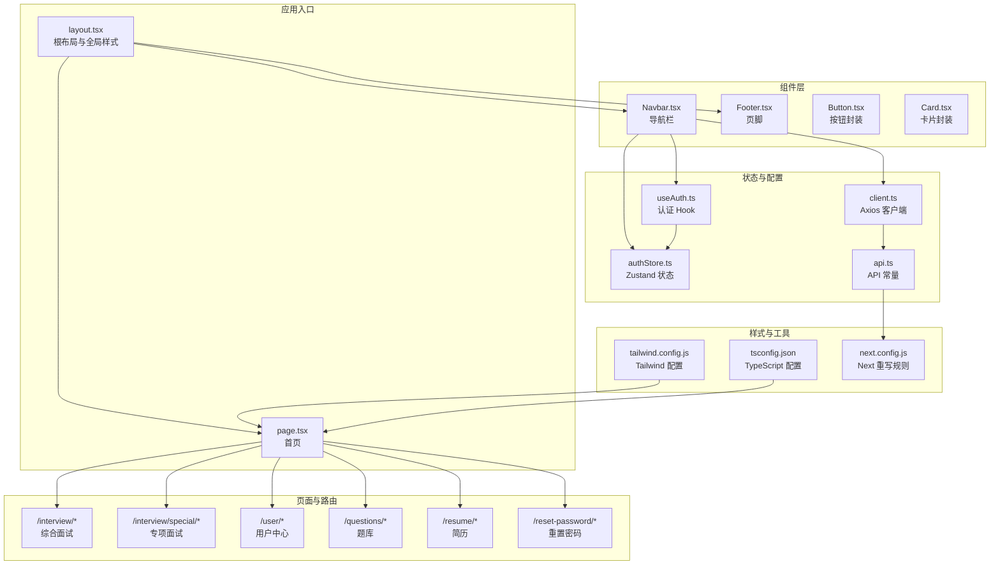
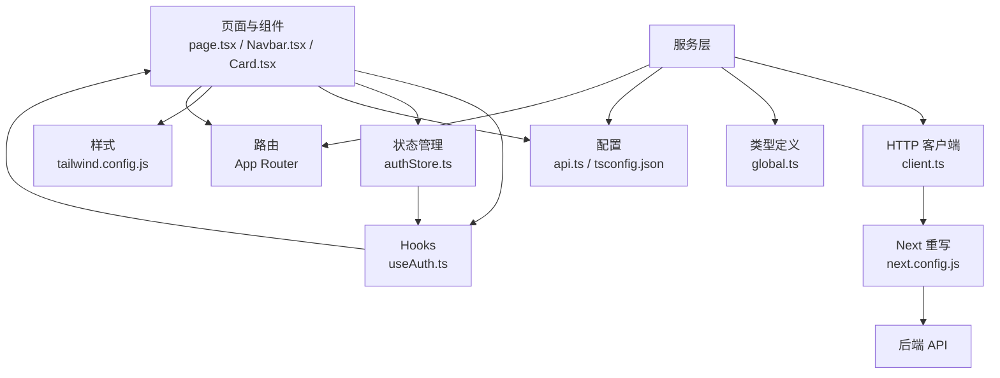
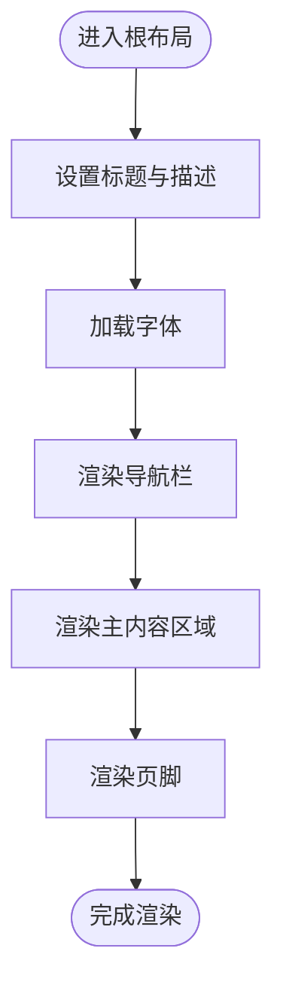
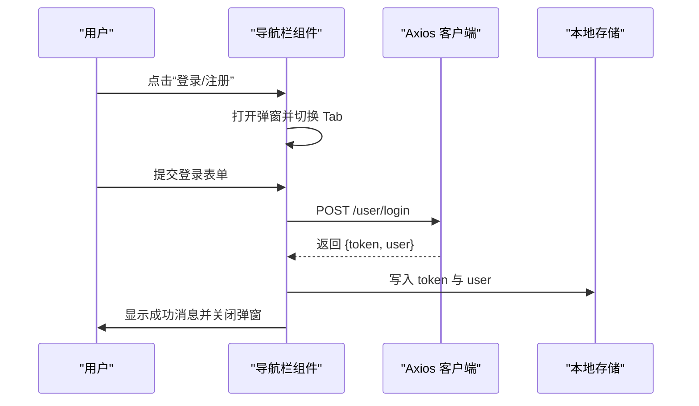
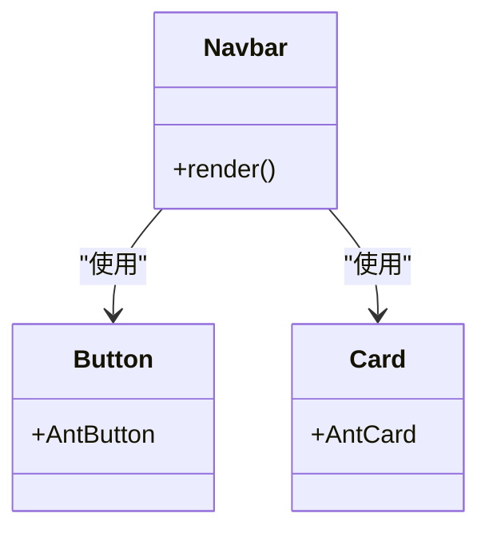
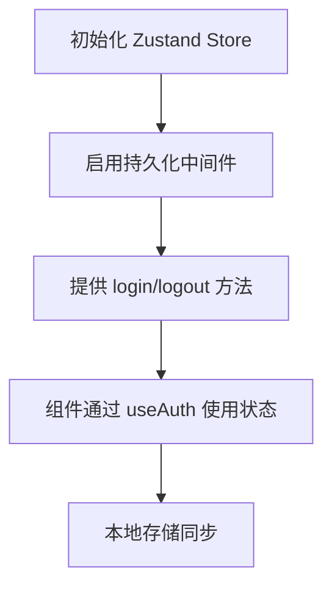
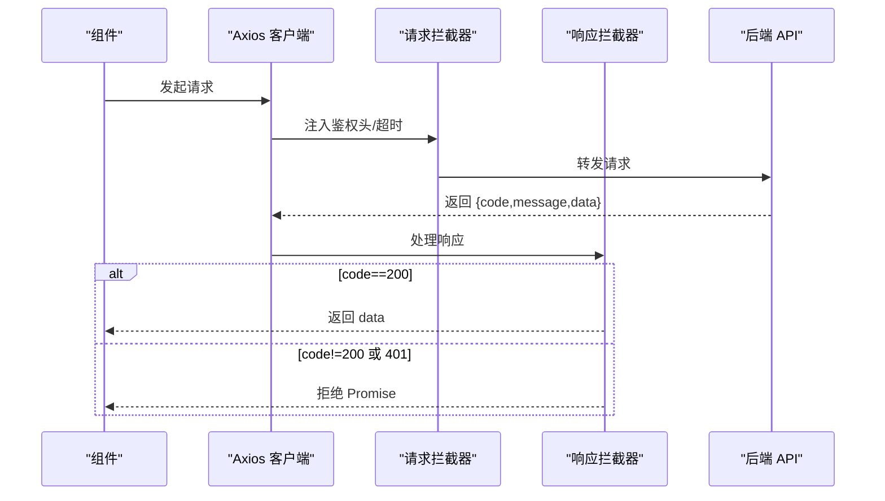
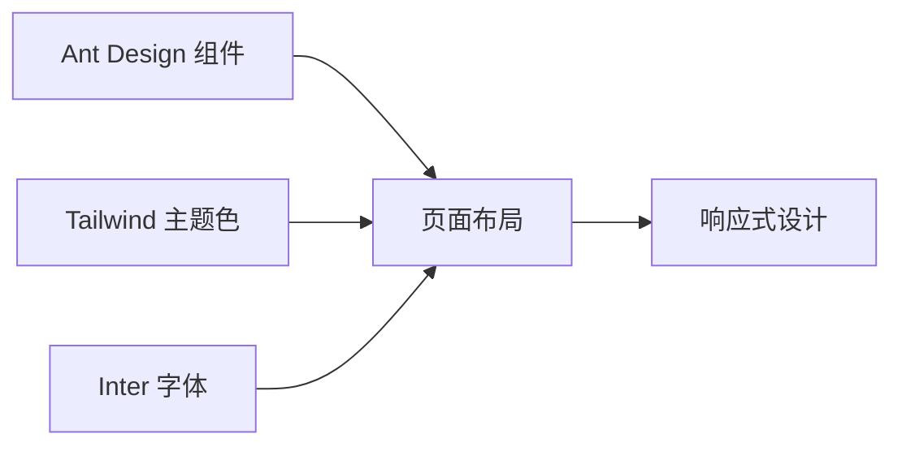
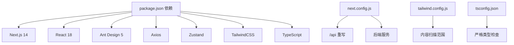

# 前端开发

<cite>
**本文引用的文件**
- [frontend/src/app/layout.tsx](file://frontend/src/app/layout.tsx)
- [frontend/src/app/page.tsx](file://frontend/src/app/page.tsx)
- [frontend/package.json](file://frontend/package.json)
- [frontend/next.config.js](file://frontend/next.config.js)
- [frontend/tailwind.config.js](file://frontend/tailwind.config.js)
- [frontend/tsconfig.json](file://frontend/tsconfig.json)
- [frontend/src/components/layout/Navbar.tsx](file://frontend/src/components/layout/Navbar.tsx)
- [frontend/src/components/layout/Footer.tsx](file://frontend/src/components/layout/Footer.tsx)
- [frontend/src/components/common/Button.tsx](file://frontend/src/components/common/Button.tsx)
- [frontend/src/components/common/Card.tsx](file://frontend/src/components/common/Card.tsx)
- [frontend/src/services/api/client.ts](file://frontend/src/services/api/client.ts)
- [frontend/src/config/api.ts](file://frontend/src/config/api.ts)
- [frontend/src/hooks/useAuth.ts](file://frontend/src/hooks/useAuth.ts)
- [frontend/src/store/authStore.ts](file://frontend/src/store/authStore.ts)
- [frontend/src/types/global.ts](file://frontend/src/types/global.ts)
</cite>

## 目录
1. [简介](#简介)
2. [项目结构](#项目结构)
3. [核心组件](#核心组件)
4. [架构总览](#架构总览)
5. [组件详解](#组件详解)
6. [依赖关系分析](#依赖关系分析)
7. [性能考量](#性能考量)
8. [故障排查指南](#故障排查指南)
9. [结论](#结论)
10. [附录](#附录)

## 简介
本文件面向“面试吧”前端团队，系统性梳理基于 Next.js 14+ 与 TypeScript 的前端技术栈与工程实践。内容涵盖页面与路由组织、组件架构、状态管理、API 集成、UI 设计与样式系统、响应式与用户体验优化、开发与部署流程以及与后端 API 的交互与错误处理机制。

## 项目结构
前端采用 Next.js App Router（pages 已弃用）组织页面与布局，按功能域划分目录，配合 TailwindCSS 实现样式与响应式设计，使用 Zustand 进行轻量状态管理，Axios 作为 HTTP 客户端，并通过环境变量与重写规则对接后端服务。

**图表来源**
- [frontend/src/app/layout.tsx](file://frontend/src/app/layout.tsx#L1-L25)
- [frontend/src/app/page.tsx](file://frontend/src/app/page.tsx#L1-L507)
- [frontend/src/components/layout/Navbar.tsx](file://frontend/src/components/layout/Navbar.tsx#L1-L457)
- [frontend/src/components/layout/Footer.tsx](file://frontend/src/components/layout/Footer.tsx#L1-L31)
- [frontend/src/services/api/client.ts](file://frontend/src/services/api/client.ts#L1-L63)
- [frontend/src/config/api.ts](file://frontend/src/config/api.ts#L1-L23)
- [frontend/src/store/authStore.ts](file://frontend/src/store/authStore.ts#L1-L31)
- [frontend/src/hooks/useAuth.ts](file://frontend/src/hooks/useAuth.ts#L1-L16)
- [frontend/tailwind.config.js](file://frontend/tailwind.config.js#L1-L22)
- [frontend/tsconfig.json](file://frontend/tsconfig.json#L1-L28)
- [frontend/next.config.js](file://frontend/next.config.js#L1-L11)

**章节来源**
- [frontend/src/app/layout.tsx](file://frontend/src/app/layout.tsx#L1-L25)
- [frontend/src/app/page.tsx](file://frontend/src/app/page.tsx#L1-L507)
- [frontend/package.json](file://frontend/package.json#L1-L37)
- [frontend/next.config.js](file://frontend/next.config.js#L1-L11)
- [frontend/tailwind.config.js](file://frontend/tailwind.config.js#L1-L22)
- [frontend/tsconfig.json](file://frontend/tsconfig.json#L1-L28)

## 核心组件
- 根布局与全局样式：统一注入字体、元信息与全局样式，包裹导航与页脚，形成一致的页面骨架。
- 首页：采用 Ant Design 组件与 Tailwind 混合布局，展示品牌宣传、功能卡片、用户评价与常见问题等模块。
- 导航栏：负责登录/注册弹窗、用户下拉菜单、通知角标、路由跳转与登出流程。
- 页脚：版权与基础链接。
- 通用组件：Button 与 Card 的轻量封装，便于统一风格与扩展。
- 状态管理：Zustand 管理认证态，持久化存储，避免刷新丢失。
- API 客户端：Axios 实例封装请求/响应拦截器、鉴权头注入、超时策略与错误处理。
- 类型系统：统一的响应体与业务类型定义，保障前后端契约一致性。

**章节来源**
- [frontend/src/app/layout.tsx](file://frontend/src/app/layout.tsx#L1-L25)
- [frontend/src/app/page.tsx](file://frontend/src/app/page.tsx#L1-L507)
- [frontend/src/components/layout/Navbar.tsx](file://frontend/src/components/layout/Navbar.tsx#L1-L457)
- [frontend/src/components/layout/Footer.tsx](file://frontend/src/components/layout/Footer.tsx#L1-L31)
- [frontend/src/components/common/Button.tsx](file://frontend/src/components/common/Button.tsx#L1-L6)
- [frontend/src/components/common/Card.tsx](file://frontend/src/components/common/Card.tsx#L1-L14)
- [frontend/src/store/authStore.ts](file://frontend/src/store/authStore.ts#L1-L31)
- [frontend/src/hooks/useAuth.ts](file://frontend/src/hooks/useAuth.ts#L1-L16)
- [frontend/src/services/api/client.ts](file://frontend/src/services/api/client.ts#L1-L63)
- [frontend/src/config/api.ts](file://frontend/src/config/api.ts#L1-L23)
- [frontend/src/types/global.ts](file://frontend/src/types/global.ts#L1-L55)

## 架构总览
前端采用“页面 + 组件 + 服务”的分层架构：
- 页面层：App Router 路由组织，按功能域划分目录，支持动态路由与嵌套路由。
- 组件层：可复用 UI 组件与业务组件，Ant Design 为基础，Tailwind 用于布局与主题色。
- 服务层：Axios 客户端封装、API 常量、认证 Hook 与 Zustand 状态。
- 样式层：Tailwind 配置主题色与扫描范围，TypeScript 严格类型约束。

**图表来源**
- [frontend/src/app/page.tsx](file://frontend/src/app/page.tsx#L1-L507)
- [frontend/src/components/layout/Navbar.tsx](file://frontend/src/components/layout/Navbar.tsx#L1-L457)
- [frontend/src/components/common/Card.tsx](file://frontend/src/components/common/Card.tsx#L1-L14)
- [frontend/src/hooks/useAuth.ts](file://frontend/src/hooks/useAuth.ts#L1-L16)
- [frontend/src/store/authStore.ts](file://frontend/src/store/authStore.ts#L1-L31)
- [frontend/src/config/api.ts](file://frontend/src/config/api.ts#L1-L23)
- [frontend/src/services/api/client.ts](file://frontend/src/services/api/client.ts#L1-L63)
- [frontend/src/types/global.ts](file://frontend/src/types/global.ts#L1-L55)
- [frontend/tailwind.config.js](file://frontend/tailwind.config.js#L1-L22)
- [frontend/tsconfig.json](file://frontend/tsconfig.json#L1-L28)
- [frontend/next.config.js](file://frontend/next.config.js#L1-L11)

## 组件详解

### 根布局与页面组织
- 根布局负责注入字体、元信息与全局样式，包裹导航与页脚，保证页面骨架一致。
- 首页采用 Ant Design 组件与 Tailwind 混合布局，包含装饰背景、英雄区、功能卡片、统计数据、用户评价、FAQ 与行动号召区。

**图表来源**
- [frontend/src/app/layout.tsx](file://frontend/src/app/layout.tsx#L1-L25)
- [frontend/src/app/page.tsx](file://frontend/src/app/page.tsx#L1-L507)

**章节来源**
- [frontend/src/app/layout.tsx](file://frontend/src/app/layout.tsx#L1-L25)
- [frontend/src/app/page.tsx](file://frontend/src/app/page.tsx#L1-L507)

### 导航栏与认证流程
- 登录/注册弹窗：支持 Tab 切换、表单校验、提交与消息提示。
- 用户态管理：本地存储 token 与用户信息，支持登出与路由跳转。
- 下拉菜单：个人中心、面试记录、押题记录、笔记、模型配置等入口。
- 引导模态：新用户引导配置模型与上传简历。

**图表来源**
- [frontend/src/components/layout/Navbar.tsx](file://frontend/src/components/layout/Navbar.tsx#L1-L457)
- [frontend/src/services/api/client.ts](file://frontend/src/services/api/client.ts#L1-L63)

**章节来源**
- [frontend/src/components/layout/Navbar.tsx](file://frontend/src/components/layout/Navbar.tsx#L1-L457)

### 通用组件封装
- Button：Ant Design Button 的直接导出，便于后续扩展统一风格。
- Card：Ant Design Card 的类型透传封装，便于统一属性与扩展行为。

**图表来源**
- [frontend/src/components/common/Button.tsx](file://frontend/src/components/common/Button.tsx#L1-L6)
- [frontend/src/components/common/Card.tsx](file://frontend/src/components/common/Card.tsx#L1-L14)
- [frontend/src/components/layout/Navbar.tsx](file://frontend/src/components/layout/Navbar.tsx#L1-L457)

**章节来源**
- [frontend/src/components/common/Button.tsx](file://frontend/src/components/common/Button.tsx#L1-L6)
- [frontend/src/components/common/Card.tsx](file://frontend/src/components/common/Card.tsx#L1-L14)

### 状态管理策略
- 使用 Zustand 管理认证态，包含用户信息与登录状态。
- 通过 persist 中间件实现本地持久化，避免刷新丢失。
- 自定义 Hook useAuth 暴露登录/登出与状态读取。

**图表来源**
- [frontend/src/store/authStore.ts](file://frontend/src/store/authStore.ts#L1-L31)
- [frontend/src/hooks/useAuth.ts](file://frontend/src/hooks/useAuth.ts#L1-L16)

**章节来源**
- [frontend/src/store/authStore.ts](file://frontend/src/store/authStore.ts#L1-L31)
- [frontend/src/hooks/useAuth.ts](file://frontend/src/hooks/useAuth.ts#L1-L16)

### API 集成与交互模式
- Axios 实例：统一 base URL、超时、请求头注入 Authorization 与 X-Auth-Token。
- 鉴权豁免：对注册、登录、登出接口放行。
- 超时策略：面试评估与答题记录接口设置较长超时。
- 响应拦截：统一处理 code 与 message，401 清理本地 token 并拒绝 Promise。
- API 常量：集中管理接口地址，便于维护与替换。

**图表来源**
- [frontend/src/services/api/client.ts](file://frontend/src/services/api/client.ts#L1-L63)
- [frontend/src/config/api.ts](file://frontend/src/config/api.ts#L1-L23)

**章节来源**
- [frontend/src/services/api/client.ts](file://frontend/src/services/api/client.ts#L1-L63)
- [frontend/src/config/api.ts](file://frontend/src/config/api.ts#L1-L23)

### UI 组件设计与样式系统
- Ant Design：提供丰富的 UI 组件与交互语义。
- TailwindCSS：主题色扩展、内容扫描范围、响应式断点与动画类。
- 字体与排版：使用 Next Font 加载 Inter 字体，确保中英文排版一致。
- 响应式：通过网格、间距与断点类实现移动端优先的设计。

**图表来源**
- [frontend/tailwind.config.js](file://frontend/tailwind.config.js#L1-L22)
- [frontend/src/app/layout.tsx](file://frontend/src/app/layout.tsx#L1-L25)

**章节来源**
- [frontend/tailwind.config.js](file://frontend/tailwind.config.js#L1-L22)
- [frontend/src/app/layout.tsx](file://frontend/src/app/layout.tsx#L1-L25)

## 依赖关系分析
- 依赖管理：Next.js 14、React 18、Ant Design 5、Axios、Zustand、TailwindCSS、TypeScript。
- 构建与运行：通过 Next CLI 管理开发、构建与启动。
- 样式扫描：Tailwind 对 app、components、pages 目录进行内容扫描。
- 环境变量：NEXT_PUBLIC_API_BASE_URL 控制 API 基础地址，next.config.js 将 /api 代理至后端。

**图表来源**
- [frontend/package.json](file://frontend/package.json#L1-L37)
- [frontend/next.config.js](file://frontend/next.config.js#L1-L11)
- [frontend/tailwind.config.js](file://frontend/tailwind.config.js#L1-L22)
- [frontend/tsconfig.json](file://frontend/tsconfig.json#L1-L28)

**章节来源**
- [frontend/package.json](file://frontend/package.json#L1-L37)
- [frontend/next.config.js](file://frontend/next.config.js#L1-L11)
- [frontend/tailwind.config.js](file://frontend/tailwind.config.js#L1-L22)
- [frontend/tsconfig.json](file://frontend/tsconfig.json#L1-L28)

## 性能考量
- 图片与字体：使用 Next Font 与内置图片优化，减少首屏阻塞。
- 组件懒加载：利用 Next.js 的路由懒加载与动态导入，降低初始包体积。
- 样式优化：Tailwind 仅扫描指定目录，避免无用样式进入产物。
- 请求缓存：结合后端接口特性，合理使用缓存与分页，减少重复请求。
- 交互反馈：使用 Ant Design 的加载态与消息提示，提升感知性能。

## 故障排查指南
- 登录失败：检查网络面板与后端返回的 message；确认本地 token 是否正确写入与携带。
- 401 未授权：响应拦截器会清理本地 token，检查鉴权头是否注入；确认接口是否在豁免列表。
- 接口超时：面试评估与答题记录接口默认较长超时，若仍失败，检查后端处理耗时与网络稳定性。
- 路由跳转异常：确认 next.config.js 的 /api 重写是否指向正确的后端地址。
- 样式不生效：检查 Tailwind 内容扫描路径与颜色扩展是否正确。

**章节来源**
- [frontend/src/services/api/client.ts](file://frontend/src/services/api/client.ts#L1-L63)
- [frontend/next.config.js](file://frontend/next.config.js#L1-L11)
- [frontend/tailwind.config.js](file://frontend/tailwind.config.js#L1-L22)

## 结论
本项目以 Next.js App Router 为核心，结合 Ant Design 与 TailwindCSS 实现高可用的前端界面；通过 Axios 客户端与 Zustand 状态管理，构建了清晰的认证与 API 交互流程。整体架构具备良好的可维护性与扩展性，建议持续完善类型系统、测试与监控体系，以进一步提升工程质量与用户体验。

## 附录
- 开发环境搭建：安装 Node.js 与包管理器，执行安装依赖与启动命令。
- 构建与部署：使用 Next build 生成静态/SSR产物，结合环境变量与反向代理部署。
- 调试技巧：利用浏览器开发者工具、网络面板与日志输出定位问题；结合 TypeScript 类型提示与 ESLint/Prettier 规范提升开发效率。