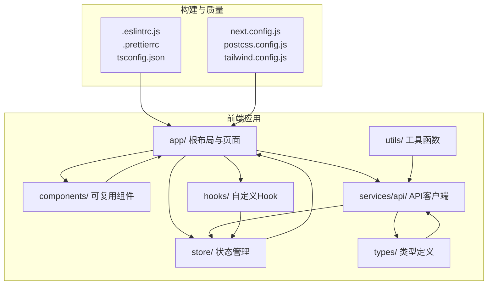
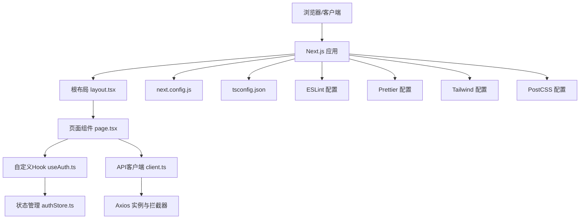
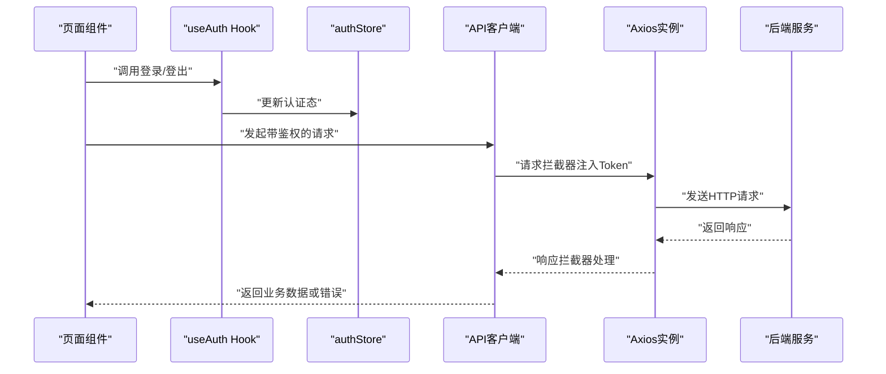
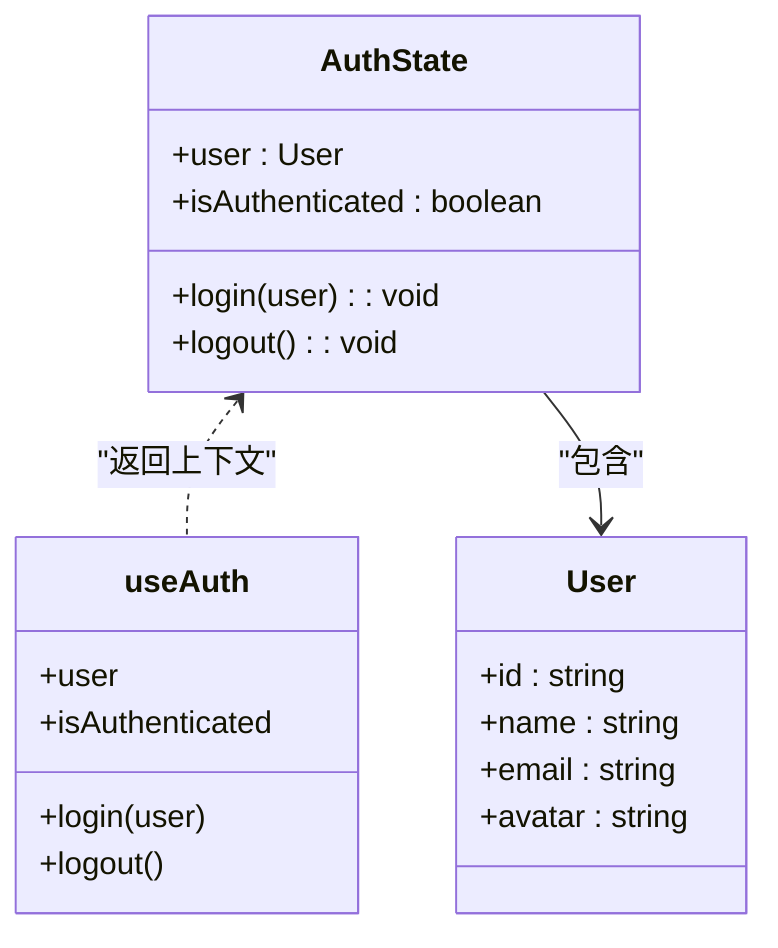
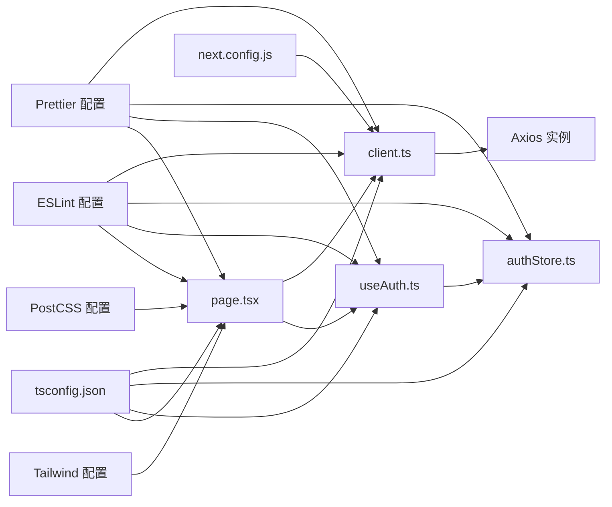

# 开发工作流与工具

<cite>
**本文引用的文件**
- [package.json](file://frontend/package.json)
- [.eslintrc.js](file://frontend/.eslintrc.js)
- [.prettierrc](file://frontend/.prettierrc)
- [next.config.js](file://frontend/next.config.js)
- [tsconfig.json](file://frontend/tsconfig.json)
- [tailwind.config.js](file://frontend/tailwind.config.js)
- [postcss.config.js](file://frontend/postcss.config.js)
- [README.md](file://frontend/README.md)
- [TROUBLESHOOTING.md](file://frontend/TROUBLESHOOTING.md)
- [next-env.d.ts](file://frontend/next-env.d.ts)
- [src/services/api/client.ts](file://frontend/src/services/api/client.ts)
- [src/store/authStore.ts](file://frontend/src/store/authStore.ts)
- [src/hooks/useAuth.ts](file://frontend/src/hooks/useAuth.ts)
- [src/app/layout.tsx](file://frontend/src/app/layout.tsx)
- [src/app/page.tsx](file://frontend/src/app/page.tsx)
</cite>

## 目录
1. [简介](#简介)
2. [项目结构](#项目结构)
3. [核心组件](#核心组件)
4. [架构总览](#架构总览)
5. [详细组件分析](#详细组件分析)
6. [依赖关系分析](#依赖关系分析)
7. [性能考虑](#性能考虑)
8. [故障排除指南](#故障排除指南)
9. [结论](#结论)
10. [附录](#附录)

## 简介
本文件面向前端开发团队，提供从环境搭建、项目初始化、代码质量工具配置、调试与开发工具使用、构建优化与打包、热重载与快速开发模式，到故障排除与常见问题的完整工作流文档。结合仓库中的前端工程配置与组件，帮助开发者快速上手并高质量交付。

## 项目结构
前端采用 Next.js App Router 目录组织，核心目录与职责如下：
- app：页面与路由（含根布局、全局样式）
- components：可复用组件（common、home、layout）
- services/api：API 客户端封装与业务服务
- store：状态管理（Zustand）
- hooks：自定义 Hook（认证）
- types/utils：类型定义与工具函数
- 配置文件：ESLint、Prettier、Next.js、TypeScript、Tailwind CSS、PostCSS 等

图表来源
- [src/app/layout.tsx](file://frontend/src/app/layout.tsx#L1-L25)
- [src/services/api/client.ts](file://frontend/src/services/api/client.ts#L1-L63)
- [src/store/authStore.ts](file://frontend/src/store/authStore.ts#L1-L31)
- [src/hooks/useAuth.ts](file://frontend/src/hooks/useAuth.ts#L1-L16)
- [.eslintrc.js](file://frontend/.eslintrc.js#L1-L19)
- [.prettierrc](file://frontend/.prettierrc#L1-L10)
- [tsconfig.json](file://frontend/tsconfig.json#L1-L28)
- [next.config.js](file://frontend/next.config.js#L1-L11)
- [postcss.config.js](file://frontend/postcss.config.js#L1-L6)
- [tailwind.config.js](file://frontend/tailwind.config.js#L1-L22)

章节来源
- [README.md](file://frontend/README.md#L100-L128)

## 核心组件
- API 客户端：统一基地址、请求/响应拦截、鉴权头注入、超时策略与错误处理
- 认证状态：Zustand + 持久化存储，提供登录/登出与认证态
- 自定义 Hook：对外暴露认证上下文
- 根布局：全局样式、字体、导航与页脚容器
- 页面组件：首页内容与交互，使用 Ant Design 组件库

章节来源
- [src/services/api/client.ts](file://frontend/src/services/api/client.ts#L1-L63)
- [src/store/authStore.ts](file://frontend/src/store/authStore.ts#L1-L31)
- [src/hooks/useAuth.ts](file://frontend/src/hooks/useAuth.ts#L1-L16)
- [src/app/layout.tsx](file://frontend/src/app/layout.tsx#L1-L25)
- [src/app/page.tsx](file://frontend/src/app/page.tsx#L1-L507)

## 架构总览
前端通过 Next.js 提供开发与生产环境，API 客户端封装统一请求与鉴权，状态管理负责用户认证态持久化，Tailwind CSS 与 PostCSS 提供样式管线，ESLint/Prettier 保障代码质量。

图表来源
- [src/app/layout.tsx](file://frontend/src/app/layout.tsx#L1-L25)
- [src/app/page.tsx](file://frontend/src/app/page.tsx#L1-L507)
- [src/store/authStore.ts](file://frontend/src/store/authStore.ts#L1-L31)
- [src/hooks/useAuth.ts](file://frontend/src/hooks/useAuth.ts#L1-L16)
- [src/services/api/client.ts](file://frontend/src/services/api/client.ts#L1-L63)
- [next.config.js](file://frontend/next.config.js#L1-L11)
- [tsconfig.json](file://frontend/tsconfig.json#L1-L28)
- [.eslintrc.js](file://frontend/.eslintrc.js#L1-L19)
- [.prettierrc](file://frontend/.prettierrc#L1-L10)
- [tailwind.config.js](file://frontend/tailwind.config.js#L1-L22)
- [postcss.config.js](file://frontend/postcss.config.js#L1-L6)

## 详细组件分析

### API 客户端与鉴权拦截
- 基础配置：基地址来自环境变量，统一 Content-Type，设置默认超时
- 请求拦截：识别免鉴权接口，自动注入 Authorization 与 X-Auth-Token；对特定接口延长超时
- 响应拦截：统一处理业务 code，401 清理本地 token；透传业务 data 或错误对象

图表来源
- [src/services/api/client.ts](file://frontend/src/services/api/client.ts#L1-L63)
- [src/hooks/useAuth.ts](file://frontend/src/hooks/useAuth.ts#L1-L16)
- [src/store/authStore.ts](file://frontend/src/store/authStore.ts#L1-L31)

章节来源
- [src/services/api/client.ts](file://frontend/src/services/api/client.ts#L1-L63)

### 认证状态管理（Zustand）
- 用户信息与认证态字段
- 登录/登出方法
- 持久化中间件，键名为固定名称

图表来源
- [src/store/authStore.ts](file://frontend/src/store/authStore.ts#L1-L31)
- [src/hooks/useAuth.ts](file://frontend/src/hooks/useAuth.ts#L1-L16)

章节来源
- [src/store/authStore.ts](file://frontend/src/store/authStore.ts#L1-L31)
- [src/hooks/useAuth.ts](file://frontend/src/hooks/useAuth.ts#L1-L16)

### 根布局与全局样式
- 根布局定义元数据、字体、全局样式引入
- 主体区域包裹导航与页脚，提供主内容区最小高度

章节来源
- [src/app/layout.tsx](file://frontend/src/app/layout.tsx#L1-L25)

### 代码质量工具配置（ESLint + Prettier）
- ESLint 扩展：Next.js 核心 Web Vitals、TypeScript 推荐规则、Prettier 推荐集成
- 插件与解析器：@typescript-eslint/eslint-plugin、@typescript-eslint/parser
- 规则：关闭部分严格规则以适配团队偏好，启用 Prettier 冲突提示
- Prettier：分号、单引号、缩进、尾逗号、行长、括号间距等统一格式

章节来源
- [.eslintrc.js](file://frontend/.eslintrc.js#L1-L19)
- [.prettierrc](file://frontend/.prettierrc#L1-L10)

### 构建与打包配置（Next.js + TypeScript + Tailwind CSS）
- Next.js 重写：将 /api/* 代理到后端服务地址，便于开发联调
- TypeScript：严格模式、模块解析为 bundler、路径映射 @/* -> ./src/*
- Tailwind CSS：content 扫描范围覆盖 app、components、pages，主题扩展颜色
- PostCSS：启用 Tailwind CSS 与 Autoprefixer

章节来源
- [next.config.js](file://frontend/next.config.js#L1-L11)
- [tsconfig.json](file://frontend/tsconfig.json#L1-L28)
- [tailwind.config.js](file://frontend/tailwind.config.js#L1-L22)
- [postcss.config.js](file://frontend/postcss.config.js#L1-L6)

### 开发环境与热重载
- 开发脚本：next dev，默认监听 3000 端口
- 环境变量：NEXT_PUBLIC_API_BASE_URL 指向后端 API
- 热重载：Next.js 默认支持文件变更自动刷新

章节来源
- [package.json](file://frontend/package.json#L5-L10)
- [README.md](file://frontend/README.md#L41-L49)
- [README.md](file://frontend/README.md#L76-L98)

### 调试技巧与开发工具
- 浏览器调试：控制台查看网络请求、状态码、CORS 与 SSE 日志
- React DevTools：检查组件树、Props、状态变化
- 性能分析：利用浏览器性能面板观察渲染、网络与内存
- 代码质量：IDE 安装 ESLint、Prettier、Tailwind CSS IntelliSense 插件

章节来源
- [README.md](file://frontend/README.md#L134-L139)
- [README.md](file://frontend/README.md#L140-L150)
- [TROUBLESHOOTING.md](file://frontend/TROUBLESHOOTING.md#L75-L87)

## 依赖关系分析
- 组件耦合：页面依赖 Hook 与 Store；Hook 依赖 Store；API 客户端独立但被页面与服务层调用
- 外部依赖：Next.js、React、Ant Design、Axios、Zustand、Tailwind CSS、ESLint、Prettier
- 配置耦合：tsconfig.json 的路径映射与 Next.js 的 bundler 解析共同决定模块解析行为

图表来源
- [src/app/page.tsx](file://frontend/src/app/page.tsx#L1-L507)
- [src/hooks/useAuth.ts](file://frontend/src/hooks/useAuth.ts#L1-L16)
- [src/store/authStore.ts](file://frontend/src/store/authStore.ts#L1-L31)
- [src/services/api/client.ts](file://frontend/src/services/api/client.ts#L1-L63)
- [next.config.js](file://frontend/next.config.js#L1-L11)
- [tsconfig.json](file://frontend/tsconfig.json#L1-L28)
- [.eslintrc.js](file://frontend/.eslintrc.js#L1-L19)
- [.prettierrc](file://frontend/.prettierrc#L1-L10)
- [tailwind.config.js](file://frontend/tailwind.config.js#L1-L22)
- [postcss.config.js](file://frontend/postcss.config.js#L1-L6)

章节来源
- [src/app/page.tsx](file://frontend/src/app/page.tsx#L1-L507)
- [src/hooks/useAuth.ts](file://frontend/src/hooks/useAuth.ts#L1-L16)
- [src/store/authStore.ts](file://frontend/src/store/authStore.ts#L1-L31)
- [src/services/api/client.ts](file://frontend/src/services/api/client.ts#L1-L63)
- [next.config.js](file://frontend/next.config.js#L1-L11)
- [tsconfig.json](file://frontend/tsconfig.json#L1-L28)

## 性能考虑
- 代码分割：Next.js App Router 基于文件系统的路由天然支持按需加载
- Tree Shaking：TypeScript 与 Bundler 解析配合，减少未使用代码进入产物
- 包体积控制：按需引入 Ant Design 组件、避免全局样式污染
- 构建优化：合理配置 PostCSS 与 Tailwind，避免无用类导致体积膨胀
- 网络优化：API 客户端统一超时与鉴权，减少无效重试与重复请求

## 故障排除指南
- 启动端口占用：查找并终止占用端口进程，或通过命令行参数更换端口
- 'use client' 指令错误：确保指令位于文件首行，无前导空格或注释
- Tailwind 样式不生效：检查 content 路径扫描、类名拼写、重启开发服务器
- Ant Design 样式异常：确认组件文件顶部添加 'use client'，正确导入组件
- 环境变量未加载：确认 .env.local 存在于 frontend 目录、变量名以 NEXT_PUBLIC_ 开头、重启开发服务器
- 前端请求 404/CORS：检查后端服务是否启动、路由是否在公共列表、Token 是否有效；参考前端日志定位问题

章节来源
- [README.md](file://frontend/README.md#L181-L229)
- [TROUBLESHOOTING.md](file://frontend/TROUBLESHOOTING.md#L1-L117)

## 结论
本工作流以 Next.js 为核心，结合 ESLint/Prettier、Tailwind CSS、Axios 与 Zustand，形成从开发到生产的标准化流程。通过明确的配置与组件边界，开发者可在保证质量的同时提升迭代效率。建议持续完善 CI/CD 与自动化测试，进一步提升交付稳定性。

## 附录
- 常用命令
  - 启动开发：npm/yarn run dev
  - 构建生产：npm/yarn run build
  - 启动生产：npm/yarn start
  - 代码检查：npm/yarn run lint
  - 代码格式化：npx prettier --write .
- 环境变量
  - NEXT_PUBLIC_API_BASE_URL：API 基础地址（指向后端服务）

章节来源
- [README.md](file://frontend/README.md#L169-L178)
- [README.md](file://frontend/README.md#L41-L49)