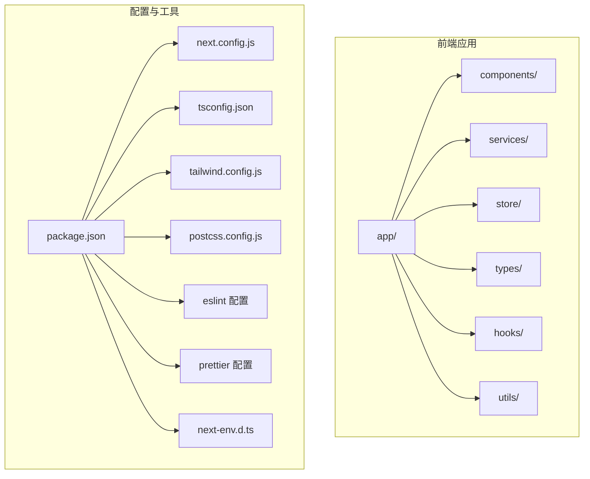
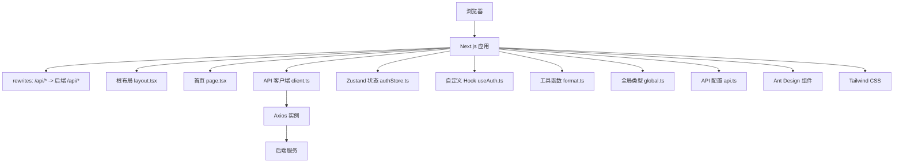
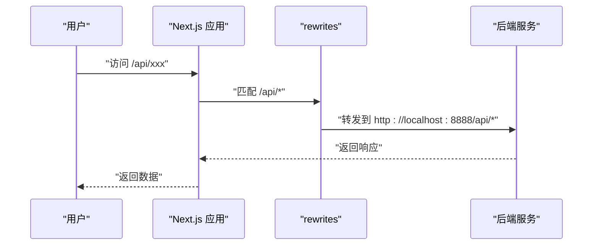
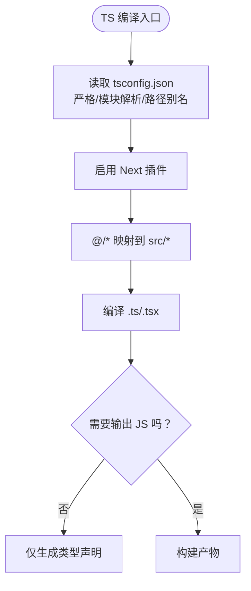
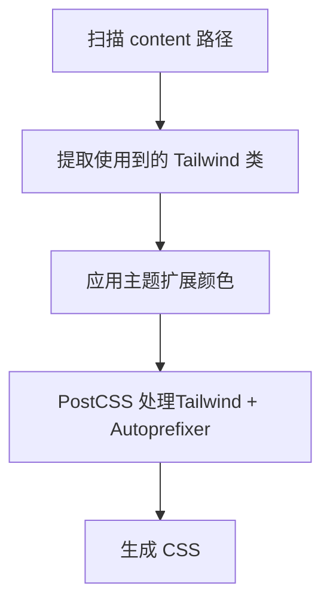
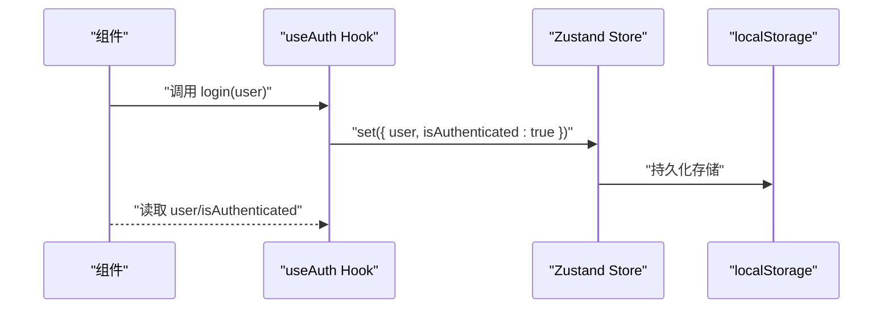
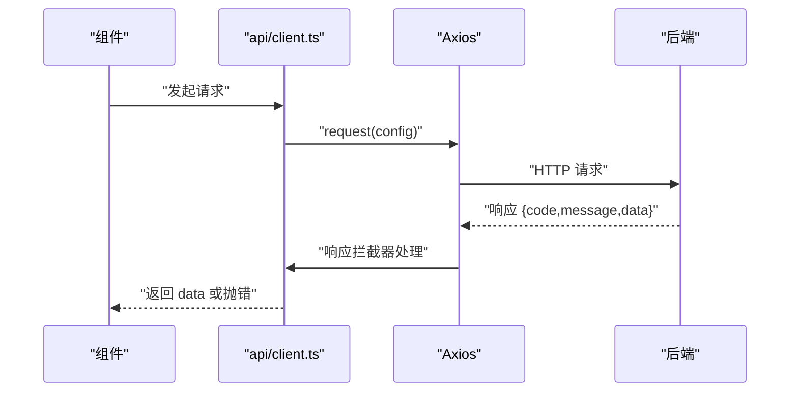
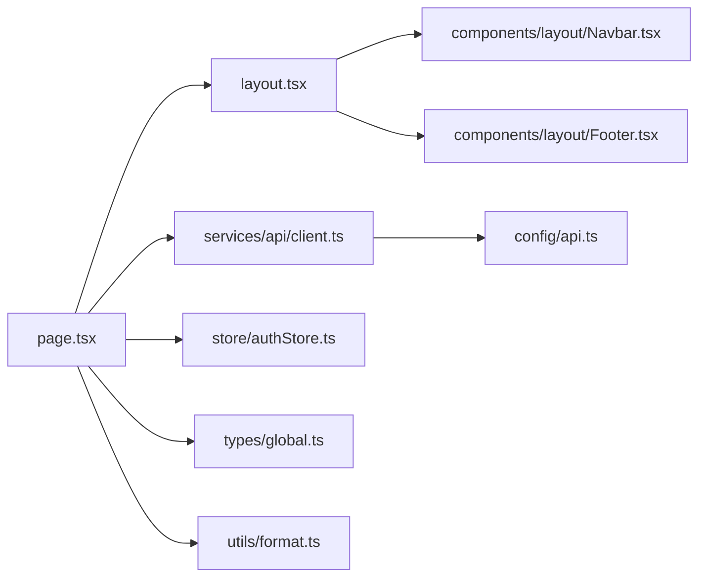

# 技术栈与工具链

<cite>
**本文引用的文件**
- [package.json](file://frontend/package.json)
- [tsconfig.json](file://frontend/tsconfig.json)
- [next.config.js](file://frontend/next.config.js)
- [tailwind.config.js](file://frontend/tailwind.config.js)
- [postcss.config.js](file://frontend/postcss.config.js)
- [.eslintrc.js](file://frontend/.eslintrc.js)
- [.prettierrc](file://frontend/.prettierrc)
- [next-env.d.ts](file://frontend/next-env.d.ts)
- [README.md](file://frontend/README.md)
- [src/app/layout.tsx](file://frontend/src/app/layout.tsx)
- [src/app/page.tsx](file://frontend/src/app/page.tsx)
- [src/types/global.ts](file://frontend/src/types/global.ts)
- [src/store/authStore.ts](file://frontend/src/store/authStore.ts)
- [src/services/api/client.ts](file://frontend/src/services/api/client.ts)
- [src/hooks/useAuth.ts](file://frontend/src/hooks/useAuth.ts)
- [src/components/layout/Navbar.tsx](file://frontend/src/components/layout/Navbar.tsx)
- [src/components/layout/Footer.tsx](file://frontend/src/components/layout/Footer.tsx)
- [src/config/api.ts](file://frontend/src/config/api.ts)
- [src/utils/format.ts](file://frontend/src/utils/format.ts)
</cite>

## 目录
1. [简介](#简介)
2. [项目结构](#项目结构)
3. [核心组件](#核心组件)
4. [架构总览](#架构总览)
5. [详细组件分析](#详细组件分析)
6. [依赖关系分析](#依赖关系分析)
7. [性能考虑](#性能考虑)
8. [故障排查指南](#故障排查指南)
9. [结论](#结论)
10. [附录](#附录)

## 简介
本文件面向前端技术栈与工具链，围绕 Next.js 14+、TypeScript、Tailwind CSS、包管理器（npm/yarn）、以及开发工具链（ESLint、Prettier、PostCSS）进行系统化说明，并结合项目中的实际配置与代码示例，帮助开发者理解并高效使用该技术栈。

## 项目结构
前端采用 Next.js App Router 目录组织方式，核心目录与职责如下：
- app：页面与路由（根布局、首页等）
- components：可复用组件（通用组件、布局组件）
- services：服务层（API 客户端封装）
- store：状态管理（Zustand）
- types：全局类型定义
- hooks：自定义 Hook
- utils：工具函数
- 配置文件：next.config.js、tsconfig.json、tailwind.config.js、postcss.config.js、.eslintrc.js、.prettierrc、package.json、next-env.d.ts

图表来源
- [package.json](file://frontend/package.json#L1-L37)
- [next.config.js](file://frontend/next.config.js#L1-L11)
- [tsconfig.json](file://frontend/tsconfig.json#L1-L28)
- [tailwind.config.js](file://frontend/tailwind.config.js#L1-L22)
- [postcss.config.js](file://frontend/postcss.config.js#L1-L6)
- [.eslintrc.js](file://frontend/.eslintrc.js#L1-L19)
- [.prettierrc](file://frontend/.prettierrc#L1-L10)
- [next-env.d.ts](file://frontend/next-env.d.ts#L1-L6)

章节来源
- [README.md](file://frontend/README.md#L100-L128)

## 核心组件
- Next.js 14：提供 App Router、SSR/SSG、路由与中间件能力，配合 rewrites 实现开发期 API 代理。
- TypeScript：严格类型检查、路径别名、增量编译、插件集成。
- Tailwind CSS：实用优先的原子类，按需扫描、主题扩展与插件。
- 包管理器：npm/yarn，统一依赖与脚本命令。
- 开发工具链：ESLint（Next 推荐规则 + TypeScript 插件 + Prettier 集成）、Prettier（代码风格）、PostCSS（自动前缀与 Tailwind 处理）。
- 状态管理：Zustand（轻量、易用），持久化存储。
- HTTP 客户端：Axios（拦截器、超时、鉴权头注入）。
- UI 组件库：Ant Design（图标、表单、弹窗、导航等）。

章节来源
- [package.json](file://frontend/package.json#L1-L37)
- [tsconfig.json](file://frontend/tsconfig.json#L1-L28)
- [tailwind.config.js](file://frontend/tailwind.config.js#L1-L22)
- [postcss.config.js](file://frontend/postcss.config.js#L1-L6)
- [.eslintrc.js](file://frontend/.eslintrc.js#L1-L19)
- [.prettierrc](file://frontend/.prettierrc#L1-L10)
- [next.config.js](file://frontend/next.config.js#L1-L11)
- [src/services/api/client.ts](file://frontend/src/services/api/client.ts#L1-L63)
- [src/store/authStore.ts](file://frontend/src/store/authStore.ts#L1-L31)

## 架构总览
前端与后端通过 Next.js 的 rewrites 将 /api 前缀代理至后端地址，Axios 客户端统一处理鉴权头、响应解包与错误处理。全局布局组件负责导航与页脚，页面组件负责业务展示与交互。

图表来源
- [next.config.js](file://frontend/next.config.js#L1-L11)
- [src/app/layout.tsx](file://frontend/src/app/layout.tsx#L1-L25)
- [src/app/page.tsx](file://frontend/src/app/page.tsx#L1-L507)
- [src/services/api/client.ts](file://frontend/src/services/api/client.ts#L1-L63)
- [src/store/authStore.ts](file://frontend/src/store/authStore.ts#L1-L31)
- [src/hooks/useAuth.ts](file://frontend/src/hooks/useAuth.ts#L1-L16)
- [src/utils/format.ts](file://frontend/src/utils/format.ts#L1-L44)
- [src/types/global.ts](file://frontend/src/types/global.ts#L1-L55)
- [src/config/api.ts](file://frontend/src/config/api.ts#L1-L23)
- [src/components/layout/Navbar.tsx](file://frontend/src/components/layout/Navbar.tsx#L1-L457)

## 详细组件分析

### Next.js 14 与 App Router
- 路由与页面：根布局与首页分别位于 app/layout.tsx 与 app/page.tsx。
- 开发代理：通过 rewrites 将 /api/* 代理到后端地址，便于本地联调。
- 类型声明：next-env.d.ts 引入 Next.js 类型，避免手动维护类型声明。

图表来源
- [next.config.js](file://frontend/next.config.js#L1-L11)
- [src/app/layout.tsx](file://frontend/src/app/layout.tsx#L1-L25)
- [src/app/page.tsx](file://frontend/src/app/page.tsx#L1-L507)

章节来源
- [next.config.js](file://frontend/next.config.js#L1-L11)
- [next-env.d.ts](file://frontend/next-env.d.ts#L1-L6)
- [src/app/layout.tsx](file://frontend/src/app/layout.tsx#L1-L25)
- [src/app/page.tsx](file://frontend/src/app/page.tsx#L1-L507)

### TypeScript 配置与类型系统
- 编译选项：严格模式、模块解析（bundler）、路径别名（@/*）、增量编译、JSX 保留、禁用 emit 等。
- 类型声明：Next.js 内置类型通过 next-env.d.ts 引入。
- 全局类型：统一定义 API 响应、分页、用户、面试、简历等类型，便于跨组件复用。

图表来源
- [tsconfig.json](file://frontend/tsconfig.json#L1-L28)
- [next-env.d.ts](file://frontend/next-env.d.ts#L1-L6)
- [src/types/global.ts](file://frontend/src/types/global.ts#L1-L55)

章节来源
- [tsconfig.json](file://frontend/tsconfig.json#L1-L28)
- [next-env.d.ts](file://frontend/next-env.d.ts#L1-L6)
- [src/types/global.ts](file://frontend/src/types/global.ts#L1-L55)

### Tailwind CSS 与 PostCSS
- 内容扫描：按 pages、components、app 目录扫描，确保按需生成样式。
- 主题扩展：定义品牌色（primary、secondary、success、warning、error、info）。
- PostCSS：启用 tailwindcss 与 autoprefixer，自动前缀与缩小体积。

图表来源
- [tailwind.config.js](file://frontend/tailwind.config.js#L1-L22)
- [postcss.config.js](file://frontend/postcss.config.js#L1-L6)

章节来源
- [tailwind.config.js](file://frontend/tailwind.config.js#L1-L22)
- [postcss.config.js](file://frontend/postcss.config.js#L1-L6)

### 包管理器与依赖策略
- 依赖与脚本：package.json 定义 Next.js、React、Ant Design、Axios、Zustand、TypeScript、ESLint、Prettier、Tailwind CSS 等。
- 脚本命令：dev/build/start/lint，统一开发与构建流程。
- 版本约束：Next.js 14.0.4、React 18.2.0、TypeScript 5.3.3、Tailwind CSS 3.4.1、ESLint 8.56.0 等。

章节来源
- [package.json](file://frontend/package.json#L1-L37)

### 开发工具链（ESLint、Prettier、PostCSS）
- ESLint：继承 next/core-web-vitals、TypeScript 推荐规则、Prettier 集成，关闭部分严格规则以适配团队习惯。
- Prettier：统一缩进、引号、尾逗号、打印宽度等风格。
- PostCSS：自动前缀与 Tailwind 处理，保证兼容性与体积。

章节来源
- [.eslintrc.js](file://frontend/.eslintrc.js#L1-L19)
- [.prettierrc](file://frontend/.prettierrc#L1-L10)
- [postcss.config.js](file://frontend/postcss.config.js#L1-L6)

### 状态管理（Zustand）与认证 Hook
- Zustand：定义用户状态、登录/登出方法，并持久化到本地存储。
- 自定义 Hook：useAuth 暴露 user、isAuthenticated、login、logout，简化组件使用。

图表来源
- [src/store/authStore.ts](file://frontend/src/store/authStore.ts#L1-L31)
- [src/hooks/useAuth.ts](file://frontend/src/hooks/useAuth.ts#L1-L16)

章节来源
- [src/store/authStore.ts](file://frontend/src/store/authStore.ts#L1-L31)
- [src/hooks/useAuth.ts](file://frontend/src/hooks/useAuth.ts#L1-L16)

### HTTP 客户端（Axios）与 API 配置
- Axios 实例：baseURL 来自 NEXT_PUBLIC_API_BASE_URL 或默认 /api；统一 Content-Type。
- 请求拦截器：自动注入 Authorization 与 X-Auth-Token；对特定接口延长超时。
- 响应拦截器：统一封装响应体（含 code/message/data），401 清理本地 token 并抛错。
- API 配置：集中管理接口常量，便于维护与替换。

图表来源
- [src/services/api/client.ts](file://frontend/src/services/api/client.ts#L1-L63)
- [src/config/api.ts](file://frontend/src/config/api.ts#L1-L23)

章节来源
- [src/services/api/client.ts](file://frontend/src/services/api/client.ts#L1-L63)
- [src/config/api.ts](file://frontend/src/config/api.ts#L1-L23)

### 布局与页面组件
- 根布局：设置站点元数据、字体、全局样式、导航与页脚。
- 首页：展示 Hero、特性卡片、统计数据、用户评价、FAQ、CTA 等区块，大量使用 Ant Design 组件与 Tailwind 类。
- 导航栏：登录/注册弹窗、用户菜单、退出登录、引导步骤弹窗等交互。
- 页脚：版权与链接。

章节来源
- [src/app/layout.tsx](file://frontend/src/app/layout.tsx#L1-L25)
- [src/app/page.tsx](file://frontend/src/app/page.tsx#L1-L507)
- [src/components/layout/Navbar.tsx](file://frontend/src/components/layout/Navbar.tsx#L1-L457)
- [src/components/layout/Footer.tsx](file://frontend/src/components/layout/Footer.tsx#L1-L31)

### 工具函数与类型定义
- 工具函数：日期时间格式化、数字格式化、文件大小格式化、文本截断。
- 全局类型：统一的 API 响应、分页参数/响应、用户、面试、简历等类型，减少重复定义。

章节来源
- [src/utils/format.ts](file://frontend/src/utils/format.ts#L1-L44)
- [src/types/global.ts](file://frontend/src/types/global.ts#L1-L55)

## 依赖关系分析
- 组件依赖：页面组件依赖布局、服务、状态、类型与工具；布局依赖导航与页脚。
- 工具链依赖：Next.js 依赖 TypeScript、Tailwind CSS、PostCSS；ESLint/Prettier 作为开发期工具。
- 运行时依赖：React 生态、Ant Design、Axios、Zustand。

图表来源
- [src/app/page.tsx](file://frontend/src/app/page.tsx#L1-L507)
- [src/app/layout.tsx](file://frontend/src/app/layout.tsx#L1-L25)
- [src/services/api/client.ts](file://frontend/src/services/api/client.ts#L1-L63)
- [src/store/authStore.ts](file://frontend/src/store/authStore.ts#L1-L31)
- [src/types/global.ts](file://frontend/src/types/global.ts#L1-L55)
- [src/utils/format.ts](file://frontend/src/utils/format.ts#L1-L44)
- [src/config/api.ts](file://frontend/src/config/api.ts#L1-L23)
- [src/components/layout/Navbar.tsx](file://frontend/src/components/layout/Navbar.tsx#L1-L457)
- [src/components/layout/Footer.tsx](file://frontend/src/components/layout/Footer.tsx#L1-L31)

## 性能考虑
- 构建与运行：使用 Next.js 14 的 App Router 与增量编译（tsconfig），减少编译开销。
- 样式体积：Tailwind 按需扫描 content，避免无用 CSS；PostCSS 自动前缀与压缩。
- 网络请求：Axios 统一超时与拦截器，减少重复逻辑；对长耗时接口（如面试评估）单独延长超时。
- 状态持久化：Zustand 持久化减少刷新后状态丢失。
- 依赖版本：锁定 Next.js 14.0.4、React 18.2.0、TypeScript 5.3.3 等，确保稳定与兼容。

## 故障排查指南
- 启动端口占用：修改端口或终止占用进程。
- 'use client' 指令错误：确保位于文件首行且无前导空白。
- Tailwind 样式不生效：检查 content 配置、类名拼写、重启开发服务器。
- Ant Design 样式异常：确认文件顶部添加 'use client'、正确导入组件。
- 环境变量未加载：确认 .env.local 存在于 frontend 目录、变量名以 NEXT_PUBLIC_ 开头、重启开发服务器。
- ESLint/Prettier：使用内置 lint 命令与 IDE 插件，保持一致风格。

章节来源
- [README.md](file://frontend/README.md#L179-L229)

## 结论
本项目以 Next.js 14 为核心，结合 TypeScript、Tailwind CSS、Zustand、Axios 与 Ant Design，形成现代化、可维护的前端技术栈。通过统一的配置与工具链，保障开发效率与运行性能。建议在升级时优先验证 Next.js、React、TypeScript 与关键依赖的兼容性，并沿用现有工具链配置以降低迁移成本。

## 附录
- 常用命令
  - 开发：npm run dev / yarn dev
  - 构建：npm run build / yarn build
  - 启动：npm start / yarn start
  - 代码检查：npm run lint / yarn lint
- 环境变量
  - NEXT_PUBLIC_API_BASE_URL：API 基础地址（默认 /api）

章节来源
- [README.md](file://frontend/README.md#L169-L178)
- [src/config/api.ts](file://frontend/src/config/api.ts#L1-L23)