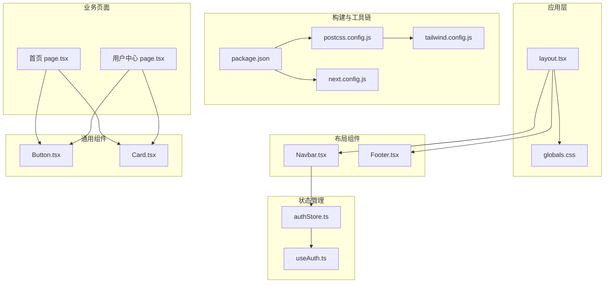
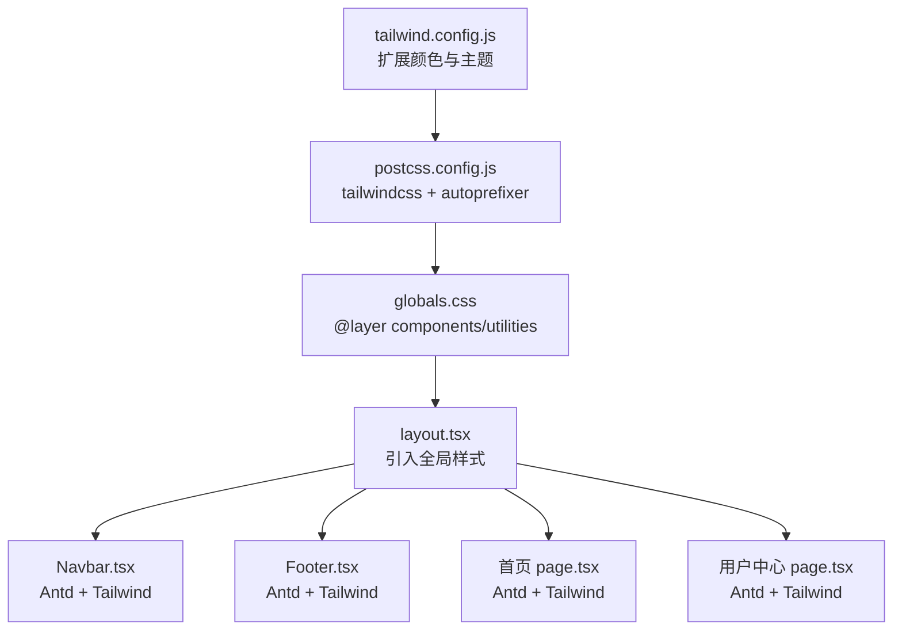
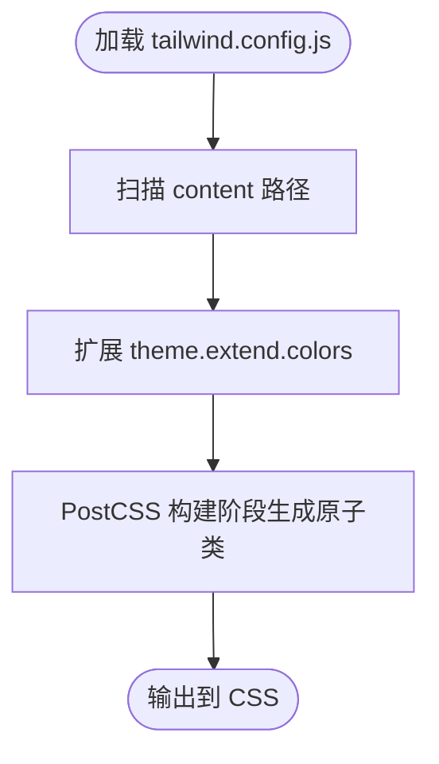
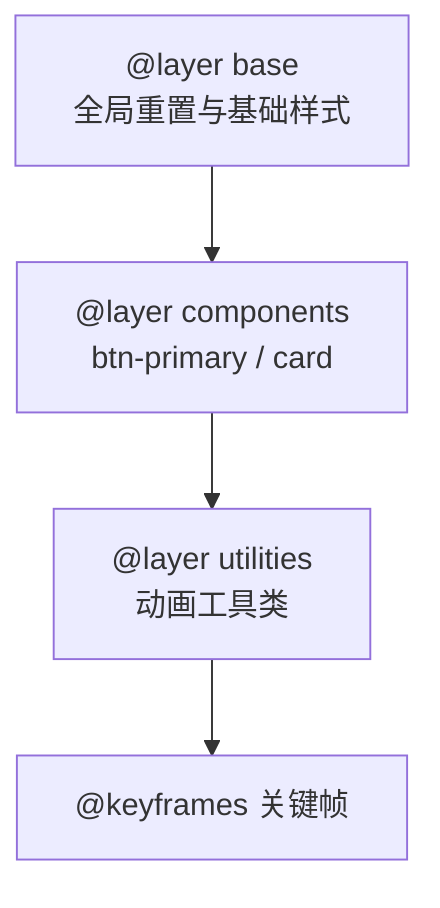
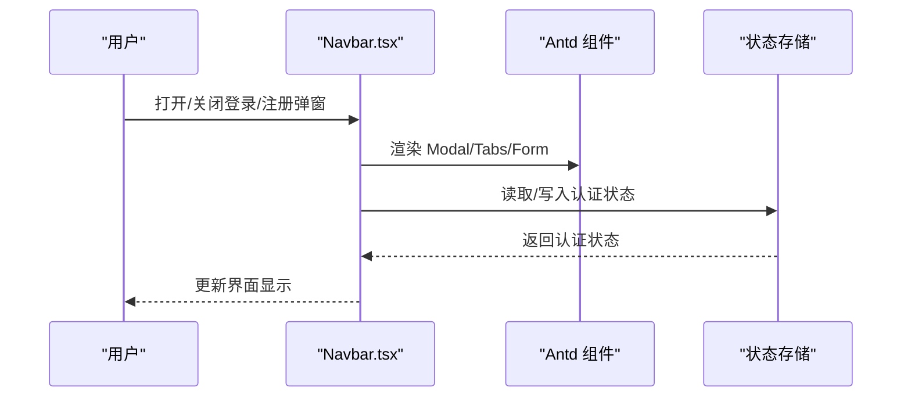
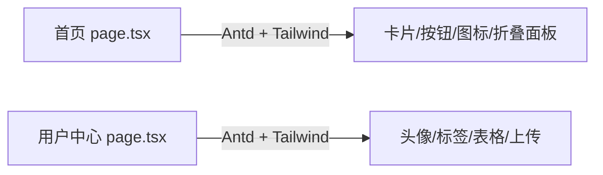
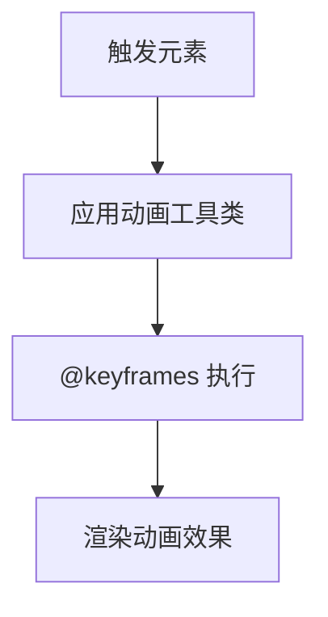
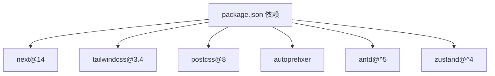

# 样式系统与主题

<cite>
**本文引用的文件**
- [tailwind.config.js](file://frontend/tailwind.config.js)
- [postcss.config.js](file://frontend/postcss.config.js)
- [package.json](file://frontend/package.json)
- [next.config.js](file://frontend/next.config.js)
- [globals.css](file://frontend/src/app/globals.css)
- [layout.tsx](file://frontend/src/app/layout.tsx)
- [Navbar.tsx](file://frontend/src/components/layout/Navbar.tsx)
- [Footer.tsx](file://frontend/src/components/layout/Footer.tsx)
- [Button.tsx](file://frontend/src/components/common/Button.tsx)
- [Card.tsx](file://frontend/src/components/common/Card.tsx)
- [page.tsx（首页）](file://frontend/src/app/page.tsx)
- [page.tsx（用户中心）](file://frontend/src/app/user/center/page.tsx)
- [authStore.ts](file://frontend/src/store/authStore.ts)
- [useAuth.ts](file://frontend/src/hooks/useAuth.ts)
</cite>

## 目录
1. [简介](#简介)
2. [项目结构](#项目结构)
3. [核心组件](#核心组件)
4. [架构总览](#架构总览)
5. [详细组件分析](#详细组件分析)
6. [依赖关系分析](#依赖关系分析)
7. [性能考量](#性能考量)
8. [故障排查指南](#故障排查指南)
9. [结论](#结论)
10. [附录](#附录)

## 简介
本文件系统性梳理前端样式系统与主题实现，围绕以下目标展开：
- Tailwind CSS 实用类系统与自定义配置
- CSS 模块化与样式隔离策略
- 主题系统设计与实现（颜色、字体、间距）
- 响应式设计最佳实践与断点配置
- 动画与过渡效果的实现方法
- 暗色模式支持与主题切换机制
- 样式性能优化与 CSS-in-JS 选择策略

当前项目采用 Next.js + Tailwind CSS + PostCSS + Ant Design 组件库的组合，通过 Tailwind 的工具类与 @apply 层扩展实现统一风格，Antd 提供业务组件的交互与视觉一致性。

## 项目结构
前端样式相关的关键位置如下：
- 构建与工具链：postcss.config.js、tailwind.config.js、package.json、next.config.js
- 全局样式：globals.css
- 应用布局：layout.tsx
- 布局组件：Navbar.tsx、Footer.tsx
- 业务页面：首页 page.tsx、用户中心 page.tsx
- 通用组件：Button.tsx、Card.tsx
- 状态管理：authStore.ts、useAuth.ts

图表来源
- [package.json](file://frontend/package.json#L1-L37)
- [postcss.config.js](file://frontend/postcss.config.js#L1-L6)
- [tailwind.config.js](file://frontend/tailwind.config.js#L1-L22)
- [next.config.js](file://frontend/next.config.js#L1-L11)
- [layout.tsx](file://frontend/src/app/layout.tsx#L1-L25)
- [globals.css](file://frontend/src/app/globals.css#L1-L72)
- [Navbar.tsx](file://frontend/src/components/layout/Navbar.tsx#L1-L457)
- [Footer.tsx](file://frontend/src/components/layout/Footer.tsx#L1-L31)
- [Button.tsx](file://frontend/src/components/common/Button.tsx#L1-L6)
- [Card.tsx](file://frontend/src/components/common/Card.tsx#L1-L14)
- [page.tsx（首页）](file://frontend/src/app/page.tsx#L1-L507)
- [page.tsx（用户中心）](file://frontend/src/app/user/center/page.tsx#L1-L385)
- [authStore.ts](file://frontend/src/store/authStore.ts#L1-L31)
- [useAuth.ts](file://frontend/src/hooks/useAuth.ts#L1-L16)

章节来源
- [package.json](file://frontend/package.json#L1-L37)
- [postcss.config.js](file://frontend/postcss.config.js#L1-L6)
- [tailwind.config.js](file://frontend/tailwind.config.js#L1-L22)
- [next.config.js](file://frontend/next.config.js#L1-L11)
- [layout.tsx](file://frontend/src/app/layout.tsx#L1-L25)
- [globals.css](file://frontend/src/app/globals.css#L1-L72)

## 核心组件
- Tailwind 配置与扩展：在 tailwind.config.js 中扩展了 primary、secondary、success、warning、error、info 等语义色，作为品牌与状态色的统一来源。
- PostCSS 流水线：postcss.config.js 启用 tailwindcss 与 autoprefixer 插件，确保原子类与浏览器兼容性。
- 全局样式与层：globals.css 引入 Tailwind 三段式指令，并在 @layer components 与 @layer utilities 中定义可复用组件与动画工具类。
- 布局与导航：layout.tsx 引入全局样式与 Navbar/Footer；Navbar.tsx 使用 Antd 组件与 Tailwind 类实现导航栏交互与视觉。
- 业务页面：首页与用户中心广泛使用 Antd 组件与 Tailwind 工具类，形成一致的排版、间距与交互反馈。
- 通用组件：Button.tsx、Card.tsx 对 Antd 组件进行轻量封装，便于统一风格与扩展。

章节来源
- [tailwind.config.js](file://frontend/tailwind.config.js#L8-L19)
- [postcss.config.js](file://frontend/postcss.config.js#L1-L6)
- [globals.css](file://frontend/src/app/globals.css#L1-L72)
- [layout.tsx](file://frontend/src/app/layout.tsx#L1-L25)
- [Navbar.tsx](file://frontend/src/components/layout/Navbar.tsx#L1-L457)
- [Button.tsx](file://frontend/src/components/common/Button.tsx#L1-L6)
- [Card.tsx](file://frontend/src/components/common/Card.tsx#L1-L14)
- [page.tsx（首页）](file://frontend/src/app/page.tsx#L1-L507)
- [page.tsx（用户中心）](file://frontend/src/app/user/center/page.tsx#L1-L385)

## 架构总览
样式系统采用“工具类优先 + 组件层扩展”的双轨策略：
- 工具类优先：通过 Tailwind 工具类实现布局、间距、颜色、阴影、动画等，保证一致性与可维护性。
- 组件层扩展：在 @layer components 定义语义化组件类（如 btn-primary、card），在 @layer utilities 定义动画工具类（如 animate-fade-in-up、animate-bounce-subtle），减少重复样式。
- Antd 组件：在页面中直接使用 Antd 组件，结合 Tailwind 类进行微调，确保品牌风格与交互一致。

图表来源
- [tailwind.config.js](file://frontend/tailwind.config.js#L1-L22)
- [postcss.config.js](file://frontend/postcss.config.js#L1-L6)
- [globals.css](file://frontend/src/app/globals.css#L1-L72)
- [layout.tsx](file://frontend/src/app/layout.tsx#L1-L25)
- [Navbar.tsx](file://frontend/src/components/layout/Navbar.tsx#L1-L457)
- [Footer.tsx](file://frontend/src/components/layout/Footer.tsx#L1-L31)
- [page.tsx（首页）](file://frontend/src/app/page.tsx#L1-L507)
- [page.tsx（用户中心）](file://frontend/src/app/user/center/page.tsx#L1-L385)

## 详细组件分析

### Tailwind 配置与主题系统
- 颜色系统：在 theme.extend.colors 中定义 primary、secondary、success、warning、error、info 等语义色，用于按钮、徽标、状态反馈等场景。
- 内容扫描：content 指向 src/app、src/components、src/pages 下的 TS/JS/TSX 文件，确保按需生成原子类，避免无用样式。
- 插件：当前未启用额外插件，保持构建简洁。

图表来源
- [tailwind.config.js](file://frontend/tailwind.config.js#L3-L19)

章节来源
- [tailwind.config.js](file://frontend/tailwind.config.js#L1-L22)

### 全局样式与层扩展
- 三段式指令：@tailwind base、components、utilities，确保基础样式、组件层与工具层的正确顺序。
- 全局重置：body 与通用容器类，统一字体族与背景色。
- 组件层：定义 btn-primary、card 等语义化类，减少重复样式。
- 动画层：定义 fadeInUp、bounceSubtle 等动画工具类，配合关键帧实现过渡效果。

图表来源
- [globals.css](file://frontend/src/app/globals.css#L1-L72)

章节来源
- [globals.css](file://frontend/src/app/globals.css#L1-L72)

### 布局与导航组件
- Navbar：使用 Antd Layout/Header、Typography、Button、Dropdown、Modal、Tabs、Form、Input 等组件，结合 Tailwind 类实现粘性头部、渐变背景、模糊边框、过渡动画等。
- Footer：Antd Layout/Footer，使用 Tailwind 类统一容器与文本样式。

图表来源
- [Navbar.tsx](file://frontend/src/components/layout/Navbar.tsx#L1-L457)
- [authStore.ts](file://frontend/src/store/authStore.ts#L1-L31)
- [useAuth.ts](file://frontend/src/hooks/useAuth.ts#L1-L16)

章节来源
- [Navbar.tsx](file://frontend/src/components/layout/Navbar.tsx#L1-L457)
- [Footer.tsx](file://frontend/src/components/layout/Footer.tsx#L1-L31)
- [authStore.ts](file://frontend/src/store/authStore.ts#L1-L31)
- [useAuth.ts](file://frontend/src/hooks/useAuth.ts#L1-L16)

### 业务页面样式实践
- 首页：大量使用 Antd 组件与 Tailwind 工具类，实现渐变标题、卡片悬停效果、统计区块、用户评价、FAQ 折叠面板、底部行动号召等。
- 用户中心：头像、标签、表格、上传拖拽区、提示与警告等，均通过 Antd 与 Tailwind 组合实现一致风格。

图表来源
- [page.tsx（首页）](file://frontend/src/app/page.tsx#L1-L507)
- [page.tsx（用户中心）](file://frontend/src/app/user/center/page.tsx#L1-L385)

章节来源
- [page.tsx（首页）](file://frontend/src/app/page.tsx#L1-L507)
- [page.tsx（用户中心）](file://frontend/src/app/user/center/page.tsx#L1-L385)

### 动画与过渡效果
- 动画工具类：fadeInUp、bounceSubtle，配合 @keyframes 实现淡入上移与轻微弹跳。
- 过渡与悬停：在组件层与工具类中广泛使用 transition、hover 效果，增强交互反馈。

图表来源
- [globals.css](file://frontend/src/app/globals.css#L41-L71)

章节来源
- [globals.css](file://frontend/src/app/globals.css#L41-L71)

### 响应式设计与断点
- 断点使用：在组件与页面中广泛使用 sm:、md:、lg: 前缀，遵循 Tailwind 默认断点（sm=640px、md=768px、lg=1024px）。
- 实践示例：导航栏在小屏隐藏、网格布局在不同尺寸下切换列数、按钮与卡片在 hover 时的位移与阴影变化。

章节来源
- [Navbar.tsx](file://frontend/src/components/layout/Navbar.tsx#L139-L216)
- [page.tsx（首页）](file://frontend/src/app/page.tsx#L212-L307)
- [page.tsx（用户中心）](file://frontend/src/app/user/center/page.tsx#L224-L380)

### 暗色模式与主题切换
- 当前状态：仓库未提供暗色模式开关或主题切换逻辑。
- 建议方案：
  - 在 tailwind.config.js 中新增 darkMode: 'class' 或 'selector'，并在根节点添加 data-theme 或 class 切换。
  - 在 globals.css 中为暗色模式定义颜色映射与变量，或通过 @apply 在暗色模式下覆盖默认样式。
  - 在 Navbar 或全局布局中增加主题切换按钮，结合 localStorage 或 Zustand 状态持久化。

章节来源
- [tailwind.config.js](file://frontend/tailwind.config.js#L1-L22)
- [globals.css](file://frontend/src/app/globals.css#L1-L72)
- [Navbar.tsx](file://frontend/src/components/layout/Navbar.tsx#L1-L457)

## 依赖关系分析
- 构建依赖：Next.js 14、Tailwind CSS 3.4、PostCSS 8、Autoprefixer。
- 组件依赖：Ant Design 5，提供丰富的 UI 与交互组件。
- 状态依赖：Zustand 用于认证状态管理，与 Antd 组件协同更新界面。

图表来源
- [package.json](file://frontend/package.json#L11-L36)

章节来源
- [package.json](file://frontend/package.json#L1-L37)

## 性能考量
- 按需生成：content 扫描确保仅生成实际使用的原子类，减少 CSS 体积。
- PostCSS 优化：autoprefixer 自动补全浏览器前缀，降低手动维护成本。
- 组件层复用：通过 @layer components 定义语义化类，避免重复样式与冗余类名。
- 动画与过渡：合理使用 transition 与关键帧，避免过度动画影响性能。
- Antd 与 Tailwind 结合：Antd 组件自带样式，尽量通过 Tailwind 类进行微调，避免覆盖式样式导致的冲突与体积膨胀。

章节来源
- [tailwind.config.js](file://frontend/tailwind.config.js#L3-L7)
- [postcss.config.js](file://frontend/postcss.config.js#L1-L6)
- [globals.css](file://frontend/src/app/globals.css#L30-L49)

## 故障排查指南
- Tailwind 样式未生效
  - 检查 tailwind.config.js 的 content 路径是否包含当前页面/组件文件。
  - 确认 PostCSS 流水线已启用 tailwindcss 与 autoprefixer。
  - 清理构建缓存后重新构建。
- Antd 样式冲突
  - 确保 Antd 版本与项目兼容，避免版本不一致导致的样式错乱。
  - 通过 Antd 的 ConfigProvider 或 CSS 变量进行主题定制，避免直接覆盖内部样式。
- 动画不生效
  - 检查 @keyframes 是否在正确的 @layer 中定义，且工具类正确应用。
  - 确认动画时长与 timing-function 设置合理，避免闪烁或卡顿。
- 响应式异常
  - 检查断点前缀使用是否正确，确保在目标断点下类名拼写无误。
  - 验证容器宽度与媒体查询断点匹配。

章节来源
- [tailwind.config.js](file://frontend/tailwind.config.js#L3-L7)
- [postcss.config.js](file://frontend/postcss.config.js#L1-L6)
- [globals.css](file://frontend/src/app/globals.css#L41-L71)
- [Navbar.tsx](file://frontend/src/components/layout/Navbar.tsx#L139-L216)

## 结论
本项目通过 Tailwind 工具类与 Antd 组件的组合，实现了统一、可维护的样式体系。通过 @layer 扩展与语义化类名，提升了复用性与一致性；通过合理的响应式断点与过渡动画，增强了用户体验。建议后续补充暗色模式与主题切换机制，完善主题系统与可访问性。

## 附录
- Next.js 重写规则：将 /api/* 请求代理至本地后端，便于开发联调。
- 字体与全局样式：Inter 字体引入，body 统一字体与背景色，容器类统一最大宽度与内边距。

章节来源
- [next.config.js](file://frontend/next.config.js#L1-L11)
- [layout.tsx](file://frontend/src/app/layout.tsx#L7-L22)