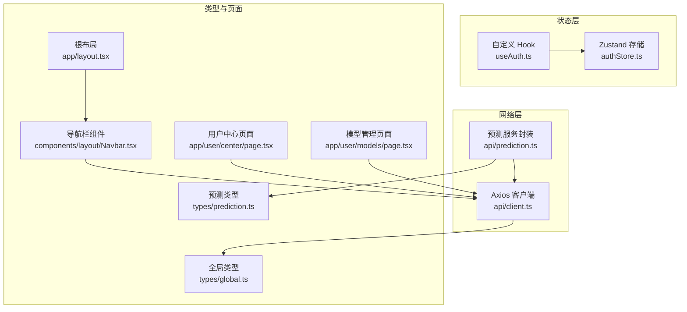
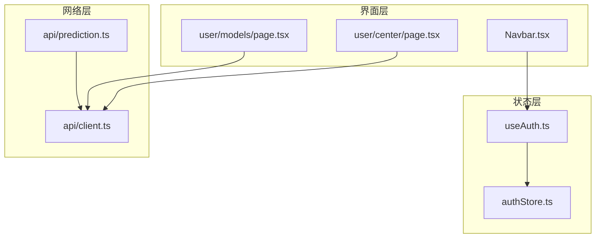
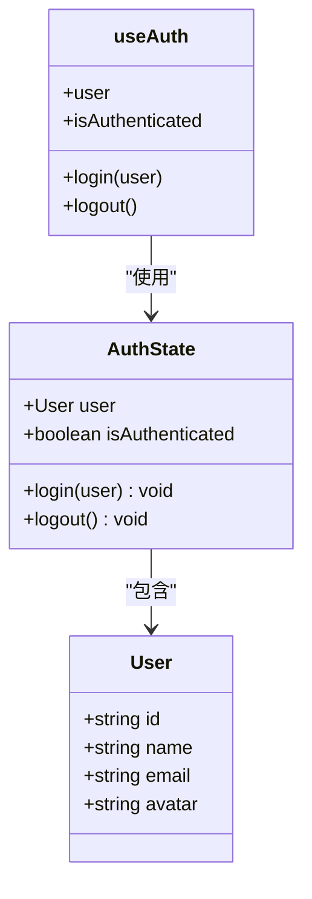
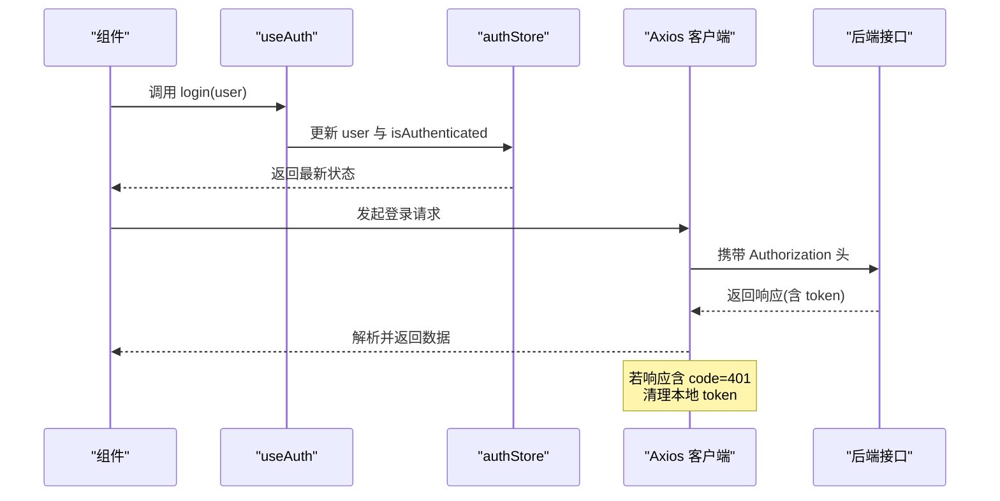
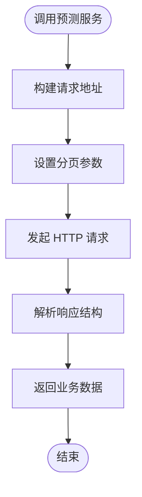
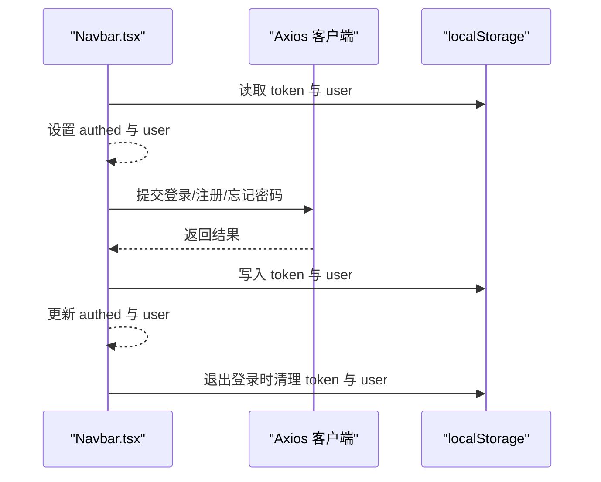
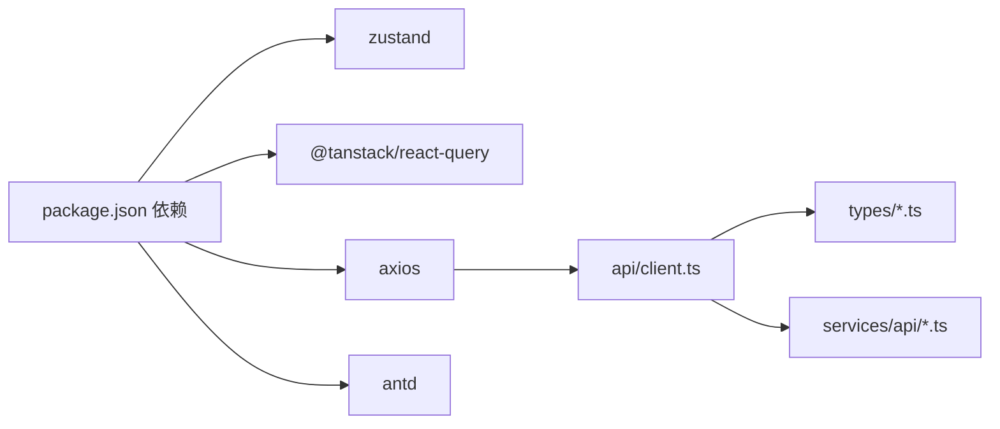

# 状态管理

<cite>
**本文引用的文件**
- [frontend/src/store/authStore.ts](file://frontend/src/store/authStore.ts)
- [frontend/src/hooks/useAuth.ts](file://frontend/src/hooks/useAuth.ts)
- [frontend/src/services/api/client.ts](file://frontend/src/services/api/client.ts)
- [frontend/src/services/api/prediction.ts](file://frontend/src/services/api/prediction.ts)
- [frontend/src/types/global.ts](file://frontend/src/types/global.ts)
- [frontend/src/types/prediction.ts](file://frontend/src/types/prediction.ts)
- [frontend/package.json](file://frontend/package.json)
- [frontend/src/components/layout/Navbar.tsx](file://frontend/src/components/layout/Navbar.tsx)
- [frontend/src/app/user/center/page.tsx](file://frontend/src/app/user/center/page.tsx)
- [frontend/src/app/user/models/page.tsx](file://frontend/src/app/user/models/page.tsx)
- [frontend/src/app/layout.tsx](file://frontend/src/app/layout.tsx)
</cite>

## 目录
1. [简介](#简介)
2. [项目结构](#项目结构)
3. [核心组件](#核心组件)
4. [架构总览](#架构总览)
5. [详细组件分析](#详细组件分析)
6. [依赖关系分析](#依赖关系分析)
7. [性能考量](#性能考量)
8. [故障排查指南](#故障排查指南)
9. [结论](#结论)
10. [附录](#附录)

## 简介
本文件围绕前端状态管理进行系统性说明，重点覆盖以下方面：
- Zustand 全局状态设计与最佳实践（认证状态、UI 状态）
- React Query 在数据获取与缓存中的应用现状与建议
- 本地状态与全局状态的选择策略
- 状态持久化、状态同步与并发控制机制
- 状态调试工具与开发体验优化
- 性能优化与内存泄漏防护

当前仓库中已引入 Zustand 与 React Query 依赖，但 React Query 在本仓库中尚未被显式使用。本文将结合现有代码，给出基于仓库现状的完整状态管理方案与落地建议。

## 项目结构
前端采用 Next.js 应用结构，状态管理相关文件主要集中在以下位置：
- 状态存储：frontend/src/store
- 自定义 Hook：frontend/src/hooks
- API 客户端与服务封装：frontend/src/services/api
- 类型定义：frontend/src/types
- 页面与组件：frontend/src/app 与 frontend/src/components

图表来源
- [frontend/src/store/authStore.ts](file://frontend/src/store/authStore.ts#L1-L31)
- [frontend/src/hooks/useAuth.ts](file://frontend/src/hooks/useAuth.ts#L1-L16)
- [frontend/src/services/api/client.ts](file://frontend/src/services/api/client.ts#L1-L63)
- [frontend/src/services/api/prediction.ts](file://frontend/src/services/api/prediction.ts#L1-L16)
- [frontend/src/types/global.ts](file://frontend/src/types/global.ts#L1-L55)
- [frontend/src/types/prediction.ts](file://frontend/src/types/prediction.ts#L1-L33)
- [frontend/src/components/layout/Navbar.tsx](file://frontend/src/components/layout/Navbar.tsx#L1-L457)
- [frontend/src/app/user/center/page.tsx](file://frontend/src/app/user/center/page.tsx#L186-L220)
- [frontend/src/app/user/models/page.tsx](file://frontend/src/app/user/models/page.tsx#L200-L319)
- [frontend/src/app/layout.tsx](file://frontend/src/app/layout.tsx#L1-L25)

章节来源
- [frontend/src/store/authStore.ts](file://frontend/src/store/authStore.ts#L1-L31)
- [frontend/src/hooks/useAuth.ts](file://frontend/src/hooks/useAuth.ts#L1-L16)
- [frontend/src/services/api/client.ts](file://frontend/src/services/api/client.ts#L1-L63)
- [frontend/src/services/api/prediction.ts](file://frontend/src/services/api/prediction.ts#L1-L16)
- [frontend/src/types/global.ts](file://frontend/src/types/global.ts#L1-L55)
- [frontend/src/types/prediction.ts](file://frontend/src/types/prediction.ts#L1-L33)
- [frontend/src/components/layout/Navbar.tsx](file://frontend/src/components/layout/Navbar.tsx#L1-L457)
- [frontend/src/app/user/center/page.tsx](file://frontend/src/app/user/center/page.tsx#L186-L220)
- [frontend/src/app/user/models/page.tsx](file://frontend/src/app/user/models/page.tsx#L200-L319)
- [frontend/src/app/layout.tsx](file://frontend/src/app/layout.tsx#L1-L25)

## 核心组件
- Zustand 认证状态存储：提供用户信息与登录态的全局状态，支持持久化存储，便于跨路由共享。
- 自定义 Hook useAuth：封装认证状态的读取与更新，简化组件使用。
- Axios 客户端：统一请求/响应拦截、鉴权头注入、错误处理与超时配置。
- 预测服务封装：对预测相关接口进行统一封装，便于后续接入 React Query。
- 全局类型与预测类型：为 API 响应与业务实体提供强类型保障。
- 导航栏组件：展示登录态、触发登录/注册/登出流程，并与本地存储交互。
- 用户中心与模型管理页面：展示用户配置检查与模型详情加载逻辑。

章节来源
- [frontend/src/store/authStore.ts](file://frontend/src/store/authStore.ts#L1-L31)
- [frontend/src/hooks/useAuth.ts](file://frontend/src/hooks/useAuth.ts#L1-L16)
- [frontend/src/services/api/client.ts](file://frontend/src/services/api/client.ts#L1-L63)
- [frontend/src/services/api/prediction.ts](file://frontend/src/services/api/prediction.ts#L1-L16)
- [frontend/src/types/global.ts](file://frontend/src/types/global.ts#L1-L55)
- [frontend/src/types/prediction.ts](file://frontend/src/types/prediction.ts#L1-L33)
- [frontend/src/components/layout/Navbar.tsx](file://frontend/src/components/layout/Navbar.tsx#L1-L457)
- [frontend/src/app/user/center/page.tsx](file://frontend/src/app/user/center/page.tsx#L186-L220)
- [frontend/src/app/user/models/page.tsx](file://frontend/src/app/user/models/page.tsx#L200-L319)

## 架构总览
下图展示了前端状态管理的整体架构：Zustand 作为全局状态容器，Axios 作为网络层，页面与组件通过自定义 Hook 与服务封装进行交互。

图表来源
- [frontend/src/components/layout/Navbar.tsx](file://frontend/src/components/layout/Navbar.tsx#L1-L457)
- [frontend/src/app/user/center/page.tsx](file://frontend/src/app/user/center/page.tsx#L186-L220)
- [frontend/src/app/user/models/page.tsx](file://frontend/src/app/user/models/page.tsx#L200-L319)
- [frontend/src/store/authStore.ts](file://frontend/src/store/authStore.ts#L1-L31)
- [frontend/src/hooks/useAuth.ts](file://frontend/src/hooks/useAuth.ts#L1-L16)
- [frontend/src/services/api/client.ts](file://frontend/src/services/api/client.ts#L1-L63)
- [frontend/src/services/api/prediction.ts](file://frontend/src/services/api/prediction.ts#L1-L16)

## 详细组件分析

### Zustand 认证状态与持久化
- 设计要点
  - 使用 persist 中间件将认证状态持久化到本地存储，确保刷新后仍保持登录态。
  - 提供 login 与 logout 方法，原子化更新用户信息与登录态。
  - 自定义 Hook useAuth 将状态与方法暴露给组件，降低耦合。
- 数据结构
  - 用户信息包含标识、名称、邮箱、头像等字段。
  - 登录态布尔值用于控制 UI 与路由行为。
- 最佳实践
  - 将敏感信息（如 token）放在 Zustand 内部，避免直接暴露到组件。
  - 对登录态变更进行统一处理，例如在登录成功后同步更新本地存储与 Cookie。
  - 对 logout 进行幂等处理，清理所有相关状态与本地存储。

图表来源
- [frontend/src/store/authStore.ts](file://frontend/src/store/authStore.ts#L4-L16)
- [frontend/src/hooks/useAuth.ts](file://frontend/src/hooks/useAuth.ts#L4-L12)

章节来源
- [frontend/src/store/authStore.ts](file://frontend/src/store/authStore.ts#L1-L31)
- [frontend/src/hooks/useAuth.ts](file://frontend/src/hooks/useAuth.ts#L1-L16)

### Axios 客户端与鉴权拦截
- 设计要点
  - 统一 base URL、超时与请求头。
  - 请求拦截：根据路径判断是否免鉴权，自动注入 Authorization 与 X-Auth-Token。
  - 响应拦截：解析统一响应结构，处理 401 并清理本地存储。
  - 特殊接口超时：对面试评估与答题记录接口设置较长超时。
- 错误处理
  - 对 401 统一清理 token，保证后续请求不会携带无效令牌。
  - 将业务错误码与消息透传，便于上层组件展示。

图表来源
- [frontend/src/hooks/useAuth.ts](file://frontend/src/hooks/useAuth.ts#L4-L12)
- [frontend/src/store/authStore.ts](file://frontend/src/store/authStore.ts#L18-L25)
- [frontend/src/services/api/client.ts](file://frontend/src/services/api/client.ts#L13-L33)
- [frontend/src/services/api/client.ts](file://frontend/src/services/api/client.ts#L36-L60)

章节来源
- [frontend/src/services/api/client.ts](file://frontend/src/services/api/client.ts#L1-L63)

### 预测服务封装与类型定义
- 设计要点
  - predictionService 对预测列表与详情接口进行封装，隐藏底层实现细节。
  - 类型定义覆盖列表与详情响应结构，确保调用方获得强类型提示。
- 扩展建议
  - 引入 React Query 后，可将 predictionService 作为查询函数，利用其缓存、重试、失效策略等能力。

图表来源
- [frontend/src/services/api/prediction.ts](file://frontend/src/services/api/prediction.ts#L4-L15)
- [frontend/src/types/prediction.ts](file://frontend/src/types/prediction.ts#L11-L16)
- [frontend/src/types/prediction.ts](file://frontend/src/types/prediction.ts#L29-L32)

章节来源
- [frontend/src/services/api/prediction.ts](file://frontend/src/services/api/prediction.ts#L1-L16)
- [frontend/src/types/prediction.ts](file://frontend/src/types/prediction.ts#L1-L33)

### 导航栏与登录态展示
- 设计要点
  - 组件初始化时从本地存储读取 token 与用户信息，决定是否显示登录态。
  - 登录/注册/忘记密码表单提交后，写入 token 与用户信息，并更新登录态。
  - 退出登录时清理本地存储与 Cookie，并跳转首页。
- 与状态管理的关系
  - 当前导航栏同时维护本地存储与组件内部状态；建议统一由 Zustand 管理登录态，减少重复逻辑。

图表来源
- [frontend/src/components/layout/Navbar.tsx](file://frontend/src/components/layout/Navbar.tsx#L38-L43)
- [frontend/src/components/layout/Navbar.tsx](file://frontend/src/components/layout/Navbar.tsx#L45-L120)

章节来源
- [frontend/src/components/layout/Navbar.tsx](file://frontend/src/components/layout/Navbar.tsx#L1-L457)

### 用户中心与模型管理页面
- 设计要点
  - 用户中心页面在挂载时检查模型配置状态，并拉取用户资料与简历列表。
  - 模型管理页面加载模型详情，解析配置 JSON 并回填表单。
- 状态与数据流
  - 页面通过 Axios 客户端发起请求，得到统一响应结构后进行解析与状态更新。
  - 建议后续引入 React Query，统一管理这些数据请求与缓存。

章节来源
- [frontend/src/app/user/center/page.tsx](file://frontend/src/app/user/center/page.tsx#L186-L220)
- [frontend/src/app/user/models/page.tsx](file://frontend/src/app/user/models/page.tsx#L200-L319)

## 依赖关系分析
- 依赖清单
  - Zustand：全局状态管理
  - @tanstack/react-query：数据获取与缓存（已安装，尚未在仓库中显式使用）
  - axios：HTTP 客户端
  - antd：UI 组件库
- 潜在耦合
  - 组件与本地存储存在直接耦合，建议统一通过 Zustand 管理。
  - Axios 客户端承担了较多职责（鉴权、错误处理），建议将其与查询层解耦。

图表来源
- [frontend/package.json](file://frontend/package.json#L11-L19)
- [frontend/src/services/api/client.ts](file://frontend/src/services/api/client.ts#L1-L63)
- [frontend/src/types/global.ts](file://frontend/src/types/global.ts#L1-L55)
- [frontend/src/types/prediction.ts](file://frontend/src/types/prediction.ts#L1-L33)
- [frontend/src/services/api/prediction.ts](file://frontend/src/services/api/prediction.ts#L1-L16)

章节来源
- [frontend/package.json](file://frontend/package.json#L1-L37)

## 性能考量
- 状态粒度与订阅范围
  - 将登录态与用户信息拆分为独立切片，避免无关状态变更导致的重渲染。
  - 使用 selector 仅订阅需要的状态片段，减少不必要的组件更新。
- 持久化策略
  - 对认证状态启用持久化，但避免持久化大型对象；必要时进行序列化/反序列化优化。
- 网络层优化
  - Axios 已设置合理超时与请求头，建议对高频接口启用缓存与并发限制。
- React Query 推荐
  - 引入查询客户端后，利用其默认缓存、重试、失效与并发合并能力，显著降低重复请求与内存占用。
  - 使用查询键规范化与查询失效策略，确保数据一致性与性能平衡。

## 故障排查指南
- 登录后页面未更新登录态
  - 检查本地存储写入与组件内部状态同步逻辑，建议统一由 Zustand 管理。
  - 确认请求拦截器正确注入 Authorization 头。
- 401 错误频繁出现
  - 检查响应拦截器是否正确清理本地 token。
  - 确认后端 JWT 有效期与刷新策略。
- 预测接口超时
  - Axios 已为特定接口设置较长超时，若仍失败，考虑增加超时阈值或引入分页/节流。
- 状态不一致
  - 建议引入 React Query 的查询失效与乐观更新，确保 UI 与数据源一致。

章节来源
- [frontend/src/services/api/client.ts](file://frontend/src/services/api/client.ts#L13-L33)
- [frontend/src/services/api/client.ts](file://frontend/src/services/api/client.ts#L36-L60)
- [frontend/src/components/layout/Navbar.tsx](file://frontend/src/components/layout/Navbar.tsx#L38-L43)

## 结论
- 本仓库已具备良好的状态管理基础：Zustand 提供轻量全局状态，Axios 提供统一网络层，类型定义保障强类型。
- 建议下一步引入 React Query，将数据获取与缓存能力标准化，进一步提升性能与开发体验。
- 在登录态管理上，建议统一由 Zustand 管理，减少本地存储与组件状态的重复逻辑。
- 通过合理的状态切片、持久化策略与查询层抽象，可有效避免内存泄漏与性能瓶颈。

## 附录
- 状态持久化最佳实践
  - 仅持久化必要字段（如用户标识与登录态），避免持久化大型对象。
  - 对持久化存储进行版本迁移与兼容处理。
- 状态同步与并发控制
  - 使用原子性更新与不可变更新，避免竞态条件。
  - 对高频请求进行去抖/节流与并发合并。
- 开发体验优化
  - 在开发环境启用 Zustand Devtools 与 React Query Devtools，辅助调试。
  - 对关键查询设置合适的缓存时间与失效策略，兼顾实时性与性能。