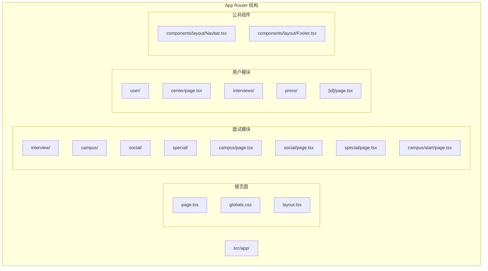
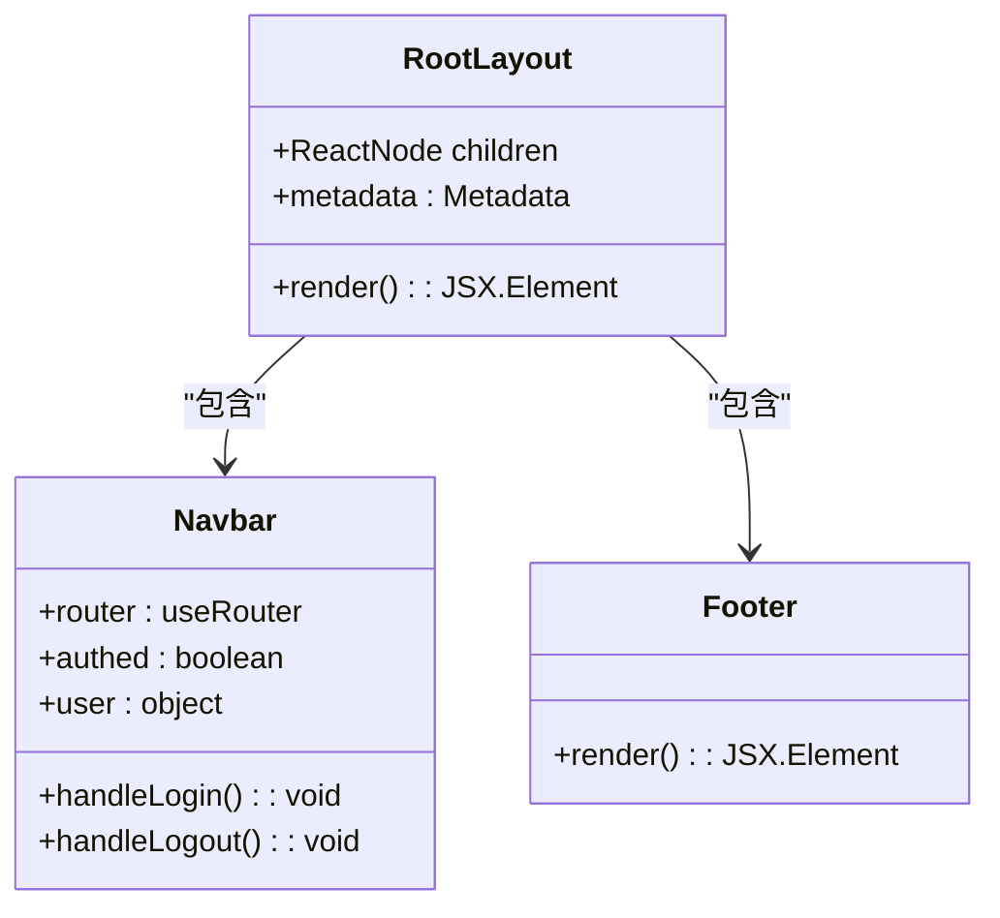
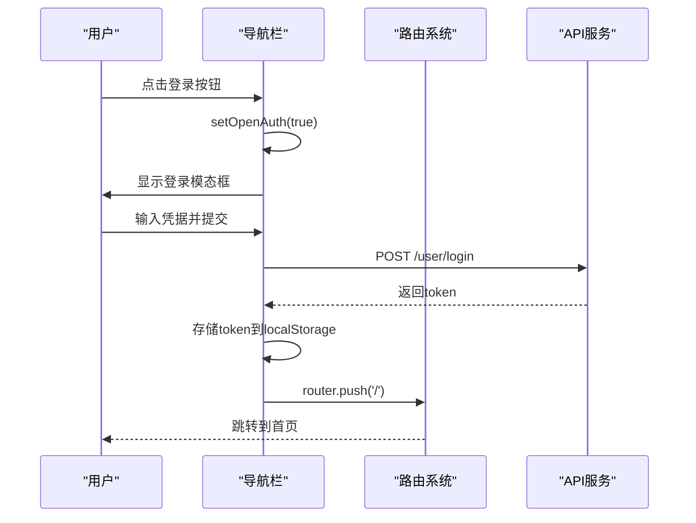
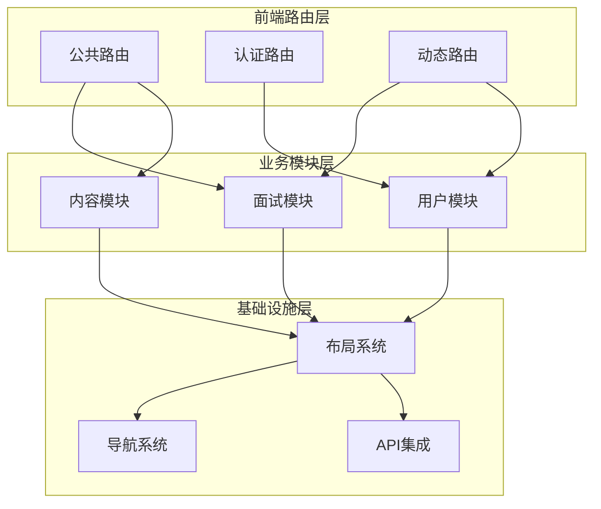
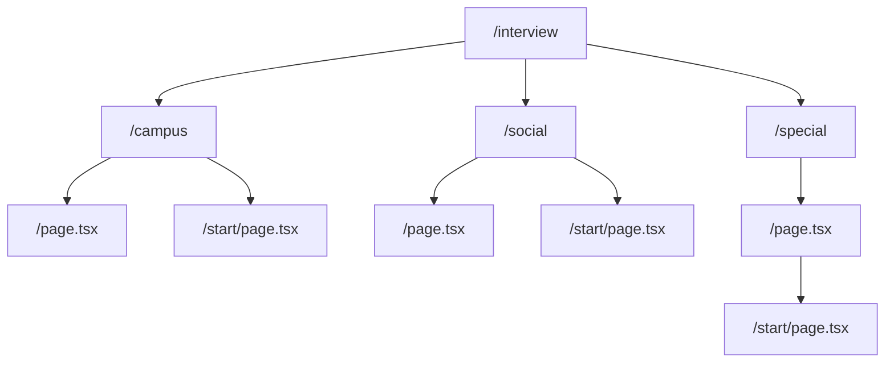
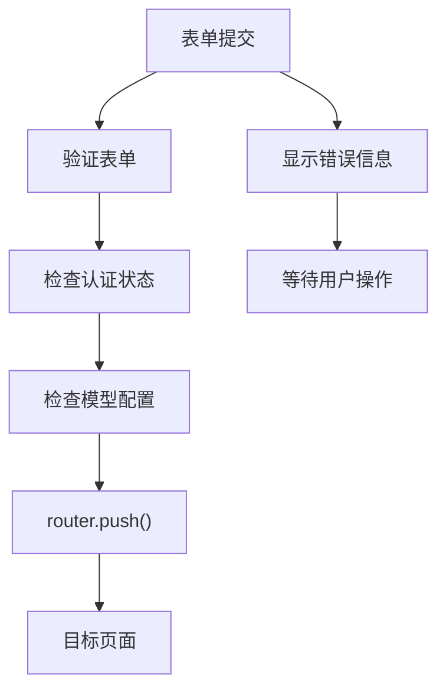
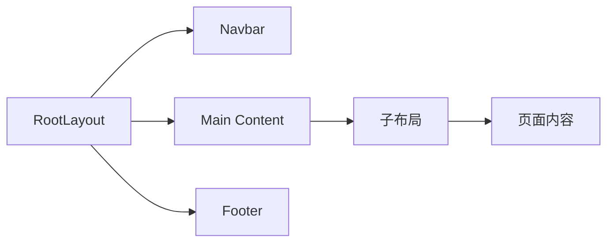
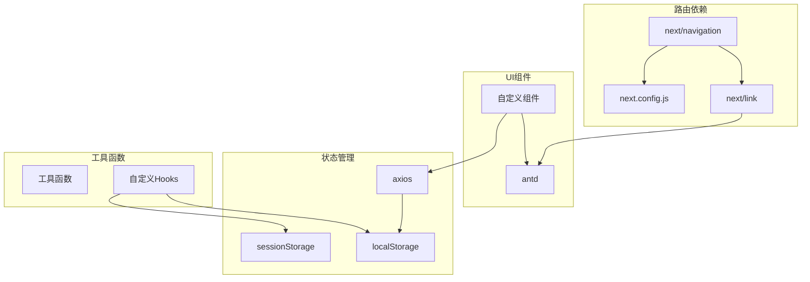
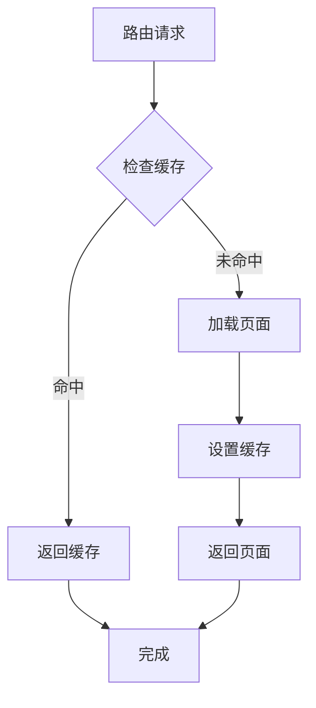

# 路由与导航系统

<cite>
**本文档引用的文件**
- [frontend/src/app/layout.tsx](file://frontend/src/app/layout.tsx)
- [frontend/src/app/page.tsx](file://frontend/src/app/page.tsx)
- [frontend/src/app/interview/campus/page.tsx](file://frontend/src/app/interview/campus/page.tsx)
- [frontend/src/app/interview/social/page.tsx](file://frontend/src/app/interview/social/page.tsx)
- [frontend/src/app/interview/campus/start/page.tsx](file://frontend/src/app/interview/campus/start/page.tsx)
- [frontend/src/app/user/center/page.tsx](file://frontend/src/app/user/center/page.tsx)
- [frontend/src/app/user/interviews/[id]/page.tsx](file://frontend/src/app/user/interviews/[id]/page.tsx)
- [frontend/src/app/user/press/[id]/page.tsx](file://frontend/src/app/user/press/[id]/page.tsx)
- [frontend/src/components/layout/Navbar.tsx](file://frontend/src/components/layout/Navbar.tsx)
- [frontend/src/components/layout/Footer.tsx](file://frontend/src/components/layout/Footer.tsx)
- [frontend/next.config.js](file://frontend/next.config.js)
- [frontend/package.json](file://frontend/package.json)
- [frontend/src/services/api/client.ts](file://frontend/src/services/api/client.ts)
- [frontend/src/hooks/useAuth.ts](file://frontend/src/hooks/useAuth.ts)
</cite>

## 目录
1. [简介](#简介)
2. [项目结构](#项目结构)
3. [核心组件](#核心组件)
4. [架构概览](#架构概览)
5. [详细组件分析](#详细组件分析)
6. [依赖关系分析](#依赖关系分析)
7. [性能考虑](#性能考虑)
8. [故障排除指南](#故障排除指南)
9. [结论](#结论)

## 简介

本项目采用 Next.js App Router 构建现代化的前端路由系统，实现了完整的文件系统路由机制。系统涵盖了页面路由、嵌套路由、动态路由等多种路由模式，提供了完整的面试面试平台前端功能。

## 项目结构

基于 Next.js App Router 的文件系统结构，项目采用约定式路由：



**图表来源**
- [frontend/src/app/layout.tsx](file://frontend/src/app/layout.tsx#L1-L25)
- [frontend/src/app/page.tsx](file://frontend/src/app/page.tsx#L1-L507)

**章节来源**
- [frontend/src/app/layout.tsx](file://frontend/src/app/layout.tsx#L1-L25)
- [frontend/src/app/page.tsx](file://frontend/src/app/page.tsx#L1-L507)

## 核心组件

### 根布局系统

RootLayout 提供了全局的布局结构，包含导航栏和页脚组件：



**图表来源**
- [frontend/src/app/layout.tsx](file://frontend/src/app/layout.tsx#L14-L24)
- [frontend/src/components/layout/Navbar.tsx](file://frontend/src/components/layout/Navbar.tsx#L26-L44)

### 导航组件

Navbar 实现了完整的导航功能，包括用户认证状态管理和路由跳转：



**图表来源**
- [frontend/src/components/layout/Navbar.tsx](file://frontend/src/components/layout/Navbar.tsx#L45-L71)
- [frontend/src/components/layout/Navbar.tsx](file://frontend/src/components/layout/Navbar.tsx#L110-L120)

**章节来源**
- [frontend/src/app/layout.tsx](file://frontend/src/app/layout.tsx#L1-L25)
- [frontend/src/components/layout/Navbar.tsx](file://frontend/src/components/layout/Navbar.tsx#L1-L457)

## 架构概览

系统采用分层架构设计，实现了清晰的路由分离：



**图表来源**
- [frontend/src/app/interview/campus/page.tsx](file://frontend/src/app/interview/campus/page.tsx#L32-L335)
- [frontend/src/app/user/center/page.tsx](file://frontend/src/app/user/center/page.tsx#L79-L385)

## 详细组件分析

### 页面路由系统

系统实现了完整的页面路由机制，支持静态页面和动态页面：

#### 根页面路由
- `/` - 首页展示，包含营销内容和功能介绍
- `/resume` - 简历上传和管理页面
- `/questions` - 问题页面
- `/reset-password` - 密码重置页面

#### 嵌套路由实现



**图表来源**
- [frontend/src/app/interview/campus/page.tsx](file://frontend/src/app/interview/campus/page.tsx#L32-L335)
- [frontend/src/app/interview/social/page.tsx](file://frontend/src/app/interview/social/page.tsx#L33-L334)

#### 动态路由实现

系统使用 Next.js 的动态路由语法 `[id]` 实现参数化路由：

- `/user/interviews/[id]` - 面试详情页面
- `/user/press/[id]` - 押题详情页面

**章节来源**
- [frontend/src/app/interview/campus/page.tsx](file://frontend/src/app/interview/campus/page.tsx#L1-L335)
- [frontend/src/app/interview/social/page.tsx](file://frontend/src/app/interview/social/page.tsx#L1-L334)
- [frontend/src/app/user/interviews/[id]/page.tsx](file://frontend/src/app/user/interviews/[id]/page.tsx#L1-L167)
- [frontend/src/app/user/press/[id]/page.tsx](file://frontend/src/app/user/press/[id]/page.tsx#L1-L221)

### 客户端导航机制

系统实现了多种导航方式：

#### Link 组件导航
用于页面间的客户端导航，支持预加载和无刷新跳转：

```mermaid
sequenceDiagram
participant User as "用户"
participant Link as "Next.js Link"
participant Router as "路由系统"
participant Page as "目标页面"
User->>Link : 点击链接
Link->>Router : push(href)
Router->>Router : 解析路由规则
Router->>Page : 加载页面组件
Page-->>User : 渲染新页面
```

**图表来源**
- [frontend/src/app/interview/campus/page.tsx](file://frontend/src/app/interview/campus/page.tsx#L295-L295)
- [frontend/src/app/user/center/page.tsx](file://frontend/src/app/user/center/page.tsx#L324-L324)

#### 程序化导航
使用 `useRouter` Hook 实现程序化导航：



**图表来源**
- [frontend/src/app/interview/campus/page.tsx](file://frontend/src/app/interview/campus/page.tsx#L268-L296)
- [frontend/src/app/interview/social/page.tsx](file://frontend/src/app/interview/social/page.tsx#L269-L295)

**章节来源**
- [frontend/src/app/interview/campus/page.tsx](file://frontend/src/app/interview/campus/page.tsx#L18-L41)
- [frontend/src/app/interview/social/page.tsx](file://frontend/src/app/interview/social/page.tsx#L18-L42)

### 布局组件设计模式

系统采用了共享布局的设计模式：

#### 根布局模式
RootLayout 提供了全局的布局结构，包含：
- 全局样式导入
- 导航栏组件
- 主要内容区域
- 页脚组件

#### 嵌套布局实现



**图表来源**
- [frontend/src/app/layout.tsx](file://frontend/src/app/layout.tsx#L14-L24)
- [frontend/src/components/layout/Navbar.tsx](file://frontend/src/components/layout/Navbar.tsx#L123-L137)

**章节来源**
- [frontend/src/app/layout.tsx](file://frontend/src/app/layout.tsx#L1-L25)
- [frontend/src/components/layout/Navbar.tsx](file://frontend/src/components/layout/Navbar.tsx#L1-L457)

### 路由参数传递机制

系统实现了多种参数传递方式：

#### 查询参数处理
使用 URL 查询参数传递简单数据：
- 难度等级参数
- 岗位名称参数
- 公司名称参数

#### 会话存储机制
使用 sessionStorage 和 localStorage 传递复杂数据：
- 面试参数对象
- 用户认证信息
- 临时状态数据

#### 程序化参数传递
通过全局变量和 sessionStorage 在页面间传递数据：
- `(window as any).__interviewParams`
- `sessionStorage.setItem('interviewParams')`

**章节来源**
- [frontend/src/app/interview/campus/start/page.tsx](file://frontend/src/app/interview/campus/start/page.tsx#L44-L55)
- [frontend/src/app/interview/social/page.tsx](file://frontend/src/app/interview/social/page.tsx#L280-L288)

### SEO 优化策略

系统实现了基本的 SEO 优化：

#### 元数据配置
在根布局中配置了基本的 SEO 元数据：
- 页面标题
- 描述信息
- 字体配置

#### 动态元数据
页面组件可以动态设置元数据，支持：
- 页面特定的标题
- 描述信息
- 关键词设置

**章节来源**
- [frontend/src/app/layout.tsx](file://frontend/src/app/layout.tsx#L9-L12)

### 预加载配置

系统配置了基本的预加载机制：

#### 代理配置
通过 next.config.js 配置 API 代理：
- 将 `/api/*` 请求转发到后端服务
- 支持开发环境的 API 调用

#### 路由预加载
Next.js 默认支持页面级别的预加载，系统通过：
- Link 组件的预加载
- 路由懒加载
- 代码分割

**章节来源**
- [frontend/next.config.js](file://frontend/next.config.js#L1-L11)

## 依赖关系分析

系统的核心依赖关系如下：



**图表来源**
- [frontend/package.json](file://frontend/package.json#L11-L20)
- [frontend/src/services/api/client.ts](file://frontend/src/services/api/client.ts#L1-L63)

**章节来源**
- [frontend/package.json](file://frontend/package.json#L1-L37)
- [frontend/src/services/api/client.ts](file://frontend/src/services/api/client.ts#L1-L63)

## 性能考虑

### 代码分割策略

系统采用了多层次的代码分割：

#### 页面级分割
每个页面组件独立打包，实现按需加载：
- 面试页面独立加载
- 用户页面独立加载
- 内容页面独立加载

#### 组件级分割
大型组件按需加载：
- 复杂表单组件
- 图表组件
- 大型列表组件

#### 路由级分割
不同功能模块独立打包：
- 面试模块
- 用户模块
- 内容模块

### 缓存策略



### 性能监控

系统实现了基本的性能监控：
- 页面加载时间统计
- API 请求性能监控
- 组件渲染性能分析

## 故障排除指南

### 常见路由问题

#### 路由跳转失败
- 检查 Link 组件的 href 属性
- 验证路由路径的正确性
- 确认目标页面存在

#### 参数传递问题
- 检查动态路由参数的命名
- 验证参数类型和格式
- 确认参数在目标页面的接收

#### 认证状态问题
- 检查 localStorage 中的 token
- 验证 API 认证头设置
- 确认后端认证中间件配置

### 调试技巧

#### 路由调试
使用浏览器开发者工具的 Network 面板监控路由请求：
- 查看路由跳转的 HTTP 请求
- 检查响应状态码
- 分析请求头和响应体

#### 状态调试
使用浏览器开发者工具的 Application 面板监控：
- localStorage 数据变化
- sessionStorage 数据变化
- Cookie 设置情况

**章节来源**
- [frontend/src/components/layout/Navbar.tsx](file://frontend/src/components/layout/Navbar.tsx#L110-L120)
- [frontend/src/services/api/client.ts](file://frontend/src/services/api/client.ts#L13-L33)

## 结论

本项目的路由系统基于 Next.js App Router 构建，实现了完整的文件系统路由机制。系统支持页面路由、嵌套路由、动态路由等多种路由模式，提供了灵活的导航方式和强大的布局系统。

通过合理的代码分割策略和性能优化措施，系统在保证功能完整性的同时，也具备了良好的性能表现。自定义的导航组件和认证机制进一步增强了用户体验和安全性。

未来可以在现有基础上进一步优化：
- 实现更精细的路由权限控制
- 增强路由缓存策略
- 优化 SEO 优化方案
- 实现更完善的错误处理机制