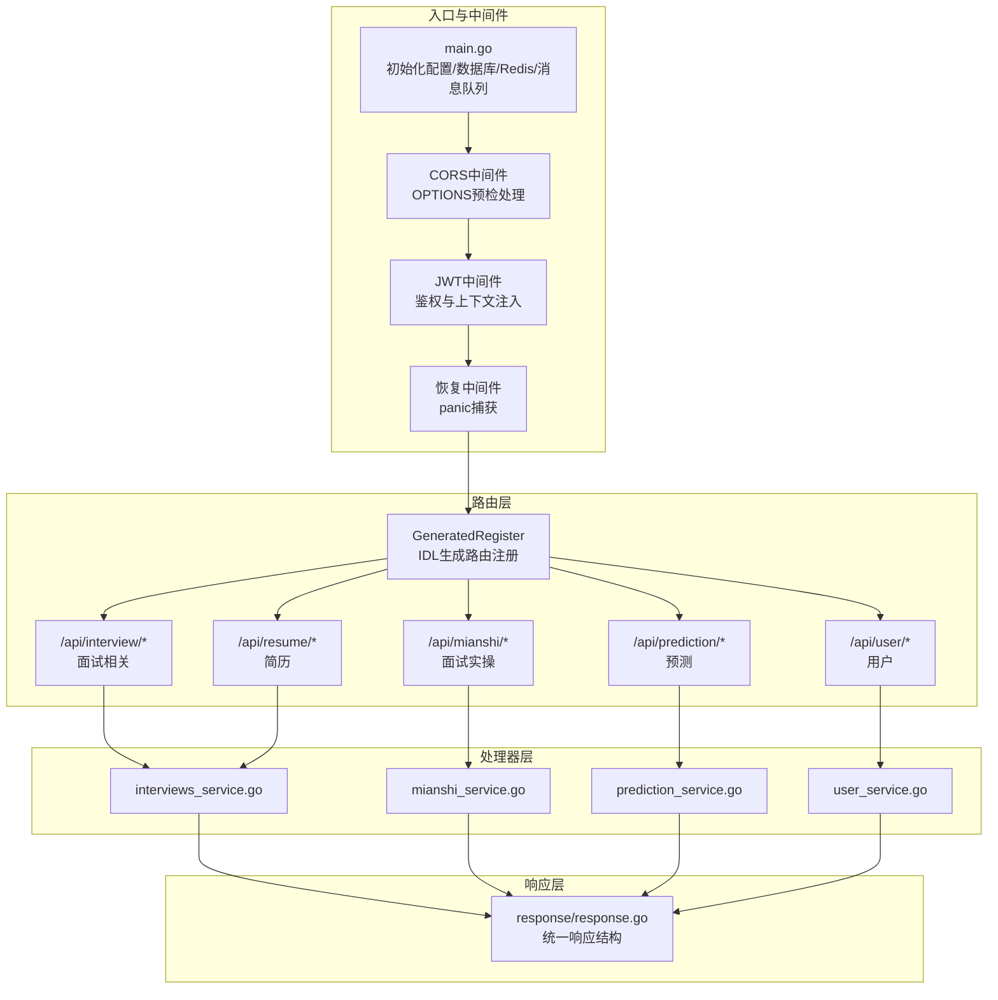
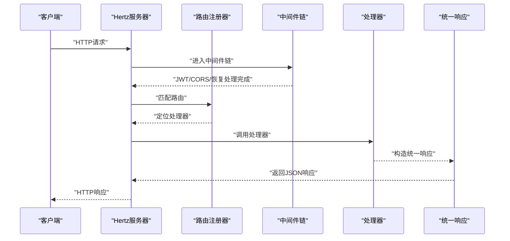
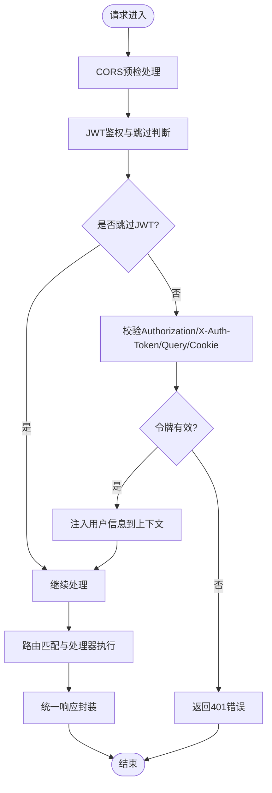
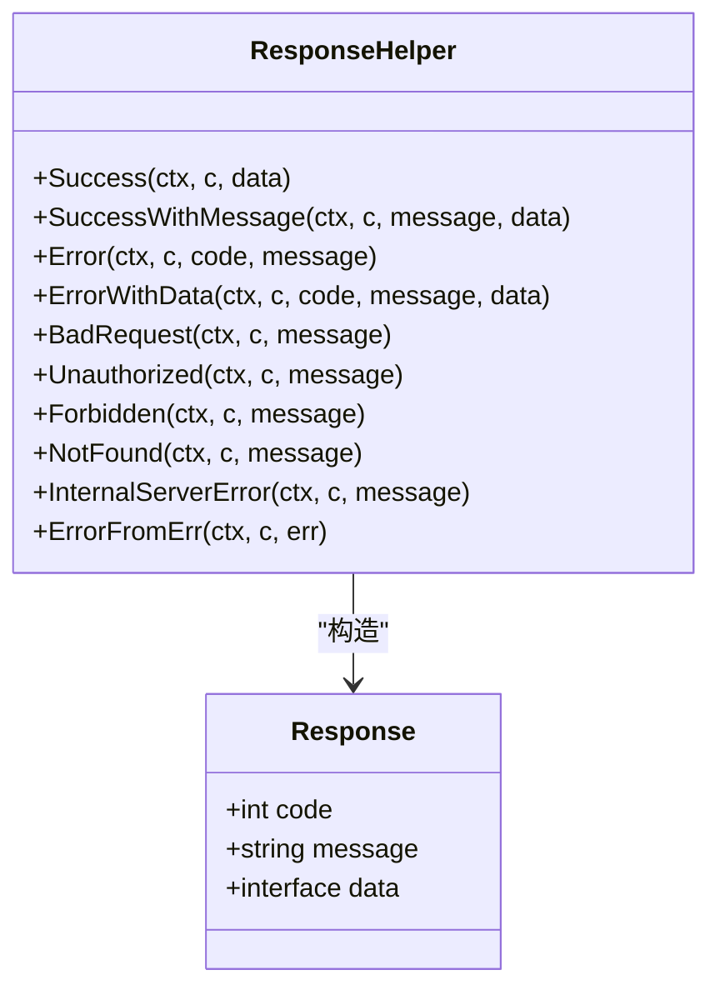
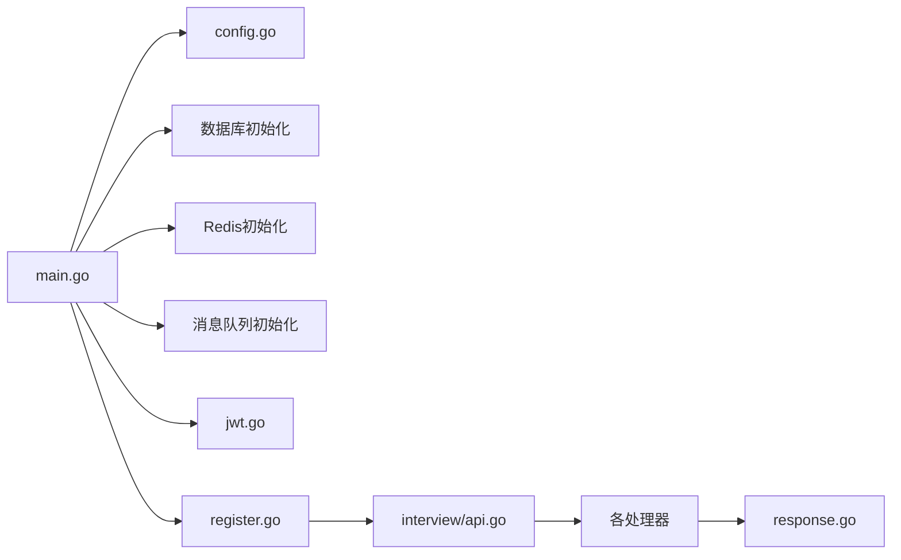

# API接口设计

<cite>
**本文引用的文件**
- [backend/main.go](file://backend/main.go)
- [backend/api/router/register.go](file://backend/api/router/register.go)
- [backend/api/router/interview/api.go](file://backend/api/router/interview/api.go)
- [backend/api/router/interview/middleware.go](file://backend/api/router/interview/middleware.go)
- [backend/internal/middleware/jwt.go](file://backend/internal/middleware/jwt.go)
- [backend/api/response/response.go](file://backend/api/response/response.go)
- [backend/api/router/middleware/recovery.go](file://backend/api/router/middleware/recovery.go)
- [backend/internal/config/config.go](file://backend/internal/config/config.go)
- [backend/api/handler/interview/interviews_service.go](file://backend/api/handler/interview/interviews_service.go)
- [backend/api/handler/interview/user_service.go](file://backend/api/handler/interview/user_service.go)
- [backend/api/handler/interview/mianshi_service.go](file://backend/api/handler/interview/mianshi_service.go)
- [backend/api/handler/interview/prediction_service.go](file://backend/api/handler/interview/prediction_service.go)
- [backend/api/model/interviews/interviews.go](file://backend/api/model/interviews/interviews.go)
- [backend/api/model/user/user.go](file://backend/api/model/user/user.go)
- [frontend/src/components/BackendHealthCheck.tsx](file://frontend/src/components/BackendHealthCheck.tsx)
</cite>

## 目录
1. [简介](#简介)
2. [项目结构](#项目结构)
3. [核心组件](#核心组件)
4. [架构总览](#架构总览)
5. [详细组件分析](#详细组件分析)
6. [依赖关系分析](#依赖关系分析)
7. [性能考虑](#性能考虑)
8. [故障排查指南](#故障排查指南)
9. [结论](#结论)
10. [附录](#附录)

## 简介
本文件面向面试吧API接口设计，围绕CloudWeGo Hertz框架，系统化阐述路由设计原则、RESTful规范、中间件配置、CORS处理、统一错误响应格式、JWT认证、请求验证与响应标准化、API版本管理、参数传递与状态码定义、路由注册机制、静态资源处理与健康检查接口等主题，并提供最佳实践与排障建议。

## 项目结构
后端采用“IDL驱动 + Hertz路由 + 中间件 + 统一响应”的分层架构：
- 入口与中间件：在主程序中初始化配置、数据库、Redis、消息队列，注册全局中间件（恢复、CORS、JWT），并注册由IDL生成的路由。
- 路由层：通过IDL生成的路由注册器集中注册各模块路由，按模块分组组织URL路径。
- 处理器层：每个业务模块对应一组处理器函数，负责绑定与校验请求、调用服务层、输出统一响应。
- 响应层：统一响应结构与状态码映射，确保前后端一致的交互体验。
- 中间件层：JWT认证、恢复中间件、CORS处理等横切能力。

图表来源
- [backend/main.go](file://backend/main.go#L101-L128)
- [backend/api/router/register.go](file://backend/api/router/register.go#L11-L15)
- [backend/api/router/interview/api.go](file://backend/api/router/interview/api.go#L17-L103)
- [backend/api/response/response.go](file://backend/api/response/response.go#L13-L18)

章节来源
- [backend/main.go](file://backend/main.go#L29-L173)
- [backend/api/router/register.go](file://backend/api/router/register.go#L1-L16)
- [backend/api/router/interview/api.go](file://backend/api/router/interview/api.go#L1-L104)

## 核心组件
- Hertz服务器与中间件链
  - 服务器初始化、超时配置、优雅关闭。
  - 全局中间件顺序：恢复中间件 → CORS中间件 → JWT中间件（支持跳过规则）。
- 路由注册机制
  - 通过IDL生成的注册器集中注册，按模块分组，避免重复与遗漏。
- 统一响应与错误处理
  - 统一响应结构体，内置状态码映射；错误处理支持业务错误与通用错误。
- JWT认证与上下文注入
  - 支持多渠道提取token（Authorization、X-Auth-Token、Query、Cookie），解析并注入用户信息。
- CORS跨域处理
  - 显式设置允许源、方法、头部、预检缓存；对OPTIONS请求快速返回204。

章节来源
- [backend/main.go](file://backend/main.go#L101-L128)
- [backend/api/router/interview/middleware.go](file://backend/api/router/interview/middleware.go#L13-L36)
- [backend/internal/middleware/jwt.go](file://backend/internal/middleware/jwt.go#L32-L78)
- [backend/api/response/response.go](file://backend/api/response/response.go#L13-L118)

## 架构总览
以下序列图展示一次典型请求的处理流程：客户端发起请求 → 中间件链处理 → 路由匹配 → 处理器执行 → 统一响应返回。

图表来源
- [backend/main.go](file://backend/main.go#L101-L128)
- [backend/api/router/register.go](file://backend/api/router/register.go#L11-L15)
- [backend/api/response/response.go](file://backend/api/response/response.go#L20-L53)

## 详细组件分析

### 路由设计与RESTful规范
- URL路径组织
  - 以/api为根，按业务域细分：/api/user、/api/resume、/api/interview、/api/mianshi、/api/prediction。
  - 子路径遵循名词复数与层级清晰，如/api/resume/list、/api/mianshi/stream/start。
- HTTP方法使用
  - GET：查询列表/详情（如简历列表、面试记录、预测列表、预测详情）。
  - POST：提交创建/启动（如用户登录/注册、简历上传、开始面试流、预测启动）。
  - PUT/DELETE：更新/删除（如更新简历、删除简历、更新/删除用户模型）。
- 参数传递
  - 查询参数：分页、筛选条件等。
  - 路径参数：资源ID（如预测详情/:id）。
  - 请求体：JSON对象（如登录/注册、简历上传、开始面试流）。
- 状态码定义
  - 200：成功。
  - 400：请求参数错误。
  - 401：未授权/无效令牌。
  - 403：禁止访问。
  - 404：资源不存在。
  - 500：服务器内部错误。
  - 业务错误码映射至对应HTTP状态码，便于前端统一处理。

章节来源
- [backend/api/router/interview/api.go](file://backend/api/router/interview/api.go#L24-L101)
- [backend/api/response/response.go](file://backend/api/response/response.go#L90-L118)

### 中间件配置与CORS处理
- CORS中间件
  - 设置允许源、方法、头部、预检缓存时间；对OPTIONS请求直接返回204。
- JWT中间件
  - 支持跳过规则（如登录、注册、回调等公开接口）；从多个位置提取token并解析，注入用户ID、用户名、角色到上下文。
- 恢复中间件
  - 捕获panic，记录堆栈，返回统一错误响应。

图表来源
- [backend/main.go](file://backend/main.go#L109-L125)
- [backend/api/router/interview/middleware.go](file://backend/api/router/interview/middleware.go#L13-L36)
- [backend/internal/middleware/jwt.go](file://backend/internal/middleware/jwt.go#L32-L78)

章节来源
- [backend/main.go](file://backend/main.go#L109-L125)
- [backend/api/router/interview/middleware.go](file://backend/api/router/interview/middleware.go#L13-L36)
- [backend/internal/middleware/jwt.go](file://backend/internal/middleware/jwt.go#L32-L78)
- [backend/api/router/middleware/recovery.go](file://backend/api/router/middleware/recovery.go#L15-L34)

### 统一响应与错误处理
- 统一响应结构
  - 字段：code、message、data。
  - 成功：code=200；错误：code为业务码，映射HTTP状态码。
- 错误处理
  - ErrorFromErr：根据业务错误类型自动映射HTTP状态码。
  - 内置常用快捷方法：BadRequest、Unauthorized、Forbidden、NotFound、InternalServerError等。

图表来源
- [backend/api/response/response.go](file://backend/api/response/response.go#L13-L118)

章节来源
- [backend/api/response/response.go](file://backend/api/response/response.go#L13-L118)

### JWT认证中间件
- 令牌提取策略
  - Authorization: Bearer {token}
  - X-Auth-Token
  - Query: token
  - Cookie: token
- 令牌解析与上下文注入
  - 解析成功后注入：jwt_claims、user_id、username、role。
- 跳过规则
  - 公开接口白名单（如登录、注册、微信登录/回调、密码找回/重置等）。

章节来源
- [backend/internal/middleware/jwt.go](file://backend/internal/middleware/jwt.go#L32-L78)
- [backend/api/router/interview/middleware.go](file://backend/api/router/interview/middleware.go#L13-L36)

### 路由注册机制
- 生成注册器
  - 由IDL生成的注册器集中注册所有路由，插入点固定，避免手工维护。
- 模块化分组
  - /api/interview、/api/mianshi、/api/prediction、/api/resume、/api/user 下的子路由按功能进一步分组。

章节来源
- [backend/api/router/register.go](file://backend/api/router/register.go#L11-L15)
- [backend/api/router/interview/api.go](file://backend/api/router/interview/api.go#L17-L103)

### 静态资源处理与健康检查
- 静态资源
  - 项目未见显式静态文件路由配置；如需提供静态资源，可在入口处添加静态文件中间件或路由。
- 健康检查
  - 前端提供了健康检查组件，通过OPTIONS请求与CORS头检测后端可达性与接口可用性。
  - 建议后端增加标准健康检查接口（如GET /health），返回服务状态与依赖项健康情况。

章节来源
- [frontend/src/components/BackendHealthCheck.tsx](file://frontend/src/components/BackendHealthCheck.tsx#L20-L78)

### 处理器实现要点
- 请求绑定与校验
  - 使用BindAndValidate进行参数绑定与校验，失败返回400。
- 上下文取值
  - 通过GetUserID等工具从上下文获取用户信息。
- 业务调用与响应
  - 调用服务层，构造统一响应返回。

章节来源
- [backend/api/handler/interview/interviews_service.go](file://backend/api/handler/interview/interviews_service.go#L26-L53)
- [backend/api/handler/interview/user_service.go](file://backend/api/handler/interview/user_service.go#L18-L42)
- [backend/api/handler/interview/mianshi_service.go](file://backend/api/handler/interview/mianshi_service.go#L25-L117)
- [backend/api/handler/interview/prediction_service.go](file://backend/api/handler/interview/prediction_service.go#L17-L42)

## 依赖关系分析
- 入口依赖
  - main.go依赖配置加载、数据库/Redis初始化、消息队列、JWT中间件、路由注册器。
- 路由依赖
  - 生成注册器依赖各模块路由定义。
- 处理器依赖
  - 处理器依赖响应层、中间件工具、服务层与IDL模型。
- 配置依赖
  - 安全配置（JWT密钥、过期时间、CORS）影响JWT与CORS行为。

图表来源
- [backend/main.go](file://backend/main.go#L38-L87)
- [backend/internal/config/config.go](file://backend/internal/config/config.go#L134-L152)
- [backend/api/router/register.go](file://backend/api/router/register.go#L11-L15)
- [backend/api/router/interview/api.go](file://backend/api/router/interview/api.go#L17-L103)
- [backend/api/response/response.go](file://backend/api/response/response.go#L13-L18)

章节来源
- [backend/main.go](file://backend/main.go#L38-L87)
- [backend/internal/config/config.go](file://backend/internal/config/config.go#L134-L152)
- [backend/api/router/register.go](file://backend/api/router/register.go#L11-L15)
- [backend/api/router/interview/api.go](file://backend/api/router/interview/api.go#L17-L103)
- [backend/api/response/response.go](file://backend/api/response/response.go#L13-L18)

## 性能考虑
- 中间件顺序
  - 将CORS置于JWT之前，减少不必要的鉴权开销。
- 路由分组
  - 按模块分组有助于缓存命中与日志追踪。
- 统一响应
  - 减少前后端差异处理成本，提升前端渲染与错误提示效率。
- 日志与监控
  - 建议在中间件与处理器中增加关键指标埋点（QPS、延迟、错误率）。

## 故障排查指南
- CORS问题
  - 检查CORS中间件是否正确设置允许源、方法与头部；前端OPTIONS预检是否返回204。
- JWT鉴权失败
  - 确认Authorization头格式是否为Bearer {token}；检查JWT密钥与过期时间配置。
- 统一错误响应
  - 使用ErrorFromErr自动映射业务错误；若出现500，查看恢复中间件日志堆栈。
- 健康检查
  - 使用前端健康检查组件验证后端可达性与接口可用性；关注404与CORS头缺失问题。

章节来源
- [backend/main.go](file://backend/main.go#L109-L125)
- [backend/api/router/middleware/recovery.go](file://backend/api/router/middleware/recovery.go#L15-L34)
- [frontend/src/components/BackendHealthCheck.tsx](file://frontend/src/components/BackendHealthCheck.tsx#L20-L78)

## 结论
本项目基于Hertz实现了清晰的路由分层与中间件体系，配合统一响应与JWT认证，满足面试吧API的可扩展性与一致性需求。建议后续完善静态资源与健康检查接口，增强可观测性与运维能力。

## 附录
- API版本管理
  - 建议在URL中加入版本号（如/api/v1/...），或通过Accept头协商版本，便于平滑演进。
- 参数与模型
  - 处理器使用IDL生成的请求/响应模型，确保前后端契约一致。
- 最佳实践
  - 严格区分公开与受保护接口；对敏感操作增加权限校验；对大请求体与长耗时接口提供异步能力与进度反馈。

章节来源
- [backend/api/model/interviews/interviews.go](file://backend/api/model/interviews/interviews.go#L11-L800)
- [backend/api/model/user/user.go](file://backend/api/model/user/user.go#L11-L800)