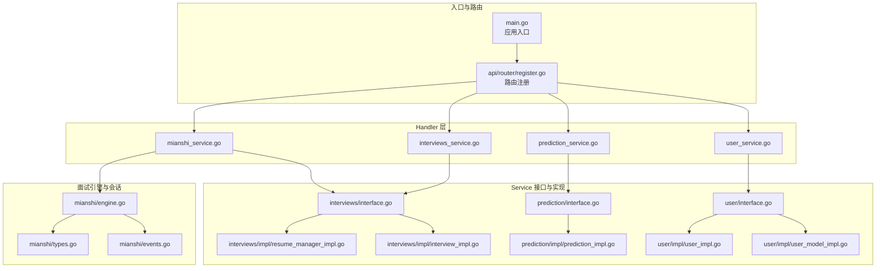
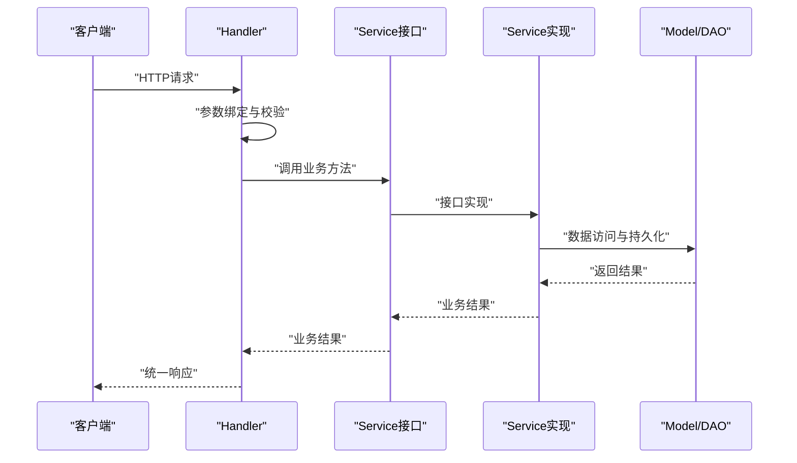
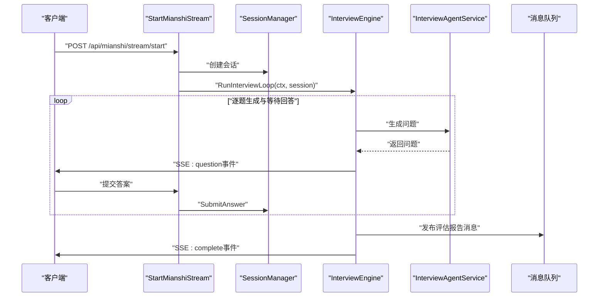
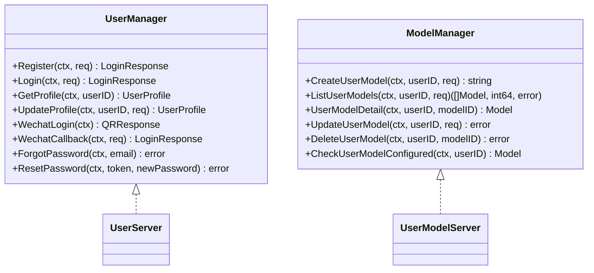
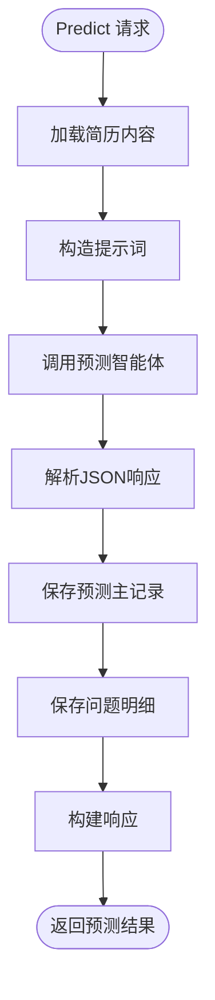
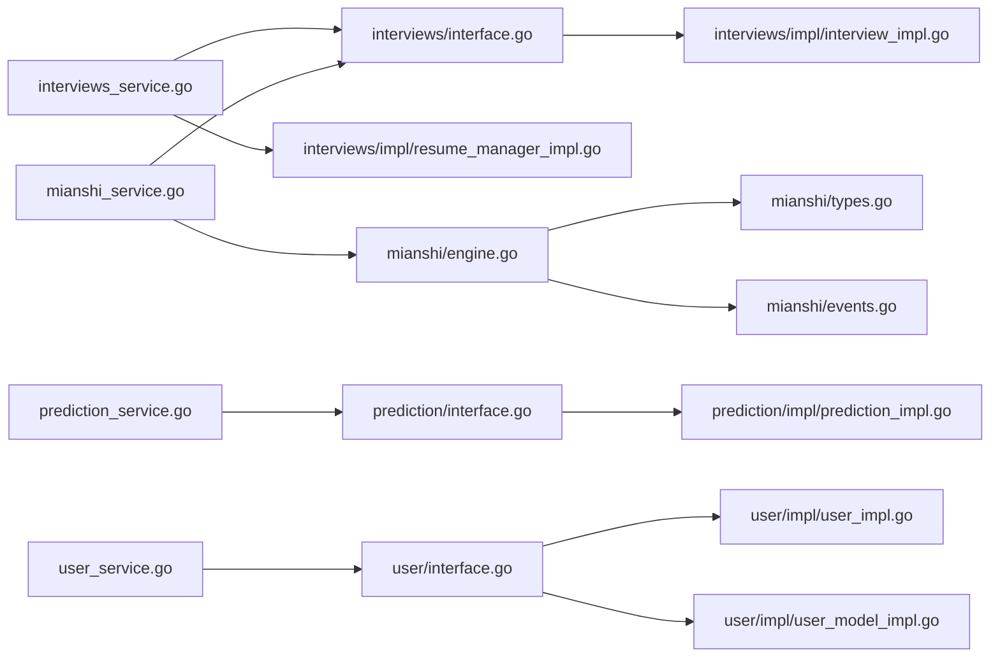

# 业务逻辑实现

<cite>
**本文档引用的文件**
- [backend/main.go](file://backend/main.go)
- [backend/api/router/register.go](file://backend/api/router/register.go)
- [backend/api/handler/interview/interviews_service.go](file://backend/api/handler/interview/interviews_service.go)
- [backend/api/handler/interview/mianshi_service.go](file://backend/api/handler/interview/mianshi_service.go)
- [backend/api/handler/interview/prediction_service.go](file://backend/api/handler/interview/prediction_service.go)
- [backend/api/handler/interview/user_service.go](file://backend/api/handler/interview/user_service.go)
- [backend/internal/service/interviews/interface.go](file://backend/internal/service/interviews/interface.go)
- [backend/internal/service/prediction/interface.go](file://backend/internal/service/prediction/interface.go)
- [backend/internal/service/user/interface.go](file://backend/internal/service/user/interface.go)
- [backend/api/handler/interview/mianshi/engine.go](file://backend/api/handler/interview/mianshi/engine.go)
- [backend/api/handler/interview/mianshi/events.go](file://backend/api/handler/interview/mianshi/events.go)
- [backend/api/handler/interview/mianshi/types.go](file://backend/api/handler/interview/mianshi/types.go)
- [backend/internal/service/interviews/impl/interview_impl.go](file://backend/internal/service/interviews/impl/interview_impl.go)
- [backend/internal/service/interviews/impl/resume_manager_impl.go](file://backend/internal/service/interviews/impl/resume_manager_impl.go)
- [backend/internal/service/prediction/impl/prediction_impl.go](file://backend/internal/service/prediction/impl/prediction_impl.go)
- [backend/internal/service/user/impl/user_impl.go](file://backend/internal/service/user/impl/user_impl.go)
- [backend/internal/service/user/impl/user_model_impl.go](file://backend/internal/service/user/impl/user_model_impl.go)
</cite>

## 目录
1. [简介](#简介)
2. [项目结构](#项目结构)
3. [核心组件](#核心组件)
4. [架构总览](#架构总览)
5. [详细组件分析](#详细组件分析)
6. [依赖分析](#依赖分析)
7. [性能考虑](#性能考虑)
8. [故障排除指南](#故障排除指南)
9. [结论](#结论)
10. [附录](#附录)

## 简介
本项目为“面试吧”业务逻辑实现，采用基于接口抽象的业务层设计模式，围绕面试管理、用户管理与预测服务三大核心模块构建。系统通过 Handler 层接收请求，调用 Service 接口，具体实现位于 impl 包中；Service 层再与内部模型层交互，完成数据持久化与业务规则执行。系统支持简历上传与管理、面试流程（SSE）、智能体预测、用户模型配置与认证等能力，并提供统一的响应封装与错误处理。

## 项目结构
后端采用分层与按功能域组织的结构：
- api/handler：HTTP 请求处理器，负责参数绑定、鉴权、调用服务层与响应封装
- api/router：路由注册与中间件装配
- internal/service：业务服务接口与实现，遵循接口抽象与工厂方法
- internal/model：数据模型与DAO访问层
- chatApp：智能体相关工具与服务，用于面试与预测
- internal/mq：消息队列（Redis）消费者与发布
- internal/repository：数据库与Redis初始化
- internal/middleware：JWT鉴权中间件
- internal/config：配置加载与展开



图表来源
- [backend/main.go](file://backend/main.go#L29-L173)
- [backend/api/router/register.go](file://backend/api/router/register.go#L11-L15)
- [backend/api/handler/interview/interviews_service.go](file://backend/api/handler/interview/interviews_service.go#L26-L53)
- [backend/api/handler/interview/mianshi_service.go](file://backend/api/handler/interview/mianshi_service.go#L25-L117)
- [backend/api/handler/interview/prediction_service.go](file://backend/api/handler/interview/prediction_service.go#L17-L42)
- [backend/api/handler/interview/user_service.go](file://backend/api/handler/interview/user_service.go#L18-L42)
- [backend/internal/service/interviews/interface.go](file://backend/internal/service/interviews/interface.go#L10-L18)
- [backend/internal/service/interviews/impl/interview_impl.go](file://backend/internal/service/interviews/impl/interview_impl.go#L19-L62)
- [backend/internal/service/interviews/impl/resume_manager_impl.go](file://backend/internal/service/interviews/impl/resume_manager_impl.go#L81-L108)
- [backend/internal/service/prediction/interface.go](file://backend/internal/service/prediction/interface.go#L8-L12)
- [backend/internal/service/prediction/impl/prediction_impl.go](file://backend/internal/service/prediction/impl/prediction_impl.go#L25-L124)
- [backend/internal/service/user/interface.go](file://backend/internal/service/user/interface.go#L11-L19)
- [backend/internal/service/user/impl/user_impl.go](file://backend/internal/service/user/impl/user_impl.go#L34-L93)
- [backend/internal/service/user/impl/user_model_impl.go](file://backend/internal/service/user/impl/user_model_impl.go#L20-L89)
- [backend/api/handler/interview/mianshi/engine.go](file://backend/api/handler/interview/mianshi/engine.go#L39-L230)
- [backend/api/handler/interview/mianshi/types.go](file://backend/api/handler/interview/mianshi/types.go#L9-L50)
- [backend/api/handler/interview/mianshi/events.go](file://backend/api/handler/interview/mianshi/events.go#L11-L34)

章节来源
- [backend/main.go](file://backend/main.go#L29-L173)
- [backend/api/router/register.go](file://backend/api/router/register.go#L11-L15)

## 核心组件
- 接口抽象层：通过 NewInterviewService/NewResumeService/NewModelManager/NewUserManager 等工厂方法提供统一的接口实例，便于替换实现与测试。
- 业务服务层：面试服务、简历服务、预测服务、用户服务分别实现各自领域的业务规则与数据访问。
- 面试引擎与会话管理：基于 SSE 的实时面试流程，维护会话状态、超时与心跳保活。
- 智能体集成：通过 chatApp 的智能体服务生成面试问题与预测内容，结合消息队列异步生成评估报告。
- 数据持久化：通过 internal/model 的 DAO 访问数据库，实现面试记录、简历、预测记录、用户模型等数据的增删改查。

章节来源
- [backend/internal/service/interviews/interface.go](file://backend/internal/service/interviews/interface.go#L10-L18)
- [backend/internal/service/prediction/interface.go](file://backend/internal/service/prediction/interface.go#L8-L12)
- [backend/internal/service/user/interface.go](file://backend/internal/service/user/interface.go#L11-L19)

## 架构总览
系统采用“Handler -> Service -> Model”的分层架构，配合 JWT 中间件与统一响应封装，形成清晰的职责边界与可扩展性。



图表来源
- [backend/api/handler/interview/interviews_service.go](file://backend/api/handler/interview/interviews_service.go#L26-L53)
- [backend/internal/service/interviews/interface.go](file://backend/internal/service/interviews/interface.go#L20-L63)
- [backend/internal/service/interviews/impl/interview_impl.go](file://backend/internal/service/interviews/impl/interview_impl.go#L19-L62)

## 详细组件分析

### 面试管理模块
- 面试记录管理：创建、更新、分页查询面试记录；支持简历ID、类型、难度、领域、公司与岗位等维度。
- 面试对话与评估：保存面试对话（含历史上下文），生成评估报告与答题报告；支持SSE流式输出。
- 会话管理：全局会话管理器维护面试会话，支持提交答案、超时与心跳保活，结束时更新记录状态并延迟清理会话。

```mermaid
classDiagram
class InterviewManager {
+CreateInterviewRecord(ctx, dto) uint64
+UpdateInterviewRecord(ctx, dto) error
+ListInterviewRecords(ctx, userID, page, pageSize) ([]DTO, int64, error)
+GetInterviewEvaluation(ctx, userID, reportID) (interface{}, error)
+GetAnswerReport(ctx, userID, reportID) (interface{}, error)
+SaveInterviewDialogueWithParent(ctx, userID, reportID, main, followUps) error
}
class InterviewServiceImpl {
+CreateInterviewRecord(...)
+UpdateInterviewRecord(...)
+ListInterviewRecords(...)
+GetInterviewEvaluation(...)
+GetAnswerReport(...)
+SaveInterviewDialogueWithParent(...)
}
InterviewManager <|.. InterviewServiceImpl
```

图表来源
- [backend/internal/service/interviews/interface.go](file://backend/internal/service/interviews/interface.go#L20-L63)
- [backend/internal/service/interviews/impl/interview_impl.go](file://backend/internal/service/interviews/impl/interview_impl.go#L11-L240)



图表来源
- [backend/api/handler/interview/mianshi_service.go](file://backend/api/handler/interview/mianshi_service.go#L25-L117)
- [backend/api/handler/interview/mianshi/engine.go](file://backend/api/handler/interview/mianshi/engine.go#L39-L230)
- [backend/api/handler/interview/mianshi/types.go](file://backend/api/handler/interview/mianshi/types.go#L9-L50)
- [backend/api/handler/interview/mianshi/events.go](file://backend/api/handler/interview/mianshi/events.go#L11-L34)

章节来源
- [backend/api/handler/interview/mianshi_service.go](file://backend/api/handler/interview/mianshi_service.go#L25-L300)
- [backend/api/handler/interview/mianshi/engine.go](file://backend/api/handler/interview/mianshi/engine.go#L39-L230)
- [backend/api/handler/interview/mianshi/types.go](file://backend/api/handler/interview/mianshi/types.go#L9-L50)
- [backend/api/handler/interview/mianshi/events.go](file://backend/api/handler/interview/mianshi/events.go#L11-L34)
- [backend/internal/service/interviews/impl/interview_impl.go](file://backend/internal/service/interviews/impl/interview_impl.go#L19-L133)

### 用户管理模块
- 用户认证与资料：注册、登录、微信登录回调、修改资料、登出。
- 用户模型管理：创建/更新/删除用户模型，设置默认模型与启用状态，检查默认模型配置。
- 密码处理：支持 bcrypt 与明文兼容，自动升级旧密码。



图表来源
- [backend/internal/service/user/interface.go](file://backend/internal/service/user/interface.go#L54-L63)
- [backend/internal/service/user/interface.go#L21-L52)
- [backend/internal/service/user/impl/user_impl.go](file://backend/internal/service/user/impl/user_impl.go#L34-L93)
- [backend/internal/service/user/impl/user_model_impl.go](file://backend/internal/service/user/impl/user_model_impl.go#L20-L89)

章节来源
- [backend/api/handler/interview/user_service.go](file://backend/api/handler/interview/user_service.go#L18-L420)
- [backend/internal/service/user/impl/user_impl.go](file://backend/internal/service/user/impl/user_impl.go#L34-L365)
- [backend/internal/service/user/impl/user_model_impl.go](file://backend/internal/service/user/impl/user_model_impl.go#L20-L225)

### 预测服务模块
- 预测生成：根据简历与目标岗位、难度、公司等参数，调用智能体生成押题清单，保存主记录与问题明细。
- 列表与详情：分页列出预测记录，按ID获取预测详情（含问题列表）。



图表来源
- [backend/api/handler/interview/prediction_service.go](file://backend/api/handler/interview/prediction_service.go#L17-L42)
- [backend/internal/service/prediction/impl/prediction_impl.go](file://backend/internal/service/prediction/impl/prediction_impl.go#L25-L211)

章节来源
- [backend/api/handler/interview/prediction_service.go](file://backend/api/handler/interview/prediction_service.go#L17-L96)
- [backend/internal/service/prediction/impl/prediction_impl.go](file://backend/internal/service/prediction/impl/prediction_impl.go#L25-L293)

### 简历管理模块
- 简历上传：校验PDF格式与大小，解析并保存简历内容，返回简历ID。
- 默认简历与列表：设置默认简历、分页查询用户简历列表、获取默认简历详情。
- 更新与删除：按ID更新文件名与内容，删除简历并校验归属。

章节来源
- [backend/api/handler/interview/interviews_service.go](file://backend/api/handler/interview/interviews_service.go#L55-L391)
- [backend/internal/service/interviews/impl/resume_manager_impl.go](file://backend/internal/service/interviews/impl/resume_manager_impl.go#L81-L262)

## 依赖分析
- Handler 依赖 Service 接口，通过工厂方法获取具体实现，降低耦合。
- Service 实现依赖 internal/model 的 DAO 完成数据持久化。
- 面试引擎依赖智能体服务与消息队列，实现问题生成、SSE推送与异步评估。
- 配置与中间件贯穿全局，统一处理JWT鉴权、CORS与错误恢复。



图表来源
- [backend/api/handler/interview/interviews_service.go](file://backend/api/handler/interview/interviews_service.go#L26-L53)
- [backend/api/handler/interview/mianshi_service.go](file://backend/api/handler/interview/mianshi_service.go#L25-L117)
- [backend/api/handler/interview/prediction_service.go](file://backend/api/handler/interview/prediction_service.go#L17-L42)
- [backend/api/handler/interview/user_service.go](file://backend/api/handler/interview/user_service.go#L18-L42)
- [backend/internal/service/interviews/interface.go](file://backend/internal/service/interviews/interface.go#L10-L18)
- [backend/internal/service/prediction/interface.go](file://backend/internal/service/prediction/interface.go#L8-L12)
- [backend/internal/service/user/interface.go](file://backend/internal/service/user/interface.go#L11-L19)

章节来源
- [backend/internal/service/interviews/interface.go](file://backend/internal/service/interviews/interface.go#L10-L18)
- [backend/internal/service/prediction/interface.go](file://backend/internal/service/prediction/interface.go#L8-L12)
- [backend/internal/service/user/interface.go](file://backend/internal/service/user/interface.go#L11-L19)

## 性能考虑
- SSE 异步推送：面试流程采用 SSE，逐题生成与回答，避免一次性大量数据传输。
- 会话与超时：会话管理器维护超时与心跳，防止长时间占用资源。
- 消息队列：面试结束后发布评估与主题评估消息，异步生成报告，降低请求延迟。
- 缓存策略：当前代码未显式使用缓存，可在高频查询场景引入Redis缓存（如用户默认模型、简历列表）。
- 并发控制：会话管理器使用读写锁保护会话表，保证并发安全性。
- 数据库优化：DAO 层应配合索引与分页参数限制，避免全表扫描。

[本节为通用指导，无需特定文件引用]

## 故障排除指南
- 参数校验失败：Handler 层在绑定与校验阶段返回 400 错误，需检查请求参数与格式。
- 鉴权失败：JWT 中间件未提供有效 Token 或 Token 过期，返回 401。
- 业务错误：Service 层抛出错误或返回 nil，Handler 层统一包装为错误响应。
- SSE 连接异常：检查事件发送与 flusher，确保客户端持续连接。
- 预测解析失败：智能体返回空内容或非预期JSON，需清理Markdown标记并重试。

章节来源
- [backend/api/handler/interview/interviews_service.go](file://backend/api/handler/interview/interviews_service.go#L55-L92)
- [backend/api/handler/interview/mianshi_service.go](file://backend/api/handler/interview/mianshi_service.go#L119-L168)
- [backend/api/handler/interview/prediction_service.go](file://backend/api/handler/interview/prediction_service.go#L17-L42)
- [backend/api/handler/interview/mianshi/events.go](file://backend/api/handler/interview/mianshi/events.go#L11-L34)
- [backend/internal/service/prediction/impl/prediction_impl.go](file://backend/internal/service/prediction/impl/prediction_impl.go#L108-L127)

## 结论
本项目通过接口抽象与分层设计，实现了面试管理、用户管理与预测服务的清晰职责划分。Handler 层专注请求处理与响应封装，Service 层承载业务规则与数据访问，模型层隔离底层存储。面试引擎与智能体的结合提供了高质量的交互体验，消息队列保障了异步任务的解耦与可扩展性。后续可在缓存、并发与数据库层面进一步优化，以提升整体性能与稳定性。

[本节为总结性内容，无需特定文件引用]

## 附录
- 单元测试：建议针对 Service 接口编写测试桩，覆盖正常与异常分支；对 DAO 层可使用内存数据库或模拟对象。
- 集成测试：通过端到端测试验证 Handler -> Service -> Model 的完整链路，重点覆盖鉴权、SSE、预测与评估流程。
- 部署与配置：通过 config.yaml 与 .env 管理环境变量，注意数据库、Redis、消息队列与智能体配置项。

[本节为通用指导，无需特定文件引用]