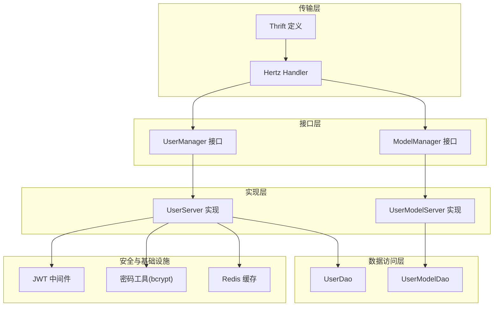
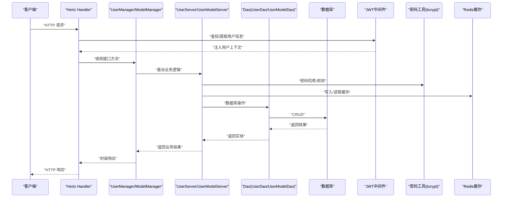
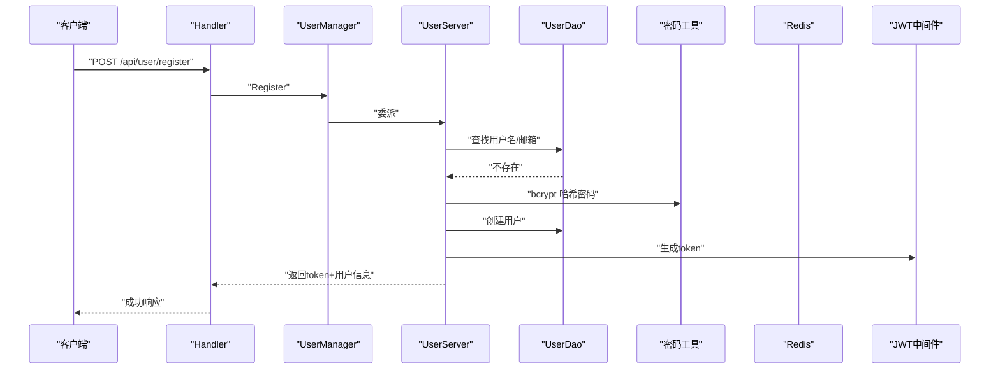
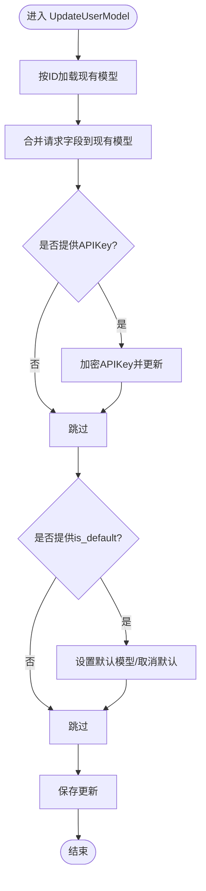
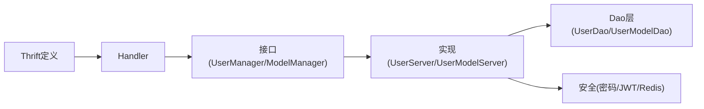

# 用户管理服务

<cite>
**本文引用的文件**
- [backend/internal/model/user.go](file://backend/internal/model/user.go)
- [backend/internal/model/user_model.go](file://backend/internal/model/user_model.go)
- [backend/internal/service/user/interface.go](file://backend/internal/service/user/interface.go)
- [backend/internal/service/user/impl/user_impl.go](file://backend/internal/service/user/impl/user_impl.go)
- [backend/internal/service/user/impl/user_model_impl.go](file://backend/internal/service/user/impl/user_model_impl.go)
- [backend/internal/service/user/impl/user_password.go](file://backend/internal/service/user/impl/user_password.go)
- [backend/api/handler/interview/user_service.go](file://backend/api/handler/interview/user_service.go)
- [backend/internal/middleware/jwt.go](file://backend/internal/middleware/jwt.go)
- [backend/internal/service/common/password.go](file://backend/internal/service/common/password.go)
- [backend/internal/repository/redis.go](file://backend/internal/repository/redis.go)
- [backend/idl/user/user.thrift](file://backend/idl/user/user.thrift)
- [backend/internal/config/config.go](file://backend/internal/config/config.go)
</cite>

## 目录
1. [简介](#简介)
2. [项目结构](#项目结构)
3. [核心组件](#核心组件)
4. [架构总览](#架构总览)
5. [详细组件分析](#详细组件分析)
6. [依赖关系分析](#依赖关系分析)
7. [性能考量](#性能考量)
8. [故障排查指南](#故障排查指南)
9. [结论](#结论)
10. [附录](#附录)

## 简介
本技术文档围绕用户管理服务展开，系统性介绍 UserManager 与 UserModelManager 接口的设计与实现，覆盖用户注册、登录、信息更新、微信登录、密码找回与重置、用户模型管理（创建、查询、更新、删除、默认模型设置）等核心功能。文档深入解释密码处理机制（bcrypt）、JWT 令牌生成与校验、权限控制、用户模型数据结构与约束，并提供安全策略、错误处理与异常场景处理方案，以及性能优化建议。

## 项目结构
用户管理服务采用分层架构：
- 接口层：对外暴露 UserManager 与 ModelManager 接口，统一抽象业务能力
- 实现层：UserServer 与 UserModelServer 具体实现各业务逻辑
- 数据访问层：UserDao 与 UserModelDao 提供数据库操作
- 传输层：基于 Thrift 定义的 API 结构体与 Hertz Handler 映射
- 安全层：JWT 中间件与密码工具、Redis 缓存
- 配置层：集中式配置管理

图表来源
- [backend/internal/service/user/interface.go](file://backend/internal/service/user/interface.go#L54-L63)
- [backend/internal/service/user/impl/user_impl.go](file://backend/internal/service/user/impl/user_impl.go#L22-L32)
- [backend/internal/service/user/impl/user_model_impl.go](file://backend/internal/service/user/impl/user_model_impl.go#L13-L18)
- [backend/internal/model/user.go](file://backend/internal/model/user.go#L9-L28)
- [backend/internal/model/user_model.go](file://backend/internal/model/user_model.go#L28-L52)
- [backend/api/handler/interview/user_service.go](file://backend/api/handler/interview/user_service.go#L18-L42)
- [backend/idl/user/user.thrift](file://backend/idl/user/user.thrift#L217-L315)
- [backend/internal/middleware/jwt.go](file://backend/internal/middleware/jwt.go#L32-L78)
- [backend/internal/service/common/password.go](file://backend/internal/service/common/password.go#L7-L17)
- [backend/internal/repository/redis.go](file://backend/internal/repository/redis.go#L40-L53)

章节来源
- [backend/internal/service/user/interface.go](file://backend/internal/service/user/interface.go#L11-L19)
- [backend/api/handler/interview/user_service.go](file://backend/api/handler/interview/user_service.go#L18-L42)
- [backend/idl/user/user.thrift](file://backend/idl/user/user.thrift#L217-L315)

## 核心组件
- UserManager 接口：定义用户注册、登录、资料查询与更新、微信登录、密码找回与重置等能力
- ModelManager 接口：定义用户模型的创建、查询、更新、删除、默认模型设置与检查
- UserServer 实现：具体执行用户相关业务逻辑，包括密码处理、JWT 生成、微信登录流程、Redis 缓存
- UserModelServer 实现：具体执行用户模型相关业务逻辑，含默认模型一致性事务处理
- Dao 层：UserDao 与 UserModelDao 提供数据库 CRUD 操作
- Handler 层：Hertz Handler 将 HTTP 请求映射到 UserManager/ModelManager
- 安全组件：JWT 中间件、密码工具、Redis 缓存

章节来源
- [backend/internal/service/user/interface.go](file://backend/internal/service/user/interface.go#L54-L63)
- [backend/internal/service/user/impl/user_impl.go](file://backend/internal/service/user/impl/user_impl.go#L22-L32)
- [backend/internal/service/user/impl/user_model_impl.go](file://backend/internal/service/user/impl/user_model_impl.go#L13-L18)
- [backend/internal/model/user.go](file://backend/internal/model/user.go#L9-L28)
- [backend/internal/model/user_model.go](file://backend/internal/model/user_model.go#L28-L52)
- [backend/api/handler/interview/user_service.go](file://backend/api/handler/interview/user_service.go#L18-L42)
- [backend/internal/middleware/jwt.go](file://backend/internal/middleware/jwt.go#L80-L113)
- [backend/internal/service/common/password.go](file://backend/internal/service/common/password.go#L7-L17)
- [backend/internal/repository/redis.go](file://backend/internal/repository/redis.go#L40-L53)

## 架构总览
用户管理服务通过 Hertz Handler 接收请求，经由 UserManager/ModelManager 接口委派至具体实现，实现层调用 Dao 层完成数据库操作，同时结合 JWT 中间件进行鉴权、密码工具进行哈希、Redis 缓存进行临时状态存储（如密码重置 Token）。

图表来源
- [backend/api/handler/interview/user_service.go](file://backend/api/handler/interview/user_service.go#L212-L262)
- [backend/internal/service/user/interface.go](file://backend/internal/service/user/interface.go#L54-L63)
- [backend/internal/service/user/impl/user_impl.go](file://backend/internal/service/user/impl/user_impl.go#L34-L93)
- [backend/internal/service/user/impl/user_model_impl.go](file://backend/internal/service/user/impl/user_model_impl.go#L20-L89)
- [backend/internal/middleware/jwt.go](file://backend/internal/middleware/jwt.go#L32-L78)
- [backend/internal/service/common/password.go](file://backend/internal/service/common/password.go#L7-L17)
- [backend/internal/repository/redis.go](file://backend/internal/repository/redis.go#L40-L53)

## 详细组件分析

### UserManager 接口与实现
- 用户注册 Register：去重校验用户名/邮箱，bcrypt 哈希密码，创建用户记录，生成 JWT 返回
- 用户登录 Login：按邮箱查找用户，bcrypt 校验；兼容旧版明文密码并自动升级为 bcrypt
- 获取/更新资料 GetProfile/UpdateProfile：按 ID 查询用户，支持更新用户名与邮箱
- 微信登录 WechatLogin/WechatCallback：生成二维码登录 URL，回调获取微信 AccessToken 与用户信息，完成登录或注册
- 忘记/重置密码 ForgotPassword/ResetPassword：生成 UUID Token 写入 Redis，发送邮件，15 分钟过期；重置时校验 Token、更新密码并清理缓存

图表来源
- [backend/api/handler/interview/user_service.go](file://backend/api/handler/interview/user_service.go#L212-L236)
- [backend/internal/service/user/impl/user_impl.go](file://backend/internal/service/user/impl/user_impl.go#L34-L65)
- [backend/internal/model/user.go](file://backend/internal/model/user.go#L35-L56)
- [backend/internal/service/common/password.go](file://backend/internal/service/common/password.go#L7-L17)
- [backend/internal/middleware/jwt.go](file://backend/internal/middleware/jwt.go#L80-L113)

章节来源
- [backend/internal/service/user/interface.go](file://backend/internal/service/user/interface.go#L54-L63)
- [backend/internal/service/user/impl/user_impl.go](file://backend/internal/service/user/impl/user_impl.go#L34-L117)
- [backend/api/handler/interview/user_service.go](file://backend/api/handler/interview/user_service.go#L212-L262)

### UserModelManager 接口与实现
- 创建用户模型 CreateUserModel：对 API Key 进行加密存储，处理可选字段与默认值，必要时取消其他默认模型
- 列表/详情 UserModelDetail：分页查询用户模型，按 ID 获取详情
- 更新用户模型 UpdateUserModel：支持选择性更新字段，必要时更新默认模型状态与启用状态
- 删除用户模型 DeleteUserModel：软删除
- 检查默认模型 CheckUserModelConfigured：返回是否已配置并启用默认模型

图表来源
- [backend/internal/service/user/impl/user_model_impl.go](file://backend/internal/service/user/impl/user_model_impl.go#L117-L199)

章节来源
- [backend/internal/service/user/interface.go](file://backend/internal/service/user/interface.go#L21-L52)
- [backend/internal/service/user/impl/user_model_impl.go](file://backend/internal/service/user/impl/user_model_impl.go#L20-L225)

### 用户模型数据结构与约束
- 用户表 user：主键、用户名/邮箱唯一索引、角色、微信 OpenID/UnionID、昵称与头像、时间戳
- 用户模型表 user_model：用户维度唯一名称、协议/提供商、BaseURL、加密 API Key、默认参数、作用域、状态、默认标记、软删除、时间戳

章节来源
- [backend/internal/model/user.go](file://backend/internal/model/user.go#L11-L33)
- [backend/internal/model/user_model.go](file://backend/internal/model/user_model.go#L30-L52)

### 密码处理机制
- 注册/重置密码：bcrypt 哈希，成本因子 14
- 登录校验：优先 bcrypt 校验，兼容旧版明文并自动升级为 bcrypt
- 密钥存储：用户模型中的 API Key 采用加密存储，避免明文泄露

章节来源
- [backend/internal/service/common/password.go](file://backend/internal/service/common/password.go#L7-L17)
- [backend/internal/service/user/impl/user_impl.go](file://backend/internal/service/user/impl/user_impl.go#L43-L85)
- [backend/internal/service/user/impl/user_model_impl.go](file://backend/internal/service/user/impl/user_model_impl.go#L24-L27)

### JWT 令牌管理与权限控制
- 生成：基于 HS256 签名，包含用户 ID、用户名、角色与标准声明，过期时间来自配置
- 校验：中间件解析并校验签名、过期时间，注入用户上下文
- 使用：Handler 在需要鉴权的接口中通过中间件提取用户 ID，实现权限控制

章节来源
- [backend/internal/middleware/jwt.go](file://backend/internal/middleware/jwt.go#L80-L134)
- [backend/api/handler/interview/user_service.go](file://backend/api/handler/interview/user_service.go#L27-L31)

### 用户生命周期管理与会话管理
- 生命周期：注册 → 登录/微信登录 → 资料维护 → 模型配置 → 使用问答
- 会话：基于 JWT 无状态会话；Handler 通过中间件注入用户上下文；退出接口返回通用状态
- 密码找回：Redis 缓存临时 Token，15 分钟过期，邮件发送重置链接

章节来源
- [backend/api/handler/interview/user_service.go](file://backend/api/handler/interview/user_service.go#L324-L335)
- [backend/internal/service/user/impl/user_password.go](file://backend/internal/service/user/impl/user_password.go#L21-L58)
- [backend/internal/repository/redis.go](file://backend/internal/repository/redis.go#L40-L53)

### 安全策略
- 密码安全：bcrypt 哈希，自动升级旧数据
- 敏感信息：API Key 加密存储，返回给前端仅展示脱敏提示
- 令牌安全：HS256 签名，配置化密钥与过期时间
- 会话安全：中间件严格校验 Authorization 头格式与有效性
- 缓存安全：Token 仅缓存短时有效期，使用前缀区分命名空间

章节来源
- [backend/internal/service/common/password.go](file://backend/internal/service/common/password.go#L7-L17)
- [backend/internal/service/user/impl/user_model_impl.go](file://backend/internal/service/user/impl/user_model_impl.go#L24-L27)
- [backend/internal/middleware/jwt.go](file://backend/internal/middleware/jwt.go#L80-L113)
- [backend/internal/service/user/impl/user_password.go](file://backend/internal/service/user/impl/user_password.go#L32-L39)

## 依赖关系分析
- Handler 依赖接口层（UserManager/ModelManager）
- 接口层依赖实现层（UserServer/UserModelServer）
- 实现层依赖 Dao 层（UserDao/UserModelDao）
- 实现层依赖安全组件（JWT、密码工具、Redis）
- Thrift 定义驱动 Handler 与接口层之间的契约

图表来源
- [backend/api/handler/interview/user_service.go](file://backend/api/handler/interview/user_service.go#L18-L42)
- [backend/internal/service/user/interface.go](file://backend/internal/service/user/interface.go#L54-L63)
- [backend/internal/service/user/impl/user_impl.go](file://backend/internal/service/user/impl/user_impl.go#L22-L32)
- [backend/internal/service/user/impl/user_model_impl.go](file://backend/internal/service/user/impl/user_model_impl.go#L13-L18)
- [backend/idl/user/user.thrift](file://backend/idl/user/user.thrift#L217-L315)

章节来源
- [backend/internal/service/user/interface.go](file://backend/internal/service/user/interface.go#L11-L19)
- [backend/api/handler/interview/user_service.go](file://backend/api/handler/interview/user_service.go#L18-L42)

## 性能考量
- 数据库连接池：合理配置最大连接数与空闲连接数，降低连接开销
- 分页查询：列表接口限制每页最大条数，避免大页扫描
- 缓存命中：Redis 缓存短期 Token，减少数据库压力
- 密码哈希成本：成本因子 14 已平衡安全性与性能，可根据硬件调整
- 事务一致性：默认模型切换使用事务，保证状态一致

章节来源
- [backend/internal/config/config.go](file://backend/internal/config/config.go#L64-L83)
- [backend/internal/service/user/impl/user_model_impl.go](file://backend/internal/service/user/impl/user_model_impl.go#L146-L173)

## 故障排查指南
- 登录失败
  - 用户不存在或密码错误：检查邮箱/密码输入与 bcrypt 校验
  - 明文兼容升级：若旧数据匹配，将自动升级为 bcrypt
- 注册失败
  - 用户名或邮箱重复：确保唯一性
- 微信登录
  - 授权码缺失：检查回调参数
  - 微信接口异常：检查 AppID/AppSecret/回调地址
- 密码找回
  - Token 无效或过期：确认邮件链接与过期时间
  - Redis 写入失败：检查 Redis 连接与权限
- 用户模型
  - 默认模型设置失败：检查事务回滚与并发更新
  - API Key 未更新：确认请求是否携带新密钥并正确加密

章节来源
- [backend/internal/service/user/impl/user_impl.go](file://backend/internal/service/user/impl/user_impl.go#L67-L93)
- [backend/internal/service/user/impl/user_impl.go](file://backend/internal/service/user/impl/user_impl.go#L131-L157)
- [backend/internal/service/user/impl/user_password.go](file://backend/internal/service/user/impl/user_password.go#L21-L58)
- [backend/internal/repository/redis.go](file://backend/internal/repository/redis.go#L40-L53)
- [backend/internal/service/user/impl/user_model_impl.go](file://backend/internal/service/user/impl/user_model_impl.go#L146-L173)

## 结论
用户管理服务以清晰的分层架构实现了用户与用户模型的全生命周期管理，结合 bcrypt 密码处理、JWT 令牌与 Redis 缓存，提供了安全、可扩展的用户能力。接口层与实现层解耦良好，便于后续扩展与维护。

## 附录
- API 定义参考：Thrift 文件中 UserService 服务定义了用户与模型相关接口及路由映射
- 配置参考：安全配置包含 JWT 密钥与过期时间，数据库与 Redis 配置位于配置文件

章节来源
- [backend/idl/user/user.thrift](file://backend/idl/user/user.thrift#L217-L315)
- [backend/internal/config/config.go](file://backend/internal/config/config.go#L113-L118)