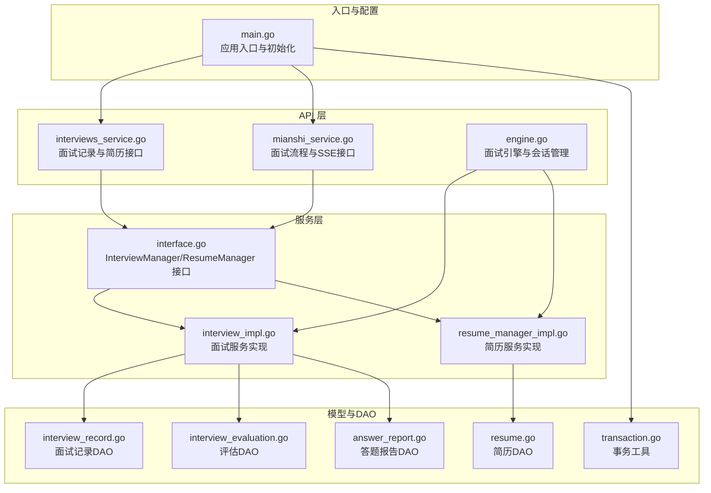
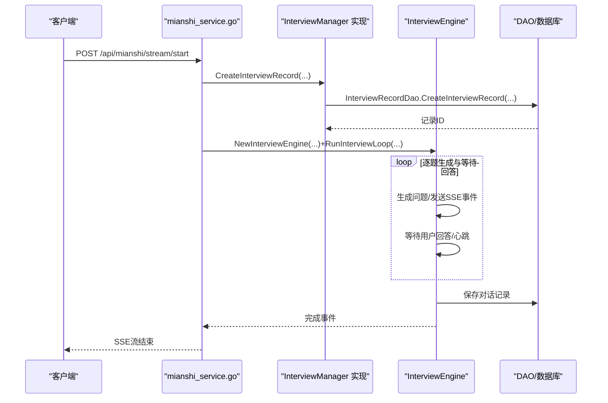
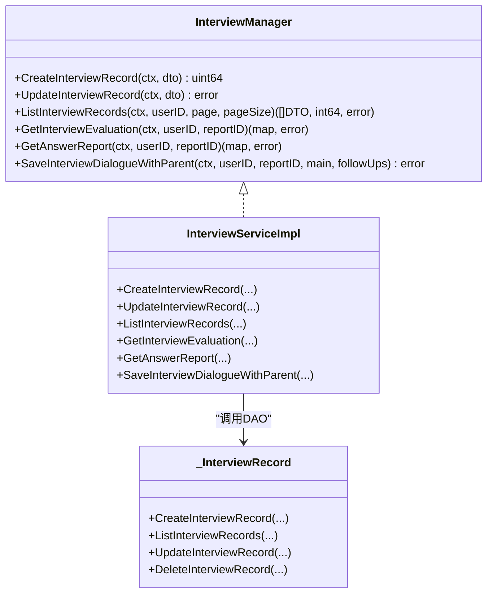
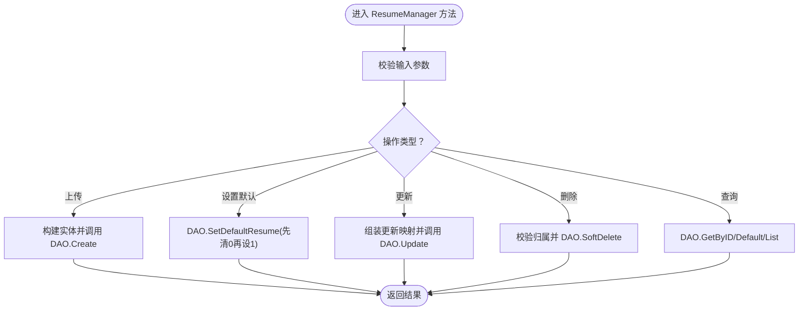
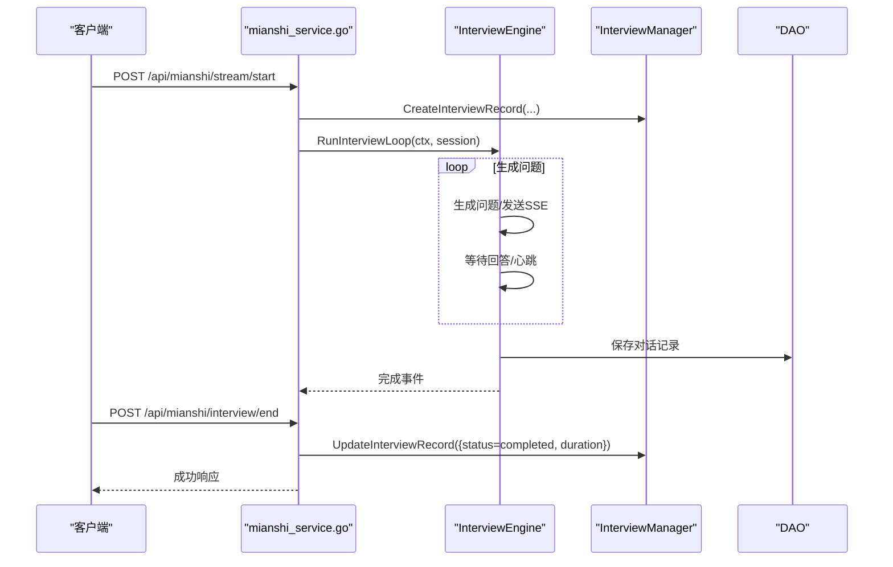
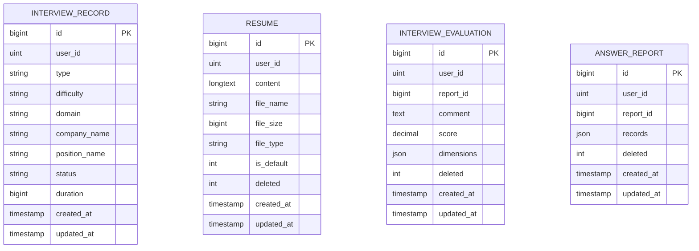
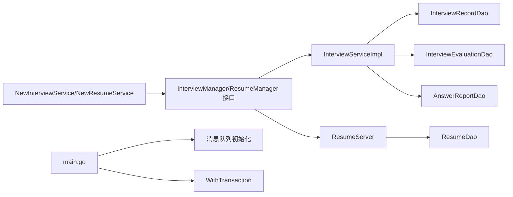
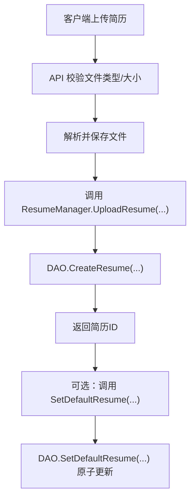
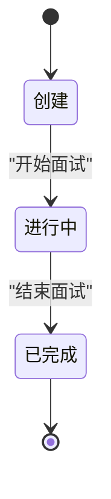

# 面试管理服务

<cite>
**本文引用的文件**
- [backend/main.go](file://backend/main.go)
- [backend/internal/service/interviews/interface.go](file://backend/internal/service/interviews/interface.go)
- [backend/internal/service/interviews/impl/interview_impl.go](file://backend/internal/service/interviews/impl/interview_impl.go)
- [backend/internal/service/interviews/impl/resume_manager_impl.go](file://backend/internal/service/interviews/impl/resume_manager_impl.go)
- [backend/api/handler/interview/interviews_service.go](file://backend/api/handler/interview/interviews_service.go)
- [backend/api/handler/interview/mianshi_service.go](file://backend/api/handler/interview/mianshi_service.go)
- [backend/api/handler/interview/mianshi/engine.go](file://backend/api/handler/interview/mianshi/engine.go)
- [backend/internal/model/interview_record.go](file://backend/internal/model/interview_record.go)
- [backend/internal/model/resume.go](file://backend/internal/model/resume.go)
- [backend/internal/model/interview_evaluation.go](file://backend/internal/model/interview_evaluation.go)
- [backend/internal/model/answer_report.go](file://backend/internal/model/answer_report.go)
- [backend/internal/model/transaction.go](file://backend/internal/model/transaction.go)
</cite>

## 目录
1. [简介](#简介)
2. [项目结构](#项目结构)
3. [核心组件](#核心组件)
4. [架构总览](#架构总览)
5. [详细组件分析](#详细组件分析)
6. [依赖分析](#依赖分析)
7. [性能考虑](#性能考虑)
8. [故障排查指南](#故障排查指南)
9. [结论](#结论)
10. [附录](#附录)

## 简介
本文件面向面试管理服务，系统性梳理 InterviewManager 与 ResumeManager 接口的设计理念与实现细节，覆盖面试记录的创建、更新、查询，以及简历上传、设置默认、更新、删除、查询等完整能力。文档同时阐述服务层的依赖注入机制、事务处理策略、数据验证规则，并给出业务流程图、状态转换与时序图、异常处理策略、性能优化建议、缓存策略与并发控制方案，以及单元测试与集成测试场景。

## 项目结构
后端采用分层架构：API 层负责路由与请求绑定、鉴权与响应封装；服务层提供业务接口与实现；DAO 层封装数据库访问；模型层定义实体与表结构；入口程序负责初始化配置、数据库、消息队列与 Hertz 服务。

图表来源
- [backend/main.go](file://backend/main.go#L29-L173)
- [backend/api/handler/interview/interviews_service.go](file://backend/api/handler/interview/interviews_service.go#L26-L391)
- [backend/api/handler/interview/mianshi_service.go](file://backend/api/handler/interview/mianshi_service.go#L25-L409)
- [backend/api/handler/interview/mianshi/engine.go](file://backend/api/handler/interview/mianshi/engine.go#L23-L291)
- [backend/internal/service/interviews/interface.go](file://backend/internal/service/interviews/interface.go#L20-L118)
- [backend/internal/service/interviews/impl/interview_impl.go](file://backend/internal/service/interviews/impl/interview_impl.go#L11-L240)
- [backend/internal/service/interviews/impl/resume_manager_impl.go](file://backend/internal/service/interviews/impl/resume_manager_impl.go#L10-L262)
- [backend/internal/model/interview_record.go](file://backend/internal/model/interview_record.go#L7-L128)
- [backend/internal/model/resume.go](file://backend/internal/model/resume.go#L7-L170)
- [backend/internal/model/interview_evaluation.go](file://backend/internal/model/interview_evaluation.go#L7-L100)
- [backend/internal/model/answer_report.go](file://backend/internal/model/answer_report.go#L7-L121)
- [backend/internal/model/transaction.go](file://backend/internal/model/transaction.go#L11-L58)

章节来源
- [backend/main.go](file://backend/main.go#L29-L173)

## 核心组件
- InterviewManager 接口：定义面试记录的创建、更新、查询、评估报告与答题报告获取、以及带父子关系的对话保存。
- ResumeManager 接口：定义简历上传、设置默认、更新、删除、按ID与默认简历查询、分页查询用户简历列表。
- 服务实现：InterviewServiceImpl 与 ResumeServer 分别实现上述接口，负责参数处理、DTO 转换、DAO 调用与日志记录。
- DAO 层：InterviewRecordDao、ResumeDao、InterviewEvaluationDao、AnswerReportDao 提供 CRUD 与分页统计能力。
- 事务工具：WithTransaction 提供统一的事务封装，自动处理提交/回滚与 panic 恢复。

章节来源
- [backend/internal/service/interviews/interface.go](file://backend/internal/service/interviews/interface.go#L20-L118)
- [backend/internal/service/interviews/impl/interview_impl.go](file://backend/internal/service/interviews/impl/interview_impl.go#L11-L240)
- [backend/internal/service/interviews/impl/resume_manager_impl.go](file://backend/internal/service/interviews/impl/resume_manager_impl.go#L10-L262)
- [backend/internal/model/interview_record.go](file://backend/internal/model/interview_record.go#L7-L128)
- [backend/internal/model/resume.go](file://backend/internal/model/resume.go#L7-L170)
- [backend/internal/model/interview_evaluation.go](file://backend/internal/model/interview_evaluation.go#L7-L100)
- [backend/internal/model/answer_report.go](file://backend/internal/model/answer_report.go#L7-L121)
- [backend/internal/model/transaction.go](file://backend/internal/model/transaction.go#L11-L58)

## 架构总览
整体采用“API -> 服务 -> DAO -> 数据库”的分层，配合 Hertz Web 框架与 JWT 中间件，提供 REST/SSE 接口。面试流程通过会话管理器与面试引擎驱动，结合消息队列异步发布评估任务。

图表来源
- [backend/api/handler/interview/mianshi_service.go](file://backend/api/handler/interview/mianshi_service.go#L25-L117)
- [backend/api/handler/interview/mianshi/engine.go](file://backend/api/handler/interview/mianshi/engine.go#L39-L230)
- [backend/internal/service/interviews/impl/interview_impl.go](file://backend/internal/service/interviews/impl/interview_impl.go#L19-L62)
- [backend/internal/model/interview_record.go](file://backend/internal/model/interview_record.go#L33-L42)

## 详细组件分析

### InterviewManager 设计与实现
- 创建面试记录：处理 DTO 中的可空字段，填充默认状态 pending，调用 DAO 创建并返回记录ID。
- 更新面试记录：提取 DTO 非空字段，构造实体后调用 DAO 更新。
- 列表查询：设置默认分页参数，调用 DAO 分页查询并转换为 DTO 列表。
- 评估与答题报告：通过 DAO 查询评估与答题报告，返回结构化数据。
- 保存对话（父子关系）：先保存主问题（ParentID=0），再批量保存追问（ParentID=主问题ID）。

图表来源
- [backend/internal/service/interviews/interface.go](file://backend/internal/service/interviews/interface.go#L20-L63)
- [backend/internal/service/interviews/impl/interview_impl.go](file://backend/internal/service/interviews/impl/interview_impl.go#L11-L240)
- [backend/internal/model/interview_record.go](file://backend/internal/model/interview_record.go#L7-L128)

章节来源
- [backend/internal/service/interviews/interface.go](file://backend/internal/service/interviews/interface.go#L20-L63)
- [backend/internal/service/interviews/impl/interview_impl.go](file://backend/internal/service/interviews/impl/interview_impl.go#L19-L240)
- [backend/internal/model/interview_record.go](file://backend/internal/model/interview_record.go#L33-L128)
- [backend/internal/model/interview_evaluation.go](file://backend/internal/model/interview_evaluation.go#L37-L73)
- [backend/internal/model/answer_report.go](file://backend/internal/model/answer_report.go#L56-L92)

### ResumeManager 设计与实现
- 上传简历：构建简历实体（默认非默认、未删除），调用 DAO 创建并返回ID。
- 设置默认简历：先将用户其他简历置为非默认，再将指定简历置为默认。
- 更新简历：根据传入字段动态组装更新映射，调用 DAO 更新。
- 删除简历：校验归属后软删除（标记 deleted=1）。
- 查询：按ID获取详情、获取默认简历、分页列出用户简历。

图表来源
- [backend/internal/service/interviews/impl/resume_manager_impl.go](file://backend/internal/service/interviews/impl/resume_manager_impl.go#L81-L181)
- [backend/internal/model/resume.go](file://backend/internal/model/resume.go#L32-L129)

章节来源
- [backend/internal/service/interviews/interface.go](file://backend/internal/service/interviews/interface.go#L65-L118)
- [backend/internal/service/interviews/impl/resume_manager_impl.go](file://backend/internal/service/interviews/impl/resume_manager_impl.go#L81-L262)
- [backend/internal/model/resume.go](file://backend/internal/model/resume.go#L32-L170)

### API 层与会话流程
- 面试启动（SSE）：创建面试记录，创建会话，建立 SSE 流，启动异步面试循环，逐题生成问题并等待回答，完成后保存对话并发布评估消息。
- 提交答案：校验会话与权限，接收答案并返回状态。
- 获取会话：校验会话与权限，返回会话与统计信息。
- 结束面试：更新记录状态与时长，取消会话循环，延迟删除会话。

图表来源
- [backend/api/handler/interview/mianshi_service.go](file://backend/api/handler/interview/mianshi_service.go#L25-L300)
- [backend/api/handler/interview/mianshi/engine.go](file://backend/api/handler/interview/mianshi/engine.go#L39-L230)
- [backend/internal/service/interviews/impl/interview_impl.go](file://backend/internal/service/interviews/impl/interview_impl.go#L64-L102)

章节来源
- [backend/api/handler/interview/mianshi_service.go](file://backend/api/handler/interview/mianshi_service.go#L25-L300)
- [backend/api/handler/interview/mianshi/engine.go](file://backend/api/handler/interview/mianshi/engine.go#L39-L230)

### 数据模型与DAO
- 面试记录：包含用户ID、类型、难度、领域、公司/岗位名称、状态、时长及时间戳。
- 简历：包含用户ID、内容、文件名、大小、类型、默认标记、删除标记及时间戳。
- 评估与答题报告：分别存储评估与答题记录的 JSON 结构，按 ReportID 与用户ID关联。

图表来源
- [backend/internal/model/interview_record.go](file://backend/internal/model/interview_record.go#L10-L31)
- [backend/internal/model/resume.go](file://backend/internal/model/resume.go#L10-L24)
- [backend/internal/model/interview_evaluation.go](file://backend/internal/model/interview_evaluation.go#L10-L22)
- [backend/internal/model/answer_report.go](file://backend/internal/model/answer_report.go#L9-L20)

章节来源
- [backend/internal/model/interview_record.go](file://backend/internal/model/interview_record.go#L33-L128)
- [backend/internal/model/resume.go](file://backend/internal/model/resume.go#L32-L170)
- [backend/internal/model/interview_evaluation.go](file://backend/internal/model/interview_evaluation.go#L37-L99)
- [backend/internal/model/answer_report.go](file://backend/internal/model/answer_report.go#L56-L121)

## 依赖分析
- 依赖注入：通过 NewInterviewService()/NewResumeService() 工厂函数返回接口实现，便于替换与测试。
- 中间件：JWT 中间件在面试路由上跳过鉴权白名单，统一CORS与恢复中间件。
- 事务：WithTransaction 提供统一事务封装，确保业务函数内错误回滚、panic 回滚并继续抛出。
- 会话与消息队列：面试引擎通过会话管理器与消息队列发布评估与主题评估任务。

图表来源
- [backend/internal/service/interviews/interface.go](file://backend/internal/service/interviews/interface.go#L10-L18)
- [backend/internal/service/interviews/impl/interview_impl.go](file://backend/internal/service/interviews/impl/interview_impl.go#L11-L17)
- [backend/internal/service/interviews/impl/resume_manager_impl.go](file://backend/internal/service/interviews/impl/resume_manager_impl.go#L13-L16)
- [backend/internal/model/transaction.go](file://backend/internal/model/transaction.go#L11-L58)
- [backend/main.go](file://backend/main.go#L50-L100)

章节来源
- [backend/internal/service/interviews/interface.go](file://backend/internal/service/interviews/interface.go#L10-L18)
- [backend/internal/model/transaction.go](file://backend/internal/model/transaction.go#L11-L58)
- [backend/main.go](file://backend/main.go#L50-L100)

## 性能考虑
- 数据库连接与事务
  - 使用 WithTransaction 统一封装事务，避免重复开启/提交/回滚逻辑，降低资源泄露风险。
  - DAO 层分页查询使用 Offset/Limit 并统计总数，注意大数据量分页的性能优化（如基于游标或索引优化）。
- IO 与文件处理
  - 简历上传仅支持 PDF 且限制大小，建议在 DAO 层持久化前进行二次校验与去重。
- 并发与会话
  - 面试引擎基于会话管理器与 SSE，注意高并发下会话清理与资源回收。
  - 引擎内置超时与心跳，避免长时间阻塞。
- 缓存策略
  - 默认简历与简历列表可引入 Redis 缓存，设置合理 TTL 与失效策略，结合更新/删除时主动失效。
- 日志与监控
  - 服务层对关键操作记录日志，建议接入统一日志与指标采集，定位慢查询与异常。

[本节为通用指导，无需特定文件引用]

## 故障排查指南
- 面试记录创建失败
  - 检查 DTO 字段与默认状态填充逻辑，确认 DAO 创建返回与日志输出。
- 简历设置默认失败
  - 核查先清零再设默认的原子性，必要时使用事务包裹。
- 会话超时与中断
  - 引擎内置超时与心跳，若出现长时间无响应，检查客户端网络与 SSE 连接状态。
- 评估与答题报告为空
  - 若数据库未命中，调用智能体生成并入库；若返回 nil，需检查生成逻辑与序列化。

章节来源
- [backend/internal/service/interviews/impl/interview_impl.go](file://backend/internal/service/interviews/impl/interview_impl.go#L19-L62)
- [backend/internal/service/interviews/impl/resume_manager_impl.go](file://backend/internal/service/interviews/impl/resume_manager_impl.go#L110-L124)
- [backend/api/handler/interview/mianshi/engine.go](file://backend/api/handler/interview/mianshi/engine.go#L42-L71)
- [backend/api/handler/interview/mianshi_service.go](file://backend/api/handler/interview/mianshi_service.go#L326-L340)

## 结论
面试管理服务通过清晰的接口分层与 DAO 抽象，实现了面试记录与简历管理的核心能力。结合会话管理与消息队列，支撑了实时面试流程与异步评估。建议在生产环境中强化事务一致性、引入缓存与索引优化，并完善监控与告警体系，持续提升稳定性与性能。

[本节为总结，无需特定文件引用]

## 附录

### 业务流程图：简历上传与默认设置

图表来源
- [backend/api/handler/interview/interviews_service.go](file://backend/api/handler/interview/interviews_service.go#L55-L92)
- [backend/internal/service/interviews/impl/resume_manager_impl.go](file://backend/internal/service/interviews/impl/resume_manager_impl.go#L81-L124)
- [backend/internal/model/resume.go](file://backend/internal/model/resume.go#L32-L129)

### 状态转换：面试记录

图表来源
- [backend/internal/service/interviews/impl/interview_impl.go](file://backend/internal/service/interviews/impl/interview_impl.go#L32-L36)
- [backend/api/handler/interview/mianshi_service.go](file://backend/api/handler/interview/mianshi_service.go#L260-L283)

### 单元测试示例（思路）
- 面试记录
  - 测试 CreateInterviewRecord 的默认状态与 DTO 字段提取。
  - 测试 UpdateInterviewRecord 的部分字段更新。
  - 测试 ListInterviewRecords 的分页与总数。
- 简历管理
  - 测试 UploadResume 的创建与返回ID。
  - 测试 SetDefaultResume 的原子性（先清零再设默认）。
  - 测试 UpdateResume 的动态更新映射。
  - 测试 DeleteResume 的归属校验与软删除。
- 事务
  - 使用 WithTransaction 包裹多个 DAO 操作，断言回滚与提交行为。

章节来源
- [backend/internal/service/interviews/impl/interview_impl.go](file://backend/internal/service/interviews/impl/interview_impl.go#L19-L133)
- [backend/internal/service/interviews/impl/resume_manager_impl.go](file://backend/internal/service/interviews/impl/resume_manager_impl.go#L81-L181)
- [backend/internal/model/transaction.go](file://backend/internal/model/transaction.go#L11-L58)

### 集成测试场景（思路）
- 面试全流程
  - 启动 SSE 流，逐题生成并提交答案，最终结束并校验记录状态与时长。
- 评估与答题报告
  - 未命中数据库时触发智能体生成，校验返回结构与入库。
- 简历管理
  - 上传、设置默认、更新、删除、查询默认与列表，断言数据一致性。

章节来源
- [backend/api/handler/interview/mianshi_service.go](file://backend/api/handler/interview/mianshi_service.go#L25-L300)
- [backend/api/handler/interview/interviews_service.go](file://backend/api/handler/interview/interviews_service.go#L164-L253)