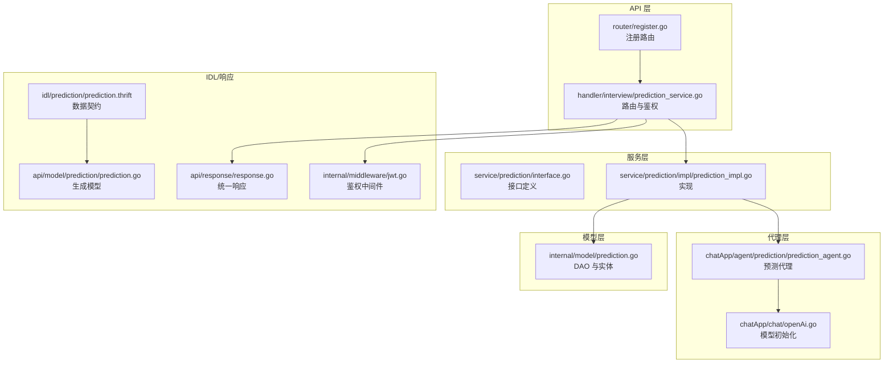
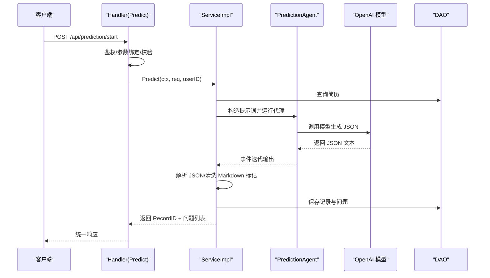
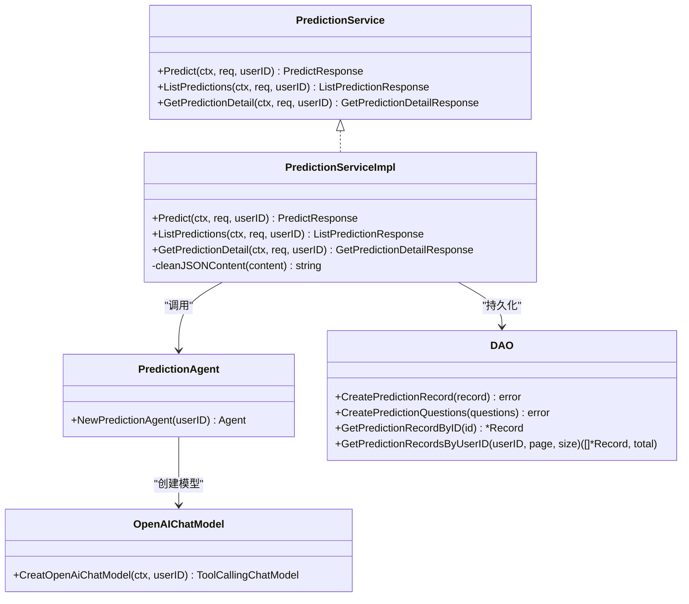
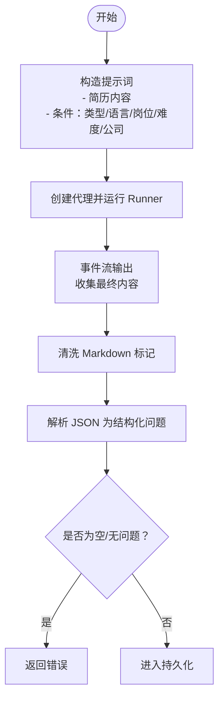
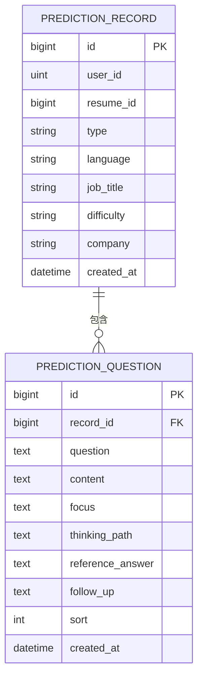
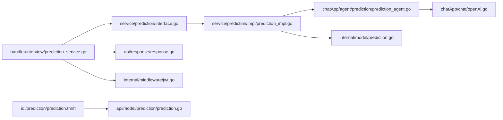

# 预测服务

<cite>
**本文引用的文件**
- [backend/api/handler/interview/prediction_service.go](file://backend/api/handler/interview/prediction_service.go)
- [backend/idl/prediction/prediction.thrift](file://backend/idl/prediction/prediction.thrift)
- [backend/api/model/prediction/prediction.go](file://backend/api/model/prediction/prediction.go)
- [backend/internal/service/prediction/interface.go](file://backend/internal/service/prediction/interface.go)
- [backend/internal/service/prediction/impl/prediction_impl.go](file://backend/internal/service/prediction/impl/prediction_impl.go)
- [backend/chatApp/agent/prediction/prediction_agent.go](file://backend/chatApp/agent/prediction/prediction_agent.go)
- [backend/chatApp/chat/openAi.go](file://backend/chatApp/chat/openAi.go)
- [backend/internal/model/prediction.go](file://backend/internal/model/prediction.go)
- [backend/api/response/response.go](file://backend/api/response/response.go)
- [backend/internal/middleware/jwt.go](file://backend/internal/middleware/jwt.go)
- [backend/api/router/register.go](file://backend/api/router/register.go)
</cite>

## 目录
1. [简介](#简介)
2. [项目结构](#项目结构)
3. [核心组件](#核心组件)
4. [架构总览](#架构总览)
5. [组件详解](#组件详解)
6. [依赖关系分析](#依赖关系分析)
7. [性能考量](#性能考量)
8. [故障排查指南](#故障排查指南)
9. [结论](#结论)
10. [附录](#附录)

## 简介
本文件面向“预测服务”的技术文档，聚焦于 PredictionManager 接口的设计与实现，覆盖预测算法、数据分析与结果生成等核心能力。文档详细说明预测模型的选择、训练与部署流程，阐述数据预处理、特征工程与模型评估方法，并给出预测准确性优化、模型更新策略与 A/B 测试方案。同时提供 API 使用示例、参数配置与返回值格式说明，以及性能监控、错误处理与故障恢复机制，最后涵盖预测结果的可视化与解释性分析建议。

## 项目结构
预测服务采用分层架构：API 层负责路由与参数绑定，服务层实现业务逻辑，代理层封装大模型调用，模型层负责持久化与查询。IDL 定义统一的数据契约，确保前后端与服务间的一致性。

**图表来源**
- [backend/api/handler/interview/prediction_service.go](file://backend/api/handler/interview/prediction_service.go#L1-L96)
- [backend/api/router/register.go](file://backend/api/router/register.go#L1-L16)
- [backend/internal/service/prediction/interface.go](file://backend/internal/service/prediction/interface.go#L1-L13)
- [backend/internal/service/prediction/impl/prediction_impl.go](file://backend/internal/service/prediction/impl/prediction_impl.go#L1-L293)
- [backend/chatApp/agent/prediction/prediction_agent.go](file://backend/chatApp/agent/prediction/prediction_agent.go#L1-L66)
- [backend/chatApp/chat/openAi.go](file://backend/chatApp/chat/openAi.go#L1-L142)
- [backend/internal/model/prediction.go](file://backend/internal/model/prediction.go#L1-L110)
- [backend/idl/prediction/prediction.thrift](file://backend/idl/prediction/prediction.thrift#L1-L89)
- [backend/api/model/prediction/prediction.go](file://backend/api/model/prediction/prediction.go#L1-L800)
- [backend/api/response/response.go](file://backend/api/response/response.go#L1-L119)
- [backend/internal/middleware/jwt.go](file://backend/internal/middleware/jwt.go#L1-L215)

**章节来源**
- [backend/api/handler/interview/prediction_service.go](file://backend/api/handler/interview/prediction_service.go#L1-L96)
- [backend/api/router/register.go](file://backend/api/router/register.go#L1-L16)

## 核心组件
- PredictionService 接口：定义预测、列表与详情三类操作，统一对外暴露。
- PredictionServiceImpl 实现：串联“简历检索 -> 构造提示词 -> 调用预测代理 -> 解析结果 -> 持久化 -> 组装响应”。
- PredictionAgent：基于 EINO ADK 的聊天模型代理，按固定 JSON 模板生成 5 道押题及其要点。
- DAO 层：提供记录与问题的增删查改，支持按用户分页查询与预加载问题列表。
- IDL/模型：通过 Thrift 定义请求/响应结构，生成 Go 侧模型，保证一致性。

**章节来源**
- [backend/internal/service/prediction/interface.go](file://backend/internal/service/prediction/interface.go#L1-L13)
- [backend/internal/service/prediction/impl/prediction_impl.go](file://backend/internal/service/prediction/impl/prediction_impl.go#L1-L293)
- [backend/chatApp/agent/prediction/prediction_agent.go](file://backend/chatApp/agent/prediction/prediction_agent.go#L1-L66)
- [backend/internal/model/prediction.go](file://backend/internal/model/prediction.go#L1-L110)
- [backend/idl/prediction/prediction.thrift](file://backend/idl/prediction/prediction.thrift#L1-L89)
- [backend/api/model/prediction/prediction.go](file://backend/api/model/prediction/prediction.go#L1-L800)

## 架构总览
预测服务遵循“请求进入 -> 鉴权 -> 参数绑定 -> 业务处理 -> 数据持久化 -> 统一响应”的闭环。关键流程如下：

**图表来源**
- [backend/api/handler/interview/prediction_service.go](file://backend/api/handler/interview/prediction_service.go#L17-L42)
- [backend/internal/service/prediction/impl/prediction_impl.go](file://backend/internal/service/prediction/impl/prediction_impl.go#L25-L211)
- [backend/chatApp/agent/prediction/prediction_agent.go](file://backend/chatApp/agent/prediction/prediction_agent.go#L25-L66)
- [backend/chatApp/chat/openAi.go](file://backend/chatApp/chat/openAi.go#L19-L109)
- [backend/internal/model/prediction.go](file://backend/internal/model/prediction.go#L51-L109)

## 组件详解

### PredictionService 接口与实现
- 接口职责
  - Predict：根据简历与条件生成押题记录与问题列表。
  - ListPredictions：按用户分页查询押题记录摘要。
  - GetPredictionDetail：按记录 ID 查询完整问题明细。
- 实现要点
  - 参数校验与异常捕获，防止 panic 导致服务崩溃。
  - 通过 Runner 驱动代理，迭代消费事件流，最终聚合输出。
  - 对代理返回的 JSON 进行清洗与解析，兼容多种 FollowUp 类型。
  - 分步持久化：先存主记录再存问题，便于定位问题。

**图表来源**
- [backend/internal/service/prediction/interface.go](file://backend/internal/service/prediction/interface.go#L8-L12)
- [backend/internal/service/prediction/impl/prediction_impl.go](file://backend/internal/service/prediction/impl/prediction_impl.go#L19-L293)
- [backend/chatApp/agent/prediction/prediction_agent.go](file://backend/chatApp/agent/prediction/prediction_agent.go#L25-L66)
- [backend/chatApp/chat/openAi.go](file://backend/chatApp/chat/openAi.go#L19-L109)
- [backend/internal/model/prediction.go](file://backend/internal/model/prediction.go#L49-L109)

**章节来源**
- [backend/internal/service/prediction/interface.go](file://backend/internal/service/prediction/interface.go#L1-L13)
- [backend/internal/service/prediction/impl/prediction_impl.go](file://backend/internal/service/prediction/impl/prediction_impl.go#L1-L293)

### 预测代理与提示词工程
- 代理职责：基于用户提供的简历与条件，生成标准化 JSON，包含 5 道押题及要点。
- 提示词要点：强调必须返回 5 道题、严格 JSON 格式、避免 Markdown 标记、结合简历技能点。
- 输出解析：实现对 Markdown 包裹标记的清洗，兼容 FollowUp 的字符串/数组形式。

**图表来源**
- [backend/internal/service/prediction/impl/prediction_impl.go](file://backend/internal/service/prediction/impl/prediction_impl.go#L42-L122)
- [backend/chatApp/agent/prediction/prediction_agent.go](file://backend/chatApp/agent/prediction/prediction_agent.go#L37-L66)

**章节来源**
- [backend/chatApp/agent/prediction/prediction_agent.go](file://backend/chatApp/agent/prediction/prediction_agent.go#L1-L66)
- [backend/internal/service/prediction/impl/prediction_impl.go](file://backend/internal/service/prediction/impl/prediction_impl.go#L213-L227)

### 数据模型与持久化
- 记录表：包含用户 ID、简历 ID、类型、语言、岗位、难度、公司等元信息。
- 问题表：记录每道题目的问题正文、重点考察内容、思考路径、参考答案、可能追问、排序等。
- DAO 能力：支持按用户分页查询记录、按排序预加载问题、批量插入问题。

**图表来源**
- [backend/internal/model/prediction.go](file://backend/internal/model/prediction.go#L11-L47)

**章节来源**
- [backend/internal/model/prediction.go](file://backend/internal/model/prediction.go#L1-L110)

### API 定义与路由
- 路由注册：通过 IDL 生成的服务路由在启动时被注册。
- 接口清单：
  - POST /api/prediction/start：开始预测
  - GET /api/prediction/list：列表查询
  - GET /api/prediction/:id：详情查询
- 参数与返回：由 Thrift 定义并在生成模型中体现，Handler 层进行绑定与校验。

**章节来源**
- [backend/idl/prediction/prediction.thrift](file://backend/idl/prediction/prediction.thrift#L67-L88)
- [backend/api/handler/interview/prediction_service.go](file://backend/api/handler/interview/prediction_service.go#L17-L95)
- [backend/api/router/register.go](file://backend/api/router/register.go#L11-L15)

## 依赖关系分析
- Handler 依赖服务接口，不直接依赖实现，便于替换与测试。
- 服务实现依赖代理与 DAO，代理依赖模型初始化工具。
- 鉴权中间件贯穿 Handler，统一提取用户 ID。
- 响应层提供统一错误映射，便于前端消费。

**图表来源**
- [backend/api/handler/interview/prediction_service.go](file://backend/api/handler/interview/prediction_service.go#L1-L96)
- [backend/internal/service/prediction/interface.go](file://backend/internal/service/prediction/interface.go#L1-L13)
- [backend/internal/service/prediction/impl/prediction_impl.go](file://backend/internal/service/prediction/impl/prediction_impl.go#L1-L293)
- [backend/chatApp/agent/prediction/prediction_agent.go](file://backend/chatApp/agent/prediction/prediction_agent.go#L1-L66)
- [backend/chatApp/chat/openAi.go](file://backend/chatApp/chat/openAi.go#L1-L142)
- [backend/internal/model/prediction.go](file://backend/internal/model/prediction.go#L1-L110)
- [backend/idl/prediction/prediction.thrift](file://backend/idl/prediction/prediction.thrift#L1-L89)
- [backend/api/model/prediction/prediction.go](file://backend/api/model/prediction/prediction.go#L1-L800)
- [backend/api/response/response.go](file://backend/api/response/response.go#L1-L119)
- [backend/internal/middleware/jwt.go](file://backend/internal/middleware/jwt.go#L1-L215)

**章节来源**
- [backend/api/handler/interview/prediction_service.go](file://backend/api/handler/interview/prediction_service.go#L1-L96)
- [backend/internal/service/prediction/impl/prediction_impl.go](file://backend/internal/service/prediction/impl/prediction_impl.go#L1-L293)

## 性能考量
- 事件流消费：通过 Runner 的事件迭代消费，避免一次性缓冲大量输出，降低内存峰值。
- 分步持久化：先保存主记录再保存问题，便于快速返回并定位问题。
- JSON 清洗：去除 Markdown 包裹标记，减少解析开销。
- 模型初始化：统一从用户模型表获取密钥与模型配置，避免硬编码与重复初始化。
- 超时与重试：模型调用层具备超时与错误分类处理，建议在网关或代理层增加限流与熔断。

[本节为通用性能建议，无需具体文件引用]

## 故障排查指南
- 鉴权失败
  - 现象：返回 401 未授权。
  - 排查：确认 Authorization 头格式为 Bearer Token，或 X-Auth-Token、Query token、Cookie 中任一有效。
- 参数校验失败
  - 现象：返回 400。
  - 排查：检查请求体字段是否满足 Thrift 定义的必填项与类型。
- 代理返回空或解析失败
  - 现象：日志显示代理返回空或 JSON 解析失败。
  - 排查：确认提示词构造正确、模型返回符合 JSON 模板、Markdown 标记已被清洗。
- 数据库写入失败
  - 现象：主记录保存成功但 ID 为 0，或问题保存失败。
  - 排查：检查事务与外键约束、批量插入是否为空、数据库连接状态。
- 模型调用异常
  - 现象：API Key 无效、配额不足、速率限制、上下文过长。
  - 排查：核对密钥长度与格式、账户余额、限流阈值、输入长度。

**章节来源**
- [backend/api/response/response.go](file://backend/api/response/response.go#L80-L88)
- [backend/internal/middleware/jwt.go](file://backend/internal/middleware/jwt.go#L186-L214)
- [backend/internal/service/prediction/impl/prediction_impl.go](file://backend/internal/service/prediction/impl/prediction_impl.go#L35-L122)
- [backend/chatApp/chat/openAi.go](file://backend/chatApp/chat/openAi.go#L84-L106)

## 结论
预测服务通过清晰的分层设计与严格的契约约束，实现了从简历到押题的自动化生成与持久化。服务具备良好的可扩展性与可观测性，建议后续完善模型训练与评估体系、引入 A/B 测试框架与可视化分析模块，持续提升预测准确性与用户体验。

[本节为总结性内容，无需具体文件引用]

## 附录

### API 使用示例与参数配置
- 开始预测
  - 方法与路径：POST /api/prediction/start
  - 请求体字段（JSON）：resume_id, prediction_type, language, job_title, difficulty, company_name(可选)
  - 示例请求体（字段说明见下表）
  - 返回：record_id, questions[]
- 列表查询
  - 方法与路径：GET /api/prediction/list?page&size
  - 返回：list[], total, page, size
- 详情查询
  - 方法与路径：GET /api/prediction/:id
  - 返回：id, questions[]

请求体字段定义（来自 Thrift 与生成模型）
- resume_id: i64，必填
- prediction_type: string，必填，如“校招/社招”
- language: string，必填，如“java/go”
- job_title: string，必填，如“前端/后端”
- difficulty: string，必填，如“入门/进阶”
- company_name: string，可选

返回值字段定义
- PredictResponse.record_id: i64
- PredictResponse.questions[]: 包含以下字段
  - id: i64
  - question: string
  - content: string
  - focus: string
  - thinking_path: string
  - reference_answer: string
  - follow_up: string
  - sort: i32

鉴权方式
- Header: Authorization: Bearer <token>
- 或：X-Auth-Token、Query token、Cookie token

**章节来源**
- [backend/idl/prediction/prediction.thrift](file://backend/idl/prediction/prediction.thrift#L3-L65)
- [backend/api/model/prediction/prediction.go](file://backend/api/model/prediction/prediction.go#L11-L800)
- [backend/api/handler/interview/prediction_service.go](file://backend/api/handler/interview/prediction_service.go#L17-L95)
- [backend/internal/middleware/jwt.go](file://backend/internal/middleware/jwt.go#L186-L214)

### 预测准确性优化与模型更新策略
- 数据增强：丰富简历样本与问题标注，提高模板泛化能力。
- 提示词迭代：引入 Few-shot 示例与更细粒度的约束，减少 JSON 解析歧义。
- 模型选择：支持多模型切换与端到端评测，建立 A/B 实验基线。
- 版本化：为不同版本的提示词与模型建立版本号，便于回滚与追踪。

[本节为通用优化建议，无需具体文件引用]

### A/B 测试方案
- 分组策略：按用户 ID 哈希分组，确保实验稳定性。
- 指标体系：命中率、覆盖率、用户满意度、回答时长等。
- 实施步骤：灰度发布、数据采集、统计显著性检验、效果评估与决策。

[本节为通用方案建议，无需具体文件引用]

### 可视化与解释性分析
- 结果可视化：展示问题分布、重点考察维度热力图、追问概率等。
- 解释性：输出每个问题的“重点考察”“思考路径”“参考答案”，辅助用户理解与复盘。

[本节为通用方案建议，无需具体文件引用]