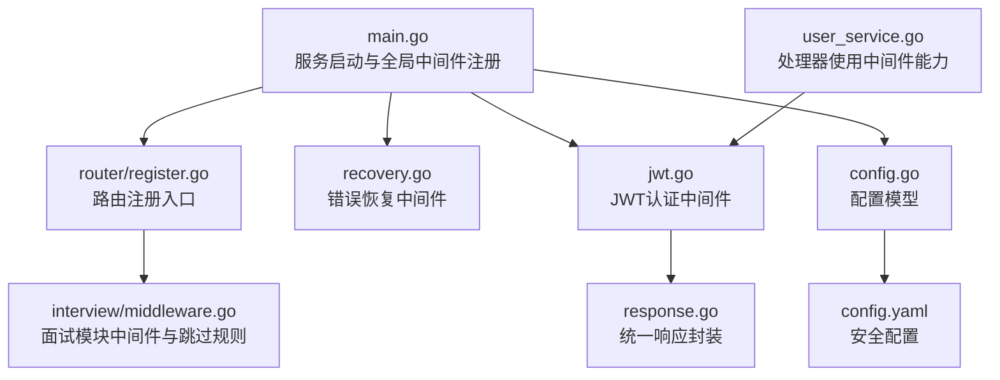
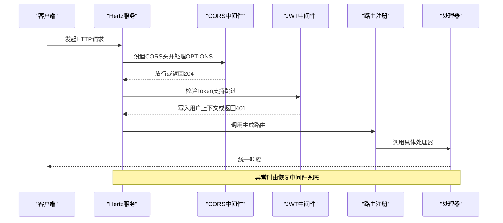
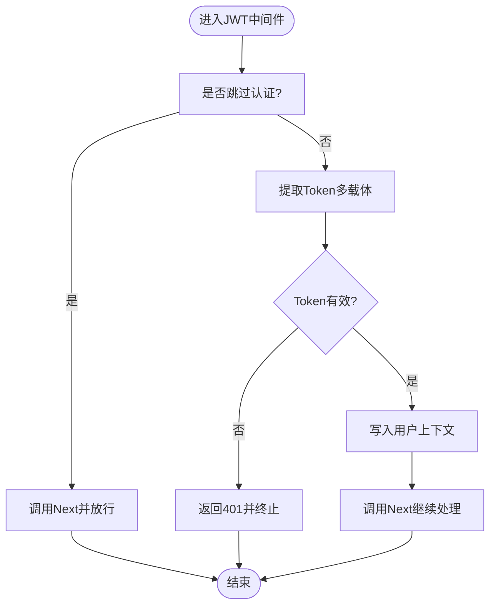
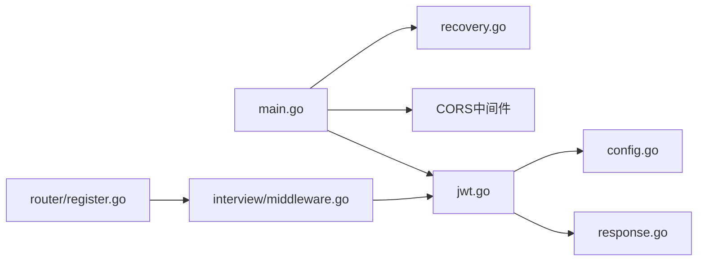

# 中间件系统

<cite>
**本文引用的文件**
- [backend/main.go](file://backend/main.go)
- [backend/api/router/register.go](file://backend/api/router/register.go)
- [backend/api/router/interview/middleware.go](file://backend/api/router/interview/middleware.go)
- [backend/api/router/middleware/recovery.go](file://backend/api/router/middleware/recovery.go)
- [backend/internal/middleware/jwt.go](file://backend/internal/middleware/jwt.go)
- [backend/api/response/response.go](file://backend/api/response/response.go)
- [backend/internal/config/config.go](file://backend/internal/config/config.go)
- [backend/config.yaml](file://backend/config.yaml)
- [backend/api/handler/interview/user_service.go](file://backend/api/handler/interview/user_service.go)
</cite>

## 目录
1. [简介](#简介)
2. [项目结构](#项目结构)
3. [核心组件](#核心组件)
4. [架构总览](#架构总览)
5. [详细组件分析](#详细组件分析)
6. [依赖关系分析](#依赖关系分析)
7. [性能考虑](#性能考虑)
8. [故障排查指南](#故障排查指南)
9. [结论](#结论)
10. [附录](#附录)

## 简介
本文件面向面试吧中间件系统，围绕基于 Hertz 框架的中间件体系进行系统化技术说明。重点覆盖：
- JWT 认证中间件的设计原理与安全机制
- 全局 CORS 中间件、错误恢复中间件与请求日志中间件
- 中间件执行顺序、上下文传递与异常处理
- 自定义中间件开发指南、配置管理与性能优化
- 安全中间件、限流中间件与监控中间件的扩展建议
- 具体中间件实现代码与使用示例

## 项目结构
中间件相关代码主要分布在以下位置：
- 服务入口与全局中间件注册：backend/main.go
- 路由注册入口：backend/api/router/register.go
- 面试模块中间件配置与跳过规则：backend/api/router/interview/middleware.go
- 错误恢复中间件：backend/api/router/middleware/recovery.go
- JWT 认证中间件与上下文工具：backend/internal/middleware/jwt.go
- 统一响应封装：backend/api/response/response.go
- 配置模型与安全配置：backend/internal/config/config.go、backend/config.yaml
- 处理器中对中间件能力的使用示例：backend/api/handler/interview/user_service.go

图表来源
- [backend/main.go](file://backend/main.go#L101-L128)
- [backend/api/router/register.go](file://backend/api/router/register.go#L11-L15)
- [backend/api/router/interview/middleware.go](file://backend/api/router/interview/middleware.go#L13-L36)
- [backend/api/router/middleware/recovery.go](file://backend/api/router/middleware/recovery.go#L15-L34)
- [backend/internal/middleware/jwt.go](file://backend/internal/middleware/jwt.go#L32-L78)
- [backend/api/response/response.go](file://backend/api/response/response.go#L13-L88)
- [backend/internal/config/config.go](file://backend/internal/config/config.go#L113-L118)
- [backend/config.yaml](file://backend/config.yaml#L39-L49)
- [backend/api/handler/interview/user_service.go](file://backend/api/handler/interview/user_service.go#L27-L31)

章节来源
- [backend/main.go](file://backend/main.go#L101-L128)
- [backend/api/router/register.go](file://backend/api/router/register.go#L11-L15)

## 核心组件
- 全局错误恢复中间件：捕获 panic，统一返回内部错误响应，避免服务崩溃
- 全局 CORS 中间件：设置跨域头并处理 OPTIONS 预检请求
- JWT 认证中间件：从多种载体提取 Token，校验签名与有效期，并将用户信息写入上下文
- 上下文工具：从请求上下文读取用户 ID、用户名、角色等
- 统一响应封装：标准化响应结构与 HTTP 状态码映射
- 配置模型：集中管理安全配置（JWT 秘钥、过期时间、CORS）

章节来源
- [backend/api/router/middleware/recovery.go](file://backend/api/router/middleware/recovery.go#L15-L34)
- [backend/main.go](file://backend/main.go#L109-L125)
- [backend/internal/middleware/jwt.go](file://backend/internal/middleware/jwt.go#L32-L78)
- [backend/api/response/response.go](file://backend/api/response/response.go#L13-L88)
- [backend/internal/config/config.go](file://backend/internal/config/config.go#L113-L118)
- [backend/config.yaml](file://backend/config.yaml#L39-L49)

## 架构总览
Hertz 服务启动后，先注册全局中间件，再注册由 IDL 生成的路由。JWT 中间件通过面试模块的 AuthSkipper 控制白名单路径，CORS 中间件负责跨域与预检处理，错误恢复中间件确保异常可控。

图表来源
- [backend/main.go](file://backend/main.go#L104-L128)
- [backend/api/router/interview/middleware.go](file://backend/api/router/interview/middleware.go#L13-L36)
- [backend/internal/middleware/jwt.go](file://backend/internal/middleware/jwt.go#L32-L78)
- [backend/api/router/register.go](file://backend/api/router/register.go#L11-L15)

## 详细组件分析

### JWT 认证中间件
- 设计要点
  - 支持跳过器：通过 AuthSkipper 判断是否跳过认证（如 OPTIONS、公开接口）
  - 多载体提取：优先 Authorization Bearer，其次 X-Auth-Token，再次查询参数 token，最后 Cookie
  - 签名与有效期：使用 HS256 算法，配置中读取密钥与过期时间
  - 上下文注入：将用户 ID、用户名、角色写入请求上下文，供后续处理器使用
- 安全机制
  - 严格校验签名算法与密钥
  - 对过期与无效 Token 返回 401
  - 白名单路径与预检请求不强制要求 Token
- 使用方式
  - 在服务启动时以“跳过器”形式注册
  - 处理器通过上下文工具读取用户信息

图表来源
- [backend/internal/middleware/jwt.go](file://backend/internal/middleware/jwt.go#L32-L78)
- [backend/api/router/interview/middleware.go](file://backend/api/router/interview/middleware.go#L13-L36)

章节来源
- [backend/internal/middleware/jwt.go](file://backend/internal/middleware/jwt.go#L32-L78)
- [backend/internal/middleware/jwt.go](file://backend/internal/middleware/jwt.go#L80-L113)
- [backend/internal/middleware/jwt.go](file://backend/internal/middleware/jwt.go#L136-L161)
- [backend/internal/middleware/jwt.go](file://backend/internal/middleware/jwt.go#L163-L184)
- [backend/internal/middleware/jwt.go](file://backend/internal/middleware/jwt.go#L186-L214)
- [backend/api/router/interview/middleware.go](file://backend/api/router/interview/middleware.go#L13-L36)

### 全局 CORS 中间件
- 行为
  - 设置允许源、方法、头与预检缓存时间
  - 对 OPTIONS 请求直接返回 204 并终止后续处理
- 配置
  - 通过配置文件中的 security.cors 字段控制允许项
- 注意
  - 当前实现为简单通配，生产环境建议按需收紧

章节来源
- [backend/main.go](file://backend/main.go#L109-L125)
- [backend/config.yaml](file://backend/config.yaml#L43-L48)

### 错误恢复中间件
- 行为
  - defer 捕获 panic，记录堆栈，构造内部错误并返回统一响应
- 位置
  - 必须置于中间件链首部，确保所有请求均被保护

章节来源
- [backend/api/router/middleware/recovery.go](file://backend/api/router/middleware/recovery.go#L15-L34)

### 统一响应封装
- 结构
  - code、message、data
- 方法
  - 成功、错误、400/401/403/404/500 等常用快捷方法
  - 根据业务码映射 HTTP 状态码
- 使用
  - 处理器统一通过该封装返回结果

章节来源
- [backend/api/response/response.go](file://backend/api/response/response.go#L13-L88)
- [backend/api/response/response.go](file://backend/api/response/response.go#L90-L118)

### 配置管理
- 安全配置
  - jwt_secret：JWT 签名密钥
  - jwt_expiration：Token 过期间隔
  - cors：跨域允许项
- 配置加载
  - YAML 文件加载到全局配置对象，供中间件与服务使用

章节来源
- [backend/internal/config/config.go](file://backend/internal/config/config.go#L113-L118)
- [backend/config.yaml](file://backend/config.yaml#L39-L49)

### 处理器中的中间件使用示例
- 读取用户上下文
  - 处理器通过中间件工具函数从请求上下文中获取用户 ID、用户名、角色
- 未授权处理
  - 当用户 ID 为 0 时返回 401

章节来源
- [backend/api/handler/interview/user_service.go](file://backend/api/handler/interview/user_service.go#L27-L31)
- [backend/api/handler/interview/user_service.go](file://backend/api/handler/interview/user_service.go#L305-L309)

## 依赖关系分析
- 服务启动依赖
  - main.go 注册 recovery、CORS、JWT 中间件，并注册生成路由
- 中间件依赖
  - JWT 依赖配置模块读取密钥与过期时间
  - 统一响应封装被各中间件与处理器共享
- 路由与中间件
  - 面试模块通过 AuthSkipper 控制 JWT 跳过规则

图表来源
- [backend/main.go](file://backend/main.go#L104-L128)
- [backend/api/router/middleware/recovery.go](file://backend/api/router/middleware/recovery.go#L15-L34)
- [backend/internal/middleware/jwt.go](file://backend/internal/middleware/jwt.go#L80-L113)
- [backend/internal/config/config.go](file://backend/internal/config/config.go#L113-L118)
- [backend/api/response/response.go](file://backend/api/response/response.go#L13-L88)
- [backend/api/router/interview/middleware.go](file://backend/api/router/interview/middleware.go#L13-L36)
- [backend/api/router/register.go](file://backend/api/router/register.go#L11-L15)

章节来源
- [backend/main.go](file://backend/main.go#L104-L128)
- [backend/api/router/interview/middleware.go](file://backend/api/router/interview/middleware.go#L13-L36)
- [backend/internal/middleware/jwt.go](file://backend/internal/middleware/jwt.go#L80-L113)

## 性能考虑
- 中间件链顺序
  - recovery 放首位，CORS 紧随其后，JWT 位于路由注册之前
- Token 校验成本
  - HS256 签名校验轻量，但应避免频繁重复解析；可结合缓存策略（如按 IP 或会话）降低压力
- CORS 预检
  - 合理设置缓存时间，减少重复预检请求
- 日志与异常
  - 统一响应与错误恢复中间件减少分支判断，提升处理效率

[本节为通用指导，无需列出具体文件来源]

## 故障排查指南
- JWT 401
  - 检查 Authorization 头格式是否为 Bearer {token}
  - 确认 Token 未过期且密钥正确
  - 核对跳过规则是否误放行了受保护路径
- CORS 403/预检失败
  - 检查 Allow-Headers、Allow-Methods、Allow-Origin 是否满足前端请求
  - 确认 OPTIONS 预检是否被提前终止
- 500 异常
  - 查看恢复中间件日志中的堆栈信息
  - 定位具体处理器逻辑并修复

章节来源
- [backend/internal/middleware/jwt.go](file://backend/internal/middleware/jwt.go#L49-L69)
- [backend/api/router/middleware/recovery.go](file://backend/api/router/middleware/recovery.go#L17-L33)
- [backend/main.go](file://backend/main.go#L109-L125)

## 结论
本中间件体系以 Hertz 为核心，采用“恢复中间件优先、CORS 简化处理、JWT 认证可跳过”的设计，配合统一响应与配置模型，实现了安全、稳定、易扩展的服务层基础设施。建议在生产环境中进一步收紧 CORS、引入限流与监控中间件，并完善日志与审计能力。

[本节为总结性内容，无需列出具体文件来源]

## 附录

### 中间件执行顺序与上下文传递
- 执行顺序
  1) 错误恢复中间件
  2) CORS 中间件
  3) JWT 中间件（带跳过器）
  4) 路由注册与处理器
- 上下文传递
  - JWT 中间件将用户信息写入请求上下文，处理器通过工具函数读取

章节来源
- [backend/main.go](file://backend/main.go#L104-L128)
- [backend/internal/middleware/jwt.go](file://backend/internal/middleware/jwt.go#L71-L76)
- [backend/api/handler/interview/user_service.go](file://backend/api/handler/interview/user_service.go#L27-L31)

### 自定义中间件开发指南
- 开发步骤
  - 定义 app.HandlerFunc，遵循 ctx.Next(c) 的链式调用
  - 在函数体内进行前置处理（如鉴权、限流、埋点），必要时调用 ctx.Abort() 终止
  - 在 defer 中进行后置处理（如统计、清理）
- 注册方式
  - 在服务启动处通过 s.Use(...) 注册
- 示例参考
  - 错误恢复中间件与 JWT 中间件的实现模式

章节来源
- [backend/api/router/middleware/recovery.go](file://backend/api/router/middleware/recovery.go#L15-L34)
- [backend/internal/middleware/jwt.go](file://backend/internal/middleware/jwt.go#L32-L78)

### 安全中间件、限流中间件与监控中间件（扩展建议）
- 安全中间件
  - 引入速率限制（基于 IP 或用户维度）、防爆破登录、敏感请求二次校验
- 限流中间件
  - 可参考基于令牌桶的限流实现，按路径或用户维度配置不同阈值
- 监控中间件
  - 记录 QPS、延迟、错误率、Token 校验耗时等指标，便于容量规划与问题定位

章节来源
- [backend/doc/项目优化建议_性能安全篇.md](file://backend/doc/项目优化建议_性能安全篇.md#L398-L446)
- [backend/doc/项目优化建议_AI功能篇.md](file://backend/doc/项目优化建议_AI功能篇.md#L155-L197)