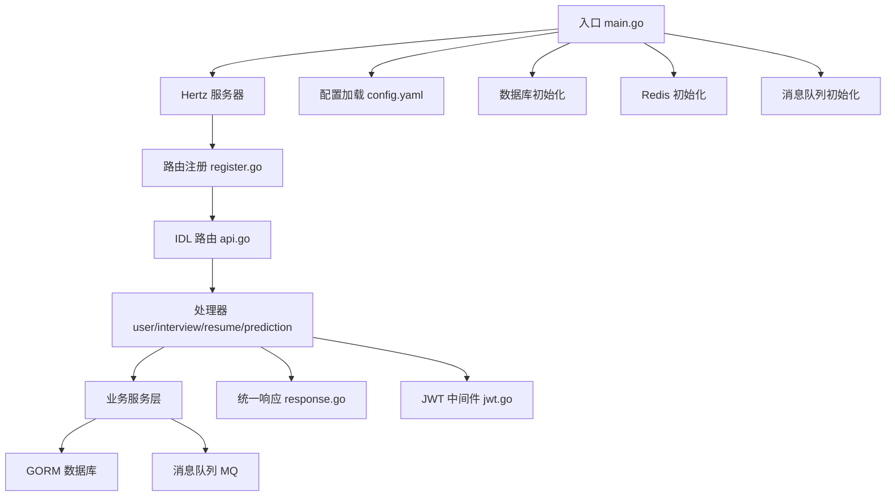
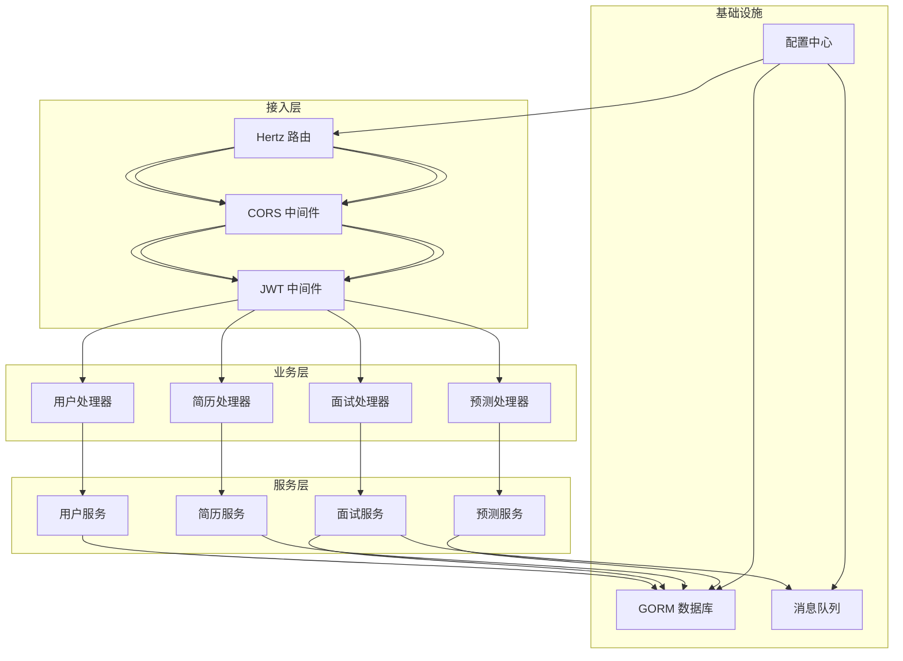
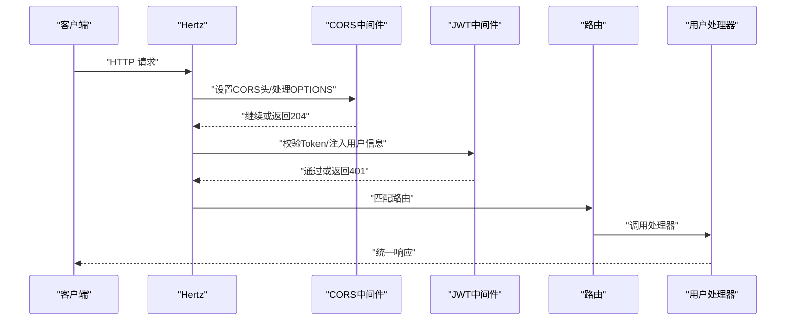
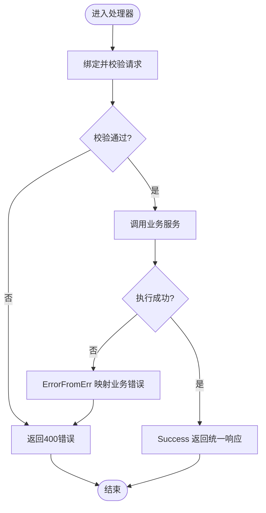
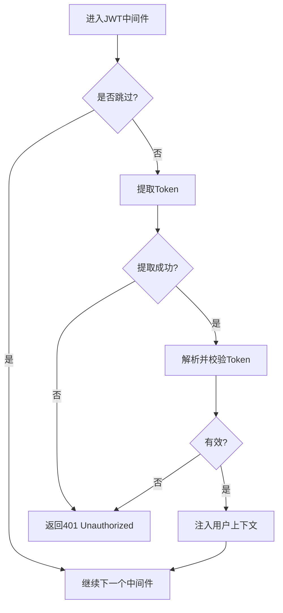
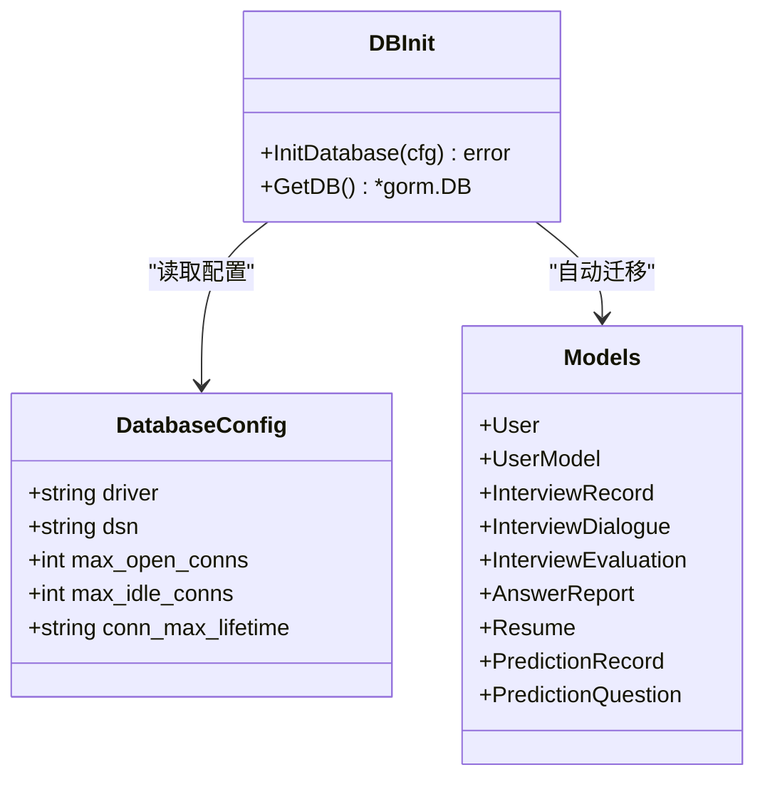
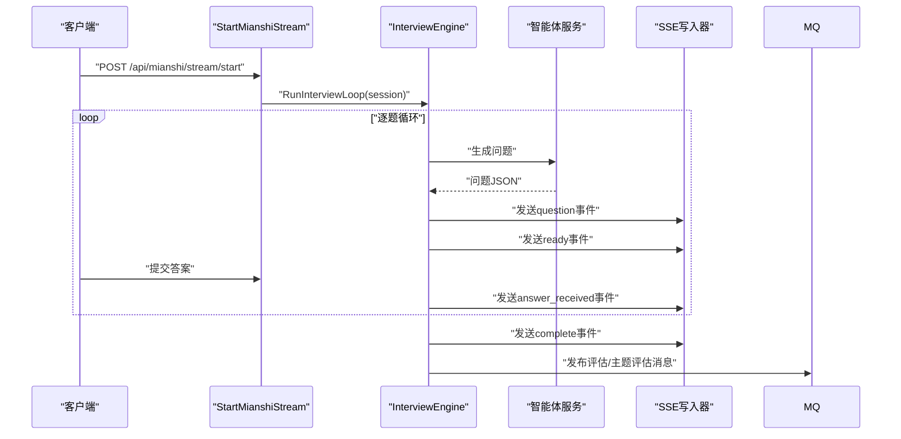
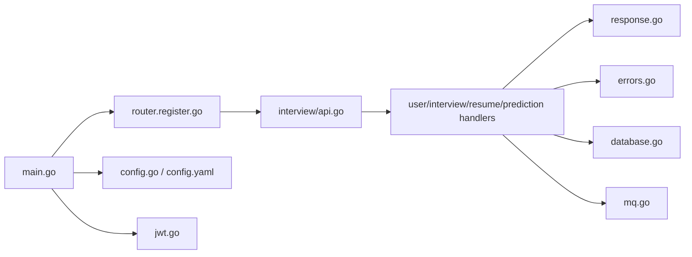

# 后端开发

<cite>
**本文引用的文件**
- [backend/main.go](file://backend/main.go)
- [backend/api/router/register.go](file://backend/api/router/register.go)
- [backend/api/router/interview/api.go](file://backend/api/router/interview/api.go)
- [backend/api/router/interview/middleware.go](file://backend/api/router/interview/middleware.go)
- [backend/internal/middleware/jwt.go](file://backend/internal/middleware/jwt.go)
- [backend/api/response/response.go](file://backend/api/response/response.go)
- [backend/internal/config/config.go](file://backend/internal/config/config.go)
- [backend/config.yaml](file://backend/config.yaml)
- [backend/api/handler/interview/user_service.go](file://backend/api/handler/interview/user_service.go)
- [backend/api/handler/interview/interviews_service.go](file://backend/api/handler/interview/interviews_service.go)
- [backend/api/handler/interview/mianshi/engine.go](file://backend/api/handler/interview/mianshi/engine.go)
- [backend/internal/errors/errors.go](file://backend/internal/errors/errors.go)
- [backend/internal/repository/database.go](file://backend/internal/repository/database.go)
- [backend/internal/mq/mq.go](file://backend/internal/mq/mq.go)
- [backend/api/model/interview/api.go](file://backend/api/model/interview/api.go)
</cite>

## 目录
1. [简介](#简介)
2. [项目结构](#项目结构)
3. [核心组件](#核心组件)
4. [架构总览](#架构总览)
5. [详细组件分析](#详细组件分析)
6. [依赖关系分析](#依赖关系分析)
7. [性能考虑](#性能考虑)
8. [故障排查指南](#故障排查指南)
9. [结论](#结论)
10. [附录](#附录)

## 简介
本项目为“面试吧”后端服务，采用 CloudWeGo Hertz 框架构建，提供用户管理、简历管理、智能面试（综合/专项）、AI押题预测、SSE 实时流式交互、消息队列异步处理、统一响应与错误处理、JWT 认证与跨域支持等能力。本文档面向开发与维护人员，系统梳理架构设计、路由组织、中间件配置、数据模型、业务逻辑、错误处理、性能优化与运维监控要点。

## 项目结构
后端采用按功能域划分的模块化组织方式：
- 入口与初始化：backend/main.go 负责 .env 加载、配置展开、数据库/Redis/MQ 初始化、Hertz 服务器启动与优雅关闭
- 路由注册：api/router 下通过 IDL 生成的注册器将各服务路由挂载至 Hertz
- 处理器层：api/handler/interview 下按业务域划分（用户、面试、简历、预测）
- 业务模型与响应：api/model 与 api/response 统一响应格式
- 配置中心：internal/config 与 config.yaml 提供集中配置与环境变量展开
- 中间件：internal/middleware 提供 JWT 认证与跳过规则
- 错误体系：internal/errors 统一错误码与 HTTP 映射
- 存储与消息：internal/repository 提供 GORM 数据库初始化与迁移；internal/mq 提供消息队列抽象与发布
- 会话与引擎：api/handler/interview/mianshi/engine.go 实现面试引擎与 SSE 流式交互

图表来源
- [backend/main.go](file://backend/main.go#L29-L173)
- [backend/api/router/register.go](file://backend/api/router/register.go#L11-L15)
- [backend/api/router/interview/api.go](file://backend/api/router/interview/api.go#L16-L103)
- [backend/api/response/response.go](file://backend/api/response/response.go#L13-L118)
- [backend/internal/middleware/jwt.go](file://backend/internal/middleware/jwt.go#L32-L78)
- [backend/internal/repository/database.go](file://backend/internal/repository/database.go#L18-L60)
- [backend/internal/mq/mq.go](file://backend/internal/mq/mq.go#L137-L153)

章节来源
- [backend/main.go](file://backend/main.go#L29-L173)
- [backend/api/router/register.go](file://backend/api/router/register.go#L11-L15)
- [backend/api/router/interview/api.go](file://backend/api/router/interview/api.go#L16-L103)

## 核心组件
- Hertz 服务器与中间件
  - 全局恢复中间件捕获 panic，CORS 中间件处理预检与跨域头，JWT 中间件按需跳过公开路由
- 路由与鉴权
  - 通过 IDL 生成的路由注册器集中挂载；公开路由白名单由 AuthSkipper 控制
- 统一响应与错误
  - 统一响应结构与 HTTP 状态码映射；AppError 错误体系支持业务错误码与 HTTP 映射
- 配置中心
  - YAML 配置与环境变量展开，支持多子系统配置（数据库、Redis、Hertz、安全、OpenAI、Embedding、Milvus、微信/飞书/邮件等）
- 数据与消息
  - GORM 自动迁移；消息队列抽象与发布

章节来源
- [backend/main.go](file://backend/main.go#L101-L128)
- [backend/api/router/interview/middleware.go](file://backend/api/router/interview/middleware.go#L13-L36)
- [backend/api/response/response.go](file://backend/api/response/response.go#L13-L118)
- [backend/internal/errors/errors.go](file://backend/internal/errors/errors.go#L9-L177)
- [backend/internal/config/config.go](file://backend/internal/config/config.go#L136-L268)
- [backend/internal/repository/database.go](file://backend/internal/repository/database.go#L18-L60)
- [backend/internal/mq/mq.go](file://backend/internal/mq/mq.go#L137-L153)

## 架构总览
整体采用“路由-处理器-服务-存储/消息”的分层架构，配合中间件实现认证、CORS、统一响应与错误处理。

图表来源
- [backend/main.go](file://backend/main.go#L101-L128)
- [backend/api/router/interview/api.go](file://backend/api/router/interview/api.go#L16-L103)
- [backend/api/handler/interview/user_service.go](file://backend/api/handler/interview/user_service.go#L18-L42)
- [backend/api/handler/interview/interviews_service.go](file://backend/api/handler/interview/interviews_service.go#L26-L53)
- [backend/internal/repository/database.go](file://backend/internal/repository/database.go#L18-L60)
- [backend/internal/mq/mq.go](file://backend/internal/mq/mq.go#L137-L153)
- [backend/internal/config/config.go](file://backend/internal/config/config.go#L136-L268)

## 详细组件分析

### 路由与中间件
- 路由组织
  - 通过 api/router/interview/api.go 生成的 Register 方法挂载 /api/* 下的用户、面试、简历、预测等子路由
  - 路由按组划分（/api/user、/api/mianshi、/api/resume、/api/prediction），便于权限与中间件分层控制
- 中间件配置
  - 全局恢复中间件：捕获 panic，避免服务崩溃
  - CORS 中间件：设置允许源、方法、头、预检缓存，并对 OPTIONS 直接返回 204
  - JWT 中间件：支持跳过规则（AuthSkipper），对公开路由放行；对受保护路由解析并校验 Token，注入用户上下文

图表来源
- [backend/main.go](file://backend/main.go#L101-L128)
- [backend/api/router/interview/middleware.go](file://backend/api/router/interview/middleware.go#L13-L36)
- [backend/internal/middleware/jwt.go](file://backend/internal/middleware/jwt.go#L32-L78)

章节来源
- [backend/api/router/interview/api.go](file://backend/api/router/interview/api.go#L16-L103)
- [backend/api/router/interview/middleware.go](file://backend/api/router/interview/middleware.go#L13-L36)
- [backend/main.go](file://backend/main.go#L101-L128)
- [backend/internal/middleware/jwt.go](file://backend/internal/middleware/jwt.go#L32-L78)

### 统一响应与错误处理
- 统一响应结构
  - 字段包括 code、message、data；提供 Success/Error/BadRequest/Unauthorized/Forbidden/NotFound/InternalServerError 等便捷方法
  - ErrorFromErr 根据业务错误自动映射 HTTP 状态码
- 错误体系
  - AppError 定义业务错误码与 HTTP 映射；内置 WrapError、New*Error 辅助函数
  - 针对模型 API（OpenAI/Milvus 等）提供专用错误类型与状态码映射（如 402、429、413）

图表来源
- [backend/api/response/response.go](file://backend/api/response/response.go#L20-L88)
- [backend/internal/errors/errors.go](file://backend/internal/errors/errors.go#L31-L177)

章节来源
- [backend/api/response/response.go](file://backend/api/response/response.go#L13-L118)
- [backend/internal/errors/errors.go](file://backend/internal/errors/errors.go#L9-L177)

### JWT 认证与用户上下文
- 令牌提取顺序
  - Header: Bearer {token}
  - Header: X-Auth-Token
  - Query: token
  - Cookie: token
- Claims 注入
  - 解析成功后将 user_id、username、role 等注入上下文，供后续处理器使用
- 跳过规则
  - 公开路由白名单 + OPTIONS 预检请求直接放行

图表来源
- [backend/internal/middleware/jwt.go](file://backend/internal/middleware/jwt.go#L32-L78)
- [backend/internal/middleware/jwt.go](file://backend/internal/middleware/jwt.go#L186-L214)
- [backend/api/router/interview/middleware.go](file://backend/api/router/interview/middleware.go#L13-L36)

章节来源
- [backend/internal/middleware/jwt.go](file://backend/internal/middleware/jwt.go#L16-L214)
- [backend/api/router/interview/middleware.go](file://backend/api/router/interview/middleware.go#L13-L36)

### 数据模型与持久化
- 数据库初始化
  - 通过 GORM 连接 MySQL，配置连接池与日志级别；自动迁移核心模型（用户、用户模型、面试记录、对话、评估、答案报告、简历、预测记录/问题）
- 模型使用
  - 通过 model.SetDBGetter 注入 DB 获取器，确保 DAO 层可访问全局连接

图表来源
- [backend/internal/config/config.go](file://backend/internal/config/config.go#L64-L71)
- [backend/internal/repository/database.go](file://backend/internal/repository/database.go#L18-L60)

章节来源
- [backend/internal/repository/database.go](file://backend/internal/repository/database.go#L18-L60)
- [backend/internal/config/config.go](file://backend/internal/config/config.go#L64-L71)

### 面试引擎与实时流
- 面试流程
  - 逐题生成，每题等待回答后再生成下一道；保留最近若干题作为上下文；支持心跳与超时
  - 通过 SSE 事件推送问题、就绪、进度与完成事件；结束后保存全部对话并发布评估/主题评估消息
- 智能体选择
  - 根据面试类型与领域选择不同智能体（综合/专项 Go/Java/MQ/MySQL/Redis）

图表来源
- [backend/api/handler/interview/mianshi/engine.go](file://backend/api/handler/interview/mianshi/engine.go#L39-L230)
- [backend/internal/mq/mq.go](file://backend/internal/mq/mq.go#L155-L208)

章节来源
- [backend/api/handler/interview/mianshi/engine.go](file://backend/api/handler/interview/mianshi/engine.go#L23-L291)
- [backend/internal/mq/mq.go](file://backend/internal/mq/mq.go#L155-L208)

### 用户与简历管理
- 用户模块
  - 登录/注册/更新资料/微信登录/忘记/重置密码/用户模型 CRUD/检查默认模型
- 简历模块
  - 上传（PDF，大小限制）、解析、列表、默认简历、更新、删除

章节来源
- [backend/api/handler/interview/user_service.go](file://backend/api/handler/interview/user_service.go#L18-L420)
- [backend/api/handler/interview/interviews_service.go](file://backend/api/handler/interview/interviews_service.go#L55-L391)

### 配置与环境变量展开
- 配置项覆盖
  - 支持嵌套结构（database、redis、hertz、security、openai、Embedding、Milvus、DocumentSplitter、wechat、feishu、email）
- 环境变量展开
  - 支持 ${VAR_NAME} 与 $VAR_NAME 两种语法；可在 Embedding/Milvus/Feishu 等处引用

章节来源
- [backend/internal/config/config.go](file://backend/internal/config/config.go#L136-L268)
- [backend/config.yaml](file://backend/config.yaml#L61-L79)

## 依赖关系分析
- 入口依赖
  - main.go 依赖配置加载、数据库/Redis 初始化、消息队列初始化、路由注册器
- 路由与处理器
  - 路由注册器依赖 IDL 生成的路由；处理器依赖服务层与统一响应
- 中间件
  - JWT 中间件依赖配置中的安全参数与响应模块
- 错误与响应
  - 处理器广泛使用统一响应与错误映射
- 存储与消息
  - 服务层依赖 GORM 与消息队列抽象

图表来源
- [backend/main.go](file://backend/main.go#L29-L173)
- [backend/api/router/register.go](file://backend/api/router/register.go#L11-L15)
- [backend/api/router/interview/api.go](file://backend/api/router/interview/api.go#L16-L103)
- [backend/api/response/response.go](file://backend/api/response/response.go#L13-L118)
- [backend/internal/errors/errors.go](file://backend/internal/errors/errors.go#L31-L177)
- [backend/internal/repository/database.go](file://backend/internal/repository/database.go#L18-L60)
- [backend/internal/mq/mq.go](file://backend/internal/mq/mq.go#L137-L153)
- [backend/internal/config/config.go](file://backend/internal/config/config.go#L136-L268)
- [backend/config.yaml](file://backend/config.yaml#L1-L129)
- [backend/internal/middleware/jwt.go](file://backend/internal/middleware/jwt.go#L32-L78)

章节来源
- [backend/main.go](file://backend/main.go#L29-L173)
- [backend/api/router/register.go](file://backend/api/router/register.go#L11-L15)
- [backend/api/router/interview/api.go](file://backend/api/router/interview/api.go#L16-L103)

## 性能考虑
- 连接池与超时
  - 数据库连接池参数（最大打开/空闲、生命周期）与 Hertz 读写超时、空闲超时应结合流量峰值合理配置
- 缓存与异步
  - Redis 作为消息队列与缓存介质，建议开启连接池与最小空闲连接；对耗时任务（评估生成）采用消息队列异步化
- IO 与 SSE
  - 面试流式交互使用 SSE，注意写入缓冲与客户端断连处理；对长时间无操作场景设置心跳与超时
- 日志与监控
  - GORM 日志级别与 Hertz 日志路径建议按环境调整；结合外部指标系统采集 QPS、P95/P99、错误率与队列积压

## 故障排查指南
- 认证失败
  - 检查 Authorization 头格式（Bearer）、X-Auth-Token、查询参数 token 或 Cookie token 是否正确传递
  - 核对 JWT Secret 与过期时间配置
- 跨域问题
  - 确认 CORS 配置中的 AllowOrigins/AllowMethods/AllowHeaders 是否覆盖前端请求
- 数据库异常
  - 检查 DSN、连接池参数与迁移是否成功；关注 GORM 日志
- 消息队列异常
  - 确认消息队列初始化与发布是否成功；查看订阅处理日志
- 统一错误映射
  - 使用 ErrorFromErr 自动映射业务错误；若出现 500，检查 WrapError 的底层错误链

章节来源
- [backend/internal/middleware/jwt.go](file://backend/internal/middleware/jwt.go#L186-L214)
- [backend/api/response/response.go](file://backend/api/response/response.go#L80-L88)
- [backend/internal/errors/errors.go](file://backend/internal/errors/errors.go#L114-L151)
- [backend/internal/repository/database.go](file://backend/internal/repository/database.go#L18-L60)
- [backend/internal/mq/mq.go](file://backend/internal/mq/mq.go#L155-L208)

## 结论
本项目以 Hertz 为核心，结合统一响应与错误体系、JWT 认证、CORS、配置中心、GORM 与消息队列，构建了清晰的分层架构。通过 IDL 生成路由与 Thrift 客户端，保证前后端契约一致。建议在生产环境中完善监控与告警、限流熔断、缓存策略与灾备方案，持续优化模型调用与队列处理性能。

## 附录
- 开发与调试
  - 使用 .env 与 config.yaml 双通道配置；优先 .env，其次 config.yaml
  - 本地启动后可通过 Swagger 或 Postman 访问 /api/* 接口进行联调
- 测试策略
  - 单元测试覆盖处理器与服务层；集成测试覆盖路由、中间件与数据库/消息队列
- 监控方案
  - 建议接入 Prometheus/Grafana 采集指标；结合日志系统（ELK/类似）做聚合与检索