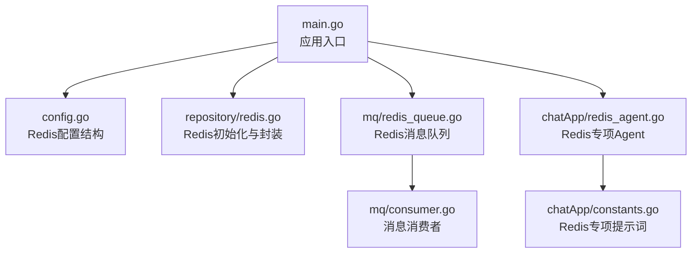
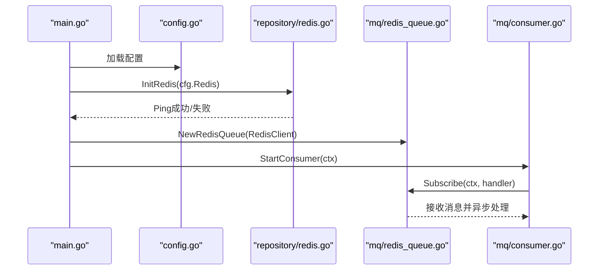
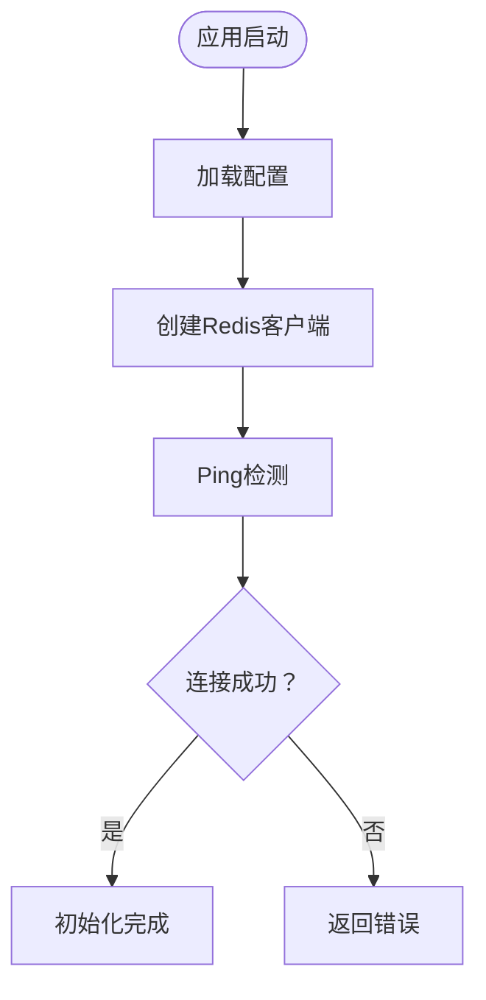
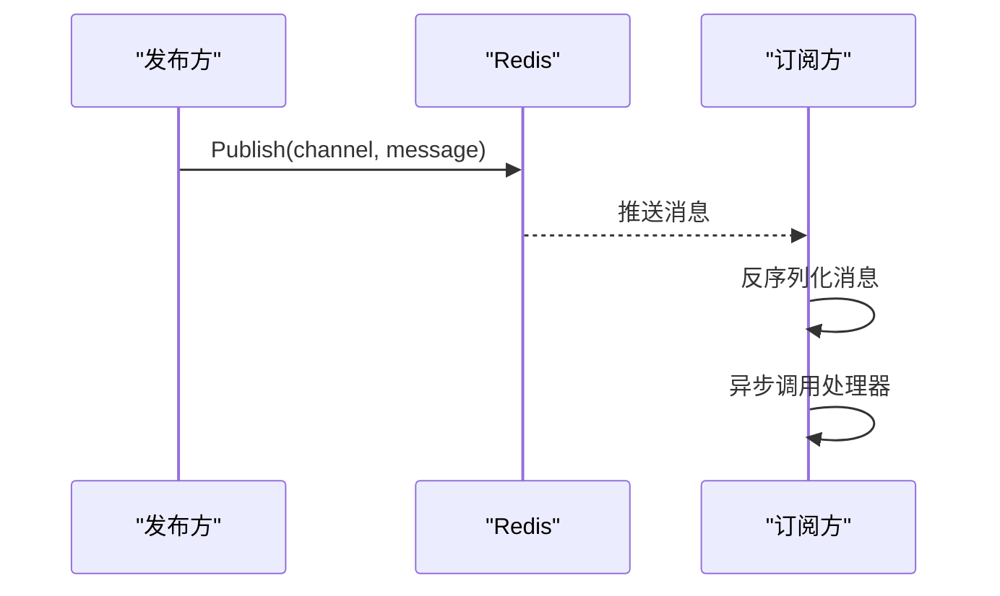
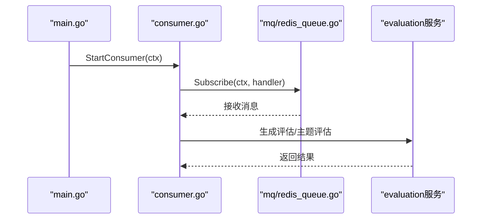
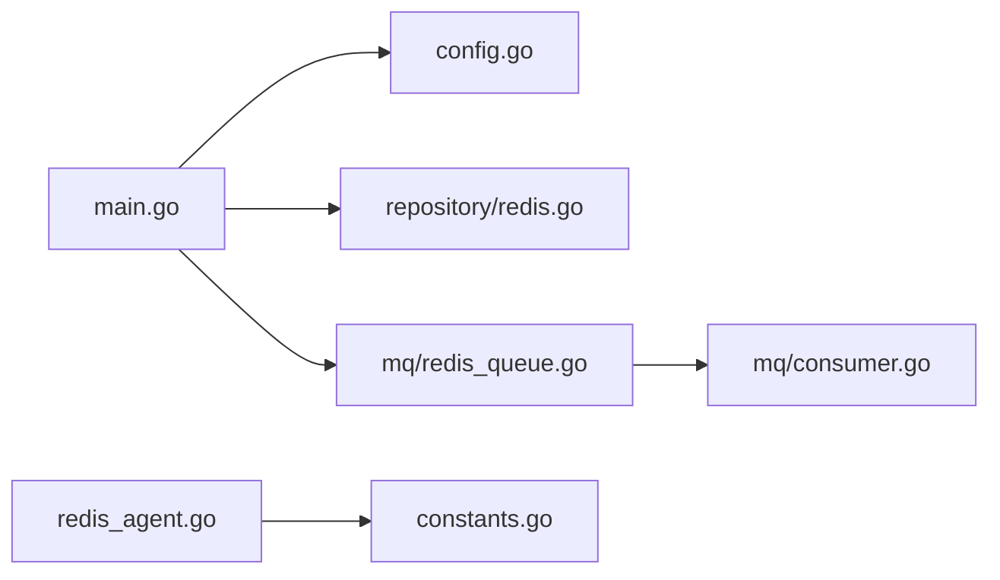

# Redis缓存设计

<cite>
**本文引用的文件**
- [backend/main.go](file://backend/main.go)
- [backend/internal/config/config.go](file://backend/internal/config/config.go)
- [backend/internal/repository/redis.go](file://backend/internal/repository/redis.go)
- [backend/internal/mq/mq.go](file://backend/internal/mq/mq.go)
- [backend/internal/mq/redis_queue.go](file://backend/internal/mq/redis_queue.go)
- [backend/internal/mq/consumer.go](file://backend/internal/mq/consumer.go)
- [backend/chatApp/agent/interview/specialized/redis_agent.go](file://backend/chatApp/agent/interview/specialized/redis_agent.go)
- [backend/chatApp/agent/interview/specialized/constants.go](file://backend/chatApp/agent/interview/specialized/constants.go)
- [doc/项目优化建议_性能安全篇.md](file://doc/项目优化建议_性能安全篇.md)
</cite>

## 目录
1. [简介](#简介)
2. [项目结构](#项目结构)
3. [核心组件](#核心组件)
4. [架构总览](#架构总览)
5. [组件详解](#组件详解)
6. [依赖关系分析](#依赖关系分析)
7. [性能考量](#性能考量)
8. [故障排查指南](#故障排查指南)
9. [结论](#结论)
10. [附录](#附录)

## 简介
本文件面向“面试吧”项目的Redis缓存与消息系统设计，围绕以下目标展开：连接配置与初始化、连接池管理、键值设计与命名规范、过期与内存管理、基于Redis的队列实现与发布订阅、异步任务处理、缓存一致性与失效策略、性能优化与三大风险（穿透、击穿、雪崩）防护，并给出可落地的配置示例与使用场景。

## 项目结构
与Redis相关的关键模块分布如下：
- 配置层：集中定义Redis配置项与环境变量展开逻辑
- 初始化层：在应用启动时完成Redis连接初始化与健康检查
- 仓储层：提供统一的Redis访问封装（Get/Set/Del）
- 消息队列层：基于Redis Pub/Sub实现异步消息传递
- 消费者层：订阅消息并触发业务处理流程
- 面试Agent层：针对Redis专项面试的提示词与Agent构建

图表来源
- [backend/main.go](file://backend/main.go#L58-L87)
- [backend/internal/config/config.go](file://backend/internal/config/config.go#L73-L83)
- [backend/internal/repository/redis.go](file://backend/internal/repository/redis.go#L16-L33)
- [backend/internal/mq/redis_queue.go](file://backend/internal/mq/redis_queue.go#L21-L30)
- [backend/internal/mq/consumer.go](file://backend/internal/mq/consumer.go#L89-L100)
- [backend/chatApp/agent/interview/specialized/redis_agent.go](file://backend/chatApp/agent/interview/specialized/redis_agent.go#L14-L47)
- [backend/chatApp/agent/interview/specialized/constants.go](file://backend/chatApp/agent/interview/specialized/constants.go#L199-L246)

章节来源
- [backend/main.go](file://backend/main.go#L58-L87)
- [backend/internal/config/config.go](file://backend/internal/config/config.go#L73-L83)
- [backend/internal/repository/redis.go](file://backend/internal/repository/redis.go#L16-L33)
- [backend/internal/mq/redis_queue.go](file://backend/internal/mq/redis_queue.go#L21-L30)
- [backend/internal/mq/consumer.go](file://backend/internal/mq/consumer.go#L89-L100)
- [backend/chatApp/agent/interview/specialized/redis_agent.go](file://backend/chatApp/agent/interview/specialized/redis_agent.go#L14-L47)
- [backend/chatApp/agent/interview/specialized/constants.go](file://backend/chatApp/agent/interview/specialized/constants.go#L199-L246)

## 核心组件
- Redis连接与初始化：在应用启动阶段完成连接建立与Ping健康检查，确保可用性
- Redis仓储封装：提供Get/Set/Del等常用操作，便于业务层复用
- Redis消息队列：以Pub/Sub为基础的消息通道，按消息类型路由到不同channel
- 消息消费者：订阅指定channel，反序列化消息后异步分发给处理器
- 面试Agent：面向Redis专项面试的提示词与Agent构建，覆盖缓存、持久化、集群、性能等主题

章节来源
- [backend/internal/repository/redis.go](file://backend/internal/repository/redis.go#L16-L53)
- [backend/internal/mq/redis_queue.go](file://backend/internal/mq/redis_queue.go#L13-L131)
- [backend/internal/mq/consumer.go](file://backend/internal/mq/consumer.go#L19-L100)
- [backend/chatApp/agent/interview/specialized/redis_agent.go](file://backend/chatApp/agent/interview/specialized/redis_agent.go#L14-L47)

## 架构总览
下图展示了应用启动、Redis初始化、消息队列与消费者的交互关系：

图表来源
- [backend/main.go](file://backend/main.go#L58-L87)
- [backend/internal/config/config.go](file://backend/internal/config/config.go#L73-L83)
- [backend/internal/repository/redis.go](file://backend/internal/repository/redis.go#L16-L33)
- [backend/internal/mq/redis_queue.go](file://backend/internal/mq/redis_queue.go#L58-L119)
- [backend/internal/mq/consumer.go](file://backend/internal/mq/consumer.go#L89-L100)

## 组件详解

### Redis连接配置与初始化
- 配置项：地址、密码、DB库、拨号/读写超时、连接池大小、最小空闲连接数
- 初始化流程：创建客户端、执行Ping、记录日志、返回结果
- 使用方式：全局单例客户端，供仓储层与消息队列共享

图表来源
- [backend/main.go](file://backend/main.go#L58-L64)
- [backend/internal/config/config.go](file://backend/internal/config/config.go#L73-L83)
- [backend/internal/repository/redis.go](file://backend/internal/repository/redis.go#L16-L33)

章节来源
- [backend/internal/config/config.go](file://backend/internal/config/config.go#L73-L83)
- [backend/internal/repository/redis.go](file://backend/internal/repository/redis.go#L16-L33)
- [backend/main.go](file://backend/main.go#L58-L64)

### 连接池管理
- 连接池参数：pool_size、min_idle_conns
- 建议：根据QPS与峰值并发设置pool_size；min_idle_conns保障热身，降低突发压力
- 注意：当前仓储封装未显式传入连接池参数，如需精细化控制可在初始化处补充

章节来源
- [backend/internal/config/config.go](file://backend/internal/config/config.go#L73-L83)
- [backend/internal/repository/redis.go](file://backend/internal/repository/redis.go#L16-L33)

### 键值设计策略与命名规范
- 命名规范：采用“业务域:实体类型:主键”的层级结构，例如“user:profile:{id}”
- 建议：对热点数据设置合理TTL；对长尾数据可设置更短TTL或禁用TTL配合淘汰策略
- 命名示例：参考文档中的用户键“user:{id}”，可扩展为“user:profile:{id}”、“user:session:{token}”

章节来源
- [doc/项目优化建议_性能安全篇.md](file://doc/项目优化建议_性能安全篇.md#L167-L189)

### 过期策略与内存管理
- TTL策略：按数据更新频率设定，高频数据短TTL，低频数据长TTL
- 内存管理：结合Redis淘汰策略（如LRU/LFU），对非关键数据启用TTL
- 建议：对会话类数据设置较短TTL并结合刷新；对静态模板类数据设置较长TTL

章节来源
- [doc/项目优化建议_性能安全篇.md](file://doc/项目优化建议_性能安全篇.md#L204-L212)

### 缓存一致性与失效策略
- Cache-Aside模式：读取走缓存，更新时删除缓存，避免脏读
- 失效策略：写操作后立即删除对应key；批量更新时采用批量删除
- 建议：对强一致需求的场景，可采用“先删缓存再写库”的策略，但需谨慎处理并发

章节来源
- [doc/项目优化建议_性能安全篇.md](file://doc/项目优化建议_性能安全篇.md#L114-L119)

### Redis队列实现与发布订阅
- 队列实现：基于Redis Pub/Sub，按消息类型动态路由到不同channel
- 发布流程：序列化消息，按“interview:messages:{type}”发布
- 订阅流程：订阅指定channel，反序列化消息后异步分发给注册的处理器
- 关闭流程：关闭done通道，停止接收新消息，不主动关闭Redis客户端

图表来源
- [backend/internal/mq/redis_queue.go](file://backend/internal/mq/redis_queue.go#L32-L56)
- [backend/internal/mq/redis_queue.go](file://backend/internal/mq/redis_queue.go#L58-L119)

章节来源
- [backend/internal/mq/redis_queue.go](file://backend/internal/mq/redis_queue.go#L13-L131)
- [backend/internal/mq/mq.go](file://backend/internal/mq/mq.go#L12-L48)

### 异步任务处理
- 消费者启动：在main中启动协程调用StartConsumer
- 消费流程：GetMessageQueue -> Subscribe -> 接收消息 -> 分发处理
- 处理器：根据消息类型路由到评估报告或主题评估生成流程

图表来源
- [backend/main.go](file://backend/main.go#L89-L99)
- [backend/internal/mq/consumer.go](file://backend/internal/mq/consumer.go#L89-L100)
- [backend/internal/mq/redis_queue.go](file://backend/internal/mq/redis_queue.go#L58-L119)

章节来源
- [backend/main.go](file://backend/main.go#L89-L99)
- [backend/internal/mq/consumer.go](file://backend/internal/mq/consumer.go#L19-L100)

### 面试Agent与Redis专项主题
- Agent构建：基于OpenAI模型与工具链构建Redis专项面试Agent
- 提示词覆盖：Redis数据结构、缓存三击防护、持久化、集群、监控与排障等
- 场景：用于面试官智能体对候选人的Redis专业能力进行深度评估

章节来源
- [backend/chatApp/agent/interview/specialized/redis_agent.go](file://backend/chatApp/agent/interview/specialized/redis_agent.go#L14-L47)
- [backend/chatApp/agent/interview/specialized/constants.go](file://backend/chatApp/agent/interview/specialized/constants.go#L199-L246)

## 依赖关系分析
- main依赖配置与仓储初始化Redis，随后初始化消息队列并启动消费者
- 仓储层提供统一的Redis访问封装，被业务层复用
- 消息队列依赖Redis客户端，消费者依赖消息队列接口

图表来源
- [backend/main.go](file://backend/main.go#L58-L87)
- [backend/internal/config/config.go](file://backend/internal/config/config.go#L73-L83)
- [backend/internal/repository/redis.go](file://backend/internal/repository/redis.go#L16-L33)
- [backend/internal/mq/redis_queue.go](file://backend/internal/mq/redis_queue.go#L21-L30)
- [backend/internal/mq/consumer.go](file://backend/internal/mq/consumer.go#L89-L100)
- [backend/chatApp/agent/interview/specialized/redis_agent.go](file://backend/chatApp/agent/interview/specialized/redis_agent.go#L14-L47)
- [backend/chatApp/agent/interview/specialized/constants.go](file://backend/chatApp/agent/interview/specialized/constants.go#L199-L246)

章节来源
- [backend/main.go](file://backend/main.go#L58-L87)
- [backend/internal/repository/redis.go](file://backend/internal/repository/redis.go#L16-L33)
- [backend/internal/mq/redis_queue.go](file://backend/internal/mq/redis_queue.go#L21-L30)
- [backend/internal/mq/consumer.go](file://backend/internal/mq/consumer.go#L89-L100)

## 性能考量
- 连接池：合理设置pool_size与min_idle_conns，避免连接争用与频繁建连
- TTL策略：热点数据短TTL，长尾数据长TTL，减少无效缓存占用
- 异步解耦：通过Redis Pub/Sub实现生产与消费解耦，提升吞吐
- 超时控制：为Redis操作设置合理的读写超时，避免阻塞
- 并发与限流：在业务层对上游请求做限流与熔断，保护下游Redis

[本节为通用指导，无需列出章节来源]

## 故障排查指南
- 连接失败：检查Redis地址、密码、DB库是否正确；查看Ping结果
- 订阅无消息：确认channel命名与订阅列表一致；检查Publish是否成功
- 消费异常：查看消费者日志与错误返回；确认消息反序列化与处理器逻辑
- 内存与性能：观察TTL命中率与淘汰事件；必要时调整淘汰策略与TTL

章节来源
- [backend/internal/repository/redis.go](file://backend/internal/repository/redis.go#L16-L33)
- [backend/internal/mq/redis_queue.go](file://backend/internal/mq/redis_queue.go#L58-L119)
- [backend/internal/mq/consumer.go](file://backend/internal/mq/consumer.go#L19-L100)

## 结论
本设计以“配置驱动+初始化即服务”的方式完成Redis连接与消息队列的集成，结合Cache-Aside与合理的TTL策略，兼顾性能与一致性。通过Redis Pub/Sub实现异步解耦，满足面试Agent与评估任务的高并发场景。建议后续在仓储层显式注入连接池参数，并完善缓存穿透、击穿、雪崩的工程化防护。

[本节为总结，无需列出章节来源]

## 附录

### Redis配置示例（YAML）
- 建议字段：addr、password、db、dial_timeout、read_timeout、write_timeout、pool_size、min_idle_conns
- 示例位置：参考配置结构定义与应用加载流程

章节来源
- [backend/internal/config/config.go](file://backend/internal/config/config.go#L73-L83)
- [backend/main.go](file://backend/main.go#L38-L48)

### 使用场景与键命名示例
- 用户信息：user:{id}
- 会话：user:session:{token}
- 评估报告：evaluation:report:{report_id}
- 主题评估：evaluation:topic:{report_id}

章节来源
- [doc/项目优化建议_性能安全篇.md](file://doc/项目优化建议_性能安全篇.md#L167-L189)

### 缓存三击防护（概念示意）
- 缓存穿透：对不存在的数据设置短期占位TTL，布隆过滤器前置校验
- 缓存击穿：热点key设置互斥锁或永不过期+后台异步刷新
- 缓存雪崩：TTL加抖动；多级缓存；降级与熔断

章节来源
- [doc/项目优化建议_性能安全篇.md](file://doc/项目优化建议_性能安全篇.md#L114-L119)