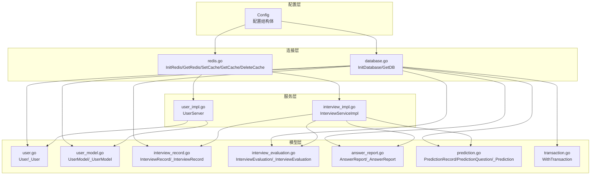
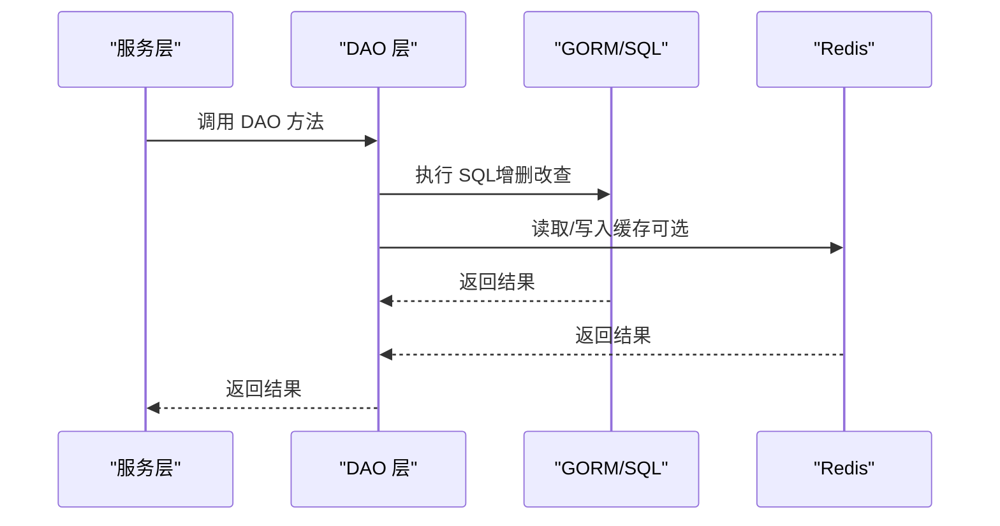
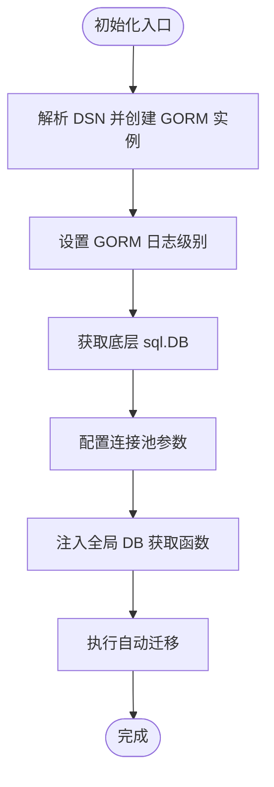
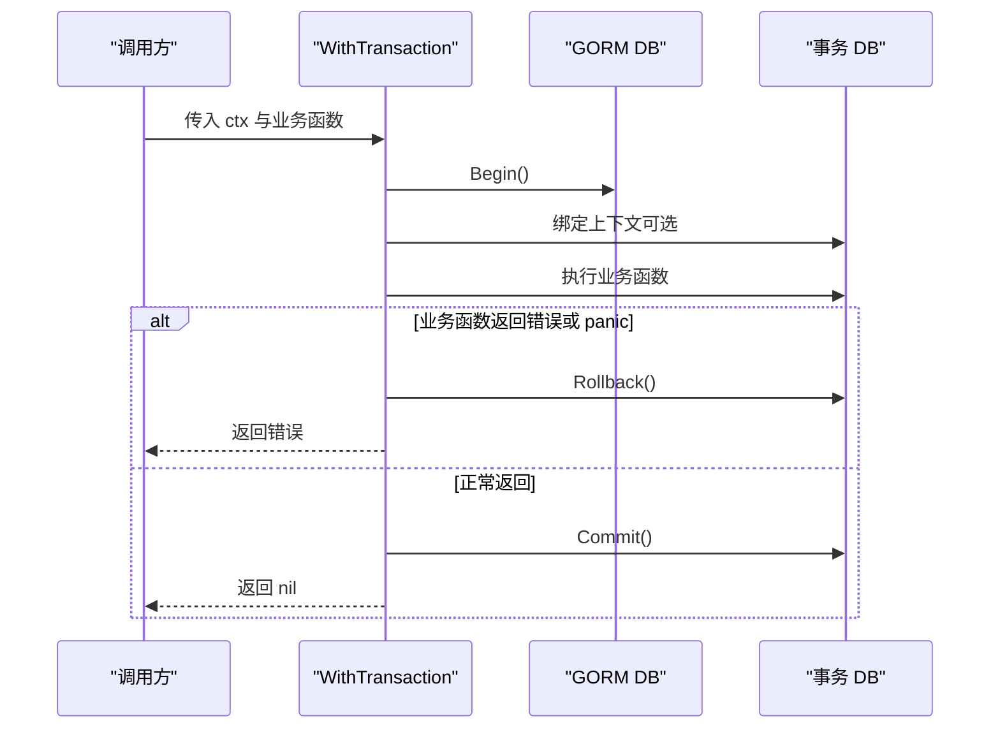
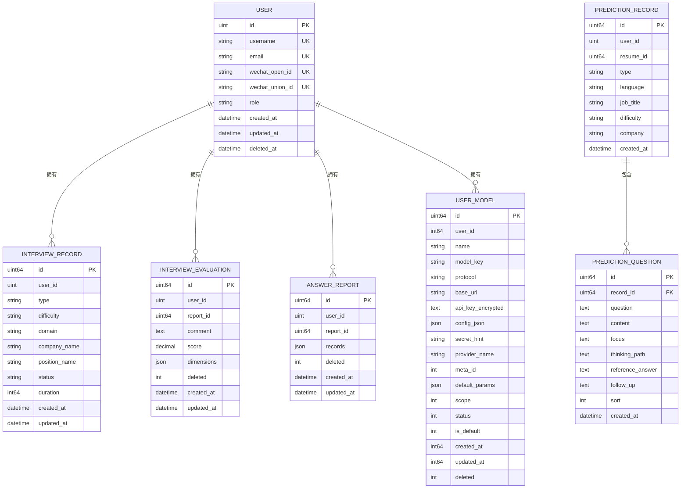
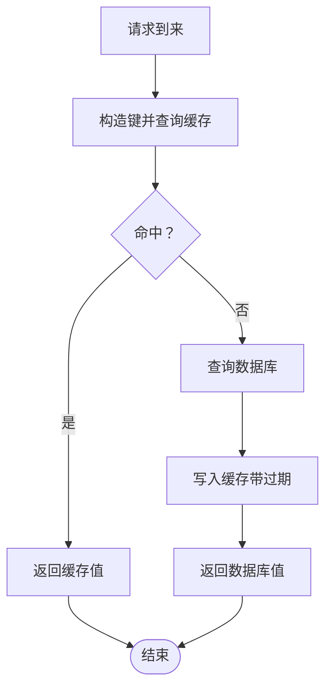
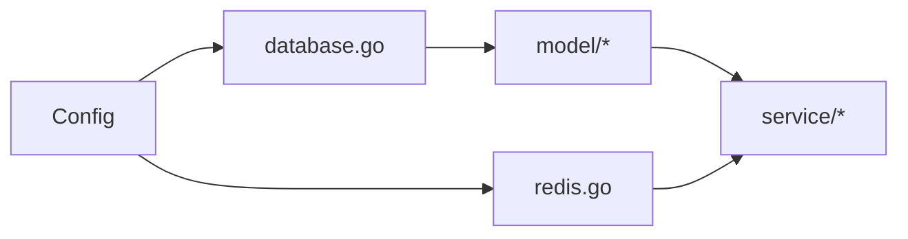

# 数据层设计

<cite>
**本文引用的文件**
- [backend/internal/repository/database.go](file://backend/internal/repository/database.go)
- [backend/internal/repository/redis.go](file://backend/internal/repository/redis.go)
- [backend/internal/config/config.go](file://backend/internal/config/config.go)
- [backend/internal/model/user.go](file://backend/internal/model/user.go)
- [backend/internal/model/user_model.go](file://backend/internal/model/user_model.go)
- [backend/internal/model/interview_record.go](file://backend/internal/model/interview_record.go)
- [backend/internal/model/interview_evaluation.go](file://backend/internal/model/interview_evaluation.go)
- [backend/internal/model/answer_report.go](file://backend/internal/model/answer_report.go)
- [backend/internal/model/prediction.go](file://backend/internal/model/prediction.go)
- [backend/internal/model/transaction.go](file://backend/internal/model/transaction.go)
- [backend/internal/service/user/impl/user_impl.go](file://backend/internal/service/user/impl/user_impl.go)
- [backend/internal/service/interviews/impl/interview_impl.go](file://backend/internal/service/interviews/impl/interview_impl.go)
- [backend/go.mod](file://backend/go.mod)
- [doc/项目优化建议_性能安全篇.md](file://doc/项目优化建议_性能安全篇.md)
</cite>

## 目录
1. [简介](#简介)
2. [项目结构](#项目结构)
3. [核心组件](#核心组件)
4. [架构总览](#架构总览)
5. [详细组件分析](#详细组件分析)
6. [依赖关系分析](#依赖关系分析)
7. [性能考量](#性能考量)
8. [故障排查指南](#故障排查指南)
9. [结论](#结论)
10. [附录](#附录)

## 简介
本文件面向面试吧数据层设计，围绕基于 GORM 的数据访问层进行系统化技术文档编制。内容涵盖数据库连接池配置、事务管理与连接复用、实体模型映射与关系约束、Redis 缓存策略与键值设计、数据迁移与版本管理、查询优化与索引设计、性能调优、数据安全与权限控制、审计日志等主题，并提供可落地的最佳实践与图示。

## 项目结构
数据层主要由以下模块构成：
- 配置层：集中管理数据库与 Redis 的配置项
- 连接层：初始化数据库与 Redis 连接，暴露全局实例
- 模型层：以 GORM 结构体定义实体与关系，提供 DAO 方法
- 事务层：统一的事务封装，保障一致性与健壮性
- 服务层：业务编排，调用 DAO 层完成数据持久化

图表来源
- [backend/internal/repository/database.go](file://backend/internal/repository/database.go#L18-L80)
- [backend/internal/repository/redis.go](file://backend/internal/repository/redis.go#L16-L53)
- [backend/internal/config/config.go](file://backend/internal/config/config.go#L64-L83)
- [backend/internal/model/user.go](file://backend/internal/model/user.go#L11-L116)
- [backend/internal/model/user_model.go](file://backend/internal/model/user_model.go#L28-L243)
- [backend/internal/model/interview_record.go](file://backend/internal/model/interview_record.go#L9-L128)
- [backend/internal/model/interview_evaluation.go](file://backend/internal/model/interview_evaluation.go#L9-L100)
- [backend/internal/model/answer_report.go](file://backend/internal/model/answer_report.go#L9-L121)
- [backend/internal/model/prediction.go](file://backend/internal/model/prediction.go#L11-L110)
- [backend/internal/model/transaction.go](file://backend/internal/model/transaction.go#L11-L58)
- [backend/internal/service/user/impl/user_impl.go](file://backend/internal/service/user/impl/user_impl.go#L34-L117)
- [backend/internal/service/interviews/impl/interview_impl.go](file://backend/internal/service/interviews/impl/interview_impl.go#L19-L133)

章节来源
- [backend/internal/repository/database.go](file://backend/internal/repository/database.go#L18-L80)
- [backend/internal/repository/redis.go](file://backend/internal/repository/redis.go#L16-L53)
- [backend/internal/config/config.go](file://backend/internal/config/config.go#L64-L83)

## 核心组件
- 数据库连接与迁移
  - 初始化 GORM 连接，配置日志级别与连接池参数
  - 自动迁移核心实体表
  - 提供全局 DB 获取函数，供模型层使用
- Redis 连接与缓存
  - 初始化 Redis 客户端并进行连通性测试
  - 提供 Set/Get/Del 通用缓存方法
- 模型与 DAO
  - 以结构体定义实体，使用标签声明主键、索引、约束与注释
  - DAO 层封装 CRUD 与复杂查询，统一通过全局 DB 获取函数执行
- 事务管理
  - WithTransaction 封装 Begin/Commit/Rollback，自动处理 panic
  - 支持上下文绑定与超时控制
- 服务编排
  - 服务层负责参数转换、业务规则与调用 DAO 层

章节来源
- [backend/internal/repository/database.go](file://backend/internal/repository/database.go#L18-L80)
- [backend/internal/repository/redis.go](file://backend/internal/repository/redis.go#L16-L53)
- [backend/internal/model/transaction.go](file://backend/internal/model/transaction.go#L11-L58)
- [backend/internal/service/user/impl/user_impl.go](file://backend/internal/service/user/impl/user_impl.go#L34-L117)
- [backend/internal/service/interviews/impl/interview_impl.go](file://backend/internal/service/interviews/impl/interview_impl.go#L19-L133)

## 架构总览
下图展示数据层整体交互：服务层通过 DAO 层访问数据库与 Redis，DAO 层依赖全局 DB 获取函数；配置层提供数据库与 Redis 的参数。

图表来源
- [backend/internal/service/user/impl/user_impl.go](file://backend/internal/service/user/impl/user_impl.go#L34-L117)
- [backend/internal/service/interviews/impl/interview_impl.go](file://backend/internal/service/interviews/impl/interview_impl.go#L19-L133)
- [backend/internal/model/user.go](file://backend/internal/model/user.go#L35-L115)
- [backend/internal/model/interview_record.go](file://backend/internal/model/interview_record.go#L33-L127)
- [backend/internal/repository/redis.go](file://backend/internal/repository/redis.go#L40-L53)

## 详细组件分析

### 数据库连接与迁移
- 连接初始化
  - 使用 DSN 配置连接 MySQL
  - 设置 GORM 日志级别为 Info
  - 获取底层 sql.DB 并配置最大空闲连接数、最大打开连接数、连接最大生命周期
- 自动迁移
  - 对用户、用户模型、面试记录、面试对话、面试评估、答题报告、押题记录与押题题目等表执行 AutoMigrate
- 全局 DB 注入
  - 通过 model.SetDBGetter 注入全局 DB 获取函数，DAO 层统一通过该函数获取连接

图表来源
- [backend/internal/repository/database.go](file://backend/internal/repository/database.go#L18-L80)

章节来源
- [backend/internal/repository/database.go](file://backend/internal/repository/database.go#L18-L80)

### 事务管理
- WithTransaction 提供统一事务入口
  - 支持绑定上下文
  - 自动 Begin/Commit/Rollback
  - panic 捕获与兜底回滚
  - 返回业务函数的错误，便于上层处理

图表来源
- [backend/internal/model/transaction.go](file://backend/internal/model/transaction.go#L11-L58)

章节来源
- [backend/internal/model/transaction.go](file://backend/internal/model/transaction.go#L11-L58)

### 实体模型与关系定义
- 用户模型 User
  - 主键、唯一索引（用户名、邮箱、微信 OpenID、UnionID）、默认角色、软删除索引
  - 提供按用户名/邮箱、邮箱、ID、微信 OpenID 查询与按 ID 更新
- 用户模型配置 UserModel
  - 表名 user_model，带索引与 JSON 字段
  - 支持分页查询、按 ID 获取、更新、软删除、设置默认模型、启用/禁用模型
  - 使用事务保证“先清零再设默认”的原子性
- 面试记录 InterviewRecord
  - 主键自增、用户索引、多字段注释、状态默认值
  - 支持创建、按 ID 查询、分页列表、按字段更新、删除
- 面试评估 InterviewEvaluation
  - JSON 存储评估维度，带多字段索引
  - 支持按 ID/报告 ID/用户+报告 ID 查询、更新、软删除、统计
- 答题报告 AnswerReport
  - JSON 存储答题记录与消息，带多字段索引
  - 支持按 ID/报告 ID/用户+报告 ID 查询、软删除、统计、列出
- 押题记录与题目 PredictionRecord/PredictionQuestion
  - 一对多关系，外键约束 CASCADE
  - 支持创建记录与批量创建题目、按 ID/用户查询、预加载题目并排序

图表来源
- [backend/internal/model/user.go](file://backend/internal/model/user.go#L11-L29)
- [backend/internal/model/user_model.go](file://backend/internal/model/user_model.go#L30-L52)
- [backend/internal/model/interview_record.go](file://backend/internal/model/interview_record.go#L9-L26)
- [backend/internal/model/interview_evaluation.go](file://backend/internal/model/interview_evaluation.go#L9-L23)
- [backend/internal/model/answer_report.go](file://backend/internal/model/answer_report.go#L9-L21)
- [backend/internal/model/prediction.go](file://backend/internal/model/prediction.go#L11-L47)

章节来源
- [backend/internal/model/user.go](file://backend/internal/model/user.go#L11-L116)
- [backend/internal/model/user_model.go](file://backend/internal/model/user_model.go#L28-L243)
- [backend/internal/model/interview_record.go](file://backend/internal/model/interview_record.go#L9-L128)
- [backend/internal/model/interview_evaluation.go](file://backend/internal/model/interview_evaluation.go#L9-L100)
- [backend/internal/model/answer_report.go](file://backend/internal/model/answer_report.go#L9-L121)
- [backend/internal/model/prediction.go](file://backend/internal/model/prediction.go#L11-L110)

### Redis 缓存策略与键值设计
- 连接初始化
  - 通过配置创建 Redis 客户端并 Ping 校验连通性
- 缓存接口
  - SetCache：设置键值与过期时间（秒）
  - GetCache：获取字符串值
  - DeleteCache：删除键
- 键值设计建议
  - 用户会话：user:session:{userID}
  - 配置/白名单：sys:cache:{key}
  - 短时验证码：sms:code:{phone}
  - 防刷令牌：rate_limit:{key}:{window}
- 过期策略
  - 会话类：基于 JWT 过期时间或滑动过期
  - 热点配置：短 TTL + 异步刷新
  - 验证码：一次性或短期 TTL
- 缓存命中流程
  - 读路径：先查缓存，命中则返回；未命中则查库并回填缓存
  - 写路径：先更新数据库，再删除缓存（Cache-Aside）

图表来源
- [backend/internal/repository/redis.go](file://backend/internal/repository/redis.go#L16-L53)

章节来源
- [backend/internal/repository/redis.go](file://backend/internal/repository/redis.go#L16-L53)

### 数据迁移与版本管理
- 自动迁移
  - 初始化时对核心实体表执行 AutoMigrate
  - 建议在生产环境采用显式迁移脚本替代 AutoMigrate，以获得更可控的变更历史
- 版本管理
  - 使用独立迁移工具（如 goose、sql-migrate）维护迁移版本号与回滚脚本
  - 迁移脚本应包含：DDL 变更、索引重建、数据补丁、回滚策略
- 回滚机制
  - 为每个迁移打上版本号，确保可逆
  - 对大表变更采用“影子表 + 切换”或“在线 DDL”策略

章节来源
- [backend/internal/repository/database.go](file://backend/internal/repository/database.go#L62-L75)

### 查询优化与索引设计
- 索引策略
  - 唯一索引：用户名、邮箱、微信 OpenID/UnionID
  - 普通索引：用户 ID、报告 ID、删除标记、时间字段
  - 联合索引：按查询条件组合，遵循最左前缀原则
- 预加载与批量查询
  - 使用 Preload/Joins 避免 N+1 查询
  - 批量查询返回映射，减少多次往返
- 分页与总数
  - 先 Count 再 Offset/Limit 查询，避免大偏移
- JSON 字段
  - 对 JSON 内容建立辅助索引或物化字段，提升查询效率

章节来源
- [doc/项目优化建议_性能安全篇.md](file://doc/项目优化建议_性能安全篇.md#L90-L111)
- [backend/internal/model/interview_evaluation.go](file://backend/internal/model/interview_evaluation.go#L14-L22)
- [backend/internal/model/answer_report.go](file://backend/internal/model/answer_report.go#L14-L20)
- [backend/internal/model/prediction.go](file://backend/internal/model/prediction.go#L21-L47)

### 性能监控与指标采集
- 连接池指标
  - 采集 open、idle、in_use 三类连接数，周期性上报
- 查询性能
  - 记录慢查询日志与耗时分布
  - 结合 APM 工具定位瓶颈

章节来源
- [doc/项目优化建议_性能安全篇.md](file://doc/项目优化建议_性能安全篇.md#L49-L88)

### 数据安全、权限控制与审计日志
- 数据安全
  - 敏感字段加密存储（如 API Key 加密）
  - 最小权限原则：数据库账号仅授予必要权限
- 权限控制
  - 服务层在 DAO 调用前进行鉴权与授权校验
  - 用户维度的软删除与可见性控制
- 审计日志
  - 关键操作（创建/更新/删除）记录操作人、时间、对象与变更前后值
  - 日志落盘与保留策略，满足合规要求

章节来源
- [backend/internal/model/user_model.go](file://backend/internal/model/user_model.go#L40-L41)
- [backend/internal/model/interview_evaluation.go](file://backend/internal/model/interview_evaluation.go#L18-L22)
- [backend/internal/model/answer_report.go](file://backend/internal/model/answer_report.go#L16-L20)

## 依赖关系分析
- 组件耦合
  - DAO 层依赖全局 DB 获取函数，降低对具体驱动的耦合
  - 服务层与 DAO 层通过接口/结构体解耦
- 外部依赖
  - GORM：ORM 操作与迁移
  - Redis：缓存与会话存储
  - YAML：配置解析

图表来源
- [backend/internal/config/config.go](file://backend/internal/config/config.go#L13-L31)
- [backend/internal/repository/database.go](file://backend/internal/repository/database.go#L18-L80)
- [backend/internal/repository/redis.go](file://backend/internal/repository/redis.go#L16-L53)

章节来源
- [backend/internal/config/config.go](file://backend/internal/config/config.go#L13-L31)
- [backend/internal/repository/database.go](file://backend/internal/repository/database.go#L18-L80)
- [backend/internal/repository/redis.go](file://backend/internal/repository/redis.go#L16-L53)

## 性能考量
- 连接池调优
  - MaxOpenConns 与 MaxIdleConns 根据 QPS 与并发峰值设定
  - ConnMaxLifetime 控制连接生命周期，避免长时间占用
- 事务批处理
  - 将多个写操作放入单个事务，减少往返与锁竞争
- 缓存策略
  - Cache-Aside + 合理 TTL，热点数据本地化
  - 写路径删除缓存，避免脏读
- 查询优化
  - 使用索引覆盖、避免 SELECT *
  - 分页查询避免 OFFSET 过大，必要时使用游标分页
- 监控与告警
  - 连接池指标、慢查询、错误率、延迟分布

章节来源
- [backend/internal/repository/database.go](file://backend/internal/repository/database.go#L31-L44)
- [doc/项目优化建议_性能安全篇.md](file://doc/项目优化建议_性能安全篇.md#L49-L111)

## 故障排查指南
- 数据库连接失败
  - 检查 DSN 格式与网络连通性
  - 查看连接池参数是否合理
- 迁移失败
  - 确认表结构兼容性与索引冲突
  - 生产环境建议使用显式迁移脚本
- 事务异常
  - 检查业务函数是否正确返回错误
  - 观察 WithTransaction 的日志输出
- 缓存不可用
  - 确认 Redis 地址、认证与网络
  - 检查键空间与过期策略

章节来源
- [backend/internal/repository/database.go](file://backend/internal/repository/database.go#L18-L80)
- [backend/internal/model/transaction.go](file://backend/internal/model/transaction.go#L11-L58)
- [backend/internal/repository/redis.go](file://backend/internal/repository/redis.go#L16-L53)

## 结论
本数据层设计以 GORM 为核心，结合统一的连接池配置、事务封装与 DAO 模式，实现了清晰的职责分离与良好的扩展性。配合 Redis 缓存与完善的索引策略，可在保证一致性的同时兼顾性能。建议在生产环境中引入显式迁移与监控体系，持续优化查询与缓存策略，强化数据安全与审计能力。

## 附录
- 依赖清单（摘自 go.mod）
  - gorm.io/gorm
  - gorm.io/driver/mysql
  - github.com/redis/go-redis/v9
  - gopkg.in/yaml.v3

章节来源
- [backend/go.mod](file://backend/go.mod)