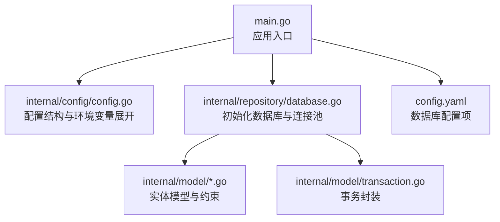
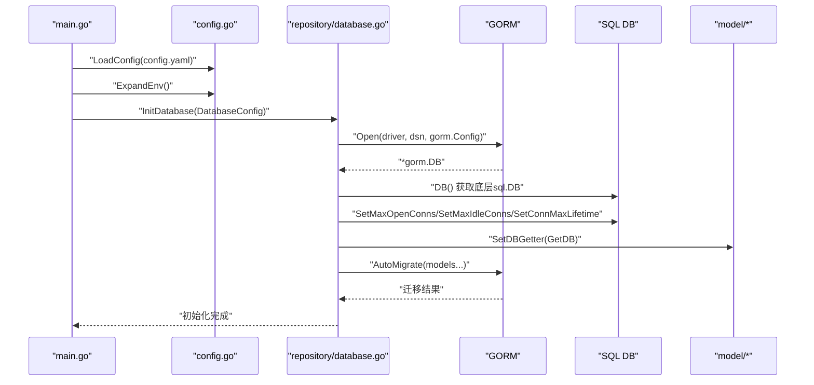
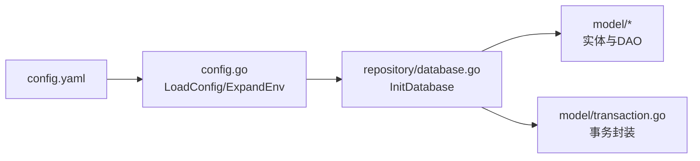

# 数据库设计

<cite>
**本文引用的文件**
- [backend/main.go](file://backend/main.go)
- [backend/config.yaml](file://backend/config.yaml)
- [backend/internal/config/config.go](file://backend/internal/config/config.go)
- [backend/internal/repository/database.go](file://backend/internal/repository/database.go)
- [backend/internal/model/transaction.go](file://backend/internal/model/transaction.go)
- [backend/internal/model/user.go](file://backend/internal/model/user.go)
- [backend/internal/model/interview_record.go](file://backend/internal/model/interview_record.go)
- [backend/internal/model/resume.go](file://backend/internal/model/resume.go)
- [backend/internal/model/answer_report.go](file://backend/internal/model/answer_report.go)
- [backend/internal/model/interview_dialogue.go](file://backend/internal/model/interview_dialogue.go)
- [backend/internal/model/interview_evaluation.go](file://backend/internal/model/interview_evaluation.go)
- [backend/internal/model/prediction.go](file://backend/internal/model/prediction.go)
- [backend/internal/model/user_model.go](file://backend/internal/model/user_model.go)
- [doc/项目优化建议_性能安全篇.md](file://doc/项目优化建议_性能安全篇.md)
</cite>

## 目录
1. [简介](#简介)
2. [项目结构](#项目结构)
3. [核心组件](#核心组件)
4. [架构总览](#架构总览)
5. [详细组件分析](#详细组件分析)
6. [依赖分析](#依赖分析)
7. [性能考虑](#性能考虑)
8. [故障排查指南](#故障排查指南)
9. [结论](#结论)
10. [附录](#附录)

## 简介
本文件面向面试吧数据库设计，围绕基于 GORM 的数据库连接池配置与初始化流程、实体模型映射关系与字段约束、自动迁移机制与表结构设计、索引优化策略、数据库配置参数与连接超时设置、性能调优、事务处理机制以及数据完整性保障进行系统化技术说明，并提供模型定义示例路径与最佳实践指导。

## 项目结构
数据库相关的核心位置集中在以下模块：
- 配置层：负责从 YAML 加载数据库配置并展开环境变量
- 初始化层：负责建立 GORM 连接、配置连接池、执行自动迁移
- 模型层：定义实体结构、标签约束、索引与关联关系
- 事务层：封装统一的事务执行模式，保证一致性与健壮性

图表来源
- [backend/main.go](file://backend/main.go#L29-L56)
- [backend/internal/config/config.go](file://backend/internal/config/config.go#L64-L71)
- [backend/internal/repository/database.go](file://backend/internal/repository/database.go#L18-L60)
- [backend/config.yaml](file://backend/config.yaml#L5-L11)

章节来源
- [backend/main.go](file://backend/main.go#L29-L56)
- [backend/config.yaml](file://backend/config.yaml#L5-L11)
- [backend/internal/config/config.go](file://backend/internal/config/config.go#L64-L71)

## 核心组件
- 数据库配置结构：包含驱动、DSN、最大连接数、空闲连接数、连接最大生命周期等
- 初始化流程：打开连接、设置 GORM 日志级别、配置连接池、设置全局 DB 实例、注入模型层 DB 获取器、执行自动迁移
- 模型层：采用结构体标签定义主键、索引、唯一索引、默认值、注释、时间精度等
- 事务层：提供 WithTransaction 封装，自动 Begin/Commit/Rollback，panic兜底回滚

章节来源
- [backend/internal/config/config.go](file://backend/internal/config/config.go#L64-L71)
- [backend/internal/repository/database.go](file://backend/internal/repository/database.go#L18-L60)
- [backend/internal/model/transaction.go](file://backend/internal/model/transaction.go#L11-L58)

## 架构总览
下面的序列图展示了应用启动时数据库初始化的关键步骤与调用链：

图表来源
- [backend/main.go](file://backend/main.go#L38-L56)
- [backend/internal/config/config.go](file://backend/internal/config/config.go#L136-L152)
- [backend/internal/repository/database.go](file://backend/internal/repository/database.go#L18-L60)

## 详细组件分析

### 数据库连接池配置与初始化
- 配置项
  - driver：数据库驱动（MySQL）
  - dsn：数据源名称
  - max_open_conns：最大打开连接数
  - max_idle_conns：最大空闲连接数
  - conn_max_lifetime：连接最大生命周期
- 初始化流程
  - 使用 gorm.Open 建立连接，设置 GORM 日志级别
  - 通过 DB() 获取底层 sql.DB，设置连接池参数
  - 注入全局 DB 实例与模型层 DB 获取器
  - 执行 AutoMigrate，一次性迁移全部模型

章节来源
- [backend/internal/repository/database.go](file://backend/internal/repository/database.go#L18-L60)
- [backend/config.yaml](file://backend/config.yaml#L5-L11)
- [backend/internal/config/config.go](file://backend/internal/config/config.go#L64-L71)

### 实体模型映射关系、字段定义与约束
- 用户模型（user）
  - 主键、唯一索引（用户名、邮箱、微信 OpenID、UnionID）、默认角色、软删除索引
  - 字段示例：用户名、邮箱、密码哈希、角色、微信相关字段、时间戳
  - 示例路径：[backend/internal/model/user.go](file://backend/internal/model/user.go#L12-L28)
- 面试记录（interview_record）
  - 主键自增、用户ID索引、多字段长度与默认值、时间精度为毫秒
  - 示例路径：[backend/internal/model/interview_record.go](file://backend/internal/model/interview_record.go#L10-L26)
- 简历（resume）
  - 主键自增、用户ID索引、软删除索引、长文本字段、默认值与排序
  - 示例路径：[backend/internal/model/resume.go](file://backend/internal/model/resume.go#L9-L25)
- 答题报告（answer_report）
  - JSON 字段序列化、多字段索引（用户ID、报告ID、删除标记）
  - 示例路径：[backend/internal/model/answer_report.go](file://backend/internal/model/answer_report.go#L9-L21)
- 面试对话（interview_dialogues）
  - 文本字段、索引（用户ID、报告ID），时间精度为毫秒
  - 示例路径：[backend/internal/model/interview_dialogue.go](file://backend/internal/model/interview_dialogue.go#L9-L22)
- 面试评估（interview_evaluation）
  - JSON 字段、多字段索引、金额精度 decimal
  - 示例路径：[backend/internal/model/interview_evaluation.go](file://backend/internal/model/interview_evaluation.go#L9-L23)
- 押题记录与题目（prediction_record/prediction_question）
  - 外键约束（CASCADE），预加载排序
  - 示例路径：[backend/internal/model/prediction.go](file://backend/internal/model/prediction.go#L11-L42)
- 用户模型（user_model）
  - JSON 配置字段、默认值、位掩码范围、软删除
  - 示例路径：[backend/internal/model/user_model.go](file://backend/internal/model/user_model.go#L30-L53)

章节来源
- [backend/internal/model/user.go](file://backend/internal/model/user.go#L12-L28)
- [backend/internal/model/interview_record.go](file://backend/internal/model/interview_record.go#L10-L26)
- [backend/internal/model/resume.go](file://backend/internal/model/resume.go#L9-L25)
- [backend/internal/model/answer_report.go](file://backend/internal/model/answer_report.go#L9-L21)
- [backend/internal/model/interview_dialogue.go](file://backend/internal/model/interview_dialogue.go#L9-L22)
- [backend/internal/model/interview_evaluation.go](file://backend/internal/model/interview_evaluation.go#L9-L23)
- [backend/internal/model/prediction.go](file://backend/internal/model/prediction.go#L11-L42)
- [backend/internal/model/user_model.go](file://backend/internal/model/user_model.go#L30-L53)

### 自动迁移机制与表结构设计
- 迁移入口
  - 在初始化完成后调用 migrateDatabase，对多个模型执行 AutoMigrate
- 表结构要点
  - 主键统一使用自增整型
  - 时间字段广泛采用毫秒级精度
  - JSON 字段用于复杂嵌套结构（答题记录、对话、评估维度、用户模型配置）
  - 外键关系通过标签声明（押题题目与记录）
- 索引策略
  - 常见查询字段建立索引（用户ID、报告ID、删除标记、软删除）
  - 唯一索引用于去重（用户名、邮箱、微信 OpenID/UnionID）

章节来源
- [backend/internal/repository/database.go](file://backend/internal/repository/database.go#L62-L75)
- [backend/internal/model/answer_report.go](file://backend/internal/model/answer_report.go#L14-L17)
- [backend/internal/model/interview_dialogue.go](file://backend/internal/model/interview_dialogue.go#L16-L17)
- [backend/internal/model/interview_evaluation.go](file://backend/internal/model/interview_evaluation.go#L14-L19)
- [backend/internal/model/prediction.go](file://backend/internal/model/prediction.go#L21-L21)

### 索引优化策略
- 唯一性约束
  - 用户名、邮箱、微信 OpenID/UnionID 唯一索引，避免重复
- 范围查询与排序
  - 用户ID、报告ID作为过滤条件，配合索引提升查询效率
  - 软删除字段建立独立索引，便于快速筛选有效记录
- JSON 字段访问
  - 对 JSON 字段的过滤建议结合业务场景评估是否需要额外索引或重构为关系表

章节来源
- [backend/internal/model/user.go](file://backend/internal/model/user.go#L17-L22)
- [backend/internal/model/answer_report.go](file://backend/internal/model/answer_report.go#L14-L17)
- [backend/internal/model/interview_dialogue.go](file://backend/internal/model/interview_dialogue.go#L16-L17)
- [backend/internal/model/interview_evaluation.go](file://backend/internal/model/interview_evaluation.go#L14-L19)
- [backend/internal/model/resume.go](file://backend/internal/model/resume.go#L21-L21)

### 数据库配置参数与连接超时设置
- 配置项
  - driver、dsn、max_open_conns、max_idle_conns、conn_max_lifetime
- 连接超时
  - MySQL 连接字符串中包含 parseTime、loc 等参数，确保时间解析正确
- 连接池
  - 通过 sql.DB.SetMaxOpenConns/SetMaxIdleConns/SetConnMaxLifetime 控制并发与生命周期

章节来源
- [backend/config.yaml](file://backend/config.yaml#L5-L11)
- [backend/internal/config/config.go](file://backend/internal/config/config.go#L64-L71)
- [backend/internal/repository/database.go](file://backend/internal/repository/database.go#L37-L44)

### 性能调优与监控建议
- 连接池参数建议
  - max_open_conns：根据并发峰值与数据库承载能力设定
  - max_idle_conns：维持一定空闲连接以降低握手开销
  - conn_max_lifetime：避免长时间连接导致的资源泄漏与网络波动影响
- 查询优化
  - 避免 N+1 查询，优先使用批量查询或 GORM 预加载
- 监控指标
  - 可采集 OpenConnections、Idle、InUse 等指标，周期性上报

章节来源
- [doc/项目优化建议_性能安全篇.md](file://doc/项目优化建议_性能安全篇.md#L49-L111)

### 事务处理机制
- WithTransaction
  - 自动 Begin/Commit/Rollback
  - panic 兜底回滚并继续抛出
  - 支持绑定 context 到事务上下文
- 业务事务
  - 模型层也提供了部分业务事务示例（如用户模型默认状态切换）

章节来源
- [backend/internal/model/transaction.go](file://backend/internal/model/transaction.go#L11-L58)
- [backend/internal/model/user_model.go](file://backend/internal/model/user_model.go#L145-L173)

### 数据完整性与外键关系
- 外键关系
  - 押题题目与记录之间通过标签声明 CASCADE 删除与更新
- 软删除
  - 多处模型引入 deleted 字段与索引，支持软删除与恢复
- 唯一约束
  - 用户唯一索引（用户名、邮箱、微信 OpenID/UnionID）避免重复

章节来源
- [backend/internal/model/prediction.go](file://backend/internal/model/prediction.go#L21-L21)
- [backend/internal/model/answer_report.go](file://backend/internal/model/answer_report.go#L17-L17)
- [backend/internal/model/interview_evaluation.go](file://backend/internal/model/interview_evaluation.go#L19-L19)
- [backend/internal/model/user.go](file://backend/internal/model/user.go#L17-L22)

## 依赖分析
- 配置加载与展开
  - main.go 加载 config.yaml，展开环境变量后传入初始化流程
- 初始化依赖
  - repository/database.go 依赖 internal/config 的 DatabaseConfig 结构
  - 初始化完成后注入 model 包的 DB 获取器，供各 DAO 使用
- 模型依赖
  - 各 model.* 依赖 gorm 标签与 model.SetDBGetter 提供的 DB 实例

图表来源
- [backend/main.go](file://backend/main.go#L38-L56)
- [backend/internal/config/config.go](file://backend/internal/config/config.go#L136-L152)
- [backend/internal/repository/database.go](file://backend/internal/repository/database.go#L18-L60)

章节来源
- [backend/main.go](file://backend/main.go#L38-L56)
- [backend/internal/config/config.go](file://backend/internal/config/config.go#L136-L152)
- [backend/internal/repository/database.go](file://backend/internal/repository/database.go#L18-L60)

## 性能考虑
- 连接池参数
  - 合理设置 max_open_conns 与 max_idle_conns，避免过高导致数据库压力过大，过低导致排队
  - conn_max_lifetime 需要平衡连接复用与稳定性
- 查询优化
  - 使用索引覆盖常见过滤字段（用户ID、报告ID、删除标记）
  - 避免 N+1 查询，优先批量查询或预加载
- 监控与告警
  - 上报连接池指标（Open、Idle、InUse），结合业务峰值动态调整

章节来源
- [doc/项目优化建议_性能安全篇.md](file://doc/项目优化建议_性能安全篇.md#L49-L111)

## 故障排查指南
- 初始化失败
  - 检查 DSN 是否正确、数据库可达、账号权限
  - 查看连接池参数是否合理
- 迁移异常
  - 确认 AutoMigrate 调用是否包含目标模型
  - 检查字段标签与约束是否冲突
- 事务回滚
  - 使用 WithTransaction 统一封装，关注 panic 兜底回滚日志
  - 业务事务中注意先回滚再返回错误

章节来源
- [backend/internal/repository/database.go](file://backend/internal/repository/database.go#L18-L60)
- [backend/internal/model/transaction.go](file://backend/internal/model/transaction.go#L11-L58)

## 结论
本设计以 GORM 为核心，通过清晰的配置结构、完善的连接池参数、严格的模型约束与索引策略、统一的事务封装，构建了稳定可扩展的数据库层。建议在生产环境中持续监控连接池与查询性能，结合业务增长动态调优参数，并逐步完善 JSON 字段的索引与访问模式。

## 附录
- 配置文件示例路径：[backend/config.yaml](file://backend/config.yaml#L5-L11)
- 初始化入口路径：[backend/main.go](file://backend/main.go#L50-L56)
- 模型定义示例路径（任选其一）：
  - 用户模型：[backend/internal/model/user.go](file://backend/internal/model/user.go#L12-L28)
  - 面试记录：[backend/internal/model/interview_record.go](file://backend/internal/model/interview_record.go#L10-L26)
  - 简历：[backend/internal/model/resume.go](file://backend/internal/model/resume.go#L9-L25)
  - 答题报告：[backend/internal/model/answer_report.go](file://backend/internal/model/answer_report.go#L9-L21)
  - 面试对话：[backend/internal/model/interview_dialogue.go](file://backend/internal/model/interview_dialogue.go#L9-L22)
  - 面试评估：[backend/internal/model/interview_evaluation.go](file://backend/internal/model/interview_evaluation.go#L9-L23)
  - 押题记录/题目：[backend/internal/model/prediction.go](file://backend/internal/model/prediction.go#L11-L42)
  - 用户模型：[backend/internal/model/user_model.go](file://backend/internal/model/user_model.go#L30-L53)