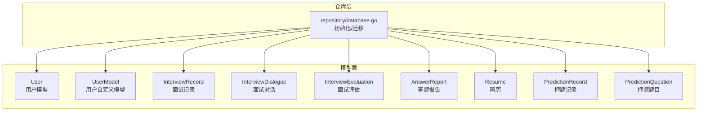
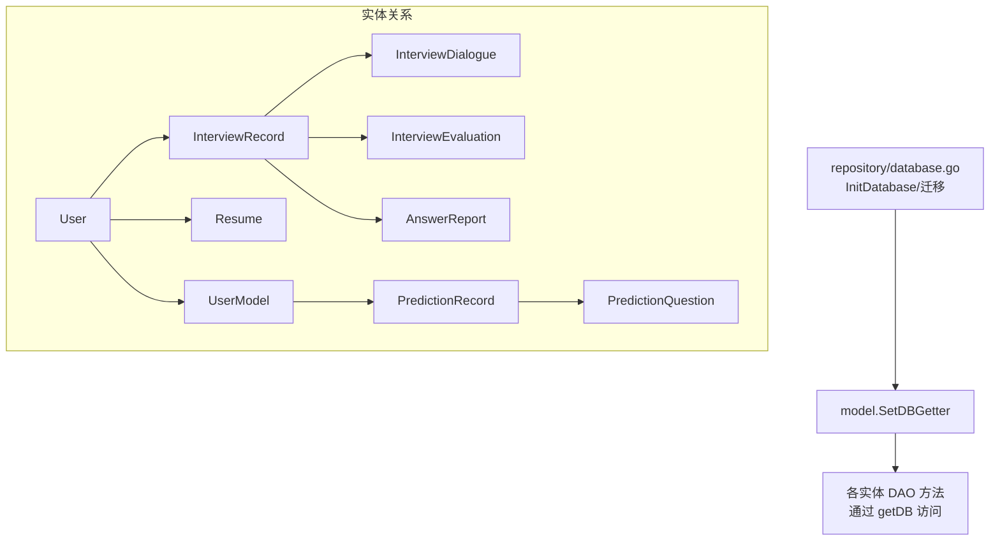
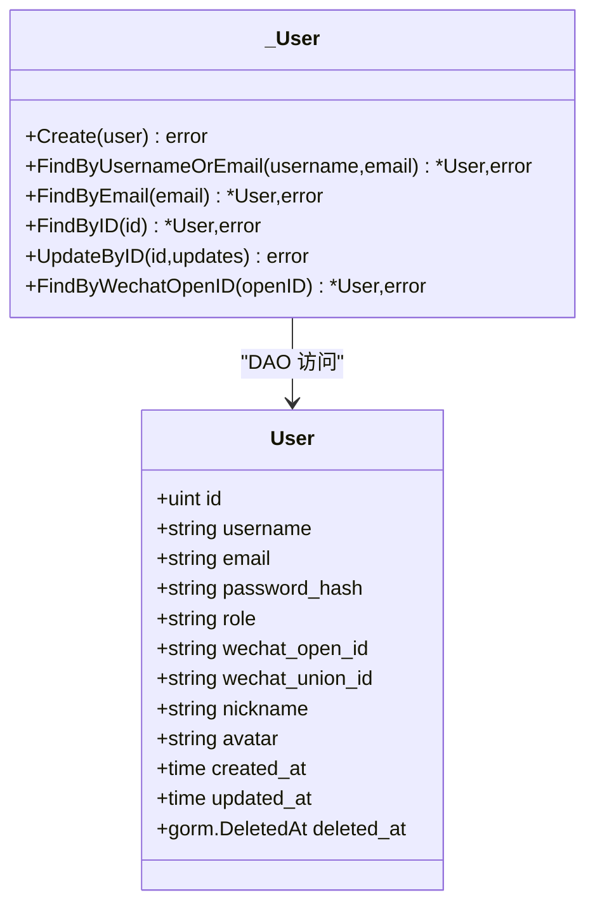
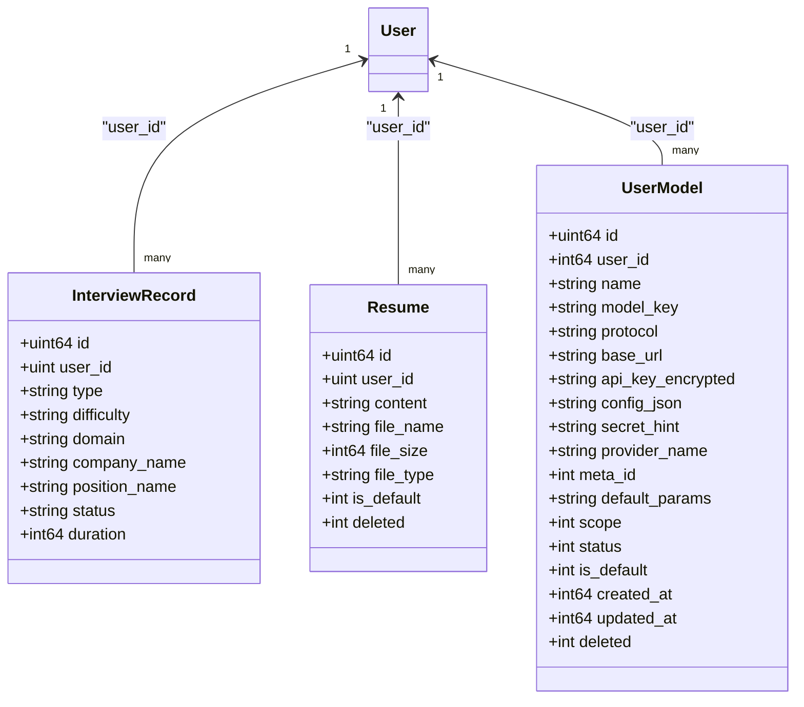
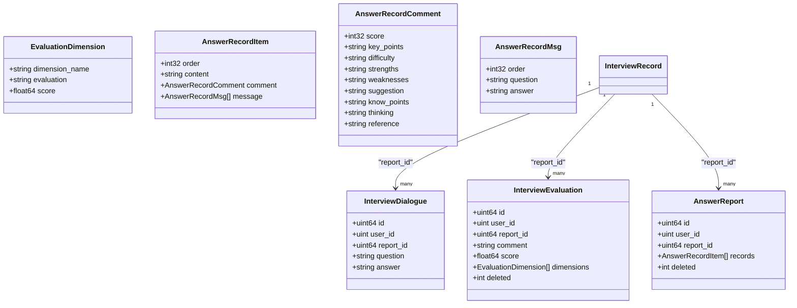
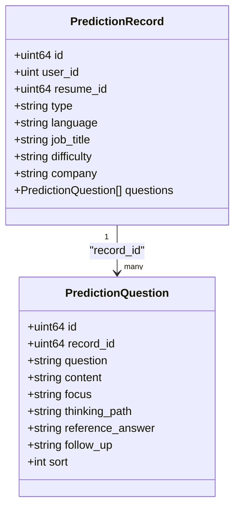
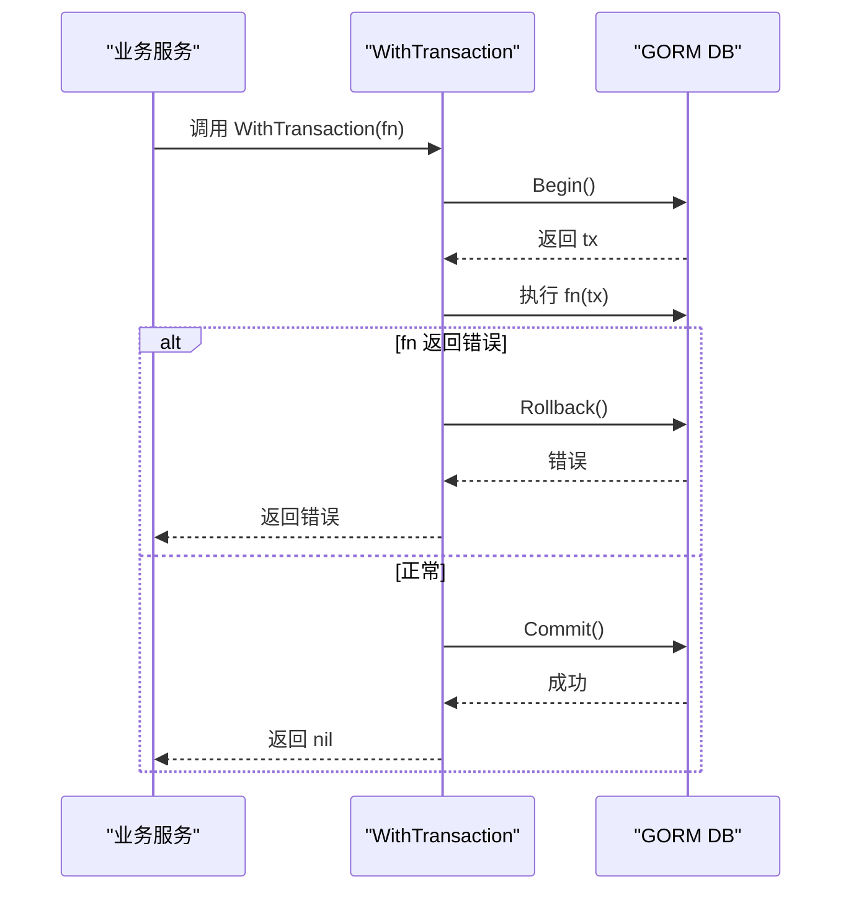
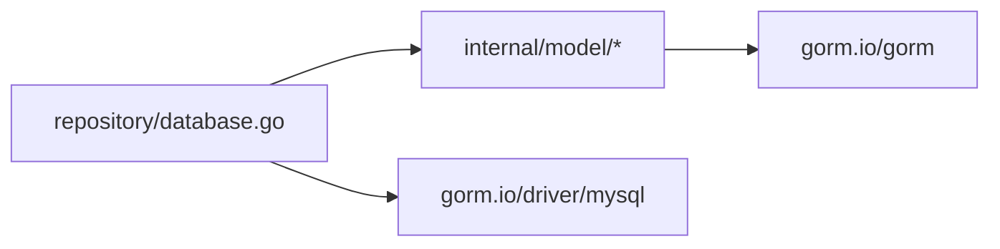

# 数据模型映射

<cite>
**本文引用的文件**   
- [backend/internal/model/user.go](file://backend/internal/model/user.go)
- [backend/internal/model/interview_record.go](file://backend/internal/model/interview_record.go)
- [backend/internal/model/interview_evaluation.go](file://backend/internal/model/interview_evaluation.go)
- [backend/internal/model/answer_report.go](file://backend/internal/model/answer_report.go)
- [backend/internal/model/resume.go](file://backend/internal/model/resume.go)
- [backend/internal/model/prediction.go](file://backend/internal/model/prediction.go)
- [backend/internal/model/interview_dialogue.go](file://backend/internal/model/interview_dialogue.go)
- [backend/internal/model/user_model.go](file://backend/internal/model/user_model.go)
- [backend/internal/model/transaction.go](file://backend/internal/model/transaction.go)
- [backend/internal/repository/database.go](file://backend/internal/repository/database.go)
</cite>

## 目录
1. [简介](#简介)
2. [项目结构](#项目结构)
3. [核心组件](#核心组件)
4. [架构总览](#架构总览)
5. [详细组件分析](#详细组件分析)
6. [依赖分析](#依赖分析)
7. [性能考虑](#性能考虑)
8. [故障排查指南](#故障排查指南)
9. [结论](#结论)
10. [附录](#附录)

## 简介
本技术文档围绕“面试吧”平台的数据模型映射展开，系统性阐述 GORM 模型标签、字段类型映射、实体关系设计（一对一、一对多、多对多）、模型验证与生命周期、钩子与事务管理、序列化与 JSON 处理、查询优化、版本迁移与备份恢复策略。文档面向不同层次读者，既提供高层概览，也给出可操作的实现细节与最佳实践。

## 项目结构
模型层位于 backend/internal/model，采用按实体分文件的组织方式，每个实体对应一个 Go 结构体及 DAO 访问器。仓库层 backend/internal/repository 负责数据库初始化、连接池配置与自动迁移。模型层通过 SetDBGetter 注入数据库实例，DAO 方法统一通过全局 getDB 访问数据库，保证一致性与可测试性。

图表来源
- [backend/internal/repository/database.go](file://backend/internal/repository/database.go#L62-L75)
- [backend/internal/model/user.go](file://backend/internal/model/user.go#L11-L29)
- [backend/internal/model/user_model.go](file://backend/internal/model/user_model.go#L30-L53)
- [backend/internal/model/interview_record.go](file://backend/internal/model/interview_record.go#L9-L26)
- [backend/internal/model/interview_dialogue.go](file://backend/internal/model/interview_dialogue.go#L9-L22)
- [backend/internal/model/interview_evaluation.go](file://backend/internal/model/interview_evaluation.go#L9-L23)
- [backend/internal/model/answer_report.go](file://backend/internal/model/answer_report.go#L9-L21)
- [backend/internal/model/resume.go](file://backend/internal/model/resume.go#L9-L25)
- [backend/internal/model/prediction.go](file://backend/internal/model/prediction.go#L11-L23)

章节来源
- [backend/internal/repository/database.go](file://backend/internal/repository/database.go#L18-L80)

## 核心组件
- 数据库注入与初始化：仓库层在启动时建立数据库连接、配置连接池，并调用 AutoMigrate 完成表结构迁移；随后通过 SetDBGetter 将 GetDB 注入模型层，DAO 方法统一通过全局 getDB 访问数据库。
- 模型 DAO：每个实体均提供结构体与 DAO 访问器，包含创建、查询、更新、删除、分页统计等方法，部分实体支持软删除与默认项设置。
- 事务封装：提供 WithTransaction 工具函数，自动 Begin/Commit/Rollback，并兜底处理 panic，简化业务层事务控制。
- 关系映射：通过 GORM 标签定义外键、索引、预加载与级联约束，形成清晰的一对多关系（如 PredictionRecord 与 PredictionQuestion）。

章节来源
- [backend/internal/repository/database.go](file://backend/internal/repository/database.go#L18-L80)
- [backend/internal/model/transaction.go](file://backend/internal/model/transaction.go#L11-L59)

## 架构总览
下图展示模型层与仓库层的交互，以及主要实体之间的关系映射。

图表来源
- [backend/internal/repository/database.go](file://backend/internal/repository/database.go#L49-L75)
- [backend/internal/model/prediction.go](file://backend/internal/model/prediction.go#L21-L23)
- [backend/internal/model/interview_record.go](file://backend/internal/model/interview_record.go#L14-L21)

## 详细组件分析

### 用户模型 User
- 字段与标签要点
  - 主键、唯一索引、长度限制、非空约束、索引等通过标签声明，便于数据库层面约束与查询优化。
  - DeletedAt 支持软删除索引。
- 序列化
  - JSON 标签用于对外序列化；敏感字段（如密码哈希）使用不导出字段或忽略序列化。
- DAO 方法
  - 提供按用户名/邮箱、邮箱、ID、微信 OpenID 等多种条件查询，以及按 ID 更新字段。

图表来源
- [backend/internal/model/user.go](file://backend/internal/model/user.go#L11-L29)

章节来源
- [backend/internal/model/user.go](file://backend/internal/model/user.go#L11-L116)

### 用户模型 User、面试记录 InterviewRecord、简历 Resume
- 关系设计
  - 一对一/多对一：User 与 InterviewRecord、User 与 Resume、User 与 UserModel 均通过 UserID 字段建立关联。
  - 一对多：InterviewRecord 与 InterviewDialogue、InterviewRecord 与 InterviewEvaluation、InterviewRecord 与 AnswerReport。
- 查询优化
  - 使用索引字段（如 user_id、report_id）进行过滤与排序。
  - 分页查询结合 Count 与 Offset/Limit，避免全表扫描。

图表来源
- [backend/internal/model/user.go](file://backend/internal/model/user.go#L15-L28)
- [backend/internal/model/interview_record.go](file://backend/internal/model/interview_record.go#L13-L25)
- [backend/internal/model/resume.go](file://backend/internal/model/resume.go#L13-L24)
- [backend/internal/model/user_model.go](file://backend/internal/model/user_model.go#L33-L52)

章节来源
- [backend/internal/model/interview_record.go](file://backend/internal/model/interview_record.go#L57-L81)
- [backend/internal/model/resume.go](file://backend/internal/model/resume.go#L56-L100)
- [backend/internal/model/user_model.go](file://backend/internal/model/user_model.go#L72-L143)

### 面试对话 InterviewDialogue、面试评估 InterviewEvaluation、答题报告 AnswerReport
- JSON 字段与序列化
  - InterviewEvaluation 的 Dimensions、AnswerReport 的 Records/Message/Comment 等使用 JSON 类型与 serializer:json 标签，配合结构体内嵌实现复杂对象序列化。
- 软删除与统计
  - 通过 deleted 字段实现软删除；提供按 report_id 的统计接口，便于聚合查询。
- 查询路径
  - 按用户与报告 ID 过滤，支持按主键升序排列，保证对话顺序与稳定性。

图表来源
- [backend/internal/model/interview_dialogue.go](file://backend/internal/model/interview_dialogue.go#L14-L21)
- [backend/internal/model/interview_evaluation.go](file://backend/internal/model/interview_evaluation.go#L12-L22)
- [backend/internal/model/answer_report.go](file://backend/internal/model/answer_report.go#L12-L21)

章节来源
- [backend/internal/model/interview_evaluation.go](file://backend/internal/model/interview_evaluation.go#L25-L100)
- [backend/internal/model/answer_report.go](file://backend/internal/model/answer_report.go#L23-L121)

### 押题记录与题目 PredictionRecord/PredictionQuestion
- 关系设计
  - 一对多：PredictionRecord 与 PredictionQuestion 通过 RecordID 建立外键关系，并定义 CASCADE 级联更新与删除，保证数据一致性。
- 预加载与排序
  - 查询时通过 Preload 预加载 Questions，并按 sort 字段升序排列，确保题目顺序稳定。
- DAO 方法
  - 提供按用户 ID 列表查询、按 ID 查询、批量创建题目等方法。

图表来源
- [backend/internal/model/prediction.go](file://backend/internal/model/prediction.go#L11-L47)

章节来源
- [backend/internal/model/prediction.go](file://backend/internal/model/prediction.go#L51-L110)

### 事务与生命周期
- 事务封装
  - WithTransaction 提供统一的事务入口，自动 Begin/Commit/Rollback，并对 panic 进行兜底处理，简化业务层事务控制。
- 生命周期与钩子
  - 模型层未显式定义 GORM 钩子（如 BeforeCreate/AfterSave），但通过 DAO 层统一处理软删除、默认项切换、分页统计等逻辑，保持一致的生命周期行为。

图表来源
- [backend/internal/model/transaction.go](file://backend/internal/model/transaction.go#L14-L58)

章节来源
- [backend/internal/model/transaction.go](file://backend/internal/model/transaction.go#L11-L59)

## 依赖分析
- 模块耦合
  - 模型层仅依赖 GORM 接口与内部错误包装，DAO 方法通过全局 getDB 访问数据库，降低外部依赖耦合。
  - 仓库层负责数据库初始化与迁移，集中管理连接池与迁移清单，避免分散配置。
- 外部依赖
  - GORM MySQL 驱动，用于连接与迁移。
- 潜在循环依赖
  - 模型层之间无直接导入循环；DAO 方法通过全局函数访问数据库，避免循环引用。

图表来源
- [backend/internal/repository/database.go](file://backend/internal/repository/database.go#L10-L12)
- [backend/internal/model/user.go](file://backend/internal/model/user.go#L6)

章节来源
- [backend/internal/repository/database.go](file://backend/internal/repository/database.go#L18-L80)

## 性能考虑
- 索引与查询
  - 在高频过滤字段（如 user_id、report_id、deleted）上建立索引，减少查询成本。
  - 使用 Count + Offset/Limit 实现分页，避免一次性加载大量数据。
- JSON 字段
  - JSON 字段适合存储半结构化数据，但不建议在 JSON 内频繁做复杂查询；必要时可拆分或增加冗余字段。
- 预加载与 N+1
  - 对于一对多关系（如预测记录与题目），使用 Preload 预加载并按排序字段排序，避免 N+1 查询。
- 连接池
  - 合理配置最大空闲连接数、最大打开连接数与连接最大存活时间，提升并发吞吐与资源利用率。

## 故障排查指南
- 数据库未初始化
  - 现象：DAO 方法报错提示 getDB 未初始化。
  - 处理：确保仓库层 InitDatabase 已调用 SetDBGetter，并在应用启动阶段完成初始化。
- 事务异常
  - 现象：panic 或 fn 返回错误导致回滚失败。
  - 处理：检查 WithTransaction 的使用，确保业务逻辑返回 error；查看日志输出定位具体错误。
- 软删除与默认项
  - 现象：更新默认项或删除记录后状态异常。
  - 处理：核对 DAO 方法（如 SetDefaultUserModel、DeleteAnswerReport）的事务与条件判断，确保先清空再设置。
- 迁移失败
  - 现象：AutoMigrate 报错或表结构不一致。
  - 处理：检查迁移清单与字段标签，确保类型与约束匹配；必要时手动执行迁移脚本或回滚重试。

章节来源
- [backend/internal/model/transaction.go](file://backend/internal/model/transaction.go#L33-L41)
- [backend/internal/model/user_model.go](file://backend/internal/model/user_model.go#L145-L173)
- [backend/internal/model/answer_report.go](file://backend/internal/model/answer_report.go#L94-L100)
- [backend/internal/repository/database.go](file://backend/internal/repository/database.go#L62-L75)

## 结论
本项目通过清晰的模型分层、统一的 DAO 访问与事务封装，实现了稳定的数据模型映射与关系设计。借助 GORM 标签与预加载机制，兼顾了灵活性与性能。建议在后续演进中持续完善索引策略、监控慢查询、补充必要的钩子与校验逻辑，并完善迁移与备份恢复流程。

## 附录

### 字段类型映射与标签要点
- 数值类型
  - 整型：uint、uint64、int、int32、int64；用于主键、外键、排序与计数。
- 文本类型
  - string：VARCHAR/TEXT，配合 size、type:longtext、type:text 等标签。
- 时间类型
  - time.Time：配合 autoCreateTime、autoUpdateTime、autoCreateTime:milli、autoUpdateTime:milli 控制时间精度。
- JSON 类型
  - type:json + serializer:json：用于存储结构化对象（如评估维度、答题记录）。
- 约束与索引
  - primaryKey、uniqueIndex、index、default、not null、comment 等标签明确约束与注释。

章节来源
- [backend/internal/model/interview_evaluation.go](file://backend/internal/model/interview_evaluation.go#L16-L21)
- [backend/internal/model/answer_report.go](file://backend/internal/model/answer_report.go#L16-L19)
- [backend/internal/model/interview_record.go](file://backend/internal/model/interview_record.go#L14-L25)

### 查询优化技巧
- 使用索引字段过滤与排序，避免全表扫描。
- 分页查询结合 Count 与 Offset/Limit，控制单次查询规模。
- 对一对多关系使用 Preload 预加载并按排序字段排序，避免 N+1 查询。
- JSON 字段尽量避免复杂查询，必要时拆分为独立表或添加冗余字段。

章节来源
- [backend/internal/model/interview_record.go](file://backend/internal/model/interview_record.go#L57-L81)
- [backend/internal/model/prediction.go](file://backend/internal/model/prediction.go#L70-L109)

### 版本管理、迁移策略与备份恢复
- 版本管理
  - 通过 AutoMigrate 维护表结构版本；新增字段建议保留默认值与非空约束，避免破坏现有数据。
- 迁移策略
  - 新增表：在 migrateDatabase 清单中加入新模型指针。
  - 修改表：谨慎调整字段类型与约束，必要时分步迁移并备份数据。
- 备份与恢复
  - 建议定期导出数据库快照；恢复时先停机或锁定写入，再导入并执行迁移，最后重启服务。

章节来源
- [backend/internal/repository/database.go](file://backend/internal/repository/database.go#L62-L75)