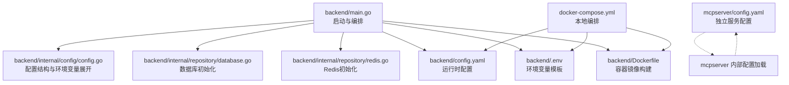
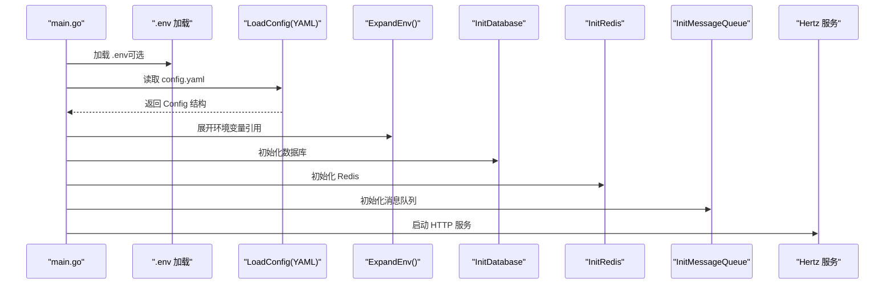
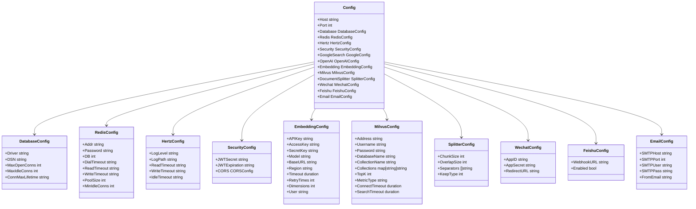

# 配置管理

<cite>
**本文引用的文件**
- [backend/config.yaml](file://backend/config.yaml)
- [backend/config.example.yaml](file://backend/config.example.yaml)
- [backend/.env](file://backend/.env)
- [backend/internal/config/config.go](file://backend/internal/config/config.go)
- [backend/chatApp/config/config.go](file://backend/chatApp/config/config.go)
- [backend/main.go](file://backend/main.go)
- [backend/Dockerfile](file://backend/Dockerfile)
- [docker-compose.yml](file://docker-compose.yml)
- [docker-compose-prod.yml](file://docker-compose-prod.yml)
- [mcpserver/config.yaml](file://mcpserver/config.yaml)
- [backend/internal/repository/database.go](file://backend/internal/repository/database.go)
- [backend/internal/repository/redis.go](file://backend/internal/repository/redis.go)
- [backend/internal/service/common/util.go](file://backend/internal/service/common/util.go)
</cite>

## 目录
1. [简介](#简介)
2. [项目结构](#项目结构)
3. [核心组件](#核心组件)
4. [架构总览](#架构总览)
5. [详细组件分析](#详细组件分析)
6. [依赖关系分析](#依赖关系分析)
7. [性能考量](#性能考量)
8. [故障排除指南](#故障排除指南)
9. [结论](#结论)
10. [附录](#附录)

## 简介
本文件面向面试吧配置管理系统，系统性阐述基于 YAML 与环境变量的配置管理设计与实现细节，覆盖配置文件加载、环境变量展开、默认值处理、数据库/Redis/AI服务/安全配置、配置验证、热更新现状与建议、配置加密、不同环境模板、敏感信息保护与最佳实践，并结合 Docker 与 CI/CD 场景给出部署与运维建议。

## 项目结构
后端采用“主服务 + 子模块”的组织方式：
- 主服务位于 backend，负责整体启动、配置加载与服务编排
- 子模块如 chatApp、mcpserver 独立配置与运行
- 配置文件集中于 backend/config.yaml，示例与环境变量模板分别在 backend/config.example.yaml 与 backend/.env
- Docker 与 Compose 提供本地与生产环境编排

图表来源
- [backend/main.go](file://backend/main.go#L29-L173)
- [backend/internal/config/config.go](file://backend/internal/config/config.go#L136-L268)
- [backend/config.yaml](file://backend/config.yaml#L1-L129)
- [backend/.env](file://backend/.env#L1-L16)
- [backend/Dockerfile](file://backend/Dockerfile#L1-L64)
- [docker-compose.yml](file://docker-compose.yml#L1-L226)
- [mcpserver/config.yaml](file://mcpserver/config.yaml#L1-L36)

章节来源
- [backend/main.go](file://backend/main.go#L29-L173)
- [backend/internal/config/config.go](file://backend/internal/config/config.go#L136-L268)
- [backend/config.yaml](file://backend/config.yaml#L1-L129)
- [backend/.env](file://backend/.env#L1-L16)
- [backend/Dockerfile](file://backend/Dockerfile#L1-L64)
- [docker-compose.yml](file://docker-compose.yml#L1-L226)
- [mcpserver/config.yaml](file://mcpserver/config.yaml#L1-L36)

## 核心组件
- 配置结构体与字段映射：涵盖服务、数据库、Redis、Hertz、面试系统、安全、Google/OpenAI、Embedding、Milvus、文档分割器、微信、飞书、邮件等模块
- 配置加载流程：从 YAML 文件读取 -> 展开环境变量 -> 初始化各子系统
- 环境变量展开：支持 ${VAR} 与 $VAR 两种语法，未匹配时保持原样
- 子模块配置：chatApp 仅加载 google/openai 子集；mcpserver 有独立配置文件
- 数据库/Redis 初始化：基于配置进行连接池与连接测试
- 加密工具：提供 API Key 加密/解密能力，密钥来自环境变量

章节来源
- [backend/internal/config/config.go](file://backend/internal/config/config.go#L13-L31)
- [backend/internal/config/config.go](file://backend/internal/config/config.go#L136-L268)
- [backend/chatApp/config/config.go](file://backend/chatApp/config/config.go#L14-L32)
- [backend/internal/repository/database.go](file://backend/internal/repository/database.go#L18-L60)
- [backend/internal/repository/redis.go](file://backend/internal/repository/redis.go#L16-L33)
- [backend/internal/service/common/util.go](file://backend/internal/service/common/util.go#L17-L42)

## 架构总览
配置管理的关键流程如下：

图表来源
- [backend/main.go](file://backend/main.go#L29-L173)
- [backend/internal/config/config.go](file://backend/internal/config/config.go#L136-L152)
- [backend/internal/config/config.go](file://backend/internal/config/config.go#L212-L234)
- [backend/internal/repository/database.go](file://backend/internal/repository/database.go#L18-L60)
- [backend/internal/repository/redis.go](file://backend/internal/repository/redis.go#L16-L33)

## 详细组件分析

### 配置结构与字段映射
- 服务与日志：host/port、Hertz 日志级别与路径、读写/空闲超时
- 数据库：驱动、DSN、最大连接数、空闲连接数、连接最大生命周期
- Redis：地址、密码、DB、拨号/读/写超时、连接池大小、最小空闲连接
- 安全：JWT 密钥与过期时间、CORS 允许来源/方法/头等
- AI 与工具：Google 搜索、OpenAI、Embedding（APIKey/AccessKey/SecretKey 三选一）、Milvus（连接、集合、检索、超时）
- 文档处理：DocumentSplitter 的分片大小、重叠、分隔符与保留策略
- 第三方集成：微信、飞书、邮件

章节来源
- [backend/internal/config/config.go](file://backend/internal/config/config.go#L13-L31)
- [backend/internal/config/config.go](file://backend/internal/config/config.go#L64-L92)
- [backend/internal/config/config.go](file://backend/internal/config/config.go#L113-L131)
- [backend/internal/config/config.go](file://backend/internal/config/config.go#L154-L171)
- [backend/internal/config/config.go](file://backend/internal/config/config.go#L173-L192)
- [backend/internal/config/config.go](file://backend/internal/config/config.go#L204-L210)
- [backend/internal/config/config.go](file://backend/internal/config/config.go#L42-L47)

### 配置加载与环境变量展开
- 加载顺序：先加载 .env（可选），再加载 config.yaml，最后对关键字段进行环境变量展开
- 展开规则：支持 ${VAR_NAME} 与 $VAR_NAME；若环境变量不存在，保留原值
- 展开范围：Embedding（APIKey/AccessKey/SecretKey/Model/BaseURL/Region/User）、Milvus（Address/Username/Password/DatabaseName/CollectionName/MetricType）、飞书 WebhookURL

章节来源
- [backend/main.go](file://backend/main.go#L30-L48)
- [backend/internal/config/config.go](file://backend/internal/config/config.go#L212-L234)
- [backend/internal/config/config.go](file://backend/internal/config/config.go#L236-L268)

### 子模块配置（chatApp）
- 仅加载 google 与 openai 子节点，且要求 google.api_key 与 google.search_engine_id 填写
- 通过相对路径定位 config.yaml，避免运行目录差异导致的路径问题

章节来源
- [backend/chatApp/config/config.go](file://backend/chatApp/config/config.go#L34-L73)

### 数据库配置与初始化
- 通过 GORM 连接 MySQL，支持连接池参数与自动迁移
- 连接池配置来源于 YAML 的 database 节点

章节来源
- [backend/internal/repository/database.go](file://backend/internal/repository/database.go#L18-L60)

### Redis 配置与初始化
- 通过 go-redis 连接，进行 PING 健康检查
- 提供统一的 Get/Set/Del 缓存操作封装

章节来源
- [backend/internal/repository/redis.go](file://backend/internal/repository/redis.go#L16-L54)

### 安全配置
- JWT 密钥与过期时间、CORS 允许来源/方法/头等
- 建议：生产环境务必设置强密钥与严格的 CORS 策略

章节来源
- [backend/internal/config/config.go](file://backend/internal/config/config.go#L113-L118)
- [backend/config.yaml](file://backend/config.yaml#L39-L49)

### AI 与向量服务配置
- OpenAI：API Key、模型名、BaseURL
- Embedding：支持 APIKey/AccessKey/SecretKey 三选一，以及 Model/BaseURL/Region 等
- Milvus：连接地址、用户名/密码、数据库/集合名、集合映射、TopK/MetricType、连接/搜索超时
- 建议：Embedding 与 Milvus 的敏感信息通过环境变量注入，避免硬编码

章节来源
- [backend/internal/config/config.go](file://backend/internal/config/config.go#L126-L131)
- [backend/internal/config/config.go](file://backend/internal/config/config.go#L154-L171)
- [backend/internal/config/config.go](file://backend/internal/config/config.go#L173-L192)
- [backend/config.yaml](file://backend/config.yaml#L55-L60)
- [backend/config.yaml](file://backend/config.yaml#L61-L79)
- [backend/config.yaml](file://backend/config.yaml#L80-L101)

### 配置验证与默认值
- 当前实现未提供统一的配置校验函数
- 建议：新增 Validate 方法对关键字段进行校验（如 URL 格式、端口范围、超时非负等），并在缺失时设置合理默认值

章节来源
- [backend/internal/config/config.go](file://backend/internal/config/config.go#L136-L152)

### 配置热更新
- 当前实现未实现配置热更新
- 建议：引入配置中心或文件监控（如 fsnotify）+ 信号触发 reload，或通过外部配置中心推送变更

章节来源
- [backend/main.go](file://backend/main.go#L29-L173)

### 配置加密
- 提供 API Key 加密/解密工具，密钥来自环境变量 USER_MODEL_API_KEY_SECRET，默认密钥用于 AES-128
- 建议：对敏感字段（如数据库密码、Redis 密码、AI API Key、JWT 密钥）统一走加密存储与解密流程

章节来源
- [backend/internal/service/common/util.go](file://backend/internal/service/common/util.go#L17-L42)

### 不同环境模板与最佳实践
- 开发环境：使用 backend/config.example.yaml 作为模板，配合 backend/.env 注入环境变量
- 生产环境：使用 docker-compose-prod.yml，将敏感信息通过环境变量注入，避免提交到仓库
- 最佳实践：
  - 所有敏感信息通过环境变量注入
  - 配置文件只保留非敏感默认值
  - 使用 .env 作为本地开发模板，不在版本控制中提交真实密钥
  - 对外暴露的配置项（如 BaseURL、模型名）尽量通过环境变量覆盖

章节来源
- [backend/config.example.yaml](file://backend/config.example.yaml#L1-L127)
- [backend/.env](file://backend/.env#L1-L16)
- [docker-compose-prod.yml](file://docker-compose-prod.yml#L1-L213)

### Docker 与 CI/CD 配置
- Dockerfile：多阶段构建，复制 config.yaml 与日志目录，健康检查
- docker-compose：本地编排 MySQL、Redis、后端、前端、Nginx，挂载 config.yaml 与日志目录
- CI/CD 建议：在流水线中注入环境变量，构建镜像时替换 config.yaml 或通过挂载注入

章节来源
- [backend/Dockerfile](file://backend/Dockerfile#L1-L64)
- [docker-compose.yml](file://docker-compose.yml#L1-L226)

### 子服务配置（mcpserver）
- 独立的 server 与 api_keys 配置，便于工具链服务的隔离部署
- 建议：与主服务共享密钥管理策略，确保一致的安全基线

章节来源
- [mcpserver/config.yaml](file://mcpserver/config.yaml#L1-L36)

## 依赖关系分析

图表来源
- [backend/internal/config/config.go](file://backend/internal/config/config.go#L13-L31)
- [backend/internal/config/config.go](file://backend/internal/config/config.go#L64-L92)
- [backend/internal/config/config.go](file://backend/internal/config/config.go#L113-L131)
- [backend/internal/config/config.go](file://backend/internal/config/config.go#L154-L171)
- [backend/internal/config/config.go](file://backend/internal/config/config.go#L173-L192)
- [backend/internal/config/config.go](file://backend/internal/config/config.go#L204-L210)
- [backend/internal/config/config.go](file://backend/internal/config/config.go#L42-L47)
- [backend/internal/config/config.go](file://backend/internal/config/config.go#L49-L53)
- [backend/internal/config/config.go](file://backend/internal/config/config.go#L33-L40)

## 性能考量
- 数据库连接池：根据并发与资源情况调整 MaxOpenConns/MaxIdleConns/ConnMaxLifetime
- Redis 连接池：根据 QPS 与延迟目标设置 PoolSize/MinIdleConns
- Hertz 超时：合理设置读/写/空闲超时，避免资源占用
- Embedding/Milvus：合理设置超时与重试次数，避免阻塞请求线程

## 故障排除指南
- 配置加载失败
  - 检查 config.yaml 语法与字段拼写
  - 确认 .env 已正确加载（日志会提示）
- 环境变量未生效
  - 确认变量名与 YAML 中引用一致（区分大小写）
  - 检查是否使用了正确的展开语法（${VAR} 或 $VAR）
- 数据库连接失败
  - 校验 DSN 与主机可达性
  - 检查 MaxOpenConns/ConnMaxLifetime 是否合理
- Redis 连接失败
  - 校验地址、密码与网络连通性
  - 检查最小空闲连接与池大小
- CORS 问题
  - 检查 Security.CORS 配置与前端请求头
- 健康检查失败
  - 查看 Docker 健康检查输出，确认端口与服务状态

章节来源
- [backend/main.go](file://backend/main.go#L30-L48)
- [backend/internal/config/config.go](file://backend/internal/config/config.go#L236-L268)
- [backend/internal/repository/database.go](file://backend/internal/repository/database.go#L18-L60)
- [backend/internal/repository/redis.go](file://backend/internal/repository/redis.go#L16-L33)

## 结论
本配置管理体系以 YAML 为主、环境变量为辅，具备良好的可移植性与扩展性。建议后续完善配置验证与默认值处理、引入热更新机制与配置中心、强化敏感信息保护与密钥管理，以满足生产级需求。

## 附录

### 配置字段一览（摘要）
- 服务与日志：host、port、hertz.log_level、hertz.log_path、hertz.read_timeout、hertz.write_timeout、hertz.idle_timeout
- 数据库：database.driver、database.dsn、database.max_open_conns、database.max_idle_conns、database.conn_max_lifetime
- Redis：redis.addr、redis.password、redis.db、redis.dial_timeout、redis.read_timeout、redis.write_timeout、redis.pool_size、redis.min_idle_conns
- 安全：security.jwt_secret、security.jwt_expiration、security.cors.allow_origins、security.cors.allow_methods、security.cors.allow_headers、security.cors.expose_headers、security.cors.allow_credentials
- AI 与工具：google_search.api_key、google_search.search_engine_id、openai.api_key、openai.model_name、openai.base_url、Embedding.APIKey/AccessKey/SecretKey、Embedding.Model、Embedding.BaseURL、Embedding.Region、Embedding.Timeout、Embedding.RetryTimes、Embedding.Dimensions、Embedding.User、Milvus.Address、Milvus.Username、Milvus.Password、Milvus.DatabaseName、Milvus.CollectionName、Milvus.Collections、Milvus.TopK、Milvus.MetricType、Milvus.ConnectTimeout、Milvus.SearchTimeout
- 文档处理：DocumentSplitter.ChunkSize、DocumentSplitter.OverlapSize、DocumentSplitter.Separators、DocumentSplitter.KeepType
- 第三方：wechat.app_id、wechat.app_secret、wechat.redirect_url、feishu.webhook_url、feishu.enabled、email.smtp_host、email.smtp_port、email.smtp_user、email.smtp_pass、email.from_email

章节来源
- [backend/config.yaml](file://backend/config.yaml#L1-L129)
- [backend/internal/config/config.go](file://backend/internal/config/config.go#L13-L31)