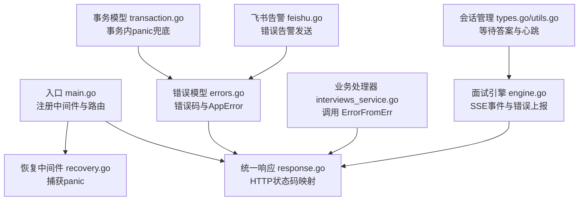
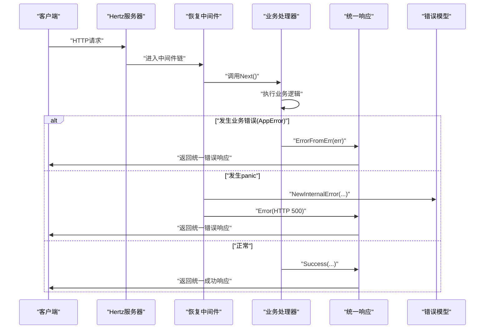
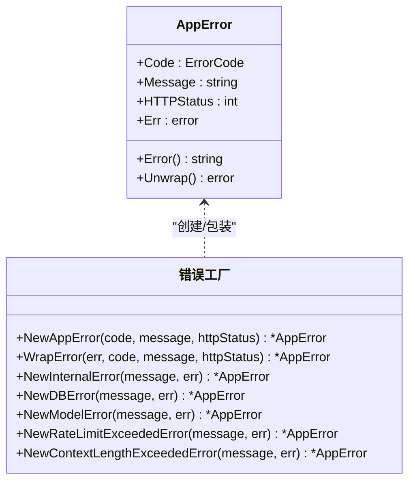
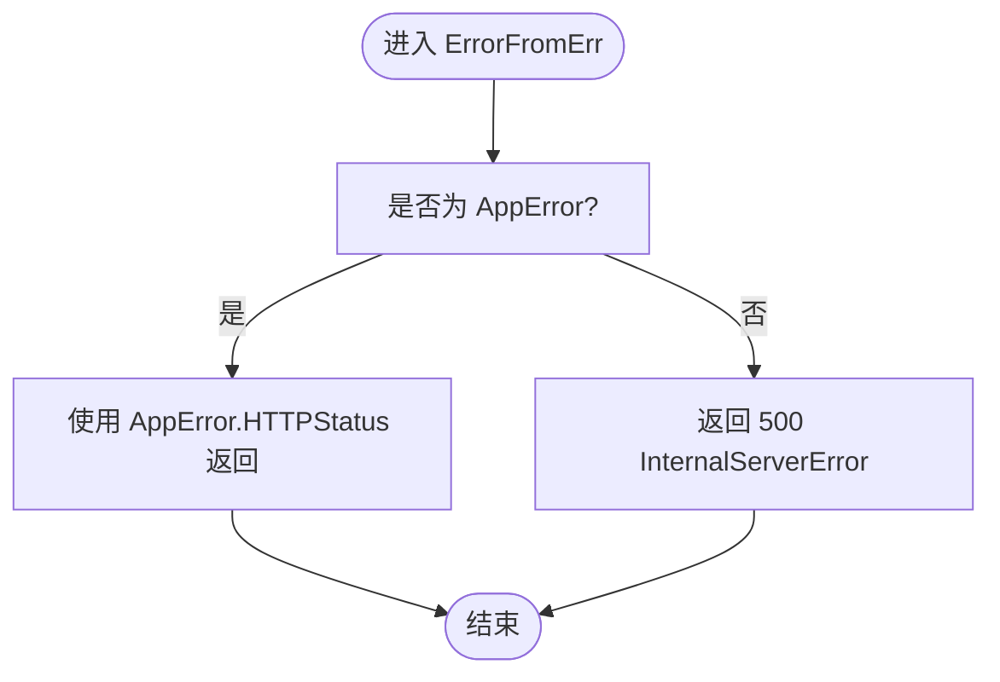
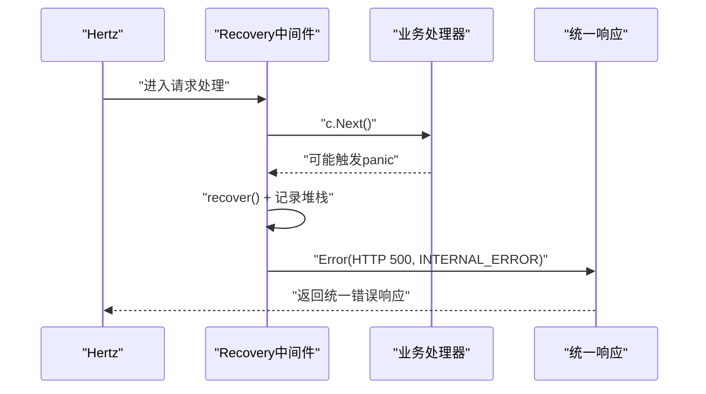
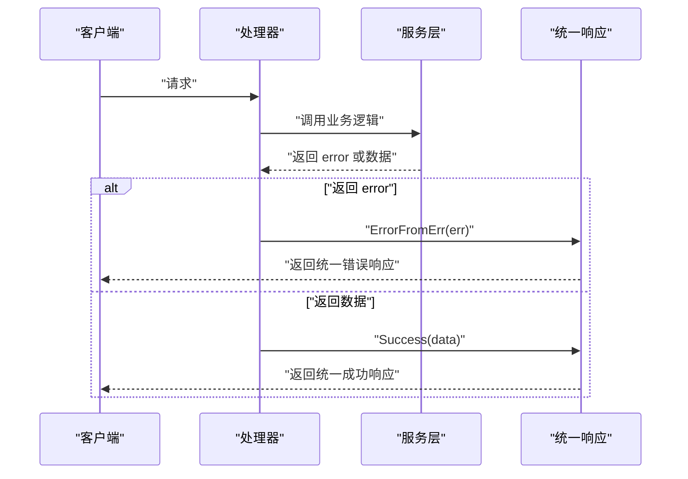
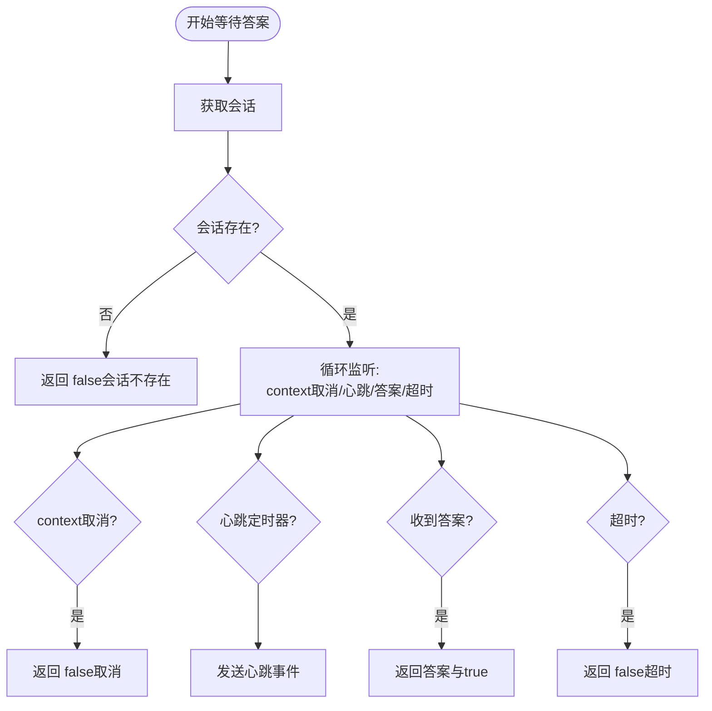
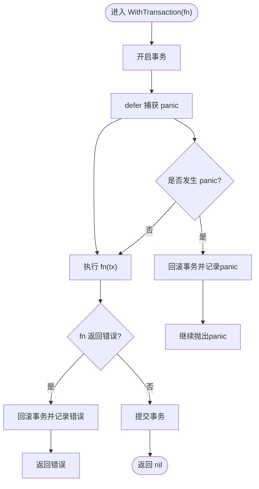
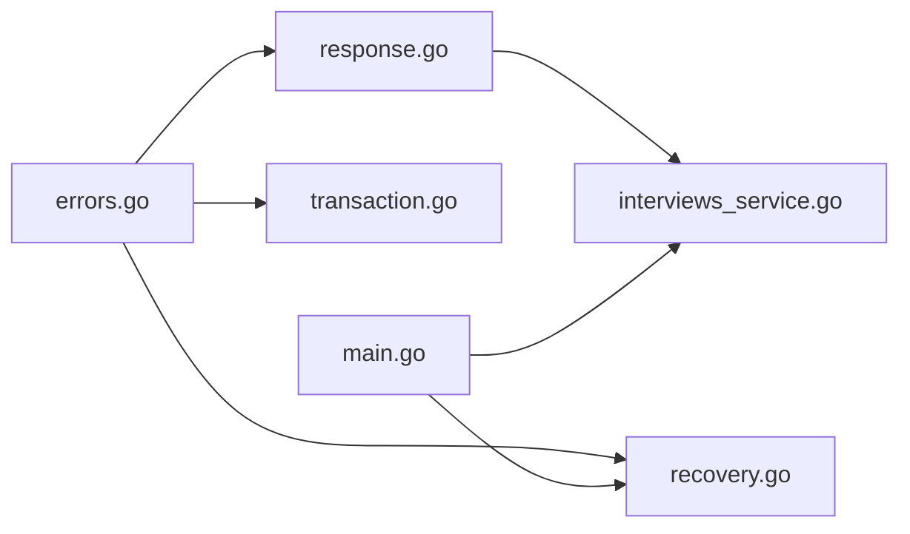

# 错误处理机制

<cite>
**本文引用的文件**
- [backend/internal/errors/errors.go](file://backend/internal/errors/errors.go)
- [backend/api/response/response.go](file://backend/api/response/response.go)
- [backend/api/router/middleware/recovery.go](file://backend/api/router/middleware/recovery.go)
- [backend/main.go](file://backend/main.go)
- [backend/api/handler/interview/interviews_service.go](file://backend/api/handler/interview/interviews_service.go)
- [backend/api/handler/interview/mianshi/engine.go](file://backend/api/handler/interview/mianshi/engine.go)
- [backend/api/handler/interview/mianshi/types.go](file://backend/api/handler/interview/mianshi/types.go)
- [backend/api/handler/interview/mianshi/utils.go](file://backend/api/handler/interview/mianshi/utils.go)
- [backend/internal/alert/feishu.go](file://backend/internal/alert/feishu.go)
- [backend/internal/model/transaction.go](file://backend/internal/model/transaction.go)
</cite>

## 目录
1. [简介](#简介)
2. [项目结构](#项目结构)
3. [核心组件](#核心组件)
4. [架构总览](#架构总览)
5. [详细组件分析](#详细组件分析)
6. [依赖关系分析](#依赖关系分析)
7. [性能考量](#性能考量)
8. [故障排查指南](#故障排查指南)
9. [结论](#结论)
10. [附录](#附录)

## 简介
本文件系统性梳理“面试吧”项目的统一错误处理架构与实现细节，覆盖错误分类、错误码定义、错误消息国际化思路、panic捕获、错误传播与恢复、客户端/服务端/网络错误策略、错误日志与监控、HTTP状态码映射与响应格式、调试信息与最佳实践。

## 项目结构
错误处理相关代码主要分布在以下模块：
- 统一错误模型与错误工厂：backend/internal/errors
- 统一响应封装与HTTP状态码映射：backend/api/response
- 请求级panic恢复中间件：backend/api/router/middleware
- 入口注册与中间件装配：backend/main.go
- 业务处理器中的错误使用范式：backend/api/handler/interview/*
- 会话与SSE流程中的错误传播：backend/api/handler/interview/mianshi/*
- 数据库事务内panic兜底与回滚：backend/internal/model/transaction.go
- 告警与监控集成：backend/internal/alert/feishu.go

图表来源
- [backend/main.go](file://backend/main.go#L104-L128)
- [backend/api/router/middleware/recovery.go](file://backend/api/router/middleware/recovery.go#L15-L34)
- [backend/api/response/response.go](file://backend/api/response/response.go#L90-L118)
- [backend/internal/errors/errors.go](file://backend/internal/errors/errors.go#L9-L72)
- [backend/api/handler/interview/interviews_service.go](file://backend/api/handler/interview/interviews_service.go#L42-L46)
- [backend/api/handler/interview/mianshi/engine.go](file://backend/api/handler/interview/mianshi/engine.go#L118-L132)
- [backend/api/handler/interview/mianshi/types.go](file://backend/api/handler/interview/mianshi/types.go#L84-L126)
- [backend/api/handler/interview/mianshi/utils.go](file://backend/api/handler/interview/mianshi/utils.go#L11-L56)
- [backend/internal/model/transaction.go](file://backend/internal/model/transaction.go#L11-L58)
- [backend/internal/alert/feishu.go](file://backend/internal/alert/feishu.go#L69-L78)

章节来源
- [backend/main.go](file://backend/main.go#L104-L128)

## 核心组件
- 统一错误模型 AppError：包含业务错误码、用户友好消息、HTTP状态码以及底层错误链，便于错误传播与调试。
- 错误工厂与预定义构造函数：提供 INVALID_PARAM、NOT_FOUND、UNAUTHORIZED、FORBIDDEN、DATABASE_ERROR、REDIS_ERROR、MILVUS_ERROR、MODEL_ERROR、VALIDATION_ERROR、FEISHU_ERROR、OPENAI_ERROR、INSUFFICIENT_TOKENS、RATE_LIMIT_EXCEEDED、CONTEXT_LENGTH_EXCEEDED 等错误码与状态映射。
- 统一响应 response：封装统一响应结构，提供 Success/Error/BadRequest/Unauthorized/Forbidden/NotFound/InternalServerError 等便捷方法，并将业务码映射为HTTP状态码。
- 恢复中间件 Recovery：捕获panic，记录堆栈，转换为内部错误并返回统一错误响应。
- 业务处理器：通过 ErrorFromErr 自动识别 AppError 并返回对应HTTP状态码；否则返回500。
- 会话与SSE：在面试流程中对会话缺失、答案超时、Agent返回空结果等情况进行事件上报与错误处理。
- 事务模型：WithTransaction 在事务内捕获panic并回滚，保证一致性。
- 告警与监控：通过飞书告警接口发送数据库等关键错误告警。

章节来源
- [backend/internal/errors/errors.go](file://backend/internal/errors/errors.go#L9-L72)
- [backend/api/response/response.go](file://backend/api/response/response.go#L13-L88)
- [backend/api/router/middleware/recovery.go](file://backend/api/router/middleware/recovery.go#L15-L34)
- [backend/api/handler/interview/interviews_service.go](file://backend/api/handler/interview/interviews_service.go#L42-L46)
- [backend/api/handler/interview/mianshi/engine.go](file://backend/api/handler/interview/mianshi/engine.go#L118-L132)
- [backend/internal/model/transaction.go](file://backend/internal/model/transaction.go#L11-L58)
- [backend/internal/alert/feishu.go](file://backend/internal/alert/feishu.go#L69-L78)

## 架构总览
统一错误处理由“错误模型 + 响应封装 + 中间件兜底 + 业务传播 + 监控告警”构成闭环，确保：
- 错误可识别（业务错误码）
- 响应一致（统一结构与HTTP状态码映射）
- 异常可控（panic恢复与事务回滚）
- 可观测（日志、告警）

图表来源
- [backend/api/router/middleware/recovery.go](file://backend/api/router/middleware/recovery.go#L15-L34)
- [backend/api/response/response.go](file://backend/api/response/response.go#L80-L88)
- [backend/internal/errors/errors.go](file://backend/internal/errors/errors.go#L53-L72)

## 详细组件分析

### 统一错误模型与错误码
- 错误码类型与常量：ErrorCode 作为业务错误码标识，覆盖通用错误、数据库、Redis、Milvus、模型API、Feishu、OpenAI等。
- AppError 结构：包含 Code、Message、HTTPStatus、Err；实现 error 和 Unwrap 接口，支持错误链追踪。
- 错误构造函数：
  - NewAppError/WrapError：创建或包装错误，携带HTTP状态码。
  - 预定义构造：NewInternalError/NewInvalidParamError/NewNotFoundError/NewDBError/NewValidationError/NewMilvusError/NewFeishuError/NewOpenAIError/NewModelError/NewInsufficientTokensError/NewRateLimitExceededError/NewContextLengthExceededError。
  - 模型错误状态映射：根据底层错误字符串判断429/401/空结果等特殊状态，映射为429、401、502等。
- 错误链辅助：As/Unwrap 支持在错误链中查找目标类型。

图表来源
- [backend/internal/errors/errors.go](file://backend/internal/errors/errors.go#L31-L72)
- [backend/internal/errors/errors.go](file://backend/internal/errors/errors.go#L74-L151)

章节来源
- [backend/internal/errors/errors.go](file://backend/internal/errors/errors.go#L9-L178)

### 统一响应与HTTP状态码映射
- 统一响应结构：包含 code、message、data。
- 快捷方法：Success/SuccessWithMessage/Error/ErrorWithData/BadRequest/Unauthorized/Forbidden/NotFound/InternalServerError。
- ErrorFromErr：自动识别 AppError 并按其 HTTPStatus 返回；否则返回500。
- getHTTPStatusCode：将业务码映射为Hertz常量对应的HTTP状态码。

图表来源
- [backend/api/response/response.go](file://backend/api/response/response.go#L80-L88)
- [backend/api/response/response.go](file://backend/api/response/response.go#L90-L118)

章节来源
- [backend/api/response/response.go](file://backend/api/response/response.go#L13-L118)

### panic捕获与恢复中间件
- Recovery 中间件：defer + recover 捕获panic，记录堆栈，构造 INTERNAL_ERROR，返回统一错误响应。
- 注册位置：在入口 main.go 中最先注册，确保覆盖所有路由。

图表来源
- [backend/api/router/middleware/recovery.go](file://backend/api/router/middleware/recovery.go#L15-L34)
- [backend/main.go](file://backend/main.go#L104-L108)

章节来源
- [backend/api/router/middleware/recovery.go](file://backend/api/router/middleware/recovery.go#L15-L34)
- [backend/main.go](file://backend/main.go#L104-L108)

### 业务错误传播与处理器使用范式
- 业务处理器在调用服务层或外部接口后，若返回 error，统一通过 response.ErrorFromErr(err) 自动映射为对应HTTP状态码。
- 若出现未包装的错误（如第三方库错误），将被映射为500。
- 示例：列表面试记录、上传简历、获取简历等均遵循该模式。

图表来源
- [backend/api/handler/interview/interviews_service.go](file://backend/api/handler/interview/interviews_service.go#L28-L53)
- [backend/api/response/response.go](file://backend/api/response/response.go#L80-L88)

章节来源
- [backend/api/handler/interview/interviews_service.go](file://backend/api/handler/interview/interviews_service.go#L28-L53)

### 会话与SSE流程中的错误处理
- 会话管理：SessionManager 提供创建、获取、提交答案、删除会话等能力；当会话不存在时返回会话未找到错误。
- 等待答案与心跳：WaitForAnswerWithHeartbeat 定期发送心跳，监听答案通道与超时；超时或会话不存在时返回false。
- 面试引擎：在问题生成、答案接收、保存对话、发布评估消息等环节，遇到错误通过事件上报与日志记录，并在必要时中断流程。

图表来源
- [backend/api/handler/interview/mianshi/types.go](file://backend/api/handler/interview/mianshi/types.go#L84-L126)
- [backend/api/handler/interview/mianshi/utils.go](file://backend/api/handler/interview/mianshi/utils.go#L11-L56)

章节来源
- [backend/api/handler/interview/mianshi/types.go](file://backend/api/handler/interview/mianshi/types.go#L84-L149)
- [backend/api/handler/interview/mianshi/utils.go](file://backend/api/handler/interview/mianshi/utils.go#L11-L74)
- [backend/api/handler/interview/mianshi/engine.go](file://backend/api/handler/interview/mianshi/engine.go#L118-L132)

### 事务内panic捕获与错误恢复
- WithTransaction 在事务中执行业务函数，若发生错误则回滚；若发生panic，记录日志并回滚，再继续抛出panic，确保一致性与可观测性。

图表来源
- [backend/internal/model/transaction.go](file://backend/internal/model/transaction.go#L11-L58)

章节来源
- [backend/internal/model/transaction.go](file://backend/internal/model/transaction.go#L11-L58)

### 错误日志、监控与告警
- 日志记录：在多个关键点记录错误与堆栈，便于定位问题。
- 飞书告警：数据库操作失败时发送告警，包含操作、错误与重试次数，便于运维快速介入。
- 建议：结合统一日志采集与指标埋点，完善错误统计与趋势分析。

章节来源
- [backend/internal/alert/feishu.go](file://backend/internal/alert/feishu.go#L69-L78)

## 依赖关系分析
- 错误模型 errors.go 被统一响应 response.go 与处理器广泛依赖。
- 恢复中间件 recovery.go 依赖 response.go 与 errors.go。
- 业务处理器通过 response.ErrorFromErr 使用错误模型。
- 事务模型 transaction.go 与错误模型配合，保障一致性。
- 入口 main.go 负责注册中间件与路由，形成错误处理的前置防线。

图表来源
- [backend/internal/errors/errors.go](file://backend/internal/errors/errors.go#L9-L72)
- [backend/api/response/response.go](file://backend/api/response/response.go#L80-L88)
- [backend/api/router/middleware/recovery.go](file://backend/api/router/middleware/recovery.go#L15-L34)
- [backend/api/handler/interview/interviews_service.go](file://backend/api/handler/interview/interviews_service.go#L42-L46)
- [backend/internal/model/transaction.go](file://backend/internal/model/transaction.go#L11-L58)
- [backend/main.go](file://backend/main.go#L104-L128)

章节来源
- [backend/main.go](file://backend/main.go#L104-L128)
- [backend/api/response/response.go](file://backend/api/response/response.go#L80-L88)
- [backend/api/router/middleware/recovery.go](file://backend/api/router/middleware/recovery.go#L15-L34)
- [backend/internal/errors/errors.go](file://backend/internal/errors/errors.go#L9-L72)
- [backend/internal/model/transaction.go](file://backend/internal/model/transaction.go#L11-L58)

## 性能考量
- 错误对象创建与错误链遍历成本较低，但应避免在高频路径中频繁构造大量错误对象。
- 统一响应与HTTP状态码映射为O(1)，对性能影响可忽略。
- panic恢复与事务回滚涉及日志与数据库操作，应避免在热路径中频繁触发。
- 建议：对热点路径增加缓存与限流，减少不必要的错误构造与IO。

## 故障排查指南
- 400类错误（INVALID_PARAM/VALIDATION_ERROR）：检查请求参数绑定与校验逻辑，确认处理器使用 BindAndValidate。
- 401/403：检查鉴权中间件与权限控制，确认 JWTMiddlewareWithSkipper 的跳过规则。
- 404（NOT_FOUND）：检查资源是否存在，数据库查询是否正确映射。
- 500（INTERNAL_ERROR）：查看panic堆栈与日志，确认 Recovery 中间件是否捕获到异常。
- 模型API错误（429/401/402/413）：根据 NewModelError/NewRateLimitExceededError/NewInsufficientTokensError/NewContextLengthExceededError 的映射，调整配额、限速或输入长度。
- 数据库错误：关注 NewDBError 的记录不存在分支，区分404与500。
- 事务异常：检查 WithTransaction 的回滚日志，定位具体失败点。

章节来源
- [backend/api/response/response.go](file://backend/api/response/response.go#L90-L118)
- [backend/internal/errors/errors.go](file://backend/internal/errors/errors.go#L88-L151)
- [backend/api/router/middleware/recovery.go](file://backend/api/router/middleware/recovery.go#L15-L34)
- [backend/internal/model/transaction.go](file://backend/internal/model/transaction.go#L11-L58)

## 结论
本项目通过“统一错误模型 + 统一响应 + 恢复中间件 + 业务传播 + 事务兜底 + 告警监控”的完整体系，实现了高内聚、低耦合的错误处理机制。建议在后续迭代中进一步完善国际化消息、输入验证与错误统计，以提升可维护性与可观测性。

## 附录

### 错误码与HTTP状态码映射要点
- 400：INVALID_PARAM、VALIDATION_ERROR
- 401：UNAUTHORIZED
- 403：FORBIDDEN
- 404：NOT_FOUND
- 402：INSUFFICIENT_TOKENS
- 403/429/413：根据模型错误与上下文动态映射
- 500：INTERNAL_ERROR
- 502：FEISHU_ERROR、OPENAI_ERROR
- 503：服务不可用（如外部依赖）

章节来源
- [backend/internal/errors/errors.go](file://backend/internal/errors/errors.go#L12-L29)
- [backend/api/response/response.go](file://backend/api/response/response.go#L90-L118)