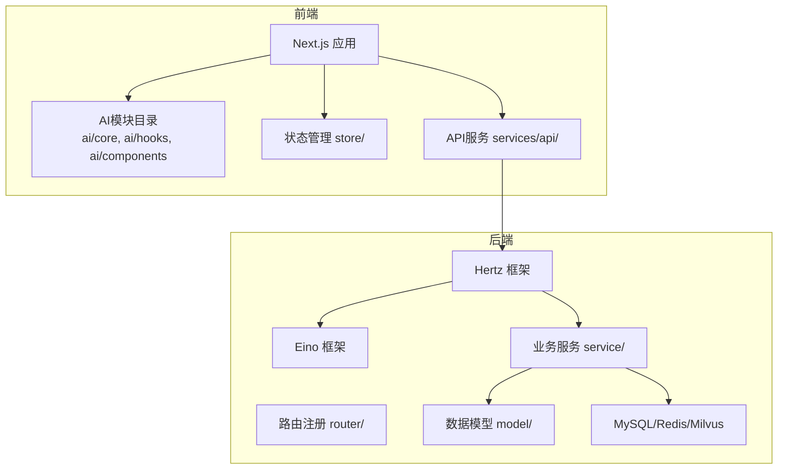
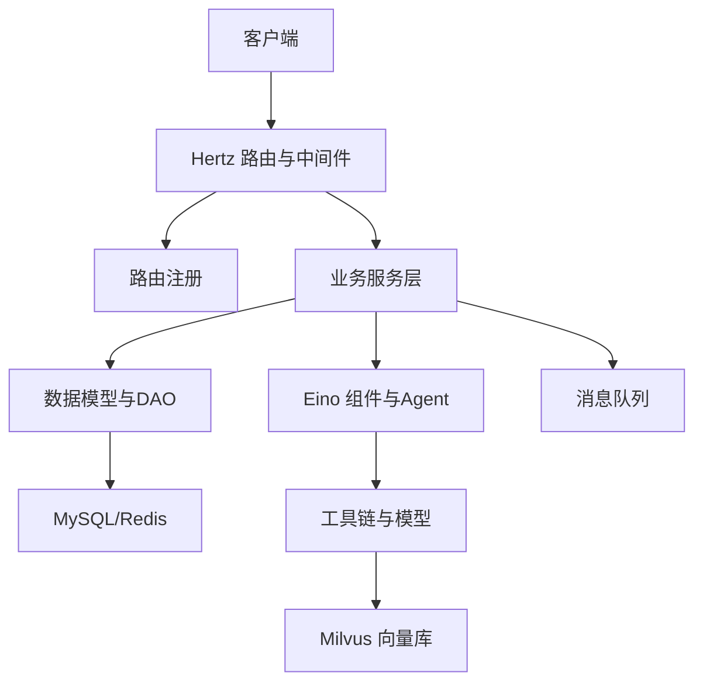
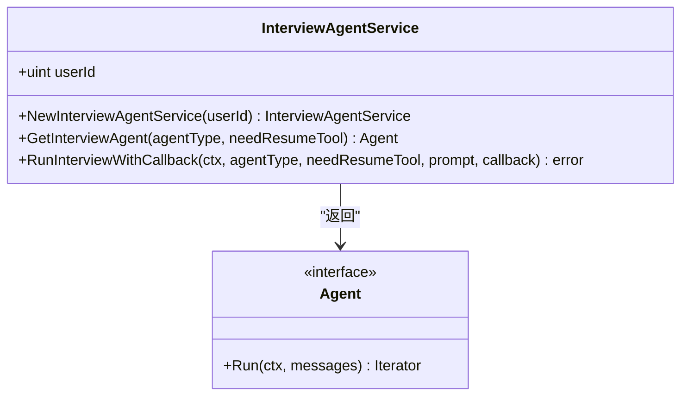
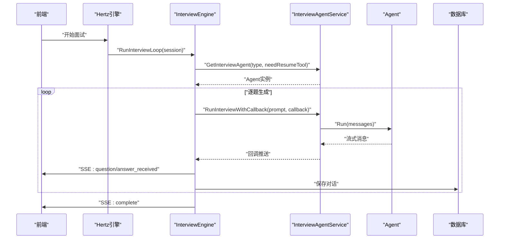
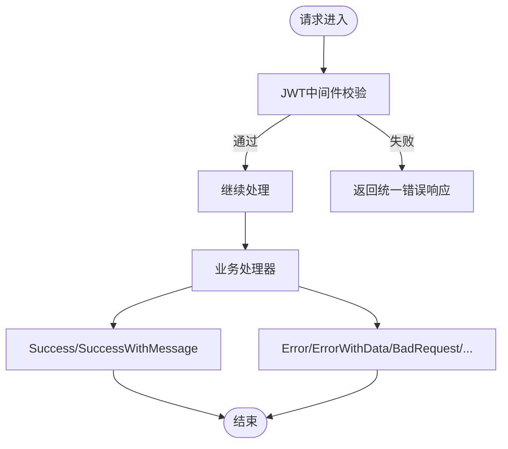
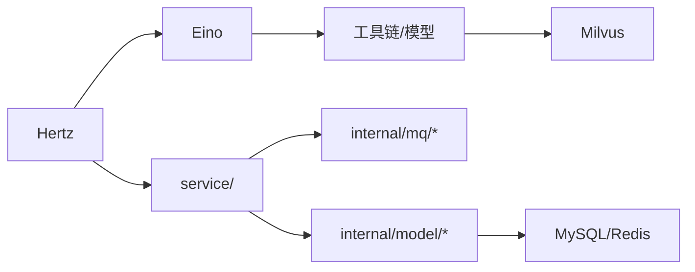

# 代码规范与最佳实践

<cite>
**本文档引用的文件**
- [AI编程开发规范.md](file://doc/AI编程开发规范.md)
- [后端架构设计.md](file://doc/后端架构设计.md)
- [前端开发方案.md](file://doc/前端开发方案.md)
- [.eslintrc.js](file://frontend/.eslintrc.js)
- [.prettierrc](file://frontend/.prettierrc)
- [main.go](file://backend/chatApp/main.go)
- [register.go](file://backend/api/router/register.go)
- [jwt.go](file://backend/internal/middleware/jwt.go)
- [config.go](file://backend/chatApp/config/config.go)
- [go.mod](file://backend/go.mod)
- [school_comprehensive_agent.go](file://backend/chatApp/agent/interview/comprehensive/school_comprehensive_agent.go)
- [interview_agent_service.go](file://backend/chatApp/agent_service/interview/interview_agent_service.go)
- [engine.go](file://backend/api/handler/interview/mianshi/engine.go)
- [interface.go](file://backend/internal/service/interviews/interface.go)
- [response.go](file://backend/api/response/response.go)
</cite>

## 目录
1. [简介](#简介)
2. [项目结构](#项目结构)
3. [核心组件](#核心组件)
4. [架构总览](#架构总览)
5. [详细组件分析](#详细组件分析)
6. [依赖分析](#依赖分析)
7. [性能考量](#性能考量)
8. [故障排查指南](#故障排查指南)
9. [结论](#结论)
10. [附录](#附录)

## 简介
本文件面向“牛面AI面试平台”的前后端开发者，系统化梳理并制定AI编程开发规范与最佳实践。内容覆盖模块化设计原则、单一职责原则、接口标准化要求；明确前后端代码规范差异（Go语言编码规范、TypeScript/JavaScript开发规范、AI模块开发约束）；提供代码复用策略、命名约定、注释规范和错误处理标准；强调AI相关模块的强制规范（复用优先、单一职责、接口标准化等）；并给出代码审查清单与质量保证流程，帮助团队在保证可维护性与扩展性的前提下高效交付高质量AI功能。

## 项目结构
项目采用前后端分离架构，后端以字节跳动Hertz框架与Eino框架为核心，构建AI面试全流程服务；前端基于Next.js与TypeScript，提供现代化的用户体验。AI模块在后端通过Eino组件与Agent体系组织，在前端通过统一的AI模块目录结构与Hook实现复用。

图表来源
- [后端架构设计.md](file://doc/后端架构设计.md#L24-L45)
- [前端开发方案.md](file://doc/前端开发方案.md#L20-L50)

章节来源
- [后端架构设计.md](file://doc/后端架构设计.md#L1-L120)
- [前端开发方案.md](file://doc/前端开发方案.md#L1-L120)

## 核心组件
- AI智能体服务：封装不同类型的面试Agent（综合/专项），统一对外接口，屏蔽底层模型与工具差异。
- 面试引擎：协调会话管理、问题生成、答案等待与持久化，通过SSE推送事件。
- 统一响应与中间件：统一HTTP响应格式、JWT认证与权限控制。
- 配置与工具：集中化配置加载与通用工具函数，确保跨模块一致性。

章节来源
- [interview_agent_service.go](file://backend/chatApp/agent_service/interview/interview_agent_service.go#L30-L155)
- [engine.go](file://backend/api/handler/interview/mianshi/engine.go#L23-L291)
- [response.go](file://backend/api/response/response.go#L13-L119)
- [jwt.go](file://backend/internal/middleware/jwt.go#L32-L215)
- [config.go](file://backend/chatApp/config/config.go#L14-L74)

## 架构总览
后端采用“Hertz + Eino”的组合架构：Hertz负责HTTP路由与中间件，Eino负责AI组件编排与流式处理。AI模块通过Agent与工具链实现可复用、可扩展的对话与评估能力；服务层通过接口抽象实现业务隔离；数据层采用MySQL、Redis与Milvus支撑结构化数据、缓存与向量检索。

图表来源
- [后端架构设计.md](file://doc/后端架构设计.md#L195-L244)
- [engine.go](file://backend/api/handler/interview/mianshi/engine.go#L232-L230)

章节来源
- [后端架构设计.md](file://doc/后端架构设计.md#L1-L200)

## 详细组件分析

### AI智能体服务（InterviewAgentService）
- 单一职责：根据面试类型返回对应Agent实例，屏蔽具体模型与工具差异。
- 接口标准化：统一GetInterviewAgent与RunInterviewWithCallback，输入输出参数清晰，便于复用。
- 复用优先：不同面试场景共享同一套Agent工厂与运行逻辑。

图表来源
- [interview_agent_service.go](file://backend/chatApp/agent_service/interview/interview_agent_service.go#L30-L155)

章节来源
- [interview_agent_service.go](file://backend/chatApp/agent_service/interview/interview_agent_service.go#L30-L155)

### 面试引擎（InterviewEngine）
- 会话驱动：按题序生成问题，维护最近N题的历史上下文，通过SSE推送事件。
- 错误处理：对Agent返回空结果、解析失败、超时等情况进行统一处理与事件上报。
- 数据持久化：将完整对话序列保存至数据库，触发后续评估与主题分析任务。

图表来源
- [engine.go](file://backend/api/handler/interview/mianshi/engine.go#L39-L230)
- [interview_agent_service.go](file://backend/chatApp/agent_service/interview/interview_agent_service.go#L75-L155)

章节来源
- [engine.go](file://backend/api/handler/interview/mianshi/engine.go#L23-L291)

### 统一响应与中间件
- 统一响应：定义统一的响应结构与状态码映射，便于前端消费与错误处理。
- JWT中间件：支持多渠道令牌提取（Header/Bearer、Cookie、Query），并注入用户上下文。

图表来源
- [jwt.go](file://backend/internal/middleware/jwt.go#L32-L215)
- [response.go](file://backend/api/response/response.go#L13-L119)

章节来源
- [response.go](file://backend/api/response/response.go#L13-L119)
- [jwt.go](file://backend/internal/middleware/jwt.go#L32-L215)

### 配置与工具
- 配置加载：通过YAML配置文件集中管理第三方服务凭据与参数，避免硬编码。
- 工具函数：提供通用解密等工具，确保敏感信息的安全处理。

章节来源
- [config.go](file://backend/chatApp/config/config.go#L14-L74)
- [main.go](file://backend/chatApp/main.go#L125-L136)

## 依赖分析
- 技术栈：Hertz负责HTTP服务，Eino负责AI组件与流式处理，二者职责清晰、耦合度低。
- 外部依赖：MySQL、Redis、Milvus、OpenAI/Ark等，均通过服务层接口抽象，降低耦合。
- 内部依赖：AI模块通过服务层接口与数据层DAO交互，遵循单一职责与依赖倒置。

图表来源
- [后端架构设计.md](file://doc/后端架构设计.md#L195-L244)
- [go.mod](file://backend/go.mod#L7-L32)

章节来源
- [go.mod](file://backend/go.mod#L1-L132)

## 性能考量
- 缓存策略：使用Redis缓存热点数据与会话状态，减少数据库压力。
- 异步处理：通过消息队列异步发布评估与主题分析任务，提升吞吐。
- 数据库优化：合理索引与读写分离，配合批量写入降低延迟。
- 服务降级：在高负载场景下启用限流与熔断，保障核心功能可用。

章节来源
- [后端架构设计.md](file://doc/后端架构设计.md#L425-L442)

## 故障排查指南
- 认证失败：检查Authorization头格式是否为Bearer Token，确认JWT密钥与过期时间配置。
- 响应异常：统一通过response.ErrorFromErr映射业务错误，定位具体HTTP状态码与消息。
- AI调用问题：核对Agent类型与工具配置，确认模型参数与BaseURL正确。
- SSE事件异常：检查InterviewEngine的事件发送逻辑与会话清理，避免阻塞或丢失。

章节来源
- [jwt.go](file://backend/internal/middleware/jwt.go#L186-L215)
- [response.go](file://backend/api/response/response.go#L80-L88)
- [engine.go](file://backend/api/handler/interview/mianshi/engine.go#L148-L230)

## 结论
通过明确的模块化设计、单一职责划分与接口标准化，结合统一的响应与中间件机制，本项目在前后端均建立了可复用、可维护的AI开发规范。建议在后续迭代中持续落实AI模块强制规范（复用优先、单一职责、接口标准化），并完善代码审查清单与质量保证流程，确保平台在功能演进与性能优化上的可持续发展。

## 附录

### 前后端代码规范差异与约束
- Go语言编码规范
  - 包结构清晰，接口抽象在service/与internal/之间分层，避免循环依赖。
  - 使用context贯穿请求生命周期，确保超时与取消可控。
  - 错误处理统一通过response.ErrorFromErr映射，避免裸错误传播。
- TypeScript/JavaScript开发规范
  - ESLint与Prettier统一代码风格，禁用显式any，开启未使用变量检查。
  - 组件与Hook复用优先，避免在组件内直接发起网络请求。
  - 状态管理集中于store，避免分散状态导致的不可控副作用。

章节来源
- [后端架构设计.md](file://doc/后端架构设计.md#L195-L244)
- [前端开发方案.md](file://doc/前端开发方案.md#L113-L171)
- [.eslintrc.js](file://frontend/.eslintrc.js#L1-L19)
- [.prettierrc](file://frontend/.prettierrc#L1-L10)

### AI模块开发强制规范（后端）
- 复用优先：AI相关逻辑抽象为独立模块，禁止在业务代码中重复编写相同逻辑。
- 单一职责：每个AI模块仅负责一项核心功能，核心复用模块代码行数≤300行。
- 接口标准化：对外提供统一格式的调用接口，输入参数与输出结构必须标准化。
- 交付验收：核心AI模块需被至少2个业务场景引用，无重复代码，文档完整。

章节来源
- [AI编程开发规范.md](file://doc/AI编程开发规范.md#L6-L80)

### 代码复用策略与命名约定
- 复用策略
  - AI智能体工厂：InterviewAgentService统一管理Agent创建与运行。
  - 通用工具：config.go集中配置，common工具函数集中处理通用逻辑。
- 命名约定
  - 接口以Interface结尾（如InterviewManager），实现以Impl结尾（如InterviewServiceImpl）。
  - 结构体与函数采用驼峰命名，常量使用全大写加下划线分隔。

章节来源
- [interview_agent_service.go](file://backend/chatApp/agent_service/interview/interview_agent_service.go#L30-L155)
- [config.go](file://backend/chatApp/config/config.go#L14-L74)
- [interface.go](file://backend/internal/service/interviews/interface.go#L20-L117)

### 注释规范与错误处理标准
- 注释规范
  - 公共函数/接口需包含功能描述、输入输出参数（类型、必填项）、复用场景与扩展方式。
- 错误处理标准
  - 业务错误通过AppError包装，response.ErrorFromErr统一映射HTTP状态码。
  - JWT中间件支持多渠道令牌提取与错误提示，确保鉴权失败时返回一致格式。

章节来源
- [AI编程开发规范.md](file://doc/AI编程开发规范.md#L70-L75)
- [response.go](file://backend/api/response/response.go#L80-L88)
- [jwt.go](file://backend/internal/middleware/jwt.go#L32-L78)

### 代码审查清单与质量保证流程
- 代码审查清单
  - 是否遵循复用优先与单一职责原则
  - 是否满足接口标准化要求
  - 是否存在重复代码片段
  - 是否提供完整注释文档
  - 是否通过统一响应与中间件处理错误
- 质量保证流程
  - 单元测试与集成测试覆盖核心AI模块
  - CI中执行ESLint/Prettier与Go vet/gofmt
  - 交付前提交“规范自检报告”，说明如何遵守规范

章节来源
- [AI编程开发规范.md](file://doc/AI编程开发规范.md#L67-L80)
- [前端开发方案.md](file://doc/前端开发方案.md#L120-L171)