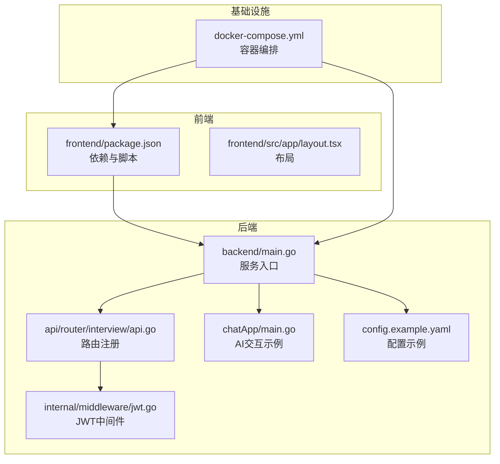
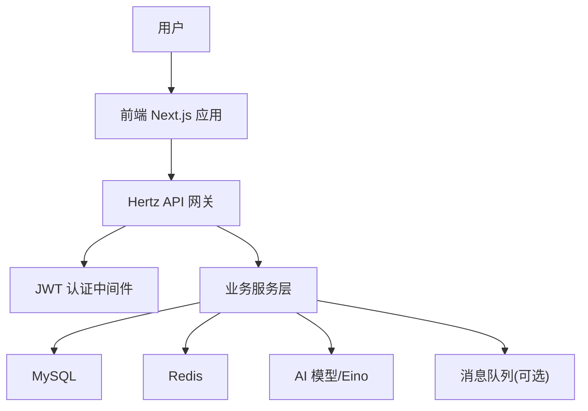
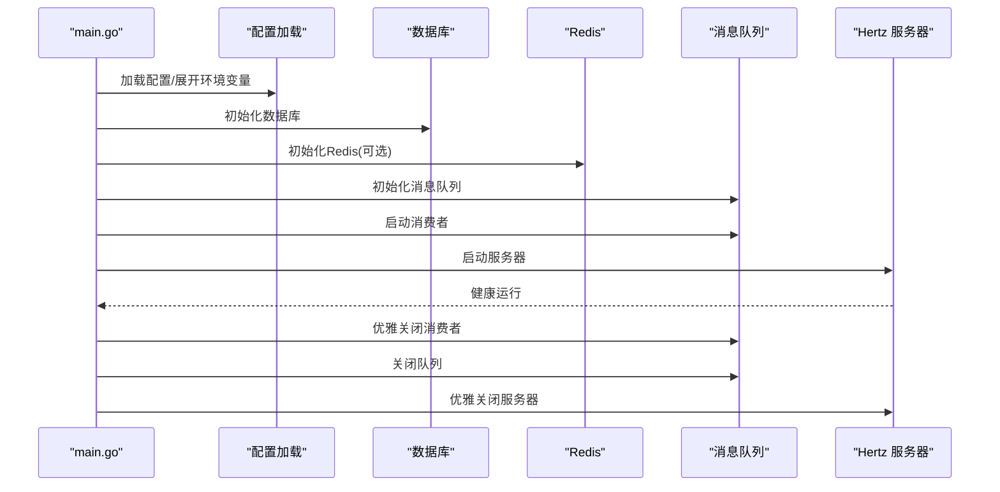
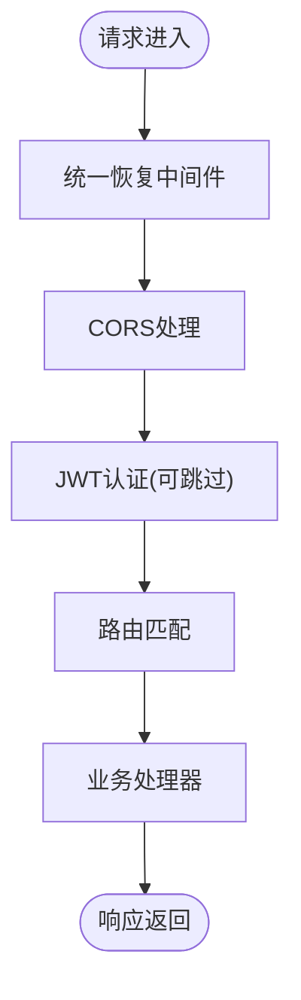
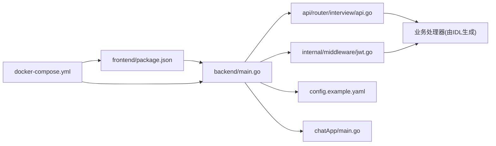

# 开发指南

<cite>
**本文引用的文件**
- [README.md](file://README.md)
- [backend/main.go](file://backend/main.go)
- [backend/go.mod](file://backend/go.mod)
- [backend/config.example.yaml](file://backend/config.example.yaml)
- [backend/internal/middleware/jwt.go](file://backend/internal/middleware/jwt.go)
- [backend/api/router/register.go](file://backend/api/router/register.go)
- [backend/api/router/interview/api.go](file://backend/api/router/interview/api.go)
- [backend/chatApp/main.go](file://backend/chatApp/main.go)
- [frontend/package.json](file://frontend/package.json)
- [frontend/src/app/layout.tsx](file://frontend/src/app/layout.tsx)
- [frontend/.eslintrc.js](file://frontend/.eslintrc.js)
- [frontend/.prettierrc](file://frontend/.prettierrc)
- [docker-compose.yml](file://docker-compose.yml)
- [doc/AI编程开发规范.md](file://doc/AI编程开发规范.md)
- [doc/后端架构设计.md](file://doc/后端架构设计.md)
- [doc/项目优化建议_代码质量篇.md](file://doc/项目优化建议_代码质量篇.md)
- [doc/项目优化建议_性能安全篇.md](file://doc/项目优化建议_性能安全篇.md)
- [doc/项目优化建议_架构篇.md](file://doc/项目优化建议_架构篇.md)
</cite>

## 目录
1. [简介](#简介)
2. [项目结构](#项目结构)
3. [核心组件](#核心组件)
4. [架构总览](#架构总览)
5. [详细组件分析](#详细组件分析)
6. [依赖关系分析](#依赖关系分析)
7. [性能考虑](#性能考虑)
8. [故障排除指南](#故障排除指南)
9. [结论](#结论)
10. [附录](#附录)

## 简介
本开发指南面向面试吧（AI智能面试平台）项目的核心开发者与协作成员，目标是提供一套完整的开发、测试、部署与运维实践手册。内容涵盖开发环境搭建、代码规范与最佳实践、AI编程规范、测试策略、代码审查流程、开发工具与调试技巧、故障排除方法、Git工作流与分支管理、版本发布策略、新功能开发流程、性能优化建议、安全编码规范以及团队协作与知识分享机制。

## 项目结构
项目采用前后端分离架构，后端基于 Hertz 框架与 Eino 框架构建，前端基于 Next.js 14+，并提供完整的容器化部署方案。核心目录与职责如下：
- backend：后端服务入口、API 路由、中间件、业务服务、数据访问层、AI 智能体与工具、配置与文档
- frontend：Next.js 前端应用，包含页面、组件、状态管理与 API 客户端
- doc：项目文档，包括架构设计、AI开发规范、优化建议等
- mcpserver：MCP 协议服务（可选）
- 根目录：项目说明、Docker 编排、常用命令等

图表来源
- [backend/main.go](file://backend/main.go#L29-L173)
- [backend/api/router/interview/api.go](file://backend/api/router/interview/api.go#L17-L103)
- [backend/internal/middleware/jwt.go](file://backend/internal/middleware/jwt.go#L32-L78)
- [backend/chatApp/main.go](file://backend/chatApp/main.go#L25-L123)
- [backend/config.example.yaml](file://backend/config.example.yaml#L1-L127)
- [frontend/package.json](file://frontend/package.json#L1-L37)
- [frontend/src/app/layout.tsx](file://frontend/src/app/layout.tsx#L14-L24)
- [docker-compose.yml](file://docker-compose.yml#L1-L226)

章节来源
- [README.md](file://README.md#L35-L137)
- [backend/main.go](file://backend/main.go#L29-L173)
- [docker-compose.yml](file://docker-compose.yml#L1-L226)

## 核心组件
- 服务入口与启动流程：加载 .env、配置文件、初始化数据库/Redis、消息队列、启动 Hertz 服务器、优雅关闭
- 路由与中间件：统一恢复中间件、CORS、JWT 认证中间件
- 配置管理：支持环境变量展开、多环境配置、特性开关
- AI 智能体与工具：基于 Eino 的聊天模型、Agent、工具与向量检索
- 前后端依赖与脚本：Next.js、TypeScript、ESLint、Prettier、Docker

章节来源
- [backend/main.go](file://backend/main.go#L29-L173)
- [backend/internal/middleware/jwt.go](file://backend/internal/middleware/jwt.go#L32-L78)
- [backend/config.example.yaml](file://backend/config.example.yaml#L1-L127)
- [backend/chatApp/main.go](file://backend/chatApp/main.go#L25-L123)
- [frontend/package.json](file://frontend/package.json#L1-L37)
- [frontend/.eslintrc.js](file://frontend/.eslintrc.js#L1-L19)
- [frontend/.prettierrc](file://frontend/.prettierrc#L1-L10)

## 架构总览
系统采用“API 网关 + 微服务风格模块”的单体架构，结合 Hertz 的高性能与 Eino 的 AI 能力，实现用户管理、简历分析、面试流程、AI 交互与评估报告等核心功能。前端通过 Next.js 提供响应式界面，后端通过 Docker Compose 一键部署。

图表来源
- [doc/后端架构设计.md](file://doc/后端架构设计.md#L26-L45)
- [backend/main.go](file://backend/main.go#L101-L128)
- [backend/internal/middleware/jwt.go](file://backend/internal/middleware/jwt.go#L32-L78)

章节来源
- [doc/后端架构设计.md](file://doc/后端架构设计.md#L1-L484)
- [README.md](file://README.md#L138-L157)

## 详细组件分析

### 服务启动与生命周期
- 加载 .env 与配置，展开环境变量
- 初始化数据库与 Redis（可选）
- 初始化消息队列与消费者
- 启动 Hertz 服务器，注册中间件与路由
- 优雅关闭：停止消费者、关闭队列、关闭服务器

图表来源
- [backend/main.go](file://backend/main.go#L29-L173)

章节来源
- [backend/main.go](file://backend/main.go#L29-L173)

### 路由与中间件
- 路由注册：通过 IDL 自动生成路由，并在注册函数中集中挂载
- 中间件链：统一恢复中间件、CORS、JWT 认证（支持跳过规则）

图表来源
- [backend/api/router/register.go](file://backend/api/router/register.go#L11-L15)
- [backend/api/router/interview/api.go](file://backend/api/router/interview/api.go#L17-L103)
- [backend/internal/middleware/jwt.go](file://backend/internal/middleware/jwt.go#L32-L78)

章节来源
- [backend/api/router/register.go](file://backend/api/router/register.go#L11-L15)
- [backend/api/router/interview/api.go](file://backend/api/router/interview/api.go#L17-L103)
- [backend/internal/middleware/jwt.go](file://backend/internal/middleware/jwt.go#L32-L78)

### 配置管理与特性开关
- 配置示例：包含服务、数据库、Redis、Hertz、面试系统、安全、AI、向量数据库、文档分割器、微信与飞书等配置
- 特性开关：通过配置控制 Redis、Milvus、指标、Swagger 等组件启用与否
- 环境变量：支持 ${VAR} 语法展开，便于多环境管理

章节来源
- [backend/config.example.yaml](file://backend/config.example.yaml#L1-L127)
- [doc/项目优化建议_架构篇.md](file://doc/项目优化建议_架构篇.md#L89-L129)

### AI 智能体与工具
- 基于 Eino 的聊天模型与 Agent，支持命令行交互与流式输出
- 支持多种智能体（简历分析、问题生成、答案评估、预测推荐）
- 可选向量检索与文档分割器

章节来源
- [backend/chatApp/main.go](file://backend/chatApp/main.go#L25-L123)
- [README.md](file://README.md#L138-L157)

### 前端开发与质量工具
- Next.js 14 + TypeScript + Tailwind CSS
- ESLint 与 Prettier 配置，保证代码风格一致
- 依赖管理与脚本（dev/build/start/lint）

章节来源
- [frontend/package.json](file://frontend/package.json#L1-L37)
- [frontend/.eslintrc.js](file://frontend/.eslintrc.js#L1-L19)
- [frontend/.prettierrc](file://frontend/.prettierrc#L1-L10)
- [frontend/src/app/layout.tsx](file://frontend/src/app/layout.tsx#L14-L24)

## 依赖关系分析
后端模块依赖关系围绕“入口 -> 路由 -> 中间件 -> 业务服务 -> 数据/缓存/AI”的链路展开；前端通过 API 与后端交互；Docker Compose 提供统一的本地开发环境。

图表来源
- [backend/main.go](file://backend/main.go#L29-L173)
- [backend/api/router/interview/api.go](file://backend/api/router/interview/api.go#L17-L103)
- [backend/internal/middleware/jwt.go](file://backend/internal/middleware/jwt.go#L32-L78)
- [backend/config.example.yaml](file://backend/config.example.yaml#L1-L127)
- [backend/chatApp/main.go](file://backend/chatApp/main.go#L25-L123)
- [frontend/package.json](file://frontend/package.json#L1-L37)
- [docker-compose.yml](file://docker-compose.yml#L1-L226)

章节来源
- [backend/go.mod](file://backend/go.mod#L1-L132)
- [backend/main.go](file://backend/main.go#L29-L173)

## 性能考虑
- 数据库连接池：优化最大连接数、空闲连接数与生命周期，配合 Prometheus 指标监控
- Redis 缓存：采用 Cache-Aside 模式，合理 TTL，防击穿策略
- AI 模型调用：连接池、限流与熔断，避免过载
- HTTP 限流：基于令牌桶的中间件限流
- 监控与告警：Prometheus 指标采集与告警

章节来源
- [doc/项目优化建议_性能安全篇.md](file://doc/项目优化建议_性能安全篇.md#L19-L213)
- [doc/项目优化建议_性能安全篇.md](file://doc/项目优化建议_性能安全篇.md#L215-L394)
- [doc/项目优化建议_性能安全篇.md](file://doc/项目优化建议_性能安全篇.md#L398-L443)
- [doc/项目优化建议_性能安全篇.md](file://doc/项目优化建议_性能安全篇.md#L498-L537)

## 故障排除指南
- 启动失败：检查 .env 与 config.yaml 的配置项，确认数据库/Redis 地址与凭据正确
- CORS 问题：确认中间件已注册且允许的来源、方法、头部配置正确
- JWT 认证失败：核对 Authorization 头格式与签名密钥，检查过期时间
- AI 模型调用超时：检查模型服务连通性、超时与重试策略
- Docker 环境：确认 compose 服务健康检查与端口映射

章节来源
- [backend/main.go](file://backend/main.go#L29-L173)
- [backend/internal/middleware/jwt.go](file://backend/internal/middleware/jwt.go#L186-L214)
- [docker-compose.yml](file://docker-compose.yml#L1-L226)

## 结论
本指南系统梳理了面试吧项目的开发与运维实践，从环境搭建到代码规范、从架构设计到性能与安全优化，再到团队协作与知识沉淀。建议团队在日常开发中遵循本文档的规范与流程，持续提升代码质量与交付效率。

## 附录

### 开发环境搭建
- 前端
  - 安装依赖：npm ci 或 npm install
  - 启动开发：npm run dev
  - 代码检查：npm run lint
- 后端
  - 安装依赖：go mod download
  - 启动服务：go run main.go
- 本地编排
  - 使用 docker-compose 启动 MySQL、Redis、Nginx、后端与前端

章节来源
- [frontend/package.json](file://frontend/package.json#L5-L9)
- [backend/go.mod](file://backend/go.mod#L1-L132)
- [docker-compose.yml](file://docker-compose.yml#L1-L226)

### 代码规范与最佳实践
- 后端
  - 遵循 Go 官方规范，使用 golangci-lint
  - 统一错误处理与输入验证
  - 单元测试覆盖率目标 80%+
- 前端
  - ESLint + Prettier 规范
  - TypeScript 类型约束
- AI 开发
  - 模块化复用、单一职责、接口标准化
  - 统一返回格式与文档完整性

章节来源
- [README.md](file://README.md#L271-L276)
- [doc/AI编程开发规范.md](file://doc/AI编程开发规范.md#L1-L80)
- [doc/项目优化建议_代码质量篇.md](file://doc/项目优化建议_代码质量篇.md#L596-L703)

### 测试策略与代码审查
- 测试金字塔：单元测试 > 集成测试 > 端到端测试
- 单元测试：使用 testify/mock，覆盖核心业务逻辑
- 集成测试：使用真实数据库与外部服务
- 代码审查：遵循 AI 开发规范与模块边界，确保复用率与无重复代码

章节来源
- [doc/项目优化建议_代码质量篇.md](file://doc/项目优化建议_代码质量篇.md#L413-L593)
- [doc/AI编程开发规范.md](file://doc/AI编程开发规范.md#L67-L79)

### 开发工具与调试技巧
- 后端
  - 使用 godotenv 加载环境变量
  - 使用结构化日志（建议引入 zap）
  - 使用 Prometheus 指标监控
- 前端
  - 使用 ESLint/Prettier 保持一致风格
  - 使用 Next.js DevTools 与浏览器调试

章节来源
- [backend/main.go](file://backend/main.go#L30-L36)
- [doc/项目优化建议_性能安全篇.md](file://doc/项目优化建议_性能安全篇.md#L706-L790)
- [frontend/.eslintrc.js](file://frontend/.eslintrc.js#L1-L19)
- [frontend/.prettierrc](file://frontend/.prettierrc#L1-L10)

### Git 工作流与分支管理
- 主干分支：main（受保护）
- 功能分支：feature/xxx
- 修复分支：fix/xxx
- 发布分支：release/xxx
- 代码审查：PR 至 main，至少一名 reviewer 通过
- 提交规范：语义化提交，简明描述变更

章节来源
- [README.md](file://README.md#L298-L304)

### 版本发布策略
- 语义化版本：主版本.次版本.修订号
- 发布前检查：测试通过、文档更新、配置校验
- 发布流程：创建 tag -> 自动构建镜像 -> 部署到目标环境

章节来源
- [README.md](file://README.md#L298-L304)

### 新功能开发流程
- 需求评审与设计：参考架构与优化建议文档
- 模块边界与接口设计：遵循 DI 与接口化
- 实现与测试：单元测试 + 集成测试
- 文档与评审：更新文档，发起代码审查
- 发布与监控：上线后观察指标与日志

章节来源
- [doc/项目优化建议_架构篇.md](file://doc/项目优化建议_架构篇.md#L133-L173)

### 安全编码规范
- JWT：短有效期、刷新机制、敏感信息脱敏
- 输入验证：统一验证器与错误格式
- 配置管理：示例文件不含敏感信息，使用环境变量
- 日志：避免记录敏感信息，使用脱敏工具

章节来源
- [doc/项目优化建议_性能安全篇.md](file://doc/项目优化建议_性能安全篇.md#L447-L494)
- [doc/项目优化建议_代码质量篇.md](file://doc/项目优化建议_代码质量篇.md#L64-L186)
- [backend/config.example.yaml](file://backend/config.example.yaml#L1-L127)

### 团队协作与知识分享
- 文档驱动：统一文档与规范
- 代码评审：强制通过与规范自检
- 培训与分享：定期组织架构与优化专题分享

章节来源
- [doc/AI编程开发规范.md](file://doc/AI编程开发规范.md#L77-L80)
- [doc/项目优化建议_架构篇.md](file://doc/项目优化建议_架构篇.md#L279-L290)