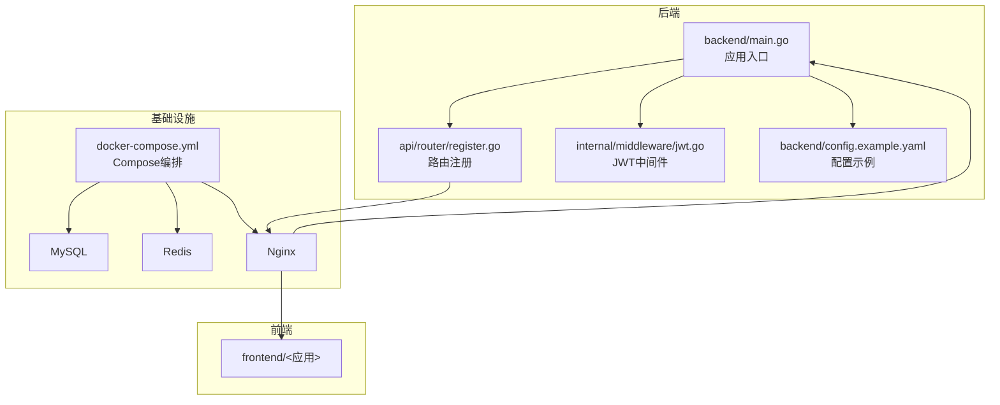
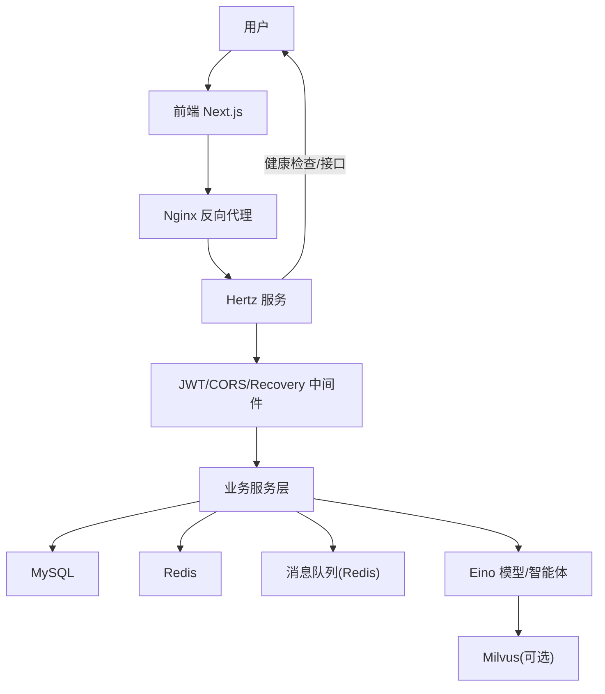
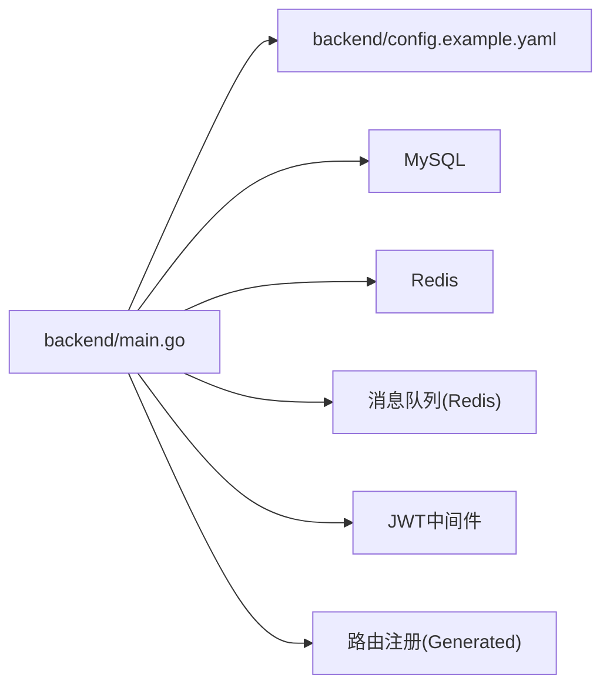

# 开发流程与协作

<cite>
**本文引用的文件**
- [README.md](file://README.md)
- [go.mod](file://go.mod)
- [backend/main.go](file://backend/main.go)
- [backend/api/router/register.go](file://backend/api/router/register.go)
- [backend/internal/middleware/jwt.go](file://backend/internal/middleware/jwt.go)
- [backend/config.example.yaml](file://backend/config.example.yaml)
- [docker-compose.yml](file://docker-compose.yml)
- [doc/后端架构设计.md](file://doc/后端架构设计.md)
- [doc/技术实现方案.md](file://doc/技术实现方案.md)
- [doc/AI编程开发规范.md](file://doc/AI编程开发规范.md)
- [doc/Go_编译错误排查指南.md](file://doc/Go_编译错误排查指南.md)
- [backend/.gitignore](file://backend/.gitignore)
</cite>

## 目录
1. [简介](#简介)
2. [项目结构](#项目结构)
3. [核心组件](#核心组件)
4. [架构总览](#架构总览)
5. [详细组件分析](#详细组件分析)
6. [依赖关系分析](#依赖关系分析)
7. [性能考量](#性能考量)
8. [故障排查指南](#故障排查指南)
9. [结论](#结论)
10. [附录](#附录)

## 简介
本指南面向“面试吧 - AI智能面试平台”的开发与协作，围绕Git工作流、分支策略、提交规范、合并流程、版本发布策略，以及从需求分析到代码实现再到测试验证的完整开发流程展开；同时提供代码评审、问题跟踪、团队协作规范，开发工具使用建议（IDE配置、调试、性能分析），文档更新与变更日志维护，知识分享机制，以及新成员入职指导与常见协作问题解决方案。本指南以仓库现有代码与文档为基础，结合后端Hertz框架、Eino框架、AI智能体、容器化部署等实际实现，形成可落地的团队协作标准。

## 项目结构
项目采用前后端分离架构，后端基于Hertz与Eino，前端基于Next.js，辅以Docker Compose进行本地与多环境部署。后端核心入口负责加载配置、初始化数据库/缓存、消息队列、JWT中间件与路由注册；配置文件集中管理服务、数据库、Redis、AI与向量检索等参数；文档目录包含架构设计、技术方案、开发规范与问题排查指南。

图表来源
- [backend/main.go](file://backend/main.go#L29-L173)
- [backend/api/router/register.go](file://backend/api/router/register.go#L11-L15)
- [backend/internal/middleware/jwt.go](file://backend/internal/middleware/jwt.go#L32-L78)
- [backend/config.example.yaml](file://backend/config.example.yaml#L1-L127)
- [docker-compose.yml](file://docker-compose.yml#L1-L226)

章节来源
- [README.md](file://README.md#L35-L137)
- [backend/main.go](file://backend/main.go#L29-L173)
- [backend/api/router/register.go](file://backend/api/router/register.go#L11-L15)
- [backend/internal/middleware/jwt.go](file://backend/internal/middleware/jwt.go#L32-L78)
- [backend/config.example.yaml](file://backend/config.example.yaml#L1-L127)
- [docker-compose.yml](file://docker-compose.yml#L1-L226)

## 核心组件
- 应用入口与生命周期管理：负责加载.env、读取配置、初始化数据库/缓存/消息队列、注册中间件与路由、优雅关闭。
- 路由与中间件：统一CORS、JWT鉴权、错误恢复；路由注册通过IDL生成器集中管理。
- 配置体系：支持环境变量展开、多组件配置（数据库、Redis、Hertz、AI、向量检索、微信、飞书等）。
- 容器化与编排：Docker Compose提供MySQL、Redis、后端、前端、Nginx的本地与多环境部署。

章节来源
- [backend/main.go](file://backend/main.go#L29-L173)
- [backend/api/router/register.go](file://backend/api/router/register.go#L11-L15)
- [backend/internal/middleware/jwt.go](file://backend/internal/middleware/jwt.go#L32-L78)
- [backend/config.example.yaml](file://backend/config.example.yaml#L1-L127)
- [docker-compose.yml](file://docker-compose.yml#L1-L226)

## 架构总览
后端采用Hertz作为HTTP框架，Eino作为AI能力载体，结合JWT认证、Redis缓存、MySQL持久化、消息队列（Redis）与可选向量检索（Milvus）等组件，形成高可用、可扩展的服务架构。前端通过Next.js提供用户交互界面，Nginx作为反向代理统一入口。

图表来源
- [doc/后端架构设计.md](file://doc/后端架构设计.md#L24-L109)
- [backend/main.go](file://backend/main.go#L101-L128)
- [backend/internal/middleware/jwt.go](file://backend/internal/middleware/jwt.go#L32-L78)
- [docker-compose.yml](file://docker-compose.yml#L144-L206)

章节来源
- [doc/后端架构设计.md](file://doc/后端架构设计.md#L1-L484)
- [README.md](file://README.md#L9-L34)

## 详细组件分析

### Git工作流与分支策略
- 基线分支：main/master 用于发布稳定版本，受保护分支策略限制直接推送。
- 功能分支：feature/<功能名>，从develop或main切出，完成开发后合并回develop。
- 预发布分支：release/<版本号>，从develop切出，进行回归测试与最终修复，完成后合并至main并打标签。
- 热修复分支：hotfix/<问题编号>，从main切出，紧急修复后同时合并回main与develop。
- 合并与审核：所有合并必须通过Pull Request（PR），至少一名Reviewer批准，CI通过后方可合并。

章节来源
- [README.md](file://README.md#L158-L308)

### 提交规范
- 类型与主题：type(scope): subject
  - type：feat、fix、docs、style、refactor、perf、test、chore、revert
  - scope：模块名（如api、service、middleware、chatApp）
  - subject：简短描述，不超过50字符
- 说明：正文与脚注遵循Angular规范，必要时引用Issue编号。

章节来源
- [README.md](file://README.md#L158-L308)

### 合并流程与代码评审
- PR模板：包含变更描述、影响范围、测试验证、风险评估、回滚预案。
- 评审要求：至少1人批准；涉及配置、安全、核心链路需2人以上批准。
- CI要求：Lint、单元测试、集成测试全部通过；Docker构建成功。
- 合并策略：squash合并保持提交历史整洁；rebase保持线性历史。

章节来源
- [doc/AI编程开发规范.md](file://doc/AI编程开发规范.md#L67-L80)

### 版本发布策略
- 语义化版本：主版本号.次版本号.修订号（MAJOR.MINOR.PATCH）
- 发布节奏：小版本（MINOR）按月，热修复（PATCH）随时，大版本（MAJOR）谨慎。
- 发布清单：变更日志、配置迁移说明、数据库迁移脚本、部署清单、回滚方案。
- 标签与发布：main合并后打tag并发布Release，同步更新Changelog。

章节来源
- [README.md](file://README.md#L158-L308)

### 功能开发标准流程
- 需求分析：评审需求文档，拆解任务，评估工作量与依赖。
- 设计与评审：输出技术方案（参考“技术实现方案”），评审通过后进入开发。
- 开发与测试：单元测试覆盖率≥80%，集成测试覆盖关键路径。
- 文档与变更：更新API文档、架构图、部署说明；维护变更日志。
- 上线与验证：灰度发布，监控指标，回滚预案就绪。

章节来源
- [doc/技术实现方案.md](file://doc/技术实现方案.md#L743-L768)
- [README.md](file://README.md#L271-L276)

### 代码审查流程
- 触发：提交PR即触发审查流程。
- 要点：可复用性、接口一致性、错误处理、性能与安全、可测试性。
- 工具：Reviewable/Code Review工具，结合静态检查与测试报告。
- 结果：批准后合并，拒绝需修改后重新审查。

章节来源
- [doc/AI编程开发规范.md](file://doc/AI编程开发规范.md#L67-L80)

### 问题跟踪机制
- Issue模板：缺陷、需求、任务、技术债、安全问题。
- 分类标签：bug、enhancement、documentation、security、performance、help wanted。
- 优先级：P0（阻塞性）、P1（高）、P2（中）、P3（低）。
- 生命周期：新建→分配→修复→验证→关闭；热修复走hotfix流程。

章节来源
- [README.md](file://README.md#L158-L308)

### 团队协作规范
- 沟通渠道：Slack/飞书群组，每日站会，迭代回顾。
- 文档共享：Confluence/Wiki，变更日志集中维护。
- 知识分享：双周技术分享、代码走读、新人导师制。
- 责任矩阵：RACI模型明确各模块Owner与参与者。

章节来源
- [doc/后端架构设计.md](file://doc/后端架构设计.md#L458-L484)

### 开发工具使用指南
- IDE配置：Go插件启用gofmt/golines/golangci-lint；VS Code/GoLand推荐配置见项目根目录Go模块与依赖说明。
- 调试技巧：使用Delve调试后端；前端使用React DevTools与Redux DevTools；后端结合日志与pprof。
- 性能分析：CPU/内存/网络分析，结合Prometheus/Grafana与APM工具；后端使用pprof定位热点。
- 依赖与版本：Go Modules锁定版本，定期tidy；注意Go版本与依赖兼容性（参考“Go编译错误排查指南”）。

章节来源
- [go.mod](file://go.mod#L1-L4)
- [doc/Go_编译错误排查指南.md](file://doc/Go_编译错误排查指南.md#L1-L143)

### 文档更新与变更日志
- 文档更新：随功能开发同步更新README、架构设计、技术方案与API文档。
- 变更日志：按版本维护Changelog，记录新增、修复、废弃与破坏性变更。
- 知识库：建立FAQ与最佳实践库，沉淀常见问题与解决方案。

章节来源
- [README.md](file://README.md#L158-L308)
- [doc/后端架构设计.md](file://doc/后端架构设计.md#L458-L484)

### 新成员入职指导
- 环境准备：安装Go、MySQL、Redis、Docker；克隆仓库，配置.env与config.yaml。
- 快速上手：运行docker-compose，访问健康检查与API端点；阅读README与架构文档。
- 第一个任务：从good first issue开始，熟悉PR流程与代码风格。
- 导师制度：每位新成员配备导师，协助完成首次贡献。

章节来源
- [README.md](file://README.md#L158-L308)
- [docker-compose.yml](file://docker-compose.yml#L1-L226)

### 常见协作问题与解决方案
- 依赖冲突：按“Go编译错误排查指南”处理版本兼容问题，必要时降级或替换依赖。
- 配置漂移：统一使用config.yaml与环境变量，避免硬编码；通过.env与CI变量管理敏感信息。
- 跨模块耦合：遵循“AI编程开发规范”，模块化复用，避免重复逻辑。
- 评审阻塞：提前在Issue中澄清需求与边界，减少往返修改。

章节来源
- [doc/Go_编译错误排查指南.md](file://doc/Go_编译错误排查指南.md#L88-L137)
- [doc/AI编程开发规范.md](file://doc/AI编程开发规范.md#L6-L18)
- [backend/config.example.yaml](file://backend/config.example.yaml#L1-L127)

## 依赖关系分析
后端入口依赖配置加载、数据库/缓存初始化、消息队列与中间件；路由注册集中于生成器；JWT中间件贯穿鉴权；配置示例文件提供多组件参数模板；Compose编排统一服务生命周期。

图表来源
- [backend/main.go](file://backend/main.go#L38-L100)
- [backend/api/router/register.go](file://backend/api/router/register.go#L11-L15)
- [backend/internal/middleware/jwt.go](file://backend/internal/middleware/jwt.go#L32-L78)
- [backend/config.example.yaml](file://backend/config.example.yaml#L1-L127)

章节来源
- [backend/main.go](file://backend/main.go#L38-L100)
- [backend/api/router/register.go](file://backend/api/router/register.go#L11-L15)
- [backend/internal/middleware/jwt.go](file://backend/internal/middleware/jwt.go#L32-L78)
- [backend/config.example.yaml](file://backend/config.example.yaml#L1-L127)

## 性能考量
- 缓存策略：Redis缓存热点数据与会话，降低数据库压力。
- 异步处理：消息队列处理耗时任务（简历分析、报告生成），提升响应速度。
- 数据库优化：合理索引、读写分离、连接池参数调优。
- 服务降级：熔断与限流，保障核心功能可用性。
- 监控与告警：集成Prometheus/Grafana与日志分析，持续优化。

章节来源
- [doc/后端架构设计.md](file://doc/后端架构设计.md#L425-L442)

## 故障排查指南
- 编译错误：Go版本与依赖不兼容导致链接失败，按“Go编译错误排查指南”升级Go版本或替换依赖。
- 配置问题：检查config.yaml与环境变量展开是否正确；敏感信息通过.env注入。
- 服务连通性：使用docker-compose健康检查确认MySQL/Redis服务可用；Nginx反代配置正确。
- JWT鉴权：核对Authorization头格式与签名密钥；检查过期时间与作用域。
- 日志与追踪：开启Hertz日志级别，结合结构化日志定位问题。

章节来源
- [doc/Go_编译错误排查指南.md](file://doc/Go_编译错误排查指南.md#L1-L143)
- [backend/config.example.yaml](file://backend/config.example.yaml#L1-L127)
- [docker-compose.yml](file://docker-compose.yml#L1-L226)
- [backend/internal/middleware/jwt.go](file://backend/internal/middleware/jwt.go#L32-L78)

## 结论
本指南基于项目现有代码与文档，建立了从Git工作流、开发流程、代码评审到运维与故障排查的完整协作体系。建议团队在实践中持续优化流程与工具链，确保高质量交付与可持续演进。

## 附录
- 配置文件位置与加载：入口程序支持从多路径查找config.yaml并展开环境变量。
- 路由注册：通过IDL生成器集中注册，避免遗漏。
- JWT中间件：支持多种令牌来源（Header/Query/Cookie），并提供便捷的用户信息提取。

章节来源
- [backend/main.go](file://backend/main.go#L175-L210)
- [backend/api/router/register.go](file://backend/api/router/register.go#L11-L15)
- [backend/internal/middleware/jwt.go](file://backend/internal/middleware/jwt.go#L186-L214)