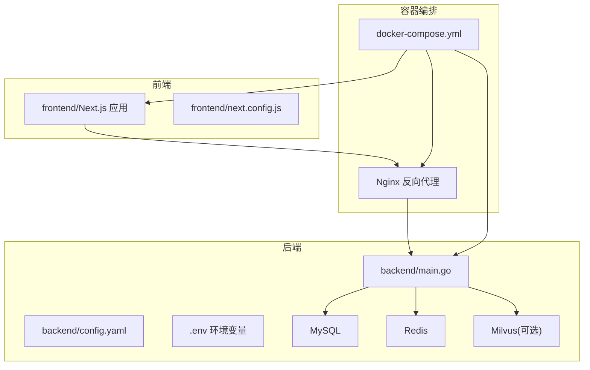
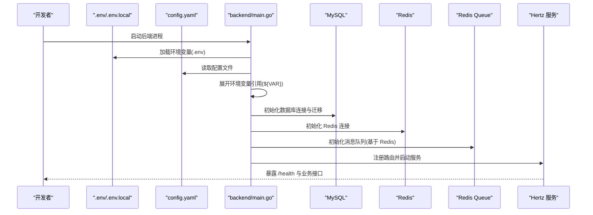
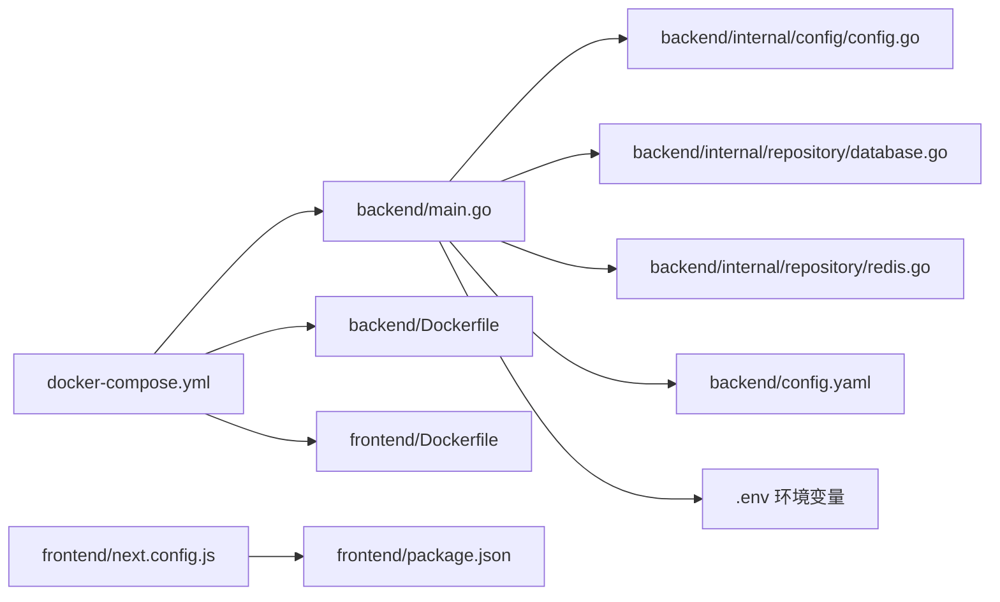

# 开发环境搭建

<cite>
**本文档引用的文件**
- [README.md](file://README.md)
- [backend/Dockerfile](file://backend/Dockerfile)
- [frontend/Dockerfile](file://frontend/Dockerfile)
- [docker-compose.yml](file://docker-compose.yml)
- [docker-compose-prod.yml](file://docker-compose-prod.yml)
- [backend/config.yaml](file://backend/config.yaml)
- [backend/config.example.yaml](file://backend/config.example.yaml)
- [backend/.env](file://backend/.env)
- [backend/main.go](file://backend/main.go)
- [backend/internal/config/config.go](file://backend/internal/config/config.go)
- [backend/internal/repository/database.go](file://backend/internal/repository/database.go)
- [backend/internal/repository/redis.go](file://backend/internal/repository/redis.go)
- [frontend/package.json](file://frontend/package.json)
- [frontend/tsconfig.json](file://frontend/tsconfig.json)
- [frontend/next.config.js](file://frontend/next.config.js)
</cite>

## 目录
1. [简介](#简介)
2. [项目结构](#项目结构)
3. [核心组件](#核心组件)
4. [架构总览](#架构总览)
5. [详细组件分析](#详细组件分析)
6. [依赖关系分析](#依赖关系分析)
7. [性能考虑](#性能考虑)
8. [故障排除指南](#故障排除指南)
9. [结论](#结论)
10. [附录](#附录)

## 简介
本指南面向开发者，提供从零开始搭建 Go 面试 Agent 项目的本地开发环境的完整步骤。内容涵盖：
- 本地开发环境准备：Go 语言、Node.js、数据库、缓存、向量数据库
- Docker 容器化部署：docker-compose 使用与服务启动顺序
- 环境变量配置、配置文件解读与初始化脚本
- 常见问题排查与最佳实践

## 项目结构
项目采用前后端分离架构，后端基于 Hertz 框架与 Eino 框架，前端基于 Next.js。核心目录与职责如下：
- backend：后端服务，包含 API、路由、中间件、配置、数据访问层、业务服务、聊天应用与工具集
- frontend：前端应用，Next.js + TypeScript + Tailwind CSS
- mcpserver：MCP 协议服务
- 根目录：Docker Compose 配置、Nginx 配置、项目说明文档

**图表来源**
- [backend/main.go](file://backend/main.go#L29-L173)
- [backend/config.yaml](file://backend/config.yaml#L1-L129)
- [docker-compose.yml](file://docker-compose.yml#L1-L226)
- [frontend/next.config.js](file://frontend/next.config.js#L1-L11)

**章节来源**
- [README.md](file://README.md#L35-L83)
- [docker-compose.yml](file://docker-compose.yml#L1-L226)

## 核心组件
- 后端服务：Hertz Web 框架 + GORM 数据库 + Redis 缓存 + 可选 Milvus 向量数据库
- 前端应用：Next.js 14 + TypeScript + Tailwind CSS
- 配置体系：YAML 配置文件 + .env 环境变量 + 环境变量展开
- 容器化：多阶段 Dockerfile + docker-compose 编排

**章节来源**
- [backend/main.go](file://backend/main.go#L29-L173)
- [backend/internal/config/config.go](file://backend/internal/config/config.go#L13-L31)
- [backend/Dockerfile](file://backend/Dockerfile#L1-L64)
- [frontend/Dockerfile](file://frontend/Dockerfile#L1-L65)

## 架构总览
后端启动流程概览：加载 .env → 读取 config.yaml → 展开环境变量 → 初始化数据库 → 初始化 Redis → 初始化消息队列 → 注册路由 → 启动 Hertz 服务。

**图表来源**
- [backend/main.go](file://backend/main.go#L29-L173)
- [backend/internal/config/config.go](file://backend/internal/config/config.go#L212-L268)
- [backend/internal/repository/database.go](file://backend/internal/repository/database.go#L18-L60)
- [backend/internal/repository/redis.go](file://backend/internal/repository/redis.go#L16-L33)

**章节来源**
- [backend/main.go](file://backend/main.go#L29-L173)
- [backend/internal/config/config.go](file://backend/internal/config/config.go#L212-L268)

## 详细组件分析

### 本地环境准备

#### Go 语言环境
- 版本要求：Go 1.20+（项目 go.mod 指定 1.24）
- 建议使用版本管理工具（如 sdkman、goenv）管理多版本
- 国内网络建议配置 GOPROXY 以加速依赖下载（Dockerfile 已内置）

**章节来源**
- [README.md](file://README.md#L162-L166)
- [backend/go.mod](file://backend/go.mod#L3-L5)
- [backend/Dockerfile](file://backend/Dockerfile#L14-L15)

#### Node.js 与前端依赖
- 前端使用 Node.js 18 + Next.js 14 + TypeScript
- 安装依赖：npm ci（锁定版本）
- 开发命令：npm run dev；生产构建：npm run build；生产启动：npm start

**章节来源**
- [frontend/package.json](file://frontend/package.json#L1-L37)
- [frontend/tsconfig.json](file://frontend/tsconfig.json#L1-L28)

#### 数据库与缓存
- MySQL：使用 GORM 进行连接与自动迁移
- Redis：用于缓存与消息队列（基于 Redis 的队列）
- 建议先启动 MySQL 与 Redis，再启动后端

**章节来源**
- [backend/internal/repository/database.go](file://backend/internal/repository/database.go#L18-L60)
- [backend/internal/repository/redis.go](file://backend/internal/repository/redis.go#L16-L33)

#### 向量数据库（Milvus，可选）
- 项目提供 Milvus 服务的 docker-compose 配置注释，可按需启用
- 后端已预留 Milvus 初始化逻辑，当前示例配置处于注释状态

**章节来源**
- [docker-compose.yml](file://docker-compose.yml#L97-L127)
- [backend/config.yaml](file://backend/config.yaml#L80-L96)

### 环境变量与配置文件

#### .env 环境变量
- 位置：backend/.env
- 主要用途：Embedding API Key、Milvus 地址、用户名、密码等
- 后端启动时会尝试加载该文件，若不存在则回退到系统环境变量或配置默认值

**章节来源**
- [backend/.env](file://backend/.env#L1-L16)
- [backend/main.go](file://backend/main.go#L30-L36)

#### config.yaml 配置文件
- 位置：backend/config.yaml
- 关键配置项：
  - 服务：host、port、日志
  - 数据库：driver、DSN、连接池参数
  - Redis：地址、密码、DB、超时、连接池
  - 安全：JWT 密钥、CORS
  - AI 服务：OpenAI、Embedding、文档分割器
  - 向量数据库：Milvus（示例配置已注释）
  - 微信、飞书、邮件等扩展配置

**章节来源**
- [backend/config.yaml](file://backend/config.yaml#L1-L129)

#### 环境变量展开机制
- config.go 实现了对配置中 ${VAR_NAME} 与 $VAR_NAME 的展开
- 后端在加载配置后调用 ExpandEnv，确保从 .env 或系统环境变量注入值

**章节来源**
- [backend/internal/config/config.go](file://backend/internal/config/config.go#L212-L268)
- [backend/main.go](file://backend/main.go#L46-L48)

### Docker 容器化部署

#### docker-compose 基础编排
- 服务清单：
  - MySQL：端口映射 3307:3306，健康检查
  - Redis：端口映射 6379:6379，带密码
  - Etcd（Milvus 依赖，可选）
  - 后端：构建并挂载 config.yaml 与日志目录
  - 前端：Next.js 应用，端口 3000
  - Nginx：反向代理，转发 /api 到后端
- 服务依赖：后端 depends_on MySQL 与 Redis（可选 Milvus）

**章节来源**
- [docker-compose.yml](file://docker-compose.yml#L1-L226)

#### docker-compose-prod.yml 生产配置
- 与基础版类似，但移除了部分 Milvus 相关注释，适合生产环境部署

**章节来源**
- [docker-compose-prod.yml](file://docker-compose-prod.yml#L1-L213)

#### Dockerfile 多阶段构建
- 后端：Alpine + golang:1.24，国内 GOPROXY 加速，最终运行在非 root 用户
- 前端：Alpine + node:18，生产环境使用 npm start，健康检查通过 curl

**章节来源**
- [backend/Dockerfile](file://backend/Dockerfile#L1-L64)
- [frontend/Dockerfile](file://frontend/Dockerfile#L1-L65)

#### 启动顺序与健康检查
- 顺序建议：Etcd → MySQL → Redis → Milvus（可选）→ 后端 → 前端 → Nginx
- compose 中通过 healthcheck 与 depends_on condition 控制启动时机

**章节来源**
- [docker-compose.yml](file://docker-compose.yml#L15-L170)

### 开发工具推荐

#### IDE 与编辑器
- VS Code：推荐插件
  - Go：gopls、gotests、Delve 调试
  - YAML：YAML 语法高亮与校验
  - Docker：Dockerfile 与 compose 语法支持
  - ESLint/Prettier：前端代码规范与格式化
- IntelliJ IDEA：Go 插件与 Docker 插件

#### 调试工具
- Go：Delve（dlv）远程/本地调试
- Node.js：Chrome DevTools、VS Code Node 调试
- 数据库：Navicat、DBeaver、MySQL Workbench
- 缓存：Redis Desktop Manager、Redli

#### 前端开发
- Next.js：开发服务器自动热重载
- TypeScript：严格模式与路径别名配置（tsconfig.json）
- 样式：Tailwind CSS + PostCSS

**章节来源**
- [frontend/tsconfig.json](file://frontend/tsconfig.json#L1-L28)
- [frontend/package.json](file://frontend/package.json#L21-L36)

### 环境变量配置清单

- 后端关键变量（来自 .env 与 config.yaml）
  - Embedding：EMBEDDING_API_KEY、EMBEDDING_MODEL、EMBEDDING_BASE_URL、EMBEDDING_REGION
  - Milvus：MILVUS_ADDRESS、MILVUS_USERNAME、MILVUS_PASSWORD
  - 数据库：DB_HOST、DB_PORT、DB_USER、DB_PASSWORD、DB_NAME（compose 环境变量）
  - Redis：REDIS_HOST、REDIS_PORT、REDIS_PASSWORD（compose 环境变量）
  - JWT：security.jwt_secret、security.jwt_expiration（config.yaml）
  - CORS：security.cors.*（config.yaml）

**章节来源**
- [backend/.env](file://backend/.env#L6-L16)
- [backend/config.yaml](file://backend/config.yaml#L5-L49)
- [docker-compose.yml](file://docker-compose.yml#L153-L163)

### 数据库初始化脚本
- 后端通过 GORM 自动迁移创建所需表（用户、面试记录、简历、预测等）
- 若需手动初始化，可参考 db_schema.sql（位于 backend 根目录），将其导入到 MySQL

**章节来源**
- [backend/internal/repository/database.go](file://backend/internal/repository/database.go#L62-L75)
- [README.md](file://README.md#L185-L185)

## 依赖关系分析

**图表来源**
- [backend/main.go](file://backend/main.go#L29-L173)
- [backend/internal/config/config.go](file://backend/internal/config/config.go#L13-L31)
- [backend/internal/repository/database.go](file://backend/internal/repository/database.go#L18-L60)
- [backend/internal/repository/redis.go](file://backend/internal/repository/redis.go#L16-L33)
- [backend/config.yaml](file://backend/config.yaml#L1-L129)
- [docker-compose.yml](file://docker-compose.yml#L1-L226)
- [frontend/next.config.js](file://frontend/next.config.js#L1-L11)
- [frontend/package.json](file://frontend/package.json#L1-L37)

**章节来源**
- [backend/main.go](file://backend/main.go#L29-L173)
- [docker-compose.yml](file://docker-compose.yml#L144-L206)

## 性能考虑
- 连接池：合理设置数据库最大连接数、空闲连接数与生命周期
- Redis：连接池大小与超时配置，避免阻塞
- 日志：生产环境降低日志级别，避免磁盘 IO 压力
- 前端：生产构建与静态资源缓存，减少首屏加载时间
- Milvus：仅在需要向量检索时启用，避免不必要的资源占用

## 故障排除指南

- 后端无法加载 .env
  - 确认 .env 文件存在且与 main.go 同目录
  - 后端会打印警告并回退到系统环境变量或配置默认值

- 数据库连接失败
  - 检查 config.yaml 中 DSN 与 compose 环境变量是否一致
  - 确认 MySQL 已启动并通过 healthcheck

- Redis 连接失败
  - 检查 Redis 密码与地址配置
  - compose 中已设置 requirepass，确保与 config.yaml 一致

- Milvus 未启用
  - 当前 config.yaml 中 Milvus 配置为注释状态
  - 如需启用，取消 compose 中 milvus 与 attu 的注释，并确保 Etcd 正常

- 前端无法访问后端 API
  - next.config.js 将 /api 重写到 http://localhost:8888/api
  - 若使用 Docker，需调整重写目标或使用服务名

- 健康检查失败
  - 后端与前端 Dockerfile 均包含 HEALTHCHECK
  - 使用 docker compose ps 查看服务状态，必要时查看容器日志

**章节来源**
- [backend/main.go](file://backend/main.go#L30-L36)
- [backend/config.yaml](file://backend/config.yaml#L6-L22)
- [docker-compose.yml](file://docker-compose.yml#L15-L19)
- [frontend/next.config.js](file://frontend/next.config.js#L1-L11)

## 结论
通过本指南，您可以快速完成本地开发环境搭建与容器化部署。建议：
- 先在本地运行 MySQL 与 Redis，再启动后端，确保数据库与缓存可用
- 使用 docker-compose 一键启动，便于复现与协作
- 配置好 .env 与 config.yaml，确保 API Key、数据库与缓存参数正确
- 如需向量检索功能，再启用 Milvus 服务

## 附录

### 常用命令
- 启动容器编排：docker compose up -d
- 查看服务状态：docker compose ps
- 查看日志：docker compose logs -f 服务名
- 停止容器：docker compose down
- 前端开发：npm run dev（frontend 目录）
- 后端开发：go run main.go（backend 目录）

**章节来源**
- [docker-compose.yml](file://docker-compose.yml#L1-L226)
- [frontend/package.json](file://frontend/package.json#L5-L10)
- [backend/main.go](file://backend/main.go#L29-L173)